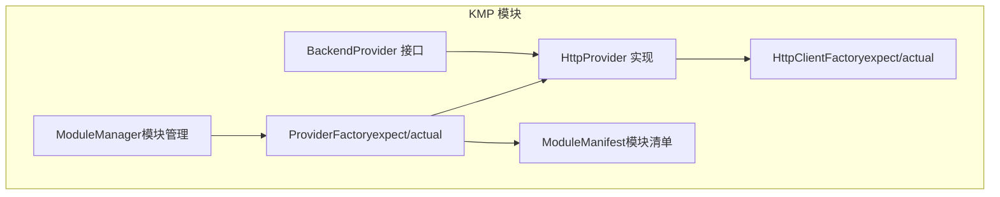
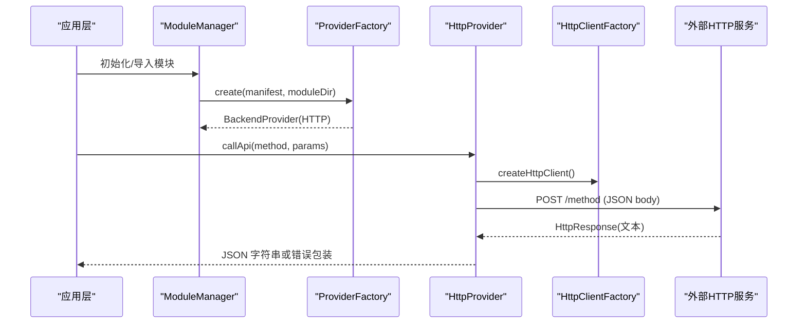
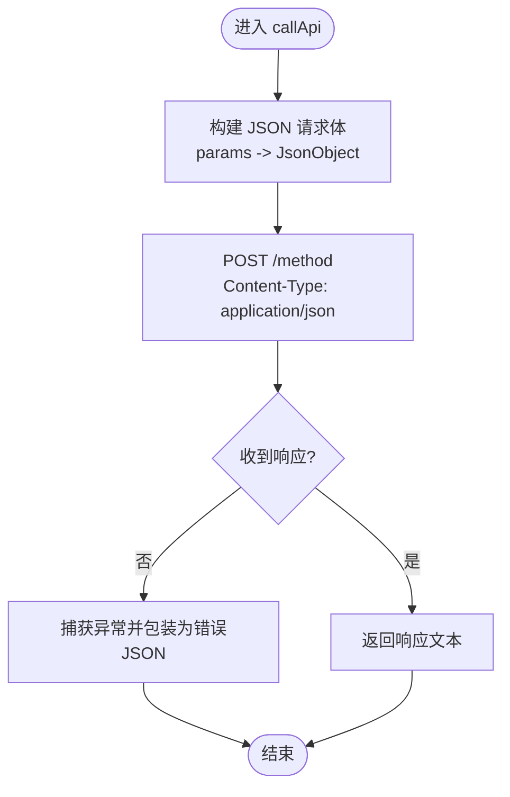
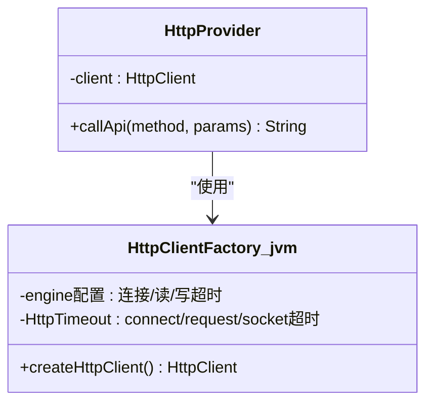
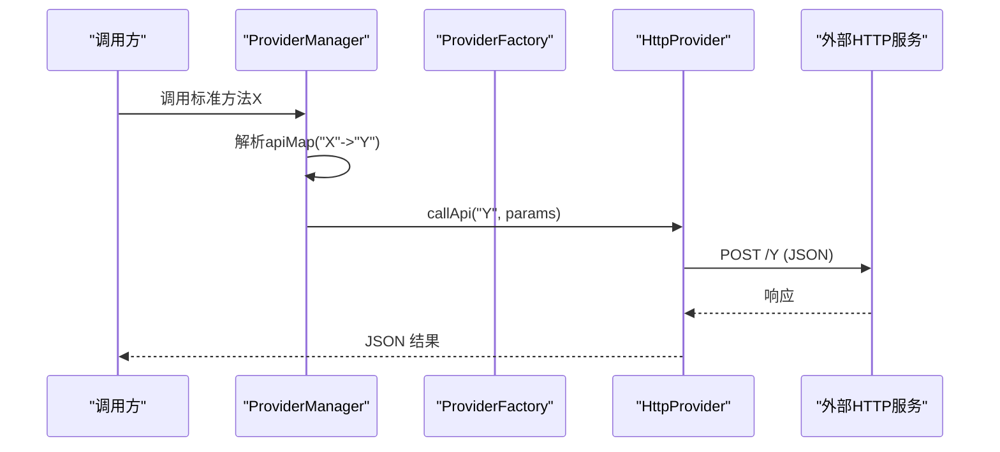
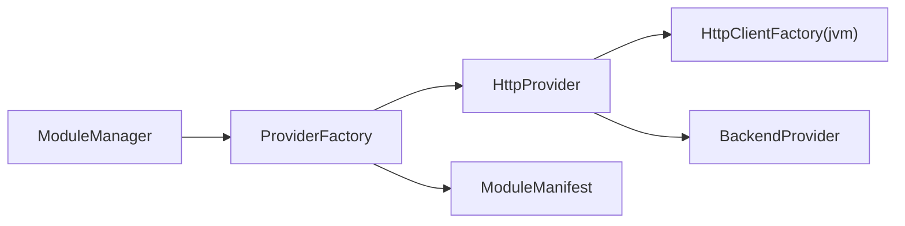

# HTTP Provider 实现

<cite>
**本文引用的文件**
- [HttpProvider.kt](file://kmp-pro/src/commonMain/kotlin/cp/player/kmp/provider/HttpProvider.kt)
- [HttpClientFactory.kt（commonMain）](file://kmp-pro/src/commonMain/kotlin/cp/player/kmp/util/HttpClientFactory.kt)
- [HttpClientFactory.kt（jvmMain）](file://kmp-pro/src/jvmMain/kotlin/cp/player/kmp/util/HttpClientFactory.kt)
- [BackendProvider.kt](file://kmp-pro/src/commonMain/kotlin/cp/player/kmp/provider/BackendProvider.kt)
- [ModuleManifest.kt](file://kmp-pro/src/commonMain/kotlin/cp/player/kmp/provider/ModuleManifest.kt)
- [ProviderFactory.kt（commonMain）](file://kmp-pro/src/commonMain/kotlin/cp/player/kmp/provider/ProviderFactory.kt)
- [ProviderFactory.kt（jvmMain）](file://kmp-pro/src/jvmMain/kotlin/cp/player/kmp/provider/ProviderFactory.kt)
- [ModuleManager.kt](file://kmp-pro/src/commonMain/kotlin/cp/player/kmp/provider/ModuleManager.kt)
</cite>

## 目录
1. [简介](#简介)
2. [项目结构](#项目结构)
3. [核心组件](#核心组件)
4. [架构总览](#架构总览)
5. [详细组件分析](#详细组件分析)
6. [依赖关系分析](#依赖关系分析)
7. [性能考量](#性能考量)
8. [故障排查指南](#故障排查指南)
9. [结论](#结论)
10. [附录：配置与扩展指南](#附录：配置与扩展指南)

## 简介
本技术文档围绕基于 Ktor 的 HTTP Provider 实现展开，重点说明以下内容：
- 连接池管理、请求重试机制与超时控制
- API 方法映射机制、动态端点配置与参数转换
- 认证状态管理（Cookie 处理与会话保持）
- 网络健康检查、错误处理与降级策略
- 配置示例与自定义 HTTP Provider 开发指南

该实现通过统一的 BackendProvider 接口暴露能力，HTTP Provider 作为其中一种类型，负责将上层调用转发到外部 HTTP API 服务（例如 NeteaseCloudMusicApi）。

## 项目结构
HTTP Provider 位于 kmp-pro 模块中，采用 KMP 分层组织：
- commonMain：定义 Provider 抽象、HTTP Provider 实现、模块清单与工厂期望
- jvmMain：提供平台相关的 HttpClient 实际实现（OkHttp + Ktor HttpTimeout）
- 模块加载与管理由 ModuleManager 与 ProviderFactory 协同完成

图表来源
- [BackendProvider.kt:24-96](file://kmp-pro/src/commonMain/kotlin/cp/player/kmp/provider/BackendProvider.kt#L24-L96)
- [HttpProvider.kt:23-57](file://kmp-pro/src/commonMain/kotlin/cp/player/kmp/provider/HttpProvider.kt#L23-L57)
- [ProviderFactory.kt（commonMain）:11-20](file://kmp-pro/src/commonMain/kotlin/cp/player/kmp/provider/ProviderFactory.kt#L11-L20)
- [ProviderFactory.kt（jvmMain）:7-30](file://kmp-pro/src/jvmMain/kotlin/cp/player/kmp/provider/ProviderFactory.kt#L7-L30)
- [ModuleManifest.kt:5-31](file://kmp-pro/src/commonMain/kotlin/cp/player/kmp/provider/ModuleManifest.kt#L5-L31)
- [ModuleManager.kt:19-48](file://kmp-pro/src/commonMain/kotlin/cp/player/kmp/provider/ModuleManager.kt#L19-L48)

章节来源
- [BackendProvider.kt:24-96](file://kmp-pro/src/commonMain/kotlin/cp/player/kmp/provider/BackendProvider.kt#L24-L96)
- [HttpProvider.kt:23-57](file://kmp-pro/src/commonMain/kotlin/cp/player/kmp/provider/HttpProvider.kt#L23-L57)
- [ProviderFactory.kt（jvmMain）:7-30](file://kmp-pro/src/jvmMain/kotlin/cp/player/kmp/provider/ProviderFactory.kt#L7-L30)
- [ModuleManifest.kt:5-31](file://kmp-pro/src/commonMain/kotlin/cp/player/kmp/provider/ModuleManifest.kt#L5-L31)
- [ModuleManager.kt:19-48](file://kmp-pro/src/commonMain/kotlin/cp/player/kmp/provider/ModuleManager.kt#L19-L48)

## 核心组件
- BackendProvider：统一抽象，定义 id、name、version、type、apiMap、updateUrl、targetAppPackage、startServer/stopServer、callApi、analyzeAudio、isReady 等能力。HTTP Provider 属于 ProviderType.HTTP。
- HttpProvider：基于 Ktor 的 HTTP 客户端实现，负责将 callApi(method, params) 转换为 JSON POST 请求到 baseUrl/method，返回响应文本；异常时返回统一错误 JSON。
- HttpClientFactory：在 commonMain 声明 expect，在 jvmMain 使用 OkHttp 引擎并安装 HttpTimeout，设置连接/读写/请求超时。
- ProviderFactory：根据 manifest.type 创建具体 Provider；当 type 为 "http" 时构造 HttpProvider，并将 entryPoint 作为 baseUrl。
- ModuleManifest：描述模块元数据，包括 id、name、version、type、entryPoint、apiMap、updateUrl、supportedAbis、targetAppPackage。
- ModuleManager：扫描 modulesDir，加载 manifest.json，创建 Provider 并维护可用列表，支持导入/删除等操作。

章节来源
- [BackendProvider.kt:24-96](file://kmp-pro/src/commonMain/kotlin/cp/player/kmp/provider/BackendProvider.kt#L24-L96)
- [HttpProvider.kt:23-57](file://kmp-pro/src/commonMain/kotlin/cp/player/kmp/provider/HttpProvider.kt#L23-L57)
- [HttpClientFactory.kt（commonMain）:5-10](file://kmp-pro/src/commonMain/kotlin/cp/player/kmp/util/HttpClientFactory.kt#L5-L10)
- [HttpClientFactory.kt（jvmMain）:8-21](file://kmp-pro/src/jvmMain/kotlin/cp/player/kmp/util/HttpClientFactory.kt#L8-L21)
- [ProviderFactory.kt（jvmMain）:7-30](file://kmp-pro/src/jvmMain/kotlin/cp/player/kmp/provider/ProviderFactory.kt#L7-L30)
- [ModuleManifest.kt:5-31](file://kmp-pro/src/commonMain/kotlin/cp/player/kmp/provider/ModuleManifest.kt#L5-L31)
- [ModuleManager.kt:19-48](file://kmp-pro/src/commonMain/kotlin/cp/player/kmp/provider/ModuleManager.kt#L19-L48)

## 架构总览
HTTP Provider 的调用链路从模块加载到网络请求如下：

图表来源
- [ModuleManager.kt:88-117](file://kmp-pro/src/commonMain/kotlin/cp/player/kmp/provider/ModuleManager.kt#L88-L117)
- [ProviderFactory.kt（jvmMain）:7-30](file://kmp-pro/src/jvmMain/kotlin/cp/player/kmp/provider/ProviderFactory.kt#L7-L30)
- [HttpProvider.kt:41-57](file://kmp-pro/src/commonMain/kotlin/cp/player/kmp/provider/HttpProvider.kt#L41-L57)
- [HttpClientFactory.kt（commonMain）:5-10](file://kmp-pro/src/commonMain/kotlin/cp/player/kmp/util/HttpClientFactory.kt#L5-L10)
- [HttpClientFactory.kt（jvmMain）:8-21](file://kmp-pro/src/jvmMain/kotlin/cp/player/kmp/util/HttpClientFactory.kt#L8-L21)

## 详细组件分析

### HttpProvider：API 调用与参数转换
- 职责：将 method 与 params 组装为 JSON 请求体，POST 至 baseUrl/method，返回响应文本；捕获异常并返回统一错误 JSON。
- 参数转换：params Map<String,String> 被序列化为 JSON 对象，值以 JsonPrimitive 包裹后放入请求体。
- 同步契约：callApi 是同步接口，内部使用 runBlocking 执行异步 IO 操作。
- 内容类型：请求头设置为 application/json。

图表来源
- [HttpProvider.kt:41-57](file://kmp-pro/src/commonMain/kotlin/cp/player/kmp/provider/HttpProvider.kt#L41-L57)

章节来源
- [HttpProvider.kt:41-57](file://kmp-pro/src/commonMain/kotlin/cp/player/kmp/provider/HttpProvider.kt#L41-L57)

### 超时控制与连接池
- 超时控制：通过 Ktor 的 HttpTimeout 插件设置 connect/request/socket 超时；底层 OkHttp 也设置了连接/读/写超时。
- 连接池：当前实现未显式配置连接池大小或复用策略，默认使用 OkHttp 引擎的默认行为。如需优化并发与资源占用，可在 jvmMain 的 HttpClientFactory 中进一步配置连接池参数。

图表来源
- [HttpClientFactory.kt（jvmMain）:8-21](file://kmp-pro/src/jvmMain/kotlin/cp/player/kmp/util/HttpClientFactory.kt#L8-L21)
- [HttpProvider.kt:35-57](file://kmp-pro/src/commonMain/kotlin/cp/player/kmp/provider/HttpProvider.kt#L35-L57)

章节来源
- [HttpClientFactory.kt（jvmMain）:8-21](file://kmp-pro/src/jvmMain/kotlin/cp/player/kmp/util/HttpClientFactory.kt#L8-L21)
- [HttpProvider.kt:35-57](file://kmp-pro/src/commonMain/kotlin/cp/player/kmp/provider/HttpProvider.kt#L35-L57)

### 请求重试机制
- 现状：当前实现未内置重试逻辑。
- 建议：可在 jvmMain 的 HttpClientFactory 中安装重试插件（如 Retry），并结合业务语义（幂等性、错误码）配置最大重试次数与退避策略。

[本节为通用建议，不直接分析具体文件]

### API 方法映射与动态端点配置
- apiMap：在 ModuleManifest 中声明，key 为 CPPlayer 内部标准方法名，value 为 Provider 实际端点名。若值为 "unsupported"，表示不支持；为 null 则直接使用内部方法名。
- 动态端点：ProviderFactory 在创建 HttpProvider 时将 manifest.entryPoint 作为 baseUrl，从而支持不同后端地址。
- 调用流程：上层调用先经 apiMap 映射得到实际 method，再交由 HttpProvider 发起请求。

图表来源
- [BackendProvider.kt:37-46](file://kmp-pro/src/commonMain/kotlin/cp/player/kmp/provider/BackendProvider.kt#L37-L46)
- [ProviderFactory.kt（jvmMain）:7-30](file://kmp-pro/src/jvmMain/kotlin/cp/player/kmp/provider/ProviderFactory.kt#L7-L30)
- [HttpProvider.kt:41-57](file://kmp-pro/src/commonMain/kotlin/cp/player/kmp/provider/HttpProvider.kt#L41-L57)

章节来源
- [BackendProvider.kt:37-46](file://kmp-pro/src/commonMain/kotlin/cp/player/kmp/provider/BackendProvider.kt#L37-L46)
- [ProviderFactory.kt（jvmMain）:7-30](file://kmp-pro/src/jvmMain/kotlin/cp/player/kmp/provider/ProviderFactory.kt#L7-L30)
- [HttpProvider.kt:41-57](file://kmp-pro/src/commonMain/kotlin/cp/player/kmp/provider/HttpProvider.kt#L41-L57)

### 认证状态管理（Cookie 与会话保持）
- 现状：当前 HttpProvider 未显式维护 Cookie 或会话；请求体仅包含 params。
- 建议：
  - 在 jvmMain 的 HttpClientFactory 中配置 CookieManager 以持久化 Cookie。
  - 在 HttpProvider 中注入认证上下文（如 token、cookie），并在请求前附加必要头部或参数。
  - 结合 Provider 的生命周期进行会话刷新与失效处理。

[本节为通用建议，不直接分析具体文件]

### 网络健康检查
- isReady：BackendProvider 默认返回 true；对于 JNI/Binary 类型可重载以实现更严格的就绪检查。HTTP Provider 可通过额外方法对 baseUrl 进行连通性探测（例如轻量 GET /health）。
- 建议：在 ProviderManager 切换 Provider 前调用 isReady 或自定义健康检查，避免使用不可用实例。

章节来源
- [BackendProvider.kt:87-96](file://kmp-pro/src/commonMain/kotlin/cp/player/kmp/provider/BackendProvider.kt#L87-L96)

### 错误处理与降级策略
- 错误处理：HttpProvider 捕获所有异常并返回统一错误 JSON（code=500，msg 包含异常信息）。
- 降级策略：
  - 在网络不可达或服务端错误时，可考虑返回缓存数据或空结果（需结合上层业务）。
  - 建议在 HttpClientFactory 中增加重试与熔断逻辑，提升鲁棒性。

章节来源
- [HttpProvider.kt:41-57](file://kmp-pro/src/commonMain/kotlin/cp/player/kmp/provider/HttpProvider.kt#L41-L57)

## 依赖关系分析
- HttpProvider 依赖：
  - Ktor Client（通过 HttpClientFactory）
  - kotlinx.serialization（JSON 序列化）
  - BackendProvider 接口
- ProviderFactory 依赖：
  - ModuleManifest（读取 type、entryPoint、apiMap 等）
  - PlatformSupport（二进制/JNI 路径解析，HTTP 类型无需）
- ModuleManager 依赖：
  - PlatformSupport（文件系统操作）
  - ProviderFactory（创建 Provider）
  - BackendProvider（统一能力）

图表来源
- [ModuleManager.kt:88-117](file://kmp-pro/src/commonMain/kotlin/cp/player/kmp/provider/ModuleManager.kt#L88-L117)
- [ProviderFactory.kt（jvmMain）:7-30](file://kmp-pro/src/jvmMain/kotlin/cp/player/kmp/provider/ProviderFactory.kt#L7-L30)
- [HttpProvider.kt:23-57](file://kmp-pro/src/commonMain/kotlin/cp/player/kmp/provider/HttpProvider.kt#L23-L57)
- [HttpClientFactory.kt（jvmMain）:8-21](file://kmp-pro/src/jvmMain/kotlin/cp/player/kmp/util/HttpClientFactory.kt#L8-L21)
- [ModuleManifest.kt:5-31](file://kmp-pro/src/commonMain/kotlin/cp/player/kmp/provider/ModuleManifest.kt#L5-L31)
- [BackendProvider.kt:24-96](file://kmp-pro/src/commonMain/kotlin/cp/player/kmp/provider/BackendProvider.kt#L24-L96)

章节来源
- [ModuleManager.kt:88-117](file://kmp-pro/src/commonMain/kotlin/cp/player/kmp/provider/ModuleManager.kt#L88-L117)
- [ProviderFactory.kt（jvmMain）:7-30](file://kmp-pro/src/jvmMain/kotlin/cp/player/kmp/provider/ProviderFactory.kt#L7-L30)
- [HttpProvider.kt:23-57](file://kmp-pro/src/commonMain/kotlin/cp/player/kmp/provider/HttpProvider.kt#L23-L57)
- [HttpClientFactory.kt（jvmMain）:8-21](file://kmp-pro/src/jvmMain/kotlin/cp/player/kmp/util/HttpClientFactory.kt#L8-L21)
- [ModuleManifest.kt:5-31](file://kmp-pro/src/commonMain/kotlin/cp/player/kmp/provider/ModuleManifest.kt#L5-L31)
- [BackendProvider.kt:24-96](file://kmp-pro/src/commonMain/kotlin/cp/player/kmp/provider/BackendProvider.kt#L24-L96)

## 性能考量
- 连接池：当前未显式配置，建议使用 OkHttp 默认连接池并根据并发需求调整。
- 超时：已设置合理的连接/读写/请求超时，可根据网络环境调优。
- 重试：建议引入指数退避重试，针对幂等请求提高成功率。
- 序列化：JSON 序列化开销较小，但大量并发下可考虑复用 Json 实例（当前已复用）。
- 线程模型：callApi 使用 runBlocking 桥接同步接口，应避免在高并发场景频繁阻塞主线程。

[本节为通用建议，不直接分析具体文件]

## 故障排查指南
- 常见问题
  - 模块加载失败：检查 manifest.json 是否存在且格式正确；确认 type 与平台 ABI 匹配。
  - Provider 未就绪：isReady 返回 false 时，查看具体原因（JNI/Binary 类型常见）。
  - 网络请求失败：检查 baseUrl 是否可达；确认超时配置是否合理；查看异常消息。
- 定位步骤
  - 查看 ModuleManager.lastLoadError 获取最近一次导入/加载失败的原因。
  - 在 jvmMain 的 HttpClientFactory 中开启日志（如 Ktor 日志）观察请求与响应。
  - 对 HttpProvider.callApi 的异常信息进行记录，便于快速定位问题。

章节来源
- [ModuleManager.kt:29-31](file://kmp-pro/src/commonMain/kotlin/cp/player/kmp/provider/ModuleManager.kt#L29-L31)
- [ModuleManager.kt:88-117](file://kmp-pro/src/commonMain/kotlin/cp/player/kmp/provider/ModuleManager.kt#L88-L117)
- [HttpProvider.kt:41-57](file://kmp-pro/src/commonMain/kotlin/cp/player/kmp/provider/HttpProvider.kt#L41-L57)

## 结论
HTTP Provider 提供了简洁可靠的 HTTP 通信能力，通过 BackendProvider 抽象屏蔽了底层差异，配合 ProviderFactory 与 ModuleManager 实现了模块化的后端接入。当前实现具备基础的超时控制与错误包装，尚未内置重试与 Cookie 管理。建议在生产环境中按需增强连接池、重试、认证与健康检查，以提升稳定性与可维护性。

[本节为总结性内容，不直接分析具体文件]

## 附录：配置与扩展指南

### 配置示例（manifest.json）
- 关键字段
  - id/name/version：模块标识与版本
  - type：固定为 "http"
  - entryPoint：后端服务基础地址（baseUrl）
  - apiMap：方法名映射表（可选）
  - updateUrl：更新检查端点（可选）
  - targetAppPackage：目标 App 包名（Android 登录跳转，可选）

章节来源
- [ModuleManifest.kt:5-31](file://kmp-pro/src/commonMain/kotlin/cp/player/kmp/provider/ModuleManifest.kt#L5-L31)

### 自定义 HTTP Provider 开发指南
- 继承 BackendProvider 并实现 callApi、analyzeAudio、isReady 等方法
- 在 jvmMain 中通过 ProviderFactory 注册类型为 "http" 的 Provider
- 在 ModuleManifest 中声明 apiMap 与 entryPoint，实现动态端点与方法映射
- 如需 Cookie/Token 管理，可在 jvmMain 的 HttpClientFactory 中配置 CookieManager 或在 Provider 中注入认证上下文
- 如需重试/熔断，可在 HttpClientFactory 中安装相应插件并配置策略

章节来源
- [BackendProvider.kt:24-96](file://kmp-pro/src/commonMain/kotlin/cp/player/kmp/provider/BackendProvider.kt#L24-L96)
- [ProviderFactory.kt（jvmMain）:7-30](file://kmp-pro/src/jvmMain/kotlin/cp/player/kmp/provider/ProviderFactory.kt#L7-L30)
- [HttpClientFactory.kt（jvmMain）:8-21](file://kmp-pro/src/jvmMain/kotlin/cp/player/kmp/util/HttpClientFactory.kt#L8-L21)