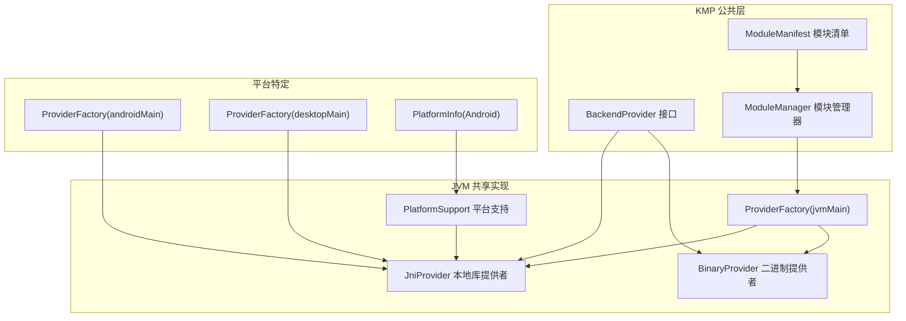
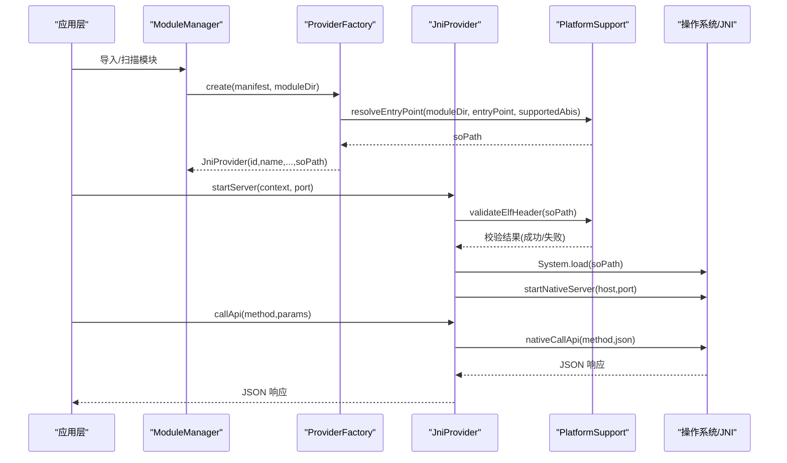
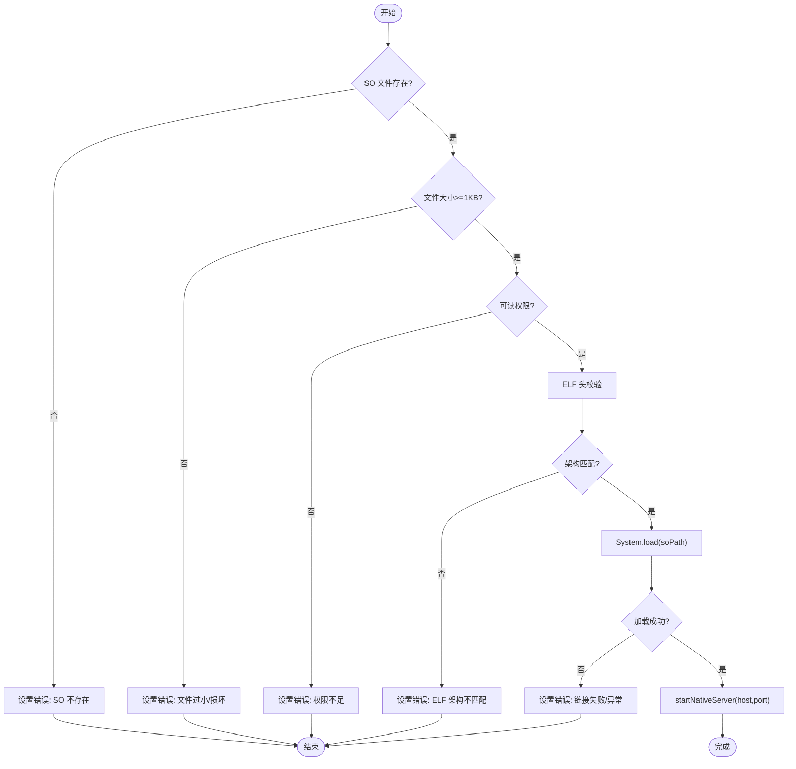
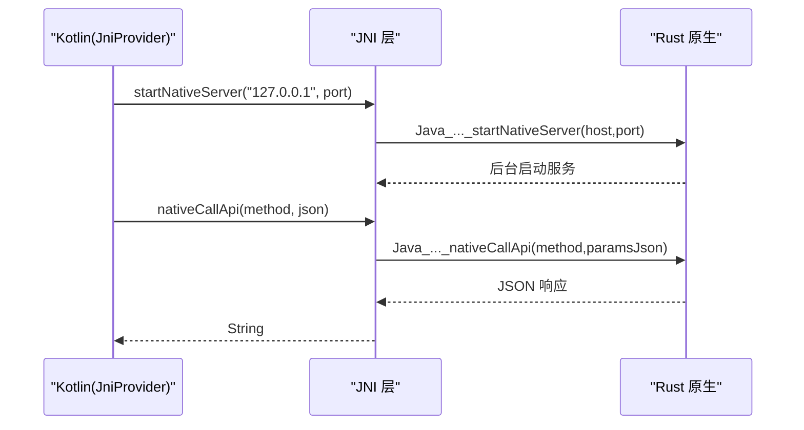
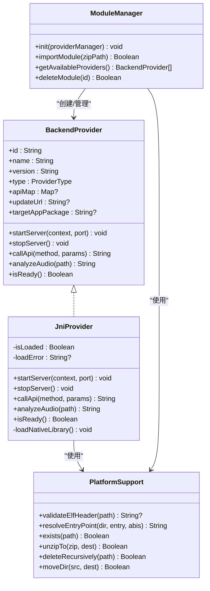

# JNI Provider 实现

<cite>
**本文引用的文件**
- [JniProvider.kt](file://kmp-pro/src/jvmMain/kotlin/cp/player/kmp/provider/JniProvider.kt)
- [BinaryProvider.kt](file://kmp-pro/src/jvmMain/kotlin/cp/player/kmp/provider/BinaryProvider.kt)
- [BackendProvider.kt](file://kmp-pro/src/commonMain/kotlin/cp/player/kmp/provider/BackendProvider.kt)
- [PlatformSupport.kt](file://kmp-pro/src/jvmMain/kotlin/cp/player/kmp/util/PlatformSupport.kt)
- [ModuleManager.kt](file://kmp-pro/src/commonMain/kotlin/cp/player/kmp/provider/ModuleManager.kt)
- [ModuleManifest.kt](file://kmp-pro/src/commonMain/kotlin/cp/player/kmp/provider/ModuleManifest.kt)
- [ProviderFactory.kt（jvmMain）](file://kmp-pro/src/jvmMain/kotlin/cp/player/kmp/provider/ProviderFactory.kt)
- [ProviderFactory.kt（androidMain）](file://kmp-pro/src/androidMain/kotlin/cp/player/kmp/provider/ProviderFactory.kt)
- [ProviderFactory.kt（desktopMain）](file://kmp-pro/src/desktopMain/kotlin/cp/player/kmp/provider/ProviderFactory.kt)
- [PlatformInfo.kt（Android）](file://kmp-pro/src/androidMain/kotlin/cp/player/kmp/util/PlatformInfo.kt)
- [jni.rs（Rust 原生 JNI 入口）](file://API_MODULE_AND_OLD_PROJECT_REPO/3rd-CPPlayer-netcloudMusic-Muti/src/util/jni.rs)
- [build_module.sh](file://API_MODULE_AND_OLD_PROJECT_REPO/3rd-CPPlayer-netcloudMusic-Muti/build_module.sh)
- [build_module_desktop.sh](file://API_MODULE_AND_OLD_PROJECT_REPO/3rd-CPPlayer-netcloudMusic-Muti/build_module_desktop.sh)
</cite>

## 目录
1. [简介](#简介)
2. [项目结构](#项目结构)
3. [核心组件](#核心组件)
4. [架构总览](#架构总览)
5. [详细组件分析](#详细组件分析)
6. [依赖关系分析](#依赖关系分析)
7. [性能与内存优化](#性能与内存优化)
8. [故障排查指南](#故障排查指南)
9. [结论](#结论)
10. [附录：原生代码开发指南](#附录：原生代码开发指南)

## 简介
本技术文档围绕 CPPlayer KMP 中的 JNI Provider 实现，系统阐述本地库加载机制、.so 文件管理、JNI 接口调用、数据类型映射、异常处理策略，以及 Android 与 Desktop 平台的差异与适配方案。同时提供性能优化建议、内存泄漏防护、调试技巧与常见问题解决方案，帮助开发者高效构建和维护基于 JNI 的后端模块。

## 项目结构
JNI Provider 位于 KMP 的 jvmMain 层，通过 expect/actual 机制在 androidMain 与 desktopMain 中分别创建具体实例；模块管理与平台能力抽象在 commonMain 与 jvmMain 中统一实现。

图表来源
- [BackendProvider.kt:24-96](file://kmp-pro/src/commonMain/kotlin/cp/player/kmp/provider/BackendProvider.kt#L24-L96)
- [ModuleManifest.kt:5-31](file://kmp-pro/src/commonMain/kotlin/cp/player/kmp/provider/ModuleManifest.kt#L5-L31)
- [ModuleManager.kt:19-48](file://kmp-pro/src/commonMain/kotlin/cp/player/kmp/provider/ModuleManager.kt#L19-L48)
- [JniProvider.kt:9-38](file://kmp-pro/src/jvmMain/kotlin/cp/player/kmp/provider/JniProvider.kt#L9-L38)
- [BinaryProvider.kt:25-49](file://kmp-pro/src/jvmMain/kotlin/cp/player/kmp/provider/BinaryProvider.kt#L25-L49)
- [PlatformSupport.kt:67-121](file://kmp-pro/src/jvmMain/kotlin/cp/player/kmp/util/PlatformSupport.kt#L67-L121)
- [ProviderFactory.kt（jvmMain）:5-31](file://kmp-pro/src/jvmMain/kotlin/cp/player/kmp/provider/ProviderFactory.kt#L5-L31)
- [ProviderFactory.kt（androidMain）:1-13](file://kmp-pro/src/androidMain/kotlin/cp/player/kmp/provider/ProviderFactory.kt#L1-L13)
- [ProviderFactory.kt（desktopMain）:1-13](file://kmp-pro/src/desktopMain/kotlin/cp/player/kmp/provider/ProviderFactory.kt#L1-L13)
- [PlatformInfo.kt（Android）:6-12](file://kmp-pro/src/androidMain/kotlin/cp/player/kmp/util/PlatformInfo.kt#L6-L12)

章节来源
- [BackendProvider.kt:24-96](file://kmp-pro/src/commonMain/kotlin/cp/player/kmp/provider/BackendProvider.kt#L24-L96)
- [ModuleManager.kt:19-48](file://kmp-pro/src/commonMain/kotlin/cp/player/kmp/provider/ModuleManager.kt#L19-L48)
- [PlatformSupport.kt:67-121](file://kmp-pro/src/jvmMain/kotlin/cp/player/kmp/util/PlatformSupport.kt#L67-L121)

## 核心组件
- BackendProvider：定义统一的 Provider 接口，包含启动/停止服务、调用 API、音频分析、就绪状态检查等。
- JniProvider：负责 .so 本地库加载、JNI 方法声明与调用、错误捕获与状态维护。
- BinaryProvider：通过进程启动独立可执行文件并以 HTTP 通信，作为对比参考。
- PlatformSupport：提供 ELF 头校验、ABI 解析、端口探测、解压、文件操作等通用能力。
- ModuleManager：扫描并加载模块，按 manifest.json 创建 Provider，维护可用列表与最近错误信息。
- ModuleManifest：描述模块元数据（id、name、version、type、entryPoint、supportedAbis、apiMap、updateUrl、targetAppPackage）。
- ProviderFactory：根据 manifest.type 创建对应 Provider；androidMain/desktopMain 提供 createJniProvider 的具体实现。

章节来源
- [BackendProvider.kt:24-96](file://kmp-pro/src/commonMain/kotlin/cp/player/kmp/provider/BackendProvider.kt#L24-L96)
- [JniProvider.kt:9-38](file://kmp-pro/src/jvmMain/kotlin/cp/player/kmp/provider/JniProvider.kt#L9-L38)
- [BinaryProvider.kt:25-49](file://kmp-pro/src/jvmMain/kotlin/cp/player/kmp/provider/BinaryProvider.kt#L25-L49)
- [PlatformSupport.kt:67-121](file://kmp-pro/src/jvmMain/kotlin/cp/player/kmp/util/PlatformSupport.kt#L67-L121)
- [ModuleManager.kt:88-123](file://kmp-pro/src/commonMain/kotlin/cp/player/kmp/provider/ModuleManager.kt#L88-L123)
- [ModuleManifest.kt:5-31](file://kmp-pro/src/commonMain/kotlin/cp/player/kmp/provider/ModuleManifest.kt#L5-L31)
- [ProviderFactory.kt（jvmMain）:5-31](file://kmp-pro/src/jvmMain/kotlin/cp/player/kmp/provider/ProviderFactory.kt#L5-L31)

## 架构总览
JNI Provider 的工作流包括：模块导入与扫描、manifest 解析、ABI 匹配与入口路径解析、ELF 头校验、动态库加载、JNI 服务启动、API 调用与结果返回。

图表来源
- [ModuleManager.kt:50-54](file://kmp-pro/src/commonMain/kotlin/cp/player/kmp/provider/ModuleManager.kt#L50-L54)
- [ProviderFactory.kt（jvmMain）:7-27](file://kmp-pro/src/jvmMain/kotlin/cp/player/kmp/provider/ProviderFactory.kt#L7-L27)
- [PlatformSupport.kt:67-82](file://kmp-pro/src/jvmMain/kotlin/cp/player/kmp/util/PlatformSupport.kt#L67-L82)
- [JniProvider.kt:39-55](file://kmp-pro/src/jvmMain/kotlin/cp/player/kmp/provider/JniProvider.kt#L39-L55)
- [JniProvider.kt:61-84](file://kmp-pro/src/jvmMain/kotlin/cp/player/kmp/provider/JniProvider.kt#L61-L84)
- [PlatformSupport.kt:89-121](file://kmp-pro/src/jvmMain/kotlin/cp/player/kmp/util/PlatformSupport.kt#L89-L121)

## 详细组件分析

### JniProvider：本地库加载与 JNI 调用
- 本地库加载流程：
  - 构造时记录 soPath，若文件不存在则记录错误。
  - startServer 中执行 loadNativeLibrary：
    - 检查文件存在性、大小阈值、可读权限。
    - 使用 PlatformSupport.validateElfHeader 校验 ELF 魔数与架构匹配。
    - 调用 System.load 完成动态链接，成功后标记 isLoaded=true。
  - 启动本地服务：startNativeServer("127.0.0.1", port)。
- API 调用流程：
  - 将 params Map 序列化为 JSON 字符串后调用 nativeCallApi。
  - 捕获异常并将崩溃信息写入 loadError，返回统一错误 JSON。
- 音频分析：
  - analyzeAudioFile 直接桥接到原生实现，异常同样被捕获并返回错误 JSON。
- 日志与诊断：
  - 内部 log 输出关键步骤，便于定位问题。

图表来源
- [JniProvider.kt:98-136](file://kmp-pro/src/jvmMain/kotlin/cp/player/kmp/provider/JniProvider.kt#L98-L136)
- [PlatformSupport.kt:89-121](file://kmp-pro/src/jvmMain/kotlin/cp/player/kmp/util/PlatformSupport.kt#L89-L121)

章节来源
- [JniProvider.kt:9-38](file://kmp-pro/src/jvmMain/kotlin/cp/player/kmp/provider/JniProvider.kt#L9-L38)
- [JniProvider.kt:39-55](file://kmp-pro/src/jvmMain/kotlin/cp/player/kmp/provider/JniProvider.kt#L39-L55)
- [JniProvider.kt:61-84](file://kmp-pro/src/jvmMain/kotlin/cp/player/kmp/provider/JniProvider.kt#L61-L84)
- [JniProvider.kt:98-136](file://kmp-pro/src/jvmMain/kotlin/cp/player/kmp/provider/JniProvider.kt#L98-L136)

### 平台差异与适配：Android vs Desktop
- Android：
  - createJniProvider 返回 JniProvider 实例，支持 .so 加载与 JNI 调用。
  - PlatformInfo.supportedAbis 来自 Build.SUPPORTED_ABIS，用于 ABI 匹配。
- Desktop：
  - README 指出 JNI 模块仅在 Android 端可用；Desktop 上 createJniProvider 返回 null，模块标记不可用。
  - 当前仓库中 desktopMain 的 createJniProvider 仍返回 JniProvider 实例，但实际运行需确保目标平台具备相应 native 库与运行时环境。
- 适配要点：
  - 通过 Manifest 的 supportedAbis 声明多架构支持，由 PlatformSupport.resolveEntryPoint 自动选择正确 ABI 下的入口文件。
  - 使用 PlatformSupport.validateElfHeader 进行前置校验，避免加载不兼容的二进制。

章节来源
- [ProviderFactory.kt（androidMain）:1-13](file://kmp-pro/src/androidMain/kotlin/cp/player/kmp/provider/ProviderFactory.kt#L1-L13)
- [ProviderFactory.kt（desktopMain）:1-13](file://kmp-pro/src/desktopMain/kotlin/cp/player/kmp/provider/ProviderFactory.kt#L1-L13)
- [PlatformInfo.kt（Android）:6-12](file://kmp-pro/src/androidMain/kotlin/cp/player/kmp/util/PlatformInfo.kt#L6-L12)
- [README.md:167-167](file://README.md#L167-L167)

### 模块加载与 ABI 解析
- ModuleManager 扫描 modulesDir，读取每个子目录的 manifest.json，调用 ProviderFactory.create 创建 Provider。
- 对于 jni 类型：
  - 使用 PlatformSupport.resolveEntryPoint 按 supportedAbis 与平台 ABI 顺序查找 lib/{abi}/entryPoint。
  - 若找不到匹配文件，返回 null，并在 lastLoadError 中提示“缺少与当前平台 ABI 匹配的 native 库文件”。
- 就绪检查：
  - 调用 provider.isReady()，对 JNI 类型会在 .so 加载失败时返回 false。
  - 通过反射获取 getLoadError 以提取详细错误信息。

章节来源
- [ModuleManager.kt:50-54](file://kmp-pro/src/commonMain/kotlin/cp/player/kmp/provider/ModuleManager.kt#L50-L54)
- [ModuleManager.kt:88-123](file://kmp-pro/src/commonMain/kotlin/cp/player/kmp/provider/ModuleManager.kt#L88-L123)
- [ProviderFactory.kt（jvmMain）:23-27](file://kmp-pro/src/jvmMain/kotlin/cp/player/kmp/provider/ProviderFactory.kt#L23-L27)
- [PlatformSupport.kt:67-82](file://kmp-pro/src/jvmMain/kotlin/cp/player/kmp/util/PlatformSupport.kt#L67-L82)

### 原生函数调用接口与数据类型映射
- JNI 暴露的 Java 外部方法：
  - startNativeServer(host: String, port: Int)
  - nativeCallApi(method: String, paramsJson: String): String
  - analyzeAudioFile(path: String): String
- Rust 侧入口示例：
  - Java_cp_player_kmp_provider_JniProvider_startNativeServer
  - Java_cp_player_kmp_provider_JniProvider_nativeCallApi
- 数据类型映射：
  - Kotlin String ↔ Rust JString → String
  - Kotlin Int ↔ Rust i32
  - 参数与返回值均以 JSON 字符串传递，简化跨语言序列化。
- 调用时序：

图表来源
- [JniProvider.kt:35-37](file://kmp-pro/src/jvmMain/kotlin/cp/player/kmp/provider/JniProvider.kt#L35-L37)
- [jni.rs:38-80](file://API_MODULE_AND_OLD_PROJECT_REPO/3rd-CPPlayer-netcloudMusic-Muti/src/util/jni.rs#L38-L80)
- [jni.rs:82-92](file://API_MODULE_AND_OLD_PROJECT_REPO/3rd-CPPlayer-netcloudMusic-Muti/src/util/jni.rs#L82-L92)

章节来源
- [JniProvider.kt:35-37](file://kmp-pro/src/jvmMain/kotlin/cp/player/kmp/provider/JniProvider.kt#L35-L37)
- [jni.rs:38-80](file://API_MODULE_AND_OLD_PROJECT_REPO/3rd-CPPlayer-netcloudMusic-Muti/src/util/jni.rs#L38-L80)
- [jni.rs:82-92](file://API_MODULE_AND_OLD_PROJECT_REPO/3rd-CPPlayer-netcloudMusic-Muti/src/util/jni.rs#L82-L92)

### 异常处理与错误传播
- 加载阶段：
  - 文件不存在、过小、不可读、ELF 架构不匹配均会设置 loadError 并阻止加载。
  - System.load 抛出 UnsatisfiedLinkError 或 Exception 时，记录错误并标记未就绪。
- 调用阶段：
  - nativeCallApi 与 analyzeAudioFile 的异常被捕获，更新 loadError 并返回统一错误 JSON（code=500）。
- 模块加载阶段：
  - ModuleManager 在创建 Provider 失败或未就绪时，记录 lastLoadError，便于 UI 展示。

章节来源
- [JniProvider.kt:23-33](file://kmp-pro/src/jvmMain/kotlin/cp/player/kmp/provider/JniProvider.kt#L23-L33)
- [JniProvider.kt:61-84](file://kmp-pro/src/jvmMain/kotlin/cp/player/kmp/provider/JniProvider.kt#L61-L84)
- [JniProvider.kt:98-136](file://kmp-pro/src/jvmMain/kotlin/cp/player/kmp/provider/JniProvider.kt#L98-L136)
- [ModuleManager.kt:91-123](file://kmp-pro/src/commonMain/kotlin/cp/player/kmp/provider/ModuleManager.kt#L91-L123)

## 依赖关系分析
- JniProvider 依赖：
  - PlatformSupport：ELF 校验、ABI 解析、文件操作。
  - PlatformContext：平台上下文（如 Android Context）。
  - System.load：JVM 动态库加载。
- 模块管理依赖：
  - ModuleManifest：模块元数据。
  - ProviderFactory：按类型创建 Provider。
  - PlatformSupport：目录列举、解压、移动、删除。
- 原生依赖：
  - Rust 原生库通过 JNI 暴露方法，遵循 JNI 命名规范与签名约定。

图表来源
- [BackendProvider.kt:24-96](file://kmp-pro/src/commonMain/kotlin/cp/player/kmp/provider/BackendProvider.kt#L24-L96)
- [JniProvider.kt:9-38](file://kmp-pro/src/jvmMain/kotlin/cp/player/kmp/provider/JniProvider.kt#L9-L38)
- [PlatformSupport.kt:67-121](file://kmp-pro/src/jvmMain/kotlin/cp/player/kmp/util/PlatformSupport.kt#L67-L121)
- [ModuleManager.kt:19-48](file://kmp-pro/src/commonMain/kotlin/cp/player/kmp/provider/ModuleManager.kt#L19-L48)

章节来源
- [BackendProvider.kt:24-96](file://kmp-pro/src/commonMain/kotlin/cp/player/kmp/provider/BackendProvider.kt#L24-L96)
- [PlatformSupport.kt:67-121](file://kmp-pro/src/jvmMain/kotlin/cp/player/kmp/util/PlatformSupport.kt#L67-L121)
- [ModuleManager.kt:19-48](file://kmp-pro/src/commonMain/kotlin/cp/player/kmp/provider/ModuleManager.kt#L19-L48)

## 性能与内存优化
- 本地库加载优化：
  - 延迟加载：仅在 startServer 时加载 .so，减少启动开销。
  - 前置校验：ELF 头与架构匹配检查，避免无效加载尝试。
  - 文件完整性：大小阈值与可读权限检查，降低崩溃概率。
- 调用性能：
  - 使用 JSON 字符串传递参数与结果，减少复杂对象跨语言拷贝。
  - 避免频繁 JNI 调用，可在原生层批量处理请求。
- 内存管理：
  - 原生侧注意释放临时缓冲区与句柄，避免内存泄漏。
  - 长生命周期对象应明确所有权与生命周期管理。
- 并发与线程：
  - 原生服务应在独立线程或协程中运行，避免阻塞主线程。
  - 合理设置超时与重试策略，提升鲁棒性。

[本节为通用指导，不直接分析具体文件]

## 故障排查指南
- 常见错误与定位：
  - SO 文件不存在：检查模块目录结构与 manifest.entryPoint。
  - ELF 架构不匹配：确认 supportedAbis 与设备 ABI 一致。
  - 权限不足：确保 .so 文件可读。
  - 链接失败：检查依赖库是否完整、路径是否正确。
  - 调用崩溃：查看 JniProvider 的 loadError 与日志输出。
- 调试技巧：
  - 启用日志：关注 [JniProvider] 前缀的输出。
  - 原生日志：Rust 侧使用 tracing-subscriber 或 tracing-android 输出详细日志。
  - 端口探测：使用 PlatformSupport.isPortAvailable 验证端口占用。
- 恢复策略：
  - 重新导入模块：清理旧模块并重新解压。
  - 切换 Provider：确保 isReady() 为 true 后再调用 API。

章节来源
- [JniProvider.kt:23-33](file://kmp-pro/src/jvmMain/kotlin/cp/player/kmp/provider/JniProvider.kt#L23-L33)
- [JniProvider.kt:61-84](file://kmp-pro/src/jvmMain/kotlin/cp/player/kmp/provider/JniProvider.kt#L61-L84)
- [PlatformSupport.kt:19-31](file://kmp-pro/src/jvmMain/kotlin/cp/player/kmp/util/PlatformSupport.kt#L19-L31)
- [ModuleManager.kt:91-123](file://kmp-pro/src/commonMain/kotlin/cp/player/kmp/provider/ModuleManager.kt#L91-L123)

## 结论
JNI Provider 通过统一的 BackendProvider 接口屏蔽了底层实现差异，结合 PlatformSupport 的 ELF 校验与 ABI 解析，实现了安全可靠的本地库加载与调用。Android 与 Desktop 的差异通过 expect/actual 机制与 README 说明得到清晰界定。建议在开发中重视前置校验、异常处理与日志记录，以提升稳定性与可维护性。

[本节为总结，不直接分析具体文件]

## 附录：原生代码开发指南
- 构建与打包：
  - Android 多 ABI 构建：使用 cargo-ndk 编译 arm64-v8a、armeabi-v7a、x86_64，并按 lib/{abi}/ 布局组织 .so 文件。
  - Desktop 构建：根据平台生成对应的动态库（如 Linux 的 .so、macOS 的 .dylib、Windows 的 .dll）。
- 模块包结构：
  - manifest.json 声明 id、name、version、type、entryPoint、supportedAbis、apiMap、updateUrl、targetAppPackage。
  - 入口文件路径由 PlatformSupport.resolveEntryPoint 按 ABI 解析。
- JNI 接口设计：
  - 遵循 JNI 命名规范与方法签名。
  - 使用 JSON 字符串传递复杂数据结构，简化序列化。
- 调试与测试：
  - 启用原生日志，结合 JVM 日志定位问题。
  - 使用最小化用例验证接口行为与异常路径。

章节来源
- [build_module.sh:1-82](file://API_MODULE_AND_OLD_PROJECT_REPO/3rd-CPPlayer-netcloudMusic-Muti/build_module.sh#L1-L82)
- [build_module_desktop.sh:1-55](file://API_MODULE_AND_OLD_PROJECT_REPO/3rd-CPPlayer-netcloudMusic-Muti/build_module_desktop.sh#L1-L55)
- [ModuleManifest.kt:5-31](file://kmp-pro/src/commonMain/kotlin/cp/player/kmp/provider/ModuleManifest.kt#L5-L31)
- [PlatformSupport.kt:67-82](file://kmp-pro/src/jvmMain/kotlin/cp/player/kmp/util/PlatformSupport.kt#L67-L82)
- [jni.rs:38-80](file://API_MODULE_AND_OLD_PROJECT_REPO/3rd-CPPlayer-netcloudMusic-Muti/src/util/jni.rs#L38-L80)
- [jni.rs:82-92](file://API_MODULE_AND_OLD_PROJECT_REPO/3rd-CPPlayer-netcloudMusic-Muti/src/util/jni.rs#L82-L92)