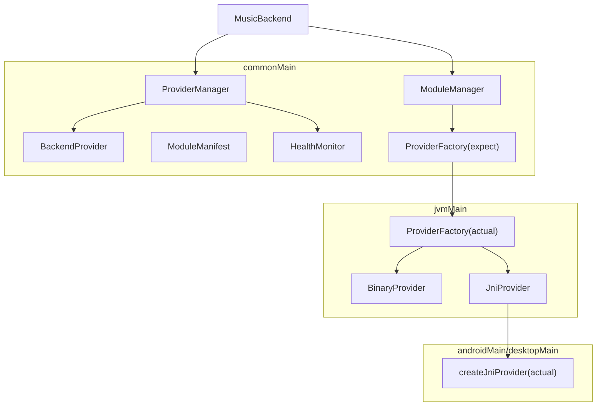
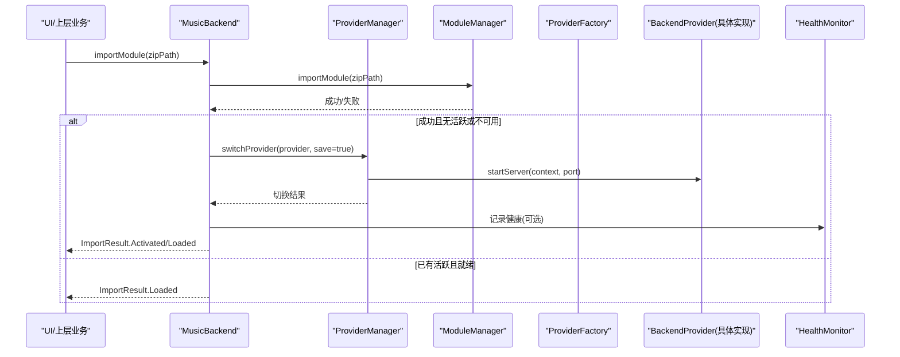
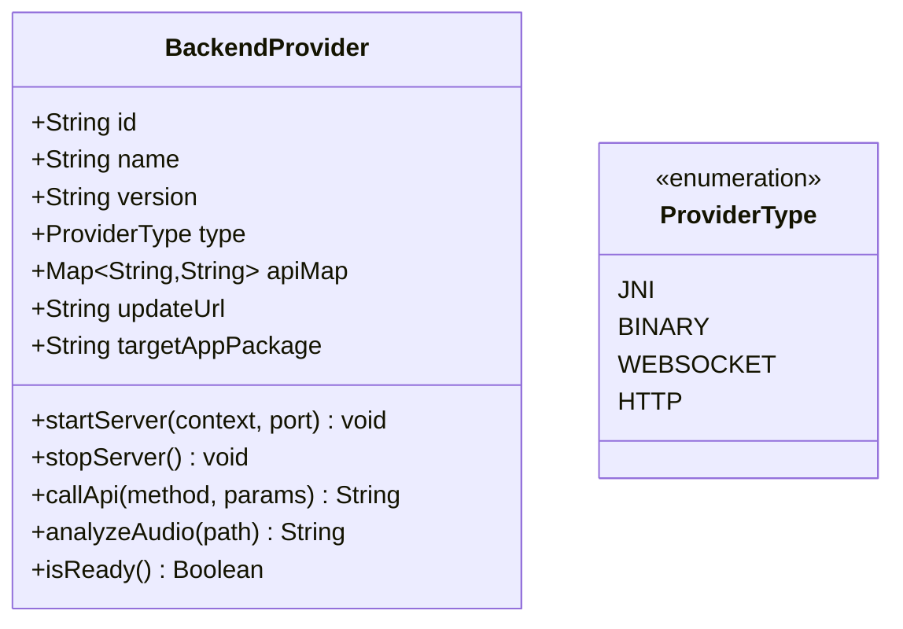
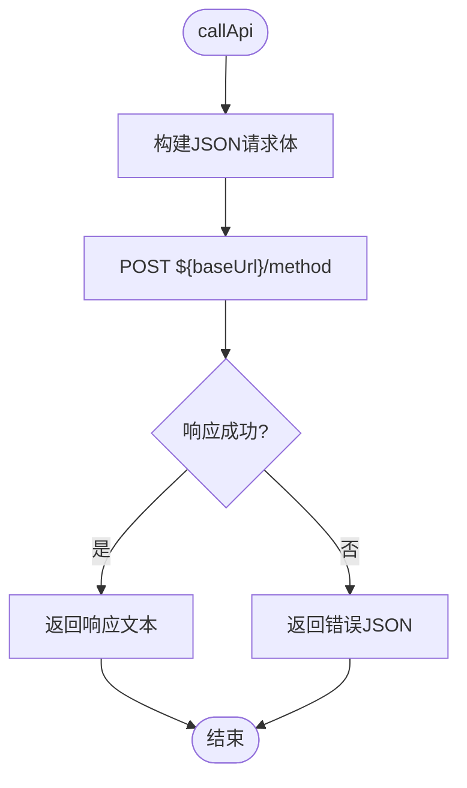
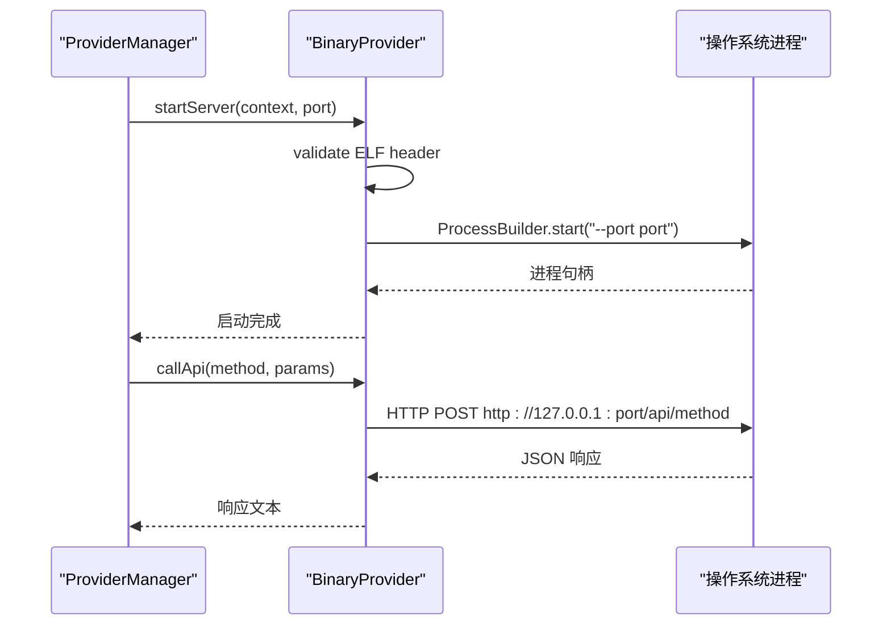
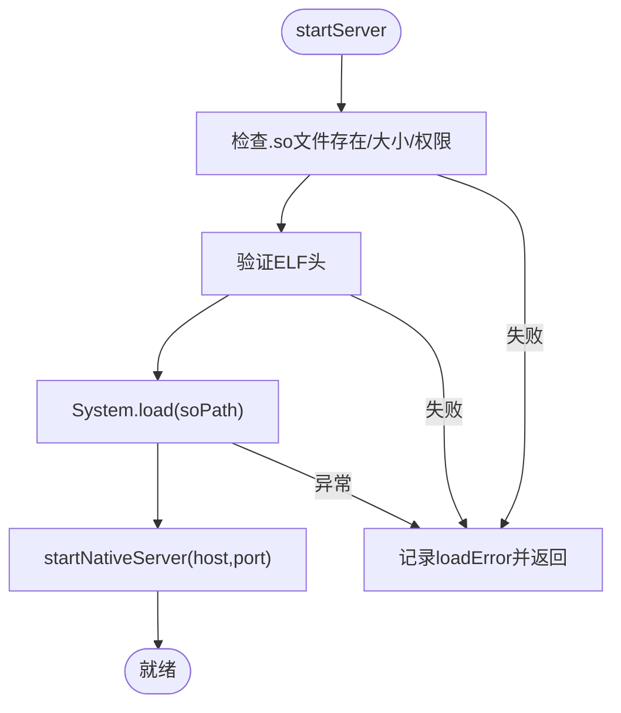
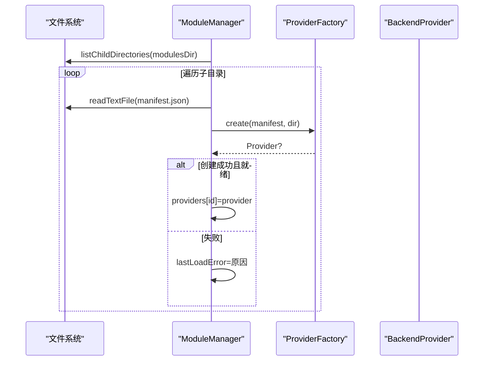
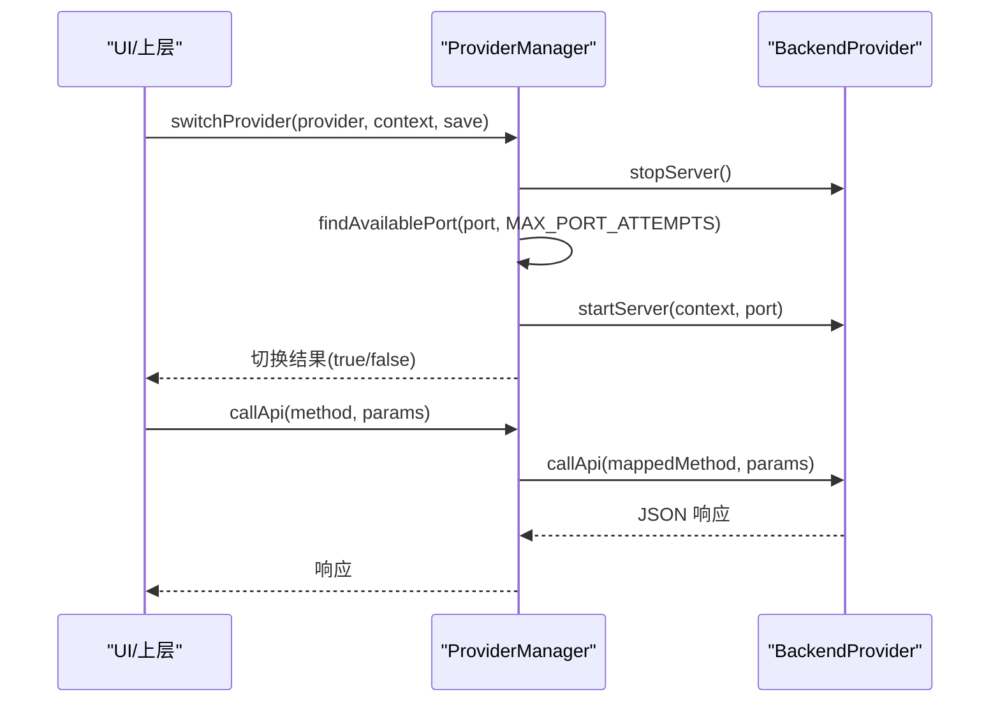
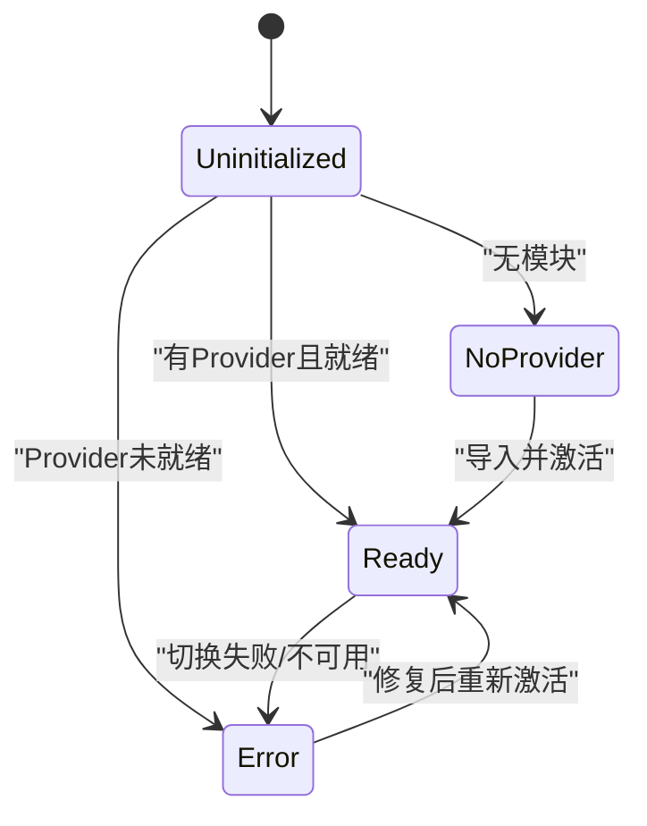
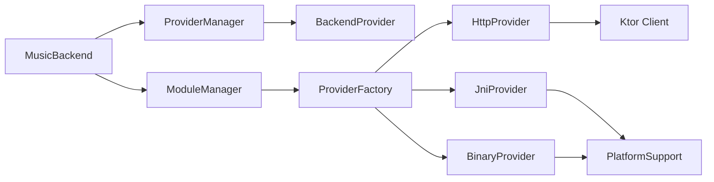

# Provider 插件系统

<cite>
**本文引用的文件**
- [BackendProvider.kt](file://kmp-pro/src/commonMain/kotlin/cp/player/kmp/provider/BackendProvider.kt)
- [HttpProvider.kt](file://kmp-pro/src/commonMain/kotlin/cp/player/kmp/provider/HttpProvider.kt)
- [BinaryProvider.kt](file://kmp-pro/src/jvmMain/kotlin/cp/player/kmp/provider/BinaryProvider.kt)
- [JniProvider.kt](file://kmp-pro/src/jvmMain/kotlin/cp/player/kmp/provider/JniProvider.kt)
- [ModuleManager.kt](file://kmp-pro/src/commonMain/kotlin/cp/player/kmp/provider/ModuleManager.kt)
- [ModuleManifest.kt](file://kmp-pro/src/commonMain/kotlin/cp/player/kmp/provider/ModuleManifest.kt)
- [ProviderFactory.kt](file://kmp-pro/src/commonMain/kotlin/cp/player/kmp/provider/ProviderFactory.kt)
- [ProviderFactory (jvm).kt](file://kmp-pro/src/jvmMain/kotlin/cp/player/kmp/provider/ProviderFactory.kt)
- [ProviderFactory (android).kt](file://kmp-pro/src/androidMain/kotlin/cp/player/kmp/provider/ProviderFactory.kt)
- [ProviderFactory (desktop).kt](file://kmp-pro/src/desktopMain/kotlin/cp/player/kmp/provider/ProviderFactory.kt)
- [ProviderManager.kt](file://kmp-pro/src/commonMain/kotlin/cp/player/kmp/provider/ProviderManager.kt)
- [MusicBackend.kt](file://kmp-pro/src/commonMain/kotlin/cp/player/kmp/MusicBackend.kt)
- [HealthMonitor.kt](file://kmp-pro/src/commonMain/kotlin/cp/player/kmp/monitor/HealthMonitor.kt)
</cite>

## 目录
1. [简介](#简介)
2. [项目结构](#项目结构)
3. [核心组件](#核心组件)
4. [架构总览](#架构总览)
5. [详细组件分析](#详细组件分析)
6. [依赖关系分析](#依赖关系分析)
7. [性能与可用性](#性能与可用性)
8. [故障排查指南](#故障排查指南)
9. [结论](#结论)
10. [附录：开发指南与最佳实践](#附录开发指南与最佳实践)

## 简介
本技术文档围绕 CPPlayer-KMP 的 Provider 插件系统，系统性阐述其插件化架构、BackendProvider 抽象设计以及 HTTP、Binary、JNI 三类 Provider 的具体实现。文档覆盖模块加载机制、生命周期管理、认证状态隔离、健康监控，以及与 MusicBackend 的集成方式、错误处理与降级策略。同时提供自定义 Provider 的开发指南与示例路径，帮助开发者快速扩展新的后端数据源。

## 项目结构
Provider 插件系统位于 kmp-pro 模块中，采用 KMP 分层组织：
- commonMain：定义统一接口 BackendProvider、模块清单 ModuleManifest、工厂 ProviderFactory（expect）、管理器 ModuleManager、ProviderManager、健康监控 HealthMonitor。
- jvmMain：提供 JVM 平台共享的 ProviderFactory actual、BinaryProvider、JniProvider。
- androidMain/desktopMain：提供 createJniProvider 的平台具体实现，用于创建 JniProvider。

图表来源
- [MusicBackend.kt:330-367](file://kmp-pro/src/commonMain/kotlin/cp/player/kmp/MusicBackend.kt#L330-L367)
- [ProviderManager.kt:31-145](file://kmp-pro/src/commonMain/kotlin/cp/player/kmp/provider/ProviderManager.kt#L31-L145)
- [ModuleManager.kt:19-137](file://kmp-pro/src/commonMain/kotlin/cp/player/kmp/provider/ModuleManager.kt#L19-L137)
- [ProviderFactory.kt:11-29](file://kmp-pro/src/commonMain/kotlin/cp/player/kmp/provider/ProviderFactory.kt#L11-L29)
- [ProviderFactory (jvm).kt:5-31](file://kmp-pro/src/jvmMain/kotlin/cp/player/kmp/provider/ProviderFactory.kt#L5-L31)
- [JniProvider.kt:9-142](file://kmp-pro/src/jvmMain/kotlin/cp/player/kmp/provider/JniProvider.kt#L9-L142)
- [BinaryProvider.kt:25-108](file://kmp-pro/src/jvmMain/kotlin/cp/player/kmp/provider/BinaryProvider.kt#L25-L108)
- [HttpProvider.kt:23-60](file://kmp-pro/src/commonMain/kotlin/cp/player/kmp/provider/HttpProvider.kt#L23-L60)

章节来源
- [MusicBackend.kt:330-367](file://kmp-pro/src/commonMain/kotlin/cp/player/kmp/MusicBackend.kt#L330-L367)
- [ProviderManager.kt:31-145](file://kmp-pro/src/commonMain/kotlin/cp/player/kmp/provider/ProviderManager.kt#L31-L145)
- [ModuleManager.kt:19-137](file://kmp-pro/src/commonMain/kotlin/cp/player/kmp/provider/ModuleManager.kt#L19-L137)
- [ProviderFactory.kt:11-29](file://kmp-pro/src/commonMain/kotlin/cp/player/kmp/provider/ProviderFactory.kt#L11-L29)
- [ProviderFactory (jvm).kt:5-31](file://kmp-pro/src/jvmMain/kotlin/cp/player/kmp/provider/ProviderFactory.kt#L5-L31)

## 核心组件
- BackendProvider：统一的音乐后端抽象，定义 id/name/version/type/apiMap/updateUrl/targetAppPackage/startServer/stopServer/callApi/analyzeAudio/isReady 等能力。
- ProviderType：枚举表示实现类型（JNI、BINARY、WEBSOCKET、HTTP）。
- HttpProvider：通过 Ktor 调用外部 HTTP API 服务，start/stop 为空操作。
- BinaryProvider：启动独立可执行进程并通过 HTTP 通信，具备 ELF 校验与端口选择。
- JniProvider：通过 System.load 加载本地库并调用 native 方法，具备加载前检查与崩溃保护。
- ModuleManager：扫描 modulesDir、导入 zip、解析 manifest、创建 Provider、维护可用列表与流式更新。
- ProviderManager：管理当前活跃 Provider、切换、端口分配、持久化最近使用、统一 callApi 转发。
- MusicBackend：应用级后端入口，组合 ProviderManager、ModuleManager、API 缓存与健康监控，暴露统一状态机与高层 API。
- HealthMonitor：记录 API 调用健康指标，支持三级分类与统计查询。

章节来源
- [BackendProvider.kt:24-110](file://kmp-pro/src/commonMain/kotlin/cp/player/kmp/provider/BackendProvider.kt#L24-L110)
- [HttpProvider.kt:23-60](file://kmp-pro/src/commonMain/kotlin/cp/player/kmp/provider/HttpProvider.kt#L23-L60)
- [BinaryProvider.kt:25-108](file://kmp-pro/src/jvmMain/kotlin/cp/player/kmp/provider/BinaryProvider.kt#L25-L108)
- [JniProvider.kt:9-142](file://kmp-pro/src/jvmMain/kotlin/cp/player/kmp/provider/JniProvider.kt#L9-L142)
- [ModuleManager.kt:19-137](file://kmp-pro/src/commonMain/kotlin/cp/player/kmp/provider/ModuleManager.kt#L19-L137)
- [ProviderManager.kt:31-156](file://kmp-pro/src/commonMain/kotlin/cp/player/kmp/provider/ProviderManager.kt#L31-L156)
- [MusicBackend.kt:73-389](file://kmp-pro/src/commonMain/kotlin/cp/player/kmp/MusicBackend.kt#L73-L389)
- [HealthMonitor.kt:25-290](file://kmp-pro/src/commonMain/kotlin/cp/player/kmp/monitor/HealthMonitor.kt#L25-L290)

## 架构总览
Provider 插件系统以 BackendProvider 为契约，通过 ProviderFactory 按 manifest 动态创建具体实现；ModuleManager 负责模块发现与加载；ProviderManager 负责激活与切换；MusicBackend 作为统一入口协调各组件并提供状态机与高层 API；HealthMonitor 贯穿 API 调用链路进行健康度量。

图表来源
- [MusicBackend.kt:189-204](file://kmp-pro/src/commonMain/kotlin/cp/player/kmp/MusicBackend.kt#L189-L204)
- [ModuleManager.kt:57-86](file://kmp-pro/src/commonMain/kotlin/cp/player/kmp/provider/ModuleManager.kt#L57-L86)
- [ProviderManager.kt:80-109](file://kmp-pro/src/commonMain/kotlin/cp/player/kmp/provider/ProviderManager.kt#L80-L109)
- [ProviderFactory (jvm).kt:7-31](file://kmp-pro/src/jvmMain/kotlin/cp/player/kmp/provider/ProviderFactory.kt#L7-L31)

## 详细组件分析

### BackendProvider 抽象与 ProviderType
- 职责：定义所有 Provider 的统一能力边界，包括标识信息、API 映射、更新地址、目标 App 包名、服务启停、API 调用、音频分析与就绪检查。
- 设计要点：
  - apiMap 允许将内部标准方法名映射到 Provider 实际端点，若映射为 unsupported 则标记不支持。
  - isReady 默认 true，JNI 类型在 .so 加载失败时返回 false，便于上游避免使用不可用 Provider。
  - type 区分不同实现类型，便于运行时策略选择。

图表来源
- [BackendProvider.kt:24-110](file://kmp-pro/src/commonMain/kotlin/cp/player/kmp/provider/BackendProvider.kt#L24-L110)

章节来源
- [BackendProvider.kt:24-110](file://kmp-pro/src/commonMain/kotlin/cp/player/kmp/provider/BackendProvider.kt#L24-L110)

### HttpProvider
- 行为：通过 Ktor 发起 POST 请求至 baseUrl/method，参数序列化为 JSON 字符串；start/stop 为空操作；异常时返回统一错误 JSON。
- 适用场景：对接已有 HTTP API 服务（如 NeteaseCloudMusicApi），无需进程管理。

图表来源
- [HttpProvider.kt:41-57](file://kmp-pro/src/commonMain/kotlin/cp/player/kmp/provider/HttpProvider.kt#L41-L57)

章节来源
- [HttpProvider.kt:23-60](file://kmp-pro/src/commonMain/kotlin/cp/player/kmp/provider/HttpProvider.kt#L23-L60)

### BinaryProvider
- 行为：构造函数仅校验二进制文件存在；startServer 执行 ELF 校验、设置可执行权限、ProcessBuilder 启动进程并传入 --port；callApi 通过 HTTP 访问 127.0.0.1:port/api/method；stopServer 销毁进程。
- 健壮性：ELF 头校验、进程启动异常捕获、loadError 记录与 isReady 反馈。

图表来源
- [BinaryProvider.kt:54-104](file://kmp-pro/src/jvmMain/kotlin/cp/player/kmp/provider/BinaryProvider.kt#L54-L104)
- [ProviderManager.kt:65-73](file://kmp-pro/src/commonMain/kotlin/cp/player/kmp/provider/ProviderManager.kt#L65-L73)

章节来源
- [BinaryProvider.kt:25-108](file://kmp-pro/src/jvmMain/kotlin/cp/player/kmp/provider/BinaryProvider.kt#L25-L108)
- [ProviderManager.kt:65-73](file://kmp-pro/src/commonMain/kotlin/cp/player/kmp/provider/ProviderManager.kt#L65-L73)

### JniProvider
- 行为：构造时检查 .so 文件存在性与大小、读取权限；startServer 加载本地库并调用 startNativeServer；callApi/analyzeAudio 通过 external 方法调用 native，异常时回退为错误 JSON 并标记未就绪。
- 健壮性：加载前多重校验、崩溃保护、日志输出、isReady 与 getLoadError 暴露诊断信息。

图表来源
- [JniProvider.kt:39-55](file://kmp-pro/src/jvmMain/kotlin/cp/player/kmp/provider/JniProvider.kt#L39-L55)
- [JniProvider.kt:98-136](file://kmp-pro/src/jvmMain/kotlin/cp/player/kmp/provider/JniProvider.kt#L98-L136)

章节来源
- [JniProvider.kt:9-142](file://kmp-pro/src/jvmMain/kotlin/cp/player/kmp/provider/JniProvider.kt#L9-L142)

### ModuleManager 与 ModuleManifest
- 模块结构：每个子目录包含 manifest.json 与入口（链接库/二进制或 http entryPoint）。
- 功能：扫描目录、导入 zip、解析 manifest、创建 Provider、维护 providersFlow、删除模块。
- Manifest 字段：id/name/version/type/entryPoint/apiMap/updateUrl/supportedAbis/targetAppPackage。

图表来源
- [ModuleManager.kt:50-117](file://kmp-pro/src/commonMain/kotlin/cp/player/kmp/provider/ModuleManager.kt#L50-L117)
- [ModuleManifest.kt:6-31](file://kmp-pro/src/commonMain/kotlin/cp/player/kmp/provider/ModuleManifest.kt#L6-L31)
- [ProviderFactory (jvm).kt:7-31](file://kmp-pro/src/jvmMain/kotlin/cp/player/kmp/provider/ProviderFactory.kt#L7-L31)

章节来源
- [ModuleManager.kt:19-137](file://kmp-pro/src/commonMain/kotlin/cp/player/kmp/provider/ModuleManager.kt#L19-L137)
- [ModuleManifest.kt:6-31](file://kmp-pro/src/commonMain/kotlin/cp/player/kmp/provider/ModuleManifest.kt#L6-L31)

### ProviderManager：生命周期管理与认证隔离
- 生命周期：自动检测可用端口、启动/停止 Provider、切换时先停旧再启新、保存最近使用的 Provider ID。
- 认证隔离：ProviderCookieStorage 以 cookie_<providerId> 键隔离账号 Cookie，确保多 Provider 账号互不干扰。
- 统一调用：callApi 在 IO 调度器执行，根据 apiMap 映射方法名，若 unsupported 返回明确提示。

图表来源
- [ProviderManager.kt:65-141](file://kmp-pro/src/commonMain/kotlin/cp/player/kmp/provider/ProviderManager.kt#L65-L141)
- [ProviderManager.kt:151-156](file://kmp-pro/src/commonMain/kotlin/cp/player/kmp/provider/ProviderManager.kt#L151-L156)

章节来源
- [ProviderManager.kt:31-156](file://kmp-pro/src/commonMain/kotlin/cp/player/kmp/provider/ProviderManager.kt#L31-L156)

### MusicBackend：与 Provider 的集成与状态机
- 初始化：创建 ProviderManager、ModuleManager、MusicApiServiceImpl、CachedMusicApiService，并计算初始状态。
- 导入与激活：importModule 成功后若无活跃或不可用则自动激活首个 Provider；deleteModule 后若删除的是当前活跃则尝试切换到剩余第一个。
- 状态机：NoProvider/Ready/Error/Uninitialized，结合 isReady 与错误提取逻辑给出用户友好提示。

图表来源
- [MusicBackend.kt:330-389](file://kmp-pro/src/commonMain/kotlin/cp/player/kmp/MusicBackend.kt#L330-L389)

章节来源
- [MusicBackend.kt:73-389](file://kmp-pro/src/commonMain/kotlin/cp/player/kmp/MusicBackend.kt#L73-L389)

### 健康监控 HealthMonitor
- 记录：记录每次 API 调用的时间、成功率、耗时、是否降级、警告类型等。
- 统计：提供按 Provider、方法维度的统计，综合健康等级（OK/WARNING/ERROR）与评分。
- 用途：为 UI 提供顶部健康指示，辅助定位问题与优化体验。

章节来源
- [HealthMonitor.kt:25-290](file://kmp-pro/src/commonMain/kotlin/cp/player/kmp/monitor/HealthMonitor.kt#L25-L290)

## 依赖关系分析
- 耦合与内聚：
  - BackendProvider 高内聚定义了统一契约，降低上层对实现的耦合。
  - ProviderManager 与 ModuleManager 职责清晰：前者管生命周期与切换，后者管模块发现与加载。
  - MusicBackend 聚合各组件，对外暴露稳定 API，屏蔽内部复杂性。
- 直接/间接依赖：
  - ProviderFactory 依赖 PlatformSupport（平台能力）与具体 Provider 实现。
  - JniProvider 依赖 PlatformSupport.validateElfHeader 与 System.load。
  - BinaryProvider 依赖 PlatformSupport.findAvailablePort 与 ProcessBuilder。
  - HttpProvider 依赖 Ktor 客户端。
- 外部依赖：
  - Ktor 用于 HTTP 通信。
  - kotlinx.serialization 用于 JSON 序列化。
  - 平台特定能力通过 expect/actual 解耦。

图表来源
- [MusicBackend.kt:330-367](file://kmp-pro/src/commonMain/kotlin/cp/player/kmp/MusicBackend.kt#L330-L367)
- [ProviderFactory (jvm).kt:7-31](file://kmp-pro/src/jvmMain/kotlin/cp/player/kmp/provider/ProviderFactory.kt#L7-L31)
- [JniProvider.kt:98-136](file://kmp-pro/src/jvmMain/kotlin/cp/player/kmp/provider/JniProvider.kt#L98-L136)
- [BinaryProvider.kt:54-104](file://kmp-pro/src/jvmMain/kotlin/cp/player/kmp/provider/BinaryProvider.kt#L54-L104)
- [HttpProvider.kt:41-57](file://kmp-pro/src/commonMain/kotlin/cp/player/kmp/provider/HttpProvider.kt#L41-L57)

章节来源
- [ProviderFactory (jvm).kt:7-31](file://kmp-pro/src/jvmMain/kotlin/cp/player/kmp/provider/ProviderFactory.kt#L7-L31)
- [JniProvider.kt:98-136](file://kmp-pro/src/jvmMain/kotlin/cp/player/kmp/provider/JniProvider.kt#L98-L136)
- [BinaryProvider.kt:54-104](file://kmp-pro/src/jvmMain/kotlin/cp/player/kmp/provider/BinaryProvider.kt#L54-L104)
- [HttpProvider.kt:41-57](file://kmp-pro/src/commonMain/kotlin/cp/player/kmp/provider/HttpProvider.kt#L41-L57)

## 性能与可用性
- 端口分配：ProviderManager 支持从默认端口起连续探测最多 20 个可用端口，避免冲突。
- 异步与阻塞：HttpProvider 使用 runBlocking 将协程 IO 转为同步契约，注意在高并发下可能阻塞线程；建议上层合理控制并发。
- 健康监控：HealthMonitor 使用环形缓冲区与 Flow update 减少复制开销，统计查询基于快照非阻塞。
- 降级策略：apiMap 支持 unsupported 标记；ProviderManager.callApi 遇到 unsupported 返回明确提示；MusicBackend 在导入后自动激活首个可用 Provider。

[本节为通用指导，不直接分析具体文件]

## 故障排查指南
- 模块导入失败：
  - 检查 zip 是否包含 manifest.json；查看 ModuleManager.lastLoadError。
  - 确认 supportedAbis 与实际 ABI 匹配。
- Provider 未就绪：
  - BinaryProvider：检查二进制文件是否存在、ELF 校验是否通过、进程是否启动成功。
  - JniProvider：检查 .so 文件存在性、大小、读取权限、ELF 头、System.load 是否抛出 UnsatisfiedLinkError。
- 切换失败：
  - 检查端口是否被占用；查看 ProviderManager.switchProvider 返回值与 currentPort。
- 调用失败：
  - 检查 apiMap 映射是否正确；关注 ProviderManager.callApi 的错误消息；查看 HealthMonitor 记录。

章节来源
- [ModuleManager.kt:57-117](file://kmp-pro/src/commonMain/kotlin/cp/player/kmp/provider/ModuleManager.kt#L57-L117)
- [BinaryProvider.kt:42-80](file://kmp-pro/src/jvmMain/kotlin/cp/player/kmp/provider/BinaryProvider.kt#L42-L80)
- [JniProvider.kt:23-55](file://kmp-pro/src/jvmMain/kotlin/cp/player/kmp/provider/JniProvider.kt#L23-L55)
- [ProviderManager.kt:80-141](file://kmp-pro/src/commonMain/kotlin/cp/player/kmp/provider/ProviderManager.kt#L80-L141)
- [HealthMonitor.kt:122-178](file://kmp-pro/src/commonMain/kotlin/cp/player/kmp/monitor/HealthMonitor.kt#L122-L178)

## 结论
CPPlayer-KMP 的 Provider 插件系统通过清晰的抽象与分层实现了高度可扩展的音乐后端接入能力。BackendProvider 统一了不同实现的能力边界；ModuleManager 与 ProviderFactory 实现了模块的动态加载与创建；ProviderManager 提供了稳健的生命周期管理与认证隔离；MusicBackend 作为统一入口封装了复杂的状态机与高层 API；HealthMonitor 提供了可观测性与诊断能力。该架构既保证了易用性，又具备良好的扩展性与可维护性。

[本节为总结，不直接分析具体文件]

## 附录：开发指南与最佳实践

### 自定义 Provider 实现步骤
- 定义模块清单：
  - 在 zip 中包含 manifest.json，填写 id/name/version/type/entryPoint/apiMap/updateUrl/supportedAbis/targetAppPackage。
  - 参考路径：[ModuleManifest.kt:6-31](file://kmp-pro/src/commonMain/kotlin/cp/player/kmp/provider/ModuleManifest.kt#L6-L31)
- 选择实现类型：
  - HTTP：实现一个外部 HTTP API 服务，并在 manifest.type="http" 时配置 entryPoint 为 baseUrl。
  - Binary：编译为独立可执行文件，支持 --port 参数，manifest.type="binary"。
  - JNI：编写 Native 库，导出 startNativeServer/nativeCallApi/analyzeAudioFile，manifest.type="jni"。
- 打包与部署：
  - 将模块 zip 放入 modulesDir，或通过 importModule 导入。
  - 参考路径：[ModuleManager.kt:57-86](file://kmp-pro/src/commonMain/kotlin/cp/player/kmp/provider/ModuleManager.kt#L57-L86)
- 激活与使用：
  - 通过 MusicBackend.importModule 导入并自动激活；或通过 ProviderManager.switchProvider 手动切换。
  - 参考路径：[MusicBackend.kt:189-204](file://kmp-pro/src/commonMain/kotlin/cp/player/kmp/MusicBackend.kt#L189-L204)、[ProviderManager.kt:80-109](file://kmp-pro/src/commonMain/kotlin/cp/player/kmp/provider/ProviderManager.kt#L80-L109)

### 认证状态隔离
- 使用 ProviderCookieStorage 以 cookie_<providerId> 存储 Cookie，确保多 Provider 账号隔离。
- 参考路径：[ProviderManager.kt:151-156](file://kmp-pro/src/commonMain/kotlin/cp/player/kmp/provider/ProviderManager.kt#L151-L156)

### 健康监控与降级
- 在 API 调用前后记录健康指标，利用 HealthMonitor 获取统计与整体健康等级。
- 使用 apiMap 的 unsupported 标记实现功能级降级。
- 参考路径：[HealthMonitor.kt:122-178](file://kmp-pro/src/commonMain/kotlin/cp/player/kmp/monitor/HealthMonitor.kt#L122-L178)、[ProviderManager.kt:129-141](file://kmp-pro/src/commonMain/kotlin/cp/player/kmp/provider/ProviderManager.kt#L129-L141)

### 错误处理与恢复
- 启动失败：检查 isReady 与 getLoadError，必要时回退到上一个 Provider。
- 调用失败：捕获异常并返回统一错误 JSON，结合 HealthMonitor 定位问题。
- 参考路径：[BinaryProvider.kt:88-104](file://kmp-pro/src/jvmMain/kotlin/cp/player/kmp/provider/BinaryProvider.kt#L88-L104)、[JniProvider.kt:61-96](file://kmp-pro/src/jvmMain/kotlin/cp/player/kmp/provider/JniProvider.kt#L61-L96)、[HttpProvider.kt:41-57](file://kmp-pro/src/commonMain/kotlin/cp/player/kmp/provider/HttpProvider.kt#L41-L57)

### 代码示例路径
- 创建 HTTP Provider：参考 [HttpProvider.kt:23-60](file://kmp-pro/src/commonMain/kotlin/cp/player/kmp/provider/HttpProvider.kt#L23-L60)
- 创建 Binary Provider：参考 [BinaryProvider.kt:25-108](file://kmp-pro/src/jvmMain/kotlin/cp/player/kmp/provider/BinaryProvider.kt#L25-L108)
- 创建 JNI Provider：参考 [JniProvider.kt:9-142](file://kmp-pro/src/jvmMain/kotlin/cp/player/kmp/provider/JniProvider.kt#L9-L142)
- 模块清单定义：参考 [ModuleManifest.kt:6-31](file://kmp-pro/src/commonMain/kotlin/cp/player/kmp/provider/ModuleManifest.kt#L6-L31)
- 工厂创建 Provider：参考 [ProviderFactory (jvm).kt:7-31](file://kmp-pro/src/jvmMain/kotlin/cp/player/kmp/provider/ProviderFactory.kt#L7-L31)
- 平台 JNI 创建：参考 [ProviderFactory (android).kt:3-13](file://kmp-pro/src/androidMain/kotlin/cp/player/kmp/provider/ProviderFactory.kt#L3-L13)、[ProviderFactory (desktop).kt:3-13](file://kmp-pro/src/desktopMain/kotlin/cp/player/kmp/provider/ProviderFactory.kt#L3-L13)
- 导入与激活：参考 [MusicBackend.kt:189-204](file://kmp-pro/src/commonMain/kotlin/cp/player/kmp/MusicBackend.kt#L189-L204)
- 切换与调用：参考 [ProviderManager.kt:80-141](file://kmp-pro/src/commonMain/kotlin/cp/player/kmp/provider/ProviderManager.kt#L80-L141)

[本节为开发指南，引用具体文件路径供读者查阅]