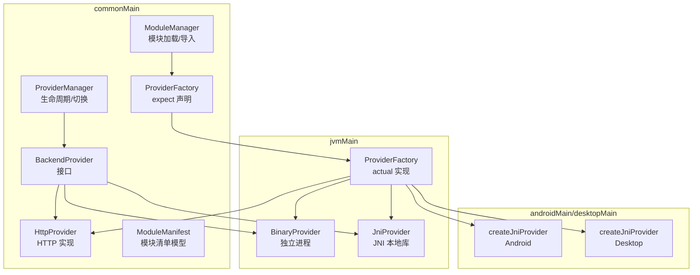
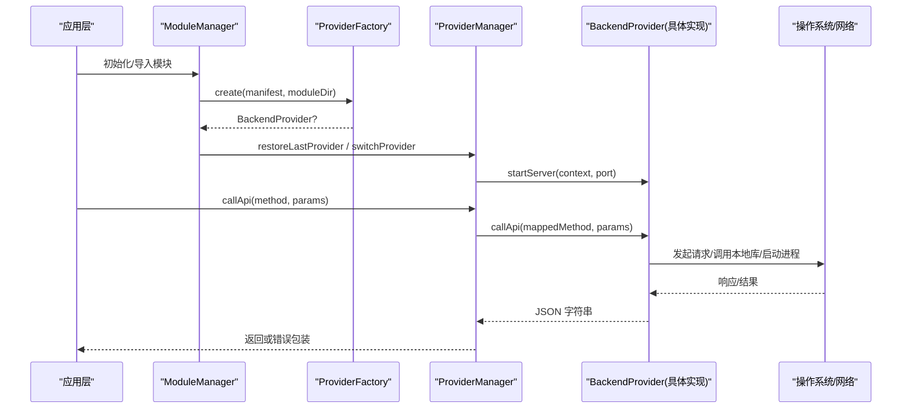
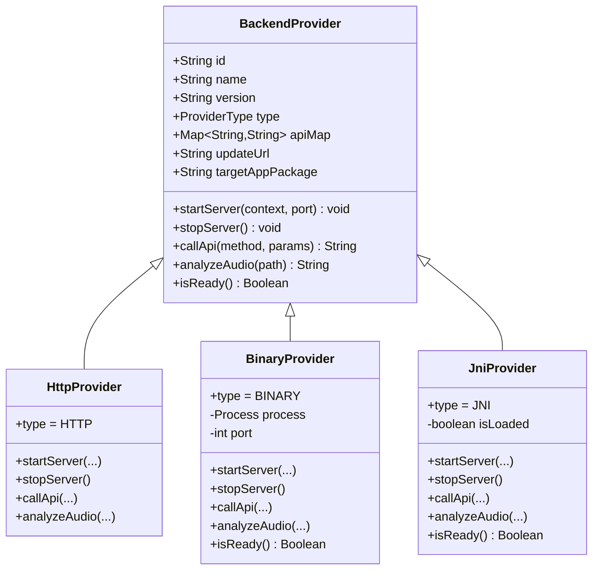
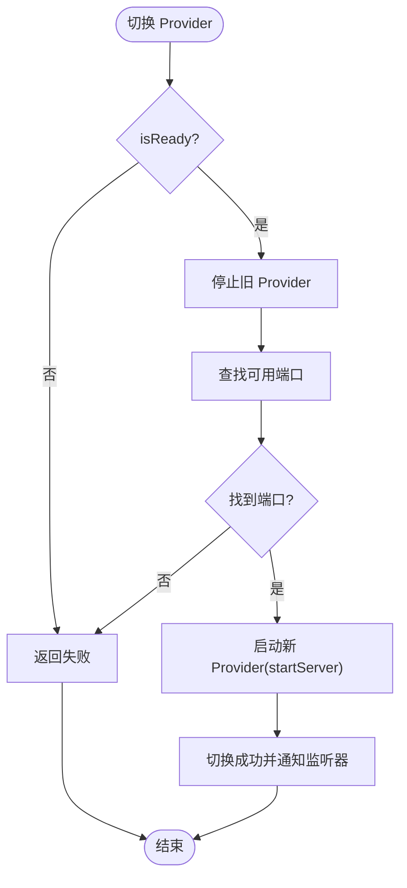
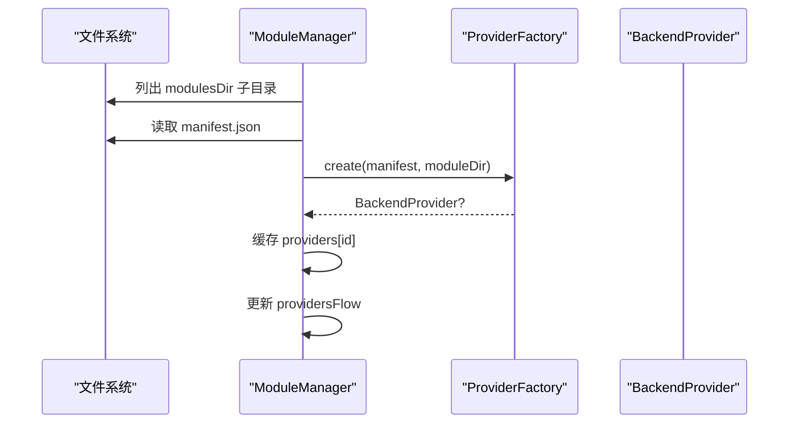
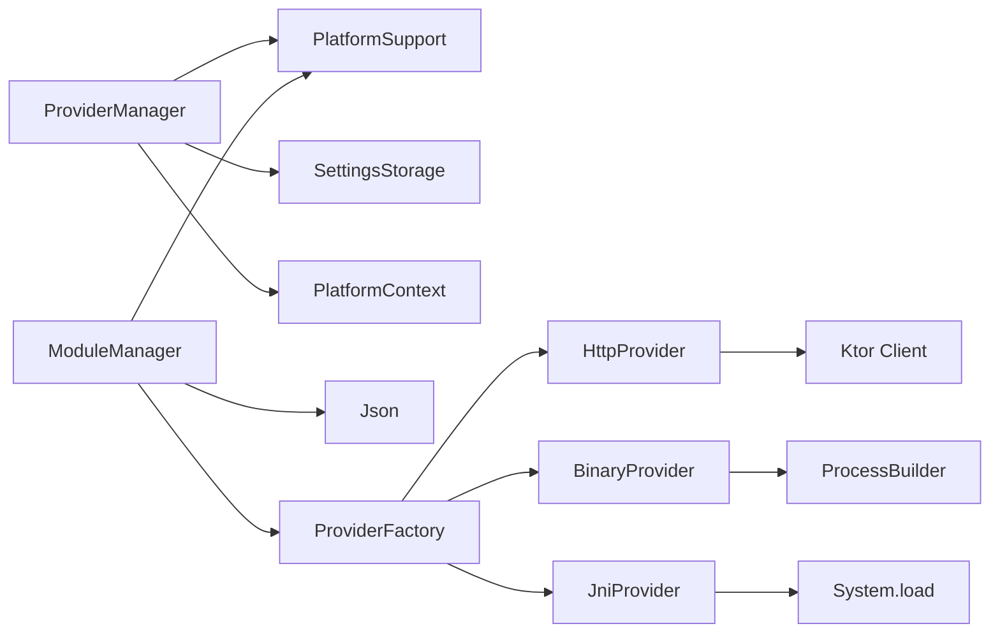

# Provider 架构设计

<cite>
**本文引用的文件**
- [BackendProvider.kt](file://kmp-pro/src/commonMain/kotlin/cp/player/kmp/provider/BackendProvider.kt)
- [HttpProvider.kt](file://kmp-pro/src/commonMain/kotlin/cp/player/kmp/provider/HttpProvider.kt)
- [BinaryProvider.kt](file://kmp-pro/src/jvmMain/kotlin/cp/player/kmp/provider/BinaryProvider.kt)
- [JniProvider.kt](file://kmp-pro/src/jvmMain/kotlin/cp/player/kmp/provider/JniProvider.kt)
- [ProviderFactory.kt](file://kmp-pro/src/commonMain/kotlin/cp/player/kmp/provider/ProviderFactory.kt)
- [ProviderFactory (Android).kt](file://kmp-pro/src/androidMain/kotlin/cp/player/kmp/provider/ProviderFactory.kt)
- [ProviderFactory (Desktop).kt](file://kmp-pro/src/desktopMain/kotlin/cp/player/kmp/provider/ProviderFactory.kt)
- [ProviderManager.kt](file://kmp-pro/src/commonMain/kotlin/cp/player/kmp/provider/ProviderManager.kt)
- [ModuleManifest.kt](file://kmp-pro/src/commonMain/kotlin/cp/player/kmp/provider/ModuleManifest.kt)
- [ModuleManager.kt](file://kmp-pro/src/commonMain/kotlin/cp/player/kmp/provider/ModuleManager.kt)
</cite>

## 目录
1. [简介](#简介)
2. [项目结构](#项目结构)
3. [核心组件](#核心组件)
4. [架构总览](#架构总览)
5. [详细组件分析](#详细组件分析)
6. [依赖关系分析](#依赖关系分析)
7. [性能考量](#性能考量)
8. [故障排查指南](#故障排查指南)
9. [结论](#结论)
10. [附录](#附录)

## 简介
本技术文档聚焦于 CPPlayer-KMP 的 Provider 架构，围绕 BackendProvider 接口的设计理念、类型系统与扩展机制展开，系统阐述 ProviderType 枚举的设计意图与不同实现类型的适用场景。同时覆盖 Provider 的生命周期管理、状态隔离机制、错误处理策略，以及 Provider 注册机制、工厂模式实现和模块清单配置。文末提供架构图与数据流图，帮助读者快速理解各组件间的交互关系。

## 项目结构
Provider 相关代码主要位于 kmp-pro 模块中，采用分层与平台适配相结合的组织方式：
- commonMain：定义抽象接口、通用实现（HTTP）、工厂期望声明、模块清单与模块管理器。
- jvmMain：提供 JVM 平台的实际工厂实现与二进制、JNI 提供者实现。
- androidMain/desktopMain：提供 JNI Provider 的平台具体创建逻辑。

图表来源
- [BackendProvider.kt:24-110](file://kmp-pro/src/commonMain/kotlin/cp/player/kmp/provider/BackendProvider.kt#L24-L110)
- [HttpProvider.kt:23-60](file://kmp-pro/src/commonMain/kotlin/cp/player/kmp/provider/HttpProvider.kt#L23-L60)
- [BinaryProvider.kt:25-108](file://kmp-pro/src/jvmMain/kotlin/cp/player/kmp/provider/BinaryProvider.kt#L25-L108)
- [JniProvider.kt:9-142](file://kmp-pro/src/jvmMain/kotlin/cp/player/kmp/provider/JniProvider.kt#L9-L142)
- [ProviderFactory.kt:11-20](file://kmp-pro/src/commonMain/kotlin/cp/player/kmp/provider/ProviderFactory.kt#L11-L20)
- [ProviderFactory.kt:5-31](file://kmp-pro/src/jvmMain/kotlin/cp/player/kmp/provider/ProviderFactory.kt#L5-L31)
- [ProviderFactory (Android).kt:3-13](file://kmp-pro/src/androidMain/kotlin/cp/player/kmp/provider/ProviderFactory.kt#L3-L13)
- [ProviderFactory (Desktop).kt:3-13](file://kmp-pro/src/desktopMain/kotlin/cp/player/kmp/provider/ProviderFactory.kt#L3-L13)
- [ModuleManager.kt:19-137](file://kmp-pro/src/commonMain/kotlin/cp/player/kmp/provider/ModuleManager.kt#L19-L137)
- [ModuleManifest.kt:5-31](file://kmp-pro/src/commonMain/kotlin/cp/player/kmp/provider/ModuleManifest.kt#L5-L31)

章节来源
- [BackendProvider.kt:24-110](file://kmp-pro/src/commonMain/kotlin/cp/player/kmp/provider/BackendProvider.kt#L24-L110)
- [ModuleManager.kt:19-137](file://kmp-pro/src/commonMain/kotlin/cp/player/kmp/provider/ModuleManager.kt#L19-L137)
- [ProviderFactory.kt:11-20](file://kmp-pro/src/commonMain/kotlin/cp/player/kmp/provider/ProviderFactory.kt#L11-L20)

## 核心组件
- BackendProvider：统一抽象接口，屏蔽底层差异，暴露 id/name/version/type/apiMap/updateUrl/targetAppPackage/startServer/stopServer/callApi/analyzeAudio/isReady 等能力。
- ProviderType：枚举描述后端类型（JNI、BINARY、WEBSOCKET、HTTP），用于区分实现与行为。
- HttpProvider：基于 Ktor 的 HTTP 客户端调用外部 API，start/stop 为空操作。
- BinaryProvider：启动独立可执行文件并通过 HTTP 通信，具备 ELF 校验与进程生命周期管理。
- JniProvider：通过 System.load 加载 .so/.dll/.dylib，暴露 external 方法供 Kotlin 调用。
- ProviderFactory：根据 manifest.type 创建对应 Provider；在 JVM 平台 actual 实现 http/binary/jni 分支；JNI 创建委托给平台 createJniProvider。
- ModuleManager：扫描 modulesDir，解析 manifest.json，调用 ProviderFactory 创建并缓存 Provider，支持导入 zip、删除模块、恢复上次活跃 Provider。
- ProviderManager：管理当前活跃 Provider，负责端口分配、服务启停、切换、持久化选择、API 调用封装与错误包装。

章节来源
- [BackendProvider.kt:24-110](file://kmp-pro/src/commonMain/kotlin/cp/player/kmp/provider/BackendProvider.kt#L24-L110)
- [HttpProvider.kt:23-60](file://kmp-pro/src/commonMain/kotlin/cp/player/kmp/provider/HttpProvider.kt#L23-L60)
- [BinaryProvider.kt:25-108](file://kmp-pro/src/jvmMain/kotlin/cp/player/kmp/provider/BinaryProvider.kt#L25-L108)
- [JniProvider.kt:9-142](file://kmp-pro/src/jvmMain/kotlin/cp/player/kmp/provider/JniProvider.kt#L9-L142)
- [ProviderFactory.kt:5-31](file://kmp-pro/src/jvmMain/kotlin/cp/player/kmp/provider/ProviderFactory.kt#L5-L31)
- [ModuleManager.kt:19-137](file://kmp-pro/src/commonMain/kotlin/cp/player/kmp/provider/ModuleManager.kt#L19-L137)
- [ProviderManager.kt:31-156](file://kmp-pro/src/commonMain/kotlin/cp/player/kmp/provider/ProviderManager.kt#L31-L156)

## 架构总览
Provider 架构以“抽象接口 + 多实现 + 工厂 + 管理器”为核心，结合模块清单驱动动态加载与热插拔。

图表来源
- [ModuleManager.kt:38-48](file://kmp-pro/src/commonMain/kotlin/cp/player/kmp/provider/ModuleManager.kt#L38-L48)
- [ProviderFactory.kt:5-31](file://kmp-pro/src/jvmMain/kotlin/cp/player/kmp/provider/ProviderFactory.kt#L5-L31)
- [ProviderManager.kt:65-141](file://kmp-pro/src/commonMain/kotlin/cp/player/kmp/provider/ProviderManager.kt#L65-L141)
- [HttpProvider.kt:41-57](file://kmp-pro/src/commonMain/kotlin/cp/player/kmp/provider/HttpProvider.kt#L41-L57)
- [BinaryProvider.kt:54-104](file://kmp-pro/src/jvmMain/kotlin/cp/player/kmp/provider/BinaryProvider.kt#L54-L104)
- [JniProvider.kt:39-84](file://kmp-pro/src/jvmMain/kotlin/cp/player/kmp/provider/JniProvider.kt#L39-L84)

## 详细组件分析

### BackendProvider 接口与 ProviderType 枚举
- 设计理念
  - 抽象层：统一对外能力，屏蔽 HTTP、进程、JNI 的差异，使上层仅依赖接口。
  - 类型系统：通过 type 字段标识实现类型，便于运行时策略分发与诊断。
  - 扩展机制：新增实现只需实现接口并在工厂中注册，无需改动上层调用。
- 关键成员
  - 标识信息：id、name、version、type。
  - 映射与更新：apiMap 将内部方法名映射到后端端点；updateUrl 支持版本检查。
  - 平台特性：targetAppPackage 用于 Android 跳转官方 App 扫码登录。
  - 生命周期：startServer/stopServer 控制后端服务；isReady 表示就绪状态。
  - 能力：callApi 统一调用入口；analyzeAudio 可选音频分析。
- ProviderType 设计意图
  - JNI：高性能本地库，适合复杂计算或原生集成。
  - BINARY：独立进程，隔离性强，易于升级与维护。
  - WEBSOCKET：预留扩展，面向实时双向通信场景。
  - HTTP：轻量接入已有 API 服务，部署简单。

章节来源
- [BackendProvider.kt:24-110](file://kmp-pro/src/commonMain/kotlin/cp/player/kmp/provider/BackendProvider.kt#L24-L110)

### 三种 Provider 实现对比
- HttpProvider
  - 适用场景：对接现有 HTTP API（如 NeteaseCloudMusicApi）。
  - 特点：无进程管理，start/stop 为空操作；使用 Ktor 发送 POST；异常统一包装为 JSON。
- BinaryProvider
  - 适用场景：需要隔离运行、可独立升级的后端。
  - 特点：启动子进程并传入端口；ELF 头校验；HTTP 通信；进程销毁释放资源。
- JniProvider
  - 适用场景：高性能本地库调用（C/C++/Rust）。
  - 特点：System.load 加载 so/dll/dylib；external 方法桥接；崩溃保护与错误记录。

图表来源
- [BackendProvider.kt:24-110](file://kmp-pro/src/commonMain/kotlin/cp/player/kmp/provider/BackendProvider.kt#L24-L110)
- [HttpProvider.kt:23-60](file://kmp-pro/src/commonMain/kotlin/cp/player/kmp/provider/HttpProvider.kt#L23-L60)
- [BinaryProvider.kt:25-108](file://kmp-pro/src/jvmMain/kotlin/cp/player/kmp/provider/BinaryProvider.kt#L25-L108)
- [JniProvider.kt:9-142](file://kmp-pro/src/jvmMain/kotlin/cp/player/kmp/provider/JniProvider.kt#L9-L142)

章节来源
- [HttpProvider.kt:23-60](file://kmp-pro/src/commonMain/kotlin/cp/player/kmp/provider/HttpProvider.kt#L23-L60)
- [BinaryProvider.kt:25-108](file://kmp-pro/src/jvmMain/kotlin/cp/player/kmp/provider/BinaryProvider.kt#L25-L108)
- [JniProvider.kt:9-142](file://kmp-pro/src/jvmMain/kotlin/cp/player/kmp/provider/JniProvider.kt#L9-L142)

### Provider 生命周期管理
- 启动流程
  - ProviderManager.startServer：查找可用端口，调用 provider.startServer(context, port)。
  - BinaryProvider：设置可执行权限，启动进程并传入端口参数。
  - JniProvider：加载本地库，调用 native 启动服务。
  - HttpProvider：空操作（由外部服务管理）。
- 停止流程
  - ProviderManager.switchProvider：先尝试停止旧 Provider，再启动新 Provider。
  - BinaryProvider：destroy 进程。
  - JniProvider：重置加载状态。
- 就绪检查
  - isReady：BinaryProvider/JniProvider 在构造时或加载失败时标记不可用；HttpProvider 默认就绪。
- 端口管理
  - 自动探测可用端口，失败则回退并提示。

图表来源
- [ProviderManager.kt:80-109](file://kmp-pro/src/commonMain/kotlin/cp/player/kmp/provider/ProviderManager.kt#L80-L109)
- [BinaryProvider.kt:54-86](file://kmp-pro/src/jvmMain/kotlin/cp/player/kmp/provider/BinaryProvider.kt#L54-L86)
- [JniProvider.kt:39-59](file://kmp-pro/src/jvmMain/kotlin/cp/player/kmp/provider/JniProvider.kt#L39-L59)

章节来源
- [ProviderManager.kt:65-109](file://kmp-pro/src/commonMain/kotlin/cp/player/kmp/provider/ProviderManager.kt#L65-L109)
- [BinaryProvider.kt:54-86](file://kmp-pro/src/jvmMain/kotlin/cp/player/kmp/provider/BinaryProvider.kt#L54-L86)
- [JniProvider.kt:39-59](file://kmp-pro/src/jvmMain/kotlin/cp/player/kmp/provider/JniProvider.kt#L39-L59)

### 状态隔离机制
- 账号 Cookie 隔离
  - ProviderCookieStorage：以 cookie_<providerId> 为键存储 Cookie，确保不同 Provider 的账号互不干扰。
- 模块与实例隔离
  - ModuleManager 按模块 id 缓存 Provider 实例；每个模块独立目录与清单。
- 端口与进程隔离
  - BinaryProvider 为每个实例分配独立端口与进程；JniProvider 通过本地库状态隔离。

章节来源
- [ProviderManager.kt:147-156](file://kmp-pro/src/commonMain/kotlin/cp/player/kmp/provider/ProviderManager.kt#L147-L156)
- [ModuleManager.kt:24-27](file://kmp-pro/src/commonMain/kotlin/cp/player/kmp/provider/ModuleManager.kt#L24-L27)
- [BinaryProvider.kt:37-40](file://kmp-pro/src/jvmMain/kotlin/cp/player/kmp/provider/BinaryProvider.kt#L37-L40)

### 错误处理策略
- 统一错误包装
  - ProviderManager.callApi：捕获异常并返回包含 code/msg 的 JSON 字符串。
  - HttpProvider/BinaryProvider/JniProvider：对网络、进程、JNI 异常进行捕获并返回结构化错误。
- 加载失败诊断
  - ModuleManager：当 Provider 创建失败或未就绪时，记录 lastLoadError，并尝试提取 getLoadError 详情。
  - BinaryProvider/JniProvider：维护 loadError 字段，记录缺失文件、权限不足、ELF 校验失败、链接失败等。
- 恢复与降级
  - ProviderManager.restoreLastProvider：优先恢复上次选择的 Provider；若失败则自动选择首个可用 Provider。

章节来源
- [ProviderManager.kt:123-141](file://kmp-pro/src/commonMain/kotlin/cp/player/kmp/provider/ProviderManager.kt#L123-L141)
- [ModuleManager.kt:88-124](file://kmp-pro/src/commonMain/kotlin/cp/player/kmp/provider/ModuleManager.kt#L88-L124)
- [BinaryProvider.kt:42-52](file://kmp-pro/src/jvmMain/kotlin/cp/player/kmp/provider/BinaryProvider.kt#L42-L52)
- [JniProvider.kt:23-33](file://kmp-pro/src/jvmMain/kotlin/cp/player/kmp/provider/JniProvider.kt#L23-L33)

### Provider 注册机制、工厂模式与模块清单
- 模块清单（ModuleManifest）
  - 字段：id、name、version、type、entryPoint、apiMap、updateUrl、supportedAbis、targetAppPackage。
  - 作用：描述模块元数据与入口路径，支持 per-ABI 目录结构与目标 App 跳转。
- 工厂模式（ProviderFactory）
  - expect/actual 模式：commonMain 声明 expect，jvmMain 提供 actual 实现。
  - 分支创建：根据 manifest.type 创建 HttpProvider/BinaryProvider/JniProvider；JNI 创建委托给平台 createJniProvider。
- 模块管理（ModuleManager）
  - 扫描与加载：读取 modulesDir 子目录，解析 manifest.json，调用工厂创建并缓存。
  - 导入与删除：支持 zip 导入、移动临时目录、删除模块并刷新列表。
  - 自动恢复：启动时恢复上次活跃 Provider，若无则自动选择首个。

图表来源
- [ModuleManager.kt:50-117](file://kmp-pro/src/commonMain/kotlin/cp/player/kmp/provider/ModuleManager.kt#L50-L117)
- [ProviderFactory.kt:5-31](file://kmp-pro/src/jvmMain/kotlin/cp/player/kmp/provider/ProviderFactory.kt#L5-L31)
- [ModuleManifest.kt:5-31](file://kmp-pro/src/commonMain/kotlin/cp/player/kmp/provider/ModuleManifest.kt#L5-L31)

章节来源
- [ModuleManifest.kt:5-31](file://kmp-pro/src/commonMain/kotlin/cp/player/kmp/provider/ModuleManifest.kt#L5-L31)
- [ProviderFactory.kt:5-31](file://kmp-pro/src/jvmMain/kotlin/cp/player/kmp/provider/ProviderFactory.kt#L5-L31)
- [ModuleManager.kt:50-117](file://kmp-pro/src/commonMain/kotlin/cp/player/kmp/provider/ModuleManager.kt#L50-L117)

## 依赖关系分析
- 组件耦合
  - ProviderManager 依赖 PlatformSupport（端口查找）、SettingsStorage（持久化）、PlatformContext（上下文）。
  - ModuleManager 依赖 PlatformSupport（文件操作）、Json（序列化）、ProviderFactory（创建）。
  - 各 Provider 依赖 PlatformContext 与网络/进程/本地库能力。
- 直接/间接依赖
  - 上层仅依赖 BackendProvider 接口，降低与实现的耦合。
  - 工厂与模块管理器承担装配职责，符合单一职责原则。
- 外部依赖
  - Ktor 用于 HTTP 通信。
  - kotlinx.serialization 用于 JSON 序列化。
  - 平台特定能力通过 expect/actual 解耦。

图表来源
- [ProviderManager.kt:31-49](file://kmp-pro/src/commonMain/kotlin/cp/player/kmp/provider/ProviderManager.kt#L31-L49)
- [ModuleManager.kt:19-27](file://kmp-pro/src/commonMain/kotlin/cp/player/kmp/provider/ModuleManager.kt#L19-L27)
- [ProviderFactory.kt:5-31](file://kmp-pro/src/jvmMain/kotlin/cp/player/kmp/provider/ProviderFactory.kt#L5-L31)
- [HttpProvider.kt:35-57](file://kmp-pro/src/commonMain/kotlin/cp/player/kmp/provider/HttpProvider.kt#L35-L57)
- [BinaryProvider.kt:54-86](file://kmp-pro/src/jvmMain/kotlin/cp/player/kmp/provider/BinaryProvider.kt#L54-L86)
- [JniProvider.kt:98-136](file://kmp-pro/src/jvmMain/kotlin/cp/player/kmp/provider/JniProvider.kt#L98-L136)

章节来源
- [ProviderManager.kt:31-49](file://kmp-pro/src/commonMain/kotlin/cp/player/kmp/provider/ProviderManager.kt#L31-L49)
- [ModuleManager.kt:19-27](file://kmp-pro/src/commonMain/kotlin/cp/player/kmp/provider/ModuleManager.kt#L19-L27)
- [ProviderFactory.kt:5-31](file://kmp-pro/src/jvmMain/kotlin/cp/player/kmp/provider/ProviderFactory.kt#L5-L31)

## 性能考量
- 网络 I/O
  - HttpProvider 使用 Ktor 异步客户端，但在同步契约下通过 runBlocking 转发，避免阻塞主线程。
- 进程管理
  - BinaryProvider 启动子进程并复用连接，注意进程生命周期与端口冲突。
- 本地库加载
  - JniProvider 延迟加载，避免启动开销；加载失败快速失败并记录错误。
- 端口分配
  - ProviderManager 批量探测可用端口，减少重试次数与资源占用。

[本节为通用指导，不直接分析具体文件]

## 故障排查指南
- 常见错误与定位
  - 模块清单缺失或格式错误：ModuleManager 会记录 lastLoadError。
  - 二进制文件不存在或权限不足：BinaryProvider 构造或启动时报错。
  - JNI 库加载失败：JniProvider 记录 loadError，包括文件不存在、权限不足、ELF 校验失败、链接失败。
  - 端口被占用：ProviderManager 提示端口范围占用情况。
- 建议步骤
  - 检查 modulesDir 下是否存在有效 manifest.json。
  - 确认 entryPoint 指向的文件存在且具备执行/读取权限。
  - 查看日志输出中的 Provider 启动与调用日志。
  - 使用 ProviderManager.getCurrentProviderName/Id 确认当前活跃 Provider。

章节来源
- [ModuleManager.kt:57-86](file://kmp-pro/src/commonMain/kotlin/cp/player/kmp/provider/ModuleManager.kt#L57-L86)
- [BinaryProvider.kt:42-52](file://kmp-pro/src/jvmMain/kotlin/cp/player/kmp/provider/BinaryProvider.kt#L42-L52)
- [JniProvider.kt:23-33](file://kmp-pro/src/jvmMain/kotlin/cp/player/kmp/provider/JniProvider.kt#L23-L33)
- [ProviderManager.kt:65-73](file://kmp-pro/src/commonMain/kotlin/cp/player/kmp/provider/ProviderManager.kt#L65-L73)

## 结论
CPPlayer-KMP 的 Provider 架构通过清晰的抽象接口、类型化实现与工厂模式，实现了高度可扩展与可替换的后端接入能力。模块清单驱动的动态加载与 ProviderManager 的生命周期管理，使得多源音乐服务可以无缝集成与切换。统一的错误处理与状态隔离机制保障了系统的稳定性与可维护性。未来可通过 WEBSOCKET 类型进一步扩展实时通信能力。

[本节为总结性内容，不直接分析具体文件]

## 附录
- 最佳实践
  - 为新音源开发 Provider 时，优先实现 BackendProvider 接口，并在 Manifest 中正确声明 type 与 entryPoint。
  - 使用 apiMap 将内部方法名映射到后端端点，提升兼容性。
  - 在 Provider 实现中妥善处理异常，返回结构化 JSON，便于上层统一处理。
  - 利用 ProviderCookieStorage 实现账号隔离，避免跨 Provider 数据污染。
- 扩展建议
  - 增加 WEBSOCKET Provider 以支持实时推送与双向通信。
  - 增强健康检查与指标上报，便于监控与告警。
  - 优化端口分配策略与进程池管理，提升并发性能。

[本节为通用指导，不直接分析具体文件]