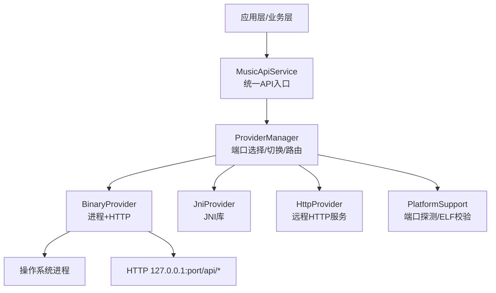
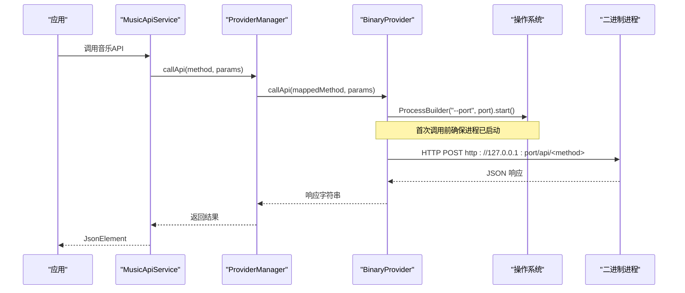
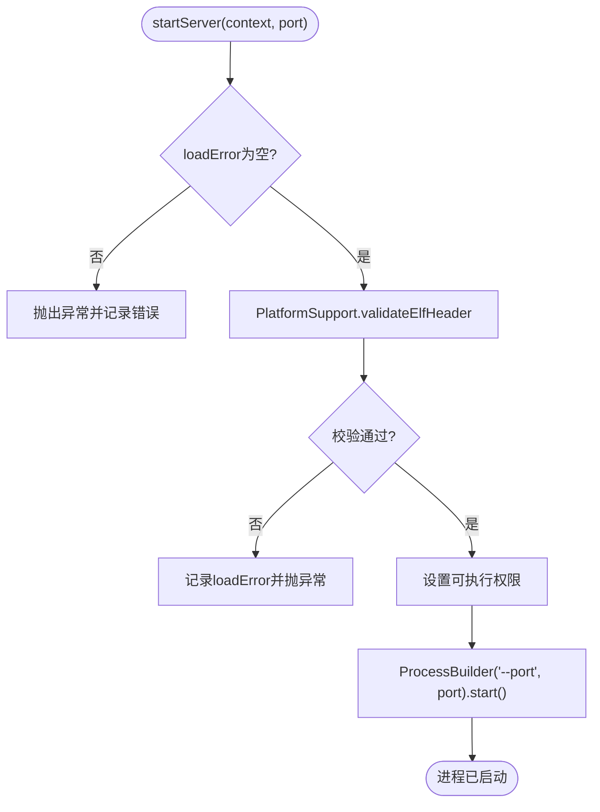
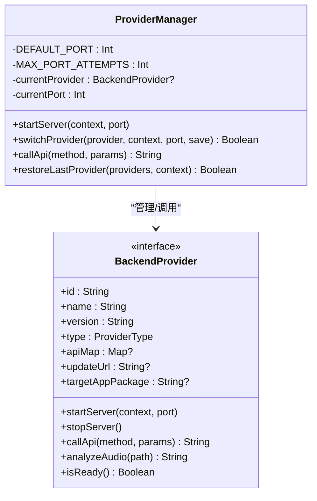
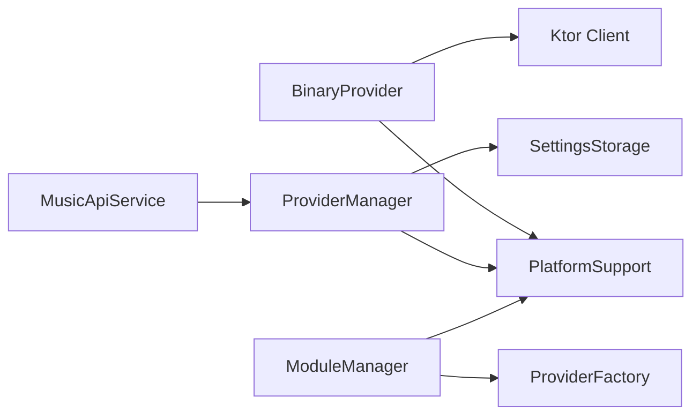

# 二进制 Provider 实现

<cite>
**本文引用的文件**
- [BinaryProvider.kt](file://kmp-pro/src/jvmMain/kotlin/cp/player/kmp/provider/BinaryProvider.kt)
- [JniProvider.kt](file://kmp-pro/src/jvmMain/kotlin/cp/player/kmp/provider/JniProvider.kt)
- [BackendProvider.kt](file://kmp-pro/src/commonMain/kotlin/cp/player/kmp/provider/BackendProvider.kt)
- [ProviderManager.kt](file://kmp-pro/src/commonMain/kotlin/cp/player/kmp/provider/ProviderManager.kt)
- [ModuleManager.kt](file://kmp-pro/src/commonMain/kotlin/cp/player/kmp/provider/ModuleManager.kt)
- [ModuleManifest.kt](file://kmp-pro/src/commonMain/kotlin/cp/player/kmp/provider/ModuleManifest.kt)
- [PlatformSupport.kt](file://kmp-pro/src/jvmMain/kotlin/cp/player/kmp/util/PlatformSupport.kt)
- [PlatformInfo.kt](file://kmp-pro/src/commonMain/kotlin/cp/player/kmp/util/PlatformInfo.kt)
- [HttpProvider.kt](file://kmp-pro/src/commonMain/kotlin/cp/player/kmp/provider/HttpProvider.kt)
- [MusicApiService.kt](file://kmp-pro/src/commonMain/kotlin/cp/player/kmp/api/MusicApiService.kt)
- [MusicApiServiceImpl.kt](file://kmp-pro/src/commonMain/kotlin/cp/player/kmp/api/MusicApiServiceImpl.kt)
</cite>

## 目录
1. [简介](#简介)
2. [项目结构](#项目结构)
3. [核心组件](#核心组件)
4. [架构总览](#架构总览)
5. [详细组件分析](#详细组件分析)
6. [依赖关系分析](#依赖关系分析)
7. [性能与资源管理](#性能与资源管理)
8. [故障排查指南](#故障排查指南)
9. [结论](#结论)
10. [附录：构建与部署](#附录构建与部署)

## 简介
本技术文档聚焦于“独立可执行文件（Binary）Provider”的实现，覆盖进程生命周期控制、端口管理与进程间通信协议；说明本地服务启动参数、打包要求、平台适配与部署策略；并给出监控、崩溃恢复与资源清理机制，以及模块构建与调试建议。该实现通过 JVM 侧的 BinaryProvider 启动外部二进制进程，并以 HTTP 协议与其通信，统一由 ProviderManager 管理生命周期与端口分配。

## 项目结构
围绕二进制 Provider 的关键代码分布在以下位置：
- 接口与类型定义：commonMain 中的 BackendProvider、ProviderType、ModuleManifest
- 管理器：ProviderManager（端口选择、切换、调用路由）、ModuleManager（模块扫描与加载）
- 平台支持：jvmMain 中的 PlatformSupport（端口探测、ELF 校验、解压等）
- 具体实现：jvmMain 中的 BinaryProvider（进程启动与 HTTP 调用），以及对比参考的 JniProvider、HttpProvider
- API 层：MusicApiService 及其实现，作为上层统一入口

图表来源
- [ProviderManager.kt:65-108](file://kmp-pro/src/commonMain/kotlin/cp/player/kmp/provider/ProviderManager.kt#L65-L108)
- [BinaryProvider.kt:54-104](file://kmp-pro/src/jvmMain/kotlin/cp/player/kmp/provider/BinaryProvider.kt#L54-L104)
- [PlatformSupport.kt:19-31](file://kmp-pro/src/jvmMain/kotlin/cp/player/kmp/util/PlatformSupport.kt#L19-L31)
- [PlatformSupport.kt:89-121](file://kmp-pro/src/jvmMain/kotlin/cp/player/kmp/util/PlatformSupport.kt#L89-L121)

章节来源
- [BackendProvider.kt:24-96](file://kmp-pro/src/commonMain/kotlin/cp/player/kmp/provider/BackendProvider.kt#L24-L96)
- [ProviderManager.kt:31-145](file://kmp-pro/src/commonMain/kotlin/cp/player/kmp/provider/ProviderManager.kt#L31-L145)
- [ModuleManager.kt:19-137](file://kmp-pro/src/commonMain/kotlin/cp/player/kmp/provider/ModuleManager.kt#L19-L137)
- [PlatformSupport.kt:17-135](file://kmp-pro/src/jvmMain/kotlin/cp/player/kmp/util/PlatformSupport.kt#L17-L135)

## 核心组件
- BackendProvider：抽象后端提供者接口，定义 startServer/stopServer/callApi/analyzeAudio/isReady 等能力，并声明 ProviderType（BINARY/JNI/WEBSOCKET/HTTP）。
- BinaryProvider：基于 ProcessBuilder 启动独立可执行文件，使用 Ktor HTTP 客户端以 POST JSON 方式调用 http://127.0.0.1:port/api/<method>。
- ProviderManager：负责端口可用性检测与分配、Provider 切换、当前活跃 Provider 的调用路由与错误封装。
- ModuleManager：从 modules 目录扫描并加载模块（含 manifest.json），创建对应 Provider，处理导入/删除等操作。
- PlatformSupport：提供端口探测、ELF 头校验、ZIP 解压、ABI 解析等跨平台能力（JVM 实际实现）。
- ModuleManifest：描述模块元数据（id/name/version/type/entryPoint/supportedAbis/updateUrl/targetAppPackage）。

章节来源
- [BackendProvider.kt:24-110](file://kmp-pro/src/commonMain/kotlin/cp/player/kmp/provider/BackendProvider.kt#L24-L110)
- [BinaryProvider.kt:17-107](file://kmp-pro/src/jvmMain/kotlin/cp/player/kmp/provider/BinaryProvider.kt#L17-L107)
- [ProviderManager.kt:31-145](file://kmp-pro/src/commonMain/kotlin/cp/player/kmp/provider/ProviderManager.kt#L31-L145)
- [ModuleManager.kt:19-137](file://kmp-pro/src/commonMain/kotlin/cp/player/kmp/provider/ModuleManager.kt#L19-L137)
- [PlatformSupport.kt:17-135](file://kmp-pro/src/jvmMain/kotlin/cp/player/kmp/util/PlatformSupport.kt#L17-L135)
- [ModuleManifest.kt:5-31](file://kmp-pro/src/commonMain/kotlin/cp/player/kmp/provider/ModuleManifest.kt#L5-L31)

## 架构总览
Binary Provider 采用“进程隔离 + HTTP 通信”的架构：
- 启动阶段：ProviderManager 选择可用端口，调用 BinaryProvider.startServer，后者校验 ELF、设置可执行权限并通过 ProcessBuilder 启动二进制进程，传入 --port 参数。
- 通信阶段：上层通过 MusicApiService 发起请求，经 ProviderManager 路由到当前 Provider 的 callApi；BinaryProvider 将方法名映射为 /api/<method>，以 JSON 形式 POST 到 127.0.0.1:port。
- 生命周期：切换或停止时，ProviderManager 会先 stopServer 销毁旧进程，再启动新 Provider。

图表来源
- [MusicApiService.kt:5-23](file://kmp-pro/src/commonMain/kotlin/cp/player/kmp/api/MusicApiService.kt#L5-L23)
- [ProviderManager.kt:123-141](file://kmp-pro/src/commonMain/kotlin/cp/player/kmp/provider/ProviderManager.kt#L123-L141)
- [BinaryProvider.kt:88-104](file://kmp-pro/src/jvmMain/kotlin/cp/player/kmp/provider/BinaryProvider.kt#L88-L104)

## 详细组件分析

### BinaryProvider：进程与通信
- 启动流程
  - 构造时仅做存在性检查，延迟至 startServer 进行 ELF 校验与进程启动。
  - 设置工作目录为二进制所在目录，合并标准错误输出流，便于调试。
  - 通过 ProcessBuilder 传入 --port 参数，绑定到指定端口。
- 通信协议
  - URL：http://127.0.0.1:<port>/api/<method>
  - 请求体：JSON 对象，键值对来自 params Map
  - 响应体：文本形式的 JSON
- 错误处理
  - 若二进制不存在或 ELF 校验失败，抛出异常并记录 loadError。
  - 网络调用异常时返回包含 code 500 的错误 JSON。
- 资源释放
  - stopServer 调用 destroy() 终止进程，并将引用置空。

图表来源
- [BinaryProvider.kt:54-80](file://kmp-pro/src/jvmMain/kotlin/cp/player/kmp/provider/BinaryProvider.kt#L54-L80)
- [PlatformSupport.kt:89-121](file://kmp-pro/src/jvmMain/kotlin/cp/player/kmp/util/PlatformSupport.kt#L89-L121)

章节来源
- [BinaryProvider.kt:17-107](file://kmp-pro/src/jvmMain/kotlin/cp/player/kmp/provider/BinaryProvider.kt#L17-L107)

### ProviderManager：端口管理与调用路由
- 端口管理
  - 默认起始端口 3000，最多尝试 20 次递增端口，直到找到可用端口。
  - 使用 PlatformSupport.findAvailablePort 探测端口可用性。
- 切换与恢复
  - 切换 Provider 时先停止旧服务，再启动新服务；失败则回滚到上一个状态。
  - 支持持久化最近活跃的 Provider ID，并在启动时恢复。
- 调用路由
  - 根据 apiMap 将内部方法名映射到 Provider 实际端点名；若标记 unsupported，返回不支持提示。
  - 所有调用在 IO 线程执行，统一捕获异常并包装为 JSON 错误。

图表来源
- [ProviderManager.kt:31-145](file://kmp-pro/src/commonMain/kotlin/cp/player/kmp/provider/ProviderManager.kt#L31-L145)
- [BackendProvider.kt:24-96](file://kmp-pro/src/commonMain/kotlin/cp/player/kmp/provider/BackendProvider.kt#L24-L96)

章节来源
- [ProviderManager.kt:31-145](file://kmp-pro/src/commonMain/kotlin/cp/player/kmp/provider/ProviderManager.kt#L31-L145)

### ModuleManager：模块加载与 ABI 选择
- 扫描与加载
  - 遍历 modulesDir 子目录，读取 manifest.json，调用 ProviderFactory 创建对应 Provider。
  - 若创建失败或未就绪，记录 lastLoadError。
- 导入与删除
  - importModule 解压 zip，校验 manifest，移动到目标目录后加载。
  - deleteModule 递归删除模块目录并更新内存状态。
- ABI 选择
  - 通过 PlatformSupport.resolveEntryPoint 按平台支持的 ABI 顺序查找入口文件，优先匹配 manifest 中声明的 supportedAbis。

章节来源
- [ModuleManager.kt:19-137](file://kmp-pro/src/commonMain/kotlin/cp/player/kmp/provider/ModuleManager.kt#L19-L137)
- [PlatformSupport.kt:67-82](file://kmp-pro/src/jvmMain/kotlin/cp/player/kmp/util/PlatformSupport.kt#L67-L82)
- [ModuleManifest.kt:5-31](file://kmp-pro/src/commonMain/kotlin/cp/player/kmp/provider/ModuleManifest.kt#L5-L31)

### 平台支持与 ELF 校验
- 端口探测：ServerSocket 快速探测端口是否可用。
- ELF 校验：读取文件头魔数与 e_machine，判断是否与当前平台 ABI 匹配；非 ELF 文件允许尝试启动。
- 模块入口解析：按 lib/{abi}/entryPoint 结构定位实际文件。

章节来源
- [PlatformSupport.kt:19-31](file://kmp-pro/src/jvmMain/kotlin/cp/player/kmp/util/PlatformSupport.kt#L19-L31)
- [PlatformSupport.kt:89-121](file://kmp-pro/src/jvmMain/kotlin/cp/player/kmp/util/PlatformSupport.kt#L89-L121)
- [PlatformSupport.kt:67-82](file://kmp-pro/src/jvmMain/kotlin/cp/player/kmp/util/PlatformSupport.kt#L67-L82)

### 与 JNI/HTTP Provider 的关系
- JniProvider：通过 System.load 加载 .so，调用 native 方法启动本地服务；用于需要更低开销或更紧密集成的场景。
- HttpProvider：直接连接已有 HTTP 服务，start/stop 为空操作；适合外部部署的服务。
- BinaryProvider：进程隔离，便于升级、替换与故障隔离；适合将复杂逻辑下沉到独立进程。

章节来源
- [JniProvider.kt:9-142](file://kmp-pro/src/jvmMain/kotlin/cp/player/kmp/provider/JniProvider.kt#L9-L142)
- [HttpProvider.kt:17-40](file://kmp-pro/src/commonMain/kotlin/cp/player/kmp/provider/HttpProvider.kt#L17-L40)

## 依赖关系分析
- 耦合度
  - BinaryProvider 依赖 PlatformSupport 进行 ELF 校验与端口探测，依赖 createHttpClient 进行 HTTP 通信。
  - ProviderManager 依赖 PlatformSupport 进行端口选择，依赖 SettingsStorage 持久化状态。
  - ModuleManager 依赖 PlatformSupport 进行目录操作与解压，依赖 ProviderFactory 创建实例。
- 外部依赖
  - Ktor HTTP 客户端用于请求/响应。
  - Kotlinx Serialization 用于 JSON 编解码。
  - 操作系统进程管理能力（ProcessBuilder）。

图表来源
- [BinaryProvider.kt:3-15](file://kmp-pro/src/jvmMain/kotlin/cp/player/kmp/provider/BinaryProvider.kt#L3-L15)
- [ProviderManager.kt:3-13](file://kmp-pro/src/commonMain/kotlin/cp/player/kmp/provider/ProviderManager.kt#L3-L13)
- [ModuleManager.kt:3-8](file://kmp-pro/src/commonMain/kotlin/cp/player/kmp/provider/ModuleManager.kt#L3-L8)

章节来源
- [BinaryProvider.kt:3-15](file://kmp-pro/src/jvmMain/kotlin/cp/player/kmp/provider/BinaryProvider.kt#L3-L15)
- [ProviderManager.kt:3-13](file://kmp-pro/src/commonMain/kotlin/cp/player/kmp/provider/ProviderManager.kt#L3-L13)
- [ModuleManager.kt:3-8](file://kmp-pro/src/commonMain/kotlin/cp/player/kmp/provider/ModuleManager.kt#L3-L8)

## 性能与资源管理
- 进程启动开销
  - 首次启动存在进程创建与初始化成本，后续调用复用同一进程，避免重复启动。
- 端口竞争
  - 通过 findAvailablePort 自动避让占用端口，减少冲突；建议合理设置起始端口与最大尝试次数。
- 资源清理
  - stopServer 必须调用 destroy 释放进程句柄；建议在应用退出或 Provider 切换时确保调用。
- 错误隔离
  - 二进制进程崩溃不会影响 JVM 主进程稳定性；异常被捕获并返回错误 JSON。
- 日志与诊断
  - 合并标准错误流便于收集二进制进程输出；建议在开发环境保留详细日志。

[本节为通用指导，不直接分析具体文件]

## 故障排查指南
- 二进制文件不存在
  - 现象：isReady 返回 false，getLoadError 提示路径不存在。
  - 处理：确认模块包中包含正确的 entryPoint，且路径正确。
- ELF 校验失败
  - 现象：startServer 抛出异常，提示架构不匹配或非 ELF。
  - 处理：确保二进制与当前平台 ABI 一致；manifest 中 supportedAbis 与实际一致。
- 端口占用
  - 现象：ProviderManager 无法找到可用端口。
  - 处理：调整起始端口或关闭占用进程；检查 MAX_PORT_ATTEMPTS 配置。
- 进程启动失败
  - 现象：startServer 抛出异常，记录启动失败信息。
  - 处理：检查二进制可执行权限、依赖库、工作目录是否正确。
- HTTP 调用失败
  - 现象：callApi 返回 code 500 的错误 JSON。
  - 处理：检查二进制进程是否监听指定端口，URL 与方法名映射是否正确。

章节来源
- [BinaryProvider.kt:42-80](file://kmp-pro/src/jvmMain/kotlin/cp/player/kmp/provider/BinaryProvider.kt#L42-L80)
- [BinaryProvider.kt:88-104](file://kmp-pro/src/jvmMain/kotlin/cp/player/kmp/provider/BinaryProvider.kt#L88-L104)
- [ProviderManager.kt:65-108](file://kmp-pro/src/commonMain/kotlin/cp/player/kmp/provider/ProviderManager.kt#L65-L108)
- [PlatformSupport.kt:89-121](file://kmp-pro/src/jvmMain/kotlin/cp/player/kmp/util/PlatformSupport.kt#L89-L121)

## 结论
Binary Provider 通过进程隔离与 HTTP 通信实现了稳定、可扩展的后端集成方案。借助 ProviderManager 的端口管理与调用路由，以及 PlatformSupport 的平台能力，系统在多平台环境下具备良好的兼容性与可维护性。结合模块化加载与 ABI 选择，可实现灵活的部署与升级策略。

[本节为总结，不直接分析具体文件]

## 附录：构建与部署

### 二进制模块打包要求
- 模块目录结构
  - 根目录包含 manifest.json，描述 id/name/version/type/entryPoint/supportedAbis 等。
  - 入口文件位于 lib/{abi}/entryPoint（多 ABI 支持）或根目录 entryPoint（单 ABI）。
- manifest.json 关键字段
  - type 为 "binary"，entryPoint 为可执行文件名。
  - supportedAbis 可选，用于声明支持的 CPU 架构列表。
  - updateUrl 可选，指向版本检查端点。
  - targetAppPackage 可选，Android 登录跳转用。
- 打包为 ZIP
  - 使用 ModuleManager.importModule 解压并安装模块；解压过程包含安全校验，防止路径穿越。

章节来源
- [ModuleManifest.kt:5-31](file://kmp-pro/src/commonMain/kotlin/cp/player/kmp/provider/ModuleManifest.kt#L5-L31)
- [ModuleManager.kt:57-86](file://kmp-pro/src/commonMain/kotlin/cp/player/kmp/provider/ModuleManager.kt#L57-L86)
- [PlatformSupport.kt:35-59](file://kmp-pro/src/jvmMain/kotlin/cp/player/kmp/util/PlatformSupport.kt#L35-L59)

### 平台适配与部署策略
- 平台 ABI 选择
  - 通过 PlatformInfo.supportedAbis 与 PlatformSupport.resolveEntryPoint 自动选择匹配的入口文件。
- 部署位置
  - Android：modulesDir 由 PlatformInfo.modulesDirectory 提供（通常为 filesDir/modules）。
  - Desktop：固定目录（如 ~/.kmp-pro/modules）。
- 运行权限
  - 二进制需具备可执行权限；BinaryProvider 在启动前设置可执行位。

章节来源
- [PlatformInfo.kt:11-20](file://kmp-pro/src/commonMain/kotlin/cp/player/kmp/util/PlatformInfo.kt#L11-L20)
- [PlatformSupport.kt:67-82](file://kmp-pro/src/jvmMain/kotlin/cp/player/kmp/util/PlatformSupport.kt#L67-L82)
- [BinaryProvider.kt:69-74](file://kmp-pro/src/jvmMain/kotlin/cp/player/kmp/provider/BinaryProvider.kt#L69-L74)

### 进程监控、崩溃恢复与资源清理
- 进程监控
  - 可通过定期探测端口或发送心跳请求验证二进制进程存活；当前实现未内置健康检查，可在上层扩展。
- 崩溃恢复
  - 若二进制进程崩溃，下次调用会因 HTTP 连接失败而返回错误；可在上层重试或重启进程。
- 资源清理
  - 确保在应用退出或 Provider 切换时调用 stopServer，释放进程句柄。

[本节为通用指导，不直接分析具体文件]

### 构建指南与调试技巧
- 构建要点
  - 确保二进制编译为目标平台 ABI，并放置在 lib/{abi}/entryPoint。
  - manifest.json 中 type 设置为 "binary"，entryPoint 指向实际文件名。
- 调试技巧
  - 合并标准错误流以便查看二进制进程输出。
  - 使用 curl 或 HTTP 客户端直接访问 http://127.0.0.1:port/api/<method> 验证接口。
  - 在开发环境开启详细日志，观察端口选择与调用链路。

[本节为通用指导，不直接分析具体文件]