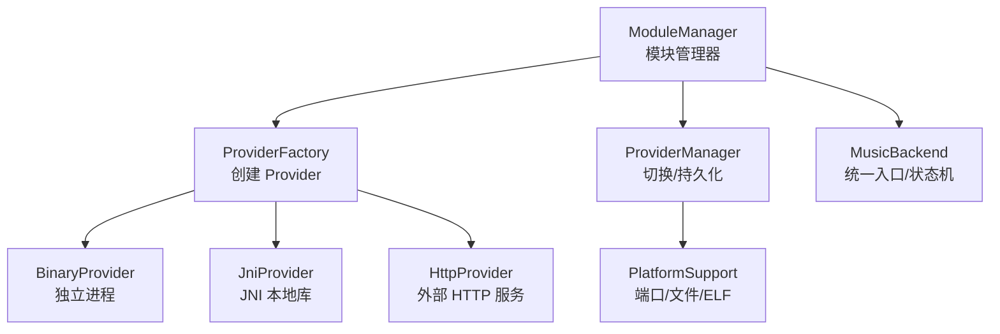
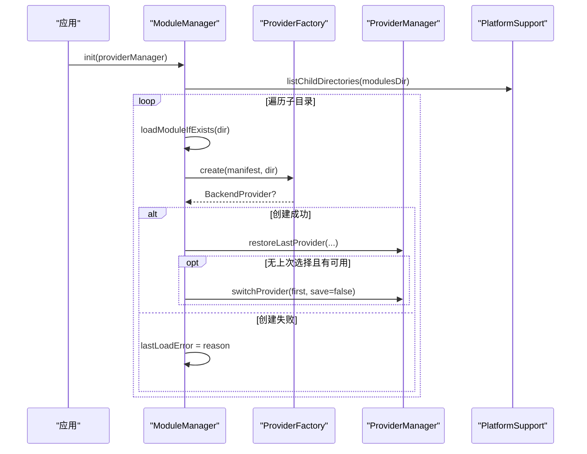
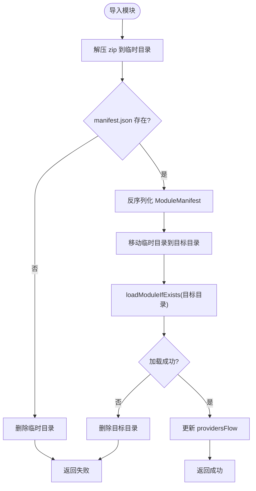
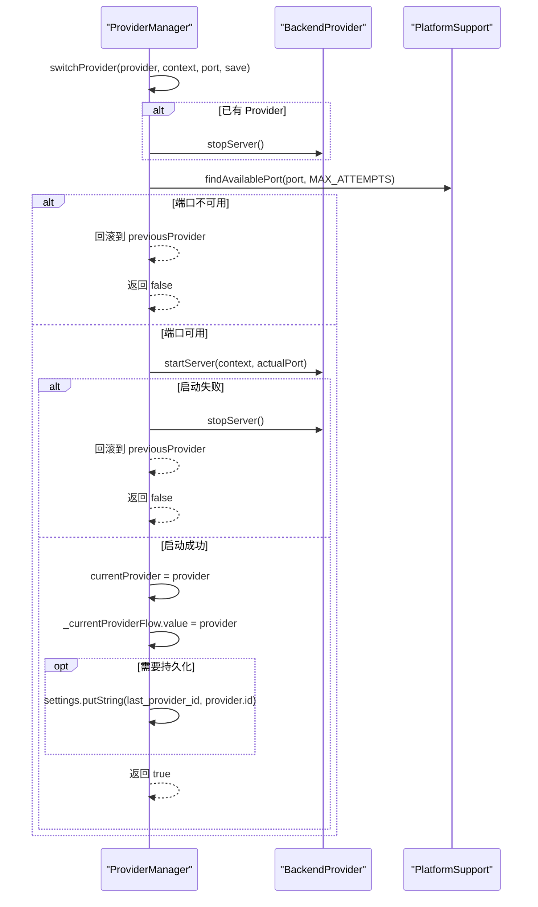
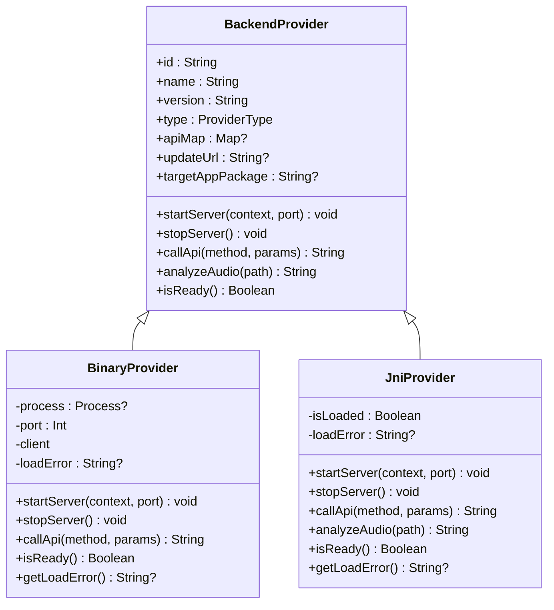
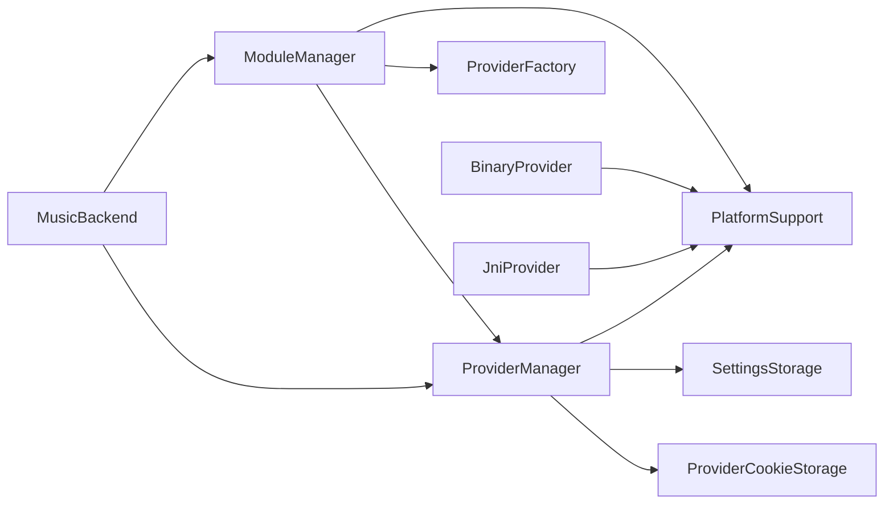

# 模块管理器

<cite>
**本文引用的文件**
- [ModuleManager.kt](file://kmp-pro/src/commonMain/kotlin/cp/player/kmp/provider/ModuleManager.kt)
- [ModuleManifest.kt](file://kmp-pro/src/commonMain/kotlin/cp/player/kmp/provider/ModuleManifest.kt)
- [ProviderManager.kt](file://kmp-pro/src/commonMain/kotlin/cp/player/kmp/provider/ProviderManager.kt)
- [BackendProvider.kt](file://kmp-pro/src/commonMain/kotlin/cp/player/kmp/provider/BackendProvider.kt)
- [ProviderFactory.kt](file://kmp-pro/src/commonMain/kotlin/cp/player/kmp/provider/ProviderFactory.kt)
- [BinaryProvider.kt](file://kmp-pro/src/jvmMain/kotlin/cp/player/kmp/provider/BinaryProvider.kt)
- [JniProvider.kt](file://kmp-pro/src/jvmMain/kotlin/cp/player/kmp/provider/JniProvider.kt)
- [PlatformSupport.kt](file://kmp-pro/src/commonMain/kotlin/cp/player/kmp/util/PlatformSupport.kt)
- [MusicBackend.kt](file://kmp-pro/src/commonMain/kotlin/cp/player/kmp/MusicBackend.kt)
</cite>

## 目录
1. [简介](#简介)
2. [项目结构](#项目结构)
3. [核心组件](#核心组件)
4. [架构总览](#架构总览)
5. [详细组件分析](#详细组件分析)
6. [依赖关系分析](#依赖关系分析)
7. [性能与可靠性](#性能与可靠性)
8. [故障排查指南](#故障排查指南)
9. [结论](#结论)
10. [附录：配置示例与开发指南](#附录配置示例与开发指南)

## 简介
本技术文档围绕 ModuleManager 模块管理器，系统阐述模块发现、验证、初始化与卸载流程；说明 ModuleManifest 的配置格式与校验规则；解释 Provider 的依赖解析、版本兼容性与冲突处理策略；并给出错误恢复、回滚机制以及热重载的实践建议。同时提供模块配置文件示例与自定义模块开发指南，帮助开发者快速构建可插拔的音乐后端模块。

## 项目结构
模块管理器位于 KMP 公共模块中，采用 expect/actual 跨平台抽象，结合 PlatformSupport 完成文件系统、端口探测、ELF 校验等能力。Provider 实现分为三类：
- BinaryProvider：启动独立进程并通过 HTTP 通信
- JniProvider：通过 JNI 加载本地库并启动服务
- HttpProvider：连接外部已运行的 HTTP API（由上层管理）

图表来源
- [ModuleManager.kt:19-137](file://kmp-pro/src/commonMain/kotlin/cp/player/kmp/provider/ModuleManager.kt#L19-L137)
- [ProviderFactory.kt:11-29](file://kmp-pro/src/commonMain/kotlin/cp/player/kmp/provider/ProviderFactory.kt#L11-L29)
- [BinaryProvider.kt:25-108](file://kmp-pro/src/jvmMain/kotlin/cp/player/kmp/provider/BinaryProvider.kt#L25-L108)
- [JniProvider.kt:9-142](file://kmp-pro/src/jvmMain/kotlin/cp/player/kmp/provider/JniProvider.kt#L9-L142)
- [PlatformSupport.kt:13-59](file://kmp-pro/src/commonMain/kotlin/cp/player/kmp/util/PlatformSupport.kt#L13-L59)
- [MusicBackend.kt:73-389](file://kmp-pro/src/commonMain/kotlin/cp/player/kmp/MusicBackend.kt#L73-L389)

章节来源
- [ModuleManager.kt:19-137](file://kmp-pro/src/commonMain/kotlin/cp/player/kmp/provider/ModuleManager.kt#L19-L137)
- [PlatformSupport.kt:13-59](file://kmp-pro/src/commonMain/kotlin/cp/player/kmp/util/PlatformSupport.kt#L13-L59)

## 核心组件
- ModuleManager：负责模块扫描、导入、加载、删除，维护可用 Provider 列表，暴露 Flow 供 UI 观察。
- ModuleManifest：模块清单数据模型，描述 id、name、version、type、entryPoint、apiMap、updateUrl、supportedAbis、targetAppPackage。
- ProviderManager：管理当前活跃 Provider、端口分配、切换、持久化最近选择，并提供统一的 callApi 转发。
- BackendProvider：Provider 统一接口，定义生命周期方法 startServer/stopServer/callApi/isReady 等。
- ProviderFactory：根据 manifest 与模块目录创建具体 Provider（expect/actual）。
- BinaryProvider/JniProvider：两种运行时 Provider 的具体实现。
- PlatformSupport：跨平台能力抽象（端口探测、解压、ELF 校验、ABI 解析等）。
- MusicBackend：应用级后端入口，封装模块管理与 Provider 切换的状态机与结果类型。

章节来源
- [ModuleManifest.kt:5-31](file://kmp-pro/src/commonMain/kotlin/cp/player/kmp/provider/ModuleManifest.kt#L5-L31)
- [BackendProvider.kt:24-110](file://kmp-pro/src/commonMain/kotlin/cp/player/kmp/provider/BackendProvider.kt#L24-L110)
- [ProviderManager.kt:31-156](file://kmp-pro/src/commonMain/kotlin/cp/player/kmp/provider/ProviderManager.kt#L31-L156)
- [ProviderFactory.kt:11-29](file://kmp-pro/src/commonMain/kotlin/cp/player/kmp/provider/ProviderFactory.kt#L11-L29)
- [BinaryProvider.kt:25-108](file://kmp-pro/src/jvmMain/kotlin/cp/player/kmp/provider/BinaryProvider.kt#L25-L108)
- [JniProvider.kt:9-142](file://kmp-pro/src/jvmMain/kotlin/cp/player/kmp/provider/JniProvider.kt#L9-L142)
- [MusicBackend.kt:73-389](file://kmp-pro/src/commonMain/kotlin/cp/player/kmp/MusicBackend.kt#L73-L389)

## 架构总览
模块加载与激活的整体流程如下：
- 启动时扫描 modulesDir，逐个读取 manifest.json，调用 ProviderFactory.create 创建 Provider，检查 isReady 后加入可用列表。
- 尝试恢复上次活跃的 Provider；若无且存在可用 Provider，自动选择首个。
- 导入 zip 模块包时，解压到临时目录，校验 manifest 存在，移动到目标目录，再执行加载；失败则清理临时目录或目标目录。
- 切换 Provider 时，先停止旧服务，分配可用端口，启动新服务；失败则回滚到上一个 Provider。
- 删除模块时，若删除的是当前活跃 Provider，尝试切换到剩余第一个；若无剩余则进入无 Provider 状态。

图表来源
- [ModuleManager.kt:38-48](file://kmp-pro/src/commonMain/kotlin/cp/player/kmp/provider/ModuleManager.kt#L38-L48)
- [ModuleManager.kt:50-54](file://kmp-pro/src/commonMain/kotlin/cp/player/kmp/provider/ModuleManager.kt#L50-L54)
- [ModuleManager.kt:88-117](file://kmp-pro/src/commonMain/kotlin/cp/player/kmp/provider/ModuleManager.kt#L88-L117)
- [ProviderManager.kt:117-121](file://kmp-pro/src/commonMain/kotlin/cp/player/kmp/provider/ProviderManager.kt#L117-L121)

章节来源
- [ModuleManager.kt:38-117](file://kmp-pro/src/commonMain/kotlin/cp/player/kmp/provider/ModuleManager.kt#L38-L117)
- [ProviderManager.kt:117-121](file://kmp-pro/src/commonMain/kotlin/cp/player/kmp/provider/ProviderManager.kt#L117-L121)

## 详细组件分析

### ModuleManager：模块发现、验证、初始化与卸载
- 模块发现：通过 PlatformSupport.listChildDirectories 列出 modulesDir 下所有子目录。
- 验证与初始化：对每个子目录读取 manifest.json，使用 kotlinx.serialization 反序列化为 ModuleManifest；调用 ProviderFactory.create 创建 Provider；检查 provider.isReady()；将成功的 Provider 加入内存映射 providers。
- 导入流程：importModule(zipPath) 解压到 tempDir，校验 manifest 存在，移动到目标目录，再执行加载；失败时记录 lastLoadError 并清理。
- 卸载流程：deleteModule(id) 删除模块目录并从内存移除，更新 Flow。
- 错误恢复：导入失败会清理临时目录；加载失败会清理目标目录；异常捕获并设置 lastLoadError。

图表来源
- [ModuleManager.kt:57-86](file://kmp-pro/src/commonMain/kotlin/cp/player/kmp/provider/ModuleManager.kt#L57-L86)
- [ModuleManager.kt:88-117](file://kmp-pro/src/commonMain/kotlin/cp/player/kmp/provider/ModuleManager.kt#L88-L117)

章节来源
- [ModuleManager.kt:57-137](file://kmp-pro/src/commonMain/kotlin/cp/player/kmp/provider/ModuleManager.kt#L57-L137)

### ModuleManifest：配置格式与校验规则
- 字段说明：
  - id：模块唯一标识
  - name：显示名称
  - version：语义化版本字符串
  - type：模块类型（jni/binary/http）
  - entryPoint：入口文件（如 .so/.dll 或二进制名）
  - apiMap：API 方法映射表（内部方法名 -> 实际端点名），支持 "unsupported" 标记不支持
  - updateUrl：可选，检查更新的 JSON 端点
  - supportedAbis：可选，支持的 CPU ABI 列表，用于多架构 native 库选择
  - targetAppPackage：可选，Android 端跳转目标 App 包名
- 校验规则：
  - 反序列化忽略未知键（ignoreUnknownKeys=true），保证向后兼容
  - 入口文件路径通过 PlatformSupport.resolveEntryPoint 按 ABI 顺序解析
  - ELF 头校验在加载前进行，不匹配则阻止加载

章节来源
- [ModuleManifest.kt:5-31](file://kmp-pro/src/commonMain/kotlin/cp/player/kmp/provider/ModuleManifest.kt#L5-L31)
- [PlatformSupport.kt:38-52](file://kmp-pro/src/commonMain/kotlin/cp/player/kmp/util/PlatformSupport.kt#L38-L52)

### ProviderManager：依赖解析、版本兼容与冲突解决
- 依赖解析：Provider 自身声明 apiMap，将 CPPlayer 内部方法名映射到 Provider 的实际端点名；callApi 时先查找映射，为空或 "unsupported" 则返回不支持提示。
- 版本兼容性：
  - 模块版本以字符串形式存在于 manifest/version，应用层可进行版本比较（参考 AppUpdateChecker 的版本解析逻辑）
  - 当前代码未强制版本范围约束，建议在引入模块时由上层进行版本检查
- 冲突解决：
  - 同一时间仅允许一个 Provider 处于活跃状态
  - 切换时先停止旧服务，分配可用端口，启动新服务；失败则回滚到上一个 Provider
  - 删除模块时若删除的是当前活跃 Provider，尝试切换到剩余第一个；若无剩余则进入无 Provider 状态

图表来源
- [ProviderManager.kt:80-109](file://kmp-pro/src/commonMain/kotlin/cp/player/kmp/provider/ProviderManager.kt#L80-L109)
- [PlatformSupport.kt:17-18](file://kmp-pro/src/commonMain/kotlin/cp/player/kmp/util/PlatformSupport.kt#L17-L18)

章节来源
- [ProviderManager.kt:80-141](file://kmp-pro/src/commonMain/kotlin/cp/player/kmp/provider/ProviderManager.kt#L80-L141)

### BackendProvider 与具体实现
- BackendProvider：统一接口，定义 id/name/version/type/apiMap/updateUrl/targetAppPackage/startServer/stopServer/callApi/analyzeAudio/isReady。
- BinaryProvider：
  - 延迟加载：构造函数仅校验文件存在；startServer 中进行 ELF 校验与进程启动
  - 通信：HTTP POST 到 http://127.0.0.1:port/api/<method>
  - 错误处理：记录 loadError，启动失败抛出异常，callApi 捕获异常并返回错误 JSON
- JniProvider：
  - 延迟加载：startServer 中加载 .so/.dll/.dylib，并进行 ELF 校验
  - 错误处理：加载失败记录 loadError；调用崩溃时重置 isLoaded 并返回错误 JSON
  - 提供 analyzeAudio 原生能力

图表来源
- [BackendProvider.kt:24-110](file://kmp-pro/src/commonMain/kotlin/cp/player/kmp/provider/BackendProvider.kt#L24-L110)
- [BinaryProvider.kt:25-108](file://kmp-pro/src/jvmMain/kotlin/cp/player/kmp/provider/BinaryProvider.kt#L25-L108)
- [JniProvider.kt:9-142](file://kmp-pro/src/jvmMain/kotlin/cp/player/kmp/provider/JniProvider.kt#L9-L142)

章节来源
- [BackendProvider.kt:24-110](file://kmp-pro/src/commonMain/kotlin/cp/player/kmp/provider/BackendProvider.kt#L24-L110)
- [BinaryProvider.kt:25-108](file://kmp-pro/src/jvmMain/kotlin/cp/player/kmp/provider/BinaryProvider.kt#L25-L108)
- [JniProvider.kt:9-142](file://kmp-pro/src/jvmMain/kotlin/cp/player/kmp/provider/JniProvider.kt#L9-L142)

### 错误恢复与回滚机制
- 导入回滚：
  - 解压失败或缺少 manifest：删除临时目录并返回失败
  - 移动失败：记录错误并返回失败
  - 加载失败：删除目标目录并返回失败
- 切换回滚：
  - 端口不可用：保持 previousProvider 并返回失败
  - 启动失败：回滚到 previousProvider 并返回失败
- 删除回滚：
  - 删除当前活跃 Provider：尝试切换到剩余第一个；若无剩余则进入 NoProvider 状态
- 状态恢复：
  - 重启后通过 ProviderManager.restoreLastProvider 恢复上次选择的 Provider
  - MusicBackend.stateFromInit 计算终态（Ready/Error/NoProvider）

章节来源
- [ModuleManager.kt:57-137](file://kmp-pro/src/commonMain/kotlin/cp/player/kmp/provider/ModuleManager.kt#L57-L137)
- [ProviderManager.kt:80-121](file://kmp-pro/src/commonMain/kotlin/cp/player/kmp/provider/ProviderManager.kt#L80-L121)
- [MusicBackend.kt:373-389](file://kmp-pro/src/commonMain/kotlin/cp/player/kmp/MusicBackend.kt#L373-L389)

## 依赖关系分析
- ModuleManager 依赖 PlatformSupport 进行文件系统操作与 ABI 解析；依赖 ProviderFactory 创建 Provider；依赖 ProviderManager 恢复/切换活跃 Provider。
- ProviderManager 依赖 PlatformSupport 进行端口探测；依赖 SettingsStorage 持久化最近选择；依赖 CookieStorage 隔离账号 cookie。
- BinaryProvider/JniProvider 依赖 PlatformSupport 进行 ELF 校验与文件访问；BinaryProvider 还依赖 HTTP 客户端与进程管理。
- MusicBackend 作为统一入口，组合 ModuleManager、ProviderManager、缓存与播放控制，对外暴露状态流与操作结果。

图表来源
- [ModuleManager.kt:19-137](file://kmp-pro/src/commonMain/kotlin/cp/player/kmp/provider/ModuleManager.kt#L19-L137)
- [ProviderManager.kt:31-156](file://kmp-pro/src/commonMain/kotlin/cp/player/kmp/provider/ProviderManager.kt#L31-L156)
- [BinaryProvider.kt:25-108](file://kmp-pro/src/jvmMain/kotlin/cp/player/kmp/provider/BinaryProvider.kt#L25-L108)
- [JniProvider.kt:9-142](file://kmp-pro/src/jvmMain/kotlin/cp/player/kmp/provider/JniProvider.kt#L9-L142)
- [MusicBackend.kt:73-389](file://kmp-pro/src/commonMain/kotlin/cp/player/kmp/MusicBackend.kt#L73-L389)

章节来源
- [ModuleManager.kt:19-137](file://kmp-pro/src/commonMain/kotlin/cp/player/kmp/provider/ModuleManager.kt#L19-L137)
- [ProviderManager.kt:31-156](file://kmp-pro/src/commonMain/kotlin/cp/player/kmp/provider/ProviderManager.kt#L31-L156)
- [MusicBackend.kt:73-389](file://kmp-pro/src/commonMain/kotlin/cp/player/kmp/MusicBackend.kt#L73-L389)

## 性能与可靠性
- 端口分配：ProviderManager 使用 findAvailablePort 从默认端口开始尝试最多 20 次，避免端口冲突。
- 延迟加载：BinaryProvider/JniProvider 在 startServer 时才进行 ELF 校验与加载，减少启动开销。
- 错误隔离：各 Provider 内部捕获异常并返回结构化错误 JSON，避免影响主进程。
- 资源释放：切换/删除时确保 stopServer 被调用，防止进程/句柄泄漏。
- 建议优化：
  - 为大型模块增加预检步骤（manifest 校验、入口文件完整性校验）以减少失败概率
  - 对频繁切换的场景考虑复用进程或共享库以降低启动成本
  - 增加超时与重试机制，提升网络与进程启动的鲁棒性

[本节为通用指导，无需特定文件引用]

## 故障排查指南
- 导入失败：
  - 检查 zip 是否包含 manifest.json
  - 查看 lastLoadError 获取具体原因（解压失败、移动失败、加载失败）
- 加载失败：
  - 确认 module 类型与平台 ABI 匹配
  - 检查 entryPoint 是否存在且可执行
  - 查看 Provider 的 getLoadError 获取详细错误
- 切换失败：
  - 检查端口是否被占用（findAvailablePort 返回 null）
  - 查看 Provider 启动日志与异常信息
- 删除失败：
  - 确认模块目录存在且可删除
  - 若删除的是活跃 Provider，检查是否有剩余 Provider 可切换

章节来源
- [ModuleManager.kt:57-137](file://kmp-pro/src/commonMain/kotlin/cp/player/kmp/provider/ModuleManager.kt#L57-L137)
- [ProviderManager.kt:80-121](file://kmp-pro/src/commonMain/kotlin/cp/player/kmp/provider/ProviderManager.kt#L80-L121)
- [BinaryProvider.kt:42-80](file://kmp-pro/src/jvmMain/kotlin/cp/player/kmp/provider/BinaryProvider.kt#L42-L80)
- [JniProvider.kt:23-55](file://kmp-pro/src/jvmMain/kotlin/cp/player/kmp/provider/JniProvider.kt#L23-L55)

## 结论
ModuleManager 提供了完整的模块生命周期管理能力，包括发现、验证、初始化与卸载；配合 ProviderManager 实现了稳定的 Provider 切换与恢复机制。通过 PlatformSupport 的跨平台抽象，系统在 Android 与 Desktop 上具备一致的体验。建议在模块开发与发布过程中严格遵循 manifest 规范，完善错误处理与日志输出，以提升用户体验与可维护性。

[本节为总结，无需特定文件引用]

## 附录：配置示例与开发指南

### 模块配置文件示例（manifest.json）
以下为典型 manifest.json 字段说明与示例值（请根据实际模块调整）：
- id: 模块唯一标识，例如 "netease"
- name: 显示名称，例如 "NeteaseCloudMusicApi"
- version: 语义化版本，例如 "1.2.3"
- type: 模块类型，例如 "binary" 或 "jni"
- entryPoint: 入口文件，例如 "netease-server" 或 "libnetease.so"
- apiMap: API 映射表，例如 {"cloudsearch": "search", "playlist_detail": "playlistDetail"}
- updateUrl: 可选，更新检查端点，例如 "https://example.com/api/module/netease/latest"
- supportedAbis: 可选，支持的 ABI 列表，例如 ["arm64-v8a", "armeabi-v7a"]
- targetAppPackage: 可选，Android 端目标 App 包名，例如 "com.netease.cloudmusic"

注意：
- 反序列化忽略未知键，便于未来扩展
- 入口文件路径会通过 PlatformSupport.resolveEntryPoint 按 ABI 顺序解析
- ELF 校验会在加载前进行，不匹配则阻止加载

章节来源
- [ModuleManifest.kt:5-31](file://kmp-pro/src/commonMain/kotlin/cp/player/kmp/provider/ModuleManifest.kt#L5-L31)
- [PlatformSupport.kt:38-52](file://kmp-pro/src/commonMain/kotlin/cp/player/kmp/util/PlatformSupport.kt#L38-L52)

### 自定义模块开发指南
- 选择实现类型：
  - BinaryProvider：适合独立进程后端，需实现 HTTP API 并在启动时接收 --port 参数
  - JniProvider：适合高性能本地库，需导出 JNI 接口并实现 startNativeServer/nativeCallApi/analyzeAudioFile
  - HttpProvider：适合连接外部已运行服务，无需启动进程
- 编写 manifest.json：
  - 正确填写 id/name/version/type/entryPoint
  - 如需多架构支持，填写 supportedAbis 并按 lib/{abi}/ 组织 native 库
  - 如需跳转官方 App，填写 targetAppPackage
- 实现 Provider：
  - 实现 BackendProvider 接口，确保 isReady 准确反映就绪状态
  - 在 startServer 中进行必要的初始化与校验
  - 在 callApi 中处理参数与响应，捕获异常并返回结构化错误
- 测试与调试：
  - 使用 importModule 导入模块包，检查 lastLoadError
  - 使用 ProviderManager.switchProvider 切换并观察 currentProviderFlow
  - 查看日志输出，定位 ELF 校验、端口占用、进程启动等问题

章节来源
- [BackendProvider.kt:24-110](file://kmp-pro/src/commonMain/kotlin/cp/player/kmp/provider/BackendProvider.kt#L24-L110)
- [BinaryProvider.kt:25-108](file://kmp-pro/src/jvmMain/kotlin/cp/player/kmp/provider/BinaryProvider.kt#L25-L108)
- [JniProvider.kt:9-142](file://kmp-pro/src/jvmMain/kotlin/cp/player/kmp/provider/JniProvider.kt#L9-L142)
- [ModuleManager.kt:57-137](file://kmp-pro/src/commonMain/kotlin/cp/player/kmp/provider/ModuleManager.kt#L57-L137)

### 热重载机制与最佳实践
- 当前实现未内置热重载：模块加载发生在应用启动或用户导入时；切换 Provider 会停止旧服务并启动新服务
- 建议的热重载方案：
  - 对于 BinaryProvider：支持热更新二进制文件，在切换时重新启动进程
  - 对于 JniProvider：支持动态库热替换，需在卸载时释放资源并重新加载
  - 对于 HttpProvider：可通过配置更新端点或参数，无需重启
- 注意事项：
  - 热重载需保证原子性，避免部分更新导致不一致
  - 增加回滚机制，更新失败时恢复到上一版本
  - 监控健康状态，及时检测并恢复异常

[本节为概念性指导，无需特定文件引用]