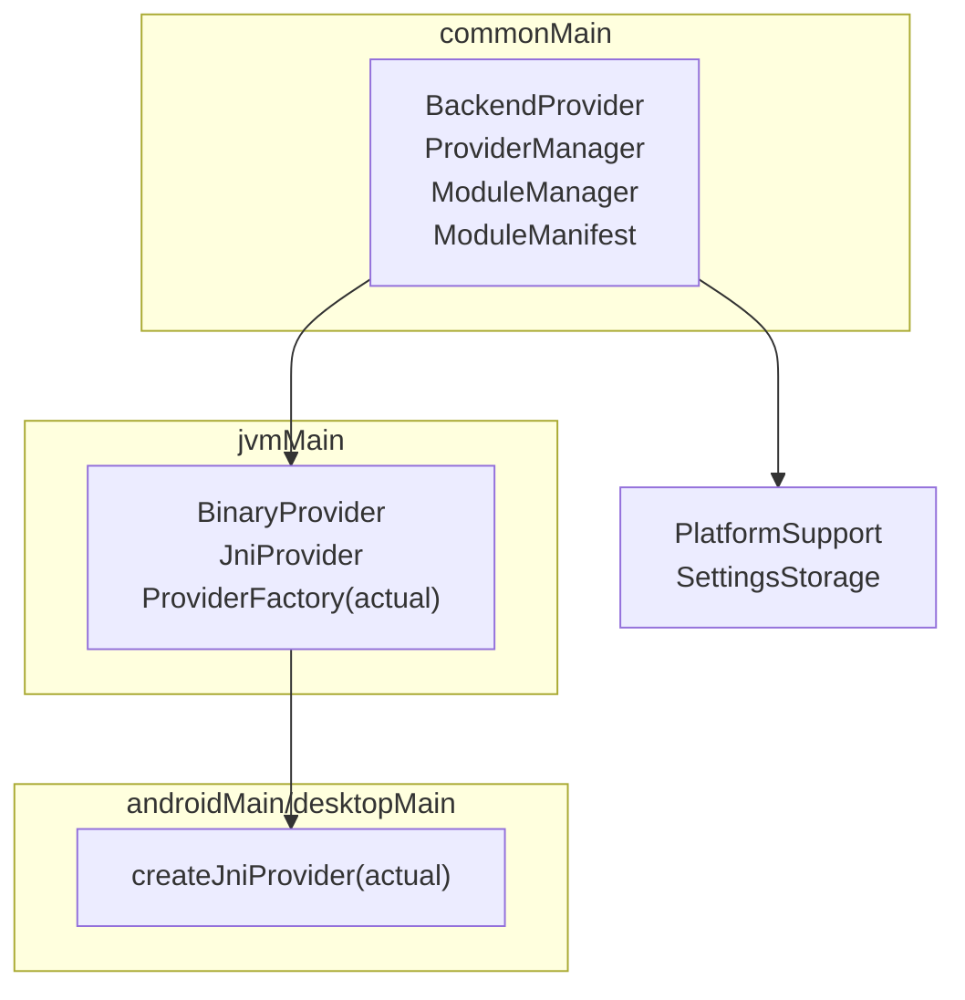
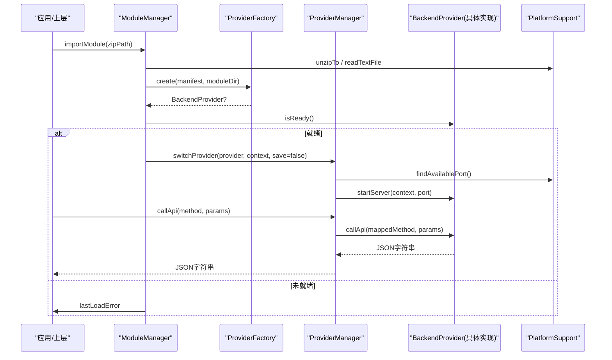
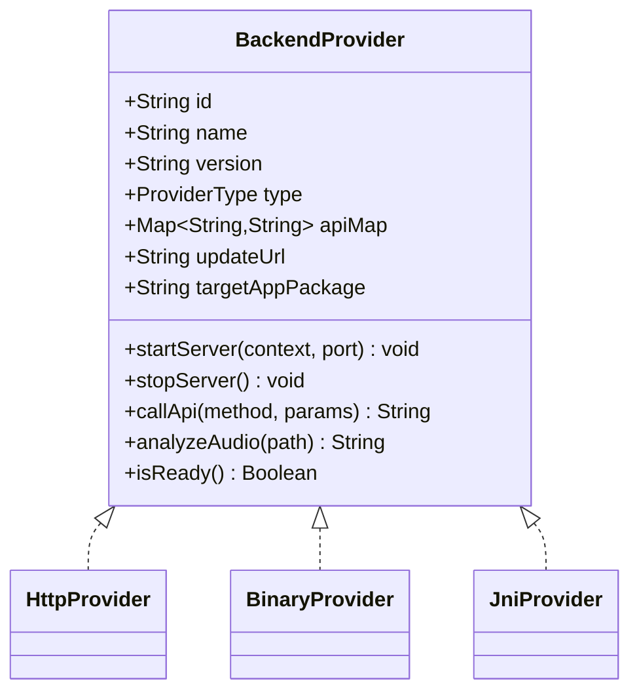
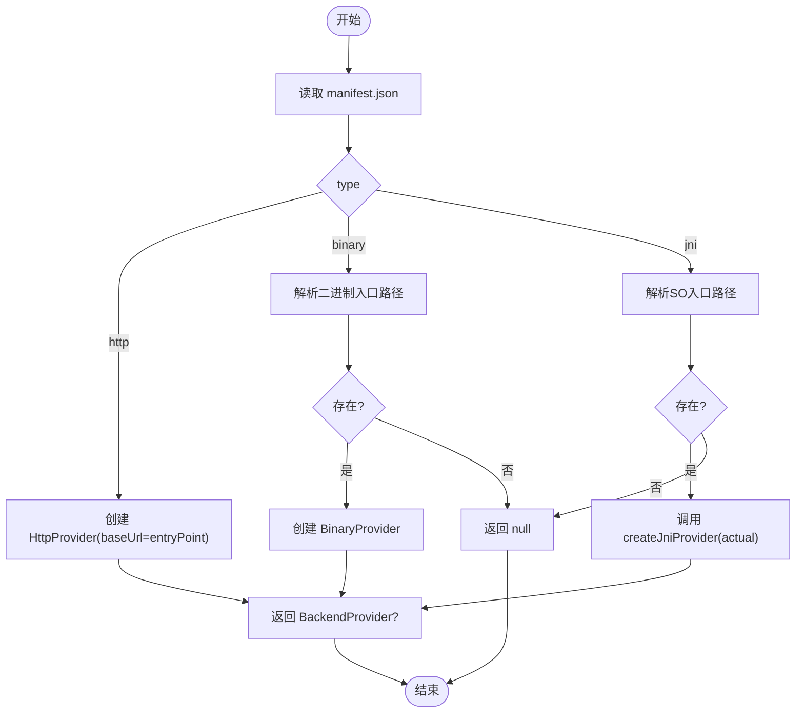
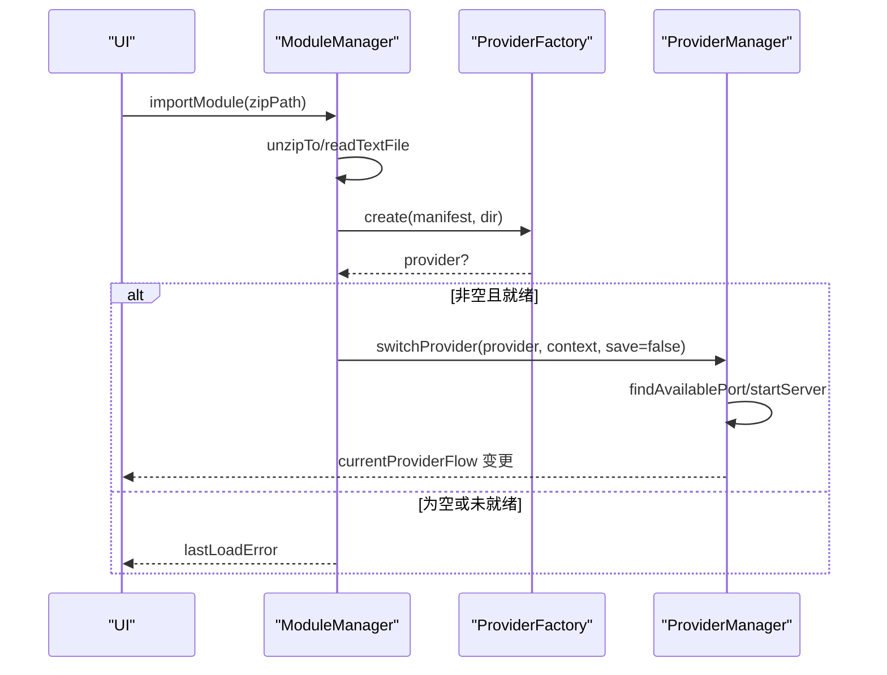
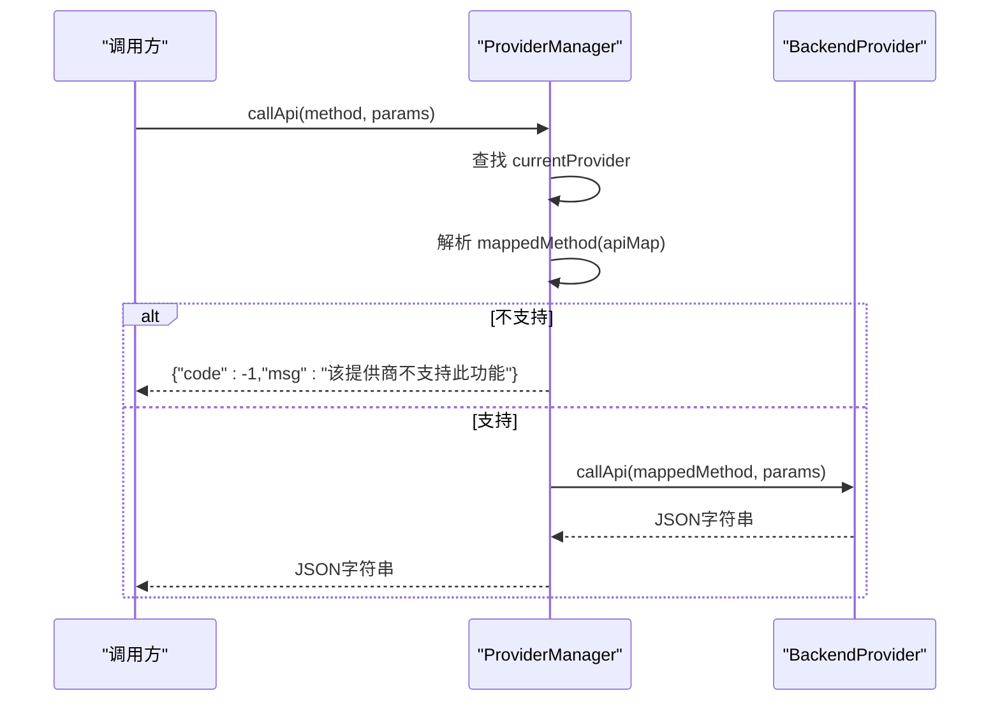
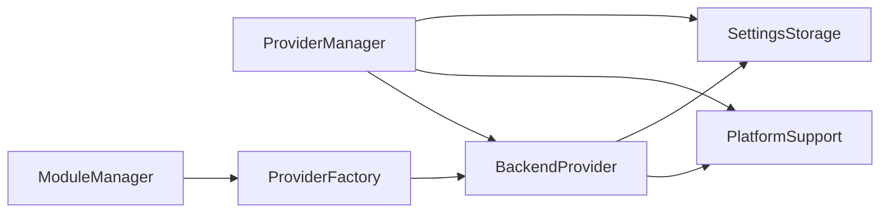

# 自定义 Provider 开发

<cite>
**本文引用的文件**
- [BackendProvider.kt](file://kmp-pro/src/commonMain/kotlin/cp/player/kmp/provider/BackendProvider.kt)
- [HttpProvider.kt](file://kmp-pro/src/commonMain/kotlin/cp/player/kmp/provider/HttpProvider.kt)
- [BinaryProvider.kt](file://kmp-pro/src/jvmMain/kotlin/cp/player/kmp/provider/BinaryProvider.kt)
- [JniProvider.kt](file://kmp-pro/src/jvmMain/kotlin/cp/player/kmp/provider/JniProvider.kt)
- [ProviderFactory.kt（common）](file://kmp-pro/src/commonMain/kotlin/cp/player/kmp/provider/ProviderFactory.kt)
- [ProviderFactory.kt（jvm）](file://kmp-pro/src/jvmMain/kotlin/cp/player/kmp/provider/ProviderFactory.kt)
- [ProviderFactory.kt（android）](file://kmp-pro/src/androidMain/kotlin/cp/player/kmp/provider/ProviderFactory.kt)
- [ProviderFactory.kt（desktop）](file://kmp-pro/src/desktopMain/kotlin/cp/player/kmp/provider/ProviderFactory.kt)
- [ModuleManager.kt](file://kmp-pro/src/commonMain/kotlin/cp/player/kmp/provider/ModuleManager.kt)
- [ModuleManifest.kt](file://kmp-pro/src/commonMain/kotlin/cp/player/kmp/provider/ModuleManifest.kt)
- [ProviderManager.kt](file://kmp-pro/src/commonMain/kotlin/cp/player/kmp/provider/ProviderManager.kt)
- [PlatformSupport.kt](file://kmp-pro/src/commonMain/kotlin/cp/player/kmp/util/PlatformSupport.kt)
- [SettingsStorage.kt](file://kmp-pro/src/commonMain/kotlin/cp/player/kmp/util/SettingsStorage.kt)
- [MusicBackend.kt](file://kmp-pro/src/commonMain/kotlin/cp/player/kmp/MusicBackend.kt)
- [BackendState.kt](file://kmp-pro/src/commonMain/kotlin/cp/player/kmp/BackendState.kt)
</cite>

## 目录
1. [简介](#简介)
2. [项目结构](#项目结构)
3. [核心组件](#核心组件)
4. [架构总览](#架构总览)
5. [详细组件分析](#详细组件分析)
6. [依赖关系分析](#依赖关系分析)
7. [性能考量](#性能考量)
8. [故障排查指南](#故障排查指南)
9. [结论](#结论)
10. [附录](#附录)

## 简介
本指南面向希望为 CPPlayer KMP 模块实现“自定义 Provider”的开发者。内容覆盖：
- 如何实现 BackendProvider 接口（必需与可选方法、返回值约定）
- Provider 注册机制、工厂类编写与模块清单配置
- 测试策略、模拟对象使用与单元测试要点
- 最佳实践、常见陷阱与性能优化建议
- 完整示例路径与部署说明

## 项目结构
Provider 子系统位于 kmp-pro 模块，采用 commonMain + jvmMain + 平台 actual 的分层组织：
- commonMain：定义 BackendProvider 接口、Provider 管理器、模块管理、清单模型等跨平台逻辑
- jvmMain：提供 BinaryProvider、JniProvider 以及 JVM 共享的 ProviderFactory
- androidMain/desktopMain：提供 createJniProvider 的平台实现

图表来源
- [BackendProvider.kt:24-110](file://kmp-pro/src/commonMain/kotlin/cp/player/kmp/provider/BackendProvider.kt#L24-L110)
- [ProviderManager.kt:31-145](file://kmp-pro/src/commonMain/kotlin/cp/player/kmp/provider/ProviderManager.kt#L31-L145)
- [ModuleManager.kt:19-137](file://kmp-pro/src/commonMain/kotlin/cp/player/kmp/provider/ModuleManager.kt#L19-L137)
- [ModuleManifest.kt:5-31](file://kmp-pro/src/commonMain/kotlin/cp/player/kmp/provider/ModuleManifest.kt#L5-L31)
- [BinaryProvider.kt:25-108](file://kmp-pro/src/jvmMain/kotlin/cp/player/kmp/provider/BinaryProvider.kt#L25-L108)
- [JniProvider.kt:9-142](file://kmp-pro/src/jvmMain/kotlin/cp/player/kmp/provider/JniProvider.kt#L9-L142)
- [ProviderFactory.kt（jvm）:5-31](file://kmp-pro/src/jvmMain/kotlin/cp/player/kmp/provider/ProviderFactory.kt#L5-L31)
- [ProviderFactory.kt（android）:1-13](file://kmp-pro/src/androidMain/kotlin/cp/player/kmp/provider/ProviderFactory.kt#L1-L13)
- [ProviderFactory.kt（desktop）:1-13](file://kmp-pro/src/desktopMain/kotlin/cp/player/kmp/provider/ProviderFactory.kt#L1-L13)
- [PlatformSupport.kt:13-59](file://kmp-pro/src/commonMain/kotlin/cp/player/kmp/util/PlatformSupport.kt#L13-L59)
- [SettingsStorage.kt:12-25](file://kmp-pro/src/commonMain/kotlin/cp/player/kmp/util/SettingsStorage.kt#L12-L25)

章节来源
- [BackendProvider.kt:24-110](file://kmp-pro/src/commonMain/kotlin/cp/player/kmp/provider/BackendProvider.kt#L24-L110)
- [ProviderManager.kt:31-145](file://kmp-pro/src/commonMain/kotlin/cp/player/kmp/provider/ProviderManager.kt#L31-L145)
- [ModuleManager.kt:19-137](file://kmp-pro/src/commonMain/kotlin/cp/player/kmp/provider/ModuleManager.kt#L19-L137)
- [ModuleManifest.kt:5-31](file://kmp-pro/src/commonMain/kotlin/cp/player/kmp/provider/ModuleManifest.kt#L5-L31)

## 核心组件
- BackendProvider：Provider 统一抽象，定义 id/name/version/type、API 映射、服务启停、调用与分析音频等能力
- ProviderManager：当前活跃 Provider 切换、端口分配、持久化最近选择、统一 API 调用入口
- ModuleManager：扫描 modulesDir、导入 zip、加载 manifest、创建并校验 Provider
- ModuleManifest：模块清单数据模型，描述类型、入口、ABI 支持、更新地址、目标 App 包名等
- ProviderFactory：根据 manifest 与模块目录创建具体 Provider（http/binary/jni）
- HttpProvider/BinaryProvider/JniProvider：三种典型后端实现
- PlatformSupport/SettingsStorage：平台能力抽象与键值存储

章节来源
- [BackendProvider.kt:24-110](file://kmp-pro/src/commonMain/kotlin/cp/player/kmp/provider/BackendProvider.kt#L24-L110)
- [ProviderManager.kt:31-145](file://kmp-pro/src/commonMain/kotlin/cp/player/kmp/provider/ProviderManager.kt#L31-L145)
- [ModuleManager.kt:19-137](file://kmp-pro/src/commonMain/kotlin/cp/player/kmp/provider/ModuleManager.kt#L19-L137)
- [ModuleManifest.kt:5-31](file://kmp-pro/src/commonMain/kotlin/cp/player/kmp/provider/ModuleManifest.kt#L5-L31)
- [ProviderFactory.kt（jvm）:5-31](file://kmp-pro/src/jvmMain/kotlin/cp/player/kmp/provider/ProviderFactory.kt#L5-L31)
- [HttpProvider.kt:23-60](file://kmp-pro/src/commonMain/kotlin/cp/player/kmp/provider/HttpProvider.kt#L23-L60)
- [BinaryProvider.kt:25-108](file://kmp-pro/src/jvmMain/kotlin/cp/player/kmp/provider/BinaryProvider.kt#L25-L108)
- [JniProvider.kt:9-142](file://kmp-pro/src/jvmMain/kotlin/cp/player/kmp/provider/JniProvider.kt#L9-L142)
- [PlatformSupport.kt:13-59](file://kmp-pro/src/commonMain/kotlin/cp/player/kmp/util/PlatformSupport.kt#L13-L59)
- [SettingsStorage.kt:12-25](file://kmp-pro/src/commonMain/kotlin/cp/player/kmp/util/SettingsStorage.kt#L12-L25)

## 架构总览
Provider 子系统通过“清单驱动 + 工厂创建 + 管理器调度”的方式解耦业务与后端实现。应用侧通过 ProviderManager 调用当前 Provider；ModuleManager 负责从磁盘加载模块并创建实例；PlatformSupport 屏蔽平台差异。

图表来源
- [ModuleManager.kt:57-117](file://kmp-pro/src/commonMain/kotlin/cp/player/kmp/provider/ModuleManager.kt#L57-L117)
- [ProviderFactory.kt（jvm）:5-31](file://kmp-pro/src/jvmMain/kotlin/cp/player/kmp/provider/ProviderFactory.kt#L5-L31)
- [ProviderManager.kt:65-141](file://kmp-pro/src/commonMain/kotlin/cp/player/kmp/provider/ProviderManager.kt#L65-L141)
- [PlatformSupport.kt:13-59](file://kmp-pro/src/commonMain/kotlin/cp/player/kmp/util/PlatformSupport.kt#L13-L59)

## 详细组件分析

### 实现 BackendProvider 接口
- 必需字段与方法
  - id/name/version/type：标识与元信息
  - apiMap：将内部标准方法名映射到 Provider 实际端点；值为 "unsupported" 表示不支持
  - startServer(context, port)/stopServer：启动/停止后端服务（HTTP 类型可为空操作）
  - callApi(method, params)：返回 JSON 字符串
- 可选方法与扩展
  - analyzeAudio(path)：可选音频分析能力
  - updateUrl/targetAppPackage：更新检查与目标 App 跳转（Android）
  - isReady()：默认 true，JNI/Binary 可重写以报告加载失败原因
- 返回值约定
  - 成功：JSON 字符串（通常包含 code/msg/data）
  - 失败：包装错误码与消息的 JSON 字符串，避免抛异常上抛

图表来源
- [BackendProvider.kt:24-110](file://kmp-pro/src/commonMain/kotlin/cp/player/kmp/provider/BackendProvider.kt#L24-L110)
- [HttpProvider.kt:23-60](file://kmp-pro/src/commonMain/kotlin/cp/player/kmp/provider/HttpProvider.kt#L23-L60)
- [BinaryProvider.kt:25-108](file://kmp-pro/src/jvmMain/kotlin/cp/player/kmp/provider/BinaryProvider.kt#L25-L108)
- [JniProvider.kt:9-142](file://kmp-pro/src/jvmMain/kotlin/cp/player/kmp/provider/JniProvider.kt#L9-L142)

章节来源
- [BackendProvider.kt:24-110](file://kmp-pro/src/commonMain/kotlin/cp/player/kmp/provider/BackendProvider.kt#L24-L110)
- [HttpProvider.kt:23-60](file://kmp-pro/src/commonMain/kotlin/cp/player/kmp/provider/HttpProvider.kt#L23-L60)
- [BinaryProvider.kt:25-108](file://kmp-pro/src/jvmMain/kotlin/cp/player/kmp/provider/BinaryProvider.kt#L25-L108)
- [JniProvider.kt:9-142](file://kmp-pro/src/jvmMain/kotlin/cp/player/kmp/provider/JniProvider.kt#L9-L142)

### Provider 注册机制与工厂类
- 清单驱动：每个模块目录含 manifest.json，声明 id/name/version/type/entryPoint/apiMap/updateUrl/supportedAbis/targetAppPackage
- 工厂创建：ProviderFactory.create 根据 type 创建对应 Provider；binary/jni 会解析 ABI 适配后的入口路径
- 平台差异：createJniProvider 在 androidMain/desktopMain 分别返回 JniProvider

图表来源
- [ModuleManifest.kt:5-31](file://kmp-pro/src/commonMain/kotlin/cp/player/kmp/provider/ModuleManifest.kt#L5-L31)
- [ProviderFactory.kt（jvm）:5-31](file://kmp-pro/src/jvmMain/kotlin/cp/player/kmp/provider/ProviderFactory.kt#L5-L31)
- [ProviderFactory.kt（android）:1-13](file://kmp-pro/src/androidMain/kotlin/cp/player/kmp/provider/ProviderFactory.kt#L1-L13)
- [ProviderFactory.kt（desktop）:1-13](file://kmp-pro/src/desktopMain/kotlin/cp/player/kmp/provider/ProviderFactory.kt#L1-L13)
- [PlatformSupport.kt:38-52](file://kmp-pro/src/commonMain/kotlin/cp/player/kmp/util/PlatformSupport.kt#L38-L52)

章节来源
- [ModuleManifest.kt:5-31](file://kmp-pro/src/commonMain/kotlin/cp/player/kmp/provider/ModuleManifest.kt#L5-L31)
- [ProviderFactory.kt（jvm）:5-31](file://kmp-pro/src/jvmMain/kotlin/cp/player/kmp/provider/ProviderFactory.kt#L5-L31)
- [ProviderFactory.kt（android）:1-13](file://kmp-pro/src/androidMain/kotlin/cp/player/kmp/provider/ProviderFactory.kt#L1-L13)
- [ProviderFactory.kt（desktop）:1-13](file://kmp-pro/src/desktopMain/kotlin/cp/player/kmp/provider/ProviderFactory.kt#L1-L13)

### 模块清单配置（manifest.json）
关键字段说明：
- id/name/version：模块标识与显示信息
- type：枚举 "jni"/"binary"/"http"
- entryPoint：入口文件（二进制或 SO），或 http 服务的 baseUrl
- apiMap：方法名映射表
- updateUrl：可选，用于版本检查
- supportedAbis：可选，多 ABI 列表，配合 resolveEntryPoint 自动选择
- targetAppPackage：可选，Android 登录跳转目标包名

章节来源
- [ModuleManifest.kt:5-31](file://kmp-pro/src/commonMain/kotlin/cp/player/kmp/provider/ModuleManifest.kt#L5-L31)

### 模块管理与加载流程
- 扫描与导入：ModuleManager 扫描 modulesDir，支持导入 zip，解压后读取 manifest.json 并创建 Provider
- 就绪性检查：创建后调用 isReady()，若失败则记录 lastLoadError
- 恢复与激活：结合 ProviderManager.restoreLastProvider 恢复上次选择的 Provider

图表来源
- [ModuleManager.kt:57-117](file://kmp-pro/src/commonMain/kotlin/cp/player/kmp/provider/ModuleManager.kt#L57-L117)
- [ProviderManager.kt:65-109](file://kmp-pro/src/commonMain/kotlin/cp/player/kmp/provider/ProviderManager.kt#L65-L109)

章节来源
- [ModuleManager.kt:57-117](file://kmp-pro/src/commonMain/kotlin/cp/player/kmp/provider/ModuleManager.kt#L57-L117)
- [ProviderManager.kt:65-109](file://kmp-pro/src/commonMain/kotlin/cp/player/kmp/provider/ProviderManager.kt#L65-L109)

### 调用链与状态管理
- ProviderManager.callApi：在 IO 线程执行，按 apiMap 映射方法名，处理 unsupported 与异常
- MusicBackend/BackendState：封装初始化、切换、就绪状态与错误提取（反射获取 getLoadError）

图表来源
- [ProviderManager.kt:123-141](file://kmp-pro/src/commonMain/kotlin/cp/player/kmp/provider/ProviderManager.kt#L123-L141)
- [MusicBackend.kt:282-314](file://kmp-pro/src/commonMain/kotlin/cp/player/kmp/MusicBackend.kt#L282-L314)
- [BackendState.kt:31-72](file://kmp-pro/src/commonMain/kotlin/cp/player/kmp/BackendState.kt#L31-L72)

章节来源
- [ProviderManager.kt:123-141](file://kmp-pro/src/commonMain/kotlin/cp/player/kmp/provider/ProviderManager.kt#L123-L141)
- [MusicBackend.kt:282-314](file://kmp-pro/src/commonMain/kotlin/cp/player/kmp/MusicBackend.kt#L282-L314)
- [BackendState.kt:31-72](file://kmp-pro/src/commonMain/kotlin/cp/player/kmp/BackendState.kt#L31-L72)

### 三种 Provider 实现要点
- HttpProvider
  - 适合对接已有 HTTP API 服务；startServer/stopServer 为空操作
  - callApi 使用 Ktor 发起 POST 请求，参数转为 JSON 体
- BinaryProvider
  - 启动独立进程（ProcessBuilder），传 --port 参数
  - 通信：HTTP POST 到 localhost:port/api/<method>
  - 启动前进行 ELF 校验与权限设置
- JniProvider
  - 通过 System.load 加载 .so，暴露 external 函数与 Java 交互
  - 启动时调用 native 服务监听端口；callApi 将参数序列化为 JSON 传入 native
  - 对崩溃与链接错误做保护，回退 to not-loaded 状态

章节来源
- [HttpProvider.kt:23-60](file://kmp-pro/src/commonMain/kotlin/cp/player/kmp/provider/HttpProvider.kt#L23-L60)
- [BinaryProvider.kt:25-108](file://kmp-pro/src/jvmMain/kotlin/cp/player/kmp/provider/BinaryProvider.kt#L25-L108)
- [JniProvider.kt:9-142](file://kmp-pro/src/jvmMain/kotlin/cp/player/kmp/provider/JniProvider.kt#L9-L142)

## 依赖关系分析
- 耦合与内聚
  - ProviderManager 仅依赖 BackendProvider 抽象与 PlatformSupport/SettingsStorage，内聚良好
  - ModuleManager 依赖 ProviderFactory 与 PlatformSupport，职责清晰
  - 各 Provider 实现仅依赖各自运行时能力（Ktor/Process/System.load）
- 外部依赖与集成点
  - PlatformSupport：端口探测、文件系统、ELF 校验、ABI 解析
  - SettingsStorage：Cookie 与最近 Provider 持久化
  - Ktor：HTTP 客户端（HttpProvider/BinaryProvider）

图表来源
- [ProviderManager.kt:31-145](file://kmp-pro/src/commonMain/kotlin/cp/player/kmp/provider/ProviderManager.kt#L31-L145)
- [ModuleManager.kt:19-137](file://kmp-pro/src/commonMain/kotlin/cp/player/kmp/provider/ModuleManager.kt#L19-L137)
- [ProviderFactory.kt（jvm）:5-31](file://kmp-pro/src/jvmMain/kotlin/cp/player/kmp/provider/ProviderFactory.kt#L5-L31)
- [PlatformSupport.kt:13-59](file://kmp-pro/src/commonMain/kotlin/cp/player/kmp/util/PlatformSupport.kt#L13-L59)
- [SettingsStorage.kt:12-25](file://kmp-pro/src/commonMain/kotlin/cp/player/kmp/util/SettingsStorage.kt#L12-L25)

章节来源
- [ProviderManager.kt:31-145](file://kmp-pro/src/commonMain/kotlin/cp/player/kmp/provider/ProviderManager.kt#L31-L145)
- [ModuleManager.kt:19-137](file://kmp-pro/src/commonMain/kotlin/cp/player/kmp/provider/ModuleManager.kt#L19-L137)
- [ProviderFactory.kt（jvm）:5-31](file://kmp-pro/src/jvmMain/kotlin/cp/player/kmp/provider/ProviderFactory.kt#L5-L31)

## 性能考量
- 端口分配：ProviderManager 使用 findAvailablePort 批量尝试，避免阻塞与冲突
- 网络 I/O：HttpProvider/BinaryProvider 使用 Ktor 异步客户端，callApi 同步契约通过 runBlocking 桥接
- 本地库加载：JniProvider 延迟加载，失败快速失败并记录错误；BinaryProvider 启动前 ELF 校验减少无效进程
- 缓存与健康监控：上层 CachedMusicApiService 提供缓存与三级健康分类，降低 Provider 压力与提升响应速度

[本节为通用指导，不直接分析具体文件]

## 故障排查指南
- 模块导入失败
  - 检查 zip 是否包含 manifest.json；查看 ModuleManager.lastLoadError
- Provider 未就绪
  - 检查 isReady()；JNI/Binary 可通过反射获取 getLoadError 详情
- 端口占用
  - 调整默认端口或扩大 MAX_PORT_ATTEMPTS；确认其他进程未占用
- JNI 加载失败
  - 确认 so 文件存在、可读、大小合理、ABI 匹配；查看 validateElfHeader 结果
- 二进制启动失败
  - 确认文件可执行、ELF 校验通过、进程启动无异常

章节来源
- [ModuleManager.kt:57-117](file://kmp-pro/src/commonMain/kotlin/cp/player/kmp/provider/ModuleManager.kt#L57-L117)
- [JniProvider.kt:23-142](file://kmp-pro/src/jvmMain/kotlin/cp/player/kmp/provider/JniProvider.kt#L23-L142)
- [BinaryProvider.kt:42-81](file://kmp-pro/src/jvmMain/kotlin/cp/player/kmp/provider/BinaryProvider.kt#L42-L81)
- [PlatformSupport.kt:48-52](file://kmp-pro/src/commonMain/kotlin/cp/player/kmp/util/PlatformSupport.kt#L48-L52)

## 结论
通过 BackendProvider 抽象与清单驱动的模块系统，CPPlayer 实现了高度可扩展的后端接入能力。开发者只需关注 Provider 的具体实现与清单配置，即可无缝集成新的音乐源或服务。结合 ProviderManager 的生命周期管理与 PlatformSupport 的平台抽象，可在 Android/Desktop 保持一致体验。

[本节为总结性内容，不直接分析具体文件]

## 附录

### 开发步骤清单
- 设计并实现 BackendProvider（推荐基于现有 HttpProvider/BinaryProvider/JniProvider 之一扩展）
- 编写 manifest.json，填写 id/name/version/type/entryPoint 等必要字段
- 在 jvmMain ProviderFactory 中确保 create 能识别你的 type 并创建实例（如新增新类型）
- 如需 JNI，提供 androidMain/desktopMain 的 createJniProvider 实现
- 打包模块为 zip，放入 modulesDir，由 ModuleManager 自动发现与加载
- 通过 ProviderManager 切换并调用 API，观察 currentProviderFlow 与 lastLoadError

章节来源
- [BackendProvider.kt:24-110](file://kmp-pro/src/commonMain/kotlin/cp/player/kmp/provider/BackendProvider.kt#L24-L110)
- [ModuleManifest.kt:5-31](file://kmp-pro/src/commonMain/kotlin/cp/player/kmp/provider/ModuleManifest.kt#L5-L31)
- [ProviderFactory.kt（jvm）:5-31](file://kmp-pro/src/jvmMain/kotlin/cp/player/kmp/provider/ProviderFactory.kt#L5-L31)
- [ProviderFactory.kt（android）:1-13](file://kmp-pro/src/androidMain/kotlin/cp/player/kmp/provider/ProviderFactory.kt#L1-L13)
- [ProviderFactory.kt（desktop）:1-13](file://kmp-pro/src/desktopMain/kotlin/cp/player/kmp/provider/ProviderFactory.kt#L1-L13)
- [ModuleManager.kt:57-117](file://kmp-pro/src/commonMain/kotlin/cp/player/kmp/provider/ModuleManager.kt#L57-L117)

### 测试策略与单元测试
- 单元测试
  - 针对 ProviderManager.callApi：构造不同 apiMap 场景（正常映射、unsupported、null），断言返回 JSON 中的 code/msg
  - 针对 ModuleManager.importModule：mock PlatformSupport.unzipTo/readTextFile/moveDir，验证 lastLoadError 与 providers 集合
  - 针对 ProviderFactory.create：构造不同 manifest.type，验证返回 Provider 类型与路径解析
- 模拟对象
  - 使用内存实现的 SettingsStorage（clear 便于隔离用例）
  - 替换 PlatformSupport 的 actual 实现或使用 mock 框架拦截文件系统与端口探测
- 集成测试
  - 启动一个本地 HTTP 服务作为 HttpProvider 的目标，验证端到端调用链路
  - 对于 BinaryProvider/JniProvider，准备最小可用二进制/SO，验证启动与调用

章节来源
- [ProviderManager.kt:123-141](file://kmp-pro/src/commonMain/kotlin/cp/player/kmp/provider/ProviderManager.kt#L123-L141)
- [ModuleManager.kt:57-117](file://kmp-pro/src/commonMain/kotlin/cp/player/kmp/provider/ModuleManager.kt#L57-L117)
- [ProviderFactory.kt（jvm）:5-31](file://kmp-pro/src/jvmMain/kotlin/cp/player/kmp/provider/ProviderFactory.kt#L5-L31)
- [SettingsStorage.kt:12-25](file://kmp-pro/src/commonMain/kotlin/cp/player/kmp/util/SettingsStorage.kt#L12-L25)

### 最佳实践
- 始终在 callApi 中返回规范 JSON（包含 code/msg），便于上层统一处理
- 使用 apiMap 显式标记不支持的功能为 "unsupported"，避免隐式失败
- 在 isReady 中尽早暴露加载/启动失败原因，便于 UI 提示
- 使用 PlatformSupport.resolveEntryPoint 与 validateElfHeader 保证 ABI 与文件完整性
- 通过 ProviderCookieStorage 按 providerId 隔离 cookie，避免账号串扰

章节来源
- [BackendProvider.kt:24-110](file://kmp-pro/src/commonMain/kotlin/cp/player/kmp/provider/BackendProvider.kt#L24-L110)
- [ProviderManager.kt:147-156](file://kmp-pro/src/commonMain/kotlin/cp/player/kmp/provider/ProviderManager.kt#L147-L156)
- [PlatformSupport.kt:38-52](file://kmp-pro/src/commonMain/kotlin/cp/player/kmp/util/PlatformSupport.kt#L38-L52)

### 部署说明
- 模块目录结构
  - 根目录包含 manifest.json
  - binary/jni 类型需包含入口文件（或 lib/{abi}/... 多 ABI 目录）
- 安装方式
  - 将 zip 放入 modulesDir，或通过 ModuleManager.importModule 动态导入
- 运行要求
  - 确保端口可用（默认起始端口可配置）
  - 二进制需具备执行权限；JNI 需 ABI 匹配且可加载

章节来源
- [ModuleManager.kt:57-117](file://kmp-pro/src/commonMain/kotlin/cp/player/kmp/provider/ModuleManager.kt#L57-L117)
- [PlatformSupport.kt:38-52](file://kmp-pro/src/commonMain/kotlin/cp/player/kmp/util/PlatformSupport.kt#L38-L52)