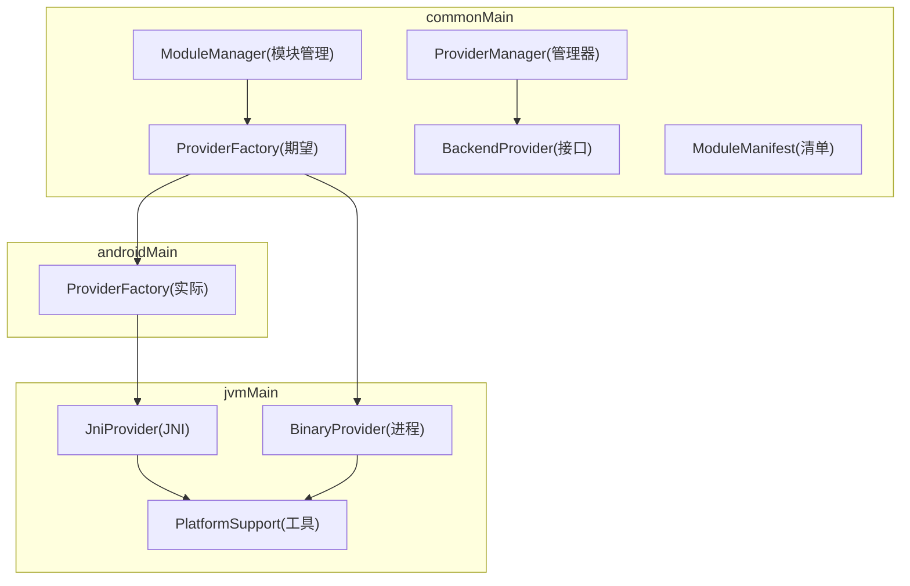
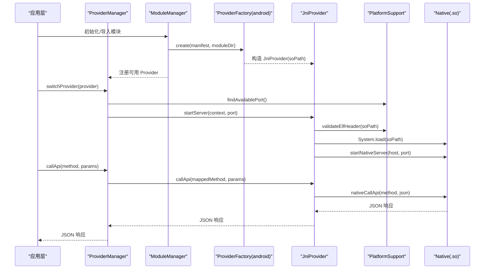
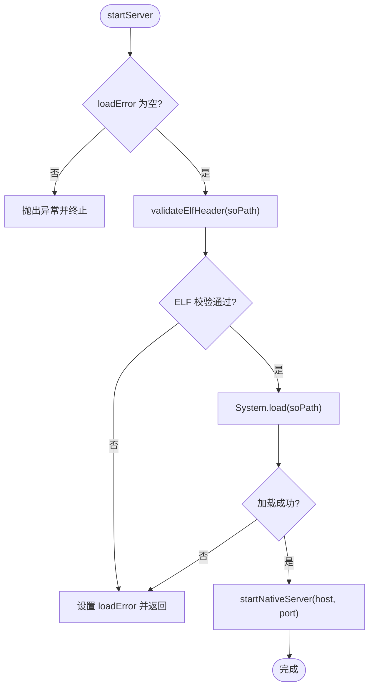
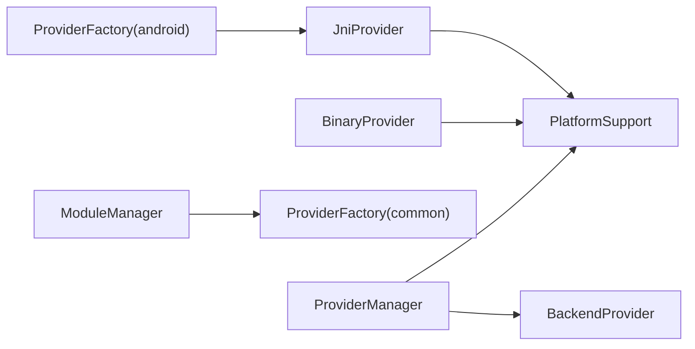

# Android Provider 工厂

<cite>
**本文引用的文件**
- [kmp-pro/src/androidMain/kotlin/cp/player/kmp/provider/ProviderFactory.kt](file://kmp-pro/src/androidMain/kotlin/cp/player/kmp/provider/ProviderFactory.kt)
- [kmp-pro/src/commonMain/kotlin/cp/player/kmp/provider/ProviderFactory.kt](file://kmp-pro/src/commonMain/kotlin/cp/player/kmp/provider/ProviderFactory.kt)
- [kmp-pro/src/jvmMain/kotlin/cp/player/kmp/provider/JniProvider.kt](file://kmp-pro/src/jvmMain/kotlin/cp/player/kmp/provider/JniProvider.kt)
- [kmp-pro/src/jvmMain/kotlin/cp/player/kmp/provider/BinaryProvider.kt](file://kmp-pro/src/jvmMain/kotlin/cp/player/kmp/provider/BinaryProvider.kt)
- [kmp-pro/src/commonMain/kotlin/cp/player/kmp/provider/BackendProvider.kt](file://kmp-pro/src/commonMain/kotlin/cp/player/kmp/provider/BackendProvider.kt)
- [kmp-pro/src/commonMain/kotlin/cp/player/kmp/provider/ModuleManifest.kt](file://kmp-pro/src/commonMain/kotlin/cp/player/kmp/provider/ModuleManifest.kt)
- [kmp-pro/src/commonMain/kotlin/cp/player/kmp/provider/ModuleManager.kt](file://kmp-pro/src/commonMain/kotlin/cp/player/kmp/provider/ModuleManager.kt)
- [kmp-pro/src/commonMain/kotlin/cp/player/kmp/provider/ProviderManager.kt](file://kmp-pro/src/commonMain/kotlin/cp/player/kmp/provider/ProviderManager.kt)
- [kmp-pro/src/jvmMain/kotlin/cp/player/kmp/util/PlatformSupport.kt](file://kmp-pro/src/jvmMain/kotlin/cp/player/kmp/util/PlatformSupport.kt)
</cite>

## 目录
1. [简介](#简介)
2. [项目结构](#项目结构)
3. [核心组件](#核心组件)
4. [架构总览](#架构总览)
5. [详细组件分析](#详细组件分析)
6. [依赖关系分析](#依赖关系分析)
7. [性能与内存优化](#性能与内存优化)
8. [故障排除与调试](#故障排除与调试)
9. [扩展与定制指南](#扩展与定制指南)
10. [结论](#结论)

## 简介
本技术文档聚焦 CPPlayer-KMP 在 Android 平台下的 Provider 工厂实现，深入解析 JNI 模块加载机制、二进制文件处理、动态库集成等核心技术。重点说明 JniProvider 的工作原理（JNI 接口定义、原生调用、错误处理与资源管理），并给出 Android 平台的性能优化策略、内存管理最佳实践以及 JNI 相关的调试与排错方法。文末提供完整的扩展与定制示例路径，帮助开发者快速接入或替换 Android 平台的 Provider 实现。

## 项目结构
CPPlayer-KMP 通过 KMP expect/actual 机制将 Provider 的创建逻辑按平台拆分：
- commonMain 中声明 ProviderFactory 的期望接口与通用类型（如 BackendProvider、ModuleManifest）。
- jvmMain 提供 JVM 共享的 JniProvider、BinaryProvider 与 PlatformSupport。
- androidMain 提供 createJniProvider 的实际实现，用于 Android 平台构造 JniProvider。

图表来源
- [kmp-pro/src/commonMain/kotlin/cp/player/kmp/provider/ProviderFactory.kt:1-29](file://kmp-pro/src/commonMain/kotlin/cp/player/kmp/provider/ProviderFactory.kt#L1-L29)
- [kmp-pro/src/androidMain/kotlin/cp/player/kmp/provider/ProviderFactory.kt:1-13](file://kmp-pro/src/androidMain/kotlin/cp/player/kmp/provider/ProviderFactory.kt#L1-L13)
- [kmp-pro/src/jvmMain/kotlin/cp/player/kmp/provider/JniProvider.kt:1-142](file://kmp-pro/src/jvmMain/kotlin/cp/player/kmp/provider/JniProvider.kt#L1-L142)
- [kmp-pro/src/jvmMain/kotlin/cp/player/kmp/provider/BinaryProvider.kt:1-108](file://kmp-pro/src/jvmMain/kotlin/cp/player/kmp/provider/BinaryProvider.kt#L1-L108)
- [kmp-pro/src/commonMain/kotlin/cp/player/kmp/provider/BackendProvider.kt:1-110](file://kmp-pro/src/commonMain/kotlin/cp/player/kmp/provider/BackendProvider.kt#L1-L110)
- [kmp-pro/src/commonMain/kotlin/cp/player/kmp/provider/ModuleManifest.kt:1-31](file://kmp-pro/src/commonMain/kotlin/cp/player/kmp/provider/ModuleManifest.kt#L1-L31)
- [kmp-pro/src/commonMain/kotlin/cp/player/kmp/provider/ModuleManager.kt:1-137](file://kmp-pro/src/commonMain/kotlin/cp/player/kmp/provider/ModuleManager.kt#L1-L137)
- [kmp-pro/src/commonMain/kotlin/cp/player/kmp/provider/ProviderManager.kt:1-156](file://kmp-pro/src/commonMain/kotlin/cp/player/kmp/provider/ProviderManager.kt#L1-L156)
- [kmp-pro/src/jvmMain/kotlin/cp/player/kmp/util/PlatformSupport.kt:1-135](file://kmp-pro/src/jvmMain/kotlin/cp/player/kmp/util/PlatformSupport.kt#L1-L135)

章节来源
- [kmp-pro/src/commonMain/kotlin/cp/player/kmp/provider/ProviderFactory.kt:1-29](file://kmp-pro/src/commonMain/kotlin/cp/player/kmp/provider/ProviderFactory.kt#L1-L29)
- [kmp-pro/src/androidMain/kotlin/cp/player/kmp/provider/ProviderFactory.kt:1-13](file://kmp-pro/src/androidMain/kotlin/cp/player/kmp/provider/ProviderFactory.kt#L1-L13)

## 核心组件
- BackendProvider：统一的后端 Provider 抽象，定义了启动/停止服务、API 调用、音频分析、就绪状态检查等能力。
- ProviderFactory：跨平台工厂，负责根据 ModuleManifest 与模块目录创建具体 Provider；Android 平台通过 actual 函数 createJniProvider 返回 JniProvider。
- JniProvider：基于 JNI 的动态库 Provider，负责加载 .so、启动本地服务、调用 native 方法、处理异常与资源释放。
- BinaryProvider：独立可执行文件 Provider，通过进程启动并以 HTTP 通信。
- ModuleManager：扫描 modules 目录、导入 zip、解析 manifest 并创建 Provider，维护可用 Provider 列表。
- ProviderManager：管理当前活跃 Provider、端口分配、切换与持久化，并提供统一的 callApi 入口。
- PlatformSupport：JVM 共享的工具类，包含端口探测、解压、ELF 校验、ABI 选择等。

章节来源
- [kmp-pro/src/commonMain/kotlin/cp/player/kmp/provider/BackendProvider.kt:1-110](file://kmp-pro/src/commonMain/kotlin/cp/player/kmp/provider/BackendProvider.kt#L1-L110)
- [kmp-pro/src/commonMain/kotlin/cp/player/kmp/provider/ModuleManager.kt:1-137](file://kmp-pro/src/commonMain/kotlin/cp/player/kmp/provider/ModuleManager.kt#L1-L137)
- [kmp-pro/src/commonMain/kotlin/cp/player/kmp/provider/ProviderManager.kt:1-156](file://kmp-pro/src/commonMain/kotlin/cp/player/kmp/provider/ProviderManager.kt#L1-L156)
- [kmp-pro/src/jvmMain/kotlin/cp/player/kmp/util/PlatformSupport.kt:1-135](file://kmp-pro/src/jvmMain/kotlin/cp/player/kmp/util/PlatformSupport.kt#L1-L135)

## 架构总览
下图展示了从模块加载到 API 调用的完整流程，涵盖 Android 平台下 JNI Provider 的生命周期与调用链。

图表来源
- [kmp-pro/src/commonMain/kotlin/cp/player/kmp/provider/ModuleManager.kt:38-117](file://kmp-pro/src/commonMain/kotlin/cp/player/kmp/provider/ModuleManager.kt#L38-L117)
- [kmp-pro/src/commonMain/kotlin/cp/player/kmp/provider/ProviderManager.kt:65-141](file://kmp-pro/src/commonMain/kotlin/cp/player/kmp/provider/ProviderManager.kt#L65-L141)
- [kmp-pro/src/androidMain/kotlin/cp/player/kmp/provider/ProviderFactory.kt:1-13](file://kmp-pro/src/androidMain/kotlin/cp/player/kmp/provider/ProviderFactory.kt#L1-L13)
- [kmp-pro/src/jvmMain/kotlin/cp/player/kmp/provider/JniProvider.kt:39-96](file://kmp-pro/src/jvmMain/kotlin/cp/player/kmp/provider/JniProvider.kt#L39-L96)
- [kmp-pro/src/jvmMain/kotlin/cp/player/kmp/util/PlatformSupport.kt:67-121](file://kmp-pro/src/jvmMain/kotlin/cp/player/kmp/util/PlatformSupport.kt#L67-L121)

## 详细组件分析

### Android ProviderFactory（createJniProvider）
- 职责：在 Android 平台将 Manifest 与已解析的 soPath 转换为 JniProvider 实例。
- 关键点：
  - 使用 Manifest 中的 id、name、version、apiMap、updateUrl、targetAppPackage 构造 JniProvider。
  - soPath 由上层（ModuleManager + PlatformSupport.resolveEntryPoint）根据 ABI 选择后传入。
- 设计优势：保持 commonMain 与 jvmMain 的统一性，Android 侧仅关注 JNI Provider 的创建。

章节来源
- [kmp-pro/src/androidMain/kotlin/cp/player/kmp/provider/ProviderFactory.kt:1-13](file://kmp-pro/src/androidMain/kotlin/cp/player/kmp/provider/ProviderFactory.kt#L1-L13)
- [kmp-pro/src/commonMain/kotlin/cp/player/kmp/provider/ProviderFactory.kt:1-29](file://kmp-pro/src/commonMain/kotlin/cp/player/kmp/provider/ProviderFactory.kt#L1-L29)
- [kmp-pro/src/commonMain/kotlin/cp/player/kmp/provider/ModuleManifest.kt:1-31](file://kmp-pro/src/commonMain/kotlin/cp/player/kmp/provider/ModuleManifest.kt#L1-L31)

### JniProvider（JNI 后端）
- 职责：加载 .so 动态库、启动本地服务、调用 native 方法、处理崩溃与错误、管理生命周期。
- 关键流程：
  - 构造函数：校验 soPath 是否存在。
  - startServer：校验 ELF、System.load、调用 startNativeServer。
  - callApi：构建 JSON 参数、调用 nativeCallApi、捕获异常并降级为错误 JSON。
  - analyzeAudio：调用 analyzeAudioFile，异常时返回错误 JSON。
  - stopServer：重置加载状态。
- 错误处理：
  - loadError 记录加载失败原因（文件不存在、权限不足、链接失败、崩溃等）。
  - isReady 暴露就绪状态，供上层在切换前检查。
- 日志：内部 log 输出便于调试。

图表来源
- [kmp-pro/src/jvmMain/kotlin/cp/player/kmp/provider/JniProvider.kt:39-136](file://kmp-pro/src/jvmMain/kotlin/cp/player/kmp/provider/JniProvider.kt#L39-L136)
- [kmp-pro/src/jvmMain/kotlin/cp/player/kmp/util/PlatformSupport.kt:89-121](file://kmp-pro/src/jvmMain/kotlin/cp/player/kmp/util/PlatformSupport.kt#L89-L121)

章节来源
- [kmp-pro/src/jvmMain/kotlin/cp/player/kmp/provider/JniProvider.kt:1-142](file://kmp-pro/src/jvmMain/kotlin/cp/player/kmp/provider/JniProvider.kt#L1-L142)

### BinaryProvider（进程后端）
- 职责：以独立进程方式运行二进制文件，并通过 HTTP 与 CPPlayer 通信。
- 关键点：
  - 启动时校验 ELF、设置可执行权限、ProcessBuilder 启动进程。
  - 通过 Ktor HTTP 客户端 POST 到 http://127.0.0.1:port/api/<method>。
  - 异常时返回错误 JSON，stopServer 销毁进程。
- 适用场景：当需要隔离运行时环境或避免 JNI 直接嵌入时使用。

章节来源
- [kmp-pro/src/jvmMain/kotlin/cp/player/kmp/provider/BinaryProvider.kt:1-108](file://kmp-pro/src/jvmMain/kotlin/cp/player/kmp/provider/BinaryProvider.kt#L1-L108)

### ModuleManager（模块管理）
- 职责：扫描 modules 目录、导入 zip、解析 manifest、创建 Provider、维护可用列表。
- 关键点：
  - importModule：解压 zip、校验 manifest.json、移动到目标目录、加载模块。
  - loadModuleIfExists：读取 manifest、调用 ProviderFactory.create、判断 isReady。
  - extractLoadError：反射获取 getLoadError 以便展示详细错误。
- 错误信息：lastLoadError 用于 UI 展示最近一次加载失败原因。

章节来源
- [kmp-pro/src/commonMain/kotlin/cp/player/kmp/provider/ModuleManager.kt:1-137](file://kmp-pro/src/commonMain/kotlin/cp/player/kmp/provider/ModuleManager.kt#L1-L137)

### ProviderManager（提供者管理）
- 职责：管理当前活跃 Provider、端口分配、切换与持久化，提供统一 callApi 入口。
- 关键点：
  - startServer：自动寻找可用端口并启动当前 Provider。
  - switchProvider：停止旧 Provider、启动新 Provider、保存选择、通知监听器。
  - callApi：通过 apiMap 映射方法名，封装异常为错误 JSON。
- 端口策略：findAvailablePort 尝试连续端口，避免冲突。

章节来源
- [kmp-pro/src/commonMain/kotlin/cp/player/kmp/provider/ProviderManager.kt:1-156](file://kmp-pro/src/commonMain/kotlin/cp/player/kmp/provider/ProviderManager.kt#L1-L156)

### PlatformSupport（平台支持）
- 职责：JVM 共享工具，包括端口探测、解压、文件操作、ABI 选择、ELF 校验。
- 关键点：
  - resolveEntryPoint：按平台 ABI 顺序查找 lib/{abi}/entryPoint，支持 manifest 显式 supportedAbis 交集匹配。
  - validateElfHeader：读取 ELF 魔数与 e_machine，校验是否与当前设备 ABI 匹配。
  - unzipTo：安全解压 zip，防止路径穿越。
- 对 JNI 的意义：确保加载的 .so 与设备架构一致，减少 UnsatisfiedLinkError。

章节来源
- [kmp-pro/src/jvmMain/kotlin/cp/player/kmp/util/PlatformSupport.kt:1-135](file://kmp-pro/src/jvmMain/kotlin/cp/player/kmp/util/PlatformSupport.kt#L1-L135)

## 依赖关系分析
- ProviderFactory(android) 依赖 Manifest 与 soPath，构造 JniProvider。
- JniProvider 依赖 PlatformSupport.validateElfHeader 与 System.load，调用外部 native 方法。
- BinaryProvider 依赖 ProcessBuilder 与 Ktor HTTP 客户端。
- ModuleManager 依赖 PlatformSupport.listChildDirectories/unzipTo/readTextFile 与 ProviderFactory。
- ProviderManager 依赖 PlatformSupport.findAvailablePort 与 SettingsStorage。

图表来源
- [kmp-pro/src/androidMain/kotlin/cp/player/kmp/provider/ProviderFactory.kt:1-13](file://kmp-pro/src/androidMain/kotlin/cp/player/kmp/provider/ProviderFactory.kt#L1-L13)
- [kmp-pro/src/jvmMain/kotlin/cp/player/kmp/provider/JniProvider.kt:1-142](file://kmp-pro/src/jvmMain/kotlin/cp/player/kmp/provider/JniProvider.kt#L1-L142)
- [kmp-pro/src/jvmMain/kotlin/cp/player/kmp/provider/BinaryProvider.kt:1-108](file://kmp-pro/src/jvmMain/kotlin/cp/player/kmp/provider/BinaryProvider.kt#L1-L108)
- [kmp-pro/src/commonMain/kotlin/cp/player/kmp/provider/ModuleManager.kt:1-137](file://kmp-pro/src/commonMain/kotlin/cp/player/kmp/provider/ModuleManager.kt#L1-L137)
- [kmp-pro/src/commonMain/kotlin/cp/player/kmp/provider/ProviderManager.kt:1-156](file://kmp-pro/src/commonMain/kotlin/cp/player/kmp/provider/ProviderManager.kt#L1-L156)

章节来源
- [kmp-pro/src/commonMain/kotlin/cp/player/kmp/provider/ModuleManager.kt:1-137](file://kmp-pro/src/commonMain/kotlin/cp/player/kmp/provider/ModuleManager.kt#L1-L137)
- [kmp-pro/src/commonMain/kotlin/cp/player/kmp/provider/ProviderManager.kt:1-156](file://kmp-pro/src/commonMain/kotlin/cp/player/kmp/provider/ProviderManager.kt#L1-L156)

## 性能与内存优化
- 延迟加载：JniProvider 与 BinaryProvider 均在 startServer 时才进行 ELF 校验与加载/启动，避免不必要的开销。
- 端口复用与冲突避免：ProviderManager 使用 findAvailablePort 自动选择空闲端口，减少重试与失败。
- 二进制校验：PlatformSupport.validateElfHeader 提前拦截不匹配的 ELF，降低运行时崩溃概率。
- JSON 序列化：callApi 使用轻量 JSON 构建，减少字符串拼接成本与转义问题。
- 资源释放：stopServer 重置状态或销毁进程，避免僵尸进程与内存泄漏。
- 建议：
  - 在高频调用场景下，缓存 Provider 实例与 HTTP 客户端（BinaryProvider 已内置）。
  - 对 large payload 的 API 调用，考虑分块传输或流式处理（需 native 端配合）。
  - 监控 JNI 调用耗时与异常率，结合日志定位瓶颈。

[本节为通用指导，不直接分析具体文件]

## 故障排除与调试
- 常见问题与定位：
  - SO 文件不存在或损坏：JniProvider 构造函数与 loadNativeLibrary 会记录 loadError，isReady 返回 false。
  - ELF 架构不匹配：PlatformSupport.validateElfHeader 返回错误描述，阻止加载。
  - 权限不足：SO 文件无法读取时记录错误。
  - JNI 调用崩溃：callApi/analyzeAudio 捕获异常并返回错误 JSON，同时标记 isLoaded=false。
  - 端口占用：ProviderManager 自动尝试多个端口，若全部失败则提示。
- 调试建议：
  - 查看 JniProvider.log 输出，确认加载与调用过程。
  - 检查 modules 目录结构与 manifest.json 的 entryPoint、supportedAbis。
  - 使用 adb logcat 过滤关键字（如 "[JniProvider]"）收集日志。
  - 对于 native 崩溃，结合 ndk-stack 与符号表定位堆栈。
  - 验证 soPath 是否指向正确的 ABI 目录（lib/arm64-v8a 或 armeabi-v7a）。

章节来源
- [kmp-pro/src/jvmMain/kotlin/cp/player/kmp/provider/JniProvider.kt:23-140](file://kmp-pro/src/jpmain/kotlin/cp/player/kmp/provider/JniProvider.kt#L23-L140)
- [kmp-pro/src/jvmMain/kotlin/cp/player/kmp/util/PlatformSupport.kt:89-121](file://kmp-pro/src/jvmMain/kotlin/cp/player/kmp/util/PlatformSupport.kt#L89-L121)
- [kmp-pro/src/commonMain/kotlin/cp/player/kmp/provider/ProviderManager.kt:65-108](file://kmp-pro/src/commonMain/kotlin/cp/player/kmp/provider/ProviderManager.kt#L65-L108)

## 扩展与定制指南
- 扩展 Android 平台 Provider：
  - 在 androidMain 中实现 createJniProvider，返回自定义 JniProvider 子类或替换 soPath 解析逻辑。
  - 参考现有实现路径：[kmp-pro/src/androidMain/kotlin/cp/player/kmp/provider/ProviderFactory.kt:1-13](file://kmp-pro/src/androidMain/kotlin/cp/player/kmp/provider/ProviderFactory.kt#L1-L13)。
- 定制 JNI 行为：
  - 在 JniProvider 中扩展 external 方法，并在 native 端实现对应函数。
  - 参考 JNI 接口定义位置：[kmp-pro/src/jvmMain/kotlin/cp/player/kmp/provider/JniProvider.kt:35-37](file://kmp-pro/src/jvmMain/kotlin/cp/player/kmp/provider/JniProvider.kt#L35-L37)。
- 替换后端实现：
  - 实现新的 BackendProvider 子类（如 WebSocketProvider），并在 ProviderFactory 中根据 manifest.type 返回相应实例。
  - 参考接口定义：[kmp-pro/src/commonMain/kotlin/cp/player/kmp/provider/BackendProvider.kt:24-96](file://kmp-pro/src/commonMain/kotlin/cp/player/kmp/provider/BackendProvider.kt#L24-L96)。
- 多 ABI 支持：
  - 在 manifest.json 中声明 supportedAbis，确保 lib/{abi}/entryPoint 存在。
  - 参考 ABI 解析逻辑：[kmp-pro/src/jvmMain/kotlin/cp/player/kmp/util/PlatformSupport.kt:67-82](file://kmp-pro/src/jvmMain/kotlin/cp/player/kmp/util/PlatformSupport.kt#L67-L82)。
- 错误处理与日志：
  - 在 Provider 中记录 loadError 与调用异常，便于 UI 展示与排查。
  - 参考错误处理模式：[kmp-pro/src/jvmMain/kotlin/cp/player/kmp/provider/JniProvider.kt:61-96](file://kmp-pro/src/jvmMain/kotlin/cp/player/kmp/provider/JniProvider.kt#L61-L96)。

章节来源
- [kmp-pro/src/androidMain/kotlin/cp/player/kmp/provider/ProviderFactory.kt:1-13](file://kmp-pro/src/androidMain/kotlin/cp/player/kmp/provider/ProviderFactory.kt#L1-L13)
- [kmp-pro/src/jvmMain/kotlin/cp/player/kmp/provider/JniProvider.kt:35-96](file://kmp-pro/src/jvmMain/kotlin/cp/player/kmp/provider/JniProvider.kt#L35-L96)
- [kmp-pro/src/commonMain/kotlin/cp/player/kmp/provider/BackendProvider.kt:24-96](file://kmp-pro/src/commonMain/kotlin/cp/player/kmp/provider/BackendProvider.kt#L24-L96)
- [kmp-pro/src/jvmMain/kotlin/cp/player/kmp/util/PlatformSupport.kt:67-82](file://kmp-pro/src/jvmMain/kotlin/cp/player/kmp/util/PlatformSupport.kt#L67-L82)

## 结论
CPPlayer-KMP 的 Android Provider 工厂通过 expect/actual 机制实现了跨平台一致的 Provider 创建与管理。JniProvider 在 Android 平台上承担 JNI 模块加载、本地服务启动与 API 调用，具备完善的错误处理与资源管理机制。结合 PlatformSupport 的 ELF 校验与 ABI 选择，有效提升了稳定性与兼容性。通过模块化设计与清晰的职责划分，开发者可以便捷地扩展或替换 Provider 实现，满足多样化的音乐后端需求。

[本节为总结，不直接分析具体文件]