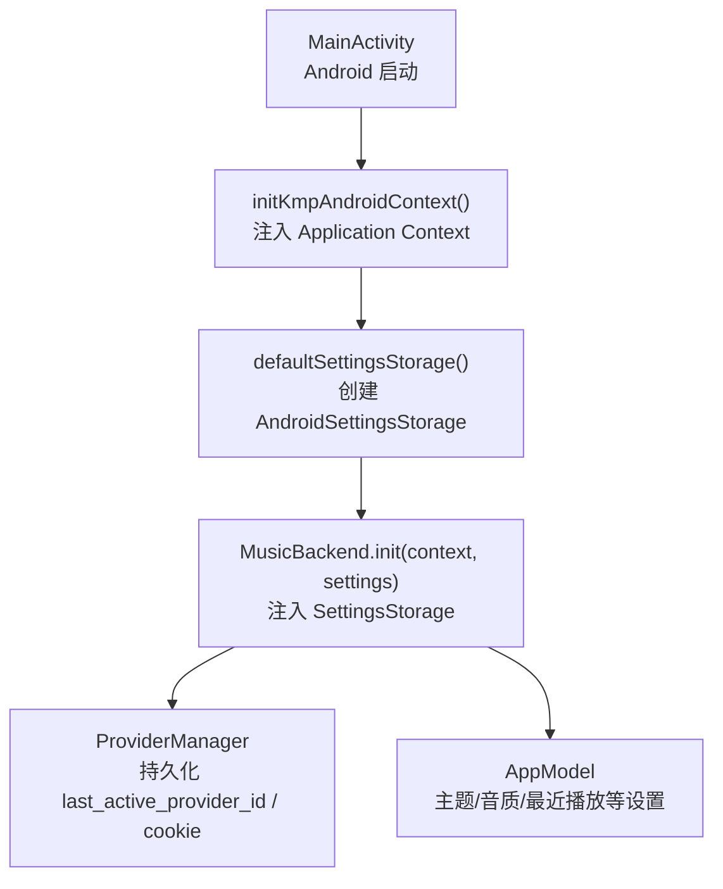
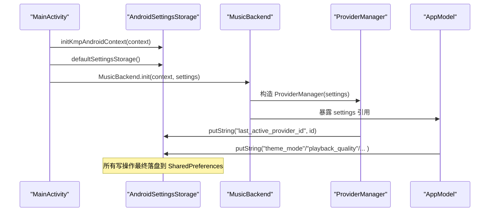
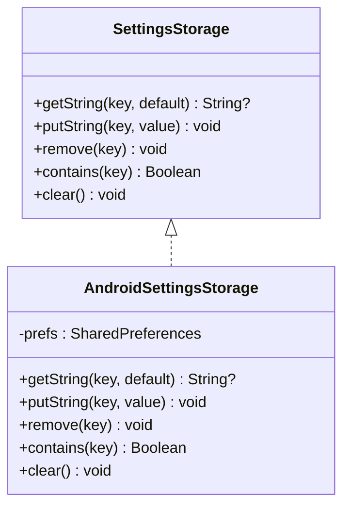
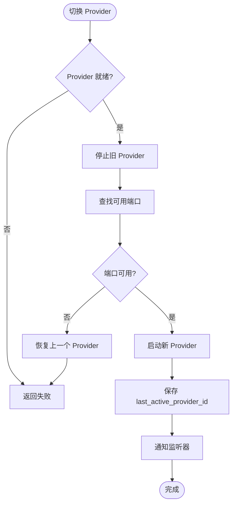
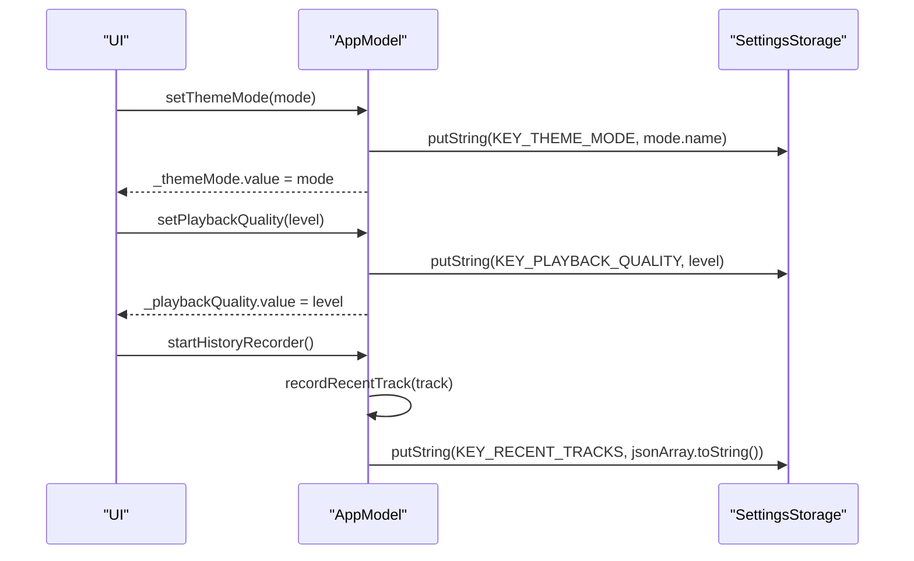
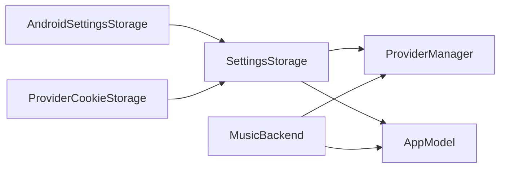

# Android 存储管理

<cite>
**本文引用的文件**
- [AndroidSettingsStorage.kt](file://kmp-pro/src/androidMain/kotlin/cp/player/kmp/util/AndroidSettingsStorage.kt)
- [SettingsStorage.kt](file://kmp-pro/src/commonMain/kotlin/cp/player/kmp/util/SettingsStorage.kt)
- [DesktopSettingsStorage.kt](file://kmp-pro/src/desktopMain/kotlin/cp/player/kmp/util/DesktopSettingsStorage.kt)
- [PlatformContext.kt](file://kmp-pro/src/androidMain/kotlin/cp/player/kmp/util/PlatformContext.kt)
- [ProviderManager.kt](file://kmp-pro/src/commonMain/kotlin/cp/player/kmp/provider/ProviderManager.kt)
- [AppModel.kt](file://app/src/commonMain/kotlin/cp/player/app/AppModel.kt)
- [MainActivity.kt](file://androidApp/src/main/kotlin/cp/player/app/MainActivity.kt)
</cite>

## 目录
1. [简介](#简介)
2. [项目结构](#项目结构)
3. [核心组件](#核心组件)
4. [架构总览](#架构总览)
5. [详细组件分析](#详细组件分析)
6. [依赖关系分析](#依赖关系分析)
7. [性能与内存优化](#性能与内存优化)
8. [故障排查指南](#故障排查指南)
9. [结论](#结论)
10. [附录：自定义存储实现示例](#附录自定义存储实现示例)

## 简介
本技术文档聚焦于 CPPlayer-KMP 在 Android 平台的存储管理系统，重点解析基于 SharedPreferences 的 AndroidSettingsStorage 实现原理、数据持久化机制、类型安全的数据存取方法，以及设置项的分类管理、默认值处理、数据迁移策略和性能优化技巧。同时提供 Android 存储最佳实践、内存使用优化建议与调试方法，并给出如何在 Android 平台上实现自定义存储逻辑的完整示例路径。

## 项目结构
CPPlayer-KMP 通过 KMP 的多平台抽象将“设置存储”从平台细节中解耦：
- commonMain 定义 SettingsStorage 接口与默认工厂 expect
- androidMain 提供基于 SharedPreferences 的实际实现 AndroidSettingsStorage
- desktopMain 提供基于内存 Map + Properties 文件的实际实现 DesktopSettingsStorage
- 应用层（AppModel）与模块管理器（ProviderManager）通过 SettingsStorage 进行设置读写与 Cookie 隔离存储
- Android 入口 MainActivity 负责注入 Context 并初始化默认存储

图表来源
- [MainActivity.kt:14-24](file://androidApp/src/main/kotlin/cp/player/app/MainActivity.kt#L14-L24)
- [AndroidSettingsStorage.kt:24-35](file://kmp-pro/src/androidMain/kotlin/cp/player/kmp/util/AndroidSettingsStorage.kt#L24-L35)
- [MusicBackend.kt:73-81](file://kmp-pro/src/commonMain/kotlin/cp/player/kmp/MusicBackend.kt#L73-L81)
- [ProviderManager.kt:31-39](file://kmp-pro/src/commonMain/kotlin/cp/player/kmp/provider/ProviderManager.kt#L31-L39)
- [AppModel.kt:67-129](file://app/src/commonMain/kotlin/cp/player/app/AppModel.kt#L67-L129)

章节来源
- [MainActivity.kt:14-24](file://androidApp/src/main/kotlin/cp/player/app/MainActivity.kt#L14-L24)
- [AndroidSettingsStorage.kt:9-22](file://kmp-pro/src/androidMain/kotlin/cp/player/kmp/util/AndroidSettingsStorage.kt#L9-L22)
- [SettingsStorage.kt:1-25](file://kmp-pro/src/commonMain/kotlin/cp/player/kmp/util/SettingsStorage.kt#L1-L25)

## 核心组件
- SettingsStorage 接口：统一键值存储抽象，屏蔽平台差异，提供 getString/putString/remove/contains/clear 能力
- AndroidSettingsStorage：基于 SharedPreferences 的实现，按命名空间隔离数据
- ProviderCookieStorage：基于 SettingsStorage 的 Cookie 隔离存储，键前缀为 cookie_<providerId>
- AppModel：封装 UI 相关设置的读取/写入与状态流，包括主题模式、动态颜色、纯黑模式、播放音质、最近播放列表等
- ProviderManager：持久化当前活跃 Provider 的 ID，并在切换时自动保存

章节来源
- [SettingsStorage.kt:12-19](file://kmp-pro/src/commonMain/kotlin/cp/player/kmp/util/SettingsStorage.kt#L12-L19)
- [AndroidSettingsStorage.kt:9-22](file://kmp-pro/src/androidMain/kotlin/cp/player/kmp/util/AndroidSettingsStorage.kt#L9-L22)
- [ProviderManager.kt:31-39](file://kmp-pro/src/commonMain/kotlin/cp/player/kmp/provider/ProviderManager.kt#L31-L39)
- [AppModel.kt:67-129](file://app/src/commonMain/kotlin/cp/player/app/AppModel.kt#L67-L129)

## 架构总览
下图展示了 Android 端存储系统的关键交互：应用启动时注入 Context，创建默认存储；业务模块通过 SettingsStorage 访问设置；ProviderManager 与 AppModel 分别负责 Provider 选择与 UI 设置持久化。

图表来源
- [MainActivity.kt:14-24](file://androidApp/src/main/kotlin/cp/player/app/MainActivity.kt#L14-L24)
- [AndroidSettingsStorage.kt:24-35](file://kmp-pro/src/androidMain/kotlin/cp/player/kmp/util/AndroidSettingsStorage.kt#L24-L35)
- [ProviderManager.kt:80-108](file://kmp-pro/src/commonMain/kotlin/cp/player/kmp/provider/ProviderManager.kt#L80-L108)
- [AppModel.kt:67-129](file://app/src/commonMain/kotlin/cp/player/app/AppModel.kt#L67-L129)

## 详细组件分析

### AndroidSettingsStorage：SharedPreferences 策略与持久化
- 命名空间隔离：通过 namespace 参数作为 SharedPreferences 文件名，避免不同模块或功能之间的键冲突
- 生命周期：在 AndroidSettingsStorage 构造时获取 SharedPreferences 实例，后续读写均复用该实例
- 写入策略：putString 支持 null 值删除键；remove/clear/edit.apply 保证原子性提交
- 读取策略：getString 支持默认值，便于未命中时的降级
- 工厂方法：defaultSettingsStorage 依赖全局注入的 Application Context，确保跨进程/多 Activity 共享同一份存储

图表来源
- [SettingsStorage.kt:12-19](file://kmp-pro/src/commonMain/kotlin/cp/player/kmp/util/SettingsStorage.kt#L12-L19)
- [AndroidSettingsStorage.kt:9-22](file://kmp-pro/src/androidMain/kotlin/cp/player/kmp/util/AndroidSettingsStorage.kt#L9-L22)

章节来源
- [AndroidSettingsStorage.kt:9-22](file://kmp-pro/src/androidMain/kotlin/cp/player/kmp/util/AndroidSettingsStorage.kt#L9-L22)
- [AndroidSettingsStorage.kt:24-35](file://kmp-pro/src/androidMain/kotlin/cp/player/kmp/util/AndroidSettingsStorage.kt#L24-L35)

### ProviderManager：设置项分类与默认值处理
- 分类管理：
  - 最近活跃 Provider：KEY_LAST_PROVIDER_ID = "last_active_provider_id"
  - Cookie 隔离：ProviderCookieStorage 以 "cookie_<providerId>" 为键前缀
- 默认值处理：
  - restoreLastProvider 读取 last_active_provider_id，若不存在则返回 false，由上层决定默认行为
- 数据迁移策略：
  - 当前实现未包含显式版本迁移逻辑；如需迁移，可在首次运行检测旧键名并复制到新键名后删除旧键
- 性能考虑：
  - 切换 Provider 时仅一次 putString 调用，避免频繁 IO
  - 恢复流程先读后判空再切换，减少无效 IO

图表来源
- [ProviderManager.kt:80-108](file://kmp-pro/src/commonMain/kotlin/cp/player/kmp/provider/ProviderManager.kt#L80-L108)
- [ProviderManager.kt:116-121](file://kmp-pro/src/commonMain/kotlin/cp/player/kmp/provider/ProviderManager.kt#L116-L121)

章节来源
- [ProviderManager.kt:31-39](file://kmp-pro/src/commonMain/kotlin/cp/player/kmp/provider/ProviderManager.kt#L31-L39)
- [ProviderManager.kt:80-108](file://kmp-pro/src/commonMain/kotlin/cp/player/kmp/provider/ProviderManager.kt#L80-L108)
- [ProviderManager.kt:116-121](file://kmp-pro/src/commonMain/kotlin/cp/player/kmp/provider/ProviderManager.kt#L116-L121)
- [ProviderManager.kt:147-156](file://kmp-pro/src/commonMain/kotlin/cp/player/kmp/provider/ProviderManager.kt#L147-L156)

### AppModel：UI 设置与最近播放持久化
- 设置项分类：
  - 主题模式：KEY_THEME_MODE
  - 动态颜色：KEY_DYNAMIC_COLOR
  - 纯黑模式：KEY_PURE_BLACK
  - 播放音质：KEY_PLAYBACK_QUALITY
  - 最近播放：KEY_RECENT_TRACKS（JSON 数组字符串）
- 默认值处理：
  - themeMode/dynamicColor/pureBlack/playbackQuality 均提供默认值，避免空指针与异常
- 数据迁移策略：
  - 当前未包含版本迁移；建议在首次运行检查旧键名并迁移到新键名
- 性能与类型安全：
  - 使用 StateFlow 暴露设置变化，UI 可响应式更新
  - 复杂对象（如最近播放）采用 JSON 序列化/反序列化，配合 runCatching 容错解析

图表来源
- [AppModel.kt:67-129](file://app/src/commonMain/kotlin/cp/player/app/AppModel.kt#L67-L129)
- [AppModel.kt:181-254](file://app/src/commonMain/kotlin/cp/player/app/AppModel.kt#L181-L254)

章节来源
- [AppModel.kt:67-129](file://app/src/commonMain/kotlin/cp/player/app/AppModel.kt#L67-L129)
- [AppModel.kt:181-254](file://app/src/commonMain/kotlin/cp/player/app/AppModel.kt#L181-L254)

### PlatformContext：Android 上下文包装
- 作用：在 KMP 中包装 Android Context，供后端初始化与 Provider 启动时使用
- 使用方式：MainActivity 中调用 toPlatformContext() 传入 MusicBackend.init

章节来源
- [PlatformContext.kt:5-14](file://kmp-pro/src/androidMain/kotlin/cp/player/kmp/util/PlatformContext.kt#L5-L14)
- [MainActivity.kt:14-24](file://androidApp/src/main/kotlin/cp/player/app/MainActivity.kt#L14-L24)

## 依赖关系分析
- SettingsStorage 被 ProviderManager 与 AppModel 共同依赖，形成稳定的键值存储契约
- AndroidSettingsStorage 依赖 Android Context，需通过 initKmpAndroidContext 注入
- ProviderCookieStorage 依赖 SettingsStorage，实现按 Provider 隔离的 Cookie 存储
- MusicBackend 组合 ProviderManager、ModuleManager、ApiService 等，对外暴露统一入口

图表来源
- [SettingsStorage.kt:12-19](file://kmp-pro/src/commonMain/kotlin/cp/player/kmp/util/SettingsStorage.kt#L12-L19)
- [ProviderManager.kt:31-39](file://kmp-pro/src/commonMain/kotlin/cp/player/kmp/provider/ProviderManager.kt#L31-L39)
- [AppModel.kt:67-129](file://app/src/commonMain/kotlin/cp/player/app/AppModel.kt#L67-L129)
- [AndroidSettingsStorage.kt:9-22](file://kmp-pro/src/androidMain/kotlin/cp/player/kmp/util/AndroidSettingsStorage.kt#L9-L22)

章节来源
- [ProviderManager.kt:31-39](file://kmp-pro/src/commonMain/kotlin/cp/player/kmp/provider/ProviderManager.kt#L31-L39)
- [AppModel.kt:67-129](file://app/src/commonMain/kotlin/cp/player/app/AppModel.kt#L67-L129)
- [AndroidSettingsStorage.kt:9-22](file://kmp-pro/src/androidMain/kotlin/cp/player/kmp/util/AndroidSettingsStorage.kt#L9-L22)

## 性能与内存优化
- 批量写入合并：AndroidSettingsStorage 每次 edit().apply() 已保证原子提交；对于高频场景可考虑在业务层合并多次写入
- 避免大对象直接存入 SharedPreferences：AppModel 对最近播放使用 JSON 字符串，注意控制长度与解析开销
- 懒加载与缓存：SettingsStorage 实例在构造时获取 SharedPreferences，避免重复创建
- 错误容忍：AppModel 对 JSON 解析使用 runCatching，防止异常导致崩溃
- 命名空间隔离：通过 namespace 区分不同模块的设置，降低冲突风险与清理成本

[本节为通用指导，不直接分析具体文件]

## 故障排查指南
- 未注入 Context 导致异常：
  - 现象：调用 defaultSettingsStorage() 抛出异常提示需在 Application.onCreate 中注入
  - 解决：确保 MainActivity 中调用 initKmpAndroidContext(this)
- SharedPreferences 键冲突：
  - 现象：不同模块覆盖彼此设置
  - 解决：使用不同 namespace 或在键名前加模块前缀
- 数据损坏或格式变更：
  - 现象：解析 JSON 失败或类型不匹配
  - 解决：增加版本字段与迁移逻辑，解析失败时回退默认值并记录日志
- Cookie 丢失：
  - 现象：切换 Provider 后登录态失效
  - 解决：确认 ProviderCookieStorage 的键前缀正确，且切换时未误删

章节来源
- [AndroidSettingsStorage.kt:24-35](file://kmp-pro/src/androidMain/kotlin/cp/player/kmp/util/AndroidSettingsStorage.kt#L24-L35)
- [AppModel.kt:181-254](file://app/src/commonMain/kotlin/cp/player/app/AppModel.kt#L181-L254)
- [ProviderManager.kt:147-156](file://kmp-pro/src/commonMain/kotlin/cp/player/kmp/provider/ProviderManager.kt#L147-L156)

## 结论
CPPlayer-KMP 的 Android 存储管理系统通过 SettingsStorage 抽象实现了跨平台一致性，Android 端基于 SharedPreferences 提供了稳定高效的键值存储。ProviderManager 与 AppModel 利用该抽象完成了设置项的分类管理与默认值处理。结合命名空间隔离、错误容忍与合理的持久化策略，系统在易用性与可靠性之间取得平衡。未来可通过引入版本迁移、压缩大对象、异步写入队列等方式进一步提升性能与可维护性。

[本节为总结，不直接分析具体文件]

## 附录：自定义存储实现示例
以下示例展示如何在 Android 平台上实现自定义存储逻辑，遵循 SettingsStorage 接口并提供命名空间隔离与类型安全的存取方法。

- 步骤概览
  - 在 androidMain 下新增类 CustomSettingsStorage，实现 SettingsStorage
  - 使用 getSharedPreferences(namespace, MODE_PRIVATE) 获取存储实例
  - 实现 getString/putString/remove/contains/clear
  - 在 defaultSettingsStorage 的 actual 实现中返回自定义实例
  - 在 MainActivity 中保持 initKmpAndroidContext 调用不变

- 关键要点
  - 命名空间隔离：通过 namespace 参数区分不同模块
  - 类型安全：在业务层对值进行类型转换与校验，存储层仅负责字符串存取
  - 错误处理：对可能的异常进行捕获与降级
  - 性能优化：避免频繁 edit().apply()，必要时合并写入

- 参考路径
  - 接口定义：[SettingsStorage.kt:12-19](file://kmp-pro/src/commonMain/kotlin/cp/player/kmp/util/SettingsStorage.kt#L12-L19)
  - Android 实现参考：[AndroidSettingsStorage.kt:9-22](file://kmp-pro/src/androidMain/kotlin/cp/player/kmp/util/AndroidSettingsStorage.kt#L9-L22)
  - 工厂方法参考：[AndroidSettingsStorage.kt:24-35](file://kmp-pro/src/androidMain/kotlin/cp/player/kmp/util/AndroidSettingsStorage.kt#L24-L35)

[本节为示例指导，不直接分析具体文件]