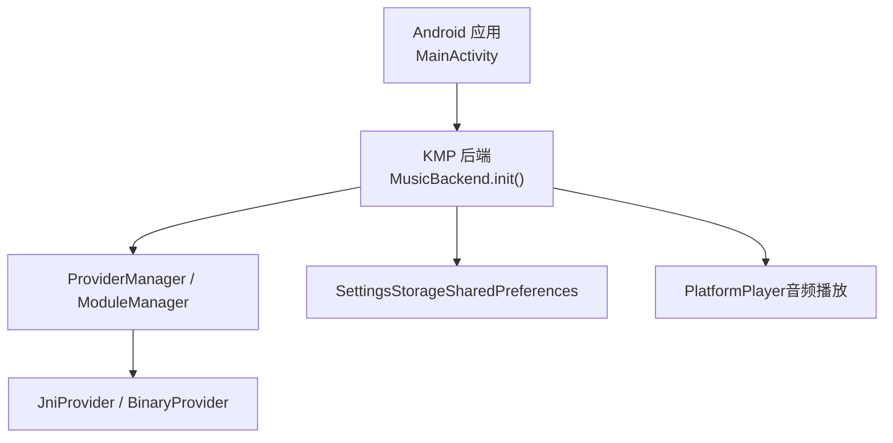
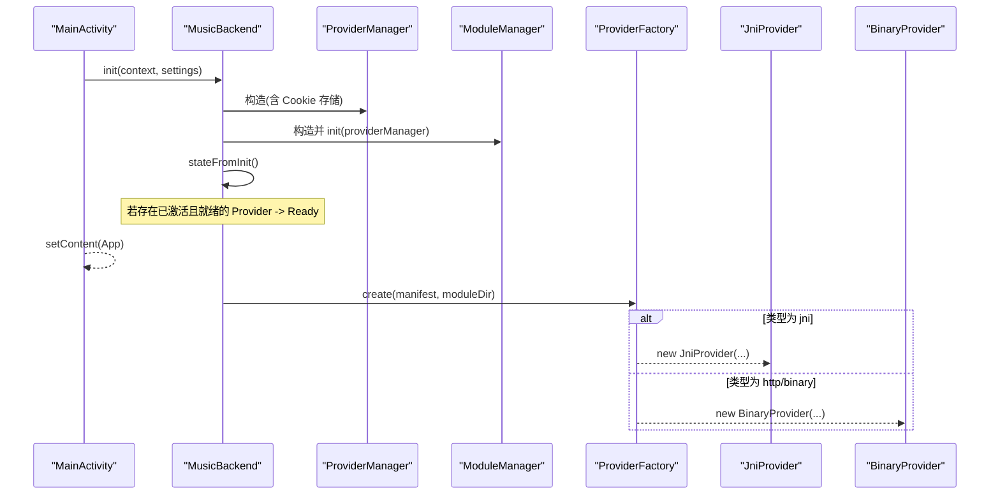
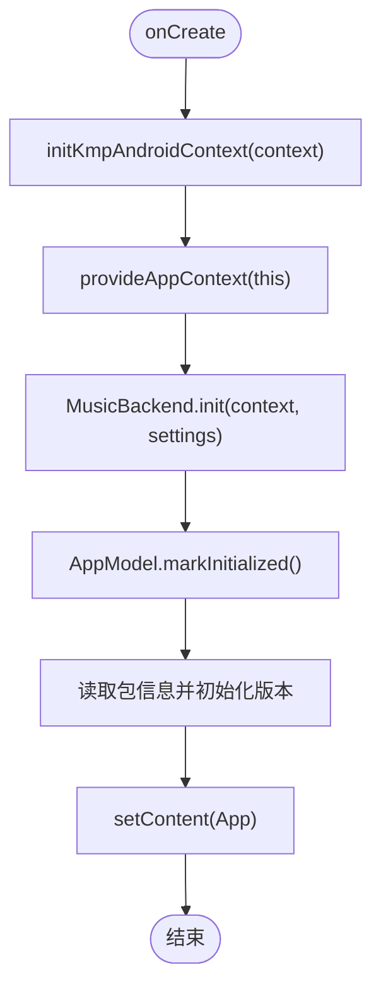
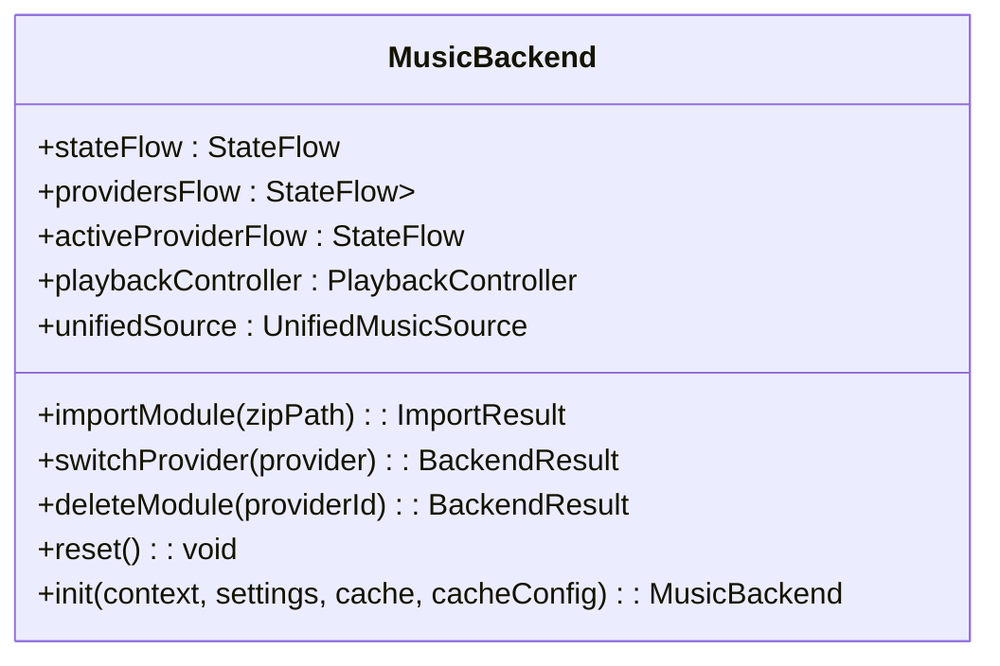
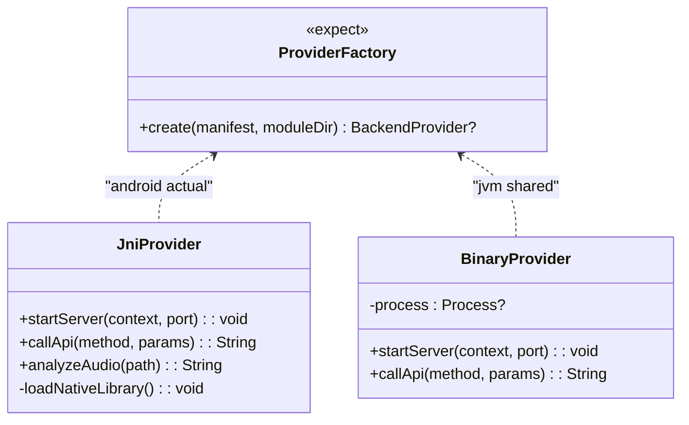
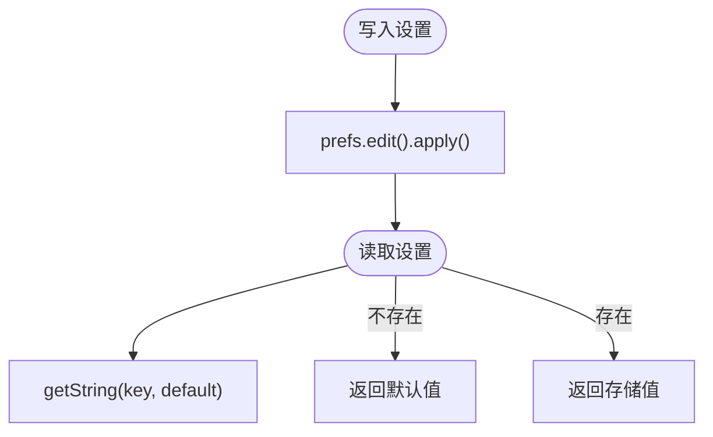
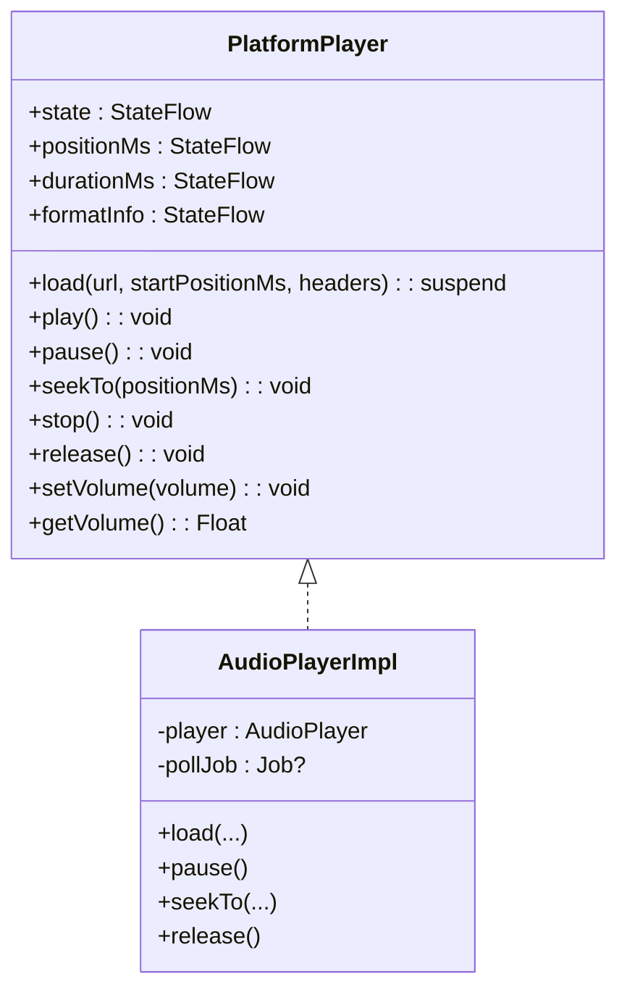
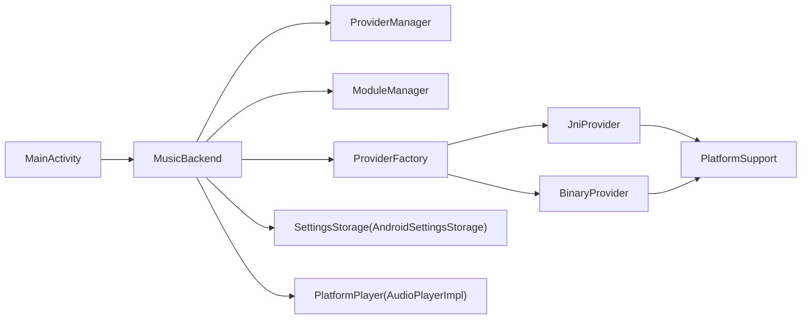

# Android 平台实现

<cite>
**本文引用的文件**
- [MainActivity.kt](file://androidApp/src/main/kotlin/cp/player/app/MainActivity.kt)
- [AndroidManifest.xml（androidApp）](file://androidApp/src/main/AndroidManifest.xml)
- [PlatformActions.android.kt](file://app/src/androidMain/kotlin/cp/player/app/platform/PlatformActions.android.kt)
- [MusicBackend.kt](file://kmp-pro/src/commonMain/kotlin/cp/player/kmp/MusicBackend.kt)
- [ProviderFactory.kt（common）](file://kmp-pro/src/commonMain/kotlin/cp/player/kmp/provider/ProviderFactory.kt)
- [ProviderFactory.kt（android）](file://kmp-pro/src/androidMain/kotlin/cp/player/kmp/provider/ProviderFactory.kt)
- [JniProvider.kt](file://kmp-pro/src/jvmMain/kotlin/cp/player/kmp/provider/JniProvider.kt)
- [BinaryProvider.kt](file://kmp-pro/src/jvmMain/kotlin/cp/player/kmp/provider/BinaryProvider.kt)
- [PlatformSupport.kt](file://kmp-pro/src/jvmMain/kotlin/cp/player/kmp/util/PlatformSupport.kt)
- [SettingsStorage.kt](file://kmp-pro/src/commonMain/kotlin/cp/player/kmp/util/SettingsStorage.kt)
- [AndroidSettingsStorage.kt](file://kmp-pro/src/androidMain/kotlin/cp/player/kmp/util/AndroidSettingsStorage.kt)
- [PlatformPlayer.kt](file://kmp-pro/src/commonMain/kotlin/cp/player/kmp/playback/PlatformPlayer.kt)
</cite>

## 目录
1. [简介](#简介)
2. [项目结构](#项目结构)
3. [核心组件](#核心组件)
4. [架构总览](#架构总览)
5. [详细组件分析](#详细组件分析)
6. [依赖关系分析](#依赖关系分析)
7. [性能与内存优化](#性能与内存优化)
8. [调试与故障排除](#调试与故障排除)
9. [结论](#结论)
10. [附录：扩展与定制示例](#附录：扩展与定制示例)

## 简介
本文件面向 CPPlayer-KMP 的 Android 平台实现，系统性说明初始化流程、Activity 生命周期管理、媒体播放集成、权限与存储、模块 Provider（JNI/二进制）加载机制、以及可观测状态与错误处理。文档同时给出 Android 特定的性能优化建议、内存管理最佳实践、调试排障方法与扩展点示例，帮助开发者在 Android 平台上安全高效地集成和定制功能。

## 项目结构
- androidApp：Android 应用入口与清单配置，负责启动 Activity、注入 Context、初始化 KMP 后端。
- app：Compose UI 与平台能力桥接（如二维码保存、打开外部应用等）。
- kmp-pro：跨平台核心逻辑，包含后端统一入口 MusicBackend、Provider 管理、设置存储抽象、播放接口定义与默认实现等。

图表来源
- [MainActivity.kt:14-38](file://androidApp/src/main/kotlin/cp/player/app/MainActivity.kt#L14-L38)
- [MusicBackend.kt:314-367](file://kmp-pro/src/commonMain/kotlin/cp/player/kmp/MusicBackend.kt#L314-L367)
- [ProviderFactory.kt（android）:3-13](file://kmp-pro/src/androidMain/kotlin/cp/player/kmp/provider/ProviderFactory.kt#L3-L13)
- [JniProvider.kt:9-136](file://kmp-pro/src/jvmMain/kotlin/cp/player/kmp/provider/JniProvider.kt#L9-L136)
- [BinaryProvider.kt:25-107](file://kmp-pro/src/jvmMain/kotlin/cp/player/kmp/provider/BinaryProvider.kt#L25-L107)
- [AndroidSettingsStorage.kt:9-35](file://kmp-pro/src/androidMain/kotlin/cp/player/kmp/util/AndroidSettingsStorage.kt#L9-L35)
- [PlatformPlayer.kt:16-135](file://kmp-pro/src/commonMain/kotlin/cp/player/kmp/playback/PlatformPlayer.kt#L16-L135)

章节来源
- [MainActivity.kt:14-38](file://androidApp/src/main/kotlin/cp/player/app/MainActivity.kt#L14-L38)
- [AndroidManifest.xml（androidApp）:1-28](file://androidApp/src/main/AndroidManifest.xml#L1-L28)

## 核心组件
- 应用入口与初始化：在 MainActivity.onCreate 中完成 Context 注入、KMP 后端初始化、版本信息设置与 UI 渲染。
- 后端统一入口：MusicBackend 提供状态机、Provider 管理、音乐数据访问、播放控制器等能力。
- Provider 工厂：按模块 manifest 创建具体 Provider（JNI/二进制），Android 平台通过 createJniProvider 返回 JniProvider。
- 设置存储：AndroidSettingsStorage 基于 SharedPreferences，提供键值持久化。
- 播放抽象：PlatformPlayer 定义播放接口，当前默认实现基于 Compose Media Player 封装。

章节来源
- [MusicBackend.kt:30-72](file://kmp-pro/src/commonMain/kotlin/cp/player/kmp/MusicBackend.kt#L30-L72)
- [ProviderFactory.kt（common）:1-29](file://kmp-pro/src/commonMain/kotlin/cp/player/kmp/provider/ProviderFactory.kt#L1-L29)
- [AndroidSettingsStorage.kt:9-35](file://kmp-pro/src/androidMain/kotlin/cp/player/kmp/util/AndroidSettingsStorage.kt#L9-L35)
- [PlatformPlayer.kt:16-135](file://kmp-pro/src/commonMain/kotlin/cp/player/kmp/playback/PlatformPlayer.kt#L16-L135)

## 架构总览
Android 平台的整体调用链如下：
- MainActivity 初始化并注入 Context，调用 MusicBackend.init 构建后端单例。
- MusicBackend 内部组合 ProviderManager、ModuleManager、API 服务与缓存，并计算初始状态。
- Provider 由 ProviderFactory 根据 manifest 类型创建；Android 平台将 jni 类型映射到 JniProvider。
- 设置通过 SettingsStorage 抽象持久化，Android 使用 SharedPreferences。
- 播放通过 PlatformPlayer 抽象，当前默认实现基于 Compose Media Player。

图表来源
- [MainActivity.kt:19-25](file://androidApp/src/main/kotlin/cp/player/app/MainActivity.kt#L19-L25)
- [MusicBackend.kt:314-367](file://kmp-pro/src/commonMain/kotlin/cp/player/kmp/MusicBackend.kt#L314-L367)
- [ProviderFactory.kt（common）:11-20](file://kmp-pro/src/commonMain/kotlin/cp/player/kmp/provider/ProviderFactory.kt#L11-L20)
- [ProviderFactory.kt（android）:3-13](file://kmp-pro/src/androidMain/kotlin/cp/player/kmp/provider/ProviderFactory.kt#L3-L13)
- [JniProvider.kt:9-136](file://kmp-pro/src/jvmMain/kotlin/cp/player/kmp/provider/JniProvider.kt#L9-L136)
- [BinaryProvider.kt:25-107](file://kmp-pro/src/jvmMain/kotlin/cp/player/kmp/provider/BinaryProvider.kt#L25-L107)

## 详细组件分析

### 初始化流程与 Activity 生命周期管理
- 在 onCreate 中启用 Edge-to-Edge，注入 KMP Android Context，提供 App Context，初始化 MusicBackend，标记应用已初始化，读取版本信息并设置 UI。
- 清单文件中声明了网络权限、Cleartext 流量开关、网络安全配置与主 Activity 的 Intent Filter。

图表来源
- [MainActivity.kt:14-38](file://androidApp/src/main/kotlin/cp/player/app/MainActivity.kt#L14-L38)
- [AndroidManifest.xml（androidApp）:1-28](file://androidApp/src/main/AndroidManifest.xml#L1-L28)

章节来源
- [MainActivity.kt:14-38](file://androidApp/src/main/kotlin/cp/player/app/MainActivity.kt#L14-L38)
- [AndroidManifest.xml（androidApp）:1-28](file://androidApp/src/main/AndroidManifest.xml#L1-L28)

### 后端统一入口 MusicBackend
- 职责：生命周期与状态机、Provider 管理、音乐数据访问、本地音乐源接入、播放控制、健康监控、错误处理。
- 初始化：组合 ProviderManager、ModuleManager、API 服务与缓存，并在初始化后计算终态（Ready/NoProvider/Error）。
- 状态流：暴露 StateFlow<BackendState>，UI 可观察以驱动界面切换。
- 播放控制器：惰性创建，绑定统一数据源与平台播放器。

图表来源
- [MusicBackend.kt:73-161](file://kmp-pro/src/commonMain/kotlin/cp/player/kmp/MusicBackend.kt#L73-L161)
- [MusicBackend.kt:314-367](file://kmp-pro/src/commonMain/kotlin/cp/player/kmp/MusicBackend.kt#L314-L367)

章节来源
- [MusicBackend.kt:30-72](file://kmp-pro/src/commonMain/kotlin/cp/player/kmp/MusicBackend.kt#L30-L72)
- [MusicBackend.kt:73-161](file://kmp-pro/src/commonMain/kotlin/cp/player/kmp/MusicBackend.kt#L73-L161)
- [MusicBackend.kt:314-367](file://kmp-pro/src/commonMain/kotlin/cp/player/kmp/MusicBackend.kt#L314-L367)

### ProviderFactory 与 JNI/二进制模块加载
- common 层定义 expect object ProviderFactory 与 expect fun createJniProvider。
- Android 实际实现将 jni 类型映射到 JniProvider，传入 soPath、manifest 信息等。
- JniProvider：校验 SO 文件存在性、大小、可读性与 ELF 头，调用 System.load 加载，并通过 external 方法启动原生服务或调用 API。
- BinaryProvider：校验二进制文件与 ELF 头，使用 ProcessBuilder 启动进程并通过 HTTP 通信。

图表来源
- [ProviderFactory.kt（common）:1-29](file://kmp-pro/src/commonMain/kotlin/cp/player/kmp/provider/ProviderFactory.kt#L1-L29)
- [ProviderFactory.kt（android）:3-13](file://kmp-pro/src/androidMain/kotlin/cp/player/kmp/provider/ProviderFactory.kt#L3-L13)
- [JniProvider.kt:9-136](file://kmp-pro/src/jvmMain/kotlin/cp/player/kmp/provider/JniProvider.kt#L9-L136)
- [BinaryProvider.kt:25-107](file://kmp-pro/src/jvmMain/kotlin/cp/player/kmp/provider/BinaryProvider.kt#L25-L107)

章节来源
- [ProviderFactory.kt（common）:1-29](file://kmp-pro/src/commonMain/kotlin/cp/player/kmp/provider/ProviderFactory.kt#L1-L29)
- [ProviderFactory.kt（android）:3-13](file://kmp-pro/src/androidMain/kotlin/cp/player/kmp/provider/ProviderFactory.kt#L3-L13)
- [JniProvider.kt:9-136](file://kmp-pro/src/jvmMain/kotlin/cp/player/kmp/provider/JniProvider.kt#L9-L136)
- [BinaryProvider.kt:25-107](file://kmp-pro/src/jvmMain/kotlin/cp/player/kmp/provider/BinaryProvider.kt#L25-L107)

### AndroidSettingsStorage：SharedPreferences 持久化策略
- 基于 SharedPreferences，namespace 作为文件名隔离不同模块的设置。
- 支持字符串读写、删除、包含检查与清空。
- 默认工厂要求先在 Application.onCreate 中注入应用级 Context，否则抛出异常。

图表来源
- [AndroidSettingsStorage.kt:9-35](file://kmp-pro/src/androidMain/kotlin/cp/player/kmp/util/AndroidSettingsStorage.kt#L9-L35)
- [SettingsStorage.kt:1-25](file://kmp-pro/src/commonMain/kotlin/cp/player/kmp/util/SettingsStorage.kt#L1-L25)

章节来源
- [AndroidSettingsStorage.kt:9-35](file://kmp-pro/src/androidMain/kotlin/cp/player/kmp/util/AndroidSettingsStorage.kt#L9-L35)
- [SettingsStorage.kt:1-25](file://kmp-pro/src/commonMain/kotlin/cp/player/kmp/util/SettingsStorage.kt#L1-L25)

### 媒体播放集成（PlatformPlayer）
- 定义了统一的播放接口与状态模型，包括加载、播放、暂停、跳转、停止、释放、音量控制等。
- 当前默认实现基于 Compose Media Player 的 AudioPlayer，轮询状态与进度，暴露 StateFlow。
- 后续可在 Android 平台替换为 ExoPlayer/Media3 实现以获得更完整的后台播放与通知能力。

图表来源
- [PlatformPlayer.kt:16-135](file://kmp-pro/src/commonMain/kotlin/cp/player/kmp/playback/PlatformPlayer.kt#L16-L135)

章节来源
- [PlatformPlayer.kt:16-135](file://kmp-pro/src/commonMain/kotlin/cp/player/kmp/playback/PlatformPlayer.kt#L16-L135)

### 权限管理与系统能力
- 网络相关：INTERNET、ACCESS_NETWORK_STATE；允许 Cleartext 流量并配置网络安全策略。
- 平台能力桥接：保存二维码到相册、打开目标应用、检测包是否安装、打开 URL、清理图片缓存、返回键处理。

章节来源
- [AndroidManifest.xml（androidApp）:1-28](file://androidApp/src/main/AndroidManifest.xml#L1-L28)
- [PlatformActions.android.kt:19-120](file://app/src/androidMain/kotlin/cp/player/app/platform/PlatformActions.android.kt#L19-L120)

## 依赖关系分析
- MainActivity 依赖 MusicBackend 进行后端初始化与状态管理。
- MusicBackend 依赖 ProviderManager、ModuleManager、API 服务与缓存，间接依赖 ProviderFactory。
- ProviderFactory 在 Android 平台将 jni 类型解析为 JniProvider；通用类型解析为 BinaryProvider。
- JniProvider 依赖 PlatformSupport 进行 ELF 校验与 ABI 匹配；BinaryProvider 同样依赖 PlatformSupport 进行二进制启动与校验。
- AndroidSettingsStorage 依赖 Android Context 与 SharedPreferences。

图表来源
- [MainActivity.kt:14-38](file://androidApp/src/main/kotlin/cp/player/app/MainActivity.kt#L14-L38)
- [MusicBackend.kt:314-367](file://kmp-pro/src/commonMain/kotlin/cp/player/kmp/MusicBackend.kt#L314-L367)
- [ProviderFactory.kt（common）:1-29](file://kmp-pro/src/commonMain/kotlin/cp/player/kmp/provider/ProviderFactory.kt#L1-L29)
- [JniProvider.kt:9-136](file://kmp-pro/src/jvmMain/kotlin/cp/player/kmp/provider/JniProvider.kt#L9-L136)
- [BinaryProvider.kt:25-107](file://kmp-pro/src/jvmMain/kotlin/cp/player/kmp/provider/BinaryProvider.kt#L25-L107)
- [PlatformSupport.kt:67-135](file://kmp-pro/src/jvmMain/kotlin/cp/player/kmp/util/PlatformSupport.kt#L67-L135)
- [AndroidSettingsStorage.kt:9-35](file://kmp-pro/src/androidMain/kotlin/cp/player/kmp/util/AndroidSettingsStorage.kt#L9-L35)
- [PlatformPlayer.kt:16-135](file://kmp-pro/src/commonMain/kotlin/cp/player/kmp/playback/PlatformPlayer.kt#L16-L135)

章节来源
- [PlatformSupport.kt:67-135](file://kmp-pro/src/jvmMain/kotlin/cp/player/kmp/util/PlatformSupport.kt#L67-L135)

## 性能与内存优化
- 设置存储：
  - 使用 SharedPreferences 的 apply() 异步提交，避免阻塞主线程。
  - 合理命名空间隔离，减少冲突与扫描开销。
- Provider 加载：
  - 延迟加载：仅在 startServer 时执行 ELF 校验与库加载，构造函数只做存在性检查。
  - 预校验：SO/二进制文件大小、可读性、ELF 头与 ABI 匹配，失败快速返回，避免无效尝试。
- 播放：
  - 轮询间隔约 200ms，平衡状态更新频率与 CPU 占用。
  - release 时停止轮询与播放器资源，防止泄漏。
- 网络与 I/O：
  - 使用协程与 runBlocking 在必要处同步等待，注意不要在主线程长时间阻塞。
  - 对大文件或频繁 I/O 操作建议使用后台任务与缓冲策略。

[本节为通用指导，不直接分析具体文件]

## 调试与故障排除
- JNI 加载失败：
  - 检查 SO 文件路径、大小、可读性与 ELF 头；确认 ABI 匹配。
  - 查看 JniProvider 的错误日志与 loadError 字段。
- 二进制启动失败：
  - 检查二进制文件是否存在、可执行、ELF 头与 ABI 匹配。
  - 查看进程启动异常与端口占用情况。
- 设置未持久化：
  - 确保在 Application.onCreate 中调用 initKmpAndroidContext 注入 Context。
  - 检查 namespace 是否正确，避免覆盖。
- 播放问题：
  - 检查 PlatformPlayer 的状态流与错误回调。
  - 确认 URL、请求头与网络权限配置正确。

章节来源
- [JniProvider.kt:23-136](file://kmp-pro/src/jvmMain/kotlin/cp/player/kmp/provider/JniProvider.kt#L23-L136)
- [BinaryProvider.kt:42-107](file://kmp-pro/src/jvmMain/kotlin/cp/player/kmp/provider/BinaryProvider.kt#L42-L107)
- [AndroidSettingsStorage.kt:24-35](file://kmp-pro/src/androidMain/kotlin/cp/player/kmp/util/AndroidSettingsStorage.kt#L24-L35)
- [PlatformPlayer.kt:43-135](file://kmp-pro/src/commonMain/kotlin/cp/player/kmp/playback/PlatformPlayer.kt#L43-L135)

## 结论
CPPlayer-KMP 的 Android 平台实现通过清晰的层次划分与抽象，实现了后端统一入口、Provider 动态加载、设置持久化与播放控制的解耦。借助 expect/actual 机制，Android 平台能够无缝集成 JNI 模块与二进制模块，并通过 SharedPreferences 提供稳定的设置存储。建议在后续迭代中引入 Media3/ExoPlayer 增强后台播放与通知能力，并结合 Android 系统特性进一步优化性能与用户体验。

[本节为总结，不直接分析具体文件]

## 附录：扩展与定制示例
- 自定义 Provider 类型：
  - 在 common 层扩展 ProviderFactory 的 create 方法，新增类型分支。
  - 在 Android 平台实现对应的 createJniProvider 或替换为自定义实现。
- 替换播放器实现：
  - 实现新的 PlatformPlayer，集成 Media3/ExoPlayer，提供后台服务与通知。
  - 在 createPlatformPlayer 中返回新实现。
- 扩展设置存储：
  - 在 AndroidSettingsStorage 中增加更多数据类型（如布尔、整型）与批量操作。
  - 结合加密或分片存储提升安全性与性能。
- 权限与系统能力：
  - 按需添加存储、媒体、蓝牙等权限，并在运行时申请。
  - 扩展 PlatformActions.android.kt 中的平台能力桥接方法。

章节来源
- [ProviderFactory.kt（common）:1-29](file://kmp-pro/src/commonMain/kotlin/cp/player/kmp/provider/ProviderFactory.kt#L1-L29)
- [ProviderFactory.kt（android）:3-13](file://kmp-pro/src/androidMain/kotlin/cp/player/kmp/provider/ProviderFactory.kt#L3-L13)
- [PlatformPlayer.kt:133-135](file://kmp-pro/src/commonMain/kotlin/cp/player/kmp/playback/PlatformPlayer.kt#L133-L135)
- [AndroidSettingsStorage.kt:9-35](file://kmp-pro/src/androidMain/kotlin/cp/player/kmp/util/AndroidSettingsStorage.kt#L9-L35)
- [PlatformActions.android.kt:19-120](file://app/src/androidMain/kotlin/cp/player/app/platform/PlatformActions.android.kt#L19-L120)