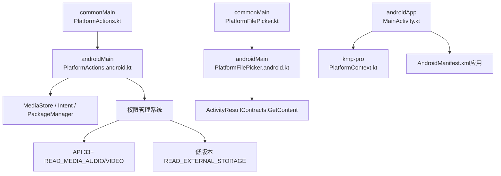
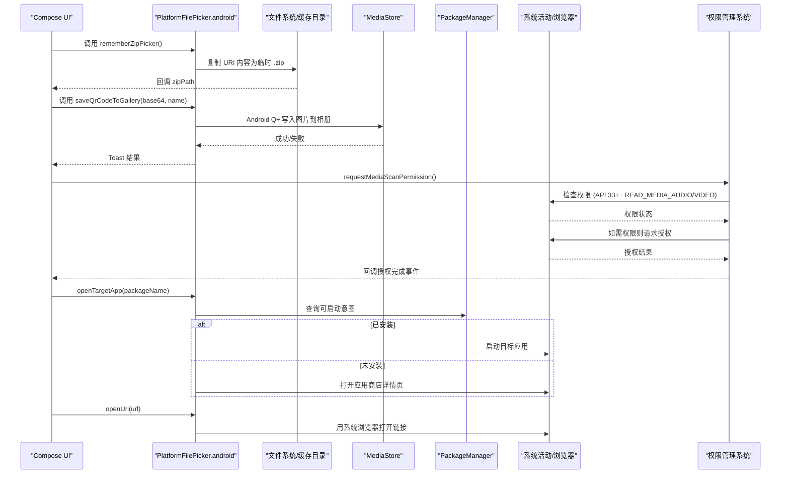
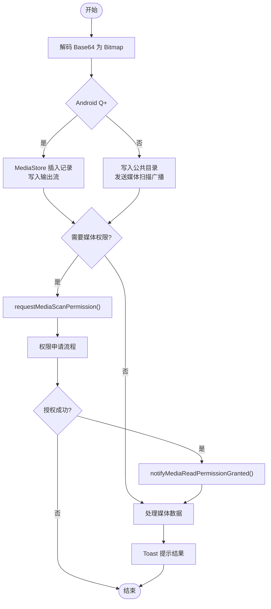
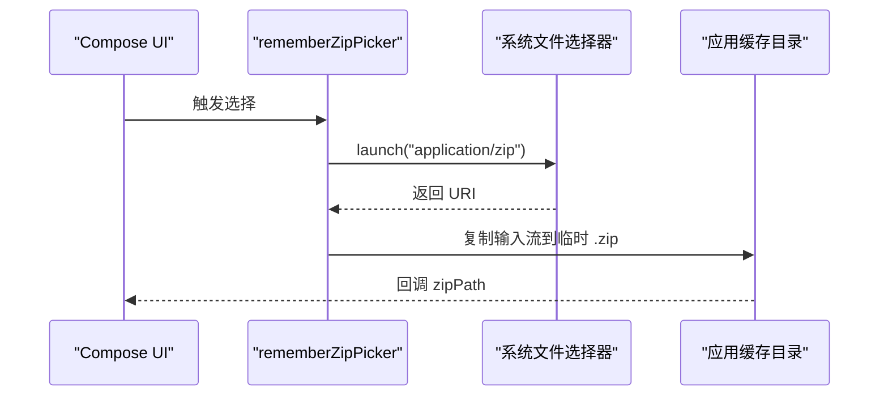
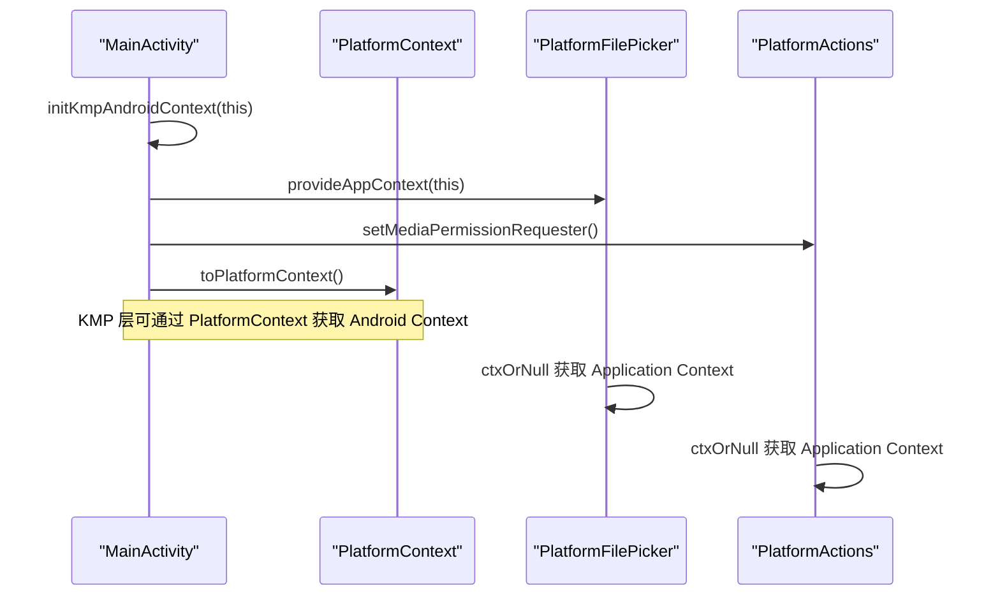
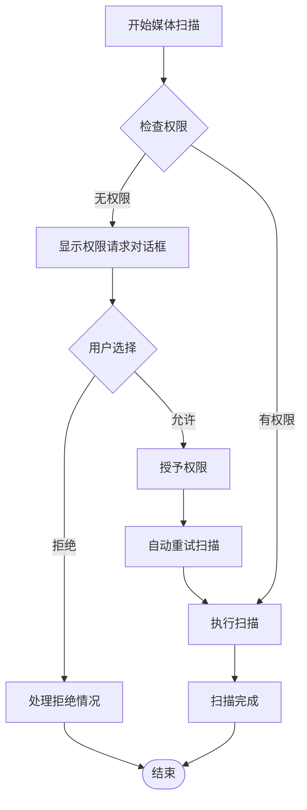
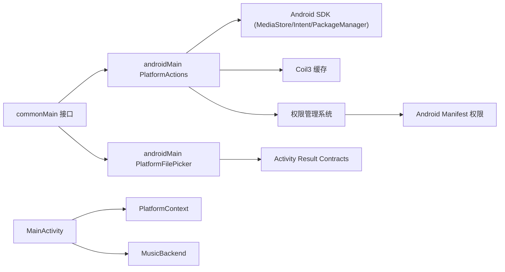

# Android 平台操作

<cite>
**本文引用的文件**
- [PlatformActions.kt](file://app/src/commonMain/kotlin/cp/player/app/platform/PlatformActions.kt)
- [PlatformActions.android.kt](file://app/src/androidMain/kotlin/cp/player/app/platform/PlatformActions.android.kt)
- [PlatformFilePicker.kt](file://app/src/commonMain/kotlin/cp/player/app/platform/PlatformFilePicker.kt)
- [PlatformFilePicker.android.kt](file://app/src/androidMain/kotlin/cp/player/app/platform/PlatformFilePicker.android.kt)
- [MainActivity.kt](file://androidApp/src/main/kotlin/cp/player/app/MainActivity.kt)
- [AndroidManifest.xml（应用）](file://androidApp/src/main/AndroidManifest.xml)
- [AndroidManifest.xml（模块）](file://app/src/androidMain/AndroidManifest.xml)
- [PlatformContext.kt](file://kmp-pro/src/androidMain/kotlin/cp/player/kmp/util/PlatformContext.kt)
- [AndroidLocalMediaSource.kt](file://kmp-pro/src/androidMain/kotlin/cp/player/kmp/local/AndroidLocalMediaSource.kt)
- [DownloadsScreenModel.kt](file://app/src/commonMain/kotlin/cp/player/app/ui/model/DownloadsScreenModel.kt)
</cite>

## 更新摘要
**变更内容**
- 增强了Android平台的权限处理机制，支持API 33+的READ_MEDIA_AUDIO和READ_MEDIA_VIDEO权限
- 集成了下载系统的权限请求流程，提供完整的权限管理解决方案
- 添加了媒体扫描权限的回调机制，支持授权后自动重试扫描
- 完善了权限检查逻辑，区分音频和视频权限的不同需求

## 目录
1. [简介](#简介)
2. [项目结构](#项目结构)
3. [核心组件](#核心组件)
4. [架构总览](#架构总览)
5. [详细组件分析](#详细组件分析)
6. [权限处理系统](#权限处理系统)
7. [依赖关系分析](#依赖关系分析)
8. [性能考量](#性能考量)
9. [故障排查指南](#故障排查指南)
10. [结论](#结论)
11. [附录：使用示例与扩展指引](#附录使用示例与扩展指引)

## 简介
本文件面向 CPPlayer-KMP 的 Android 平台，系统化说明 PlatformActions 与 PlatformFilePicker 在 Android 端的实现与用法。内容覆盖：
- 文件系统操作：二维码保存到相册、Zip 模块选择器与临时文件写入
- 媒体服务集成：通过 MediaStore 写入图片、系统扫描广播通知
- **新增** 系统权限与上下文管理：Application Context 提供、网络与安全配置声明、**API 33+ 媒体权限处理**
- **新增** 权限请求流程：集成下载系统的权限申请、授权回调、自动重试机制
- 平台特定 API 调用：Intent 打开外部应用/URL、包安装检测、图片缓存清理、返回键处理
- 多格式支持与用户体验优化：基于 ActivityResultContracts 的文件选择器、异步 IO、Toast 提示

## 项目结构
CPPlayer-KMP 采用 KMP 分层组织：
- commonMain：定义跨平台 expect 接口（如 PlatformActions、PlatformFilePicker）
- androidMain：Android 具体 actual 实现
- androidApp：Android 入口 MainActivity，负责初始化平台上下文与应用能力
- kmp-pro：KMP 层工具与平台抽象（如 PlatformContext）

**图表来源**
- [PlatformActions.kt:1-53](file://app/src/commonMain/kotlin/cp/player/app/platform/PlatformActions.kt#L1-L53)
- [PlatformActions.android.kt:19-148](file://app/src/androidMain/kotlin/cp/player/app/platform/PlatformActions.android.kt#L19-L148)
- [PlatformFilePicker.kt:1-16](file://app/src/commonMain/kotlin/cp/player/app/platform/PlatformFilePicker.kt#L1-L16)
- [PlatformFilePicker.android.kt:17-73](file://app/src/androidMain/kotlin/cp/player/app/platform/PlatformFilePicker.android.kt#L17-L73)
- [MainActivity.kt:1-101](file://androidApp/src/main/kotlin/cp/player/app/MainActivity.kt#L1-L101)
- [AndroidManifest.xml（应用）:1-31](file://androidApp/src/main/AndroidManifest.xml#L1-L31)
- [PlatformContext.kt:1-14](file://kmp-pro/src/androidMain/kotlin/cp/player/kmp/util/PlatformContext.kt#L1-L14)

## 核心组件
- PlatformActions（Android 实际实现）
  - saveQrCodeToGallery：将 Base64 图片解码为 Bitmap，按 Android 版本策略写入相册（Android Q+ 使用 MediaStore，旧版本使用公共目录 + 媒体扫描广播），并给出 Toast 反馈
  - openTargetApp：尝试以包名启动目标应用；若未安装则尝试跳转至应用商店页面
  - isPackageInstalled：查询包管理器判断是否已安装
  - openUrl：使用系统浏览器打开 URL
  - clearImageCache：清空 Coil 内存与磁盘缓存
  - BackHandler：Compose 返回键拦截
  - **新增** requestMediaScanPermission：触发媒体读取权限申请
  - **新增** setOnMediaPermissionGranted：设置权限授予后的回调
- PlatformFilePicker（Android 实际实现）
  - rememberZipPicker：基于 GetContent 的压缩文件选择器，选择后复制到应用缓存目录的临时 zip 路径，回调绝对路径
  - rememberDirectoryPicker：基于 OpenDocumentTree 的目录选择器，支持持久化 URI 权限
  - sendPlatformToast：主线程显示 Toast
- 平台上下文
  - MainActivity 在启动时注入 Application Context，供 PlatformFilePicker 与 PlatformActions 使用
  - PlatformContext 封装 Android Context，便于 KMP 层获取原始上下文

**章节来源**
- [PlatformActions.android.kt:19-148](file://app/src/androidMain/kotlin/cp/player/app/platform/PlatformActions.android.kt#L19-L148)
- [PlatformFilePicker.android.kt:17-73](file://app/src/androidMain/kotlin/cp/player/app/platform/PlatformFilePicker.android.kt#L17-L73)
- [MainActivity.kt:1-101](file://androidApp/src/main/kotlin/cp/player/app/MainActivity.kt#L1-L101)
- [PlatformContext.kt:1-14](file://kmp-pro/src/androidMain/kotlin/cp/player/kmp/util/PlatformContext.kt#L1-L14)

## 架构总览
下图展示了从 UI 触发到 Android 系统服务的完整调用链：用户触发"保存二维码"或"选择 Zip"，经 Compose 回调进入 Android 实际实现，再调用 MediaStore、PackageManager、Activity Result Contracts 等系统能力。**新增了权限处理流程**，支持 API 33+ 的媒体权限管理。

**图表来源**
- [PlatformFilePicker.android.kt:17-73](file://app/src/androidMain/kotlin/cp/player/app/platform/PlatformFilePicker.android.kt#L17-L73)
- [PlatformActions.android.kt:19-148](file://app/src/androidMain/kotlin/cp/player/app/platform/PlatformActions.android.kt#L19-L148)
- [MainActivity.kt:53-99](file://androidApp/src/main/kotlin/cp/player/app/MainActivity.kt#L53-L99)

## 详细组件分析

### PlatformActions（Android 实际实现）
- 保存二维码到相册
  - 解析 Base64 -> Bitmap
  - Android Q+：使用 MediaStore 插入记录并写入输出流，相对路径指向 Pictures/CPPlayer
  - 低版本：写入公共目录并通过 ACTION_MEDIA_SCANNER_SCAN_FILE 广播刷新
  - 异常捕获与 Toast 提示
- 打开目标应用
  - 优先通过包名获取 LaunchIntent 并启动
  - 未安装时尝试跳转到 market://details?id=...
- 检查包是否安装
  - 通过 PackageManager.getPackageInfo 判断
- 打开 URL
  - 使用 ACTION_VIEW + Uri 打开默认浏览器
- 清空图片缓存
  - 通过 Coil3 单例 ImageLoader 清理内存与磁盘缓存
- 返回键处理
  - 使用 androidx.activity.compose.BackHandler
- **新增** 媒体扫描权限管理
  - setMediaPermissionRequester：注册权限申请入口
  - notifyMediaReadPermissionGranted：权限授予后通知回调
  - requestMediaScanPermission：触发权限申请
  - setOnMediaPermissionGranted：设置授权完成回调

**图表来源**
- [PlatformActions.android.kt:21-62](file://app/src/androidMain/kotlin/cp/player/app/platform/PlatformActions.android.kt#L21-L62)
- [PlatformActions.android.kt:126-142](file://app/src/androidMain/kotlin/cp/player/app/platform/PlatformActions.android.kt#L126-L142)

**章节来源**
- [PlatformActions.android.kt:19-148](file://app/src/androidMain/kotlin/cp/player/app/platform/PlatformActions.android.kt#L19-L148)

### PlatformFilePicker（Android 实际实现）
- rememberZipPicker
  - 使用 rememberLauncherForActivityResult(ActivityResultContracts.GetContent()) 拉起系统文件选择器
  - 限制类型为 application/zip
  - 选择完成后在 IO 协程中读取 InputStream 并复制到应用缓存目录 temp_module_时间戳.zip
  - 回调 zipPath（取消时为 null）
- rememberDirectoryPicker
  - 使用 OpenDocumentTree 拉起系统目录选择器
  - 支持持久化 URI 权限，避免重复授权
  - 回调目录 URI 字符串
- sendPlatformToast
  - 在主线程显示短消息

**图表来源**
- [PlatformFilePicker.android.kt:17-40](file://app/src/androidMain/kotlin/cp/player/app/platform/PlatformFilePicker.android.kt#L17-L40)

**章节来源**
- [PlatformFilePicker.android.kt:17-73](file://app/src/androidMain/kotlin/cp/player/app/platform/PlatformFilePicker.android.kt#L17-L73)

### 平台上下文与初始化
- MainActivity 在 onCreate 中：
  - 启用 Edge-to-Edge
  - 初始化 KMP Android 上下文
  - 提供 Application Context 给平台能力
  - **新增** 注册媒体权限申请入口
  - 初始化 MusicBackend 与 AppVersion
- PlatformContext 提供 toPlatformContext 与 androidContext 访问原始 Context

**图表来源**
- [MainActivity.kt:20-33](file://androidApp/src/main/kotlin/cp/player/app/MainActivity.kt#L20-L33)
- [PlatformContext.kt:1-14](file://kmp-pro/src/androidMain/kotlin/cp/player/kmp/util/PlatformContext.kt#L1-L14)
- [PlatformFilePicker.android.kt:68-73](file://app/src/androidMain/kotlin/cp/player/app/platform/PlatformFilePicker.android.kt#L68-L73)
- [PlatformActions.android.kt:120-142](file://app/src/androidMain/kotlin/cp/player/app/platform/PlatformActions.android.kt#L120-L142)

**章节来源**
- [MainActivity.kt:1-101](file://androidApp/src/main/kotlin/cp/player/app/MainActivity.kt#L1-L101)
- [PlatformContext.kt:1-14](file://kmp-pro/src/androidMain/kotlin/cp/player/kmp/util/PlatformContext.kt#L1-L14)

## 权限处理系统

### API 33+ 媒体权限支持
**新增** 针对 Android 13 (API 33+) 的细粒度媒体权限支持：
- READ_MEDIA_AUDIO：用于访问音频文件
- READ_MEDIA_VIDEO：用于访问视频文件
- 向后兼容：API 32 及以下继续使用 READ_EXTERNAL_STORAGE

### 权限检查逻辑
- MainActivity.requiredMediaReadPermissions()：根据系统版本返回所需权限数组
- MainActivity.hasMediaReadPermission()：检查是否拥有全部必要权限
- AndroidLocalMediaSource.hasMediaVideoPermission()：单独检查视频权限

### 权限请求流程
1. **触发时机**：当本地媒体扫描检测到 permissionDenied 时
2. **权限申请**：通过 requestMediaReadPermission() 请求缺失的权限
3. **授权回调**：onRequestPermissionsResult 中检查授权结果
4. **自动重试**：授权成功后自动重新执行扫描任务

### 下载系统集成
DownloadsScreenModel 集成了完整的权限处理流程：
- 监听扫描进度中的 permissionDenied 标志
- 调用 requestMediaScanPermission() 触发权限申请
- 设置 setOnMediaPermissionGranted 回调进行授权后重试
- 提供用户友好的权限引导提示

**图表来源**
- [MainActivity.kt:71-99](file://androidApp/src/main/kotlin/cp/player/app/MainActivity.kt#L71-L99)
- [DownloadsScreenModel.kt:128-165](file://app/src/commonMain/kotlin/cp/player/app/ui/model/DownloadsScreenModel.kt#L128-L165)
- [AndroidLocalMediaSource.kt:163-188](file://kmp-pro/src/androidMain/kotlin/cp/player/kmp/local/AndroidLocalMediaSource.kt#L163-L188)

**章节来源**
- [MainActivity.kt:53-99](file://androidApp/src/main/kotlin/cp/player/app/MainActivity.kt#L53-L99)
- [DownloadsScreenModel.kt:128-165](file://app/src/commonMain/kotlin/cp/player/app/ui/model/DownloadsScreenModel.kt#L128-L165)
- [AndroidLocalMediaSource.kt:163-188](file://kmp-pro/src/androidMain/kotlin/cp/player/kmp/local/AndroidLocalMediaSource.kt#L163-L188)

## 依赖关系分析
- 模块内依赖
  - commonMain 的 expect 接口被 androidMain 的 actual 实现
  - androidMain 依赖 Android SDK 的 MediaStore、Intent、PackageManager、Activity Result Contracts
  - MainActivity 依赖 KMP 层的 PlatformContext 与 MusicBackend
- 外部依赖
  - Coil3 用于图片缓存清理
  - Android 系统服务：MediaStore、PackageManager、系统浏览器
- **新增** 权限相关依赖
  - Manifest.permission.READ_MEDIA_AUDIO/VIDEO (API 33+)
  - Manifest.permission.READ_EXTERNAL_STORAGE (API 32-)
  - Activity.requestPermissions() 权限申请 API

**图表来源**
- [PlatformActions.kt:1-53](file://app/src/commonMain/kotlin/cp/player/app/platform/PlatformActions.kt#L1-L53)
- [PlatformFilePicker.kt:1-16](file://app/src/commonMain/kotlin/cp/player/app/platform/PlatformFilePicker.kt#L1-L16)
- [PlatformActions.android.kt:19-148](file://app/src/androidMain/kotlin/cp/player/app/platform/PlatformActions.android.kt#L19-L148)
- [PlatformFilePicker.android.kt:17-73](file://app/src/androidMain/kotlin/cp/player/app/platform/PlatformFilePicker.android.kt#L17-L73)
- [MainActivity.kt:1-101](file://androidApp/src/main/kotlin/cp/player/app/MainActivity.kt#L1-L101)
- [PlatformContext.kt:1-14](file://kmp-pro/src/androidMain/kotlin/cp/player/kmp/util/PlatformContext.kt#L1-L14)

**章节来源**
- [PlatformActions.android.kt:19-148](file://app/src/androidMain/kotlin/cp/player/app/platform/PlatformActions.android.kt#L19-L148)
- [PlatformFilePicker.android.kt:17-73](file://app/src/androidMain/kotlin/cp/player/app/platform/PlatformFilePicker.android.kt#L17-L73)
- [MainActivity.kt:1-101](file://androidApp/src/main/kotlin/cp/player/app/MainActivity.kt#L1-L101)

## 性能考量
- 文件读写
  - 使用 withContext(Dispatchers.IO) 进行 IO 操作，避免阻塞主线程
  - 使用 try-with-resources 模式确保流关闭
- 图片保存
  - Android Q+ 使用 MediaStore 减少权限复杂度，提升兼容性
  - 低版本通过媒体扫描广播确保相册可见性
- 缓存清理
  - 仅清理 Coil 内存与磁盘缓存，避免影响其他模块
- 资源释放
  - Bitmap 使用后显式回收，降低内存占用
- **新增** 权限检查优化
  - 延迟权限申请，仅在必要时触发
  - 批量权限检查，减少系统调用次数
  - 权限状态缓存，避免重复检查

## 故障排查指南
- 无法保存到相册
  - 检查 Android 版本分支逻辑是否正确执行
  - 确认 MediaStore 插入返回值非空且输出流写入成功
  - 低版本需确保媒体扫描广播发送成功
- 无法打开目标应用
  - 检查包名是否正确
  - 未安装时尝试跳转应用商店是否可用
- 无法打开 URL
  - 检查 URL 格式与系统浏览器可用性
- 文件选择器无响应
  - 确认已通过 provideAppContext 注入 Application Context
  - 检查 GetContent 类型过滤是否为 application/zip
- Toast 不显示
  - 确认主线程调度与 Application Context 有效
- **新增** 权限相关问题
  - 检查 AndroidManifest.xml 中是否正确声明权限
  - 确认 API 33+ 设备正确请求 READ_MEDIA_AUDIO/VIDEO
  - 验证权限申请流程是否完整（请求→回调→重试）
  - 检查权限状态检查逻辑是否正确

**章节来源**
- [PlatformActions.android.kt:19-148](file://app/src/androidMain/kotlin/cp/player/app/platform/PlatformActions.android.kt#L19-L148)
- [PlatformFilePicker.android.kt:17-73](file://app/src/androidMain/kotlin/cp/player/app/platform/PlatformFilePicker.android.kt#L17-L73)
- [MainActivity.kt:53-99](file://androidApp/src/main/kotlin/cp/player/app/MainActivity.kt#L53-L99)

## 结论
PlatformActions 与 PlatformFilePicker 在 Android 端提供了稳定、兼容的平台能力封装：
- 通过 MediaStore 与 Intent 完成相册保存与外部应用/浏览器交互
- 通过 Activity Result Contracts 实现简洁的文件选择流程
- **新增** 完善的权限处理系统，支持 API 33+ 的细粒度媒体权限
- **新增** 集成下载系统的权限请求流程，提供授权后自动重试机制
- 通过 Application Context 注入与异常处理保证鲁棒性
- 结合 Coil3 缓存清理与返回键处理完善用户体验

这些能力可作为扩展点，支撑后续更多平台特定功能（如更多文件格式支持、更丰富的权限处理与系统服务集成）。

## 附录：使用示例与扩展指引
- 保存二维码到相册
  - 调用路径：commonMain 的 expect -> androidMain 的 actual
  - 关键点：Base64 解码、Android 版本分支、MediaStore 写入、Toast 反馈
  - 参考路径：[PlatformActions.kt:20-20](file://app/src/commonMain/kotlin/cp/player/app/platform/PlatformActions.kt#L20-L20)、[PlatformActions.android.kt:21-62](file://app/src/androidMain/kotlin/cp/player/app/platform/PlatformActions.android.kt#L21-L62)
- 打开目标应用或 URL
  - 调用路径：expect -> actual
  - 关键点：Intent 构造、FLAG_ACTIVITY_NEW_TASK、市场页跳转
  - 参考路径：[PlatformActions.android.kt:64-104](file://app/src/androidMain/kotlin/cp/player/app/platform/PlatformActions.android.kt#L64-L104)
- 选择 Zip 模块
  - 调用路径：rememberZipPicker -> GetContent -> 复制到缓存目录
  - 关键点：application/zip 过滤、IO 协程、临时文件命名
  - 参考路径：[PlatformFilePicker.kt:5-10](file://app/src/commonMain/kotlin/cp/player/app/platform/PlatformFilePicker.kt#L5-L10)、[PlatformFilePicker.android.kt:17-40](file://app/src/androidMain/kotlin/cp/player/app/platform/PlatformFilePicker.android.kt#L17-L40)
- **新增** 媒体权限管理
  - 调用路径：requestMediaScanPermission -> MainActivity.requestMediaReadPermission -> 系统权限对话框
  - 关键点：API 33+ 权限区分、权限状态检查、授权回调处理
  - 参考路径：[PlatformActions.kt:57-63](file://app/src/commonMain/kotlin/cp/player/app/platform/PlatformActions.kt#L57-L63)、[PlatformActions.android.kt:126-142](file://app/src/androidMain/kotlin/cp/player/app/platform/PlatformActions.android.kt#L126-L142)、[MainActivity.kt:71-99](file://androidApp/src/main/kotlin/cp/player/app/MainActivity.kt#L71-L99)
- **新增** 下载系统集成
  - 调用路径：DownloadsScreenModel.startScan -> 权限检查 -> 权限申请 -> 自动重试
  - 关键点：permissionDenied 标志检测、setOnMediaPermissionGranted 回调、权限后重试逻辑
  - 参考路径：[DownloadsScreenModel.kt:128-165](file://app/src/commonMain/kotlin/cp/player/app/ui/model/DownloadsScreenModel.kt#L128-L165)
- 平台上下文注入
  - 在 MainActivity 中提供 Application Context，供平台能力使用
  - 参考路径：[MainActivity.kt:20-33](file://androidApp/src/main/kotlin/cp/player/app/MainActivity.kt#L20-L33)、[PlatformContext.kt:1-14](file://kmp-pro/src/androidMain/kotlin/cp/player/kmp/util/PlatformContext.kt#L1-L14)
- 权限与清单
  - 应用清单包含网络相关权限与安全配置
  - **新增** API 33+ 媒体权限声明
  - 参考路径：[AndroidManifest.xml（应用）:1-31](file://androidApp/src/main/AndroidManifest.xml#L1-L31)、[AndroidManifest.xml（模块）:1-3](file://app/src/androidMain/AndroidManifest.xml#L1-L3)