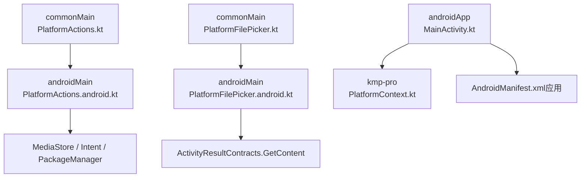
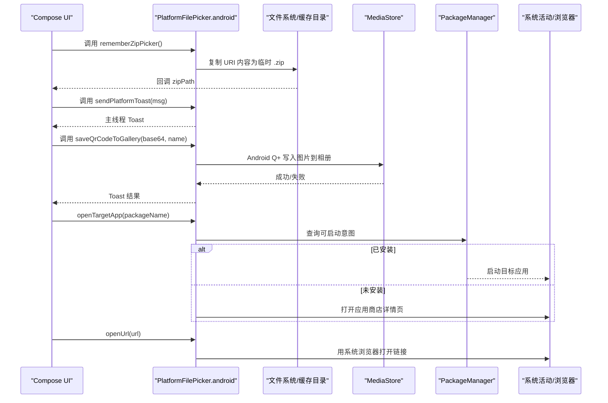
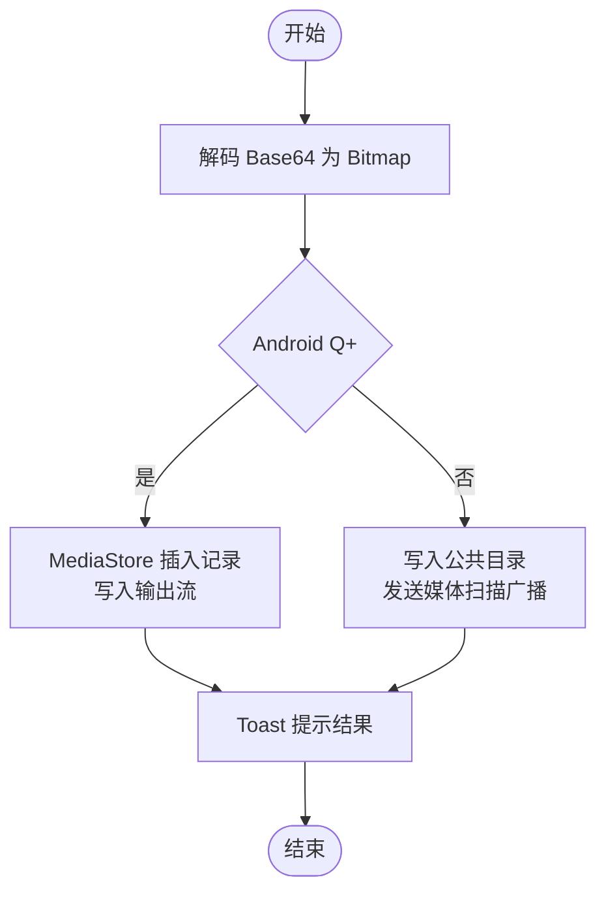
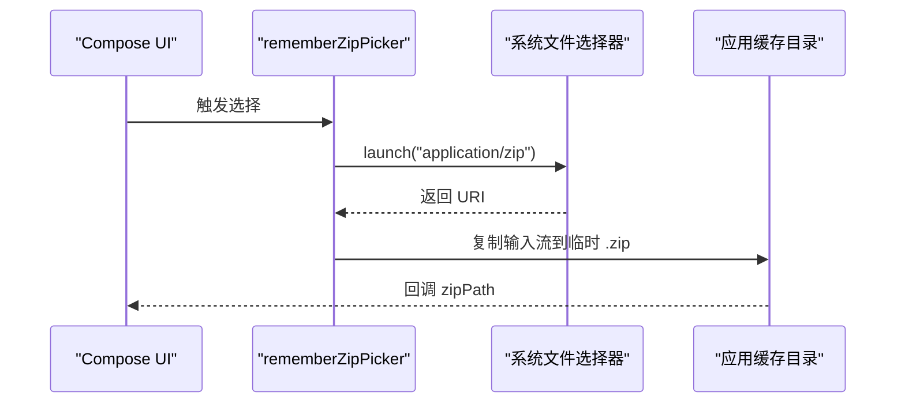
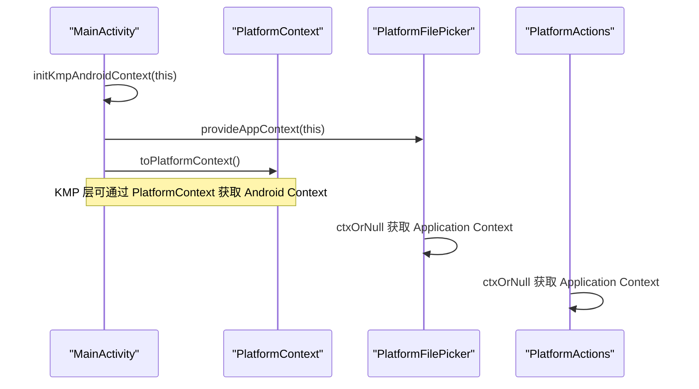
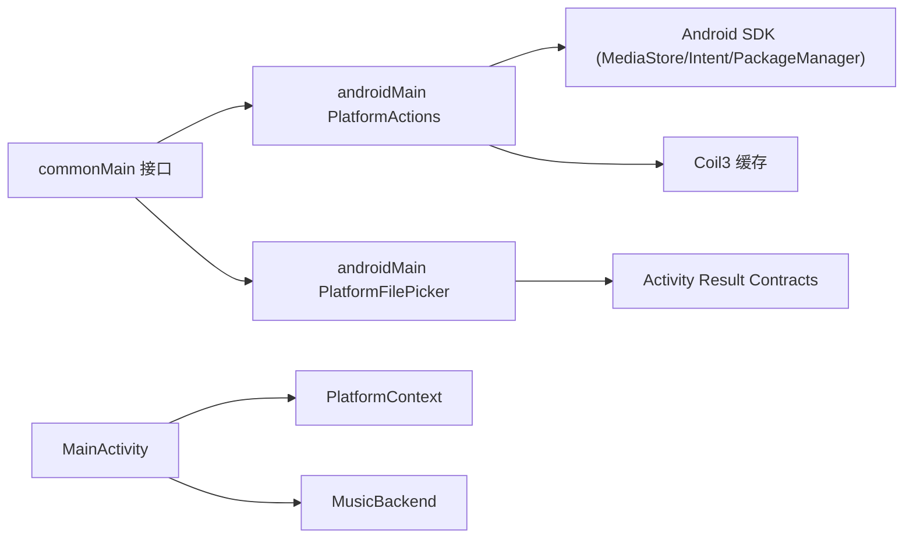

# Android 平台操作

<cite>
**本文引用的文件**
- [PlatformActions.kt](file://app/src/commonMain/kotlin/cp/player/app/platform/PlatformActions.kt)
- [PlatformActions.android.kt](file://app/src/androidMain/kotlin/cp/player/app/platform/PlatformActions.android.kt)
- [PlatformFilePicker.kt](file://app/src/commonMain/kotlin/cp/player/app/platform/PlatformFilePicker.kt)
- [PlatformFilePicker.android.kt](file://app/src/androidMain/kotlin/cp/player/app/platform/PlatformFilePicker.android.kt)
- [MainActivity.kt](file://androidApp/src/main/kotlin/cp/player/app/MainActivity.kt)
- [AndroidManifest.xml（应用）](file://androidApp/src/main/AndroidManifest.xml)
- [AndroidManifest.xml（模块）](file://app/src/androidMain/AndroidManifest.xml)
- [PlatformContext.kt](file://kmp-pro/src/androidMain/kotlin/cp/player/kmp/util/PlatformContext.kt)
</cite>

## 目录
1. [简介](#简介)
2. [项目结构](#项目结构)
3. [核心组件](#核心组件)
4. [架构总览](#架构总览)
5. [详细组件分析](#详细组件分析)
6. [依赖关系分析](#依赖关系分析)
7. [性能考量](#性能考量)
8. [故障排查指南](#故障排查指南)
9. [结论](#结论)
10. [附录：使用示例与扩展指引](#附录使用示例与扩展指引)

## 简介
本文件面向 CPPlayer-KMP 的 Android 平台，系统化说明 PlatformActions 与 PlatformFilePicker 在 Android 端的实现与用法。内容覆盖：
- 文件系统操作：二维码保存到相册、Zip 模块选择器与临时文件写入
- 媒体服务集成：通过 MediaStore 写入图片、系统扫描广播通知
- 系统权限与上下文管理：Application Context 提供、网络与安全配置声明
- 平台特定 API 调用：Intent 打开外部应用/URL、包安装检测、图片缓存清理、返回键处理
- 多格式支持与用户体验优化：基于 ActivityResultContracts 的文件选择器、异步 IO、Toast 提示

## 项目结构
CPPlayer-KMP 采用 KMP 分层组织：
- commonMain：定义跨平台 expect 接口（如 PlatformActions、PlatformFilePicker）
- androidMain：Android 具体 actual 实现
- androidApp：Android 入口 MainActivity，负责初始化平台上下文与应用能力
- kmp-pro：KMP 层工具与平台抽象（如 PlatformContext）

图表来源
- [PlatformActions.kt:1-53](file://app/src/commonMain/kotlin/cp/player/app/platform/PlatformActions.kt#L1-L53)
- [PlatformActions.android.kt:19-119](file://app/src/androidMain/kotlin/cp/player/app/platform/PlatformActions.android.kt#L19-L119)
- [PlatformFilePicker.kt:1-16](file://app/src/commonMain/kotlin/cp/player/app/platform/PlatformFilePicker.kt#L1-L16)
- [PlatformFilePicker.android.kt:17-49](file://app/src/androidMain/kotlin/cp/player/app/platform/PlatformFilePicker.android.kt#L17-L49)
- [MainActivity.kt:14-39](file://androidApp/src/main/kotlin/cp/player/app/MainActivity.kt#L14-L39)
- [AndroidManifest.xml（应用）:1-28](file://androidApp/src/main/AndroidManifest.xml#L1-L28)
- [PlatformContext.kt:1-14](file://kmp-pro/src/androidMain/kotlin/cp/player/kmp/util/PlatformContext.kt#L1-L14)

章节来源
- [PlatformActions.kt:1-53](file://app/src/commonMain/kotlin/cp/player/app/platform/PlatformActions.kt#L1-L53)
- [PlatformFilePicker.kt:1-16](file://app/src/commonMain/kotlin/cp/player/app/platform/PlatformFilePicker.kt#L1-L16)
- [MainActivity.kt:14-39](file://androidApp/src/main/kotlin/cp/player/app/MainActivity.kt#L14-L39)
- [AndroidManifest.xml（应用）:1-28](file://androidApp/src/main/AndroidManifest.xml#L1-L28)
- [PlatformContext.kt:1-14](file://kmp-pro/src/androidMain/kotlin/cp/player/kmp/util/PlatformContext.kt#L1-L14)

## 核心组件
- PlatformActions（Android 实际实现）
  - saveQrCodeToGallery：将 Base64 图片解码为 Bitmap，按 Android 版本策略写入相册（Android Q+ 使用 MediaStore，旧版本使用公共目录 + 媒体扫描广播），并给出 Toast 反馈
  - openTargetApp：尝试以包名启动目标应用；若未安装则尝试跳转至应用商店页面
  - isPackageInstalled：查询包管理器判断是否已安装
  - openUrl：使用系统浏览器打开 URL
  - clearImageCache：清空 Coil 内存与磁盘缓存
  - BackHandler：Compose 返回键拦截
- PlatformFilePicker（Android 实际实现）
  - rememberZipPicker：基于 GetContent 的压缩文件选择器，选择后复制到应用缓存目录的临时 zip 路径，回调绝对路径
  - sendPlatformToast：主线程显示 Toast
- 平台上下文
  - MainActivity 在启动时注入 Application Context，供 PlatformFilePicker 与 PlatformActions 使用
  - PlatformContext 封装 Android Context，便于 KMP 层获取原始上下文

章节来源
- [PlatformActions.android.kt:19-119](file://app/src/androidMain/kotlin/cp/player/app/platform/PlatformActions.android.kt#L19-L119)
- [PlatformFilePicker.android.kt:17-49](file://app/src/androidMain/kotlin/cp/player/app/platform/PlatformFilePicker.android.kt#L17-L49)
- [MainActivity.kt:14-39](file://androidApp/src/main/kotlin/cp/player/app/MainActivity.kt#L14-L39)
- [PlatformContext.kt:1-14](file://kmp-pro/src/androidMain/kotlin/cp/player/kmp/util/PlatformContext.kt#L1-L14)

## 架构总览
下图展示了从 UI 触发到 Android 系统服务的完整调用链：用户触发“保存二维码”或“选择 Zip”，经 Compose 回调进入 Android 实际实现，再调用 MediaStore、PackageManager、Activity Result Contracts 等系统能力。

图表来源
- [PlatformFilePicker.android.kt:17-49](file://app/src/androidMain/kotlin/cp/player/app/platform/PlatformFilePicker.android.kt#L17-L49)
- [PlatformActions.android.kt:19-119](file://app/src/androidMain/kotlin/cp/player/app/platform/PlatformActions.android.kt#L19-L119)

## 详细组件分析

### PlatformActions（Android 实际实现）
- 保存二维码到相册
  - 解析 Base64 -> Bitmap
  - Android Q+：使用 MediaStore 插入记录并写入输出流，相对路径指向 Pictures/CPPlayer
  - 低版本：写入公共目录并通过 ACTION_MEDIA_SCANNER_SCAN_FILE 广播刷新
  - 异常捕获与 Toast 提示
- 打开目标应用
  - 优先通过包名获取 LaunchIntent 并启动
  - 未安装时尝试跳转到 market://details?id=...
- 检查包是否安装
  - 通过 PackageManager.getPackageInfo 判断
- 打开 URL
  - 使用 ACTION_VIEW + Uri 打开默认浏览器
- 清空图片缓存
  - 通过 Coil3 单例 ImageLoader 清理内存与磁盘缓存
- 返回键处理
  - 使用 androidx.activity.compose.BackHandler

图表来源
- [PlatformActions.android.kt:19-60](file://app/src/androidMain/kotlin/cp/player/app/platform/PlatformActions.android.kt#L19-L60)

章节来源
- [PlatformActions.android.kt:19-119](file://app/src/androidMain/kotlin/cp/player/app/platform/PlatformActions.android.kt#L19-L119)

### PlatformFilePicker（Android 实际实现）
- rememberZipPicker
  - 使用 rememberLauncherForActivityResult(ActivityResultContracts.GetContent()) 拉起系统文件选择器
  - 限制类型为 application/zip
  - 选择完成后在 IO 协程中读取 InputStream 并复制到应用缓存目录 temp_module_时间戳.zip
  - 回调 zipPath（取消时为 null）
- sendPlatformToast
  - 在主线程显示短消息

图表来源
- [PlatformFilePicker.android.kt:17-40](file://app/src/androidMain/kotlin/cp/player/app/platform/PlatformFilePicker.android.kt#L17-L40)

章节来源
- [PlatformFilePicker.android.kt:17-49](file://app/src/androidMain/kotlin/cp/player/app/platform/PlatformFilePicker.android.kt#L17-L49)

### 平台上下文与初始化
- MainActivity 在 onCreate 中：
  - 启用 Edge-to-Edge
  - 初始化 KMP Android 上下文
  - 提供 Application Context 给平台能力
  - 初始化 MusicBackend 与 AppVersion
- PlatformContext 提供 toPlatformContext 与 androidContext 访问原始 Context

图表来源
- [MainActivity.kt:14-39](file://androidApp/src/main/kotlin/cp/player/app/MainActivity.kt#L14-L39)
- [PlatformContext.kt:1-14](file://kmp-pro/src/androidMain/kotlin/cp/player/kmp/util/PlatformContext.kt#L1-L14)
- [PlatformFilePicker.android.kt:44-49](file://app/src/androidMain/kotlin/cp/player/app/platform/PlatformFilePicker.android.kt#L44-L49)
- [PlatformActions.android.kt:19-119](file://app/src/androidMain/kotlin/cp/player/app/platform/PlatformActions.android.kt#L19-L119)

章节来源
- [MainActivity.kt:14-39](file://androidApp/src/main/kotlin/cp/player/app/MainActivity.kt#L14-L39)
- [PlatformContext.kt:1-14](file://kmp-pro/src/androidMain/kotlin/cp/player/kmp/util/PlatformContext.kt#L1-L14)

## 依赖关系分析
- 模块内依赖
  - commonMain 的 expect 接口被 androidMain 的 actual 实现
  - androidMain 依赖 Android SDK 的 MediaStore、Intent、PackageManager、Activity Result Contracts
  - MainActivity 依赖 KMP 层的 PlatformContext 与 MusicBackend
- 外部依赖
  - Coil3 用于图片缓存清理
  - Android 系统服务：MediaStore、PackageManager、系统浏览器

图表来源
- [PlatformActions.kt:1-53](file://app/src/commonMain/kotlin/cp/player/app/platform/PlatformActions.kt#L1-L53)
- [PlatformFilePicker.kt:1-16](file://app/src/commonMain/kotlin/cp/player/app/platform/PlatformFilePicker.kt#L1-L16)
- [PlatformActions.android.kt:19-119](file://app/src/androidMain/kotlin/cp/player/app/platform/PlatformActions.android.kt#L19-L119)
- [PlatformFilePicker.android.kt:17-49](file://app/src/androidMain/kotlin/cp/player/app/platform/PlatformFilePicker.android.kt#L17-L49)
- [MainActivity.kt:14-39](file://androidApp/src/main/kotlin/cp/player/app/MainActivity.kt#L14-L39)
- [PlatformContext.kt:1-14](file://kmp-pro/src/androidMain/kotlin/cp/player/kmp/util/PlatformContext.kt#L1-L14)

章节来源
- [PlatformActions.android.kt:19-119](file://app/src/androidMain/kotlin/cp/player/app/platform/PlatformActions.android.kt#L19-L119)
- [PlatformFilePicker.android.kt:17-49](file://app/src/androidMain/kotlin/cp/player/app/platform/PlatformFilePicker.android.kt#L17-L49)
- [MainActivity.kt:14-39](file://androidApp/src/main/kotlin/cp/player/app/MainActivity.kt#L14-L39)

## 性能考量
- 文件读写
  - 使用 withContext(Dispatchers.IO) 进行 IO 操作，避免阻塞主线程
  - 使用 try-with-resources 模式确保流关闭
- 图片保存
  - Android Q+ 使用 MediaStore 减少权限复杂度，提升兼容性
  - 低版本通过媒体扫描广播确保相册可见性
- 缓存清理
  - 仅清理 Coil 内存与磁盘缓存，避免影响其他模块
- 资源释放
  - Bitmap 使用后显式回收，降低内存占用

[本节为通用性能建议，不直接分析具体文件]

## 故障排查指南
- 无法保存到相册
  - 检查 Android 版本分支逻辑是否正确执行
  - 确认 MediaStore 插入返回值非空且输出流写入成功
  - 低版本需确保媒体扫描广播发送成功
- 无法打开目标应用
  - 检查包名是否正确
  - 未安装时尝试跳转应用商店是否可用
- 无法打开 URL
  - 检查 URL 格式与系统浏览器可用性
- 文件选择器无响应
  - 确认已通过 provideAppContext 注入 Application Context
  - 检查 GetContent 类型过滤是否为 application/zip
- Toast 不显示
  - 确认主线程调度与 Application Context 有效

章节来源
- [PlatformActions.android.kt:19-119](file://app/src/androidMain/kotlin/cp/player/app/platform/PlatformActions.android.kt#L19-L119)
- [PlatformFilePicker.android.kt:17-49](file://app/src/androidMain/kotlin/cp/player/app/platform/PlatformFilePicker.android.kt#L17-L49)

## 结论
PlatformActions 与 PlatformFilePicker 在 Android 端提供了稳定、兼容的平台能力封装：
- 通过 MediaStore 与 Intent 完成相册保存与外部应用/浏览器交互
- 通过 Activity Result Contracts 实现简洁的文件选择流程
- 通过 Application Context 注入与异常处理保证鲁棒性
- 结合 Coil3 缓存清理与返回键处理完善用户体验

这些能力可作为扩展点，支撑后续更多平台特定功能（如更多文件格式支持、更丰富的权限处理与系统服务集成）。

[本节为总结性内容，不直接分析具体文件]

## 附录：使用示例与扩展指引
- 保存二维码到相册
  - 调用路径：commonMain 的 expect -> androidMain 的 actual
  - 关键点：Base64 解码、Android 版本分支、MediaStore 写入、Toast 反馈
  - 参考路径：[PlatformActions.kt:5-12](file://app/src/commonMain/kotlin/cp/player/app/platform/PlatformActions.kt#L5-L12)、[PlatformActions.android.kt:19-60](file://app/src/androidMain/kotlin/cp/player/app/platform/PlatformActions.android.kt#L19-L60)
- 打开目标应用或 URL
  - 调用路径：expect -> actual
  - 关键点：Intent 构造、FLAG_ACTIVITY_NEW_TASK、市场页跳转
  - 参考路径：[PlatformActions.android.kt:62-102](file://app/src/androidMain/kotlin/cp/player/app/platform/PlatformActions.android.kt#L62-L102)
- 选择 Zip 模块
  - 调用路径：rememberZipPicker -> GetContent -> 复制到缓存目录
  - 关键点：application/zip 过滤、IO 协程、临时文件命名
  - 参考路径：[PlatformFilePicker.kt:5-10](file://app/src/commonMain/kotlin/cp/player/app/platform/PlatformFilePicker.kt#L5-L10)、[PlatformFilePicker.android.kt:17-40](file://app/src/androidMain/kotlin/cp/player/app/platform/PlatformFilePicker.android.kt#L17-L40)
- 平台上下文注入
  - 在 MainActivity 中提供 Application Context，供平台能力使用
  - 参考路径：[MainActivity.kt:14-39](file://androidApp/src/main/kotlin/cp/player/app/MainActivity.kt#L14-L39)、[PlatformContext.kt:1-14](file://kmp-pro/src/androidMain/kotlin/cp/player/kmp/util/PlatformContext.kt#L1-L14)
- 权限与清单
  - 应用清单包含网络相关权限与安全配置
  - 参考路径：[AndroidManifest.xml（应用）:1-28](file://androidApp/src/main/AndroidManifest.xml#L1-L28)、[AndroidManifest.xml（模块）:1-3](file://app/src/androidMain/AndroidManifest.xml#L1-L3)

[本节为使用指引，不直接分析具体文件]