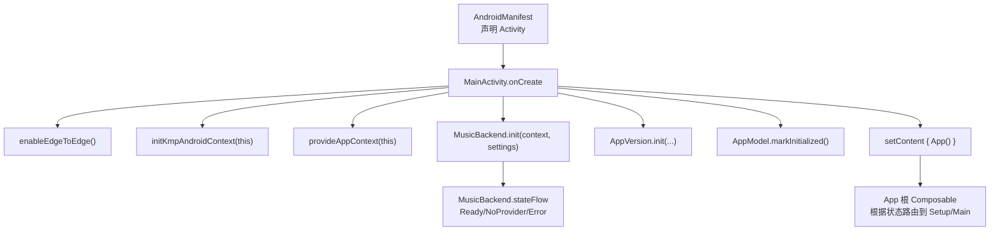
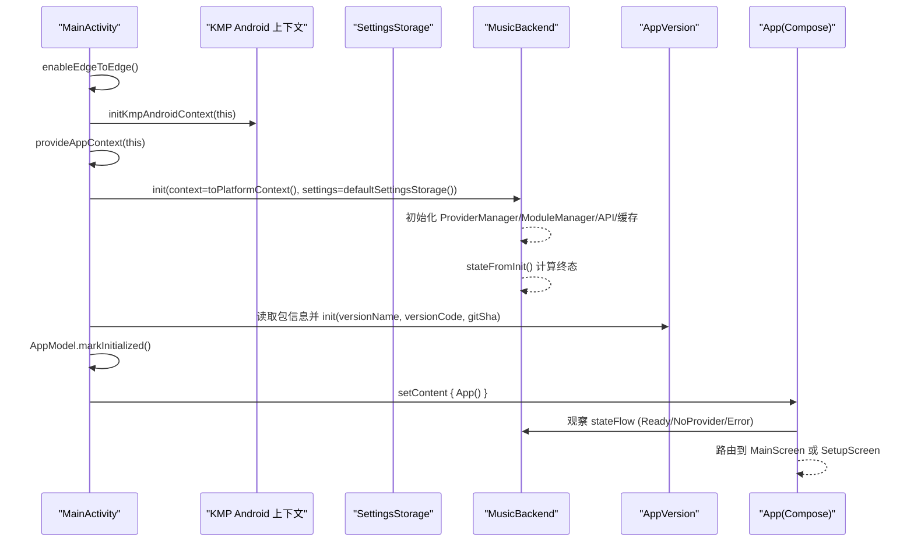
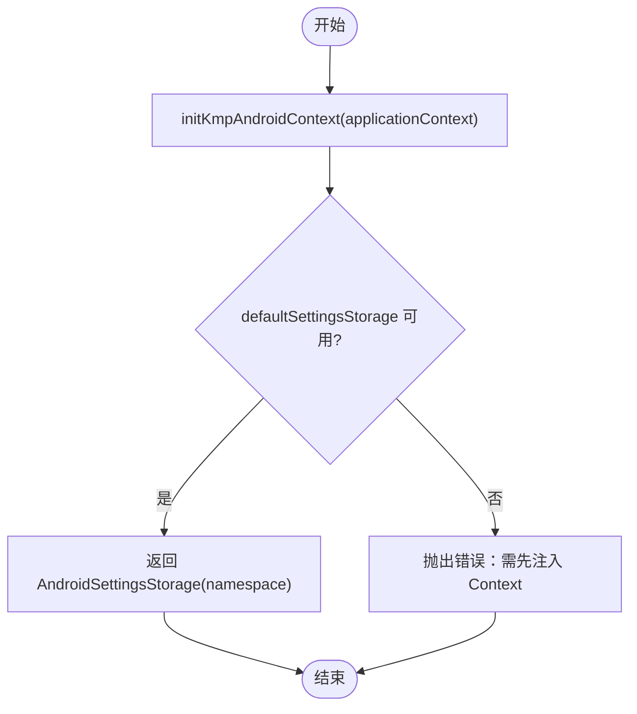
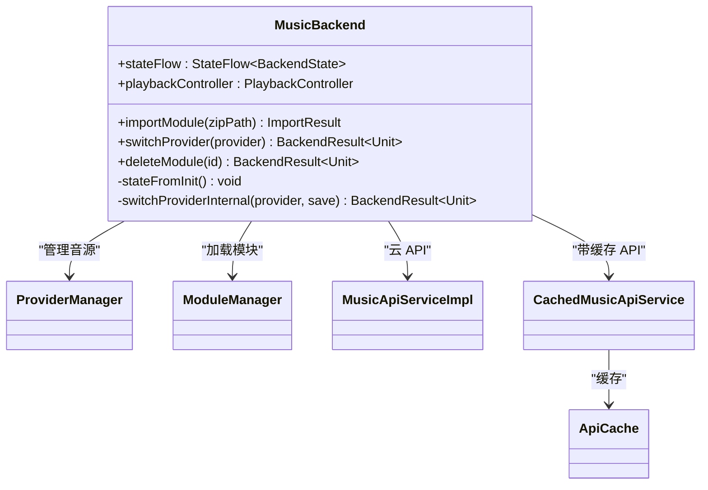
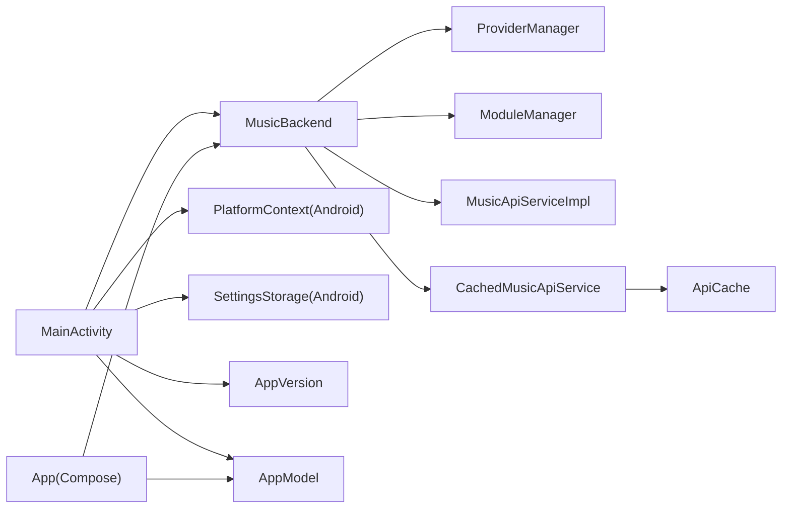

# Android 应用初始化

<cite>
**本文引用的文件**
- [MainActivity.kt](file://androidApp/src/main/kotlin/cp/player/app/MainActivity.kt)
- [AndroidManifest.xml](file://androidApp/src/main/AndroidManifest.xml)
- [build.gradle.kts](file://androidApp/build.gradle.kts)
- [PlatformContext.kt（Android）](file://kmp-pro/src/androidMain/kotlin/cp/player/kmp/util/PlatformContext.kt)
- [PlatformContext.kt（Common）](file://kmp-pro/src/commonMain/kotlin/cp/player/kmp/util/PlatformContext.kt)
- [AndroidSettingsStorage.kt](file://kmp-pro/src/androidMain/kotlin/cp/player/kmp/util/AndroidSettingsStorage.kt)
- [SettingsStorage.kt](file://kmp-pro/src/commonMain/kotlin/cp/player/kmp/util/SettingsStorage.kt)
- [MusicBackend.kt](file://kmp-pro/src/commonMain/kotlin/cp/player/kmp/MusicBackend.kt)
- [App.kt](file://app/src/commonMain/kotlin/cp/player/app/App.kt)
- [AppModel.kt](file://app/src/commonMain/kotlin/cp/player/app/AppModel.kt)
- [AppVersion.kt](file://app/src/commonMain/kotlin/cp/player/app/version/AppVersion.kt)
</cite>

## 目录
1. [简介](#简介)
2. [项目结构](#项目结构)
3. [核心组件](#核心组件)
4. [架构总览](#架构总览)
5. [详细组件分析](#详细组件分析)
6. [依赖关系分析](#依赖关系分析)
7. [性能考虑](#性能考虑)
8. [故障排查指南](#故障排查指南)
9. [结论](#结论)
10. [附录：初始化流程配置与扩展示例](#附录：初始化流程配置与扩展示例)

## 简介
本技术文档聚焦 CPPlayer-KMP 的 Android 应用初始化流程，围绕 MainActivity 生命周期、KMP 上下文初始化、MusicBackend 启动、enableEdgeToEdge 使用、应用上下文提供机制、版本信息获取与设置存储初始化展开。同时给出 Android 特定配置、启动性能优化建议以及常见初始化问题的排查方法，并提供完整的代码级参考路径，便于正确配置和扩展应用初始化流程。

## 项目结构
Android 入口位于 androidApp 模块的 MainActivity，负责启用 Edge-to-Edge、注入 KMP Android 上下文、提供应用 Context、初始化 MusicBackend、读取版本信息并标记应用已初始化，最后设置 Compose 根界面。KMP 层通过 PlatformContext 与 SettingsStorage 抽象平台差异，Android 侧以 SharedPreferences 实现默认设置存储。

图表来源
- [MainActivity.kt:15-38](file://androidApp/src/main/kotlin/cp/player/app/MainActivity.kt#L15-L38)
- [MusicBackend.kt:330-367](file://kmp-pro/src/commonMain/kotlin/cp/player/kmp/MusicBackend.kt#L330-L367)
- [App.kt:31-70](file://app/src/commonMain/kotlin/cp/player/app/App.kt#L31-L70)

章节来源
- [MainActivity.kt:15-38](file://androidApp/src/main/kotlin/cp/player/app/MainActivity.kt#L15-L38)
- [AndroidManifest.xml:7-24](file://androidApp/src/main/AndroidManifest.xml#L7-L24)

## 核心组件
- MainActivity：Android 应用入口，编排初始化顺序，设置 UI 主题与导航起点。
- MusicBackend：KMP 后端统一入口，管理 Provider、API、缓存、播放控制器与健康监控；在 init 后计算终态（Ready/NoProvider/Error）。
- PlatformContext / SettingsStorage：跨平台上下文与设置存储抽象；Android 侧分别以 Context 包装与 SharedPreferences 实现。
- AppModel：应用顶层服务定位器，封装后端状态、Provider 管理、播放控制、用户资料刷新与历史记录等。
- AppVersion：版本信息容器，由构建期注入 Git SHA，运行时从包管理器读取版本名/码。

章节来源
- [MusicBackend.kt:30-72](file://kmp-pro/src/commonMain/kotlin/cp/player/kmp/MusicBackend.kt#L30-L72)
- [PlatformContext.kt（Android）:5-14](file://kmp-pro/src/androidMain/kotlin/cp/player/kmp/util/PlatformContext.kt#L5-L14)
- [AndroidSettingsStorage.kt:5-35](file://kmp-pro/src/androidMain/kotlin/cp/player/kmp/util/AndroidSettingsStorage.kt#L5-L35)
- [AppModel.kt:17-65](file://app/src/commonMain/kotlin/cp/player/app/AppModel.kt#L17-L65)
- [AppVersion.kt:1-34](file://app/src/commonMain/kotlin/cp/player/app/version/AppVersion.kt#L1-L34)

## 架构总览
下图展示从 MainActivity 启动到 Compose 根界面渲染的关键交互：

图表来源
- [MainActivity.kt:15-38](file://androidApp/src/main/kotlin/cp/player/app/MainActivity.kt#L15-L38)
- [MusicBackend.kt:330-388](file://kmp-pro/src/commonMain/kotlin/cp/player/kmp/MusicBackend.kt#L330-L388)
- [App.kt:31-70](file://app/src/commonMain/kotlin/cp/player/app/App.kt#L31-L70)

## 详细组件分析

### MainActivity 生命周期与初始化顺序
- 启用 Edge-to-Edge：确保内容延伸至系统栏区域，避免布局被遮挡。
- 初始化 KMP Android 上下文：将 Application Context 注入到 KMP 层，供后续设置存储与网络等使用。
- 提供应用上下文：为上层 UI 与平台能力提供全局 Context 引用。
- 初始化 MusicBackend：传入 PlatformContext 与默认 SettingsStorage，完成 Provider 加载、API 与缓存初始化，并计算终态。
- 版本信息初始化：从 PackageManager 获取版本名与版本码，结合构建期注入的 Git SHA 初始化 AppVersion。
- 标记应用已初始化：通知 UI 层可安全访问后端单例。
- 设置 Compose 根界面：进入 App 根 Composable，根据后端状态进行路由。

章节来源
- [MainActivity.kt:15-38](file://androidApp/src/main/kotlin/cp/player/app/MainActivity.kt#L15-L38)
- [AndroidManifest.xml:15-24](file://androidApp/src/main/AndroidManifest.xml#L15-L24)

### KMP 上下文初始化与设置存储
- PlatformContext（Android）：包装 Android Context，暴露 raw 字段以便 KMP 层按需访问。
- SettingsStorage（Common）：定义键值存储接口；Android 实际实现基于 SharedPreferences，命名空间隔离。
- defaultSettingsStorage（Android）：要求先调用 initKmpAndroidContext 注入应用 Context，否则抛出错误提示。

图表来源
- [PlatformContext.kt（Android）:5-14](file://kmp-pro/src/androidMain/kotlin/cp/player/kmp/util/PlatformContext.kt#L5-L14)
- [AndroidSettingsStorage.kt:24-35](file://kmp-pro/src/androidMain/kotlin/cp/player/kmp/util/AndroidSettingsStorage.kt#L24-L35)
- [SettingsStorage.kt:1-25](file://kmp-pro/src/commonMain/kotlin/cp/player/kmp/util/SettingsStorage.kt#L1-L25)

章节来源
- [PlatformContext.kt（Android）:5-14](file://kmp-pro/src/androidMain/kotlin/cp/player/kmp/util/PlatformContext.kt#L5-L14)
- [AndroidSettingsStorage.kt:5-35](file://kmp-pro/src/androidMain/kotlin/cp/player/kmp/util/AndroidSettingsStorage.kt#L5-L35)
- [SettingsStorage.kt:1-25](file://kmp-pro/src/commonMain/kotlin/cp/player/kmp/util/SettingsStorage.kt#L1-L25)

### MusicBackend 启动流程
- 初始化阶段：创建 Cookie 存储、Provider 管理器、模块管理器，初始化 API 服务与缓存。
- 终态计算：根据当前 Provider 是否就绪、是否有可用模块，决定初始状态为 Ready、NoProvider 或 Error。
- 自动激活：导入模块时若无活跃 Provider，则自动激活首个可用 Provider。
- 播放控制器：惰性创建，绑定平台播放器、统一音乐源与 API，供前端唯一访问。

图表来源
- [MusicBackend.kt:73-161](file://kmp-pro/src/commonMain/kotlin/cp/player/kmp/MusicBackend.kt#L73-L161)
- [MusicBackend.kt:330-388](file://kmp-pro/src/commonMain/kotlin/cp/player/kmp/MusicBackend.kt#L330-L388)

章节来源
- [MusicBackend.kt:30-72](file://kmp-pro/src/commonMain/kotlin/cp/player/kmp/MusicBackend.kt#L30-L72)
- [MusicBackend.kt:330-388](file://kmp-pro/src/commonMain/kotlin/cp/player/kmp/MusicBackend.kt#L330-L388)

### 版本信息获取与设置存储初始化
- 版本信息：从 PackageManager 获取 versionName 与 versionCode（兼容 P+ 的 longVersionCode），结合构建期注入的 GIT_SHA 初始化 AppVersion。
- 设置存储：通过 defaultSettingsStorage(namespace) 获取 AndroidSettingsStorage，用于保存主题、动态色、纯黑模式、播放音质、最近曲目等。

章节来源
- [MainActivity.kt:27-35](file://androidApp/src/main/kotlin/cp/player/app/MainActivity.kt#L27-L35)
- [build.gradle.kts:1-25](file://androidApp/build.gradle.kts#L1-L25)
- [AppVersion.kt:1-34](file://app/src/commonMain/kotlin/cp/player/app/version/AppVersion.kt#L1-L34)
- [AndroidSettingsStorage.kt:24-35](file://kmp-pro/src/androidMain/kotlin/cp/player/kmp/util/AndroidSettingsStorage.kt#L24-L35)

### Compose 根界面与路由策略
- App 根 Composable 在首次组合时同步播放音质、拉取用户资料、启动历史记录记录器。
- 根据 MusicBackend.stateFlow 的状态选择起始屏幕：无 Provider 显示 SetupScreen，Ready 显示 MainScreen；当状态变为 Ready 时自动替换为 MainScreen。

章节来源
- [App.kt:31-70](file://app/src/commonMain/kotlin/cp/player/app/App.kt#L31-L70)
- [AppModel.kt:17-65](file://app/src/commonMain/kotlin/cp/player/app/AppModel.kt#L17-L65)

## 依赖关系分析
- MainActivity 依赖：
  - AndroidX Activity Compose（enableEdgeToEdge、setContent）
  - KMP 层：MusicBackend、PlatformContext、SettingsStorage
  - 应用层：AppModel、AppVersion
- MusicBackend 依赖：
  - ProviderManager、ModuleManager、MusicApiServiceImpl、CachedMusicApiService、ApiCache
  - 平台相关：PlatformContext（Android 注入 Context）、SettingsStorage（SharedPreferences）
- App 根界面依赖：
  - Voyager 导航、Material3 主题、AppModel 提供的状态流

图表来源
- [MainActivity.kt:15-38](file://androidApp/src/main/kotlin/cp/player/app/MainActivity.kt#L15-L38)
- [MusicBackend.kt:330-367](file://kmp-pro/src/commonMain/kotlin/cp/player/kmp/MusicBackend.kt#L330-L367)
- [App.kt:31-70](file://app/src/commonMain/kotlin/cp/player/app/App.kt#L31-L70)

章节来源
- [MainActivity.kt:15-38](file://androidApp/src/main/kotlin/cp/player/app/MainActivity.kt#L15-L38)
- [MusicBackend.kt:330-367](file://kmp-pro/src/commonMain/kotlin/cp/player/kmp/MusicBackend.kt#L330-L367)
- [App.kt:31-70](file://app/src/commonMain/kotlin/cp/player/app/App.kt#L31-L70)

## 性能考虑
- 延迟初始化：MusicBackend.playbackController 使用惰性创建，减少冷启动开销。
- 异步任务：AppModel 中用户资料刷新与历史记录记录在后台协程执行，避免阻塞主线程。
- 缓存策略：CachedMusicApiService 优先返回缓存，后台拉取增量更新，降低网络请求频率。
- 构建期常量：GIT_SHA 在构建期注入，避免运行时解析成本。
- 最小化主线程工作：MainActivity.onCreate 仅做必要初始化，UI 渲染交由 setContent 后的 Compose 树处理。

[本节为通用性能建议，不直接分析具体文件]

## 故障排查指南
- 未注入应用 Context 导致设置存储失败：
  - 现象：调用 defaultSettingsStorage 时报错提示需先调用 initKmpAndroidContext。
  - 处理：确保在 MainActivity 或 Application 中先调用 initKmpAndroidContext(applicationContext)。
- Provider 未就绪或加载失败：
  - 现象：stateFlow 为 Error，lastLoadError 包含具体原因。
  - 处理：检查模块路径与权限，查看 lastLoadError 详情；必要时删除模块并重新导入。
- 无可用 Provider：
  - 现象：stateFlow 为 NoProvider，UI 显示 SetupScreen。
  - 处理：导入有效模块后自动激活；若仍失败，检查模块完整性与签名。
- 版本信息为空或异常：
  - 现象：versionName/versionCode 未正确设置。
  - 处理：确认 build.gradle.kts 中已注入 GIT_SHA，且 PackageManager 能正常读取包信息。
- Edge-to-Edge 布局问题：
  - 现象：内容被系统栏遮挡。
  - 处理：确保在 onCreate 中调用 enableEdgeToEdge，并在 Compose 中使用合适的修饰符适配系统栏。

章节来源
- [AndroidSettingsStorage.kt:24-35](file://kmp-pro/src/androidMain/kotlin/cp/player/kmp/util/AndroidSettingsStorage.kt#L24-L35)
- [MusicBackend.kt:373-388](file://kmp-pro/src/commonMain/kotlin/cp/player/kmp/MusicBackend.kt#L373-L388)
- [MainActivity.kt:27-35](file://androidApp/src/main/kotlin/cp/player/app/MainActivity.kt#L27-L35)

## 结论
CPPlayer-KMP 的 Android 应用初始化以 MainActivity 为核心，按序完成 Edge-to-Edge 设置、KMP 上下文注入、设置存储准备、MusicBackend 启动与版本信息初始化，最终进入 Compose 根界面并根据后端状态进行路由。通过 PlatformContext 与 SettingsStorage 的跨平台抽象，KMP 层得以在不同平台复用；MusicBackend 提供统一的 Provider 管理与数据访问入口，配合缓存与异步任务保障启动性能与用户体验。遵循本文的配置与排查建议，可有效避免常见初始化问题并稳定扩展应用初始化流程。

## 附录：初始化流程配置与扩展示例
以下示例以“代码片段路径”形式给出关键步骤的参考位置，便于在实际工程中复制与扩展：

- 启用 Edge-to-Edge 与设置 Compose 根界面
  - 参考路径：[MainActivity.kt:15-38](file://androidApp/src/main/kotlin/cp/player/app/MainActivity.kt#L15-L38)
- 注入 KMP Android 上下文与应用 Context
  - 参考路径：[MainActivity.kt:19-21](file://androidApp/src/main/kotlin/cp/player/app/MainActivity.kt#L19-L21)
  - 参考路径：[PlatformContext.kt（Android）:5-14](file://kmp-pro/src/androidMain/kotlin/cp/player/kmp/util/PlatformContext.kt#L5-L14)
- 初始化 MusicBackend 并观察状态
  - 参考路径：[MainActivity.kt:21-25](file://androidApp/src/main/kotlin/cp/player/app/MainActivity.kt#L21-L25)
  - 参考路径：[MusicBackend.kt:330-367](file://kmp-pro/src/commonMain/kotlin/cp/player/kmp/MusicBackend.kt#L330-L367)
  - 参考路径：[App.kt:49-66](file://app/src/commonMain/kotlin/cp/player/app/App.kt#L49-L66)
- 版本信息初始化
  - 参考路径：[MainActivity.kt:27-35](file://androidApp/src/main/kotlin/cp/player/app/MainActivity.kt#L27-L35)
  - 参考路径：[build.gradle.kts:1-25](file://androidApp/build.gradle.kts#L1-L25)
  - 参考路径：[AppVersion.kt:18-30](file://app/src/commonMain/kotlin/cp/player/app/version/AppVersion.kt#L18-L30)
- 设置存储初始化与使用
  - 参考路径：[AndroidSettingsStorage.kt:24-35](file://kmp-pro/src/androidMain/kotlin/cp/player/kmp/util/AndroidSettingsStorage.kt#L24-L35)
  - 参考路径：[AppModel.kt:67-129](file://app/src/commonMain/kotlin/cp/player/app/AppModel.kt#L67-L129)
- 启动性能优化要点
  - 惰性创建播放控制器：[MusicBackend.kt:152-161](file://kmp-pro/src/commonMain/kotlin/cp/player/kmp/MusicBackend.kt#L152-L161)
  - 后台任务与缓存：[AppModel.kt:144-173](file://app/src/commonMain/kotlin/cp/player/app/AppModel.kt#L144-L173)