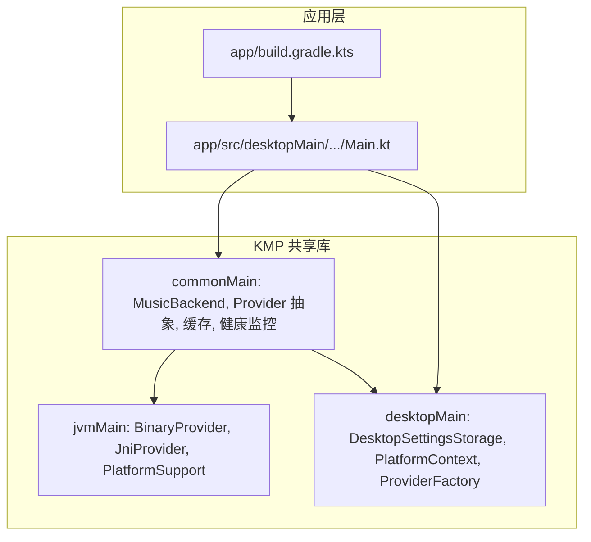
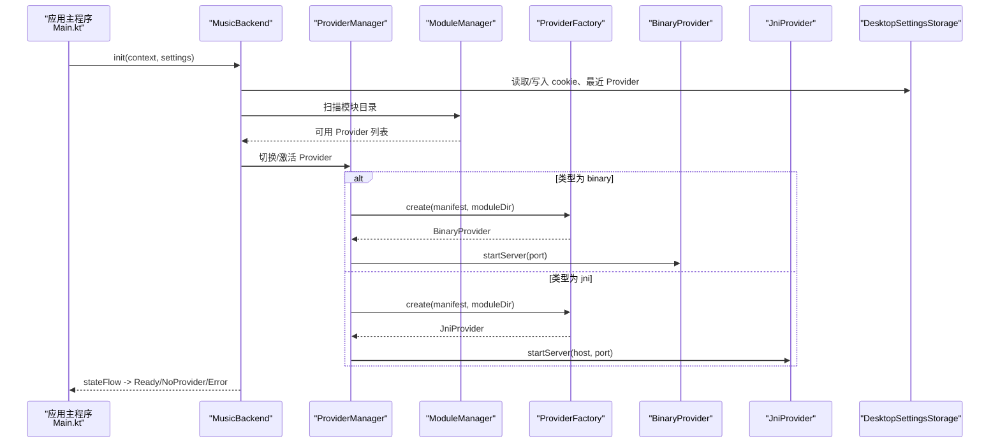
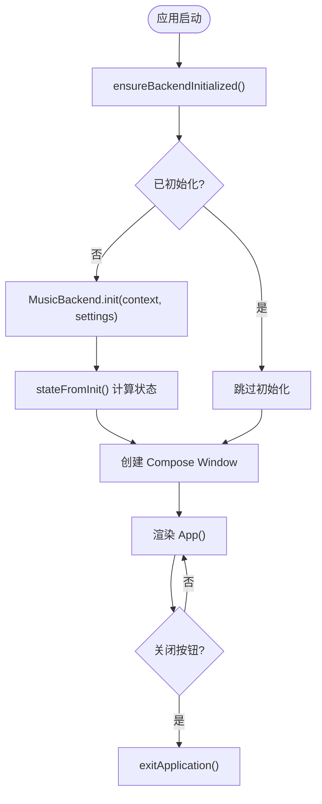
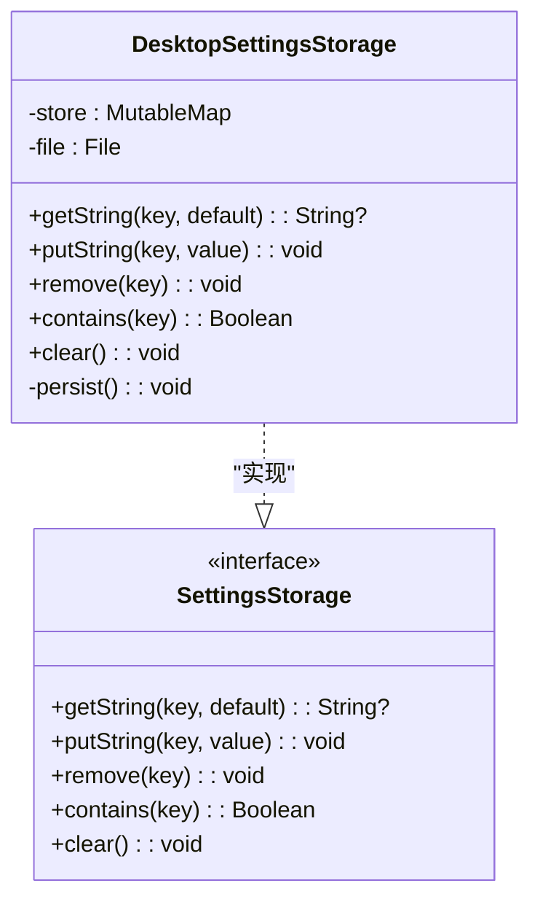
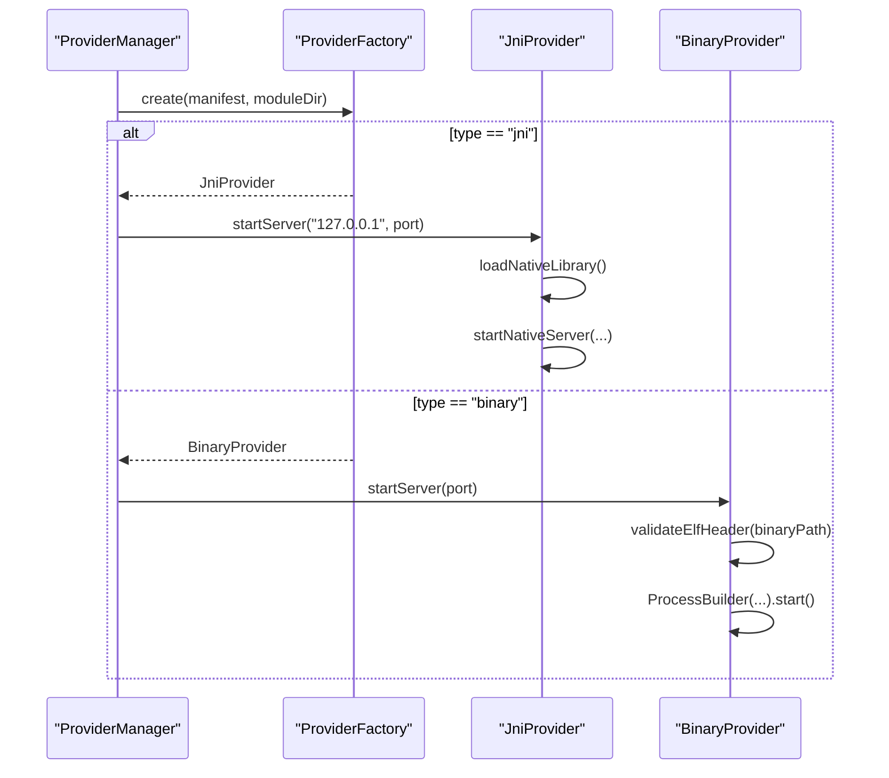
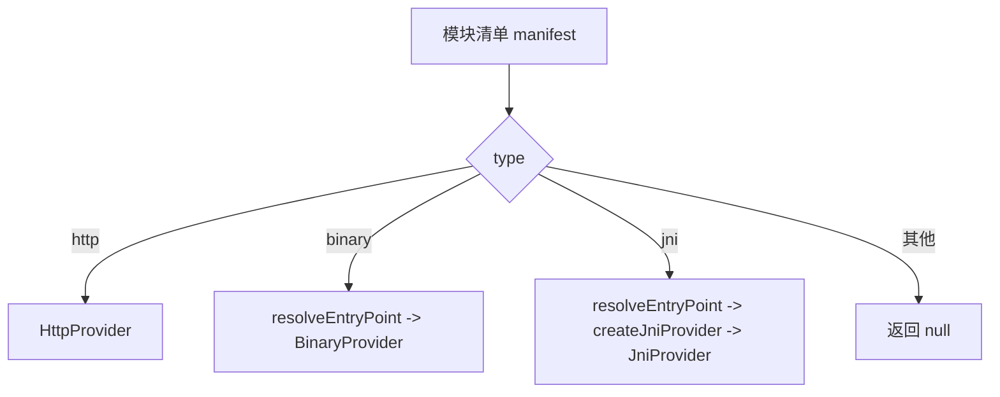
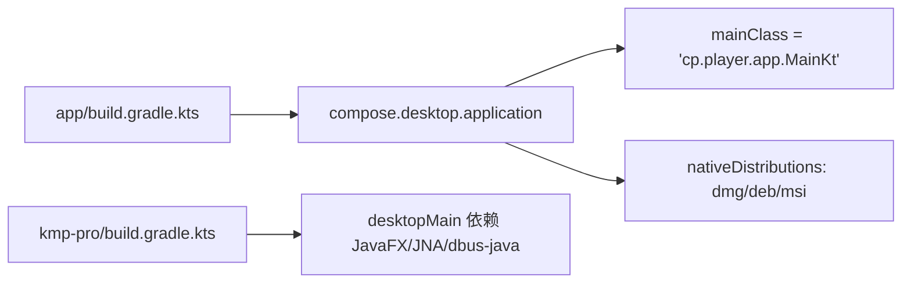
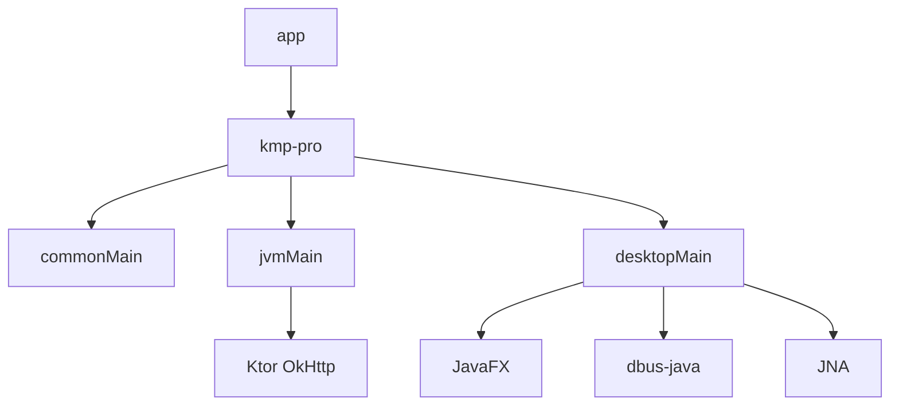

# Desktop 平台实现

<cite>
**本文引用的文件**
- [Main.kt](file://app/src/desktopMain/kotlin/cp/player/app/Main.kt)
- [ProviderFactory (commonMain)](file://kmp-pro/src/commonMain/kotlin/cp/player/kmp/provider/ProviderFactory.kt)
- [ProviderFactory (jvmMain)](file://kmp-pro/src/jvmMain/kotlin/cp/player/kmp/provider/ProviderFactory.kt)
- [ProviderFactory (desktopMain)](file://kmp-pro/src/desktopMain/kotlin/cp/player/kmp/provider/ProviderFactory.kt)
- [BinaryProvider](file://kmp-pro/src/jvmMain/kotlin/cp/player/kmp/provider/BinaryProvider.kt)
- [JniProvider](file://kmp-pro/src/jvmMain/kotlin/cp/player/kmp/provider/JniProvider.kt)
- [MusicBackend](file://kmp-pro/src/commonMain/kotlin/cp/player/kmp/MusicBackend.kt)
- [SettingsStorage (接口)](file://kmp-pro/src/commonMain/kotlin/cp/player/kmp/util/SettingsStorage.kt)
- [DesktopSettingsStorage](file://kmp-pro/src/desktopMain/kotlin/cp/player/kmp/util/DesktopSettingsStorage.kt)
- [PlatformContext (commonMain)](file://kmp-pro/src/commonMain/kotlin/cp/player/kmp/util/PlatformContext.kt)
- [PlatformContext (desktopMain)](file://kmp-pro/src/desktopMain/kotlin/cp/player/kmp/util/PlatformContext.kt)
- [应用构建配置](file://app/build.gradle.kts)
- [KMP 模块构建配置](file://kmp-pro/build.gradle.kts)
</cite>

## 目录
1. [简介](#简介)
2. [项目结构](#项目结构)
3. [核心组件](#核心组件)
4. [架构总览](#架构总览)
5. [详细组件分析](#详细组件分析)
6. [依赖关系分析](#依赖关系分析)
7. [性能考虑](#性能考虑)
8. [故障排查指南](#故障排查指南)
9. [结论](#结论)
10. [附录：示例与最佳实践](#附录示例与最佳实践)

## 简介
本文件面向 CPPlayer-KMP 的 Desktop（JVM）平台实现，聚焦以下目标：
- 启动流程：Compose Desktop 入口、后端初始化、窗口创建。
- 窗口管理：Compose Desktop 窗口生命周期与退出行为。
- 文件系统操作：桌面端设置持久化路径、模块目录与二进制/动态库校验。
- 原生系统集成：JNI 加载、外部进程（二进制 Provider）启动与通信。
- 配置与同步：DesktopSettingsStorage 的实现原理与跨平台数据一致性。
- Provider 机制：ProviderFactory 在 Desktop 的具体实现与动态库/模块管理。
- 构建与发布：Gradle 多平台配置、可执行产物打包。
- 性能调优：缓存策略、健康监控、资源释放与错误恢复。
- 扩展与集成：如何在 Desktop 上实现自定义功能与集成第三方库。

## 项目结构
- 应用层（app）
  - desktopMain：Compose Desktop 入口 Main.kt、主题等。
  - build.gradle.kts：声明 Compose Desktop、目标 JVM 版本、打包格式与包名。
- KMP 共享库（kmp-pro）
  - commonMain：跨平台 API、Provider 抽象、缓存与健康监控、统一音乐源。
  - jvmMain：JVM 共享实现（HTTP 客户端、二进制 Provider、JNI Provider、平台支持工具）。
  - androidMain / desktopMain：平台差异实现（如 SettingsStorage、PlatformContext、ProviderFactory 具体逻辑）。

图表来源
- [Main.kt:1-39](file://app/src/desktopMain/kotlin/cp/player/app/Main.kt#L1-L39)
- [应用构建配置:1-76](file://app/build.gradle.kts#L1-L76)
- [MusicBackend:1-410](file://kmp-pro/src/commonMain/kotlin/cp/player/kmp/MusicBackend.kt#L1-L410)
- [ProviderFactory (jvmMain):1-31](file://kmp-pro/src/jvmMain/kotlin/cp/player/kmp/provider/ProviderFactory.kt#L1-L31)
- [ProviderFactory (desktopMain):1-13](file://kmp-pro/src/desktopMain/kotlin/cp/player/kmp/provider/ProviderFactory.kt#L1-L13)

章节来源
- [Main.kt:1-39](file://app/src/desktopMain/kotlin/cp/player/app/Main.kt#L1-L39)
- [应用构建配置:1-76](file://app/build.gradle.kts#L1-L76)
- [KMP 模块构建配置:1-66](file://kmp-pro/build.gradle.kts#L1-L66)

## 核心组件
- MusicBackend：后端统一入口，负责 Provider 管理、API 访问、播放控制、健康监控与状态机。
- ProviderFactory：根据模块清单创建 HTTP/Binary/JNI Provider；Desktop 通过 expect/actual 注入 JNI 创建逻辑。
- DesktopSettingsStorage：键值存储，内存 Map + Properties 文件持久化，命名空间隔离到 ~/.kmp-pro。
- PlatformContext：Desktop 占位实现，无真实上下文。
- BinaryProvider：启动外部二进制进程并通过 HTTP 调用。
- JniProvider：加载 .so/.dll/.dylib，暴露 external 函数进行本地调用。

章节来源
- [MusicBackend:1-410](file://kmp-pro/src/commonMain/kotlin/cp/player/kmp/MusicBackend.kt#L1-L410)
- [ProviderFactory (commonMain):1-29](file://kmp-pro/src/commonMain/kotlin/cp/player/kmp/provider/ProviderFactory.kt#L1-L29)
- [ProviderFactory (jvmMain):1-31](file://kmp-pro/src/jvmMain/kotlin/cp/player/kmp/provider/ProviderFactory.kt#L1-L31)
- [ProviderFactory (desktopMain):1-13](file://kmp-pro/src/desktopMain/kotlin/cp/player/kmp/provider/ProviderFactory.kt#L1-L13)
- [DesktopSettingsStorage:1-47](file://kmp-pro/src/desktopMain/kotlin/cp/player/kmp/util/DesktopSettingsStorage.kt#L1-L47)
- [PlatformContext (commonMain):1-14](file://kmp-pro/src/commonMain/kotlin/cp/player/kmp/util/PlatformContext.kt#L1-L14)
- [PlatformContext (desktopMain):1-10](file://kmp-pro/src/desktopMain/kotlin/cp/player/kmp/util/PlatformContext.kt#L1-L10)
- [BinaryProvider:1-108](file://kmp-pro/src/jvmMain/kotlin/cp/player/kmp/provider/BinaryProvider.kt#L1-L108)
- [JniProvider:1-142](file://kmp-pro/src/jvmMain/kotlin/cp/player/kmp/provider/JniProvider.kt#L1-L142)

## 架构总览
Desktop 平台的整体架构以 MusicBackend 为核心，向上提供统一的 API 与播放控制，向下通过 ProviderManager/ModuleManager 管理音源模块（HTTP/Binary/JNI），并借助 DesktopSettingsStorage 持久化用户设置。

图表来源
- [MusicBackend:1-410](file://kmp-pro/src/commonMain/kotlin/cp/player/kmp/MusicBackend.kt#L1-L410)
- [ProviderFactory (jvmMain):1-31](file://kmp-pro/src/jvmMain/kotlin/cp/player/kmp/provider/ProviderFactory.kt#L1-L31)
- [BinaryProvider:1-108](file://kmp-pro/src/jvmMain/kotlin/cp/player/kmp/provider/BinaryProvider.kt#L1-L108)
- [JniProvider:1-142](file://kmp-pro/src/jvmMain/kotlin/cp/player/kmp/provider/JniProvider.kt#L1-L142)
- [DesktopSettingsStorage:1-47](file://kmp-pro/src/desktopMain/kotlin/cp/player/kmp/util/DesktopSettingsStorage.kt#L1-L47)

## 详细组件分析

### 启动流程与窗口管理
- 入口：Compose Desktop application 启动后，先确保后端初始化，再创建 Window。
- 后端初始化：MusicBackend.init 接收 PlatformContext 与 defaultSettingsStorage，完成 ProviderManager、ModuleManager、API 服务与缓存的装配，并计算初始状态。
- 窗口管理：Window onCloseRequest 调用 exitApplication 关闭应用；标题设置为“CPPlayer (KMP)”。

图表来源
- [Main.kt:1-39](file://app/src/desktopMain/kotlin/cp/player/app/Main.kt#L1-L39)
- [MusicBackend:314-388](file://kmp-pro/src/commonMain/kotlin/cp/player/kmp/MusicBackend.kt#L314-L388)

章节来源
- [Main.kt:1-39](file://app/src/desktopMain/kotlin/cp/player/app/Main.kt#L1-L39)
- [MusicBackend:314-388](file://kmp-pro/src/commonMain/kotlin/cp/player/kmp/MusicBackend.kt#L314-L388)

### 文件系统操作与持久化
- 设置存储：DesktopSettingsStorage 使用 ConcurrentHashMap 作为内存缓存，并在 putString/remove/clear 时写回 Properties 文件。
- 持久化路径：~/.kmp-pro/<namespace>.properties，命名空间默认 cp_player_prefs。
- 健壮性：读写异常不阻塞主流程；首次启动若文件不存在则创建目录并写入。

图表来源
- [DesktopSettingsStorage:1-47](file://kmp-pro/src/desktopMain/kotlin/cp/player/kmp/util/DesktopSettingsStorage.kt#L1-L47)
- [SettingsStorage (接口):1-25](file://kmp-pro/src/commonMain/kotlin/cp/player/kmp/util/SettingsStorage.kt#L1-L25)

章节来源
- [DesktopSettingsStorage:1-47](file://kmp-pro/src/desktopMain/kotlin/cp/player/kmp/util/DesktopSettingsStorage.kt#L1-L47)
- [SettingsStorage (接口):1-25](file://kmp-pro/src/commonMain/kotlin/cp/player/kmp/util/SettingsStorage.kt#L1-L25)

### 原生系统集成：JNI 与外部进程
- JNI Provider：
  - 加载前校验：文件存在、大小、可读权限、ELF 头验证。
  - 加载时机：startServer 中 System.load(soPath)，随后调用 external 函数启动本地服务。
  - 调用封装：callApi 将参数序列化为 JSON 字符串，调用 nativeCallApi，捕获崩溃并返回错误 JSON。
- 二进制 Provider：
  - 启动方式：ProcessBuilder 运行二进制，传入 --port <port>。
  - 通信协议：HTTP POST 到 http://127.0.0.1:<port>/api/<method>，请求体为 JSON。
  - 健壮性：ELF 校验失败或进程启动异常会记录 loadError 并抛出异常。

图表来源
- [ProviderFactory (jvmMain):1-31](file://kmp-pro/src/jvmMain/kotlin/cp/player/kmp/provider/ProviderFactory.kt#L1-L31)
- [JniProvider:1-142](file://kmp-pro/src/jvmMain/kotlin/cp/player/kmp/provider/JniProvider.kt#L1-L142)
- [BinaryProvider:1-108](file://kmp-pro/src/jvmMain/kotlin/cp/player/kmp/provider/BinaryProvider.kt#L1-L108)

章节来源
- [JniProvider:1-142](file://kmp-pro/src/jvmMain/kotlin/cp/player/kmp/provider/JniProvider.kt#L1-L142)
- [BinaryProvider:1-108](file://kmp-pro/src/jvmMain/kotlin/cp/player/kmp/provider/BinaryProvider.kt#L1-L108)
- [ProviderFactory (jvmMain):1-31](file://kmp-pro/src/jvmMain/kotlin/cp/player/kmp/provider/ProviderFactory.kt#L1-L31)

### ProviderFactory 在 Desktop 的具体实现
- 期望与实现：
  - commonMain 定义 expect object ProviderFactory 与 expect fun createJniProvider。
  - jvmMain 提供 actual object ProviderFactory.create，根据 manifest.type 选择 HTTP/Binary/JNI。
  - desktopMain 提供 actual fun createJniProvider，返回 JniProvider（支持 Win/Linux/Mac）。
- 模块解析：
  - 对 binary/jni 类型，通过 PlatformSupport.resolveEntryPoint 解析实际可执行/动态库路径，并校验存在性。

图表来源
- [ProviderFactory (commonMain):1-29](file://kmp-pro/src/commonMain/kotlin/cp/player/kmp/provider/ProviderFactory.kt#L1-L29)
- [ProviderFactory (jvmMain):1-31](file://kmp-pro/src/jvmMain/kotlin/cp/player/kmp/provider/ProviderFactory.kt#L1-L31)
- [ProviderFactory (desktopMain):1-13](file://kmp-pro/src/desktopMain/kotlin/cp/player/kmp/provider/ProviderFactory.kt#L1-L13)

章节来源
- [ProviderFactory (commonMain):1-29](file://kmp-pro/src/commonMain/kotlin/cp/player/kmp/provider/ProviderFactory.kt#L1-L29)
- [ProviderFactory (jvmMain):1-31](file://kmp-pro/src/jvmMain/kotlin/cp/player/kmp/provider/ProviderFactory.kt#L1-L31)
- [ProviderFactory (desktopMain):1-13](file://kmp-pro/src/desktopMain/kotlin/cp/player/kmp/provider/ProviderFactory.kt#L1-L13)

### 构建配置与打包发布
- 应用层（app）：
  - Kotlin Multiplatform 插件、Compose Desktop 插件。
  - jvmTarget=JVM_21，sourceSets 中 desktopMain 依赖 Compose Desktop、Coroutines Swing、Ktor OkHttp。
  - compose.desktop.application 指定 mainClass、nativeDistributions 目标格式（dmg/deb/msi）、包名与版本。
- KMP 模块（kmp-pro）：
  - 定义 jvmMain 并依赖 commonMain；androidMain 与 desktopMain 均依赖 jvmMain。
  - desktopMain 依赖 JavaFX（按 OS 分类器）、dbus-java（Linux MPRIS）、JNA（Windows SMTC/libmpv）。

图表来源
- [应用构建配置:1-76](file://app/build.gradle.kts#L1-L76)
- [KMP 模块构建配置:1-66](file://kmp-pro/build.gradle.kts#L1-L66)

章节来源
- [应用构建配置:1-76](file://app/build.gradle.kts#L1-L76)
- [KMP 模块构建配置:1-66](file://kmp-pro/build.gradle.kts#L1-L66)

### 性能调优策略
- 缓存优先：CachedMusicApiService 先返回缓存，后台拉取网络，指纹比对决定是否回传 Fresh。
- 健康监控：三级分类（OK/WARNING/ERROR），ERROR 触发多 Provider 容灾，最终带缓存降级。
- 资源释放：MusicBackend.reset 停止 Provider、释放播放器、取消协程作用域。
- 二进制/JNI 健壮性：ELF 校验、进程/库加载失败快速失败并记录错误，避免阻塞。

章节来源
- [MusicBackend:1-410](file://kmp-pro/src/commonMain/kotlin/cp/player/kmp/MusicBackend.kt#L1-L410)
- [BinaryProvider:1-108](file://kmp-pro/src/jvmMain/kotlin/cp/player/kmp/provider/BinaryProvider.kt#L1-L108)
- [JniProvider:1-142](file://kmp-pro/src/jvmMain/kotlin/cp/player/kmp/provider/JniProvider.kt#L1-L142)

## 依赖关系分析
- 应用层依赖 KMP 共享库（api(project(":kmp-pro"))）。
- KMP 共享库：
  - commonMain 依赖协程、序列化、datetime、Ktor Core/Negotiation/Serialization。
  - jvmMain 增加 Ktor OkHttp 引擎。
  - desktopMain 增加 JavaFX、dbus-java、JNA。
- 运行时依赖：
  - BinaryProvider 依赖操作系统可执行文件与 HTTP 通信。
  - JniProvider 依赖系统动态库（.so/.dll/.dylib）。

图表来源
- [应用构建配置:1-76](file://app/build.gradle.kts#L1-L76)
- [KMP 模块构建配置:1-66](file://kmp-pro/build.gradle.kts#L1-L66)

章节来源
- [应用构建配置:1-76](file://app/build.gradle.kts#L1-L76)
- [KMP 模块构建配置:1-66](file://kmp-pro/build.gradle.kts#L1-L66)

## 性能考虑
- 缓存命中率：合理设置 CacheConfig 的 freshTtlMs 与 maxEntries，减少重复网络请求。
- 指纹比对：利用 Fingerprinter 仅对“不同较大数据”进行回传，降低 UI 更新开销。
- 健康监控：WARNING 级别允许继续工作但告警；ERROR 级别触发容灾，保障可用性。
- 资源管理：及时 stopServer/release，避免进程/库泄漏；删除模块后自动切换或回退状态。
- I/O 优化：DesktopSettingsStorage 使用并发 Map 与异步持久化，避免阻塞主线程。

[本节为通用指导，无需特定文件引用]

## 故障排查指南
- 启动失败
  - 检查 ensureBackendInitialized 是否被调用；确认 MusicBackend.init 成功且 stateFlow 进入 Ready。
  - 参考：[Main.kt:22-38](file://app/src/desktopMain/kotlin/cp/player/app/Main.kt#L22-L38)、[MusicBackend:314-388](file://kmp-pro/src/commonMain/kotlin/cp/player/kmp/MusicBackend.kt#L314-L388)
- Provider 未就绪
  - BinaryProvider：确认二进制文件存在、ELF 校验通过、进程启动成功；查看 lastLoadError。
  - JniProvider：确认 soPath 存在、可读、大小合理、ELF 头正确；查看 getLoadError。
  - 参考：[BinaryProvider:42-80](file://kmp-pro/src/jvmMain/kotlin/cp/player/kmp/provider/BinaryProvider.kt#L42-L80)、[JniProvider:23-55](file://kmp-pro/src/jvmMain/kotlin/cp/player/kmp/provider/JniProvider.kt#L23-L55)
- 设置丢失
  - 检查 ~/.kmp-pro/<namespace>.properties 是否存在与可写；确认 persist 未被异常中断。
  - 参考：[DesktopSettingsStorage:17-35](file://kmp-pro/src/desktopMain/kotlin/cp/player/kmp/util/DesktopSettingsStorage.kt#L17-L35)
- 网络/缓存问题
  - 观察 HealthMonitor 的 overallLevelFlow；必要时调整 CacheConfig.enableCache/enableFallback。
  - 参考：[MusicBackend:330-367](file://kmp-pro/src/commonMain/kotlin/cp/player/kmp/MusicBackend.kt#L330-L367)

章节来源
- [Main.kt:22-38](file://app/src/desktopMain/kotlin/cp/player/app/Main.kt#L22-L38)
- [MusicBackend:314-388](file://kmp-pro/src/commonMain/kotlin/cp/player/kmp/MusicBackend.kt#L314-L388)
- [BinaryProvider:42-80](file://kmp-pro/src/jvmMain/kotlin/cp/player/kmp/provider/BinaryProvider.kt#L42-L80)
- [JniProvider:23-55](file://kmp-pro/src/jvmMain/kotlin/cp/player/kmp/provider/JniProvider.kt#L23-L55)
- [DesktopSettingsStorage:17-35](file://kmp-pro/src/desktopMain/kotlin/cp/player/kmp/util/DesktopSettingsStorage.kt#L17-L35)

## 结论
Desktop 平台通过 MusicBackend 统一管理 Provider、API 与播放控制，结合 DesktopSettingsStorage 实现跨平台一致的设置持久化；ProviderFactory 在 Desktop 上支持 JNI 与二进制模块的动态加载与通信；构建配置支持多平台打包发布。通过缓存与健康监控，系统在可用性、性能与可维护性之间取得平衡。

[本节为总结，无需特定文件引用]

## 附录：示例与最佳实践

### 在 Desktop 上初始化后端与窗口
- 在 Compose Desktop 入口中调用 ensureBackendInitialized，再创建 Window。
- 参考路径：
  - [入口与初始化:10-38](file://app/src/desktopMain/kotlin/cp/player/app/Main.kt#L10-L38)
  - [后端初始化:330-367](file://kmp-pro/src/commonMain/kotlin/cp/player/kmp/MusicBackend.kt#L330-L367)

### 自定义 Provider 集成（二进制）
- 将可执行文件放入模块目录，manifest.type 设为 "binary"，entryPoint 指向可执行路径。
- 启动时通过 BinaryProvider 启动进程并以 HTTP 调用。
- 参考路径：
  - [ProviderFactory 创建 binary:18-22](file://kmp-pro/src/jvmMain/kotlin/cp/player/kmp/provider/ProviderFactory.kt#L18-L22)
  - [BinaryProvider 启动与调用:54-104](file://kmp-pro/src/jvmMain/kotlin/cp/player/kmp/provider/BinaryProvider.kt#L54-L104)

### 自定义 Provider 集成（JNI）
- 将动态库放入模块目录，manifest.type 设为 "jni"，entryPoint 指向 .so/.dll/.dylib。
- Desktop 通过 createJniProvider 返回 JniProvider，startServer 加载库并启动本地服务。
- 参考路径：
  - [ProviderFactory 创建 jni:23-27](file://kmp-pro/src/jvmMain/kotlin/cp/player/kmp/provider/ProviderFactory.kt#L23-L27)
  - [Desktop createJniProvider:3-13](file://kmp-pro/src/desktopMain/kotlin/cp/player/kmp/provider/ProviderFactory.kt#L3-L13)
  - [JniProvider 加载与调用:39-84](file://kmp-pro/src/jvmMain/kotlin/cp/player/kmp/provider/JniProvider.kt#L39-L84)

### 设置持久化与命名空间
- 使用 defaultSettingsStorage(namespace) 获取 DesktopSettingsStorage，命名空间映射到 ~/.kmp-pro/<namespace>.properties。
- 参考路径：
  - [默认工厂:45-47](file://kmp-pro/src/desktopMain/kotlin/cp/player/kmp/util/DesktopSettingsStorage.kt#L45-L47)
  - [持久化实现:17-35](file://kmp-pro/src/desktopMain/kotlin/cp/player/kmp/util/DesktopSettingsStorage.kt#L17-L35)

### 构建与打包
- 在 app/build.gradle.kts 中配置 compose.desktop.application，指定 mainClass、nativeDistributions 目标格式与包名。
- 参考路径：
  - [应用构建配置:67-76](file://app/build.gradle.kts#L67-L76)

### 性能调优建议
- 调整 CacheConfig：freshTtlMs、maxEntries、enableFallback、enableCache。
- 关注 HealthMonitor 的 overallLevelFlow，及时处理 WARNING/ERROR。
- 及时释放资源：stopServer、release、cancel 协程作用域。
- 参考路径：
  - [后端初始化与缓存装配:330-367](file://kmp-pro/src/commonMain/kotlin/cp/player/kmp/MusicBackend.kt#L330-L367)
  - [资源释放:260-269](file://kmp-pro/src/commonMain/kotlin/cp/player/kmp/MusicBackend.kt#L260-L269)