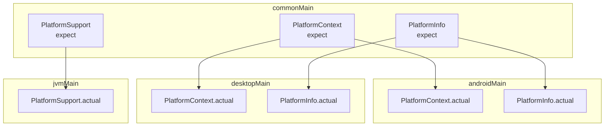
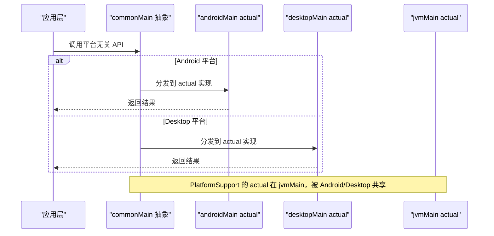
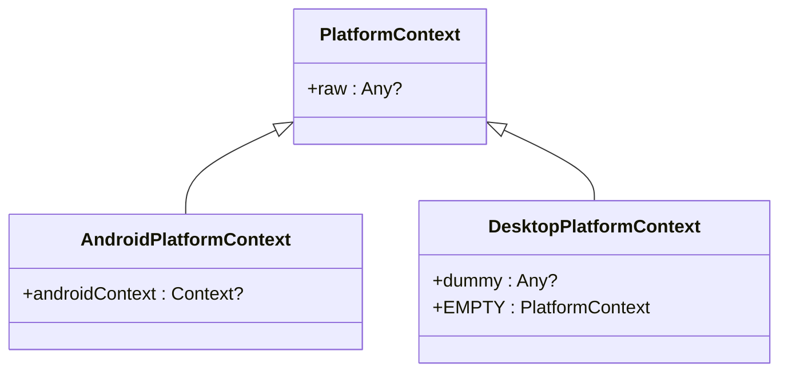
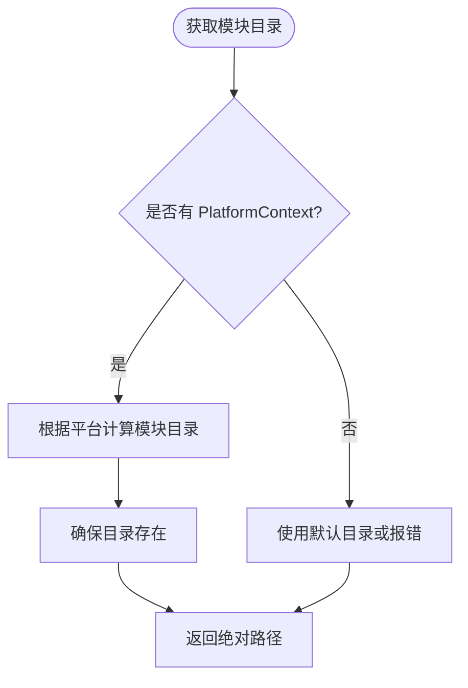
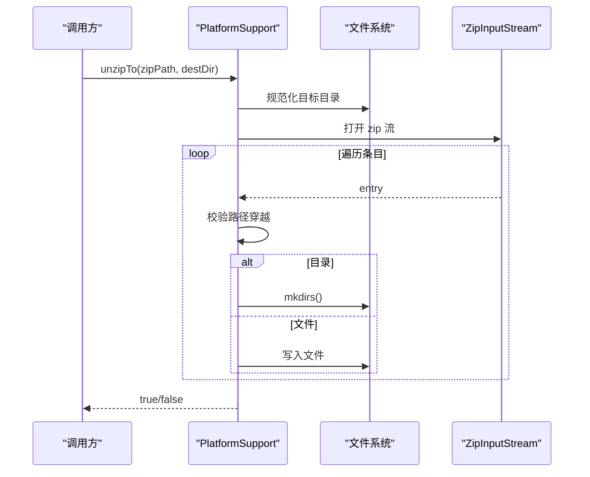
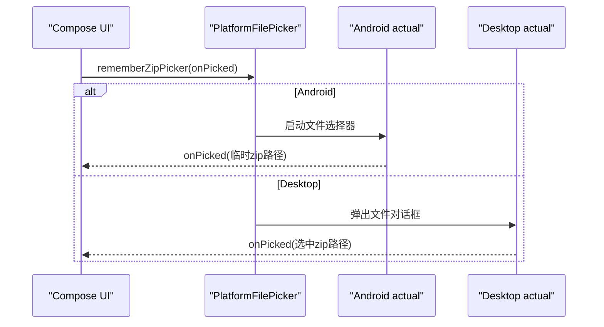
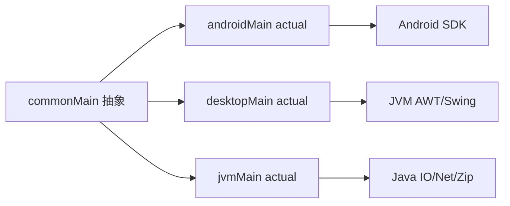

# 平台抽象层设计

<cite>
**本文引用的文件**
- [PlatformContext.kt](file://kmp-pro/src/commonMain/kotlin/cp/player/kmp/util/PlatformContext.kt)
- [PlatformInfo.kt](file://kmp-pro/src/commonMain/kotlin/cp/player/kmp/util/PlatformInfo.kt)
- [PlatformSupport.kt](file://kmp-pro/src/commonMain/kotlin/cp/player/kmp/util/PlatformSupport.kt)
- [PlatformContext.kt（Android）](file://kmp-pro/src/androidMain/kotlin/cp/player/kmp/util/PlatformContext.kt)
- [PlatformInfo.kt（Android）](file://kmp-pro/src/androidMain/kotlin/cp/player/kmp/util/PlatformInfo.kt)
- [PlatformContext.kt（Desktop）](file://kmp-pro/src/desktopMain/kotlin/cp/player/kmp/util/PlatformContext.kt)
- [PlatformInfo.kt（Desktop）](file://kmp-pro/src/desktopMain/kotlin/cp/player/kmp/util/PlatformInfo.kt)
- [PlatformSupport.kt（JVM）](file://kmp-pro/src/jvmMain/kotlin/cp/player/kmp/util/PlatformSupport.kt)
- [PlatformActions.kt](file://app/src/commonMain/kotlin/cp/player/app/platform/PlatformActions.kt)
- [PlatformActions.android.kt](file://app/src/androidMain/kotlin/cp/player/app/platform/PlatformActions.android.kt)
- [PlatformActions.desktop.kt](file://app/src/desktopMain/kotlin/cp/player/app/platform/PlatformActions.desktop.kt)
- [PlatformFilePicker.kt](file://app/src/commonMain/kotlin/cp/player/app/platform/PlatformFilePicker.kt)
- [PlatformFilePicker.android.kt](file://app/src/androidMain/kotlin/cp/player/app/platform/PlatformFilePicker.android.kt)
- [PlatformFilePicker.desktop.kt](file://app/src/desktopMain/kotlin/cp/player/app/platform/PlatformFilePicker.desktop.kt)
</cite>

## 目录
1. [简介](#简介)
2. [项目结构](#项目结构)
3. [核心组件](#核心组件)
4. [架构总览](#架构总览)
5. [详细组件分析](#详细组件分析)
6. [依赖关系分析](#依赖关系分析)
7. [性能考量](#性能考量)
8. [故障排查指南](#故障排查指南)
9. [结论](#结论)
10. [附录：开发指南](#附录开发指南)

## 简介
本技术文档聚焦 CPPlayer-KMP 的平台抽象层设计与实现，围绕 Kotlin Multiplatform 的 expect/actual 机制，说明如何通过统一的接口屏蔽 Android、Desktop（JVM）等平台差异。重点阐述 PlatformContext、PlatformInfo、PlatformSupport 等核心抽象的职责与实现方式，并给出平台检测、功能兼容性检查与错误处理策略。文末提供完整开发指南，帮助为新平台添加支持或扩展现有能力。

## 项目结构
平台抽象层采用分层组织：
- commonMain：定义跨平台 API（expect），包括上下文、平台信息、通用平台能力。
- androidMain/desktopMain：针对具体平台的 actual 实现，封装平台特定细节。
- jvmMain：为 JVM 共享能力（Android 与 Desktop 共用）提供 actual 实现，如端口探测、解压、ELF 校验等。

图表来源
- [PlatformContext.kt](file://kmp-pro/src/commonMain/kotlin/cp/player/kmp/util/PlatformContext.kt)
- [PlatformInfo.kt](file://kmp-pro/src/commonMain/kotlin/cp/player/kmp/util/PlatformInfo.kt)
- [PlatformSupport.kt](file://kmp-pro/src/commonMain/kotlin/cp/player/kmp/util/PlatformSupport.kt)
- [PlatformContext.kt（Android）](file://kmp-pro/src/androidMain/kotlin/cp/player/kmp/util/PlatformContext.kt)
- [PlatformInfo.kt（Android）](file://kmp-pro/src/androidMain/kotlin/cp/player/kmp/util/PlatformInfo.kt)
- [PlatformContext.kt（Desktop）](file://kmp-pro/src/desktopMain/kotlin/cp/player/kmp/util/PlatformContext.kt)
- [PlatformInfo.kt（Desktop）](file://kmp-pro/src/desktopMain/kotlin/cp/player/kmp/util/PlatformInfo.kt)
- [PlatformSupport.kt（JVM）](file://kmp-pro/src/jvmMain/kotlin/cp/player/kmp/util/PlatformSupport.kt)

章节来源
- [PlatformContext.kt](file://kmp-pro/src/commonMain/kotlin/cp/player/kmp/util/PlatformContext.kt)
- [PlatformInfo.kt](file://kmp-pro/src/commonMain/kotlin/cp/player/kmp/util/PlatformInfo.kt)
- [PlatformSupport.kt](file://kmp-pro/src/commonMain/kotlin/cp/player/kmp/util/PlatformSupport.kt)

## 核心组件
- PlatformContext：不透明的平台上下文包装。Android 持有 Context；Desktop 为空占位。通过 raw 暴露原始对象引用，便于在平台源集内访问原生能力。
- PlatformInfo：声明平台 ABI 列表与模块根目录获取方法。Android 使用系统 ABI 列表与应用 filesDir/modules；Desktop 使用固定 ABI 列表与用户主目录下的 .kmp-pro/modules。
- PlatformSupport：跨平台能力集合，包含端口探测、可用端口查找、解压到目标目录（含路径穿越保护）、递归删除、文本读取、存在性判断、入口解析、ELF 头校验、子目录列举、目录移动等。其 actual 实现在 jvmMain 中，供 Android 与 Desktop 共享。

章节来源
- [PlatformContext.kt](file://kmp-pro/src/commonMain/kotlin/cp/player/kmp/util/PlatformContext.kt)
- [PlatformInfo.kt](file://kmp-pro/src/commonMain/kotlin/cp/player/kmp/util/PlatformInfo.kt)
- [PlatformSupport.kt](file://kmp-pro/src/commonMain/kotlin/cp/player/kmp/util/PlatformSupport.kt)

## 架构总览
期望/实际（expect/actual）机制将“平台无关的契约”与“平台相关的具体实现”解耦。commonMain 仅依赖抽象，业务代码无需感知平台差异；各平台通过 actual 提供具体行为。对于 JVM 共享能力，统一在 jvmMain 实现，避免重复。

图表来源
- [PlatformSupport.kt](file://kmp-pro/src/commonMain/kotlin/cp/player/kmp/util/PlatformSupport.kt)
- [PlatformSupport.kt（JVM）](file://kmp-pro/src/jvmMain/kotlin/cp/player/kmp/util/PlatformSupport.kt)

## 详细组件分析

### PlatformContext：平台上下文抽象
- 职责：在不透明包装下提供 raw 引用，使平台源集可访问原生上下文（如 Android Context）。
- 设计要点：
  - Android actual 直接包装 Context，并提供 toPlatformContext() 与 androidContext() 辅助函数。
  - Desktop actual 提供空占位与 EMPTY 默认实例，满足无上下文的场景。
- 使用建议：仅在平台源集中访问 raw，避免在 commonMain 引入平台类型。

图表来源
- [PlatformContext.kt](file://kmp-pro/src/commonMain/kotlin/cp/player/kmp/util/PlatformContext.kt)
- [PlatformContext.kt（Android）](file://kmp-pro/src/androidMain/kotlin/cp/player/kmp/util/PlatformContext.kt)
- [PlatformContext.kt（Desktop）](file://kmp-pro/src/desktopMain/kotlin/cp/player/kmp/util/PlatformContext.kt)

章节来源
- [PlatformContext.kt](file://kmp-pro/src/commonMain/kotlin/cp/player/kmp/util/PlatformContext.kt)
- [PlatformContext.kt（Android）](file://kmp-pro/src/androidMain/kotlin/cp/player/kmp/util/PlatformContext.kt)
- [PlatformContext.kt（Desktop）](file://kmp-pro/src/desktopMain/kotlin/cp/player/kmp/util/PlatformContext.kt)

### PlatformInfo：平台信息与模块目录
- 职责：提供 supportedAbis 与 modulesDirectory(context)。
- 平台差异：
  - Android：supportedAbis 来自系统构建信息；modulesDirectory 基于应用 filesDir/modules。
  - Desktop：supportedAbis 为固定顺序列表；modulesDirectory 指向用户主目录下的 .kmp-pro/modules。
- 使用建议：在需要 ABI 排序或模块路径时，优先通过 PlatformInfo 获取，保证一致性。

图表来源
- [PlatformInfo.kt（Android）](file://kmp-pro/src/androidMain/kotlin/cp/player/kmp/util/PlatformInfo.kt)
- [PlatformInfo.kt（Desktop）](file://kmp-pro/src/desktopMain/kotlin/cp/player/kmp/util/PlatformInfo.kt)

章节来源
- [PlatformInfo.kt](file://kmp-pro/src/commonMain/kotlin/cp/player/kmp/util/PlatformInfo.kt)
- [PlatformInfo.kt（Android）](file://kmp-pro/src/androidMain/kotlin/cp/player/kmp/util/PlatformInfo.kt)
- [PlatformInfo.kt（Desktop）](file://kmp-pro/src/desktopMain/kotlin/cp/player/kmp/util/PlatformInfo.kt)

### PlatformSupport：跨平台能力集合
- 职责：端口探测与选择、解压与路径穿越保护、文件系统操作、入口解析、ELF 头校验、子目录列举与目录移动。
- 关键逻辑：
  - 端口探测：尝试绑定 ServerSocket，失败则不可用；findAvailablePort 按偏移搜索。
  - 解压安全：对每个条目进行规范路径校验，防止路径穿越。
  - 入口解析：按 supportedAbis 顺序查找 lib/<abi>/<entryPoint>，若 manifest 显式声明 ABI，则取交集优先匹配。
  - ELF 校验：读取魔数与 e_machine，与当前架构对比，不匹配返回错误描述用于阻止加载。
- 共享实现：所有能力在 jvmMain 提供 actual，Android 与 Desktop 复用。

图表来源
- [PlatformSupport.kt（JVM）](file://kmp-pro/src/jvmMain/kotlin/cp/player/kmp/util/PlatformSupport.kt)

章节来源
- [PlatformSupport.kt](file://kmp-pro/src/commonMain/kotlin/cp/player/kmp/util/PlatformSupport.kt)
- [PlatformSupport.kt（JVM）](file://kmp-pro/src/jvmMain/kotlin/cp/player/kmp/util/PlatformSupport.kt)

### 应用层平台抽象：PlatformActions 与 PlatformFilePicker
- PlatformActions：定义保存二维码到相册、打开目标应用、检查包是否安装、打开 URL、清理图片缓存、BackHandler 等 expect API。
  - Android actual：使用 MediaStore、Intent、PackageManager、Coil 等实现。
  - Desktop actual：空操作或使用 AWT Desktop 打开浏览器。
- PlatformFilePicker：定义 rememberZipPicker 与 sendPlatformToast。
  - Android actual：使用 ActivityResultContracts.GetContent 选择 zip，复制到临时文件；Toast 提示。
  - Desktop actual：使用 FileDialog 选择 zip；sendPlatformToast 为空操作。

图表来源
- [PlatformFilePicker.kt](file://app/src/commonMain/kotlin/cp/player/app/platform/PlatformFilePicker.kt)
- [PlatformFilePicker.android.kt](file://app/src/androidMain/kotlin/cp/player/app/platform/PlatformFilePicker.android.kt)
- [PlatformFilePicker.desktop.kt](file://app/src/desktopMain/kotlin/cp/player/app/platform/PlatformFilePicker.desktop.kt)

章节来源
- [PlatformActions.kt](file://app/src/commonMain/kotlin/cp/player/app/platform/PlatformActions.kt)
- [PlatformActions.android.kt](file://app/src/androidMain/kotlin/cp/player/app/platform/PlatformActions.android.kt)
- [PlatformActions.desktop.kt](file://app/src/desktopMain/kotlin/cp/player/app/platform/PlatformActions.desktop.kt)
- [PlatformFilePicker.kt](file://app/src/commonMain/kotlin/cp/player/app/platform/PlatformFilePicker.kt)
- [PlatformFilePicker.android.kt](file://app/src/androidMain/kotlin/cp/player/app/platform/PlatformFilePicker.android.kt)
- [PlatformFilePicker.desktop.kt](file://app/src/desktopMain/kotlin/cp/player/app/platform/PlatformFilePicker.desktop.kt)

## 依赖关系分析
- 耦合与内聚：
  - commonMain 仅依赖抽象，低耦合；actual 在高内聚的前提下封装平台细节。
  - PlatformSupport 在 jvmMain 提供共享实现，减少重复，提高内聚。
- 外部依赖：
  - Android：MediaStore、Intent、PackageManager、Coil 等。
  - Desktop：AWT Desktop、Swing FileDialog。
  - JVM：java.io、java.net、java.util.zip。
- 循环依赖：未见明显循环依赖；模块边界清晰。

图表来源
- [PlatformSupport.kt](file://kmp-pro/src/commonMain/kotlin/cp/player/kmp/util/PlatformSupport.kt)
- [PlatformSupport.kt（JVM）](file://kmp-pro/src/jvmMain/kotlin/cp/player/kmp/util/PlatformSupport.kt)
- [PlatformActions.android.kt](file://app/src/androidMain/kotlin/cp/player/app/platform/PlatformActions.android.kt)
- [PlatformActions.desktop.kt](file://app/src/desktopMain/kotlin/cp/player/app/platform/PlatformActions.desktop.kt)

章节来源
- [PlatformSupport.kt](file://kmp-pro/src/commonMain/kotlin/cp/player/kmp/util/PlatformSupport.kt)
- [PlatformSupport.kt（JVM）](file://kmp-pro/src/jvmMain/kotlin/cp/player/kmp/util/PlatformSupport.kt)
- [PlatformActions.android.kt](file://app/src/androidMain/kotlin/cp/player/app/platform/PlatformActions.android.kt)
- [PlatformActions.desktop.kt](file://app/src/desktopMain/kotlin/cp/player/app/platform/PlatformActions.desktop.kt)

## 性能考量
- 端口探测：频繁绑定/释放端口可能带来开销，建议在启动阶段批量探测并缓存结果。
- 解压流程：大 zip 解压应使用缓冲流与增量写入，避免一次性加载到内存；当前实现已使用流式处理。
- 文件 I/O：尽量使用标准库的高效读写；注意异常捕获与资源关闭。
- 线程模型：Android 端涉及 UI 更新（Toast、媒体扫描广播）应在主线程执行；IO 任务放在 IO 调度器。

[本节为通用指导，不直接分析具体文件]

## 故障排查指南
- 端口占用：isPortAvailable 返回 false 表示端口不可用；可通过 findAvailablePort 自动寻找可用端口。
- 解压失败：unzipTo 返回 false 通常由 IO 异常或路径穿越保护触发；检查 zip 完整性与目标目录权限。
- 入口解析失败：resolveEntryPoint 未找到对应 ABI 的文件；确认模块目录结构与 supportedAbis 一致。
- ELF 校验失败：validateElfHeader 返回非空错误描述；检查二进制架构与设备 ABI 是否匹配。
- Android 上下文缺失：PlatformContext 在 Android 必须提供有效 Context；否则 modulesDirectory 会抛出异常。

章节来源
- [PlatformSupport.kt（JVM）](file://kmp-pro/src/jvmMain/kotlin/cp/player/kmp/util/PlatformSupport.kt)
- [PlatformInfo.kt（Android）](file://kmp-pro/src/androidMain/kotlin/cp/player/kmp/util/PlatformInfo.kt)

## 结论
通过 expect/actual 机制，CPPlayer-KMP 成功将平台差异隔离在 actual 层，commonMain 保持简洁与稳定。PlatformContext、PlatformInfo、PlatformSupport 构成了平台抽象的核心骨架，配合应用层的 PlatformActions 与 PlatformFilePicker，实现了从底层能力到上层交互的完整抽象。该设计具备良好的扩展性与可维护性，便于新增平台或扩展现有能力。

[本节为总结，不直接分析具体文件]

## 附录：开发指南

### 为新平台添加支持的步骤
- 创建平台源集：例如 iosMain、linuxMain 等。
- 实现 expect 的 actual：
  - PlatformContext：提供 raw 与必要的构造/转换函数。
  - PlatformInfo：实现 supportedAbis 与 modulesDirectory。
  - PlatformSupport：若需新能力，可在 commonMain 新增 expect，并在新平台提供 actual；若现有能力足够，可直接复用 jvmMain 的 actual（如适用）。
- 验证：编写单元测试或集成测试，覆盖端口探测、解压、入口解析、ELF 校验等关键路径。

### 扩展现有功能的最佳实践
- 在 commonMain 定义清晰的 expect API，明确输入输出与语义。
- 在 actual 中封装平台细节，避免泄露平台类型到 commonMain。
- 对可能失败的操作，返回明确的结果类型（如布尔、可选值或错误描述），便于调用方处理。
- 对敏感操作（如解压、文件写入）加入安全检查（如路径穿越防护）。

### 平台检测与兼容性检查
- ABI 检测：通过 PlatformInfo.supportedAbis 获取平台 ABI 列表，并按优先级匹配模块入口。
- 功能可用性：在 actual 中实现能力开关（如 isPackageInstalled 在 Desktop 始终返回 false），调用方可据此降级或提示。
- 运行时校验：ELF 头校验用于阻止不兼容的二进制加载；端口探测用于避免冲突。

### 错误处理策略
- 明确错误语义：区分“不支持”、“不可用”、“失败”三类情况，分别返回相应结果。
- 日志与提示：在 Android 使用 Toast 提示；在 Desktop 可使用窗口标题或状态栏提示。
- 异常收敛：在 actual 中捕获并转换为上层友好的返回值，避免异常传播到 commonMain。

章节来源
- [PlatformSupport.kt](file://kmp-pro/src/commonMain/kotlin/cp/player/kmp/util/PlatformSupport.kt)
- [PlatformSupport.kt（JVM）](file://kmp-pro/src/jvmMain/kotlin/cp/player/kmp/util/PlatformSupport.kt)
- [PlatformActions.kt](file://app/src/commonMain/kotlin/cp/player/app/platform/PlatformActions.kt)
- [PlatformFilePicker.kt](file://app/src/commonMain/kotlin/cp/player/app/platform/PlatformFilePicker.kt)