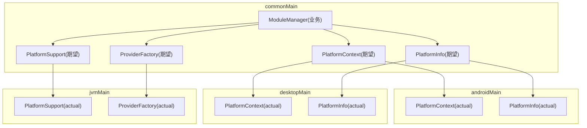
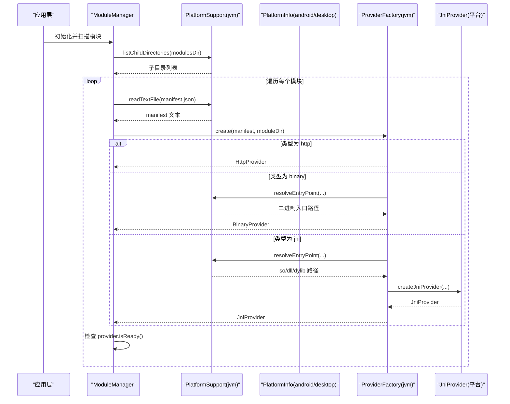
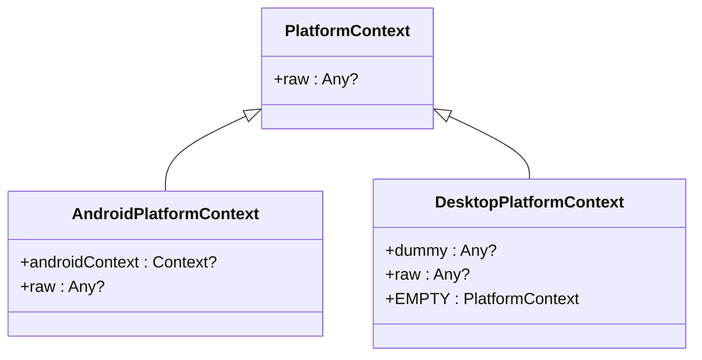
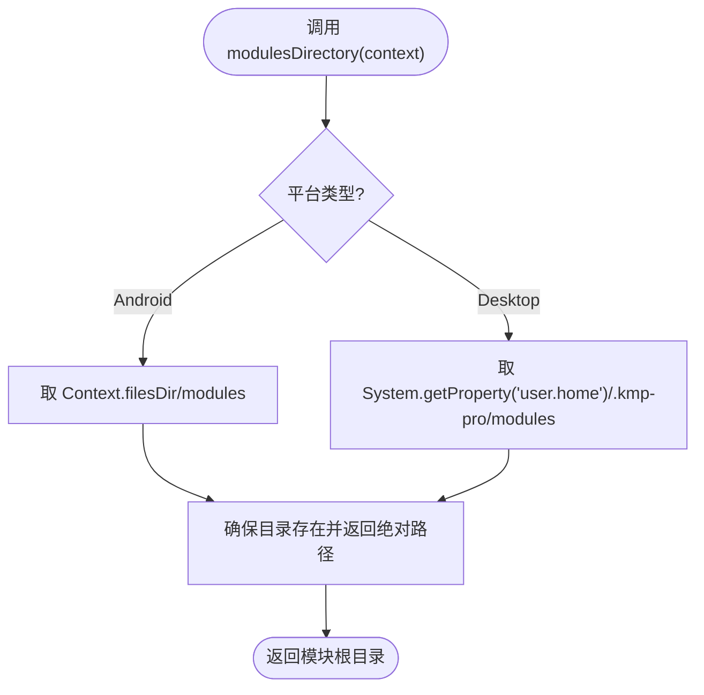
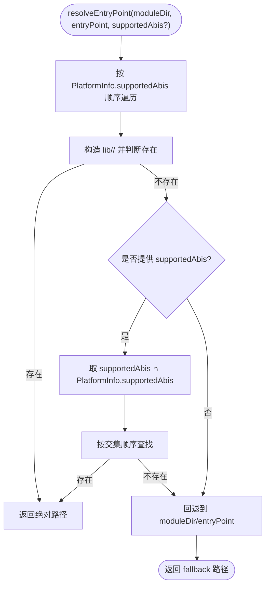
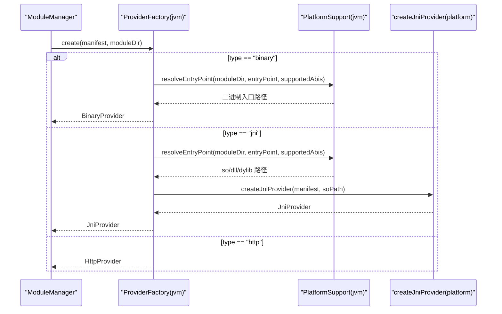
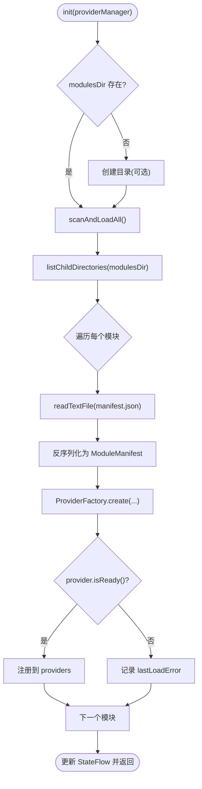
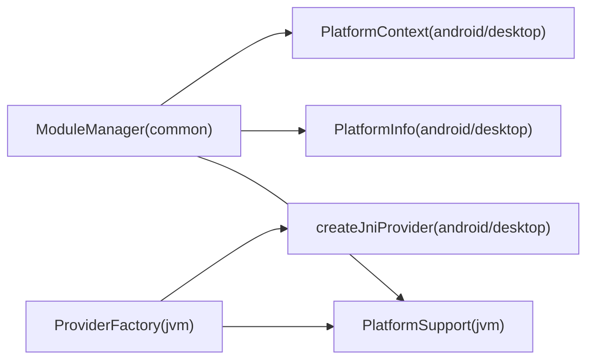

# 平台抽象接口设计

<cite>
**本文引用的文件**
- [PlatformContext.kt](file://kmp-pro/src/commonMain/kotlin/cp/player/kmp/util/PlatformContext.kt)
- [PlatformInfo.kt](file://kmp-pro/src/commonMain/kotlin/cp/player/kmp/util/PlatformInfo.kt)
- [PlatformSupport.kt](file://kmp-pro/src/commonMain/kotlin/cp/player/kmp/util/PlatformSupport.kt)
- [PlatformContext.android.kt](file://kmp-pro/src/androidMain/kotlin/cp/player/kmp/util/PlatformContext.kt)
- [PlatformInfo.android.kt](file://kmp-pro/src/androidMain/kotlin/cp/player/kmp/util/PlatformInfo.kt)
- [PlatformContext.desktop.kt](file://kmp-pro/src/desktopMain/kotlin/cp/player/kmp/util/PlatformContext.kt)
- [PlatformInfo.desktop.kt](file://kmp-pro/src/desktopMain/kotlin/cp/player/kmp/util/PlatformInfo.kt)
- [PlatformSupport.jvm.kt](file://kmp-pro/src/jvmMain/kotlin/cp/player/kmp/util/PlatformSupport.kt)
- [ProviderFactory.common.kt](file://kmp-pro/src/commonMain/kotlin/cp/player/kmp/provider/ProviderFactory.kt)
- [ProviderFactory.jvm.kt](file://kmp-pro/src/jvmMain/kotlin/cp/player/kmp/provider/ProviderFactory.kt)
- [ModuleManager.kt](file://kmp-pro/src/commonMain/kotlin/cp/player/kmp/provider/ModuleManager.kt)
</cite>

## 目录
1. [简介](#简介)
2. [项目结构](#项目结构)
3. [核心组件](#核心组件)
4. [架构总览](#架构总览)
5. [详细组件分析](#详细组件分析)
6. [依赖关系分析](#依赖关系分析)
7. [性能考量](#性能考量)
8. [故障排查指南](#故障排查指南)
9. [结论](#结论)
10. [附录：接口设计规范与最佳实践](#附录接口设计规范与最佳实践)

## 简介
本技术文档聚焦 CPPlayer-KMP 的平台抽象接口设计，系统性阐述 KMP 中 expect/actual 机制的使用模式，以及如何通过抽象接口屏蔽 Android、Desktop（JVM）等平台的差异。重点解析 PlatformContext、PlatformInfo、PlatformSupport 等核心抽象类的设计原则与职责划分，说明如何定义平台无关的 API 接口，确保跨平台代码的一致性与可维护性。同时提供接口设计规范、命名约定与最佳实践，并给出具体使用示例的代码路径指引。

## 项目结构
本项目采用 KMP 多源集组织方式：
- commonMain：声明 expect 抽象接口与平台无关的业务逻辑
- androidMain/desktopMain：分别提供 expect 的具体 actual 实现
- jvmMain：为 JVM 共享的 actual 实现（Android 与 Desktop 共用）

图表来源
- [PlatformContext.kt:1-14](file://kmp-pro/src/commonMain/kotlin/cp/player/kmp/util/PlatformContext.kt#L1-L14)
- [PlatformInfo.kt:1-20](file://kmp-pro/src/commonMain/kotlin/cp/player/kmp/util/PlatformInfo.kt#L1-L20)
- [PlatformSupport.kt:1-59](file://kmp-pro/src/commonMain/kotlin/cp/player/kmp/util/PlatformSupport.kt#L1-L59)
- [PlatformContext.android.kt:1-14](file://kmp-pro/src/androidMain/kotlin/cp/player/kmp/util/PlatformContext.kt#L1-L14)
- [PlatformInfo.android.kt:1-13](file://kmp-pro/src/androidMain/kotlin/cp/player/kmp/util/PlatformInfo.kt#L1-L13)
- [PlatformContext.desktop.kt:1-10](file://kmp-pro/src/desktopMain/kotlin/cp/player/kmp/util/PlatformContext.kt#L1-L10)
- [PlatformInfo.desktop.kt:1-13](file://kmp-pro/src/desktopMain/kotlin/cp/player/kmp/util/PlatformInfo.kt#L1-L13)
- [PlatformSupport.jvm.kt:1-135](file://kmp-pro/src/jvmMain/kotlin/cp/player/kmp/util/PlatformSupport.kt#L1-L135)
- [ProviderFactory.common.kt:1-29](file://kmp-pro/src/commonMain/kotlin/cp/player/kmp/provider/ProviderFactory.kt#L1-L29)
- [ProviderFactory.jvm.kt:1-31](file://kmp-pro/src/jvmMain/kotlin/cp/player/kmp/provider/ProviderFactory.kt#L1-L31)

章节来源
- [PlatformContext.kt:1-14](file://kmp-pro/src/commonMain/kotlin/cp/player/kmp/util/PlatformContext.kt#L1-L14)
- [PlatformInfo.kt:1-20](file://kmp-pro/src/commonMain/kotlin/cp/player/kmp/util/PlatformInfo.kt#L1-L20)
- [PlatformSupport.kt:1-59](file://kmp-pro/src/commonMain/kotlin/cp/player/kmp/util/PlatformSupport.kt#L1-L59)
- [ProviderFactory.common.kt:1-29](file://kmp-pro/src/commonMain/kotlin/cp/player/kmp/provider/ProviderFactory.kt#L1-L29)
- [ModuleManager.kt:1-137](file://kmp-pro/src/commonMain/kotlin/cp/player/kmp/provider/ModuleManager.kt#L1-L137)

## 核心组件
- PlatformContext：不透明的平台上下文包装，用于在需要时访问平台原生对象（如 Android 的 Context）。在 Desktop 上为空占位。
- PlatformInfo：仅暴露 ABI 列表与模块根目录两个平台差异点，屏蔽底层文件系统与系统属性差异。
- PlatformSupport：统一的平台能力抽象，包括端口探测、解压、文件读写、入口解析、ELF 校验、目录操作等。Android 与 Desktop 共享 JVM 实际实现。
- ProviderFactory：根据模块清单创建后端提供者（http/binary/jni），jni 类型通过平台期望函数创建。

章节来源
- [PlatformContext.kt:1-14](file://kmp-pro/src/commonMain/kotlin/cp/player/kmp/util/PlatformContext.kt#L1-L14)
- [PlatformInfo.kt:1-20](file://kmp-pro/src/commonMain/kotlin/cp/player/kmp/util/PlatformInfo.kt#L1-L20)
- [PlatformSupport.kt:1-59](file://kmp-pro/src/commonMain/kotlin/cp/player/kmp/util/PlatformSupport.kt#L1-L59)
- [ProviderFactory.common.kt:1-29](file://kmp-pro/src/commonMain/kotlin/cp/player/kmp/provider/ProviderFactory.kt#L1-L29)

## 架构总览
expect/actual 机制在本项目中的分层如下：
- 公共层（commonMain）：定义抽象接口与跨平台业务编排（如 ModuleManager）
- 平台层（androidMain/desktopMain）：提供 PlatformContext/PlatformInfo 的实际实现
- 共享 JVM 层（jvmMain）：提供 PlatformSupport 的实际实现，以及 ProviderFactory 的统一创建逻辑

图表来源
- [ModuleManager.kt:38-117](file://kmp-pro/src/commonMain/kotlin/cp/player/kmp/provider/ModuleManager.kt#L38-L117)
- [PlatformSupport.jvm.kt:67-82](file://kmp-pro/src/jvmMain/kotlin/cp/player/kmp/util/PlatformSupport.kt#L67-L82)
- [ProviderFactory.jvm.kt:7-30](file://kmp-pro/src/jvmMain/kotlin/cp/player/kmp/provider/ProviderFactory.kt#L7-L30)

## 详细组件分析

### PlatformContext：平台上下文抽象
- 设计目标：以不透明包装屏蔽平台原生上下文差异，仅在必要时暴露 raw 引用或平台特定扩展方法。
- Android 实现：包装 android.content.Context，并提供 toPlatformContext()/androidContext() 便捷转换。
- Desktop 实现：空占位，提供 EMPTY 默认实例，避免引入平台依赖。

图表来源
- [PlatformContext.kt:1-14](file://kmp-pro/src/commonMain/kotlin/cp/player/kmp/util/PlatformContext.kt#L1-L14)
- [PlatformContext.android.kt:1-14](file://kmp-pro/src/androidMain/kotlin/cp/player/kmp/util/PlatformContext.kt#L1-L14)
- [PlatformContext.desktop.kt:1-10](file://kmp-pro/src/desktopMain/kotlin/cp/player/kmp/util/PlatformContext.kt#L1-L10)

章节来源
- [PlatformContext.kt:1-14](file://kmp-pro/src/commonMain/kotlin/cp/player/kmp/util/PlatformContext.kt#L1-L14)
- [PlatformContext.android.kt:1-14](file://kmp-pro/src/androidMain/kotlin/cp/player/kmp/util/PlatformContext.kt#L1-L14)
- [PlatformContext.desktop.kt:1-10](file://kmp-pro/src/desktopMain/kotlin/cp/player/kmp/util/PlatformContext.kt#L1-L10)

### PlatformInfo：平台信息抽象
- 设计目标：仅暴露 ABI 列表与模块根目录两个关键差异点，屏蔽 Build.SUPPORTED_ABIS 与 user.home 等细节。
- Android 实现：supportedAbis 来自 Build.SUPPORTED_ABIS；modulesDirectory 基于 Context.filesDir/modules。
- Desktop 实现：supportedAbis 固定顺序；modulesDirectory 基于 ~/.kmp-pro/modules。

图表来源
- [PlatformInfo.android.kt:1-13](file://kmp-pro/src/androidMain/kotlin/cp/player/kmp/util/PlatformInfo.kt#L1-L13)
- [PlatformInfo.desktop.kt:1-13](file://kmp-pro/src/desktopMain/kotlin/cp/player/kmp/util/PlatformInfo.kt#L1-L13)

章节来源
- [PlatformInfo.kt:1-20](file://kmp-pro/src/commonMain/kotlin/cp/player/kmp/util/PlatformInfo.kt#L1-L20)
- [PlatformInfo.android.kt:1-13](file://kmp-pro/src/androidMain/kotlin/cp/player/kmp/util/PlatformInfo.kt#L1-L13)
- [PlatformInfo.desktop.kt:1-13](file://kmp-pro/src/desktopMain/kotlin/cp/player/kmp/util/PlatformInfo.kt#L1-L13)

### PlatformSupport：平台能力抽象
- 设计目标：将端口探测、解压、文件读写、入口解析、ELF 校验、目录操作等能力统一抽象，Android 与 Desktop 共享 JVM 实际实现。
- 关键能力：
  - 端口探测：ServerSocket 快速尝试
  - 解压：ZipInputStream 安全解压（路径穿越保护）
  - 入口解析：按 supportedAbis 顺序查找 lib/<abi>/<entryPoint>，支持 manifest 显式 ABI 交集优先
  - ELF 校验：读取魔数与 e_machine，匹配当前平台 ABI
  - 目录操作：listChildDirectories、moveDir、deleteRecursively

图表来源
- [PlatformSupport.jvm.kt:67-82](file://kmp-pro/src/jvmMain/kotlin/cp/player/kmp/util/PlatformSupport.kt#L67-L82)

章节来源
- [PlatformSupport.kt:1-59](file://kmp-pro/src/commonMain/kotlin/cp/player/kmp/util/PlatformSupport.kt#L1-L59)
- [PlatformSupport.jvm.kt:1-135](file://kmp-pro/src/jvmMain/kotlin/cp/player/kmp/util/PlatformSupport.kt#L1-L135)

### ProviderFactory：模块提供者工厂
- 设计目标：根据模块清单类型创建对应 Provider（http/binary/jni），jni 类型通过平台期望函数创建。
- 流程：
  - http：直接构造 HttpProvider
  - binary：通过 PlatformSupport.resolveEntryPoint 定位二进制入口
  - jni：通过 PlatformSupport.resolveEntryPoint 定位 so/dll/dylib，再调用 createJniProvider

图表来源
- [ProviderFactory.jvm.kt:7-30](file://kmp-pro/src/jvmMain/kotlin/cp/player/kmp/provider/ProviderFactory.kt#L7-L30)
- [PlatformSupport.jvm.kt:67-82](file://kmp-pro/src/jvmMain/kotlin/cp/player/kmp/util/PlatformSupport.kt#L67-L82)
- [ProviderFactory.common.kt:1-29](file://kmp-pro/src/commonMain/kotlin/cp/player/kmp/provider/ProviderFactory.kt#L1-L29)

章节来源
- [ProviderFactory.common.kt:1-29](file://kmp-pro/src/commonMain/kotlin/cp/player/kmp/provider/ProviderFactory.kt#L1-L29)
- [ProviderFactory.jvm.kt:1-31](file://kmp-pro/src/jvmMain/kotlin/cp/player/kmp/provider/ProviderFactory.kt#L1-L31)

### ModuleManager：模块管理器（跨平台编排）
- 职责：扫描 modulesDir，加载/导入/更新/删除 BackendProvider 模块，恢复上次活跃 Provider。
- 关键点：
  - 使用 PlatformSupport 进行文件与目录操作
  - 使用 PlatformInfo.modulesDirectory 获取模块根目录
  - 使用 PlatformContext 传递平台上下文（Android 场景）
  - 错误信息收集与 UI 展示（lastLoadError）

图表来源
- [ModuleManager.kt:38-117](file://kmp-pro/src/commonMain/kotlin/cp/player/kmp/provider/ModuleManager.kt#L38-L117)

章节来源
- [ModuleManager.kt:1-137](file://kmp-pro/src/commonMain/kotlin/cp/player/kmp/provider/ModuleManager.kt#L1-L137)

## 依赖关系分析
- commonMain 对 platform 抽象的依赖：
  - ModuleManager 依赖 PlatformSupport、PlatformInfo、PlatformContext
  - ProviderFactory 依赖 PlatformSupport（入口解析）与平台 createJniProvider
- jvmMain 共享实现：
  - PlatformSupport 提供所有平台共享能力
  - ProviderFactory 统一创建逻辑
- 平台差异：
  - PlatformContext/PlatformInfo 在 androidMain/desktopMain 分别实现

图表来源
- [ModuleManager.kt:1-137](file://kmp-pro/src/commonMain/kotlin/cp/player/kmp/provider/ModuleManager.kt#L1-L137)
- [PlatformSupport.jvm.kt:1-135](file://kmp-pro/src/jvmMain/kotlin/cp/player/kmp/util/PlatformSupport.kt#L1-L135)
- [ProviderFactory.common.kt:1-29](file://kmp-pro/src/commonMain/kotlin/cp/player/kmp/provider/ProviderFactory.kt#L1-L29)
- [ProviderFactory.jvm.kt:1-31](file://kmp-pro/src/jvmMain/kotlin/cp/player/kmp/provider/ProviderFactory.kt#L1-L31)

章节来源
- [ModuleManager.kt:1-137](file://kmp-pro/src/commonMain/kotlin/cp/player/kmp/provider/ModuleManager.kt#L1-L137)
- [PlatformSupport.jvm.kt:1-135](file://kmp-pro/src/jvmMain/kotlin/cp/player/kmp/util/PlatformSupport.kt#L1-L135)
- [ProviderFactory.common.kt:1-29](file://kmp-pro/src/commonMain/kotlin/cp/player/kmp/provider/ProviderFactory.kt#L1-L29)
- [ProviderFactory.jvm.kt:1-31](file://kmp-pro/src/jvmMain/kotlin/cp/player/kmp/provider/ProviderFactory.kt#L1-L31)

## 性能考量
- 端口探测：使用 ServerSocket 快速尝试，避免长时间阻塞；findAvailablePort 支持最大尝试次数限制。
- 解压：ZipInputStream 流式处理，避免一次性加载大文件；包含路径穿越保护，防止恶意条目。
- 入口解析：按 ABI 优先级顺序查找，减少不必要的 I/O；支持 manifest 显式 ABI 交集优先，提高匹配效率。
- ELF 校验：仅读取必要头部字节，异常情况下不阻止加载，保证健壮性。
- 目录操作：listChildDirectories 过滤目录项，避免文件枚举开销。

[本节为通用性能讨论，无需引用具体文件]

## 故障排查指南
- 模块导入失败：
  - 检查解压是否成功（unzipTo 返回 false）
  - 检查 manifest.json 是否存在且可读
  - 检查目标目录移动是否成功（moveDir）
- Provider 未就绪：
  - 对于 jni/binary：确认入口文件存在且与当前平台 ABI 匹配（validateElfHeader）
  - 查看 lastLoadError 获取具体原因
- 端口占用：
  - isPortAvailable 返回 false 时，尝试 findAvailablePort 自动选择可用端口

章节来源
- [ModuleManager.kt:57-117](file://kmp-pro/src/commonMain/kotlin/cp/player/kmp/provider/ModuleManager.kt#L57-L117)
- [PlatformSupport.jvm.kt:35-59](file://kmp-pro/src/jvmMain/kotlin/cp/player/kmp/util/PlatformSupport.kt#L35-L59)
- [PlatformSupport.jvm.kt:89-121](file://kmp-pro/src/jvmMain/kotlin/cp/player/kmp/util/PlatformSupport.kt#L89-L121)

## 结论
通过 expect/actual 机制，CPPlayer-KMP 在 commonMain 中定义了清晰的平台抽象接口，并在各平台源集中提供具体实现。PlatformContext、PlatformInfo、PlatformSupport 三者职责明确、边界清晰，有效屏蔽了 Android 与 Desktop 的差异。ProviderFactory 与 ModuleManager 在此基础上实现了模块化的后端提供者管理与编排，确保了跨平台一致性与可维护性。遵循本文档的接口设计规范与最佳实践，可进一步降低新增平台接入成本，提升整体工程质量。

[本节为总结性内容，无需引用具体文件]

## 附录：接口设计规范与最佳实践
- 接口设计规范
  - 在 commonMain 中只声明 expect 接口与平台无关的业务逻辑
  - actual 实现尽量保持签名一致，避免破坏契约
  - 对平台特有能力，优先通过扩展函数或工具方法封装，而非直接暴露原生类型
- 命名约定
  - 抽象类/对象使用 PlatformXxx 前缀（如 PlatformContext、PlatformInfo、PlatformSupport）
  - 平台差异方法使用动词短语（如 modulesDirectory、resolveEntryPoint、validateElfHeader）
  - 工厂类使用 XxxFactory（如 ProviderFactory）
- 最佳实践
  - 使用不透明包装（如 PlatformContext.raw）避免泄漏平台类型
  - 对文件与网络操作增加健壮的错误处理与日志提示（如 lastLoadError）
  - 入口解析与 ABI 匹配策略应可配置（支持 manifest 显式 ABI 列表）
  - 对敏感操作（解压、ELF 校验）加入安全检查（路径穿越、魔数校验）
- 使用示例（代码路径指引）
  - 获取模块根目录：参考 [PlatformInfo.modulesDirectory:1-20](file://kmp-pro/src/commonMain/kotlin/cp/player/kmp/util/PlatformInfo.kt#L1-L20) 在各平台 actual 中的实现
  - 解析模块入口：参考 [PlatformSupport.resolveEntryPoint:67-82](file://kmp-pro/src/jvmMain/kotlin/cp/player/kmp/util/PlatformSupport.kt#L67-L82)
  - 创建 JNI Provider：参考 [ProviderFactory.create:7-30](file://kmp-pro/src/jvmMain/kotlin/cp/player/kmp/provider/ProviderFactory.kt#L7-L30) 与 [createJniProvider:22-29](file://kmp-pro/src/commonMain/kotlin/cp/player/kmp/provider/ProviderFactory.kt#L22-L29)
  - 模块导入流程：参考 [ModuleManager.importModule:57-86](file://kmp-pro/src/commonMain/kotlin/cp/player/kmp/provider/ModuleManager.kt#L57-L86)

章节来源
- [PlatformInfo.kt:1-20](file://kmp-pro/src/commonMain/kotlin/cp/player/kmp/util/PlatformInfo.kt#L1-L20)
- [PlatformSupport.jvm.kt:67-82](file://kmp-pro/src/jvmMain/kotlin/cp/player/kmp/util/PlatformSupport.kt#L67-L82)
- [ProviderFactory.common.kt:1-29](file://kmp-pro/src/commonMain/kotlin/cp/player/kmp/provider/ProviderFactory.kt#L1-L29)
- [ProviderFactory.jvm.kt:1-31](file://kmp-pro/src/jvmMain/kotlin/cp/player/kmp/provider/ProviderFactory.kt#L1-L31)
- [ModuleManager.kt:57-86](file://kmp-pro/src/commonMain/kotlin/cp/player/kmp/provider/ModuleManager.kt#L57-L86)