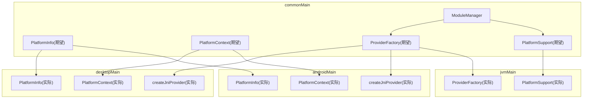
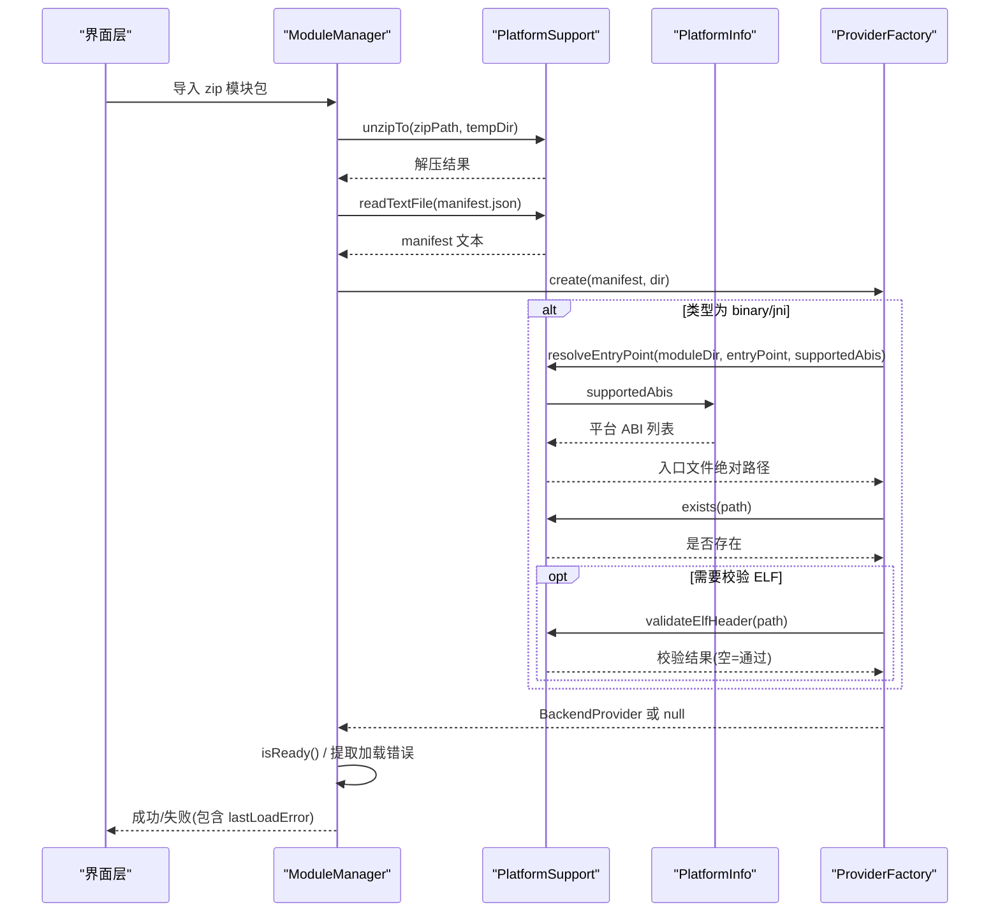
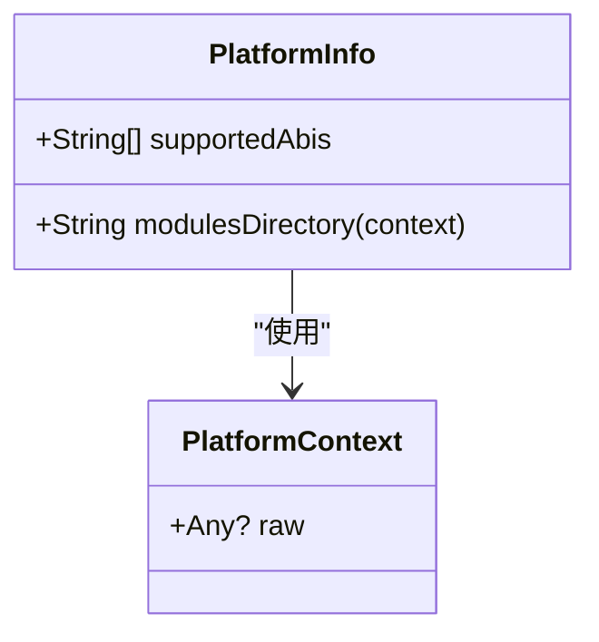
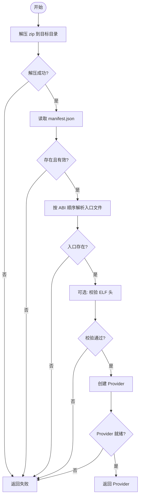
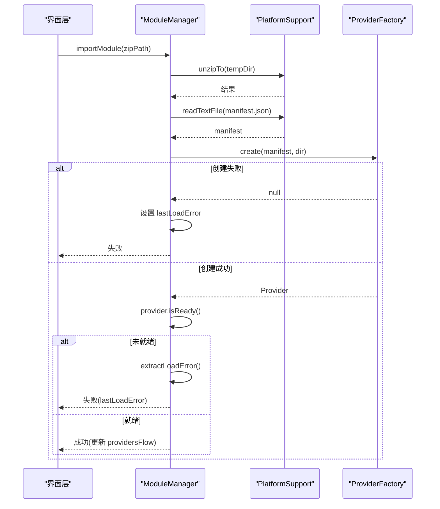
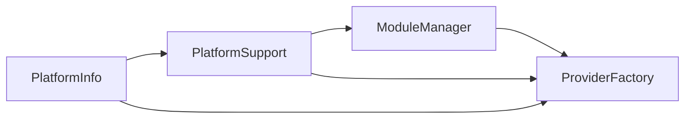

# 平台检测与兼容性处理

<cite>
**本文引用的文件**
- [kmp-pro/src/commonMain/kotlin/cp/player/kmp/util/PlatformInfo.kt](file://kmp-pro/src/commonMain/kotlin/cp/player/kmp/util/PlatformInfo.kt)
- [kmp-pro/src/androidMain/kotlin/cp/player/kmp/util/PlatformInfo.kt](file://kmp-pro/src/androidMain/kotlin/cp/player/kmp/util/PlatformInfo.kt)
- [kmp-pro/src/desktopMain/kotlin/cp/player/kmp/util/PlatformInfo.kt](file://kmp-pro/src/desktopMain/kotlin/cp/player/kmp/util/PlatformInfo.kt)
- [kmp-pro/src/commonMain/kotlin/cp/player/kmp/util/PlatformContext.kt](file://kmp-pro/src/commonMain/kotlin/cp/player/kmp/util/PlatformContext.kt)
- [kmp-pro/src/androidMain/kotlin/cp/player/kmp/util/PlatformContext.kt](file://kmp-pro/src/androidMain/kotlin/cp/player/kmp/util/PlatformContext.kt)
- [kmp-pro/src/desktopMain/kotlin/cp/player/kmp/util/PlatformContext.kt](file://kmp-pro/src/desktopMain/kotlin/cp/player/kmp/util/PlatformContext.kt)
- [kmp-pro/src/commonMain/kotlin/cp/player/kmp/util/PlatformSupport.kt](file://kmp-pro/src/commonMain/kotlin/cp/player/kmp/util/PlatformSupport.kt)
- [kmp-pro/src/jvmMain/kotlin/cp/player/kmp/util/PlatformSupport.kt](file://kmp-pro/src/jvmMain/kotlin/cp/player/kmp/util/PlatformSupport.kt)
- [kmp-pro/src/commonMain/kotlin/cp/player/kmp/provider/ModuleManager.kt](file://kmp-pro/src/commonMain/kotlin/cp/player/kmp/provider/ModuleManager.kt)
- [kmp-pro/src/jvmMain/kotlin/cp/player/kmp/provider/ProviderFactory.kt](file://kmp-pro/src/jvmMain/kotlin/cp/player/kmp/provider/ProviderFactory.kt)
- [kmp-pro/src/androidMain/kotlin/cp/player/kmp/provider/ProviderFactory.kt](file://kmp-pro/src/androidMain/kotlin/cp/player/kmp/provider/ProviderFactory.kt)
- [kmp-pro/src/desktopMain/kotlin/cp/player/kmp/provider/ProviderFactory.kt](file://kmp-pro/src/desktopMain/kotlin/cp/player/kmp/provider/ProviderFactory.kt)
- [app/src/commonMain/kotlin/cp/player/app/platform/PlatformActions.kt](file://app/src/commonMain/kotlin/cp/player/app/platform/PlatformActions.kt)
- [app/src/androidMain/kotlin/cp/player/app/platform/PlatformActions.android.kt](file://app/src/androidMain/kotlin/cp/player/app/platform/PlatformActions.android.kt)
- [app/src/desktopMain/kotlin/cp/player/app/platform/PlatformActions.desktop.kt](file://app/src/desktopMain/kotlin/cp/player/app/platform/PlatformActions.desktop.kt)
</cite>

## 目录
1. [简介](#简介)
2. [项目结构](#项目结构)
3. [核心组件](#核心组件)
4. [架构总览](#架构总览)
5. [详细组件分析](#详细组件分析)
6. [依赖关系分析](#依赖关系分析)
7. [性能考量](#性能考量)
8. [故障排查指南](#故障排查指南)
9. [结论](#结论)
10. [附录：业务侧使用示例](#附录业务侧使用示例)

## 简介
本技术文档聚焦 CPPlayer-KMP 的平台检测与兼容性处理，说明如何在跨平台（Android、Desktop/JVM）环境下获取设备信息、系统版本与功能特性，并基于此实现模块加载、入口解析、ELF 校验与降级策略。重点解释 PlatformInfo 如何封装平台特定信息（ABI 列表、模块目录），PlatformSupport 如何实现端口探测、文件系统操作、入口解析与 ELF 校验等能力，以及 ModuleManager 与 ProviderFactory 如何协同完成模块的导入、发现、加载与可用性判断。同时给出最佳实践、性能优化建议与常见差异处理方式，并提供在业务逻辑中进行平台检测与条件分支的完整示例路径。

## 项目结构
本项目采用 Kotlin Multiplatform 的分层组织方式：
- commonMain：声明 expect 抽象与共享逻辑（如 PlatformInfo、PlatformContext、PlatformSupport 接口定义，以及模块管理流程）。
- androidMain/desktopMain：提供具体平台的 actual 实现（如 ABI 列表、模块目录、上下文包装）。
- jvmMain：为 Android 与 Desktop 共享的 JVM 实现（如端口探测、解压、文件读写、入口解析、ELF 校验）。
- app：UI 与平台相关能力的 expect/actual 封装（如打开 URL、保存二维码到相册、返回键处理等）。

图表来源
- [kmp-pro/src/commonMain/kotlin/cp/player/kmp/util/PlatformInfo.kt:1-20](file://kmp-pro/src/commonMain/kotlin/cp/player/kmp/util/PlatformInfo.kt#L1-L20)
- [kmp-pro/src/commonMain/kotlin/cp/player/kmp/util/PlatformContext.kt:1-14](file://kmp-pro/src/commonMain/kotlin/cp/player/kmp/util/PlatformContext.kt#L1-L14)
- [kmp-pro/src/commonMain/kotlin/cp/player/kmp/util/PlatformSupport.kt:1-59](file://kmp-pro/src/commonMain/kotlin/cp/player/kmp/util/PlatformSupport.kt#L1-L59)
- [kmp-pro/src/jvmMain/kotlin/cp/player/kmp/util/PlatformSupport.kt:1-135](file://kmp-pro/src/jvmMain/kotlin/cp/player/kmp/util/PlatformSupport.kt#L1-L135)
- [kmp-pro/src/commonMain/kotlin/cp/player/kmp/provider/ModuleManager.kt:1-137](file://kmp-pro/src/commonMain/kotlin/cp/player/kmp/provider/ModuleManager.kt#L1-L137)
- [kmp-pro/src/jvmMain/kotlin/cp/player/kmp/provider/ProviderFactory.kt:1-31](file://kmp-pro/src/jvmMain/kotlin/cp/player/kmp/provider/ProviderFactory.kt#L1-L31)
- [kmp-pro/src/androidMain/kotlin/cp/player/kmp/provider/ProviderFactory.kt:1-13](file://kmp-pro/src/androidMain/kotlin/cp/player/kmp/provider/ProviderFactory.kt#L1-L13)
- [kmp-pro/src/desktopMain/kotlin/cp/player/kmp/provider/ProviderFactory.kt:1-13](file://kmp-pro/src/desktopMain/kotlin/cp/player/kmp/provider/ProviderFactory.kt#L1-L13)

章节来源
- [kmp-pro/src/commonMain/kotlin/cp/player/kmp/util/PlatformInfo.kt:1-20](file://kmp-pro/src/commonMain/kotlin/cp/player/kmp/util/PlatformInfo.kt#L1-L20)
- [kmp-pro/src/commonMain/kotlin/cp/player/kmp/util/PlatformSupport.kt:1-59](file://kmp-pro/src/commonMain/kotlin/cp/player/kmp/util/PlatformSupport.kt#L1-L59)
- [kmp-pro/src/commonMain/kotlin/cp/player/kmp/provider/ModuleManager.kt:1-137](file://kmp-pro/src/commonMain/kotlin/cp/player/kmp/provider/ModuleManager.kt#L1-L137)

## 核心组件
- PlatformInfo：封装平台特定的 ABI 列表与模块根目录。Android 通过 Build.SUPPORTED_ABIS 获取；Desktop 固定 x86_64/amd64/x86。模块目录在 Android 位于应用 filesDir/modules，在 Desktop 位于用户主目录下的 .kmp-pro/modules。
- PlatformContext：平台上下文抽象。Android 包装 android.content.Context；Desktop 为空占位，提供 EMPTY 默认实例。
- PlatformSupport：跨平台能力集合，包括端口探测、可用端口查找、模块目录、zip 解压（含路径穿越保护）、递归删除、文本读取、存在性检查、入口解析、ELF 头校验、子目录列举与目录移动。
- ModuleManager：扫描 modules 目录，导入 zip 模块包，解析 manifest.json，创建 Provider，恢复或选择活跃 Provider，并暴露可用 Provider 列表与错误信息。
- ProviderFactory：根据 manifest.type 创建 http/binary/jni 提供者；对 binary/jni 类型调用 PlatformSupport.resolveEntryPoint 按 ABI 顺序定位入口文件，并在 Android/Desktop 分别实现 createJniProvider。

章节来源
- [kmp-pro/src/commonMain/kotlin/cp/player/kmp/util/PlatformInfo.kt:1-20](file://kmp-pro/src/commonMain/kotlin/cp/player/kmp/util/PlatformInfo.kt#L1-L20)
- [kmp-pro/src/androidMain/kotlin/cp/player/kmp/util/PlatformInfo.kt:1-13](file://kmp-pro/src/androidMain/kotlin/cp/player/kmp/util/PlatformInfo.kt#L1-L13)
- [kmp-pro/src/desktopMain/kotlin/cp/player/kmp/util/PlatformInfo.kt:1-13](file://kmp-pro/src/desktopMain/kotlin/cp/player/kmp/util/PlatformInfo.kt#L1-L13)
- [kmp-pro/src/commonMain/kotlin/cp/player/kmp/util/PlatformContext.kt:1-14](file://kmp-pro/src/commonMain/kotlin/cp/player/kmp/util/PlatformContext.kt#L1-L14)
- [kmp-pro/src/androidMain/kotlin/cp/player/kmp/util/PlatformContext.kt:1-14](file://kmp-pro/src/androidMain/kotlin/cp/player/kmp/util/PlatformContext.kt#L1-L14)
- [kmp-pro/src/desktopMain/kotlin/cp/player/kmp/util/PlatformContext.kt:1-10](file://kmp-pro/src/desktopMain/kotlin/cp/player/kmp/util/PlatformContext.kt#L1-L10)
- [kmp-pro/src/commonMain/kotlin/cp/player/kmp/util/PlatformSupport.kt:1-59](file://kmp-pro/src/commonMain/kotlin/cp/player/kmp/util/PlatformSupport.kt#L1-L59)
- [kmp-pro/src/jvmMain/kotlin/cp/player/kmp/util/PlatformSupport.kt:1-135](file://k-pro/src/jvmMain/kotlin/cp/player/kmp/util/PlatformSupport.kt#L1-L135)
- [kmp-pro/src/commonMain/kotlin/cp/player/kmp/provider/ModuleManager.kt:1-137](file://kmp-pro/src/commonMain/kotlin/cp/player/kmp/provider/ModuleManager.kt#L1-L137)
- [kmp-pro/src/jvmMain/kotlin/cp/player/kmp/provider/ProviderFactory.kt:1-31](file://kmp-pro/src/jvmMain/kotlin/cp/player/kmp/provider/ProviderFactory.kt#L1-L31)
- [kmp-pro/src/androidMain/kotlin/cp/player/kmp/provider/ProviderFactory.kt:1-13](file://kmp-pro/src/androidMain/kotlin/cp/player/kmp/provider/ProviderFactory.kt#L1-L13)
- [kmp-pro/src/desktopMain/kotlin/cp/player/kmp/provider/ProviderFactory.kt:1-13](file://kmp-pro/src/desktopMain/kotlin/cp/player/kmp/provider/ProviderFactory.kt#L1-L13)

## 架构总览
下图展示了从 UI 触发模块导入到最终 Provider 可用的关键流程，涵盖平台检测、ABI 匹配、ELF 校验与降级策略。

图表来源
- [kmp-pro/src/commonMain/kotlin/cp/player/kmp/provider/ModuleManager.kt:56-117](file://kmp-pro/src/commonMain/kotlin/cp/player/kmp/provider/ModuleManager.kt#L56-L117)
- [kmp-pro/src/jvmMain/kotlin/cp/player/kmp/util/PlatformSupport.kt:35-82](file://kmp-pro/src/jvmMain/kotlin/cp/player/kmp/util/PlatformSupport.kt#L35-L82)
- [kmp-pro/src/jvmMain/kotlin/cp/player/kmp/util/PlatformSupport.kt:89-121](file://kmp-pro/src/jvmMain/kotlin/cp/player/kmp/util/PlatformSupport.kt#L89-L121)
- [kmp-pro/src/jvmMain/kotlin/cp/player/kmp/provider/ProviderFactory.kt:7-31](file://kmp-pro/src/jvmMain/kotlin/cp/player/kmp/provider/ProviderFactory.kt#L7-L31)
- [kmp-pro/src/commonMain/kotlin/cp/player/kmp/util/PlatformInfo.kt:11-19](file://kmp-pro/src/commonMain/kotlin/cp/player/kmp/util/PlatformInfo.kt#L11-L19)

## 详细组件分析

### PlatformInfo：平台信息与 ABI 列表
- 职责：提供当前平台支持的 ABI 列表与模块根目录路径。
- Android：supportedAbis 来自 Build.SUPPORTED_ABIS；modulesDirectory 使用 Context.filesDir/modules 并确保目录存在。
- Desktop：supportedAbis 固定为 ["x86_64","amd64","x86"]；modulesDirectory 使用 System.getProperty("user.home")/.kmp-pro/modules。
- 设计要点：仅暴露最小必要差异点，便于上层统一处理模块加载与入口解析。

图表来源
- [kmp-pro/src/commonMain/kotlin/cp/player/kmp/util/PlatformInfo.kt:11-19](file://kmp-pro/src/commonMain/kotlin/cp/player/kmp/util/PlatformInfo.kt#L11-L19)
- [kmp-pro/src/androidMain/kotlin/cp/player/kmp/util/PlatformInfo.kt:6-12](file://kmp-pro/src/androidMain/kotlin/cp/player/kmp/util/PlatformInfo.kt#L6-L12)
- [kmp-pro/src/desktopMain/kotlin/cp/player/kmp/util/PlatformInfo.kt:5-12](file://kmp-pro/src/desktopMain/kotlin/cp/player/kmp/util/PlatformInfo.kt#L5-L12)
- [kmp-pro/src/commonMain/kotlin/cp/player/kmp/util/PlatformContext.kt:11-13](file://kmp-pro/src/commonMain/kotlin/cp/player/kmp/util/PlatformContext.kt#L11-L13)

章节来源
- [kmp-pro/src/commonMain/kotlin/cp/player/kmp/util/PlatformInfo.kt:1-20](file://kmp-pro/src/commonMain/kotlin/cp/player/kmp/util/PlatformInfo.kt#L1-L20)
- [kmp-pro/src/androidMain/kotlin/cp/player/kmp/util/PlatformInfo.kt:1-13](file://kmp-pro/src/androidMain/kotlin/cp/player/kmp/util/PlatformInfo.kt#L1-L13)
- [kmp-pro/src/desktopMain/kotlin/cp/player/kmp/util/PlatformInfo.kt:1-13](file://kmp-pro/src/desktopMain/kotlin/cp/player/kmp/util/PlatformInfo.kt#L1-L13)

### PlatformContext：平台上下文包装
- Android：包装 android.content.Context，提供 toPlatformContext() 与 androidContext() 辅助方法。
- Desktop：空占位类，提供 EMPTY 默认实例，raw 为 null。
- 用途：在需要平台原生对象时（如 Android 的文件目录）安全地传递上下文。

章节来源
- [kmp-pro/src/commonMain/kotlin/cp/player/kmp/util/PlatformContext.kt:1-14](file://kmp-pro/src/commonMain/kotlin/cp/player/kmp/util/PlatformContext.kt#L1-L14)
- [kmp-pro/src/androidMain/kotlin/cp/player/kmp/util/PlatformContext.kt:1-14](file://kmp-pro/src/androidMain/kotlin/cp/player/kmp/util/PlatformContext.kt#L1-L14)
- [kmp-pro/src/desktopMain/kotlin/cp/player/kmp/util/PlatformContext.kt:1-10](file://kmp-pro/src/desktopMain/kotlin/cp/player/kmp/util/PlatformContext.kt#L1-L10)

### PlatformSupport：跨平台能力与兼容性检查
- 端口探测：isPortAvailable 使用 ServerSocket 尝试绑定；findAvailablePort 从起始端口递增尝试最多 maxAttempts 次。
- 文件系统：unzipTo 带路径穿越保护；deleteRecursively、readTextFile、exists、listChildDirectories、moveDir。
- 入口解析：resolveEntryPoint 按 PlatformInfo.supportedAbis 顺序查找 lib/$abi/$entryPoint；若 manifest 显式声明 supportedAbis，则取交集优先匹配；最后回退到根目录 entryPoint。
- ELF 校验：validateElfHeader 读取魔数与 e_machine，与当前平台 ABI 映射的机器码比较；非标准 ELF 或异常不阻止加载。
- 时间戳：currentTimeMillis 直接委托 System.currentTimeMillis()，避免 kotlinx-datetime 运行时缺失问题。

图表来源
- [kmp-pro/src/jvmMain/kotlin/cp/player/kmp/util/PlatformSupport.kt:35-82](file://kmp-pro/src/jvmMain/kotlin/cp/player/kmp/util/PlatformSupport.kt#L35-L82)
- [kmp-pro/src/jvmMain/kotlin/cp/player/kmp/util/PlatformSupport.kt:89-121](file://kmp-pro/src/jvmMain/kotlin/cp/player/kmp/util/PlatformSupport.kt#L89-L121)
- [kmp-pro/src/commonMain/kotlin/cp/player/kmp/provider/ModuleManager.kt:56-117](file://kmp-pro/src/commonMain/kotlin/cp/player/kmp/provider/ModuleManager.kt#L56-L117)

章节来源
- [kmp-pro/src/commonMain/kotlin/cp/player/kmp/util/PlatformSupport.kt:1-59](file://kmp-pro/src/commonMain/kotlin/cp/player/kmp/util/PlatformSupport.kt#L1-L59)
- [kmp-pro/src/jvmMain/kotlin/cp/player/kmp/util/PlatformSupport.kt:1-135](file://kmp-pro/src/jvmMain/kotlin/cp/player/kmp/util/PlatformSupport.kt#L1-L135)

### ModuleManager：模块管理与降级策略
- 初始化：扫描 modulesDir 子目录，加载所有模块，恢复上次 Provider 或自动选择首个可用 Provider。
- 导入流程：解压 zip 到临时目录，校验 manifest.json，移动到目标目录，加载并更新状态流；失败时记录 lastLoadError。
- 加载流程：读取 manifest，创建 Provider；若 provider 为 null，根据类型提示“缺少 native 库”或“二进制入口不存在”；若 provider.isReady() 失败，提取 getLoadError 作为详情。
- 降级策略：当某 ABI 不匹配或缺失时，回退到根目录入口；当 JNI 不可用时，可考虑切换至 HTTP 或二进制模式（由 manifest 与 ProviderFactory 决定）。

图表来源
- [kmp-pro/src/commonMain/kotlin/cp/player/kmp/provider/ModuleManager.kt:56-117](file://kmp-pro/src/commonMain/kotlin/cp/player/kmp/provider/ModuleManager.kt#L56-L117)
- [kmp-pro/src/jvmMain/kotlin/cp/player/kmp/provider/ProviderFactory.kt:7-31](file://kmp-pro/src/jvmMain/kotlin/cp/player/kmp/provider/ProviderFactory.kt#L7-L31)

章节来源
- [kmp-pro/src/commonMain/kotlin/cp/player/kmp/provider/ModuleManager.kt:1-137](file://kmp-pro/src/commonMain/kotlin/cp/player/kmp/provider/ModuleManager.kt#L1-L137)

### ProviderFactory：按类型创建后端提供者
- http：直接使用 baseUrl 与 apiMap。
- binary：通过 PlatformSupport.resolveEntryPoint 定位二进制入口，存在则创建 BinaryProvider。
- jni：通过 PlatformSupport.resolveEntryPoint 定位 so 文件，再调用 createJniProvider（Android/Desktop 各自实现）。
- 平台差异：Android 与 Desktop 的 createJniProvider 均返回 JniProvider，但运行环境与可用性不同（README 指出 JNI 仅在 Android 可用）。

章节来源
- [kmp-pro/src/jvmMain/kotlin/cp/player/kmp/provider/ProviderFactory.kt:1-31](file://kmp-pro/src/jvmMain/kotlin/cp/player/kmp/provider/ProviderFactory.kt#L1-L31)
- [kmp-pro/src/androidMain/kotlin/cp/player/kmp/provider/ProviderFactory.kt:1-13](file://kmp-pro/src/androidMain/kotlin/cp/player/kmp/provider/ProviderFactory.kt#L1-L13)
- [kmp-pro/src/desktopMain/kotlin/cp/player/kmp/provider/ProviderFactory.kt:1-13](file://kmp-pro/src/desktopMain/kotlin/cp/player/kmp/provider/ProviderFactory.kt#L1-L13)

### 平台行为差异与 UI 能力封装
- 平台动作：openUrl、saveQrCodeToGallery、isPackageInstalled、clearImageCache、BackHandler 等在 Android 有具体实现，在 Desktop 为空操作或有限支持。
- 典型差异：
  - Android：可使用 MediaStore 保存图片到相册，使用 PackageManager 打开目标 App。
  - Desktop：openUrl 通过 Desktop.browse；其他能力可能为空或返回 false。

章节来源
- [app/src/commonMain/kotlin/cp/player/app/platform/PlatformActions.kt:1-53](file://app/src/commonMain/kotlin/cp/player/app/platform/PlatformActions.kt#L1-L53)
- [app/src/androidMain/kotlin/cp/player/app/platform/PlatformActions.android.kt:19-119](file://app/src/androidMain/kotlin/cp/player/app/platform/PlatformActions.android.kt#L19-L119)
- [app/src/desktopMain/kotlin/cp/player/app/platform/PlatformActions.desktop.kt:7-26](file://app/src/desktopMain/kotlin/cp/player/app/platform/PlatformActions.desktop.kt#L7-L26)

## 依赖关系分析
- PlatformInfo 被 PlatformSupport.modulesDir 间接使用（通过 PlatformInfo.modulesDirectory）。
- PlatformSupport 被 ModuleManager 用于解压、读取 manifest、列出目录、移动目录等。
- ProviderFactory 依赖 PlatformSupport.resolveEntryPoint 与 exists，并在 Android/Desktop 分别实现 createJniProvider。
- ModuleManager 依赖 ProviderFactory 与 PlatformSupport，并通过 StateFlow 暴露可用 Provider 列表。

图表来源
- [kmp-pro/src/commonMain/kotlin/cp/player/kmp/util/PlatformInfo.kt:11-19](file://kmp-pro/src/commonMain/kotlin/cp/player/kmp/util/PlatformInfo.kt#L11-L19)
- [kmp-pro/src/jvmMain/kotlin/cp/player/kmp/util/PlatformSupport.kt:33-82](file://kmp-pro/src/jvmMain/kotlin/cp/player/kmp/util/PlatformSupport.kt#L33-L82)
- [kmp-pro/src/commonMain/kotlin/cp/player/kmp/provider/ModuleManager.kt:50-117](file://kmp-pro/src/commonMain/kotlin/cp/player/kmp/provider/ModuleManager.kt#L50-L117)
- [kmp-pro/src/jvmMain/kotlin/cp/player/kmp/provider/ProviderFactory.kt:7-31](file://kmp-pro/src/jvmMain/kotlin/cp/player/kmp/provider/ProviderFactory.kt#L7-L31)

章节来源
- [kmp-pro/src/commonMain/kotlin/cp/player/kmp/util/PlatformInfo.kt:1-20](file://kmp-pro/src/commonMain/kotlin/cp/player/kmp/util/PlatformInfo.kt#L1-L20)
- [kmp-pro/src/jvmMain/kotlin/cp/player/kmp/util/PlatformSupport.kt:1-135](file://kmp-pro/src/jvmMain/kotlin/cp/player/kmp/util/PlatformSupport.kt#L1-L135)
- [kmp-pro/src/commonMain/kotlin/cp/player/kmp/provider/ModuleManager.kt:1-137](file://kmp-pro/src/commonMain/kotlin/cp/player/kmp/provider/ModuleManager.kt#L1-L137)
- [kmp-pro/src/jvmMain/kotlin/cp/player/kmp/provider/ProviderFactory.kt:1-31](file://kmp-pro/src/jvmMain/kotlin/cp/player/kmp/provider/ProviderFactory.kt#L1-L31)

## 性能考量
- 端口探测：ServerSocket 绑定开销较小，但应避免频繁轮询；建议在启动阶段缓存可用端口或使用 findAvailablePort 一次性查找。
- 解压与文件 IO：unzipTo 使用 try-with-resources 确保流关闭；大体积 zip 应分块处理或在后台协程执行，避免阻塞 UI。
- ELF 校验：仅读取前若干字节，开销低；可在模块导入后异步校验并缓存结果。
- 入口解析：按 ABI 顺序查找，命中即返回；manifest 中声明 supportedAbis 可减少无效查找。
- 状态流：providersFlow 仅在状态变化时更新，避免重复刷新 UI。

[本节为通用指导，无需引用具体文件]

## 故障排查指南
- 模块导入失败：
  - 检查解压是否成功（unzipTo 返回值）。
  - 确认 manifest.json 是否存在且格式正确。
  - 查看 lastLoadError 的具体原因（如“缺少与当前平台 ABI 匹配的 native 库文件”）。
- Provider 未就绪：
  - 调用 provider.isReady() 失败时，通过反射提取 getLoadError 获取详情。
  - 对于 jni 类型，注意 README 指出 JNI 仅在 Android 可用；Desktop 上 createJniProvider 可能返回 null 或不可用。
- 入口文件不存在：
  - 使用 PlatformSupport.exists 验证路径。
  - 检查 resolveEntryPoint 是否正确按 ABI 顺序查找 lib/$abi/$entryPoint。
- 端口占用：
  - 使用 findAvailablePort 从 startPort 开始尝试，若返回 null 表示无可用端口。

章节来源
- [kmp-pro/src/commonMain/kotlin/cp/player/kmp/provider/ModuleManager.kt:56-117](file://kmp-pro/src/commonMain/kotlin/cp/player/kmp/provider/ModuleManager.kt#L56-L117)
- [kmp-pro/src/jvmMain/kotlin/cp/player/kmp/util/PlatformSupport.kt:25-31](file://kmp-pro/src/jvmMain/kotlin/cp/player/kmp/util/PlatformSupport.kt#L25-L31)
- [kmp-pro/src/jvmMain/kotlin/cp/player/kmp/util/PlatformSupport.kt:67-82](file://kmp-pro/src/jvmMain/kotlin/cp/player/kmp/util/PlatformSupport.kt#L67-L82)

## 结论
CPPlayer-KMP 通过 expect/actual 机制将平台差异收敛到 PlatformInfo、PlatformContext 与 PlatformSupport，使上层模块管理逻辑保持平台无关。PlatformInfo 提供 ABI 与模块目录，PlatformSupport 提供端口探测、文件系统、入口解析与 ELF 校验等能力，ModuleManager 与 ProviderFactory 协同完成模块的导入、发现、加载与可用性判断。结合 UI 层的 PlatformActions，可实现跨平台一致的用户体验。遵循本文的最佳实践与性能建议，可有效提升稳定性与可维护性。

[本节为总结，无需引用具体文件]

## 附录：业务侧使用示例
以下示例展示如何在业务逻辑中进行平台检测与条件分支处理，覆盖模块导入、Provider 可用性检查与 UI 能力调用。请根据实际项目结构调整路径与参数。

- 模块导入与可用性检查
  - 调用路径参考：
    - [kmp-pro/src/commonMain/kotlin/cp/player/kmp/provider/ModuleManager.kt:56-86](file://kmp-pro/src/commonMain/kotlin/cp/player/kmp/provider/ModuleManager.kt#L56-L86)
    - [kmp-pro/src/commonMain/kotlin/cp/player/kmp/provider/ModuleManager.kt:88-117](file://kmp-pro/src/commonMain/kotlin/cp/player/kmp/provider/ModuleManager.kt#L88-L117)
  - 关键点：
    - 使用 PlatformSupport.unzipTo 解压 zip。
    - 读取 manifest.json 并创建 Provider。
    - 检查 provider.isReady()，失败时读取 lastLoadError。

- 平台能力调用（打开 URL、保存二维码到相册）
  - 调用路径参考：
    - [app/src/commonMain/kotlin/cp/player/app/platform/PlatformActions.kt:30-53](file://app/src/commonMain/kotlin/cp/player/app/platform/PlatformActions.kt#L30-L53)
    - [app/src/androidMain/kotlin/cp/player/app/platform/PlatformActions.android.kt:19-119](file://app/src/androidMain/kotlin/cp/player/app/platform/PlatformActions.android.kt#L19-L119)
    - [app/src/desktopMain/kotlin/cp/player/app/platform/PlatformActions.desktop.kt:13-26](file://app/src/desktopMain/kotlin/cp/player/app/platform/PlatformActions.desktop.kt#L13-L26)
  - 关键点：
    - openUrl 在 Android 使用 Intent.ACTION_VIEW，在 Desktop 使用 Desktop.browse。
    - saveQrCodeToGallery 在 Android 使用 MediaStore 或外部存储，在 Desktop 为空操作。

- 入口解析与 ABI 匹配
  - 调用路径参考：
    - [kmp-pro/src/jvmMain/kotlin/cp/player/kmp/util/PlatformSupport.kt:67-82](file://kmp-pro/src/jvmMain/kotlin/cp/player/kmp/util/PlatformSupport.kt#L67-L82)
    - [kmp-pro/src/jvmMain/kotlin/cp/player/kmp/provider/ProviderFactory.kt:18-27](file://kmp-pro/src/jvmMain/kotlin/cp/player/kmp/provider/ProviderFactory.kt#L18-L27)
  - 关键点：
    - 按 PlatformInfo.supportedAbis 顺序查找 lib/$abi/$entryPoint。
    - 若 manifest 声明 supportedAbis，取交集优先匹配。
    - 不存在时回退到根目录 entryPoint。

- ELF 校验与错误提示
  - 调用路径参考：
    - [kmp-pro/src/jvmMain/kotlin/cp/player/kmp/util/PlatformSupport.kt:89-121](file://kmp-pro/src/jvmMain/kotlin/cp/player/kmp/util/PlatformSupport.kt#L89-L121)
  - 关键点：
    - 读取魔数与 e_machine，与当前平台 ABI 映射比较。
    - 非标准 ELF 或异常不阻止加载，但可记录日志供诊断。

[本节为示例指引，不包含具体代码内容，路径指向对应实现]