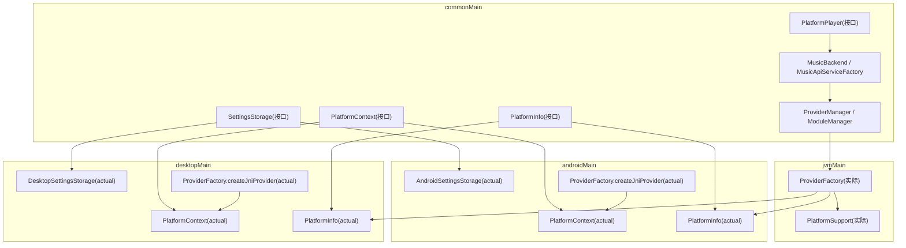
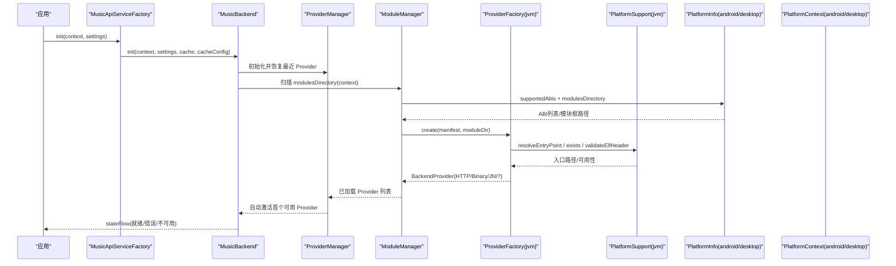
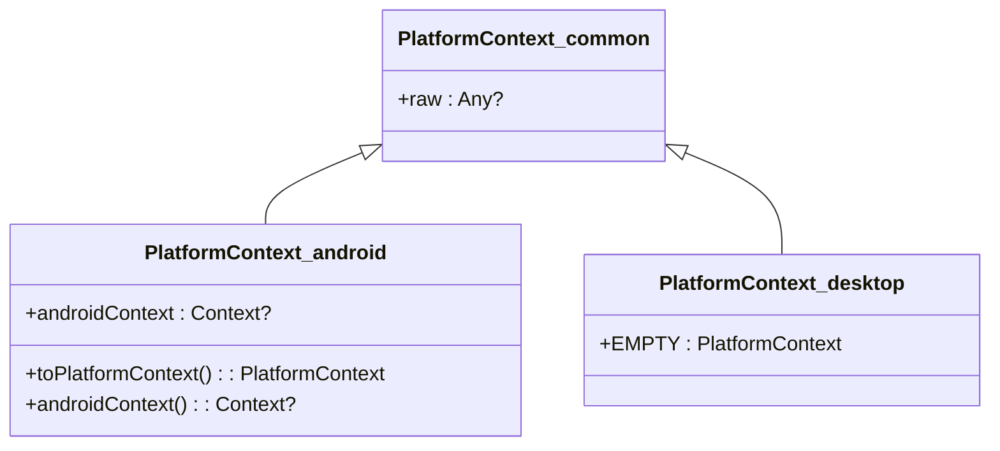
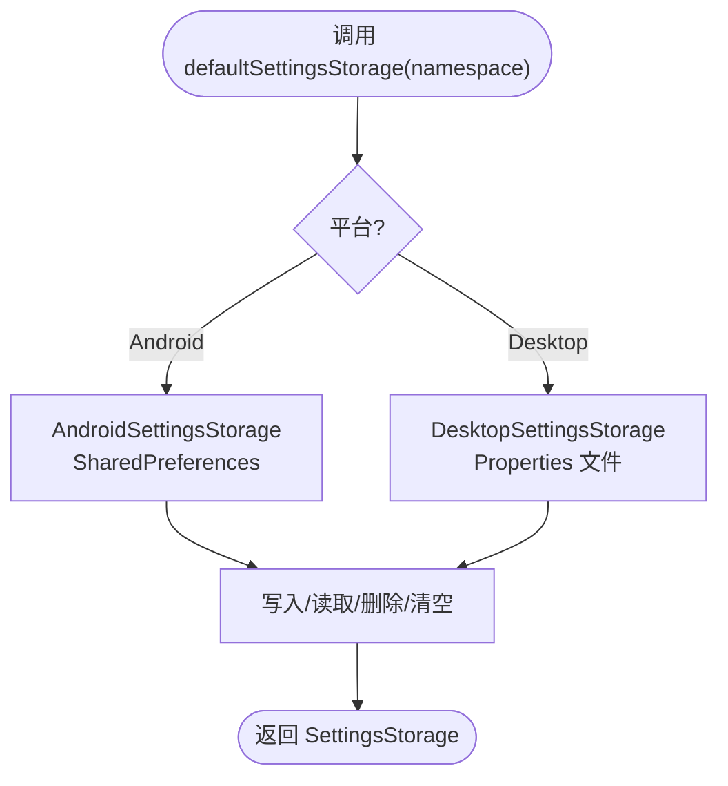
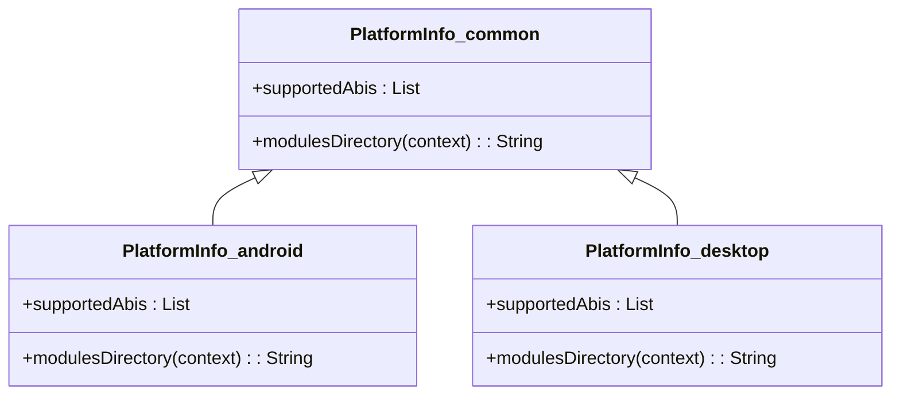
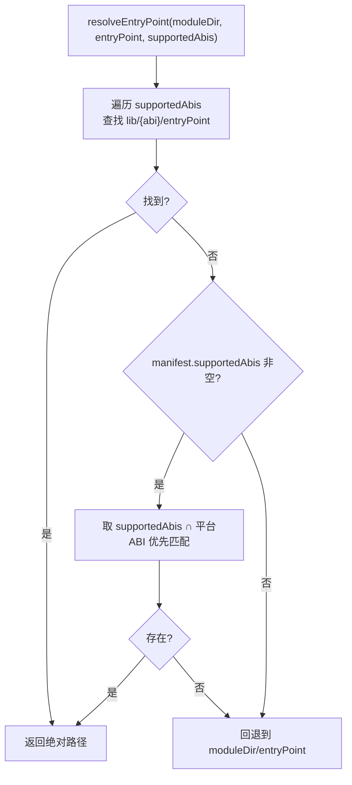
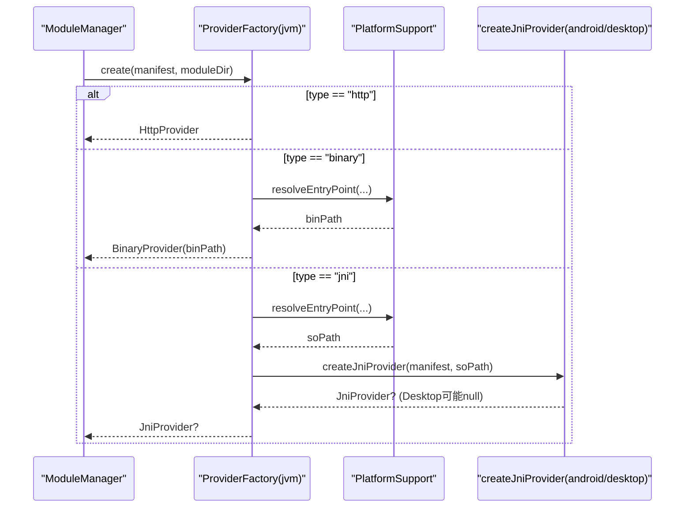
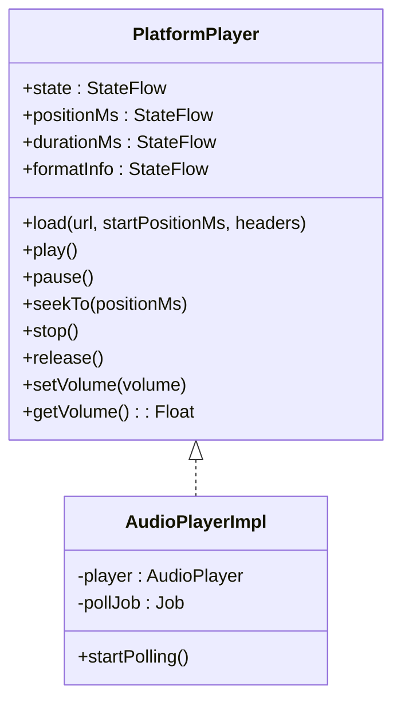
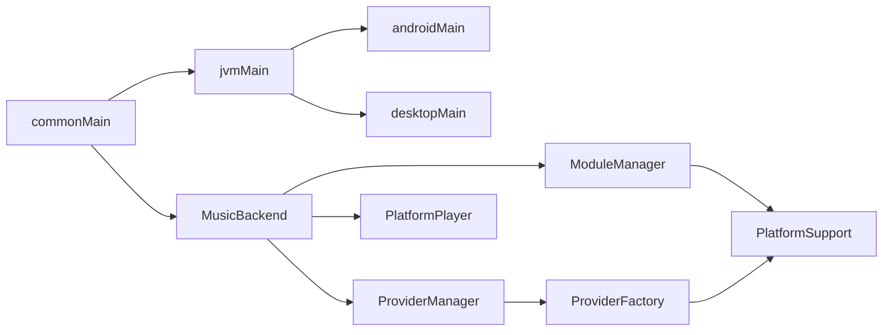

# 平台特定实现模式

<cite>
**本文引用的文件**
- [README.md](file://README.md)
- [PlatformContext.kt（commonMain）](file://kmp-pro/src/commonMain/kotlin/cp/player/kmp/util/PlatformContext.kt)
- [PlatformContext.kt（androidMain）](file://kmp-pro/src/androidMain/kotlin/cp/player/kmp/util/PlatformContext.kt)
- [PlatformContext.kt（desktopMain）](file://kmp-pro/src/desktopMain/kotlin/cp/player/kmp/util/PlatformContext.kt)
- [SettingsStorage.kt（commonMain）](file://kmp-pro/src/commonMain/kotlin/cp/player/kmp/util/SettingsStorage.kt)
- [AndroidSettingsStorage.kt（androidMain）](file://kmp-pro/src/androidMain/kotlin/cp/player/kmp/util/AndroidSettingsStorage.kt)
- [DesktopSettingsStorage.kt（desktopMain）](file://kmp-pro/src/desktopMain/kotlin/cp/player/kmp/util/DesktopSettingsStorage.kt)
- [PlatformInfo.kt（commonMain）](file://kmp-pro/src/commonMain/kotlin/cp/player/kmp/util/PlatformInfo.kt)
- [PlatformInfo.kt（androidMain）](file://kmp-pro/src/androidMain/kotlin/cp/player/kmp/util/PlatformInfo.kt)
- [PlatformInfo.kt（desktopMain）](file://kmp-pro/src/desktopMain/kotlin/cp/player/kmp/util/PlatformInfo.kt)
- [PlatformSupport.kt（jvmMain）](file://kmp-pro/src/jvmMain/kotlin/cp/player/kmp/util/PlatformSupport.kt)
- [ProviderFactory.kt（jvmMain）](file://kmp-pro/src/jvmMain/kotlin/cp/player/kmp/provider/ProviderFactory.kt)
- [ProviderFactory.kt（androidMain）](file://kmp-pro/src/androidMain/kotlin/cp/player/kmp/provider/ProviderFactory.kt)
- [ProviderFactory.kt（desktopMain）](file://kmp-pro/src/desktopMain/kotlin/cp/player/kmp/provider/ProviderFactory.kt)
- [MusicApiServiceFactory.kt（commonMain）](file://kmp-pro/src/commonMain/kotlin/cp/player/kmp/api/MusicApiServiceFactory.kt)
- [MusicBackend.kt（commonMain）](file://kmp-pro/src/commonMain/kotlin/cp/player/kmp/MusicBackend.kt)
- [PlatformPlayer.kt（commonMain）](file://kmp-pro/src/commonMain/kotlin/cp/player/kmp/playback/PlatformPlayer.kt)
</cite>

## 目录
1. [简介](#简介)
2. [项目结构](#项目结构)
3. [核心组件](#核心组件)
4. [架构总览](#架构总览)
5. [详细组件分析](#详细组件分析)
6. [依赖关系分析](#依赖关系分析)
7. [性能考虑](#性能考虑)
8. [故障排查指南](#故障排查指南)
9. [结论](#结论)
10. [附录：开发指南与调试技巧](#附录：开发指南与调试技巧)

## 简介
本技术文档聚焦于 CPPlayer-KMP 的“平台特定实现模式”，系统性说明如何使用 expect/actual 机制为 Android、Desktop（JVM）提供差异化实现，同时保持公共接口的统一性。重点覆盖：
- Android 平台的 Context 包装与持久化存储实现
- Desktop 平台的占位上下文与本地持久化策略
- JVM 共享层对二进制模块加载、端口探测、文件操作等能力的抽象与复用
- Provider 工厂在不同平台的创建策略（HTTP/Binary/JNI）
- 错误处理、资源管理与性能优化建议
- 为新平台扩展或扩展现有功能的完整实践路径

## 项目结构
KMP 模块采用分层组织：
- commonMain：跨平台接口与业务逻辑（如 API、缓存、播放控制、Provider 管理）
- jvmMain：Android 与 Desktop 共享的 JVM 能力（文件、端口、ELF 校验、入口解析）
- androidMain：Android 专属实现（Context 包装、SharedPreferences 存储、JNI Provider）
- desktopMain：Desktop 专属实现（空上下文、Properties 文件存储、不支持 JNI 模块）

图表来源
- [PlatformContext.kt（commonMain）:1-14](file://kmp-pro/src/commonMain/kotlin/cp/player/kmp/util/PlatformContext.kt#L1-L14)
- [PlatformContext.kt（androidMain）:1-14](file://kmp-pro/src/androidMain/kotlin/cp/player/kmp/util/PlatformContext.kt#L1-L14)
- [PlatformContext.kt（desktopMain）:1-10](file://kmp-pro/src/desktopMain/kotlin/cp/player/kmp/util/PlatformContext.kt#L1-L10)
- [SettingsStorage.kt（commonMain）:1-25](file://kmp-pro/src/commonMain/kotlin/cp/player/kmp/util/SettingsStorage.kt#L1-L25)
- [AndroidSettingsStorage.kt（androidMain）:1-35](file://kmp-pro/src/androidMain/kotlin/cp/player/kmp/util/AndroidSettingsStorage.kt#L1-L35)
- [DesktopSettingsStorage.kt（desktopMain）:1-47](file://kmp-pro/src/desktopMain/kotlin/cp/player/kmp/util/DesktopSettingsStorage.kt#L1-L47)
- [PlatformInfo.kt（commonMain）:1-20](file://kmp-pro/src/commonMain/kotlin/cp/player/kmp/util/PlatformInfo.kt#L1-L20)
- [PlatformInfo.kt（androidMain）:1-13](file://kmp-pro/src/androidMain/kotlin/cp/player/kmp/util/PlatformInfo.kt#L1-L13)
- [PlatformInfo.kt（desktopMain）:1-13](file://kmp-pro/src/desktopMain/kotlin/cp/player/kmp/util/PlatformInfo.kt#L1-L13)
- [PlatformSupport.kt（jvmMain）:1-135](file://kmp-pro/src/jvmMain/kotlin/cp/player/kmp/util/PlatformSupport.kt#L1-L135)
- [ProviderFactory.kt（jvmMain）:1-31](file://kmp-pro/src/jvmMain/kotlin/cp/player/kmp/provider/ProviderFactory.kt#L1-L31)
- [ProviderFactory.kt（androidMain）:1-13](file://kmp-pro/src/androidMain/kotlin/cp/player/kmp/provider/ProviderFactory.kt#L1-L13)
- [ProviderFactory.kt（desktopMain）:1-13](file://kmp-pro/src/desktopMain/kotlin/cp/player/kmp/provider/ProviderFactory.kt#L1-L13)

章节来源
- [README.md:11-28](file://README.md#L11-L28)

## 核心组件
- PlatformContext：跨平台上下文抽象，Android 持有真实 Context，Desktop 为空占位
- SettingsStorage：键值存储抽象，Android 使用 SharedPreferences，Desktop 使用 Properties 文件
- PlatformInfo：平台信息抽象，提供 ABI 列表与模块目录
- PlatformSupport：JVM 共享工具（端口探测、解压、文件读写、ELF 校验、入口解析）
- ProviderFactory：按 manifest 类型创建 HTTP/Binary/JNI Provider，JNI 在 Android 可用，Desktop 返回 null
- MusicBackend / MusicApiServiceFactory：后端初始化与单例访问封装
- PlatformPlayer：播放引擎抽象，当前以 AudioPlayerImpl 实现

章节来源
- [PlatformContext.kt（commonMain）:1-14](file://kmp-pro/src/commonMain/kotlin/cp/player/kmp/util/PlatformContext.kt#L1-L14)
- [SettingsStorage.kt（commonMain）:1-25](file://kmp-pro/src/commonMain/kotlin/cp/player/kmp/util/SettingsStorage.kt#L1-L25)
- [PlatformInfo.kt（commonMain）:1-20](file://kmp-pro/src/commonMain/kotlin/cp/player/kmp/util/PlatformInfo.kt#L1-L20)
- [PlatformSupport.kt（jvmMain）:1-135](file://kmp-pro/src/jvmMain/kotlin/cp/player/kmp/util/PlatformSupport.kt#L1-L135)
- [ProviderFactory.kt（jvmMain）:1-31](file://kmp-pro/src/jvmMain/kotlin/cp/player/kmp/provider/ProviderFactory.kt#L1-L31)
- [MusicApiServiceFactory.kt（commonMain）:1-57](file://kmp-pro/src/commonMain/kotlin/cp/player/kmp/api/MusicApiServiceFactory.kt#L1-L57)
- [MusicBackend.kt（commonMain）:32-171](file://kmp-pro/src/commonMain/kotlin/cp/player/kmp/MusicBackend.kt#L32-L171)
- [PlatformPlayer.kt（commonMain）:1-135](file://kmp-pro/src/commonMain/kotlin/cp/player/kmp/playback/PlatformPlayer.kt#L1-L135)

## 架构总览
下图展示 expect/actual 模式下的平台差异与共享层协作关系，以及 Provider 创建流程。

图表来源
- [MusicApiServiceFactory.kt（commonMain）:1-57](file://kmp-pro/src/commonMain/kotlin/cp/player/kmp/api/MusicApiServiceFactory.kt#L1-L57)
- [MusicBackend.kt（commonMain）:32-171](file://kmp-pro/src/commonMain/kotlin/cp/player/kmp/MusicBackend.kt#L32-L171)
- [ProviderFactory.kt（jvmMain）:1-31](file://kmp-pro/src/jvmMain/kotlin/cp/player/kmp/provider/ProviderFactory.kt#L1-L31)
- [PlatformSupport.kt（jvmMain）:1-135](file://kmp-pro/src/jvmMain/kotlin/cp/player/kmp/util/PlatformSupport.kt#L1-L135)
- [PlatformInfo.kt（commonMain）:1-20](file://kmp-pro/src/commonMain/kotlin/cp/player/kmp/util/PlatformInfo.kt#L1-L20)
- [PlatformInfo.kt（androidMain）:1-13](file://kmp-pro/src/androidMain/kotlin/cp/player/kmp/util/PlatformInfo.kt#L1-L13)
- [PlatformInfo.kt（desktopMain）:1-13](file://kmp-pro/src/desktopMain/kotlin/cp/player/kmp/util/PlatformInfo.kt#L1-L13)

## 详细组件分析

### 平台上下文 PlatformContext 的 expect/actual
- commonMain 定义 expect class，暴露 raw 引用
- androidMain actual 包装 android.content.Context，并提供 toPlatformContext() 与 androidContext() 辅助函数
- desktopMain actual 为空占位，提供 EMPTY 常量供无 UI 环境使用

图表来源
- [PlatformContext.kt（commonMain）:1-14](file://kmp-pro/src/commonMain/kotlin/cp/player/kmp/util/PlatformContext.kt#L1-L14)
- [PlatformContext.kt（androidMain）:1-14](file://kmp-pro/src/androidMain/kotlin/cp/player/kmp/util/PlatformContext.kt#L1-L14)
- [PlatformContext.kt（desktopMain）:1-10](file://kmp-pro/src/desktopMain/kotlin/cp/player/kmp/util/PlatformContext.kt#L1-L10)

章节来源
- [PlatformContext.kt（commonMain）:1-14](file://kmp-pro/src/commonMain/kotlin/cp/player/kmp/util/PlatformContext.kt#L1-L14)
- [PlatformContext.kt（androidMain）:1-14](file://kmp-pro/src/androidMain/kotlin/cp/player/kmp/util/PlatformContext.kt#L1-L14)
- [PlatformContext.kt（desktopMain）:1-10](file://kmp-pro/src/desktopMain/kotlin/cp/player/kmp/util/PlatformContext.kt#L1-L10)

### 设置存储 SettingsStorage 的 expect/actual
- commonMain 定义接口与 defaultSettingsStorage 工厂
- androidMain actual 基于 SharedPreferences，要求 Application.onCreate 中注入 Context
- desktopMain actual 基于内存 Map + Properties 文件持久化，默认路径 ~/.kmp-pro/<namespace>.properties

图表来源
- [SettingsStorage.kt（commonMain）:1-25](file://kmp-pro/src/commonMain/kotlin/cp/player/kmp/util/SettingsStorage.kt#L1-L25)
- [AndroidSettingsStorage.kt（androidMain）:1-35](file://kmp-pro/src/androidMain/kotlin/cp/player/kmp/util/AndroidSettingsStorage.kt#L1-L35)
- [DesktopSettingsStorage.kt（desktopMain）:1-47](file://kmp-pro/src/desktopMain/kotlin/cp/player/kmp/util/DesktopSettingsStorage.kt#L1-L47)

章节来源
- [SettingsStorage.kt（commonMain）:1-25](file://kmp-pro/src/commonMain/kotlin/cp/player/kmp/util/SettingsStorage.kt#L1-L25)
- [AndroidSettingsStorage.kt（androidMain）:1-35](file://kmp-pro/src/androidMain/kotlin/cp/player/kmp/util/AndroidSettingsStorage.kt#L1-L35)
- [DesktopSettingsStorage.kt（desktopMain）:1-47](file://kmp-pro/src/desktopMain/kotlin/cp/player/kmp/util/DesktopSettingsStorage.kt#L1-L47)

### 平台信息与模块目录 PlatformInfo
- commonMain 定义 expect object，暴露 supportedAbis 与 modulesDirectory(context)
- androidMain actual 使用 Build.SUPPORTED_ABIS 与 Context.filesDir/modules
- desktopMain actual 固定 ABI 列表与 ~/.kmp-pro/modules

图表来源
- [PlatformInfo.kt（commonMain）:1-20](file://kmp-pro/src/commonMain/kotlin/cp/player/kmp/util/PlatformInfo.kt#L1-L20)
- [PlatformInfo.kt（androidMain）:1-13](file://kmp-pro/src/androidMain/kotlin/cp/player/kmp/util/PlatformInfo.kt#L1-L13)
- [PlatformInfo.kt（desktopMain）:1-13](file://kmp-pro/src/desktopMain/kotlin/cp/player/kmp/util/PlatformInfo.kt#L1-L13)

章节来源
- [PlatformInfo.kt（commonMain）:1-20](file://kmp-pro/src/commonMain/kotlin/cp/player/kmp/util/PlatformInfo.kt#L1-L20)
- [PlatformInfo.kt（androidMain）:1-13](file://kmp-pro/src/androidMain/kotlin/cp/player/kmp/util/PlatformInfo.kt#L1-L13)
- [PlatformInfo.kt（desktopMain）:1-13](file://kmp-pro/src/desktopMain/kotlin/cp/player/kmp/util/PlatformInfo.kt#L1-L13)

### JVM 共享能力 PlatformSupport
- 端口探测：ServerSocket 快速检查端口可用性
- 解压：ZipInputStream 安全解压到目标目录（防路径穿越）
- 文件操作：exists/readText/deleteRecursively/listChildDirectories/moveDir
- 入口解析：按 ABI 顺序查找 lib/{abi}/entryPoint，支持 manifest 声明的 supportedAbis 交集优先
- ELF 校验：读取魔数与 e_machine，匹配当前平台 ABI；不匹配则阻止加载

图表来源
- [PlatformSupport.kt（jvmMain）:67-82](file://kmp-pro/src/jvmMain/kotlin/cp/player/kmp/util/PlatformSupport.kt#L67-L82)

章节来源
- [PlatformSupport.kt（jvmMain）:1-135](file://kmp-pro/src/jvmMain/kotlin/cp/player/kmp/util/PlatformSupport.kt#L1-L135)

### Provider 工厂 ProviderFactory
- jvmMain actual：根据 manifest.type 创建 HTTP/Binary/JNI Provider；Binary/JNI 通过 PlatformSupport 解析入口并校验存在性
- androidMain/desktopMain actual：createJniProvider 仅用于 JNI 模块；Desktop 上通常返回 null（由上层判断不可用）

图表来源
- [ProviderFactory.kt（jvmMain）:1-31](file://kmp-pro/src/jvmMain/kotlin/cp/player/kmp/provider/ProviderFactory.kt#L1-L31)
- [ProviderFactory.kt（androidMain）:1-13](file://kmp-pro/src/androidMain/kotlin/cp/player/kmp/provider/ProviderFactory.kt#L1-L13)
- [ProviderFactory.kt（desktopMain）:1-13](file://kmp-pro/src/desktopMain/kotlin/cp/player/kmp/provider/ProviderFactory.kt#L1-L13)
- [PlatformSupport.kt（jvmMain）:67-82](file://kmp-pro/src/jvmMain/kotlin/cp/player/kmp/util/PlatformSupport.kt#L67-L82)

章节来源
- [ProviderFactory.kt（jvmMain）:1-31](file://kmp-pro/src/jvmMain/kotlin/cp/player/kmp/provider/ProviderFactory.kt#L1-L31)
- [ProviderFactory.kt（androidMain）:1-13](file://kmp-pro/src/androidMain/kotlin/cp/player/kmp/provider/ProviderFactory.kt#L1-L13)
- [ProviderFactory.kt（desktopMain）:1-13](file://kmp-pro/src/desktopMain/kotlin/cp/player/kmp/provider/ProviderFactory.kt#L1-L13)

### 播放引擎 PlatformPlayer
- 接口定义状态流与播放控制方法
- 当前实现 AudioPlayerImpl 基于第三方音频库，轮询状态并映射到统一状态机
- createPlatformPlayer 在 MusicBackend 中用于惰性创建播放器实例

图表来源
- [PlatformPlayer.kt（commonMain）:1-135](file://kmp-pro/src/commonMain/kotlin/cp/player/kmp/playback/PlatformPlayer.kt#L1-L135)

章节来源
- [PlatformPlayer.kt（commonMain）:1-135](file://kmp-pro/src/commonMain/kotlin/cp/player/kmp/playback/PlatformPlayer.kt#L1-L135)

## 依赖关系分析
- commonMain 依赖 expect 接口，不感知具体平台
- jvmMain 提供共享工具与 Provider 工厂，依赖 PlatformSupport 与 PlatformInfo
- androidMain/desktopMain 提供 actual 实现，分别对接系统 API 与文件系统
- MusicBackend 作为唯一后端入口，协调 ProviderManager、ModuleManager、API 服务与播放控制器

图表来源
- [MusicBackend.kt（commonMain）:32-171](file://kmp-pro/src/commonMain/kotlin/cp/player/kmp/MusicBackend.kt#L32-L171)
- [ProviderFactory.kt（jvmMain）:1-31](file://kmp-pro/src/jvmMain/kotlin/cp/player/kmp/provider/ProviderFactory.kt#L1-L31)
- [PlatformSupport.kt（jvmMain）:1-135](file://kmp-pro/src/jvmMain/kotlin/cp/player/kmp/util/PlatformSupport.kt#L1-L135)

章节来源
- [MusicBackend.kt（commonMain）:32-171](file://kmp-pro/src/commonMain/kotlin/cp/player/kmp/MusicBackend.kt#L32-L171)
- [ProviderFactory.kt（jvmMain）:1-31](file://kmp-pro/src/jvmMain/kotlin/cp/player/kmp/provider/ProviderFactory.kt#L1-L31)
- [PlatformSupport.kt（jvmMain）:1-135](file://kmp-pro/src/jvmMain/kotlin/cp/player/kmp/util/PlatformSupport.kt#L1-L135)

## 性能考虑
- 端口探测：使用 ServerSocket 快速失败，避免阻塞；批量尝试时限制最大次数
- 解压与文件 IO：使用 try-with-resources 确保流关闭；解压时进行路径安全检查，防止越权写入
- ELF 校验：仅在必要时读取文件头，减少 I/O；架构不匹配立即中止，避免无效加载
- 存储读写：Android 使用 SharedPreferences 原子写；Desktop 使用并发 Map 与异步持久化，避免主线程阻塞
- 播放状态轮询：合理间隔（例如 200ms）平衡响应性与 CPU 占用；释放时取消轮询任务，避免泄漏

[本节为通用指导，无需引用具体文件]

## 故障排查指南
- Android 未注入 Context：调用 defaultSettingsStorage 前需在 Application.onCreate 中调用 initKmpAndroidContext，否则会抛出异常
- Desktop 配置丢失：确认 ~/.kmp-pro/<namespace>.properties 是否存在且可读；若损坏，将忽略持久化数据继续运行
- 模块入口不存在：ProviderFactory 会返回 null，UI 应提示“模块不可用”；检查 ABI 匹配与目录结构
- ELF 架构不匹配：PlatformSupport.validateElfHeader 返回错误描述，应记录日志并阻止加载
- 端口冲突：findAvailablePort 返回 null 表示所有尝试端口均被占用，需提示用户或调整起始端口

章节来源
- [AndroidSettingsStorage.kt（androidMain）:25-35](file://kmp-pro/src/androidMain/kotlin/cp/player/kmp/util/AndroidSettingsStorage.kt#L25-L35)
- [DesktopSettingsStorage.kt（desktopMain）:1-47](file://kmp-pro/src/desktopMain/kotlin/cp/player/kmp/util/DesktopSettingsStorage.kt#L1-L47)
- [PlatformSupport.kt（jvmMain）:19-31](file://kmp-pro/src/jvmMain/kotlin/cp/player/kmp/util/PlatformSupport.kt#L19-L31)
- [PlatformSupport.kt（jvmMain）:89-121](file://kmp-pro/src/jvmMain/kotlin/cp/player/kmp/util/PlatformSupport.kt#L89-L121)

## 结论
CPPlayer-KMP 通过 expect/actual 清晰划分了跨平台公共逻辑与平台特定实现，结合 jvmMain 共享能力与 Provider 工厂，实现了统一的 API 与服务发现机制。Android 通过 Context 包装与 SharedPreferences 完成系统级集成，Desktop 通过空上下文与本地文件存储满足桌面场景。该模式便于扩展新平台、替换底层实现并保持上层稳定。

[本节为总结，无需引用具体文件]

## 附录：开发指南与调试技巧

### 为新平台添加支持的步骤
- 新增 platformMain 源集（例如 iosMain），实现以下 expect：
  - PlatformContext.actual：包装平台上下文或提供空实现
  - SettingsStorage.actual：实现键值存储（可持久化）
  - PlatformInfo.actual：提供 ABI 列表与模块目录
  - ProviderFactory.createJniProvider.actual：如需 JNI 支持，否则返回 null
- 在 jvmMain 的 ProviderFactory 中增加对新类型的分支（可选）
- 在 MusicBackend.init 中传入新的 PlatformContext 与 SettingsStorage

章节来源
- [PlatformContext.kt（commonMain）:1-14](file://kmp-pro/src/commonMain/kotlin/cp/player/kmp/util/PlatformContext.kt#L1-L14)
- [SettingsStorage.kt（commonMain）:1-25](file://kmp-pro/src/commonMain/kotlin/cp/player/kmp/util/SettingsStorage.kt#L1-L25)
- [PlatformInfo.kt（commonMain）:1-20](file://kmp-pro/src/commonMain/kotlin/cp/player/kmp/util/PlatformInfo.kt#L1-L20)
- [ProviderFactory.kt（jvmMain）:1-31](file://kmp-pro/src/jvmMain/kotlin/cp/player/kmp/provider/ProviderFactory.kt#L1-L31)

### 扩展现有功能（以新增平台能力为例）
- 在 commonMain 新增 expect 接口（如 NetworkClient）
- 在各平台提供 actual 实现（Android 使用 OkHttp/Ktor，Desktop 使用 Java Net）
- 在 ProviderManager 或 PlatformSupport 中引入新能力，保持调用方不变

[本节为概念性指导，无需引用具体文件]

### 调试技巧
- 打印模块目录与 ABI：在 ModuleManager 中输出 PlatformInfo.modulesDirectory(context) 与 supportedAbis
- 验证入口解析：在 ProviderFactory.create 中打印 resolveEntryPoint 结果与 exists 状态
- 捕获 ELF 校验错误：记录 validateElfHeader 返回的错误描述，定位架构不匹配问题
- 观察存储行为：在 Android 使用 adb shell dumpsys sharedpreferences，在 Desktop 查看 properties 文件内容
- 播放状态诊断：收集 PlatformPlayer.state 变化与 positionMs/durationMs 流，定位卡顿或状态异常

章节来源
- [PlatformInfo.kt（androidMain）:1-13](file://kmp-pro/src/androidMain/kotlin/cp/player/kmp/util/PlatformInfo.kt#L1-L13)
- [PlatformInfo.kt（desktopMain）:1-13](file://kmp-pro/src/desktopMain/kotlin/cp/player/kmp/util/PlatformInfo.kt#L1-L13)
- [PlatformSupport.kt（jvmMain）:67-82](file://kmp-pro/src/jvmMain/kotlin/cp/player/kmp/util/PlatformSupport.kt#L67-L82)
- [PlatformSupport.kt（jvmMain）:89-121](file://kmp-pro/src/jvmMain/kotlin/cp/player/kmp/util/PlatformSupport.kt#L89-L121)
- [PlatformPlayer.kt（commonMain）:1-135](file://kmp-pro/src/commonMain/kotlin/cp/player/kmp/playback/PlatformPlayer.kt#L1-L135)