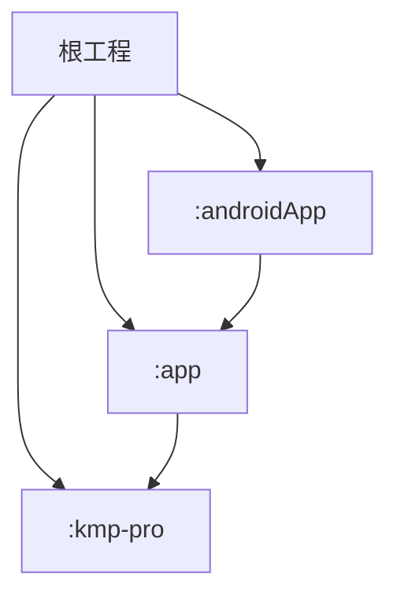
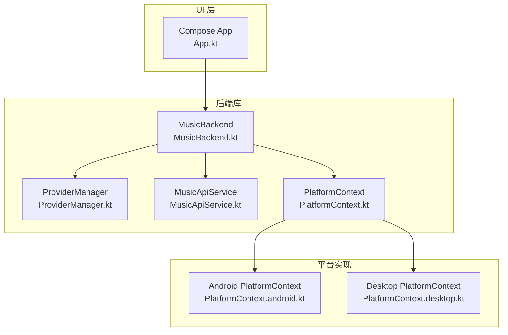
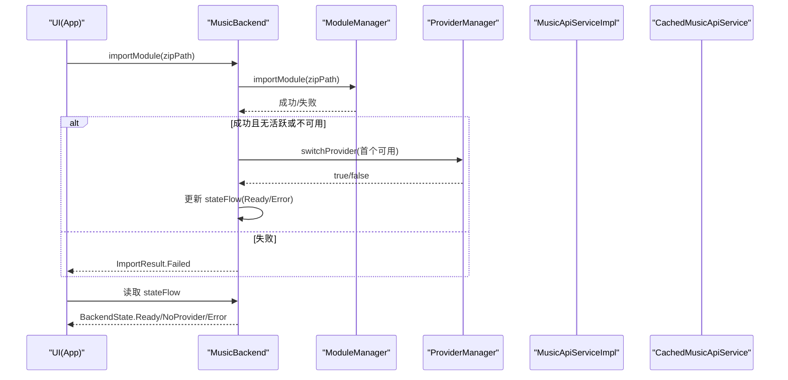
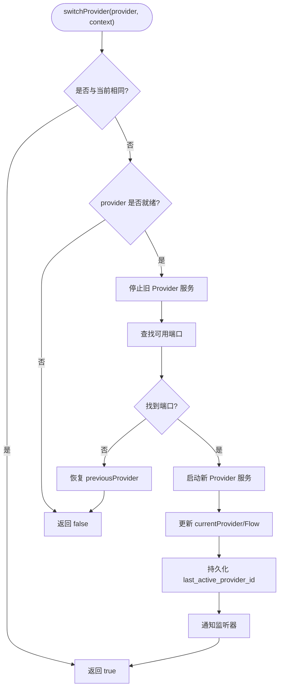
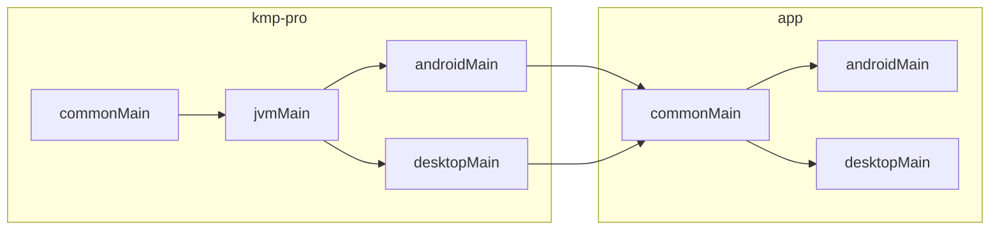

# 跨平台开发指南

<cite>
**本文引用的文件**
- [README.md](file://README.md)
- [settings.gradle.kts](file://settings.gradle.kts)
- [build.gradle.kts](file://build.gradle.kts)
- [gradle.properties](file://gradle.properties)
- [libs.versions.toml](file://gradle/libs.versions.toml)
- [kmp-pro/build.gradle.kts](file://kmp-pro/build.gradle.kts)
- [app/build.gradle.kts](file://app/build.gradle.kts)
- [androidApp/build.gradle.kts](file://androidApp/build.gradle.kts)
- [MusicBackend.kt](file://kmp-pro/src/commonMain/kotlin/cp/player/kmp/MusicBackend.kt)
- [MusicApiService.kt](file://kmp-pro/src/commonMain/kotlin/cp/player/kmp/api/MusicApiService.kt)
- [ProviderManager.kt](file://kmp-pro/src/commonMain/kotlin/cp/player/kmp/provider/ProviderManager.kt)
- [PlatformContext.kt](file://kmp-pro/src/commonMain/kotlin/cp/player/kmp/util/PlatformContext.kt)
- [PlatformContext.android.kt](file://kmp-pro/src/androidMain/kotlin/cp/player/kmp/util/PlatformContext.kt)
- [PlatformContext.desktop.kt](file://kmp-pro/src/desktopMain/kotlin/cp/player/kmp/util/PlatformContext.kt)
- [App.kt](file://app/src/commonMain/kotlin/cp/player/app/App.kt)
</cite>

## 目录
1. [简介](#简介)
2. [项目结构](#项目结构)
3. [核心组件](#核心组件)
4. [架构总览](#架构总览)
5. [详细组件分析](#详细组件分析)
6. [依赖与构建配置](#依赖与构建配置)
7. [性能考虑](#性能考虑)
8. [故障排查指南](#故障排查指南)
9. [结论](#结论)
10. [附录：完整开发流程示例](#附录完整开发流程示例)

## 简介
本指南面向 CPPlayer-KMP 的跨平台（Android + Desktop/JVM）开发，目标是帮助你在 commonMain 中编写平台无关的业务逻辑，并在各平台源集中提供具体实现。文档涵盖环境搭建、模块结构与职责、依赖管理、构建与调试、常见陷阱与解决方案、性能优化与测试策略，并通过端到端示例展示从需求到多平台实现的完整过程。

## 项目结构
- 根工程包含三个模块：
  - kmp-pro：KMP 库模块，提供 Provider 插件系统、API 层、缓存与健康监控等后端能力。
  - app：KMP UI 模块，使用 Compose + Voyager，共享业务逻辑并对接平台入口。
  - androidApp：Android 应用壳，负责启动与平台初始化。
- 目标层级遵循 commonMain → jvmMain → { androidMain, desktopMain } 的分层组织。
- Gradle 版本与插件通过根 settings 与 libs.versions.toml 统一管理。

图表来源
- [settings.gradle.kts:22-26](file://settings.gradle.kts#L22-L26)
- [kmp-pro/build.gradle.kts:12-27](file://kmp-pro/build.gradle.kts#L12-L27)
- [app/build.gradle.kts:14-22](file://app/build.gradle.kts#L14-L22)

章节来源
- [settings.gradle.kts:1-26](file://settings.gradle.kts#L1-L26)
- [build.gradle.kts:1-10](file://build.gradle.kts#L1-L10)
- [gradle.properties:1-9](file://gradle.properties#L1-L9)
- [libs.versions.toml:1-64](file://gradle/libs.versions.toml#L1-L64)

## 核心组件
- MusicBackend：统一后端入口，封装生命周期、状态机、Provider 管理、音乐数据访问、本地音乐、播放控制与健康监控。
- MusicApiService：统一的音乐 API 服务接口，所有网络调用经此抽象，自动注入 Cookie，返回 JsonElement。
- ProviderManager：管理已加载 Provider、切换活跃 Provider、端口分配与服务启停、Cookie 隔离存储。
- PlatformContext：跨平台上下文抽象，Android 包装 Context，Desktop 为空占位。

章节来源
- [MusicBackend.kt:30-161](file://kmp-pro/src/commonMain/kotlin/cp/player/kmp/MusicBackend.kt#L30-L161)
- [MusicApiService.kt:5-23](file://kmp-pro/src/commonMain/kotlin/cp/player/kmp/api/MusicApiService.kt#L5-L23)
- [ProviderManager.kt:15-35](file://kmp-pro/src/commonMain/kotlin/cp/player/kmp/provider/ProviderManager.kt#L15-L35)
- [PlatformContext.kt:1-14](file://kmp-pro/src/commonMain/kotlin/cp/player/kmp/util/PlatformContext.kt#L1-L14)

## 架构总览
CPPlayer-KMP 采用“后端库 + UI 模块 + 平台壳”的分层架构：
- 后端库（kmp-pro）：提供 Provider 插件、API 层、缓存与健康监控，屏蔽平台差异。
- UI 模块（app）：基于 Compose/Voyager 的多平台界面，订阅后端状态并驱动导航。
- 平台壳（androidApp）：在 Android 上完成 Application 初始化与平台上下文注入。

图表来源
- [App.kt:31-70](file://app/src/commonMain/kotlin/cp/player/app/App.kt#L31-L70)
- [MusicBackend.kt:73-161](file://kmp-pro/src/commonMain/kotlin/cp/player/kmp/MusicBackend.kt#L73-L161)
- [ProviderManager.kt:31-145](file://kmp-pro/src/commonMain/kotlin/cp/player/kmp/provider/ProviderManager.kt#L31-L145)
- [MusicApiService.kt:24-23](file://kmp-pro/src/commonMain/kotlin/cp/player/kmp/api/MusicApiService.kt#L24-L23)
- [PlatformContext.kt:11-14](file://kmp-pro/src/commonMain/kotlin/cp/player/kmp/util/PlatformContext.kt#L11-L14)
- [PlatformContext.android.kt:5-14](file://kmp-pro/src/androidMain/kotlin/cp/player/kmp/util/PlatformContext.kt#L5-L14)
- [PlatformContext.desktop.kt:3-10](file://kmp-pro/src/desktopMain/kotlin/cp/player/kmp/util/PlatformContext.kt#L3-L10)

## 详细组件分析

### MusicBackend：统一后端入口与状态机
- 职责：
  - 生命周期与状态机：暴露 stateFlow，初始为 Uninitialized，根据 Provider 就绪情况迁移至 Ready/Error/NoProvider。
  - Provider 管理：导入 zip 模块、自动激活首个可用 Provider、切换与删除。
  - 数据访问：提供 unifiedSource（统一媒体 ID 路由）、musicApi/cachedApi（兼容旧接口）。
  - 播放控制：构造 PlaybackControllerImpl，绑定平台 Player、统一 Source 与 API。
  - 健康监控：暴露 HealthMonitor，用于 API 健康三级分类。
- 关键流程：
  - importModule：导入后若当前无活跃或不可用，则自动激活。
  - switchProviderInternal：切换时停止旧服务、尝试启动新服务，更新状态流。
  - init：创建 ProviderManager、ModuleManager、API 实现与缓存，计算终态。

图表来源
- [MusicBackend.kt:180-245](file://kmp-pro/src/commonMain/kotlin/cp/player/kmp/MusicBackend.kt#L180-L245)
- [MusicBackend.kt:330-388](file://kmp-pro/src/commonMain/kotlin/cp/player/kmp/MusicBackend.kt#L330-L388)

章节来源
- [MusicBackend.kt:30-161](file://kmp-pro/src/commonMain/kotlin/cp/player/kmp/MusicBackend.kt#L30-L161)
- [MusicBackend.kt:180-245](file://kmp-pro/src/commonMain/kotlin/cp/player/kmp/MusicBackend.kt#L180-L245)
- [MusicBackend.kt:330-388](file://kmp-pro/src/commonMain/kotlin/cp/player/kmp/MusicBackend.kt#L330-L388)

### ProviderManager：Provider 生命周期与端口管理
- 职责：
  - 维护 currentProvider 与 currentPort，支持按 ID 切换与恢复上次选择。
  - 自动检测端口可用性，避免冲突；启动/停止 Provider 服务。
  - 持久化最近活跃的 Provider ID。
  - 提供 callApi 方法，将方法名映射到 Provider 实际实现，处理不支持与异常。
- 关键点：
  - 端口回退：findAvailablePort 在指定范围内寻找空闲端口。
  - Cookie 隔离：ProviderCookieStorage 以 providerId 前缀隔离账号 Cookie。

图表来源
- [ProviderManager.kt:80-145](file://kmp-pro/src/commonMain/kotlin/cp/player/kmp/provider/ProviderManager.kt#L80-L145)

章节来源
- [ProviderManager.kt:15-145](file://kmp-pro/src/commonMain/kotlin/cp/player/kmp/provider/ProviderManager.kt#L15-L145)

### MusicApiService：统一 API 抽象
- 设计原则：
  - 所有音乐 API 调用唯一入口，禁止直接触碰 ProviderManager。
  - 方法签名返回 JsonElement，由上层解析为领域模型。
  - 自动注入 cookie，错误统一格式。
  - 全部 suspend 函数，内部 IO 线程执行网络调用。
- 覆盖范围：认证、用户、歌单、专辑、歌手、搜索、播放、社交、排行榜、推荐、相似、签到、MV、视频、电台、扩展等。

章节来源
- [MusicApiService.kt:5-23](file://kmp-pro/src/commonMain/kotlin/cp/player/kmp/api/MusicApiService.kt#L5-L23)
- [MusicApiService.kt:24-528](file://kmp-pro/src/commonMain/kotlin/cp/player/kmp/api/MusicApiService.kt#L24-L528)

### PlatformContext：跨平台上下文抽象
- expect/actual 模式：
  - commonMain 定义 expect class PlatformContext，暴露 raw 引用。
  - androidMain actual 包装 android.content.Context，并提供 toPlatformContext() 与 androidContext() 工具。
  - desktopMain actual 为空占位，提供 EMPTY 常量。

章节来源
- [PlatformContext.kt:1-14](file://kmp-pro/src/commonMain/kotlin/cp/player/kmp/util/PlatformContext.kt#L1-L14)
- [PlatformContext.android.kt:5-14](file://kmp-pro/src/androidMain/kotlin/cp/player/kmp/util/PlatformContext.kt#L5-L14)
- [PlatformContext.desktop.kt:3-10](file://kmp-pro/src/desktopMain/kotlin/cp/player/kmp/util/PlatformContext.kt#L3-L10)

### UI 集成：App 根组件与状态导航
- App 根 Composable：
  - 假设平台入口已完成 MusicBackend.init。
  - 根据 BackendState 决定起始屏幕：NoProvider → SetupScreen；Ready → MainScreen。
  - 通过 LaunchedEffect 观察 stateFlow，动态切换到主界面。

章节来源
- [App.kt:31-70](file://app/src/commonMain/kotlin/cp/player/app/App.kt#L31-L70)

## 依赖与构建配置
- 根工程：
  - settings 管理插件仓库与模块 include。
  - build.gradle.kts 声明插件 apply false，子模块按需启用。
  - gradle.properties 设置 JVM 参数、AndroidX、代理等。
- 版本目录：
  - libs.versions.toml 集中管理 Kotlin、Coroutines、Serialization、Ktor、Compose、Media3、JFX 等版本与依赖项。
- kmp-pro 模块：
  - 目标：android + jvm("desktop")，sourceSets 分层：commonMain → jvmMain → { androidMain, desktopMain }。
  - commonMain 依赖：coroutines、serialization、datetime、ktor client core/negotiation/json。
  - jvmMain 依赖：ktor-client-okhttp。
  - androidMain 依赖：coroutines-android、core-ktx、media3 exoplayer/datasource/okhttp。
  - desktopMain 依赖：javafx graphics/base（按 OS classifier）、dbus-java（Linux MPRIS）、jna（Windows SMTC）。
- app 模块：
  - 依赖 kmp-pro 作为 api 依赖，引入 Compose、Voyager、Coil、Ktor 客户端等。
  - compose.desktop 配置 mainClass 与原生打包目标。
- androidApp 模块：
  - Android 应用壳，编译选项 Java 21，打包资源排除，依赖 :app 与协程 Android。

图表来源
- [kmp-pro/build.gradle.kts:12-65](file://kmp-pro/build.gradle.kts#L12-L65)
- [app/build.gradle.kts:14-76](file://app/build.gradle.kts#L14-L76)

章节来源
- [settings.gradle.kts:1-26](file://settings.gradle.kts#L1-L26)
- [build.gradle.kts:1-10](file://build.gradle.kts#L1-L10)
- [gradle.properties:1-9](file://gradle.properties#L1-L9)
- [libs.versions.toml:1-64](file://gradle/libs.versions.toml#L1-L64)
- [kmp-pro/build.gradle.kts:12-65](file://kmp-pro/build.gradle.kts#L12-L65)
- [app/build.gradle.kts:14-76](file://app/build.gradle.kts#L14-L76)
- [androidApp/build.gradle.kts:1-41](file://androidApp/build.gradle.kts#L1-L41)

## 性能考虑
- 缓存优先：
  - 使用 CachedMusicApiService 先返回缓存，后台拉取网络，指纹比对决定是否异步回传 Fresh。
  - 合理配置 CacheConfig（freshTtlMs、maxEntries、enableFallback、enableCache）。
- 健康监控与降级：
  - 三级分类（OK/WARNING/ERROR），ERROR 触发多 Provider 容灾 tryFallback，失败带缓存降级。
- 端口与并发：
  - ProviderManager 自动检测端口，避免冲突；大量并发请求建议结合协程调度与背压。
- 图片与媒体：
  - 使用 Coil 进行图片加载，配合 OkHttp 网络栈；音频播放使用 Media3/ExoPlayer（Android）或桌面播放器。
- 序列化与 JSON：
  - 使用 kotlinx-serialization 提升解析性能；减少不必要的对象转换。

## 故障排查指南
- 常见问题定位：
  - 无活跃 Provider：检查 ModuleManager 是否成功导入模块，ProviderManager 是否恢复 last_active_provider_id。
  - 端口占用：查看 findAvailablePort 日志，调整默认端口或重试次数。
  - JNI 模块不可用：Desktop 上 createJniProvider 返回 null，对应模块标记不可用。
  - API 错误：关注 HealthMonitor 的 WARNING/ERROR 分类，必要时启用 fallback。
- 调试技巧：
  - 打印 Provider 加载错误（extractProviderError 反射获取 getLoadError）。
  - 观察 stateFlow 变化，确认状态迁移是否符合预期。
  - 在 Android 上使用 Logcat，Desktop 使用控制台输出。

章节来源
- [MusicBackend.kt:300-310](file://kmp-pro/src/commonMain/kotlin/cp/player/kmp/MusicBackend.kt#L300-L310)
- [ProviderManager.kt:65-109](file://kmp-pro/src/commonMain/kotlin/cp/player/kmp/provider/ProviderManager.kt#L65-L109)
- [README.md:158-167](file://README.md#L158-L167)

## 结论
CPPlayer-KMP 通过清晰的层次划分与 expect/actual 机制，实现了跨平台的后端能力复用与 UI 适配。借助 MusicBackend 的统一入口、ProviderManager 的生命周期管理、MusicApiService 的抽象以及缓存与健康监控，开发者可在 commonMain 聚焦业务逻辑，在各平台源集完成差异化实现。遵循本文档的构建、调试与优化建议，可显著提升多平台一致性与稳定性。

## 附录：完整开发流程示例
以下示例展示从需求到多平台实现的完整流程，涵盖环境搭建、模块理解、commonMain 编码、平台实现、依赖与构建、调试与优化。

- 环境搭建
  - 安装 JDK 21、Gradle Wrapper（根工程已提供）。
  - 配置代理（gradle.properties 中的 https/http proxy）。
  - 同步 Gradle 并验证构建命令。

- 项目结构理解
  - 阅读 README 了解模块映射与特性。
  - 熟悉 sourceSets 分层与依赖关系。

- 在 commonMain 编写平台无关代码
  - 新增业务接口与数据模型，保持无平台依赖。
  - 通过 MusicApiService 调用云 API，或通过 UnifiedMusicSource 访问统一媒体 ID。

- 在各平台源集提供具体实现
  - Android：实现 PlatformContext 包装 Context，接入 Media3 播放。
  - Desktop：实现 PlatformContext 空占位，接入 JFX/MPRIS/SMTC。

- 依赖管理与构建配置
  - 在 libs.versions.toml 添加新版本或新依赖。
  - 在 kmp-pro/app 的 build.gradle.kts 中声明依赖与 target。

- 调试技巧
  - 观察 stateFlow 与 HealthMonitor 分类。
  - 打印 Provider 加载错误与端口占用信息。

- 常见陷阱与解决方案
  - 文件系统操作：通过 PlatformSupport 抽象，避免直接依赖平台 API。
  - 网络请求：统一使用 Ktor 客户端，注意内容协商与序列化。
  - UI 组件适配：Compose 在多平台渲染差异，尽量使用跨平台组件。

- 性能优化建议
  - 启用缓存与指纹比对，减少重复网络请求。
  - 合理使用协程调度与背压，避免阻塞主线程。

- 测试策略
  - 单元测试：对 commonMain 逻辑进行纯函数测试。
  - 平台测试：针对 Android/Desktop 的 PlatformContext 与播放引擎进行集成测试。
  - 模拟 Provider：Mock ProviderManager 与 MusicApiService 以验证 UI 行为。

章节来源
- [README.md:30-41](file://README.md#L30-L41)
- [README.md:45-63](file://README.md#L45-L63)
- [README.md:66-101](file://README.md#L66-L101)
- [README.md:104-155](file://README.md#L104-L155)
- [kmp-pro/build.gradle.kts:12-65](file://kmp-pro/build.gradle.kts#L12-L65)
- [app/build.gradle.kts:14-76](file://app/build.gradle.kts#L14-L76)
- [MusicBackend.kt:330-388](file://kmp-pro/src/commonMain/kotlin/cp/player/kmp/MusicBackend.kt#L330-L388)
- [ProviderManager.kt:80-145](file://kmp-pro/src/commonMain/kotlin/cp/player/kmp/provider/ProviderManager.kt#L80-L145)
- [PlatformContext.kt:1-14](file://kmp-pro/src/commonMain/kotlin/cp/player/kmp/util/PlatformContext.kt#L1-L14)
- [PlatformContext.android.kt:5-14](file://kmp-pro/src/androidMain/kotlin/cp/player/kmp/util/PlatformContext.kt#L5-L14)
- [PlatformContext.desktop.kt:3-10](file://kmp-pro/src/desktopMain/kotlin/cp/player/kmp/util/PlatformContext.kt#L3-L10)
- [App.kt:31-70](file://app/src/commonMain/kotlin/cp/player/app/App.kt#L31-L70)