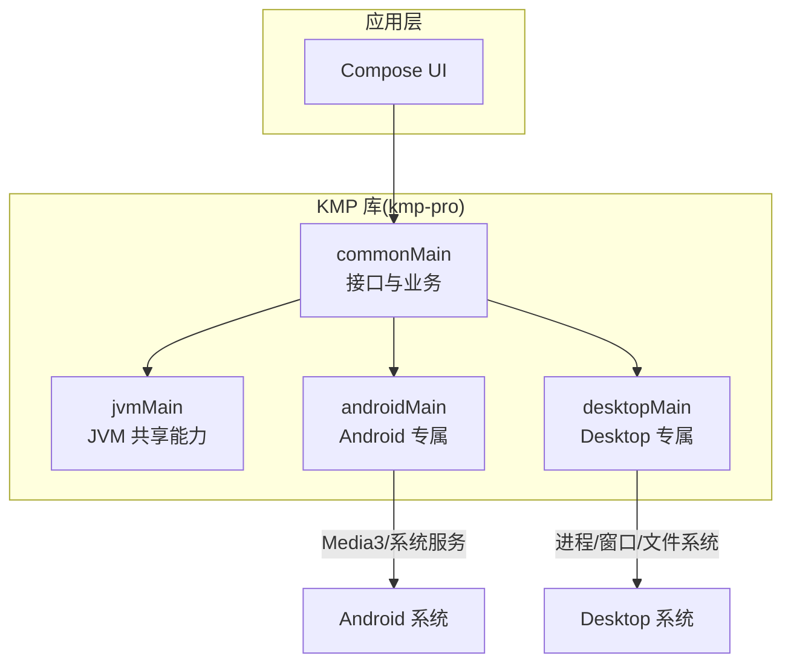
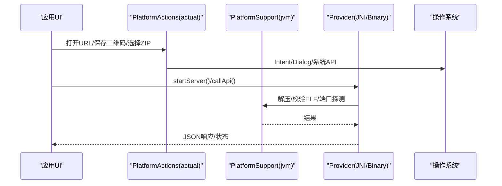
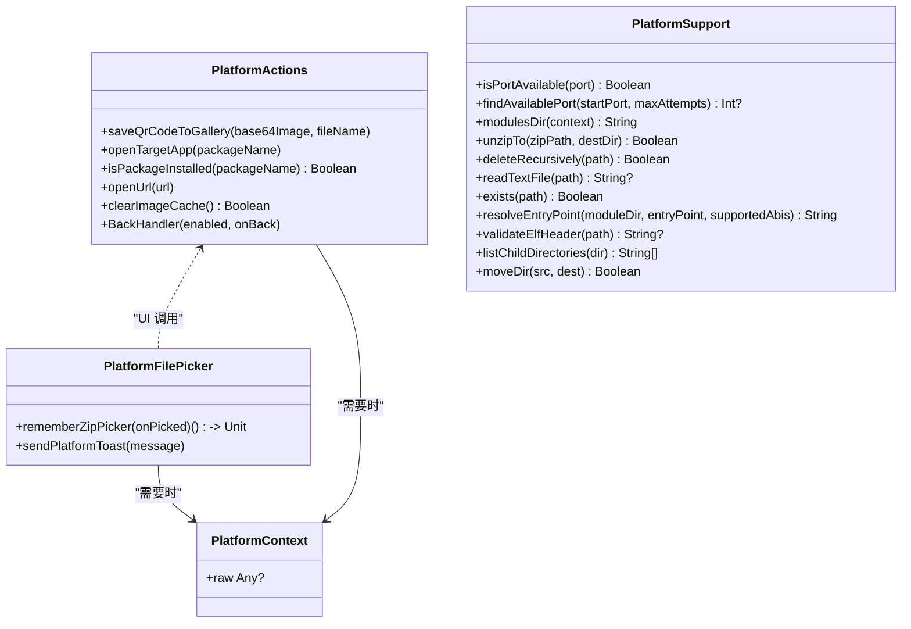
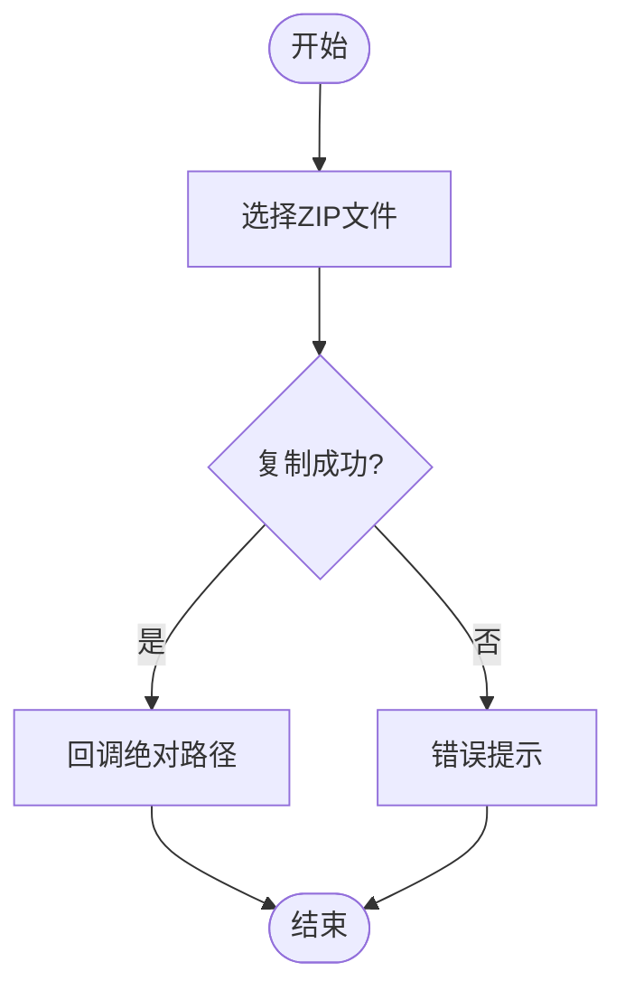
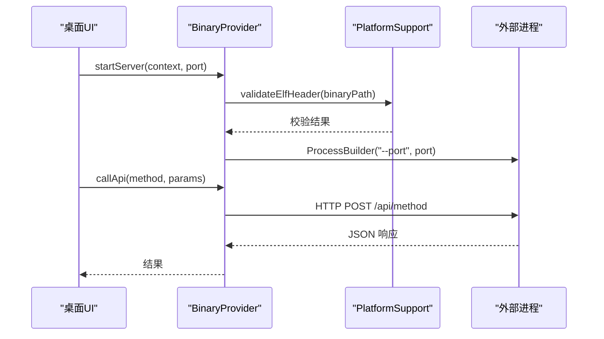
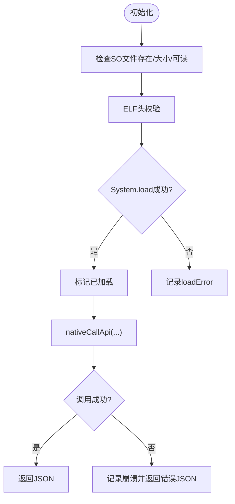
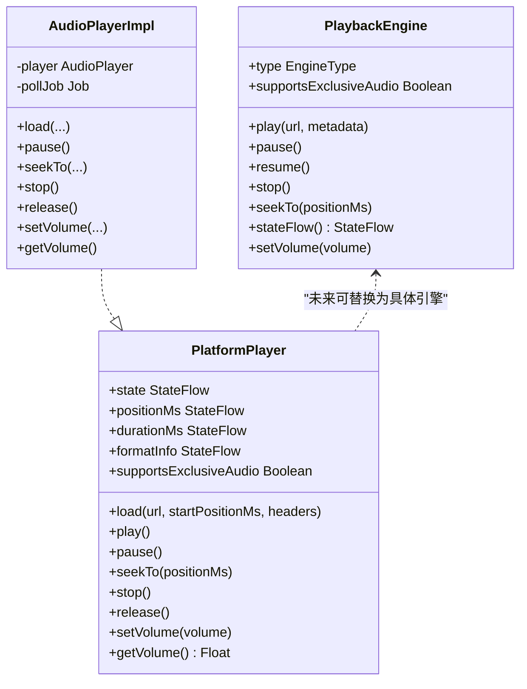
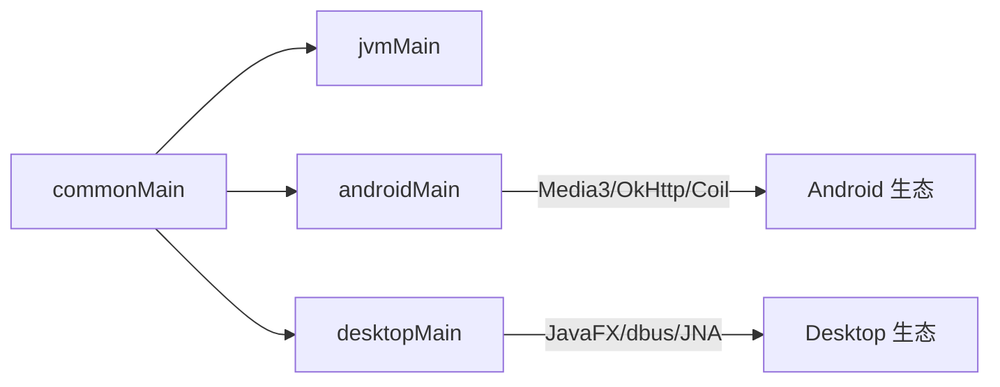

# 平台特定实现

<cite>
**本文引用的文件**
- [README.md](file://README.md)
- [PlatformActions.kt](file://app/src/commonMain/kotlin/cp/player/app/platform/PlatformActions.kt)
- [PlatformActions.android.kt](file://app/src/androidMain/kotlin/cp/player/app/platform/PlatformActions.android.kt)
- [PlatformActions.desktop.kt](file://app/src/desktopMain/kotlin/cp/player/app/platform/PlatformActions.desktop.kt)
- [PlatformFilePicker.kt](file://app/src/commonMain/kotlin/cp/player/app/platform/PlatformFilePicker.kt)
- [PlatformFilePicker.android.kt](file://app/src/androidMain/kotlin/cp/player/app/platform/PlatformFilePicker.android.kt)
- [PlatformFilePicker.desktop.kt](file://app/src/desktopMain/kotlin/cp/player/app/platform/PlatformFilePicker.desktop.kt)
- [PlatformContext.kt (common)](file://kmp-pro/src/commonMain/kotlin/cp/player/kmp/util/PlatformContext.kt)
- [PlatformContext.kt (android)](file://kmp-pro/src/androidMain/kotlin/cp/player/kmp/util/PlatformContext.kt)
- [PlatformContext.kt (desktop)](file://kmp-pro/src/desktopMain/kotlin/cp/player/kmp/util/PlatformContext.kt)
- [PlatformSupport.kt (common)](file://kmp-pro/src/commonMain/kotlin/cp/player/kmp/util/PlatformSupport.kt)
- [PlatformSupport.kt (jvm)](file://kmp-pro/src/jvmMain/kotlin/cp/player/kmp/util/PlatformSupport.kt)
- [JniProvider.kt](file://kmp-pro/src/jvmMain/kotlin/cp/player/kmp/provider/JniProvider.kt)
- [BinaryProvider.kt](file://kmp-pro/src/jvmMain/kotlin/cp/player/kmp/provider/BinaryProvider.kt)
- [PlatformPlayer.kt](file://kmp-pro/src/commonMain/kotlin/cp/player/kmp/playback/PlatformPlayer.kt)
- [PlaybackEngine.kt](file://kmp-pro/src/commonMain/kotlin/cp/player/kmp/playback/PlaybackEngine.kt)
- [libs.versions.toml](file://gradle/libs.versions.toml)
- [build.gradle.kts (kmp-pro)](file://kmp-pro/build.gradle.kts)
</cite>

## 目录
1. [简介](#简介)
2. [项目结构](#项目结构)
3. [核心组件](#核心组件)
4. [架构总览](#架构总览)
5. [详细组件分析](#详细组件分析)
6. [依赖关系分析](#依赖关系分析)
7. [性能考虑](#性能考虑)
8. [故障排查指南](#故障排查指南)
9. [结论](#结论)
10. [附录](#附录)

## 简介
本文件聚焦 CPPlayer-KMP 在 Android 与 Desktop（JVM）平台的差异化实现，系统性说明 expect/actual 机制、平台抽象层设计、JNI 集成、文件系统操作、系统服务集成等关键主题。重点覆盖：
- Android：Media3 集成、权限与相册写入、系统浏览器打开、包管理、图片缓存清理、返回键处理、模块选择器与 Toast。
- Desktop：窗口与桌面系统集成、原生二进制进程启动、ELF 校验、端口探测、ZIP 解压与目录操作、文件选择对话框。
- 跨平台：PlatformContext、PlatformSupport、Provider 抽象（JniProvider/BinaryProvider）、播放接口（PlatformPlayer/PlaybackEngine）。

## 项目结构
本项目采用 KMP 分层组织：
- commonMain：纯跨平台接口与业务逻辑（如 Provider 抽象、播放接口、平台能力抽象）。
- jvmMain：Android 与 Desktop 共享的 JVM 能力（HTTP 客户端、ELF 校验、端口探测、ZIP 解压等）。
- androidMain/desktopMain：平台专属实现（UI 交互、系统服务、文件选择、上下文包装）。

图表来源
- [PlatformSupport.kt (common):13-59](file://kmp-pro/src/commonMain/kotlin/cp/player/kmp/util/PlatformSupport.kt#L13-L59)
- [PlatformSupport.kt (jvm):17-135](file://kmp-pro/src/jvmMain/kotlin/cp/player/kmp/util/PlatformSupport.kt#L17-L135)
- [PlatformContext.kt (common):1-14](file://kmp-pro/src/commonMain/kotlin/cp/player/kmp/util/PlatformContext.kt#L1-L14)
- [PlatformContext.kt (android):1-14](file://kmp-pro/src/androidMain/kotlin/cp/player/kmp/util/PlatformContext.kt#L1-L14)
- [PlatformContext.kt (desktop):1-10](file://kmp-pro/src/desktopMain/kotlin/cp/player/kmp/util/PlatformContext.kt#L1-L10)

章节来源
- [README.md:11-28](file://README.md#L11-L28)

## 核心组件
- 平台能力抽象（expect/actual）
  - PlatformActions：保存二维码到相册、打开目标 App、检查包是否安装、打开 URL、清理图片缓存、BackHandler。
  - PlatformFilePicker：跨平台 ZIP 模块选择器与 Toast/Snackbar 提示。
- 平台上下文与工具
  - PlatformContext：Android 包装 Context；Desktop 空占位。
  - PlatformSupport：端口探测、ZIP 解压、文件读写、入口解析、ELF 校验、目录列举与移动。
- 后端提供者（Provider）
  - JniProvider：加载 .so，调用 native 方法，启动本地服务并桥接 API。
  - BinaryProvider：以独立进程运行二进制，通过 HTTP 通信。
- 播放抽象
  - PlatformPlayer：统一音频播放状态与操作。
  - PlaybackEngine：更高阶引擎抽象（预留 Media3/Flick/Desktop 引擎切换）。

章节来源
- [PlatformActions.kt:5-53](file://app/src/commonMain/kotlin/cp/player/app/platform/PlatformActions.kt#L5-L53)
- [PlatformFilePicker.kt:5-16](file://app/src/commonMain/kotlin/cp/player/app/platform/PlatformFilePicker.kt#L5-L16)
- [PlatformContext.kt (common):1-14](file://kmp-pro/src/commonMain/kotlin/cp/player/kmp/util/PlatformContext.kt#L1-L14)
- [PlatformSupport.kt (common):1-59](file://kmp-pro/src/commonMain/kotlin/cp/player/kmp/util/PlatformSupport.kt#L1-L59)
- [JniProvider.kt:9-142](file://kmp-pro/src/jvmMain/kotlin/cp/player/kmp/provider/JniProvider.kt#L9-L142)
- [BinaryProvider.kt:17-108](file://kmp-pro/src/jvmMain/kotlin/cp/player/kmp/provider/BinaryProvider.kt#L17-L108)
- [PlatformPlayer.kt:16-135](file://kmp-pro/src/commonMain/kotlin/cp/player/kmp/playback/PlatformPlayer.kt#L16-L135)
- [PlaybackEngine.kt:21-96](file://kmp-pro/src/commonMain/kotlin/cp/player/kmp/playback/PlaybackEngine.kt#L21-L96)

## 架构总览
整体数据与控制流：
- 上层 UI 通过 expect/actual 调用平台能力（相册、浏览器、文件选择、Toast）。
- 业务层通过 ProviderManager/ModuleManager 动态加载模块（JNI 或二进制），使用 PlatformSupport 进行文件与端口管理。
- 播放层通过 PlatformPlayer/PlaybackEngine 抽象，后续可接入 Media3（Android）或桌面引擎。

图表来源
- [PlatformActions.android.kt:19-102](file://app/src/androidMain/kotlin/cp/player/app/platform/PlatformActions.android.kt#L19-L102)
- [PlatformActions.desktop.kt:7-26](file://app/src/desktopMain/kotlin/cp/player/app/platform/PlatformActions.desktop.kt#L7-L26)
- [PlatformSupport.kt (jvm):17-135](file://kmp-pro/src/jvmMain/kotlin/cp/player/kmp/util/PlatformSupport.kt#L17-L135)
- [JniProvider.kt:39-84](file://kmp-pro/src/jvmMain/kotlin/cp/player/kmp/provider/JniProvider.kt#L39-L84)
- [BinaryProvider.kt:54-104](file://kmp-pro/src/jvmMain/kotlin/cp/player/kmp/provider/BinaryProvider.kt#L54-L104)

## 详细组件分析

### expect/actual 机制与平台抽象层
- 目的：在 commonMain 定义统一接口，各平台提供 actual 实现，屏蔽差异。
- 典型用法：
  - PlatformActions：Android 使用 MediaStore/Intent/PackageManager；Desktop 使用 Java Desktop 与 FileDialog。
  - PlatformFilePicker：Android 使用 ActivityResultContracts.GetContent；Desktop 使用 AWT FileDialog。
  - PlatformContext：Android 包装 Context；Desktop 提供 EMPTY。
  - PlatformSupport：端口探测、ZIP 解压、ELF 校验、ABI 入口解析等由 jvmMain 统一实现。

图表来源
- [PlatformActions.kt:5-53](file://app/src/commonMain/kotlin/cp/player/app/platform/PlatformActions.kt#L5-L53)
- [PlatformFilePicker.kt:5-16](file://app/src/commonMain/kotlin/cp/player/app/platform/PlatformFilePicker.kt#L5-L16)
- [PlatformContext.kt (common):1-14](file://kmp-pro/src/commonMain/kotlin/cp/player/kmp/util/PlatformContext.kt#L1-L14)
- [PlatformSupport.kt (common):13-59](file://kmp-pro/src/commonMain/kotlin/cp/player/kmp/util/PlatformSupport.kt#L13-L59)

章节来源
- [PlatformActions.kt:5-53](file://app/src/commonMain/kotlin/cp/player/app/platform/PlatformActions.kt#L5-L53)
- [PlatformFilePicker.kt:5-16](file://app/src/commonMain/kotlin/cp/player/app/platform/PlatformFilePicker.kt#L5-L16)
- [PlatformContext.kt (common):1-14](file://kmp-pro/src/commonMain/kotlin/cp/player/kmp/util/PlatformContext.kt#L1-L14)
- [PlatformSupport.kt (common):13-59](file://kmp-pro/src/commonMain/kotlin/cp/player/kmp/util/PlatformSupport.kt#L13-L59)

### Android 平台实现要点
- 相册保存与权限
  - 使用 MediaStore 写入 Pictures/CPPlayer，兼容 Android Q+ 与旧版本路径策略。
  - 失败时通过 Toast 提示。
- 系统服务集成
  - 打开目标 App：通过 PackageManager 获取启动 Intent，未找到则尝试市场页。
  - 打开 URL：使用 ACTION_VIEW 启动系统浏览器。
  - 图片缓存清理：调用 Coil 内存/磁盘缓存清理。
  - BackHandler：封装 Compose BackHandler。
- 模块选择器与 Toast
  - 使用 GetContent 选择 zip，复制到缓存目录后回调绝对路径。
  - Toast 在主线程显示。

图表来源
- [PlatformFilePicker.android.kt:17-49](file://app/src/androidMain/kotlin/cp/player/app/platform/PlatformFilePicker.android.kt#L17-L49)
- [PlatformActions.android.kt:19-102](file://app/src/androidMain/kotlin/cp/player/app/platform/PlatformActions.android.kt#L19-L102)

章节来源
- [PlatformActions.android.kt:19-102](file://app/src/androidMain/kotlin/cp/player/app/platform/PlatformActions.android.kt#L19-L102)
- [PlatformFilePicker.android.kt:17-49](file://app/src/androidMain/kotlin/cp/player/app/platform/PlatformFilePicker.android.kt#L17-L49)

### Desktop 平台实现要点
- 窗口与系统集成
  - 打开 URL：使用 Java Desktop 浏览。
  - 文件选择：AWT FileDialog 过滤 .zip。
  - 无包管理器相关能力（isPackageInstalled 始终 false）。
- 二进制进程与 ELF 校验
  - 启动外部二进制进程，传递 --port。
  - 通过 PlatformSupport.validateElfHeader 校验魔数与架构匹配。
  - 使用 Ktor HTTP 客户端与进程通信。

图表来源
- [BinaryProvider.kt:54-104](file://kmp-pro/src/jvmMain/kotlin/cp/player/kmp/provider/BinaryProvider.kt#L54-L104)
- [PlatformSupport.kt (jvm):89-121](file://kmp-pro/src/jvmMain/kotlin/cp/player/kmp/util/PlatformSupport.kt#L89-L121)
- [PlatformFilePicker.desktop.kt:8-32](file://app/src/desktopMain/kotlin/cp/player/app/platform/PlatformFilePicker.desktop.kt#L8-L32)
- [PlatformActions.desktop.kt:7-26](file://app/src/desktopMain/kotlin/cp/player/app/platform/PlatformActions.desktop.kt#L7-L26)

章节来源
- [PlatformActions.desktop.kt:7-26](file://app/src/desktopMain/kotlin/cp/player/app/platform/PlatformActions.desktop.kt#L7-L26)
- [PlatformFilePicker.desktop.kt:8-32](file://app/src/desktopMain/kotlin/cp/player/app/platform/PlatformFilePicker.desktop.kt#L8-L32)
- [BinaryProvider.kt:54-104](file://kmp-pro/src/jvmMain/kotlin/cp/player/kmp/provider/BinaryProvider.kt#L54-L104)
- [PlatformSupport.kt (jvm):89-121](file://kmp-pro/src/jvmMain/kotlin/cp/player/kmp/util/PlatformSupport.kt#L89-L121)

### JNI 集成（JniProvider）
- 职责
  - 加载 .so 文件并进行存在性、大小、可读性与 ELF 头校验。
  - 暴露 external 方法：startNativeServer、nativeCallApi、analyzeAudioFile。
  - 启动本地服务并桥接 API 调用，捕获崩溃并降级返回错误 JSON。
- 错误处理
  - 记录 loadError，防止在未就绪状态下调用。
  - 对 native 调用异常进行 try-catch，重置 isLoaded 并返回错误码。

图表来源
- [JniProvider.kt:23-136](file://kmp-pro/src/jvmMain/kotlin/cp/player/kmp/provider/JniProvider.kt#L23-L136)

章节来源
- [JniProvider.kt:23-136](file://kmp-pro/src/jvmMain/kotlin/cp/player/kmp/provider/JniProvider.kt#L23-L136)

### 播放抽象与平台适配
- PlatformPlayer
  - 统一状态机（Idle/Buffering/Ready/Playing/Paused/Ended/Error）。
  - 当前默认实现基于 AudioPlayer（第三方库），轮询状态与进度。
- PlaybackEngine
  - 更高层抽象，预留 EXO_PLAYER、FLICK_PLAYER、DESKTOP 引擎类型。
  - 未来可在 Android 接入 Media3 ExoPlayer，在 Desktop 接入桌面引擎。

图表来源
- [PlatformPlayer.kt:16-135](file://kmp-pro/src/commonMain/kotlin/cp/player/kmp/playback/PlatformPlayer.kt#L16-L135)
- [PlaybackEngine.kt:21-96](file://kmp-pro/src/commonMain/kotlin/cp/player/kmp/playback/PlaybackEngine.kt#L21-L96)

章节来源
- [PlatformPlayer.kt:16-135](file://kmp-pro/src/commonMain/kotlin/cp/player/kmp/playback/PlatformPlayer.kt#L16-L135)
- [PlaybackEngine.kt:21-96](file://kmp-pro/src/commonMain/kotlin/cp/player/kmp/playback/PlaybackEngine.kt#L21-L96)

### 平台特定的配置选项
- Android
  - 依赖：Media3 ExoPlayer、DataSource OkHttp、Coil 等（见版本目录）。
  - 运行时：需确保存储权限（写入相册）、网络权限（下载/播放）。
- Desktop
  - 依赖：JavaFX（图形）、dbus-java（Linux MPRIS）、JNA（libmpv/SMTC）。
  - 构建：根据操作系统与架构选择分类器（mac-aarch64/mac/win/linux）。

章节来源
- [libs.versions.toml:44-61](file://gradle/libs.versions.toml#L44-L61)
- [build.gradle.kts (kmp-pro):42-66](file://kmp-pro/build.gradle.kts#L42-L66)

## 依赖关系分析
- 模块耦合
  - commonMain 仅依赖接口与协程/序列化，保持低耦合。
  - jvmMain 提供通用能力（HTTP、ZIP、端口、ELF），被 Android 与 Desktop 复用。
  - androidMain/desktopMain 分别实现 UI 交互与系统服务。
- 外部依赖
  - Android：Media3、OkHttp DataSource、Coil。
  - Desktop：JavaFX、dbus-java、JNA。

图表来源
- [libs.versions.toml:44-61](file://gradle/libs.versions.toml#L44-L61)
- [build.gradle.kts (kmp-pro):42-66](file://kmp-pro/build.gradle.kts#L42-L66)

章节来源
- [libs.versions.toml:44-61](file://gradle/libs.versions.toml#L44-L61)
- [build.gradle.kts (kmp-pro):42-66](file://kmp-pro/build.gradle.kts#L42-L66)

## 性能考虑
- 端口探测
  - 使用 ServerSocket 快速检测可用端口，避免阻塞主线程。
- ZIP 解压
  - 安全解压：校验条目路径，防止路径穿越攻击。
- ELF 校验
  - 读取魔数与机器类型，提前阻止不匹配的二进制加载，减少崩溃风险。
- 播放轮询
  - 使用协程定期轮询播放器状态与进度，注意控制频率以避免过度 CPU 占用。
- 图片缓存
  - Android 端支持清理 Coil 内存与磁盘缓存，降低内存压力。

[本节为通用指导，不直接分析具体文件]

## 故障排查指南
- JNI 加载失败
  - 检查 SO 文件是否存在、大小是否合理、是否可读。
  - 查看 validateElfHeader 返回的错误信息（魔数/架构不匹配）。
  - 若 native 调用崩溃，会重置 isLoaded 并返回错误 JSON。
- 二进制进程启动失败
  - 确认二进制文件存在且可执行。
  - 检查 ELF 校验结果与端口可用性。
  - 查看 HTTP 通信错误（连接失败/超时）。
- 文件选择与写入问题
  - Android：确认存储权限；检查 MediaStore 写入 URI 与输出流。
  - Desktop：确认 FileDialog 返回值与目录权限。
- 播放异常
  - 检查 PlatformPlayer 状态流转与错误消息。
  - 确认 URL/Headers 有效，网络可达。

章节来源
- [JniProvider.kt:23-136](file://kmp-pro/src/jvmMain/kotlin/cp/player/kmp/provider/JniProvider.kt#L23-L136)
- [BinaryProvider.kt:54-104](file://kmp-pro/src/jvmMain/kotlin/cp/player/kmp/provider/BinaryProvider.kt#L54-L104)
- [PlatformFilePicker.android.kt:17-49](file://app/src/androidMain/kotlin/cp/player/app/platform/PlatformFilePicker.android.kt#L17-L49)
- [PlatformFilePicker.desktop.kt:8-32](file://app/src/desktopMain/kotlin/cp/player/app/platform/PlatformFilePicker.desktop.kt#L8-L32)
- [PlatformPlayer.kt:61-131](file://kmp-pro/src/commonMain/kotlin/cp/player/kmp/playback/PlatformPlayer.kt#L61-L131)

## 结论
本项目通过 expect/actual 与清晰的平台抽象层，实现了 Android 与 Desktop 的差异化能力复用与扩展。JNI 与二进制 Provider 提供了灵活的插件化后端；PlatformSupport 统一了文件系统与系统级操作；播放抽象为后续接入 Media3 与桌面引擎预留空间。建议在开发中遵循以下最佳实践：
- 严格校验外部资源（SO/二进制）与权限。
- 使用协程与流式状态管理，避免阻塞主线程。
- 对平台差异进行最小化封装，保持 commonMain 纯净。
- 完善错误日志与降级策略，提升鲁棒性。

[本节为总结，不直接分析具体文件]

## 附录
- 开发指南
  - Android：确保 Application 中注入 PlatformContext；按需申请存储与网络权限；使用 Media3 进行高级播放功能扩展。
  - Desktop：准备可执行二进制与对应 ABI；使用 JavaFX 构建桌面界面；利用 dbus-java 集成 Linux MPRIS。
- 调试技巧
  - 打印 Provider 日志（JniProvider/BinaryProvider）定位加载与通信问题。
  - 使用端口探测工具验证端口占用情况。
  - 在 Android 使用 Logcat 与系统广播观察媒体扫描结果。

[本节为补充信息，不直接分析具体文件]