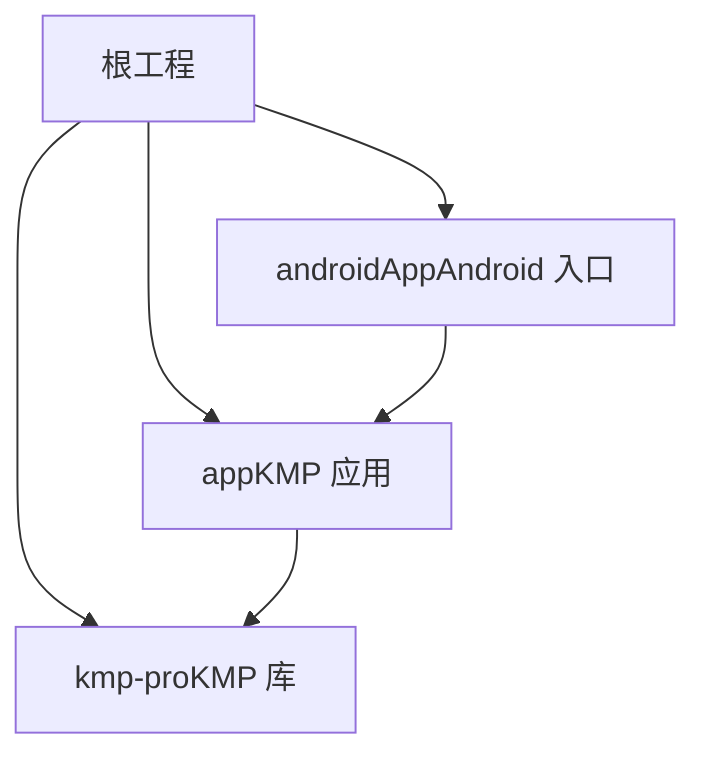
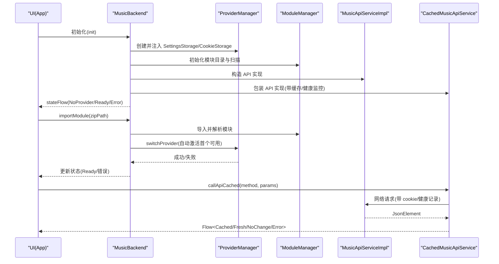
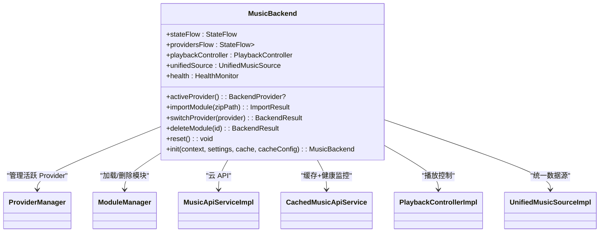
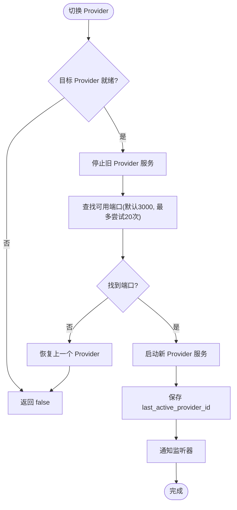
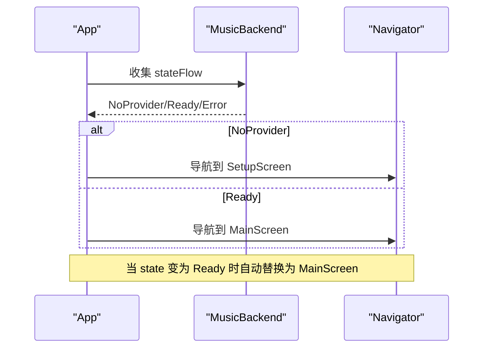
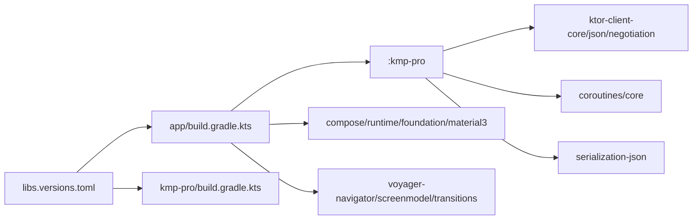

# 开发者指南

<cite>
**本文引用的文件**
- [README.md](file://README.md)
- [build.gradle.kts](file://build.gradle.kts)
- [settings.gradle.kts](file://settings.gradle.kts)
- [gradle.properties](file://gradle.properties)
- [libs.versions.toml](file://gradle/libs.versions.toml)
- [app/build.gradle.kts](file://app/build.gradle.kts)
- [kmp-pro/build.gradle.kts](file://kmp-pro/build.gradle.kts)
- [MusicBackend.kt](file://kmp-pro/src/commonMain/kotlin/cp/player/kmp/MusicBackend.kt)
- [MusicApiServiceFactory.kt](file://kmp-pro/src/commonMain/kotlin/cp/player/kmp/api/MusicApiServiceFactory.kt)
- [ProviderManager.kt](file://kmp-pro/src/commonMain/kotlin/cp/player/kmp/provider/ProviderManager.kt)
- [App.kt](file://app/src/commonMain/kotlin/cp/player/app/App.kt)
- [SetupScreen.kt](file://app/src/commonMain/kotlin/cp/player/app/ui/screen/SetupScreen.kt)
</cite>

## 目录
1. [简介](#简介)
2. [项目结构](#项目结构)
3. [核心组件](#核心组件)
4. [架构总览](#架构总览)
5. [详细组件分析](#详细组件分析)
6. [依赖关系分析](#依赖关系分析)
7. [性能与优化](#性能与优化)
8. [调试与排错](#调试与排错)
9. [开发流程与规范](#开发流程与规范)
10. [发布流程](#发布流程)
11. [常见问题排查](#常见问题排查)
12. [结论](#结论)

## 简介
本指南面向 CPPlayer-KMP 项目的开发者，覆盖从环境搭建、IDE 配置、代码规范、Git 工作流到调试、性能分析与发布的全流程。重点说明 KMP 多平台（Android + Desktop/JVM）开发注意事项、跨平台调试技巧与性能优化方法，并提供可操作的最佳实践与示例路径。

## 项目结构
项目采用 Gradle 多模块组织：
- 根工程定义插件与仓库策略
- kmp-pro：KMP 库模块，提供 Provider 插件系统、API 层、缓存与健康监控等后端能力
- app：KMP 应用模块，基于 Compose Multiplatform，包含 Android 与 Desktop 入口
- androidApp：Android 独立入口（用于单独构建或测试）

**图表来源**
- [settings.gradle.kts:1-26](file://settings.gradle.kts#L1-L26)
- [app/build.gradle.kts:14-64](file://app/build.gradle.kts#L14-L64)
- [kmp-pro/build.gradle.kts:12-66](file://kmp-pro/build.gradle.kts#L12-L66)

**章节来源**
- [settings.gradle.kts:1-26](file://settings.gradle.kts#L1-L26)
- [build.gradle.kts:1-10](file://build.gradle.kts#L1-L10)

## 核心组件
- MusicBackend：统一后端入口，封装状态机、Provider 管理、本地音乐与播放控制，对外暴露 stateFlow 供 UI 观察
- MusicApiServiceFactory：向后兼容的工厂单例，内部委托 MusicBackend
- ProviderManager：活跃 Provider 切换、端口分配、Cookie 隔离存储
- App：Compose 根组件，根据 BackendState 路由到 SetupScreen 或 MainScreen

**章节来源**
- [MusicBackend.kt:30-161](file://kmp-pro/src/commonMain/kotlin/cp/player/kmp/MusicBackend.kt#L30-L161)
- [MusicApiServiceFactory.kt:12-57](file://kmp-pro/src/commonMain/kotlin/cp/player/kmp/api/MusicApiServiceFactory.kt#L12-L57)
- [ProviderManager.kt:15-145](file://kmp-pro/src/commonMain/kotlin/cp/player/kmp/provider/ProviderManager.kt#L15-L145)
- [App.kt:20-71](file://app/src/commonMain/kotlin/cp/player/app/App.kt#L20-L71)

## 架构总览
CPPlayer-KMP 的后端以 MusicBackend 为中心，向上为 UI 提供状态流与数据访问，向下通过 ProviderManager 管理音源模块，并通过 API 层与缓存层实现健壮的网络调用与健康监控。

**图表来源**
- [MusicBackend.kt:330-367](file://kmp-pro/src/commonMain/kotlin/cp/player/kmp/MusicBackend.kt#L330-L367)
- [ProviderManager.kt:80-109](file://kmp-pro/src/commonMain/kotlin/cp/player/kmp/provider/ProviderManager.kt#L80-L109)
- [README.md:66-100](file://README.md#L66-L100)

## 详细组件分析

### MusicBackend：统一后端入口
- 职责：生命周期与状态机、Provider 管理、云/本地音乐访问、播放控制、健康监控
- 关键特性：
  - stateFlow 暴露 NoProvider/Ready/Error 状态，驱动 UI 路由
  - importModule 自动激活首个可用 Provider
  - playbackController 作为唯一播放入口，绑定 PlatformPlayer 与 UnifiedMusicSource
  - 支持 Cookie 按 Provider 隔离

**图表来源**
- [MusicBackend.kt:73-161](file://kmp-pro/src/commonMain/kotlin/cp/player/kmp/MusicBackend.kt#L73-L161)
- [MusicBackend.kt:330-367](file://kmp-pro/src/commonMain/kotlin/cp/player/kmp/MusicBackend.kt#L330-L367)

**章节来源**
- [MusicBackend.kt:30-161](file://kmp-pro/src/commonMain/kotlin/cp/player/kmp/MusicBackend.kt#L30-L161)
- [MusicBackend.kt:330-367](file://kmp-pro/src/commonMain/kotlin/cp/player/kmp/MusicBackend.kt#L330-L367)

### ProviderManager：活跃 Provider 与端口管理
- 负责切换当前 Provider、启动服务、端口探测与回退、持久化最近使用的 Provider ID
- 提供 Cookie 隔离存储（ProviderCookieStorage）

**图表来源**
- [ProviderManager.kt:80-109](file://kmp-pro/src/commonMain/kotlin/cp/player/kmp/provider/ProviderManager.kt#L80-L109)
- [ProviderManager.kt:117-121](file://kmp-pro/src/commonMain/kotlin/cp/player/kmp/provider/ProviderManager.kt#L117-L121)

**章节来源**
- [ProviderManager.kt:15-145](file://kmp-pro/src/commonMain/kotlin/cp/player/kmp/provider/ProviderManager.kt#L15-L145)

### App：Compose 根与路由
- 根据 BackendState 决定初始路由：无 Provider → SetupScreen；已就绪 → MainScreen
- 监听 stateFlow 变化，动态切换到主界面

**图表来源**
- [App.kt:31-71](file://app/src/commonMain/kotlin/cp/player/app/App.kt#L31-L71)

**章节来源**
- [App.kt:20-71](file://app/src/commonMain/kotlin/cp/player/app/App.kt#L20-L71)

## 依赖关系分析
- 版本管理与插件集中声明在 libs.versions.toml
- 根 build.gradle.kts 仅声明插件 apply false，避免重复应用
- app 模块依赖 kmp-pro，并引入 Compose、Voyager、Ktor、Coil、Lyrics 等
- kmp-pro 模块使用 Ktor 客户端、序列化、协程、datetime，并在 jvmMain/androidMain/desktopMain 分别扩展平台能力

**图表来源**
- [libs.versions.toml:1-64](file://gradle/libs.versions.toml#L1-L64)
- [app/build.gradle.kts:24-64](file://app/build.gradle.kts#L24-L64)
- [kmp-pro/build.gradle.kts:29-65](file://kmp-pro/build.gradle.kts#L29-L65)

**章节来源**
- [libs.versions.toml:1-64](file://gradle/libs.versions.toml#L1-L64)
- [app/build.gradle.kts:14-76](file://app/build.gradle.kts#L14-L76)
- [kmp-pro/build.gradle.kts:12-66](file://kmp-pro/build.gradle.kts#L12-L66)

## 性能与优化
- 缓存优先：CachedMusicApiService 先返回缓存，后台拉取网络，指纹比对决定是否回传 Fresh
- 健康监控：三级分类（OK/WARNING/ERROR），ERROR 触发多 Provider 容灾回退
- 端口复用与快速失败：ProviderManager 自动探测端口，失败快速回退
- 建议：
  - 合理设置 CacheConfig.freshTtlMs 与 maxEntries，避免内存膨胀
  - 对高频接口启用缓存，减少网络抖动影响
  - 关注 overallLevelFlow，及时降级或提示用户

**章节来源**
- [README.md:66-100](file://README.md#L66-L100)
- [ProviderManager.kt:65-73](file://kmp-pro/src/commonMain/kotlin/cp/player/kmp/provider/ProviderManager.kt#L65-L73)

## 调试与排错
- 日志与诊断：
  - 查看 ProviderManager 端口占用与启动失败信息
  - 通过 MusicBackend.lastLoadError 获取最近一次导入/加载错误详情
  - 使用 HealthMonitor 的 overallLevelFlow 观察整体健康状态
- 常见场景：
  - 端口被占用：调整起始端口或等待释放
  - JNI 模块不可用：Desktop 端不支持 JNI，对应模块标记不可用
  - 网络异常：缓存降级，UI 显示 fallback 数据

**章节来源**
- [MusicBackend.kt:247-248](file://kmp-pro/src/commonMain/kotlin/cp/player/kmp/MusicBackend.kt#L247-L248)
- [README.md:158-167](file://README.md#L158-L167)

## 开发流程与规范
- 环境搭建
  - 使用 Gradle Wrapper（Gradle 9.4.1），Kotlin 2.4.10，AGP 9.1.1，Compose 1.11.1
  - 确保 JDK 21（desktop 编译要求）
  - 代理设置已在 gradle.properties 中配置
- IDE 配置建议
  - IntelliJ IDEA：启用 Kotlin Multiplatform 插件、Compose 支持
  - Android Studio：安装 Android SDK（compileSdk 36，minSdk 29）
  - 运行 Desktop 应用需安装 JDK 21 及 OpenJFX（由 kmp-pro 桌面依赖自动引入）
- 代码规范约定
  - 使用 kotlinx-serialization 进行 JSON 序列化
  - 遵循官方 Kotlin 代码风格（kotlin.code.style=official）
  - 公共 API 通过 MusicBackend 暴露，禁止直接访问内部组件
- Git 工作流与贡献指南
  - 分支策略：feature/*、bugfix/*、release/*
  - 提交信息：语义化（feat/fix/docs/chore），附变更说明
  - 代码审查：关注状态机迁移、Provider 切换逻辑、缓存策略与健康监控
- 新功能开发流程
  - 在 commonMain 新增跨平台逻辑，必要时在 androidMain/desktopMain/jvmMain 补充 actual
  - 通过 MusicBackend 暴露新能力，保持 UI 解耦
  - 添加单元测试与集成测试，覆盖 Provider 切换与缓存行为
- 代码审查标准
  - 正确性：状态机迁移安全、错误处理完备
  - 性能：避免阻塞主线程、合理使用协程调度
  - 可维护性：模块化、依赖清晰、注释充分

**章节来源**
- [gradle.properties:1-9](file://gradle.properties#L1-L9)
- [libs.versions.toml:1-22](file://gradle/libs.versions.toml#L1-L22)
- [MusicBackend.kt:30-72](file://kmp-pro/src/commonMain/kotlin/cp/player/kmp/MusicBackend.kt#L30-L72)

## 发布流程
- Android 发布
  - 构建 AAR：./gradlew :kmp-pro:assembleDebug
  - 签名与混淆：配置 AGP 签名与 ProGuard/R8 规则
- Desktop 发布
  - 构建可执行 Jar：./gradlew :kmp-pro:desktopJar
  - 原生打包：Dmg/Deb/Msi（Compose Desktop 配置）
- 版本管理
  - 统一在 libs.versions.toml 管理依赖版本
  - 模块版本号在各自 build.gradle.kts 中声明

**章节来源**
- [README.md:30-41](file://README.md#L30-L41)
- [app/build.gradle.kts:67-76](file://app/build.gradle.kts#L67-L76)
- [kmp-pro/build.gradle.kts:12-20](file://kmp-pro/build.gradle.kts#L12-L20)

## 常见问题排查
- 无法启动 Provider
  - 检查端口是否被占用（默认 3000，最多尝试 20 次）
  - 查看 lastLoadError 获取具体错误信息
- 缓存不生效
  - 确认 isCacheable 判断逻辑，写/动作类接口不缓存
  - 检查 CacheConfig 配置是否正确
- 健康监控告警
  - 关注 WARNING/ERROR 级别，及时调整 Provider 或网络策略
- JNI 模块不可用
  - Desktop 端不支持 JNI，相应模块标记不可用

**章节来源**
- [ProviderManager.kt:65-73](file://kmp-pro/src/commonMain/kotlin/cp/player/kmp/provider/ProviderManager.kt#L65-L73)
- [MusicBackend.kt:247-248](file://kmp-pro/src/commonMain/kotlin/cp/player/kmp/MusicBackend.kt#L247-L248)
- [README.md:66-100](file://README.md#L66-L100)
- [README.md:158-167](file://README.md#L158-L167)

## 结论
CPPlayer-KMP 通过 MusicBackend 统一了后端能力，结合 Provider 插件系统与缓存健康监控，实现了跨平台音乐播放的核心功能。开发者应遵循既定规范与流程，充分利用缓存与健康监控提升稳定性，借助调试工具与最佳实践提高开发与维护效率。