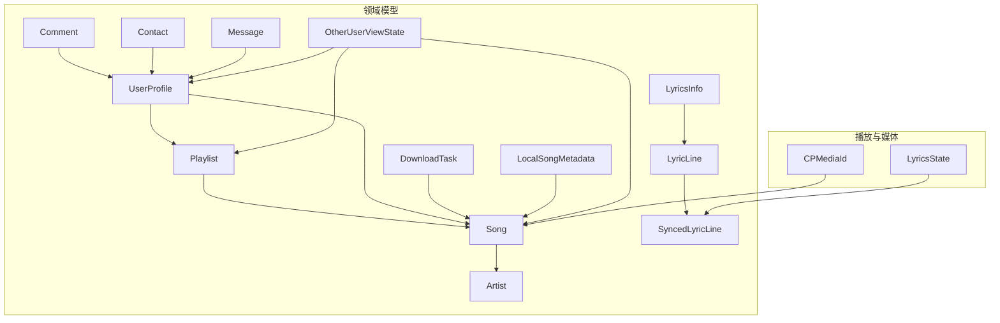
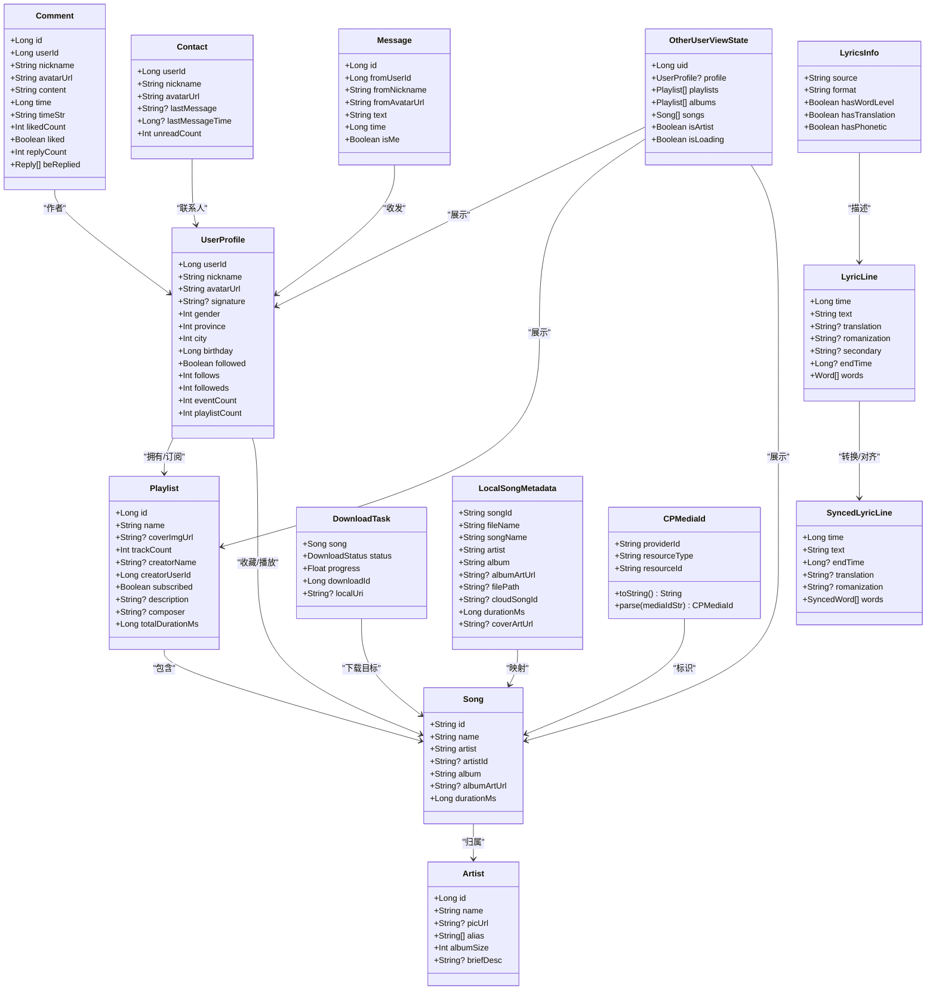
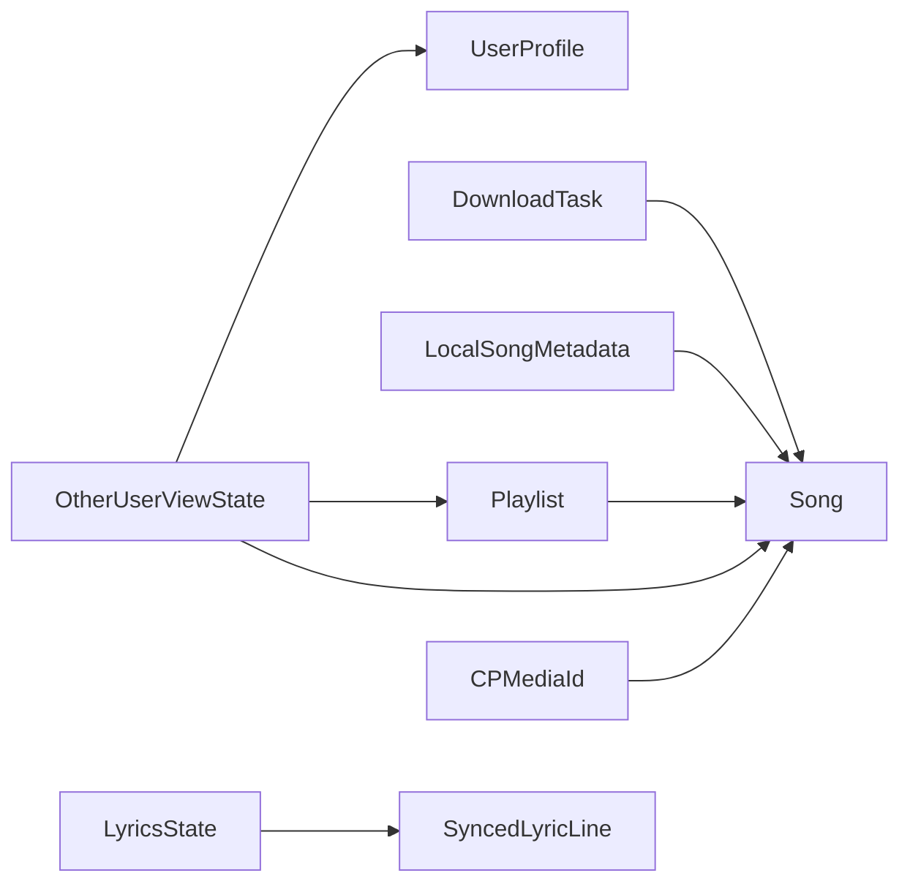
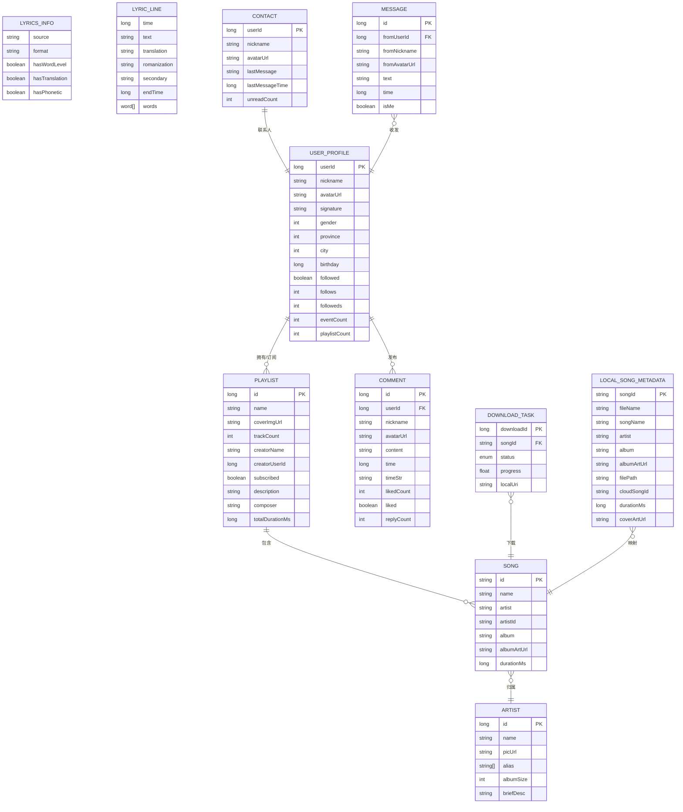

# 数据模型

<cite>
**本文引用的文件**
- [Song.kt](file://kmp-pro/src/commonMain/kotlin/cp/player/kmp/model/Song.kt)
- [Playlist.kt](file://kmp-pro/src/commonMain/kotlin/cp/player/kmp/model/Playlist.kt)
- [Artist.kt](file://kmp-pro/src/commonMain/kotlin/cp/player/kmp/model/Artist.kt)
- [LyricsInfo.kt](file://kmp-pro/src/commonMain/kotlin/cp/player/kmp/model/LyricsInfo.kt)
- [LyricLine.kt](file://kmp-pro/src/commonMain/kotlin/cp/player/kmp/model/LyricLine.kt)
- [SyncedLyricLine.kt](file://kmp-pro/src/commonMain/kotlin/cp/player/kmp/playback/SyncedLyricLine.kt)
- [Comment.kt](file://kmp-pro/src/commonMain/kotlin/cp/player/kmp/model/Comment.kt)
- [UserProfile.kt](file://kmp-pro/src/commonMain/kotlin/cp/player/kmp/model/UserProfile.kt)
- [DownloadTask.kt](file://kmp-pro/src/commonMain/kotlin/cp/player/kmp/model/DownloadTask.kt)
- [LocalSongMetadata.kt](file://kmp-pro/src/commonMain/kotlin/cp/player/kmp/model/LocalSongMetadata.kt)
- [Contact.kt](file://kmp-pro/src/commonMain/kotlin/cp/player/kmp/model/Contact.kt)
- [Message.kt](file://kmp-pro/src/commonMain/kotlin/cp/player/kmp/model/Message.kt)
- [OtherUserViewState.kt](file://kmp-pro/src/commonMain/kotlin/cp/player/kmp/model/OtherUserViewState.kt)
- [CPMediaId.kt](file://kmp-pro/src/commonMain/kotlin/cp/player/kmp/music/CPMediaId.kt)
- [LyricsState.kt](file://kmp-pro/src/commonMain/kotlin/cp/player/kmp/playback/LyricsState.kt)
</cite>

## 目录
1. [简介](#简介)
2. [项目结构](#项目结构)
3. [核心组件](#核心组件)
4. [架构总览](#架构总览)
5. [详细组件分析](#详细组件分析)
6. [依赖关系分析](#依赖关系分析)
7. [性能考虑](#性能考虑)
8. [故障排查指南](#故障排查指南)
9. [结论](#结论)
10. [附录](#附录)

## 简介
本文件为 CPPlayer-KMP 的数据模型提供全面技术文档，覆盖实体关系、字段定义与数据类型、主键/外键与约束、数据验证与业务规则、数据库模式图与示例数据、数据访问模式与缓存策略、生命周期与归档、迁移与版本管理、数据安全与隐私、以及 Song、Playlist、Artist、LyricsInfo 等核心模型的序列化与跨平台兼容性。

## 项目结构
数据模型集中在 kmp-pro 模块的 commonMain 中，采用 Kotlin data class + kotlinx.serialization 注解实现跨平台可序列化的领域模型；播放相关状态与歌词行在 playback 子包中；统一媒体标识在 music 子包中。

图表来源
- [Song.kt:1-14](file://kmp-pro/src/commonMain/kotlin/cp/player/kmp/model/Song.kt#L1-L14)
- [Playlist.kt:1-17](file://kmp-pro/src/commonMain/kotlin/cp/player/kmp/model/Playlist.kt#L1-L17)
- [Artist.kt:1-13](file://kmp-pro/src/commonMain/kotlin/cp/player/kmp/model/Artist.kt#L1-L13)
- [LyricsInfo.kt:1-12](file://kmp-pro/src/commonMain/kotlin/cp/player/kmp/model/LyricsInfo.kt#L1-L12)
- [LyricLine.kt:1-17](file://kmp-pro/src/commonMain/kotlin/cp/player/kmp/model/LyricLine.kt#L1-L17)
- [SyncedLyricLine.kt:1-29](file://kmp-pro/src/commonMain/kotlin/cp/player/kmp/playback/SyncedLyricLine.kt#L1-L29)
- [UserProfile.kt:1-20](file://kmp-pro/src/commonMain/kotlin/cp/player/kmp/model/UserProfile.kt#L1-L20)
- [Comment.kt:1-25](file://kmp-pro/src/commonMain/kotlin/cp/player/kmp/model/Comment.kt#L1-L25)
- [DownloadTask.kt:1-16](file://kmp-pro/src/commonMain/kotlin/cp/player/kmp/model/DownloadTask.kt#L1-L16)
- [LocalSongMetadata.kt:1-22](file://kmp-pro/src/commonMain/kotlin/cp/player/kmp/model/LocalSongMetadata.kt#L1-L22)
- [Contact.kt:1-13](file://kmp-pro/src/commonMain/kotlin/cp/player/kmp/model/Contact.kt#L1-L13)
- [Message.kt:1-14](file://kmp-pro/src/commonMain/kotlin/cp/player/kmp/model/Message.kt#L1-L14)
- [OtherUserViewState.kt:1-14](file://kmp-pro/src/commonMain/kotlin/cp/player/kmp/model/OtherUserViewState.kt#L1-L14)
- [LyricsState.kt:1-41](file://kmp-pro/src/commonMain/kotlin/cp/player/kmp/playback/LyricsState.kt#L1-L41)
- [CPMediaId.kt:1-33](file://kmp-pro/src/commonMain/kotlin/cp/player/kmp/music/CPMediaId.kt#L1-L33)

章节来源
- [Song.kt:1-14](file://kmp-pro/src/commonMain/kotlin/cp/player/kmp/model/Song.kt#L1-L14)
- [Playlist.kt:1-17](file://kmp-pro/src/commonMain/kotlin/cp/player/kmp/model/Playlist.kt#L1-L17)
- [Artist.kt:1-13](file://kmp-pro/src/commonMain/kotlin/cp/player/kmp/model/Artist.kt#L1-L13)
- [LyricsInfo.kt:1-12](file://kmp-pro/src/commonMain/kotlin/cp/player/kmp/model/LyricsInfo.kt#L1-L12)
- [LyricLine.kt:1-17](file://kmp-pro/src/commonMain/kotlin/cp/player/kmp/model/LyricLine.kt#L1-L17)
- [SyncedLyricLine.kt:1-29](file://kmp-pro/src/commonMain/kotlin/cp/player/kmp/playback/SyncedLyricLine.kt#L1-L29)
- [UserProfile.kt:1-20](file://kmp-pro/src/commonMain/kotlin/cp/player/kmp/model/UserProfile.kt#L1-L20)
- [Comment.kt:1-25](file://kmp-pro/src/commonMain/kotlin/cp/player/kmp/model/Comment.kt#L1-L25)
- [DownloadTask.kt:1-16](file://kmp-pro/src/commonMain/kotlin/cp/player/kmp/model/DownloadTask.kt#L1-L16)
- [LocalSongMetadata.kt:1-22](file://kmp-pro/src/commonMain/kotlin/cp/player/kmp/model/LocalSongMetadata.kt#L1-L22)
- [Contact.kt:1-13](file://kmp-pro/src/commonMain/kotlin/cp/player/kmp/model/Contact.kt#L1-L13)
- [Message.kt:1-14](file://kmp-pro/src/commonMain/kotlin/cp/player/kmp/model/Message.kt#L1-L14)
- [OtherUserViewState.kt:1-14](file://kmp-pro/src/commonMain/kotlin/cp/player/kmp/model/OtherUserViewState.kt#L1-L14)
- [LyricsState.kt:1-41](file://kmp-pro/src/commonMain/kotlin/cp/player/kmp/playback/LyricsState.kt#L1-L41)
- [CPMediaId.kt:1-33](file://kmp-pro/src/commonMain/kotlin/cp/player/kmp/music/CPMediaId.kt#L1-L33)

## 核心组件
- 歌曲 Song：唯一标识 id（字符串），名称 name，艺术家 artist，可选 artistId，专辑 album，可选封面 URL albumArtUrl，时长 durationMs（毫秒）。
- 歌单 Playlist：数值型 id，名称 name，可选封面 coverImgUrl，曲目数 trackCount，创建者信息 creatorName/creatorUserId，订阅状态 subscribed，描述 description，作曲 composer，总时长 totalDurationMs。
- 艺人 Artist：数值型 id，名称 name，可选头像 picUrl，别名 alias，专辑数量 albumSize，简介 briefDesc。
- 歌词元信息 LyricsInfo：来源 source，格式 format，是否含逐字 hasWordLevel，是否含翻译 hasTranslation，是否含注音 hasPhonetic。
- 歌词行 LyricLine：时间 time，文本 text，可选翻译 translation，可选罗马音 romanization，可选副文本 secondary，可选结束时间 endTime，可选逐字 words。
- 同步歌词行 SyncedLyricLine：统一播放态歌词行，包含起止时间、翻译、罗马音、逐字时间戳。
- 用户 UserProfile：用户标识 userId，昵称 nickname，头像 avatarUrl，签名 signature，性别 gender，地区 province/city，生日 birthday，关注状态 followed，社交统计 follows/followeds，事件数 eventCount，歌单数 playlistCount。
- 评论 Comment：评论 id，用户 userId，昵称 nickname，头像 avatarUrl，内容 content，时间 time/timeStr，点赞数 likedCount，是否已赞 liked，回复数 replyCount，嵌套回复 beReplied。
- 下载任务 DownloadTask：关联歌曲 song，状态 status，进度 progress，下载标识 downloadId，本地 URI localUri。
- 本地歌曲元数据 LocalSongMetadata：云端歌曲 ID cloudSongId，文件名 fileName，歌曲名 songName，艺术家 artist，专辑 album，音频 URI albumArtUrl，实际路径 filePath，时长 durationMs，封面 coverArtUrl。
- 联系人 Contact：用户 userId，昵称 nickname，头像 avatarUrl，最后消息 lastMessage/lastMessageTime，未读数 unreadCount。
- 消息 Message：id，发送方 fromUserId/fromNickname/fromAvatarUrl，文本 text，时间 time，是否本人 isMe。
- 他人视图 OtherUserViewState：uid，聚合 profile/playlists/albums/songs，是否艺人 isArtist，加载状态 isLoading。
- 媒体标识 CPMediaId：统一 providerId://resourceType/resourceId 格式，支持解析。
- 歌词状态 LyricsState：Idle/Loading/Success/NoLyrics/Error 状态机，队列项 QueueItem 由 TrackSummary 派生。

章节来源
- [Song.kt:1-14](file://kmp-pro/src/commonMain/kotlin/cp/player/kmp/model/Song.kt#L1-L14)
- [Playlist.kt:1-17](file://kmp-pro/src/commonMain/kotlin/cp/player/kmp/model/Playlist.kt#L1-L17)
- [Artist.kt:1-13](file://kmp-pro/src/commonMain/kotlin/cp/player/kmp/model/Artist.kt#L1-L13)
- [LyricsInfo.kt:1-12](file://kmp-pro/src/commonMain/kotlin/cp/player/kmp/model/LyricsInfo.kt#L1-L12)
- [LyricLine.kt:1-17](file://kmp-pro/src/commonMain/kotlin/cp/player/kmp/model/LyricLine.kt#L1-L17)
- [SyncedLyricLine.kt:1-29](file://kmp-pro/src/commonMain/kotlin/cp/player/kmp/playback/SyncedLyricLine.kt#L1-L29)
- [UserProfile.kt:1-20](file://kmp-pro/src/commonMain/kotlin/cp/player/kmp/model/UserProfile.kt#L1-L20)
- [Comment.kt:1-25](file://kmp-pro/src/commonMain/kotlin/cp/player/kmp/model/Comment.kt#L1-L25)
- [DownloadTask.kt:1-16](file://kmp-pro/src/commonMain/kotlin/cp/player/kmp/model/DownloadTask.kt#L1-L16)
- [LocalSongMetadata.kt:1-22](file://kmp-pro/src/commonMain/kotlin/cp/player/kmp/model/LocalSongMetadata.kt#L1-L22)
- [Contact.kt:1-13](file://kmp-pro/src/commonMain/kotlin/cp/player/kmp/model/Contact.kt#L1-L13)
- [Message.kt:1-14](file://kmp-pro/src/commonMain/kotlin/cp/player/kmp/model/Message.kt#L1-L14)
- [OtherUserViewState.kt:1-14](file://kmp-pro/src/commonMain/kotlin/cp/player/kmp/model/OtherUserViewState.kt#L1-L14)
- [LyricsState.kt:1-41](file://kmp-pro/src/commonMain/kotlin/cp/player/kmp/playback/LyricsState.kt#L1-L41)
- [CPMediaId.kt:1-33](file://kmp-pro/src/commonMain/kotlin/cp/player/kmp/music/CPMediaId.kt#L1-L33)

## 架构总览
数据模型以“领域对象”为中心，通过统一的媒体标识 CPMediaId 串联不同来源的媒体资源；播放层使用 SyncedLyricLine 抽象歌词行，LyricsState 管理歌词获取与渲染状态；用户与社交数据通过 UserProfile、Comment、Contact、Message 表达；本地与云端通过 LocalSongMetadata 与 Song 建立映射。

图表来源
- [Song.kt:1-14](file://kmp-pro/src/commonMain/kotlin/cp/player/kmp/model/Song.kt#L1-L14)
- [Playlist.kt:1-17](file://kmp-pro/src/commonMain/kotlin/cp/player/kmp/model/Playlist.kt#L1-L17)
- [Artist.kt:1-13](file://kmp-pro/src/commonMain/kotlin/cp/player/kmp/model/Artist.kt#L1-L13)
- [LyricsInfo.kt:1-12](file://kmp-pro/src/commonMain/kotlin/cp/player/kmp/model/LyricsInfo.kt#L1-L12)
- [LyricLine.kt:1-17](file://kmp-pro/src/commonMain/kotlin/cp/player/kmp/model/LyricLine.kt#L1-L17)
- [SyncedLyricLine.kt:1-29](file://kmp-pro/src/commonMain/kotlin/cp/player/kmp/playback/SyncedLyricLine.kt#L1-L29)
- [UserProfile.kt:1-20](file://kmp-pro/src/commonMain/kotlin/cp/player/kmp/model/UserProfile.kt#L1-L20)
- [Comment.kt:1-25](file://kmp-pro/src/commonMain/kotlin/cp/player/kmp/model/Comment.kt#L1-L25)
- [DownloadTask.kt:1-16](file://kmp-pro/src/commonMain/kotlin/cp/player/kmp/model/DownloadTask.kt#L1-L16)
- [LocalSongMetadata.kt:1-22](file://kmp-pro/src/commonMain/kotlin/cp/player/kmp/model/LocalSongMetadata.kt#L1-L22)
- [Contact.kt:1-13](file://kmp-pro/src/commonMain/kotlin/cp/player/kmp/model/Contact.kt#L1-L13)
- [Message.kt:1-14](file://kmp-pro/src/commonMain/kotlin/cp/player/kmp/model/Message.kt#L1-L14)
- [OtherUserViewState.kt:1-14](file://kmp-pro/src/commonMain/kotlin/cp/player/kmp/model/OtherUserViewState.kt#L1-L14)
- [CPMediaId.kt:1-33](file://kmp-pro/src/commonMain/kotlin/cp/player/kmp/music/CPMediaId.kt#L1-L33)

## 详细组件分析

### 歌曲 Song
- 主键：id（字符串，跨源唯一）
- 业务规则：durationMs 非负；artistId 可选但建议存在以关联艺人
- 索引建议：按 name、artist、album 建二级索引用于搜索与排序
- 约束：name、artist、album 非空；id 唯一
- 序列化：使用 @Serializable，跨平台兼容 JSON/二进制
- 示例数据：id="netease://song/12345", name="晴天", artist="周杰伦", artistId="1001", album="叶惠美", albumArtUrl="https://...", durationMs=269000

章节来源
- [Song.kt:1-14](file://kmp-pro/src/commonMain/kotlin/cp/player/kmp/model/Song.kt#L1-L14)

### 歌单 Playlist
- 主键：id（长整型，平台内唯一）
- 业务规则：trackCount ≥ 0；totalDurationMs ≥ 0；subscribed 表示订阅状态
- 索引建议：按 creatorUserId、name 建索引
- 约束：name 非空；id 唯一
- 序列化：@Serializable
- 示例数据：id=10001, name="我的最爱", creatorUserId=1001, trackCount=50, totalDurationMs=9000000

章节来源
- [Playlist.kt:1-17](file://kmp-pro/src/commonMain/kotlin/cp/player/kmp/model/Playlist.kt#L1-L17)

### 艺人 Artist
- 主键：id（长整型）
- 业务规则：alias 可为空列表；albumSize ≥ 0
- 索引建议：按 name、alias 建索引
- 约束：name 非空；id 唯一
- 序列化：@Serializable
- 示例数据：id=1001, name="周杰伦", alias=["Jay"], albumSize=15

章节来源
- [Artist.kt:1-13](file://kmp-pro/src/commonMain/kotlin/cp/player/kmp/model/Artist.kt#L1-L13)

### 歌词元信息 LyricsInfo
- 字段：source/format 描述来源与格式；hasWordLevel/hasTranslation/hasPhonetic 标记能力
- 用途：决定 UI 展示与播放器行为（如是否显示逐字、翻译、注音）
- 序列化：@Serializable

章节来源
- [LyricsInfo.kt:1-12](file://kmp-pro/src/commonMain/kotlin/cp/player/kmp/model/LyricsInfo.kt#L1-L12)

### 歌词行 LyricLine 与 SyncedLyricLine
- LyricLine：原始传输格式的行级结构，支持翻译、罗马音、副文本、逐字时间戳
- SyncedLyricLine：播放态统一结构，确保时间轴一致，便于跨格式对齐
- 业务规则：time ≤ endTime；words 的时间区间需有序且不重叠
- 序列化：两者均 @Serializable，便于网络与本地存储
- 示例数据：time=12000, text="等待你的出现", endTime=16000, translation="Waiting for your arrival"

章节来源
- [LyricLine.kt:1-17](file://kmp-pro/src/commonMain/kotlin/cp/player/kmp/model/LyricLine.kt#L1-L17)
- [SyncedLyricLine.kt:1-29](file://kmp-pro/src/commonMain/kotlin/cp/player/kmp/playback/SyncedLyricLine.kt#L1-L29)

### 用户 UserProfile、评论 Comment、联系人 Contact、消息 Message
- UserProfile：用户基础信息与社交统计
- Comment：评论及嵌套回复，支持点赞计数与时间字符串
- Contact：会话摘要，支持未读计数
- Message：聊天消息，区分是否本人
- 约束：userId、nickname、avatarUrl 等关键信息非空；时间戳合理
- 序列化：@Serializable

章节来源
- [UserProfile.kt:1-20](file://kmp-pro/src/commonMain/kotlin/cp/player/kmp/model/UserProfile.kt#L1-L20)
- [Comment.kt:1-25](file://kmp-pro/src/commonMain/kotlin/cp/player/kmp/model/Comment.kt#L1-L25)
- [Contact.kt:1-13](file://kmp-pro/src/commonMain/kotlin/cp/player/kmp/model/Contact.kt#L1-L13)
- [Message.kt:1-14](file://kmp-pro/src/commonMain/kotlin/cp/player/kmp/model/Message.kt#L1-L14)

### 下载任务 DownloadTask 与本地元数据 LocalSongMetadata
- DownloadTask：跟踪下载状态、进度与本地 URI
- LocalSongMetadata：本地扫描得到的歌曲元数据，包含音频 URI、实际路径、云端映射 cloudSongId、封面 coverArtUrl
- 约束：durationMs ≥ 0；filePath/albumArtUrl 至少其一有效
- 序列化：@Serializable

章节来源
- [DownloadTask.kt:1-16](file://kmp-pro/src/commonMain/kotlin/cp/player/kmp/model/DownloadTask.kt#L1-L16)
- [LocalSongMetadata.kt:1-22](file://kmp-pro/src/commonMain/kotlin/cp/player/kmp/model/LocalSongMetadata.kt#L1-L22)

### 他人视图 OtherUserViewState
- 聚合展示某用户的资料、歌单、专辑、歌曲列表与加载状态
- 约束：isLoading 与数据集合一致性

章节来源
- [OtherUserViewState.kt:1-14](file://kmp-pro/src/commonMain/kotlin/cp/player/kmp/model/OtherUserViewState.kt#L1-L14)

### 统一媒体标识 CPMediaId
- 格式：providerId://resourceType/resourceId
- 作用：跨来源媒体资源的统一标识，便于路由到对应 Source
- 解析：提供 parse 方法，非法格式抛出异常
- 示例：local://song//storage/.../song.mp3；netease://song/12345

章节来源
- [CPMediaId.kt:1-33](file://kmp-pro/src/commonMain/kotlin/cp/player/kmp/music/CPMediaId.kt#L1-L33)

### 歌词状态 LyricsState
- 状态机：Idle → Loading → Success/NoLyrics/Error
- 成功态包含按时间升序排列的歌词行
- 队列项 QueueItem 由 TrackSummary 派生，避免前端重复转换

章节来源
- [LyricsState.kt:1-41](file://kmp-pro/src/commonMain/kotlin/cp/player/kmp/playback/LyricsState.kt#L1-L41)

## 依赖关系分析
- 强耦合：Playlist 依赖 Song；DownloadTask 依赖 Song；LocalSongMetadata 依赖 Song；OtherUserViewState 聚合多模型
- 弱耦合：LyricsInfo 仅描述歌词能力；LyricLine/SyncedLyricLine 解耦具体格式
- 外部依赖：kotlinx.serialization 提供跨平台序列化；播放层依赖统一歌词行结构

图表来源
- [Playlist.kt:1-17](file://kmp-pro/src/commonMain/kotlin/cp/player/kmp/model/Playlist.kt#L1-L17)
- [Song.kt:1-14](file://kmp-pro/src/commonMain/kotlin/cp/player/kmp/model/Song.kt#L1-L14)
- [DownloadTask.kt:1-16](file://kmp-pro/src/commonMain/kotlin/cp/player/kmp/model/DownloadTask.kt#L1-L16)
- [LocalSongMetadata.kt:1-22](file://kmp-pro/src/commonMain/kotlin/cp/player/kmp/model/LocalSongMetadata.kt#L1-L22)
- [OtherUserViewState.kt:1-14](file://kmp-pro/src/commonMain/kotlin/cp/player/kmp/model/OtherUserViewState.kt#L1-L14)
- [LyricsState.kt:1-41](file://kmp-pro/src/commonMain/kotlin/cp/player/kmp/playback/LyricsState.kt#L1-L41)
- [SyncedLyricLine.kt:1-29](file://kmp-pro/src/commonMain/kotlin/cp/player/kmp/playback/SyncedLyricLine.kt#L1-L29)
- [CPMediaId.kt:1-33](file://kmp-pro/src/commonMain/kotlin/cp/player/kmp/music/CPMediaId.kt#L1-L33)

章节来源
- [Playlist.kt:1-17](file://kmp-pro/src/commonMain/kotlin/cp/player/kmp/model/Playlist.kt#L1-L17)
- [Song.kt:1-14](file://kmp-pro/src/commonMain/kotlin/cp/player/kmp/model/Song.kt#L1-L14)
- [DownloadTask.kt:1-16](file://kmp-pro/src/commonMain/kotlin/cp/player/kmp/model/DownloadTask.kt#L1-L16)
- [LocalSongMetadata.kt:1-22](file://kmp-pro/src/commonMain/kotlin/cp/player/kmp/model/LocalSongMetadata.kt#L1-L22)
- [OtherUserViewState.kt:1-14](file://kmp-pro/src/commonMain/kotlin/cp/player/kmp/model/OtherUserViewState.kt#L1-L14)
- [LyricsState.kt:1-41](file://kmp-pro/src/commonMain/kotlin/cp/player/kmp/playback/LyricsState.kt#L1-L41)
- [SyncedLyricLine.kt:1-29](file://kmp-pro/src/commonMain/kotlin/cmp/player/kmp/playback/SyncedLyricLine.kt#L1-L29)
- [CPMediaId.kt:1-33](file://kmp-pro/src/commonMain/kotlin/cp/player/kmp/music/CPMediaId.kt#L1-L33)

## 性能考虑
- 序列化开销：所有模型使用 @Serializable，建议在批量场景下复用编码器/解码器实例
- 内存占用：歌词行列表可能较大，按需分页加载并按时间排序后缓存
- 索引与查询：对高频查询字段（如 name、artist、creatorUserId）建立索引以提升检索性能
- 网络与缓存：结合 API 缓存策略（如基于指纹的缓存）减少重复请求
- 本地存储：LocalSongMetadata 中的 URI/路径应避免频繁 I/O，必要时做去重与懒加载

[本节为通用指导，不直接分析具体文件]

## 故障排查指南
- 媒体标识解析失败：检查 CPMediaId 格式是否符合 providerId://resourceType/resourceId，非法格式将抛出异常
- 歌词时间轴异常：确保 time ≤ endTime，words 时间区间有序且不重叠；若为空则按行级展示
- 下载任务卡住：检查 status 与 progress 的一致性，确认 localUri 是否有效
- 歌单曲目数不一致：校验 trackCount 与实际曲目列表长度，必要时重新计算 totalDurationMs

章节来源
- [CPMediaId.kt:1-33](file://kmp-pro/src/commonMain/kotlin/cp/player/kmp/music/CPMediaId.kt#L1-L33)
- [LyricLine.kt:1-17](file://kmp-pro/src/commonMain/kotlin/cp/player/kmp/model/LyricLine.kt#L1-L17)
- [SyncedLyricLine.kt:1-29](file://kmp-pro/src/commonMain/kotlin/cp/player/kmp/playback/SyncedLyricLine.kt#L1-L29)
- [DownloadTask.kt:1-16](file://kmp-pro/src/commonMain/kotlin/cp/player/kmp/model/DownloadTask.kt#L1-L16)
- [Playlist.kt:1-17](file://kmp-pro/src/commonMain/kotlin/cp/player/kmp/model/Playlist.kt#L1-L17)

## 结论
CPPlayer-KMP 的数据模型以轻量、可序列化、跨平台为核心设计原则，通过统一媒体标识与播放态歌词行抽象，实现了多来源媒体资源的一致化表达与高效处理。Song、Playlist、Artist、LyricsInfo 等核心模型具备清晰的字段语义与约束，配合合理的索引与缓存策略，可在多端保持一致体验。后续应持续完善数据验证、迁移与权限控制，确保长期演进的可维护性与安全性。

[本节为总结性内容，不直接分析具体文件]

## 附录

### 数据库模式图（概念）

图表来源
- [Song.kt:1-14](file://kmp-pro/src/commonMain/kotlin/cp/player/kmp/model/Song.kt#L1-L14)
- [Playlist.kt:1-17](file://kmp-pro/src/commonMain/kotlin/cp/player/kmp/model/Playlist.kt#L1-L17)
- [Artist.kt:1-13](file://kmp-pro/src/commonMain/kotlin/cp/player/kmp/model/Artist.kt#L1-L13)
- [LyricsInfo.kt:1-12](file://kmp-pro/src/commonMain/kotlin/cp/player/kmp/model/LyricsInfo.kt#L1-L12)
- [LyricLine.kt:1-17](file://kmp-pro/src/commonMain/kotlin/cp/player/kmp/model/LyricLine.kt#L1-L17)
- [UserProfile.kt:1-20](file://kmp-pro/src/commonMain/kotlin/cp/player/kmp/model/UserProfile.kt#L1-L20)
- [Comment.kt:1-25](file://kmp-pro/src/commonMain/kotlin/cp/player/kmp/model/Comment.kt#L1-L25)
- [DownloadTask.kt:1-16](file://kmp-pro/src/commonMain/kotlin/cp/player/kmp/model/DownloadTask.kt#L1-L16)
- [LocalSongMetadata.kt:1-22](file://kmp-pro/src/commonMain/kotlin/cp/player/kmp/model/LocalSongMetadata.kt#L1-L22)
- [Contact.kt:1-13](file://kmp-pro/src/commonMain/kotlin/cp/player/kmp/model/Contact.kt#L1-L13)
- [Message.kt:1-14](file://kmp-pro/src/commonMain/kotlin/cp/player/kmp/model/Message.kt#L1-L14)

### 数据访问模式与缓存策略
- 读取优先：热门歌单与歌曲列表采用缓存+预取，降低首屏延迟
- 增量更新：评论、消息等高频变更数据采用增量拉取与本地合并
- 歌词缓存：按媒体标识缓存已解析的 SyncedLyricLine，避免重复解析
- 本地扫描：LocalSongMetadata 定期扫描并去重，必要时触发封面提取与元数据补全

[本节为通用指导，不直接分析具体文件]

### 数据生命周期、保留与归档
- 短期：播放队列与歌词状态随会话清理
- 中期：评论、消息按用户设置保留一定周期
- 长期：歌单、收藏、本地元数据持久化；归档冷数据至压缩存储
- 清理策略：过期缓存与临时文件自动回收，避免磁盘膨胀

[本节为通用指导，不直接分析具体文件]

### 数据迁移与版本管理
- 向后兼容：新增字段默认值或可空，避免破坏旧客户端
- 迁移脚本：按版本号执行增量迁移，保证幂等
- 回滚策略：重要迁移前备份，支持回滚到上一版本

[本节为通用指导，不直接分析具体文件]

### 数据安全、隐私与访问控制
- 敏感字段：用户信息、本地路径等加密存储或受控访问
- 最小权限：仅必要模块访问用户与本地数据
- 脱敏输出：日志与调试信息去除敏感字段
- 合规要求：遵循平台隐私政策，提供用户数据导出与删除入口

[本节为通用指导，不直接分析具体文件]

### 核心模型序列化与跨平台兼容性
- 所有模型使用 @Serializable，确保 JSON/二进制在多平台一致
- 时间单位统一为毫秒，避免时区与精度问题
- 可选字段使用可空类型，提升向前/向后兼容性
- 媒体标识统一格式，便于跨源路由与解析

章节来源
- [Song.kt:1-14](file://kmp-pro/src/commonMain/kotlin/cp/player/kmp/model/Song.kt#L1-L14)
- [Playlist.kt:1-17](file://kmp-pro/src/commonMain/kotlin/cp/player/kmp/model/Playlist.kt#L1-L17)
- [Artist.kt:1-13](file://kmp-pro/src/commonMain/kotlin/cp/player/kmp/model/Artist.kt#L1-L13)
- [LyricsInfo.kt:1-12](file://kmp-pro/src/commonMain/kotlin/cp/player/kmp/model/LyricsInfo.kt#L1-L12)
- [LyricLine.kt:1-17](file://kmp-pro/src/commonMain/kotlin/cp/player/kmp/model/LyricLine.kt#L1-L17)
- [SyncedLyricLine.kt:1-29](file://kmp-pro/src/commonMain/kotlin/cp/player/kmp/playback/SyncedLyricLine.kt#L1-L29)
- [CPMediaId.kt:1-33](file://kmp-pro/src/commonMain/kotlin/cp/player/kmp/music/CPMediaId.kt#L1-L33)