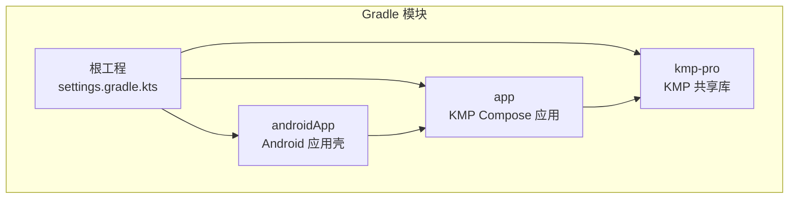
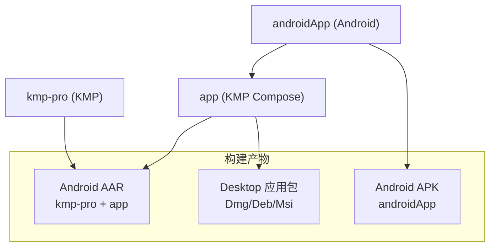
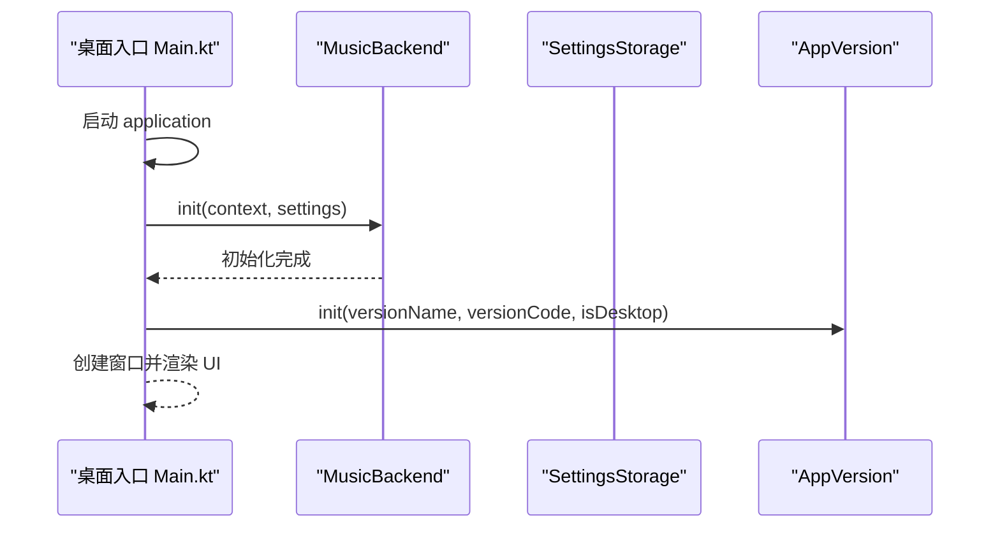
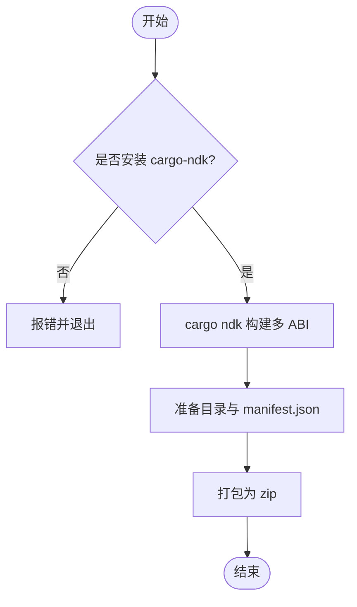
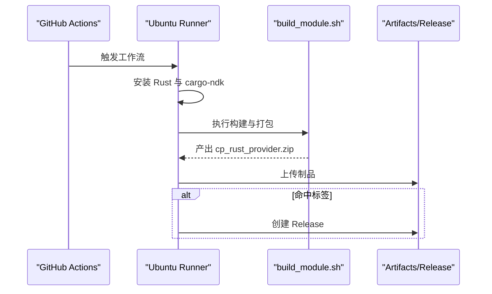
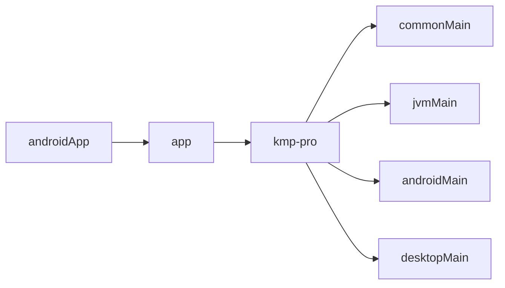

# 构建与部署

<cite>
**本文引用的文件**
- [settings.gradle.kts](file://settings.gradle.kts)
- [build.gradle.kts](file://build.gradle.kts)
- [gradle.properties](file://gradle.properties)
- [libs.versions.toml](file://gradle/libs.versions.toml)
- [kmp-pro/build.gradle.kts](file://kmp-pro/build.gradle.kts)
- [app/build.gradle.kts](file://app/build.gradle.kts)
- [androidApp/build.gradle.kts](file://androidApp/build.gradle.kts)
- [androidApp/src/main/AndroidManifest.xml](file://androidApp/src/main/AndroidManifest.xml)
- [app/src/desktopMain/kotlin/cp/player/app/Main.kt](file://app/src/desktopMain/kotlin/cp/player/app/Main.kt)
- [kmp-pro/src/commonMain/kotlin/cp/player/kmp/util/SettingsStorage.kt](file://kmp-pro/src/commonMain/kotlin/cp/player/kmp/util/SettingsStorage.kt)
- [kmp-pro/src/androidMain/kotlin/cp/player/kmp/util/PlatformInfo.kt](file://kmp-pro/src/androidMain/kotlin/cp/player/kmp/util/PlatformInfo.kt)
- [API_MODULE_AND_OLD_PROJECT_REPO/3rd-CPPlayer-netcloudMusic-Muti/build_module.sh](file://API_MODULE_AND_OLD_PROJECT_REPO/3rd-CPPlayer-netcloudMusic-Muti/build_module.sh)
- [API_MODULE_AND_OLD_PROJECT_REPO/3rd-CPPlayer-netcloudMusic-Muti/build_module_desktop.sh](file://API_MODULE_AND_OLD_PROJECT_REPO/3rd-CPPlayer-netcloudMusic-Muti/build_module_desktop.sh)
- [API_MODULE_AND_OLD_PROJECT_REPO/3rd-CPPlayer-netcloudMusic-Muti/.github/workflows/build.yml](file://API_MODULE_AND_OLD_PROJECT_REPO/3rd-CPPlayer-netcloudMusic-Muti/.github/workflows/build.yml)
</cite>

## 目录
1. [简介](#简介)
2. [项目结构](#项目结构)
3. [核心组件](#核心组件)
4. [架构总览](#架构总览)
5. [详细组件分析](#详细组件分析)
6. [依赖关系分析](#依赖关系分析)
7. [性能考虑](#性能考虑)
8. [故障排查指南](#故障排查指南)
9. [结论](#结论)
10. [附录](#附录)

## 简介
本文件面向 CPPlayer-KMP 项目的构建与部署，覆盖 Gradle 多模块构建、依赖版本管理、构建脚本定制、Android AAR 打包、Desktop JAR/原生包生成、环境变量与签名配置、发布渠道设置、CI/CD 流水线、自动化测试与部署脚本、构建优化、增量编译、调试构建方法，以及 KMP 项目的特殊构建要求、平台差异和发布前验证步骤。

## 项目结构
本项目采用 Gradle 多模块组织：
- 根工程声明插件与仓库策略，统一版本管理与模块包含。
- kmp-pro：KMP 共享库，提供跨平台音乐后端能力（网络、缓存、播放控制、Provider 管理等）。
- app：KMP Compose 应用层，同时支持 Android 与 Desktop（Compose for Desktop），并定义桌面应用入口与分发格式。
- androidApp：Android 应用壳，负责启动、权限、网络与安全配置，并依赖 app 模块。

图表来源
- [settings.gradle.kts:1-26](file://settings.gradle.kts#L1-L26)
- [kmp-pro/build.gradle.kts:1-66](file://kmp-pro/build.gradle.kts#L1-L66)
- [app/build.gradle.kts:1-76](file://app/build.gradle.kts#L1-L76)
- [androidApp/build.gradle.kts:1-41](file://androidApp/build.gradle.kts#L1-L41)

章节来源
- [settings.gradle.kts:1-26](file://settings.gradle.kts#L1-L26)
- [build.gradle.kts:1-10](file://build.gradle.kts#L1-L10)

## 核心组件
- 版本与依赖集中管理：通过 libs.versions.toml 统一管理 AGP、Kotlin、Compose、Ktor、Media3、JDK/JFX 等版本，并在各模块以 alias 引用。
- 多平台目标：kmp-pro 与 app 均启用 Kotlin Multiplatform，分别定义 commonMain、jvmMain、androidMain、desktopMain，并按需引入平台特定依赖。
- 桌面应用分发：app 模块使用 Compose Desktop 配置 nativeDistributions，输出 Dmg/Deb/Msi 安装包。
- Android 应用壳：androidApp 模块定义 applicationId、SDK 版本、权限、网络与安全策略，并通过 BuildConfig 注入 Git SHA。

章节来源
- [libs.versions.toml:1-64](file://gradle/libs.versions.toml#L1-L64)
- [kmp-pro/build.gradle.kts:12-66](file://kmp-pro/build.gradle.kts#L12-L66)
- [app/build.gradle.kts:14-76](file://app/build.gradle.kts#L14-L76)
- [androidApp/build.gradle.kts:15-40](file://androidApp/build.gradle.kts#L15-L40)

## 架构总览
下图展示构建产物与模块依赖关系，以及桌面端初始化流程的关键节点。

图表来源
- [kmp-pro/build.gradle.kts:12-66](file://kmp-pro/build.gradle.kts#L12-L66)
- [app/build.gradle.kts:14-76](file://app/build.gradle.kts#L14-L76)
- [androidApp/build.gradle.kts:15-40](file://androidApp/build.gradle.kts#L15-L40)

## 详细组件分析

### Gradle 多模块与版本管理
- 根级 settings.gradle.kts 声明 pluginManagement 与 dependencyResolutionManagement，限定 Google、Maven Central、Gradle Plugin Portal 的访问范围与顺序。
- build.gradle.kts 仅声明插件别名，不直接引入实现，保持根工程轻量。
- gradle.properties 配置 JVM 参数、AndroidX、非传递 RClass、代理等全局行为。
- libs.versions.toml 集中管理所有第三方库与插件版本，便于统一升级与回滚。

章节来源
- [settings.gradle.kts:1-26](file://settings.gradle.kts#L1-L26)
- [build.gradle.kts:1-10](file://build.gradle.kts#L1-L10)
- [gradle.properties:1-9](file://gradle.properties#L1-L9)
- [libs.versions.toml:1-64](file://gradle/libs.versions.toml#L1-L64)

### KMP 共享库（kmp-pro）构建配置
- 启用 Kotlin Multiplatform，定义 jvmMain 作为公共 JVM 层，androidMain 与 desktopMain 均依赖 jvmMain。
- commonMain 引入协程、序列化、时间库与 Ktor 客户端核心；jvmMain 引入 OkHttp 客户端；androidMain 引入 Media3 与 Android 相关依赖；desktopMain 引入 JavaFX、DBus-Java、JNA 等桌面端依赖。
- 桌面端根据操作系统与架构动态选择 JavaFX classifier，确保正确加载图形与基础库。

章节来源
- [kmp-pro/build.gradle.kts:12-66](file://kmp-pro/build.gradle.kts#L12-L66)

### 应用层（app）构建配置与桌面分发
- 启用 Kotlin Multiplatform、Compose 与 Android KMP Library 插件。
- 定义 Android 与 Desktop 目标，commonMain 依赖 kmp-pro 及 UI、网络、序列化等库；androidMain 与 desktopMain 分别引入平台特定依赖。
- compose.desktop.application 指定主类、原生分发格式（Dmg/Deb/Msi）、包名与版本号。

章节来源
- [app/build.gradle.kts:1-76](file://app/build.gradle.kts#L1-L76)

### Android 应用壳（androidApp）
- 定义 applicationId、SDK 版本、BuildConfig 字段注入 Git SHA。
- 声明网络与系统状态权限，启用明文流量与网络安全配置。
- 依赖 app 模块与 Android 运行时库。

章节来源
- [androidApp/build.gradle.kts:1-41](file://androidApp/build.gradle.kts#L1-L41)
- [androidApp/src/main/AndroidManifest.xml:1-28](file://androidApp/src/main/AndroidManifest.xml#L1-L28)

### 桌面端初始化流程
- 桌面应用入口在 app 模块的 desktopMain，启动时初始化 MusicBackend 与 AppVersion，并创建 Compose Window。
- 该流程保证后端在 UI 渲染前完成初始化，避免资源竞争。

图表来源
- [app/src/desktopMain/kotlin/cp/player/app/Main.kt:1-39](file://app/src/desktopMain/kotlin/cp/player/app/Main.kt#L1-L39)

章节来源
- [app/src/desktopMain/kotlin/cp/player/app/Main.kt:1-39](file://app/src/desktopMain/kotlin/cp/player/app/Main.kt#L1-L39)

### 平台抽象与存储
- SettingsStorage 为键值存储抽象，expect/actual 在各平台提供实现，用于 Cookie、最近 Provider ID、缓存元信息等。
- PlatformInfo 在 Android 上暴露支持的 ABI 列表与模块目录路径，供模块加载器使用。

章节来源
- [kmp-pro/src/commonMain/kotlin/cp/player/kmp/util/SettingsStorage.kt:1-25](file://kmp-pro/src/commonMain/kotlin/cp/player/kmp/util/SettingsStorage.kt#L1-L25)
- [kmp-pro/src/androidMain/kotlin/cp/player/kmp/util/PlatformInfo.kt:1-13](file://kmp-pro/src/androidMain/kotlin/cp/player/kmp/util/PlatformInfo.kt#L1-L13)

### Rust JNI 模块构建与打包（可选扩展）
- 提供两个脚本分别用于 Android 多 ABI 与桌面平台的 Rust JNI 模块构建与打包。
- Android 脚本要求安装 cargo-ndk，自动探测 NDK，编译并生成多 ABI 布局与 manifest.json，最终打包为 zip。
- 桌面脚本根据操作系统与架构选择目标三元组，生成对应动态库与 manifest，并打包为 zip。

图表来源
- [API_MODULE_AND_OLD_PROJECT_REPO/3rd-CPPlayer-netcloudMusic-Muti/build_module.sh:1-82](file://API_MODULE_AND_OLD_PROJECT_REPO/3rd-CPPlayer-netcloudMusic-Muti/build_module.sh#L1-L82)

章节来源
- [API_MODULE_AND_OLD_PROJECT_REPO/3rd-CPPlayer-netcloudMusic-Muti/build_module.sh:1-82](file://API_MODULE_AND_OLD_PROJECT_REPO/3rd-CPPlayer-netcloudMusic-Muti/build_module.sh#L1-L82)
- [API_MODULE_AND_OLD_PROJECT_REPO/3rd-CPPlayer-netcloudMusic-Muti/build_module_desktop.sh:1-82](file://API_MODULE_AND_OLD_PROJECT_REPO/3rd-CPPlayer-netcloudMusic-Muti/build_module_desktop.sh#L1-L82)

### CI/CD 流水线（Rust 模块）
- GitHub Actions 在 push/tag 触发，安装 Rust 工具链与 cargo-ndk，执行构建脚本并上传制品，在 tag 发布时创建 Release。

图表来源
- [API_MODULE_AND_OLD_PROJECT_REPO/3rd-CPPlayer-netcloudMusic-Muti/.github/workflows/build.yml:1-44](file://API_MODULE_AND_OLD_PROJECT_REPO/3rd-CPPlayer-netcloudMusic-Muti/.github/workflows/build.yml#L1-L44)

章节来源
- [API_MODULE_AND_OLD_PROJECT_REPO/3rd-CPPlayer-netcloudMusic-Muti/.github/workflows/build.yml:1-44](file://API_MODULE_AND_OLD_PROJECT_REPO/3rd-CPPlayer-netcloudMusic-Muti/.github/workflows/build.yml#L1-L44)

## 依赖关系分析
- 版本集中化：所有第三方库与插件版本集中在 libs.versions.toml，通过 alias 在各模块引用，降低版本漂移风险。
- 模块耦合：androidApp 依赖 app，app 依赖 kmp-pro；kmp-pro 通过 expect/actual 解耦平台差异。
- 平台差异：desktopMain 引入 JavaFX、DBus-Java、JNA；androidMain 引入 Media3 与 Android 库；jvmMain 提供通用 HTTP 客户端实现。

图表来源
- [settings.gradle.kts:22-26](file://settings.gradle.kts#L22-L26)
- [kmp-pro/build.gradle.kts:22-66](file://kmp-pro/build.gradle.kts#L22-L66)
- [app/build.gradle.kts:24-64](file://app/build.gradle.kts#L24-L64)

章节来源
- [libs.versions.toml:23-64](file://gradle/libs.versions.toml#L23-L64)
- [kmp-pro/build.gradle.kts:22-66](file://kmp-pro/build.gradle.kts#L22-L66)
- [app/build.gradle.kts:24-64](file://app/build.gradle.kts#L24-L64)

## 性能考虑
- 构建并行与缓存：启用 Gradle 构建缓存与守护进程，合理划分模块粒度，减少跨模块变更带来的全量重建。
- 增量编译：利用 Kotlin Multiplatform 的源集隔离，仅在受影响的目标重新编译；避免不必要的 platformMain 变更。
- 依赖优化：按需引入平台依赖，避免将重型库放入 commonMain；使用 BOM/版本目录统一升级。
- 桌面分发：nativeDistributions 仅包含必要资源，减少包体积；按需裁剪 JavaFX 组件。

[本节为通用指导，无需具体文件引用]

## 故障排查指南
- 代理与网络：gradle.properties 中配置了 HTTP/HTTPS 代理，若构建失败请检查代理地址与端口是否正确。
- Android 权限与网络：androidApp 的 AndroidManifest.xml 声明了网络权限与明文流量开关，若出现网络问题请确认证书与网络安全配置。
- 桌面端初始化：确保桌面入口在创建窗口前完成后端初始化，避免空指针或资源未就绪。
- Rust JNI 模块：构建脚本依赖 cargo-ndk 与 NDK，缺失时将导致构建失败；请确保环境变量与工具链安装正确。

章节来源
- [gradle.properties:6-9](file://gradle.properties#L6-L9)
- [androidApp/src/main/AndroidManifest.xml:4-13](file://androidApp/src/main/AndroidManifest.xml#L4-L13)
- [app/src/desktopMain/kotlin/cp/player/app/Main.kt:20-38](file://app/src/desktopMain/kotlin/cp/player/app/Main.kt#L20-L38)
- [API_MODULE_AND_OLD_PROJECT_REPO/3rd-CPPlayer-netcloudMusic-Muti/build_module.sh:7-27](file://API_MODULE_AND_OLD_PROJECT_REPO/3rd-CPPlayer-netcloudMusic-Muti/build_module.sh#L7-L27)

## 结论
本项目通过 Gradle 多模块与 KMP 实现了跨平台复用与差异化构建，借助版本目录与集中化配置提升可维护性。Android 与 Desktop 的构建流程清晰，桌面端支持原生分发，CI/CD 覆盖 Rust 模块的自动化构建与发布。建议在生产环境完善签名配置与多渠道发布流程，并结合构建缓存与增量编译进一步优化构建速度。

[本节为总结，无需具体文件引用]

## 附录

### 构建命令参考
- 清理与构建全部模块：./gradlew clean assemble
- 仅构建 Android 应用：./gradlew :androidApp:assembleDebug
- 仅构建 Desktop 应用包：./gradlew :app:packageDistributionForCurrentOS
- 仅构建 KMP 共享库：./gradlew :kmp-pro:assemble

[本节为通用指导，无需具体文件引用]

### 环境变量与签名配置
- 环境变量：gradle.properties 已配置代理；如需自定义 NDK 路径或签名信息，可在本地 gradle.properties 或 CI 中注入。
- 签名配置：当前仓库未包含签名脚本或密钥配置，建议在 CI 中通过安全变量注入 keystore 与密码，并在 androidApp 模块的 android {} 块中配置 signingConfigs 与 buildTypes。

[本节为通用指导，无需具体文件引用]

### 发布渠道与产物
- Android：androidApp 模块产出 APK/AAB（取决于任务），可通过 CI 上传至内部渠道或应用商店。
- Desktop：app 模块通过 compose.desktop 输出 Dmg/Deb/Msi，适合桌面分发。
- Rust 模块：通过脚本产出 zip，可在运行时由 KMP 后端加载。

章节来源
- [app/build.gradle.kts:67-76](file://app/build.gradle.kts#L67-L76)
- [API_MODULE_AND_OLD_PROJECT_REPO/3rd-CPPlayer-netcloudMusic-Muti/build_module.sh:29-82](file://API_MODULE_AND_OLD_PROJECT_REPO/3rd-CPPlayer-netcloudMusic-Muti/build_module.sh#L29-L82)

### 构建优化与调试技巧
- 构建缓存：启用 Gradle 构建缓存与远程缓存（如需要），加速重复构建。
- 增量编译：尽量在受影响模块内修改代码，避免跨模块大范围改动。
- 调试构建：使用 -Pandroid.debug.symbols=true 等参数（按平台需求）导出符号以便定位崩溃；桌面端可使用 IDE 断点调试。

[本节为通用指导，无需具体文件引用]

### KMP 特殊构建要求与验证
- 源集依赖：kmp-pro 中 jvmMain 被 androidMain 与 desktopMain 依赖，确保公共逻辑放在 jvmMain/commonMain。
- 平台差异：desktopMain 依赖 JavaFX 与平台库，需在桌面环境运行；androidMain 依赖 Media3，需在 Android 环境运行。
- 发布前验证：
  - Android：在真机或模拟器安装并验证网络、播放与 Provider 加载。
  - Desktop：在不同 OS 下运行并验证窗口渲染与媒体集成。
  - Rust 模块：在目标平台加载并验证动态库可用性。

章节来源
- [kmp-pro/build.gradle.kts:22-66](file://kmp-pro/build.gradle.kts#L22-L66)
- [app/build.gradle.kts:14-76](file://app/build.gradle.kts#L14-L76)
- [API_MODULE_AND_OLD_PROJECT_REPO/3rd-CPPlayer-netcloudMusic-Muti/build_module_desktop.sh:9-40](file://API_MODULE_AND_OLD_PROJECT_REPO/3rd-CPPlayer-netcloudMusic-Muti/build_module_desktop.sh#L9-L40)