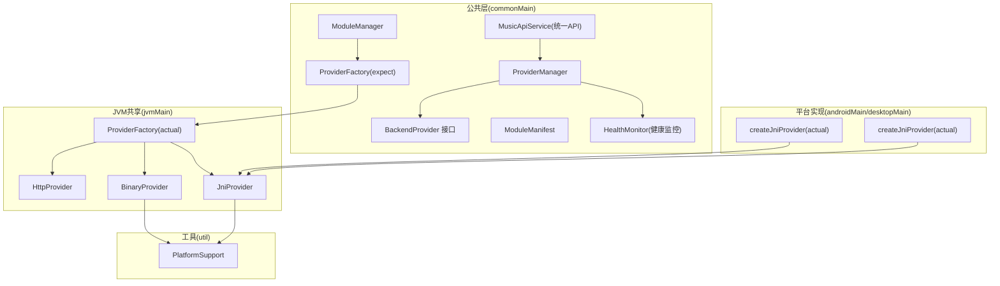
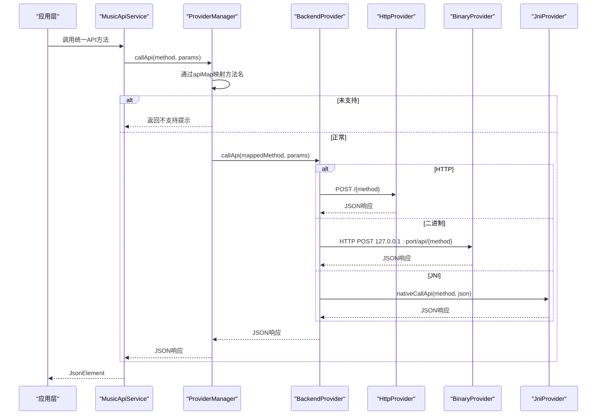
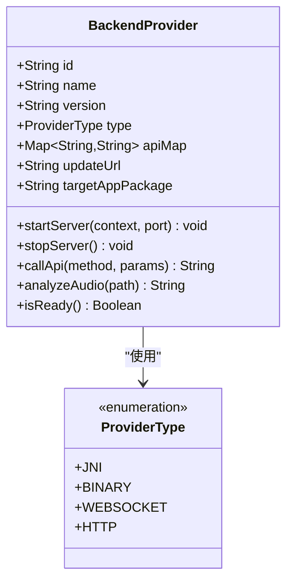
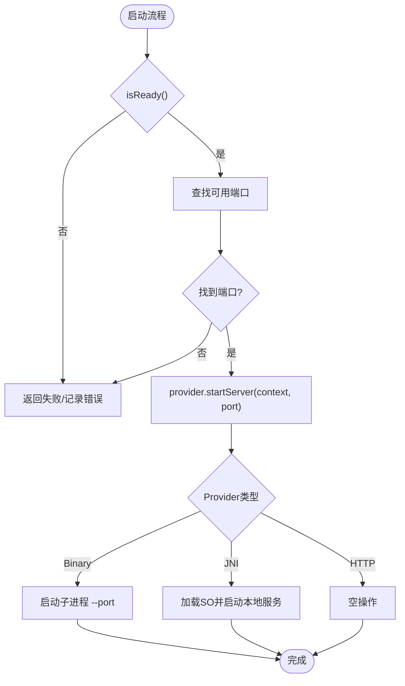
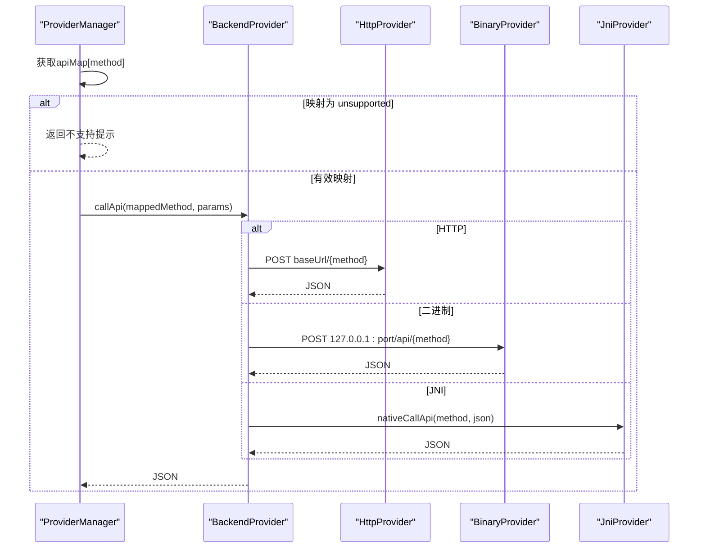
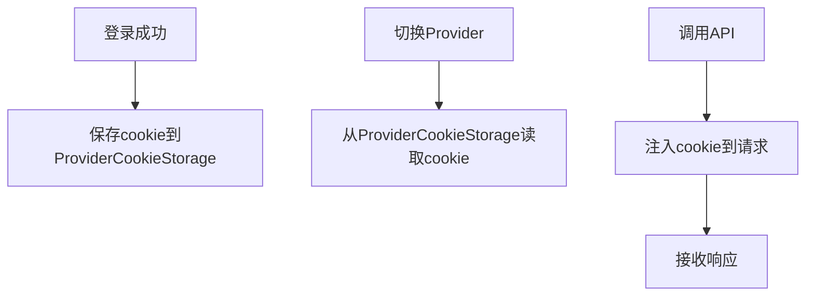
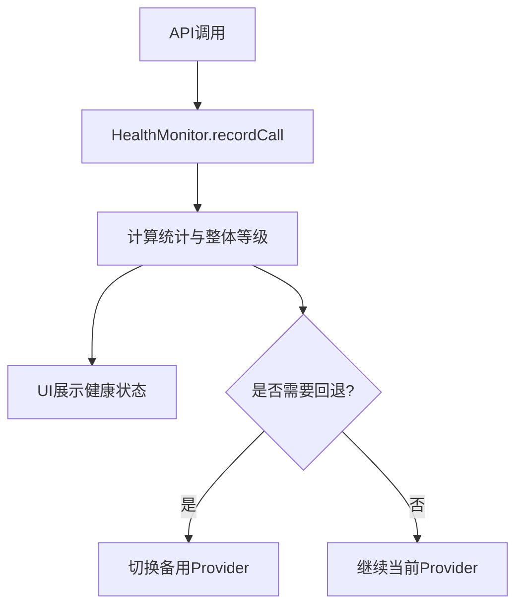
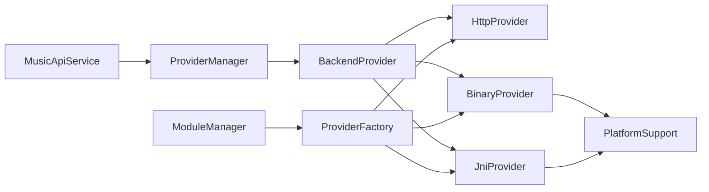

# BackendProvider 接口规范

<cite>
**本文引用的文件**
- [BackendProvider.kt](file://kmp-pro/src/commonMain/kotlin/cp/player/kmp/provider/BackendProvider.kt)
- [HttpProvider.kt](file://kmp-pro/src/commonMain/kotlin/cp/player/kmp/provider/HttpProvider.kt)
- [BinaryProvider.kt](file://kmp-pro/src/jvmMain/kotlin/cp/player/kmp/provider/BinaryProvider.kt)
- [JniProvider.kt](file://kmp-pro/src/jvmMain/kotlin/cp/player/kmp/provider/JniProvider.kt)
- [ModuleManager.kt](file://kmp-pro/src/commonMain/kotlin/cp/player/kmp/provider/ModuleManager.kt)
- [ModuleManifest.kt](file://kmp-pro/src/commonMain/kotlin/cp/player/kmp/provider/ModuleManifest.kt)
- [ProviderFactory.kt](file://kmp-pro/src/commonMain/kotlin/cp/player/kmp/provider/ProviderFactory.kt)
- [ProviderFactory (android).kt](file://kmp-pro/src/androidMain/kotlin/cp/player/kmp/provider/ProviderFactory.kt)
- [ProviderFactory (desktop).kt](file://kmp-pro/src/desktopMain/kotlin/cp/player/kmp/provider/ProviderFactory.kt)
- [ProviderFactory (jvm).kt](file://kmp-pro/src/jvmMain/kotlin/cp/player/kmp/provider/ProviderFactory.kt)
- [ProviderManager.kt](file://kmp-pro/src/commonMain/kotlin/cp/player/kmp/provider/ProviderManager.kt)
- [MusicApiService.kt](file://kmp-pro/src/commonMain/kotlin/cp/player/kmp/api/MusicApiService.kt)
- [HealthMonitor.kt](file://kmp-pro/src/commonMain/kotlin/cp/player/kmp/monitor/HealthMonitor.kt)
- [PlatformSupport.kt](file://kmp-pro/src/commonMain/kotlin/cp/player/kmp/util/PlatformSupport.kt)
</cite>

## 目录
1. [简介](#简介)
2. [项目结构](#项目结构)
3. [核心组件](#核心组件)
4. [架构总览](#架构总览)
5. [详细组件分析](#详细组件分析)
6. [依赖关系分析](#依赖关系分析)
7. [性能考量](#性能考量)
8. [故障排查指南](#故障排查指南)
9. [结论](#结论)
10. [附录](#附录)

## 简介
本规范围绕 BackendProvider 接口，系统化阐述其设计意图、扩展机制、方法映射与 API 路由、生命周期管理、Cookie 隔离与健康检查、错误处理约定、配置与参数传递、自定义 Provider 实现指南，以及 Android/Desktop 平台的差异与适配方案。目标是让开发者在不了解底层细节的前提下，安全地接入或扩展新的音乐后端服务。

## 项目结构
本项目采用 KMP（Kotlin Multiplatform）分层组织：
- commonMain：定义跨平台接口与通用逻辑（BackendProvider、ProviderManager、ModuleManager、API 服务、健康监控等）。
- jvmMain：提供 JVM 共享的 Provider 实现（BinaryProvider、JniProvider）与工厂。
- androidMain/desktopMain：平台特定的 ProviderFactory 实际实现，用于创建 JNI Provider。
- util：平台抽象（PlatformSupport），封装端口探测、文件系统、ELF 校验、入口解析等能力。

图表来源
- [BackendProvider.kt:24-96](file://kmp-pro/src/commonMain/kotlin/cp/player/kmp/provider/BackendProvider.kt#L24-L96)
- [ProviderManager.kt:31-145](file://kmp-pro/src/commonMain/kotlin/cp/player/kmp/provider/ProviderManager.kt#L31-L145)
- [ModuleManager.kt:19-137](file://kmp-pro/src/commonMain/kotlin/cp/player/kmp/provider/ModuleManager.kt#L19-L137)
- [ModuleManifest.kt:5-31](file://kmp-pro/src/commonMain/kotlin/cp/player/kmp/provider/ModuleManifest.kt#L5-L31)
- [ProviderFactory.kt:11-29](file://kmp-pro/src/commonMain/kotlin/cp/player/kmp/provider/ProviderFactory.kt#L11-L29)
- [ProviderFactory (jvm).kt:5-31](file://kmp-pro/src/jvmMain/kotlin/cp/player/kmp/provider/ProviderFactory.kt#L5-L31)
- [ProviderFactory (android).kt:1-13](file://kmp-pro/src/androidMain/kotlin/cp/player/kmp/provider/ProviderFactory.kt#L1-L13)
- [ProviderFactory (desktop).kt:1-13](file://kmp-pro/src/desktopMain/kotlin/cp/player/kmp/provider/ProviderFactory.kt#L1-L13)
- [HttpProvider.kt:23-60](file://kmp-pro/src/commonMain/kotlin/cp/player/kmp/provider/HttpProvider.kt#L23-L60)
- [BinaryProvider.kt:25-108](file://kmp-pro/src/jvmMain/kotlin/cp/player/kmp/provider/BinaryProvider.kt#L25-L108)
- [JniProvider.kt:9-142](file://kmp-pro/src/jvmMain/kotlin/cp/player/kmp/provider/JniProvider.kt#L9-L142)
- [PlatformSupport.kt:13-59](file://kmp-pro/src/commonMain/kotlin/cp/player/kmp/util/PlatformSupport.kt#L13-L59)

章节来源
- [BackendProvider.kt:24-96](file://kmp-pro/src/commonMain/kotlin/cp/player/kmp/provider/BackendProvider.kt#L24-L96)
- [ProviderManager.kt:31-145](file://kmp-pro/src/commonMain/kotlin/cp/player/kmp/provider/ProviderManager.kt#L31-L145)
- [ModuleManager.kt:19-137](file://kmp-pro/src/commonMain/kotlin/cp/player/kmp/provider/ModuleManager.kt#L19-L137)
- [ModuleManifest.kt:5-31](file://kmp-pro/src/commonMain/kotlin/cp/player/kmp/provider/ModuleManifest.kt#L5-L31)
- [ProviderFactory.kt:11-29](file://kmp-pro/src/commonMain/kotlin/cp/player/kmp/provider/ProviderFactory.kt#L11-L29)
- [ProviderFactory (jvm).kt:5-31](file://kmp-pro/src/jvmMain/kotlin/cp/player/kmp/provider/ProviderFactory.kt#L5-L31)
- [ProviderFactory (android).kt:1-13](file://kmp-pro/src/androidMain/kotlin/cp/player/kmp/provider/ProviderFactory.kt#L1-L13)
- [ProviderFactory (desktop).kt:1-13](file://kmp-pro/src/desktopMain/kotlin/cp/player/kmp/provider/ProviderFactory.kt#L1-L13)
- [HttpProvider.kt:23-60](file://kmp-pro/src/commonMain/kotlin/cp/player/kmp/provider/HttpProvider.kt#L23-L60)
- [BinaryProvider.kt:25-108](file://kmp-pro/src/jvmMain/kotlin/cp/player/kmp/provider/BinaryProvider.kt#L25-L108)
- [JniProvider.kt:9-142](file://kmp-pro/src/jvmMain/kotlin/cp/player/kmp/provider/JniProvider.kt#L9-L142)
- [PlatformSupport.kt:13-59](file://kmp-pro/src/commonMain/kotlin/cp/player/kmp/util/PlatformSupport.kt#L13-L59)

## 核心组件
- BackendProvider：统一的音乐后端抽象，定义标识、名称、版本、类型、API 映射、更新地址、目标 App 包名、启动/停止、调用 API、音频分析与就绪检查。
- ProviderManager：当前 Provider 的生命周期与切换、端口分配、API 调用桥接、状态流与持久化。
- ModuleManager：模块扫描、导入、加载、删除；按 manifest 创建 Provider 并维护可用列表。
- ProviderFactory：根据 manifest 类型创建具体 Provider（HTTP/BINARY/JNI），JNI 通过 expect/actual 分派到平台实现。
- HttpProvider/BinaryProvider/JniProvider：三种后端通信方式的具体实现。
- MusicApiService：应用内统一 API 入口，屏蔽底层 Provider 差异。
- HealthMonitor：对 API 调用的健康度进行记录、统计与整体等级评估。
- PlatformSupport：跨平台能力抽象（端口探测、文件操作、ELF 校验、入口解析）。

章节来源
- [BackendProvider.kt:24-96](file://kmp-pro/src/commonMain/kotlin/cp/player/kmp/provider/BackendProvider.kt#L24-L96)
- [ProviderManager.kt:31-145](file://kmp-pro/src/commonMain/kotlin/cp/player/kmp/provider/ProviderManager.kt#L31-L145)
- [ModuleManager.kt:19-137](file://kmp-pro/src/commonMain/kotlin/cp/player/kmp/provider/ModuleManager.kt#L19-L137)
- [ProviderFactory.kt:11-29](file://kmp-pro/src/commonMain/kotlin/cp/player/kmp/provider/ProviderFactory.kt#L11-L29)
- [HttpProvider.kt:23-60](file://kmp-pro/src/commonMain/kotlin/cp/player/kmp/provider/HttpProvider.kt#L23-L60)
- [BinaryProvider.kt:25-108](file://kmp-pro/src/jvmMain/kotlin/cp/player/kmp/provider/BinaryProvider.kt#L25-L108)
- [JniProvider.kt:9-142](file://kmp-pro/src/jvmMain/kotlin/cp/player/kmp/provider/JniProvider.kt#L9-L142)
- [MusicApiService.kt:24-528](file://kmp-pro/src/commonMain/kotlin/cp/player/kmp/api/MusicApiService.kt#L24-L528)
- [HealthMonitor.kt:25-290](file://kmp-pro/src/commonMain/kotlin/cp/player/kmp/monitor/HealthMonitor.kt#L25-L290)
- [PlatformSupport.kt:13-59](file://kmp-pro/src/commonMain/kotlin/cp/player/kmp/util/PlatformSupport.kt#L13-L59)

## 架构总览
BackendProvider 作为核心抽象，被 ProviderManager 统一管理并通过 MusicApiService 暴露给上层业务。模块通过 ModuleManager 动态加载，由 ProviderFactory 根据 manifest 创建具体实现。健康监控贯穿 API 调用链路，提供可观测性。

图表来源
- [MusicApiService.kt:24-528](file://kmp-pro/src/commonMain/kotlin/cp/player/kmp/api/MusicApiService.kt#L24-L528)
- [ProviderManager.kt:123-141](file://kmp-pro/src/commonMain/kotlin/cp/player/kmp/provider/ProviderManager.kt#L123-L141)
- [HttpProvider.kt:41-57](file://kmp-pro/src/commonMain/kotlin/cp/player/kmp/provider/HttpProvider.kt#L41-L57)
- [BinaryProvider.kt:88-104](file://kmp-pro/src/jvmMain/kotlin/cp/player/kmp/provider/BinaryProvider.kt#L88-L104)
- [JniProvider.kt:61-84](file://kmp-pro/src/jvmMain/kotlin/cp/player/kmp/provider/JniProvider.kt#L61-L84)

## 详细组件分析

### BackendProvider 接口与 ProviderType
- 设计意图：为不同音乐数据源提供统一抽象，屏蔽底层差异（HTTP、独立进程、JNI）。
- 关键成员：
  - id/name/version/type：标识与元信息。
  - apiMap：内部标准方法名到 Provider 端点名的映射，支持“unsupported”标记。
  - updateUrl/targetAppPackage：可选更新与跳转目标 App。
  - startServer/stopServer：生命周期控制。
  - callApi/analyzeAudio：核心调用与可选音频分析。
  - isReady：就绪检查（默认 true，JNI 可在加载失败时返回 false）。
- ProviderType：枚举 JNI/BINARY/WEBSOCKET/HTTP，用于区分实现类型。

图表来源
- [BackendProvider.kt:24-110](file://kmp-pro/src/commonMain/kotlin/cp/player/kmp/provider/BackendProvider.kt#L24-L110)

章节来源
- [BackendProvider.kt:24-110](file://kmp-pro/src/commonMain/kotlin/cp/player/kmp/provider/BackendProvider.kt#L24-L110)

### Provider 生命周期：初始化、启动、停止与资源清理
- 初始化：
  - ModuleManager 扫描 modulesDir，读取 manifest.json，调用 ProviderFactory.create 创建实例。
  - 创建后调用 isReady 检查可用性（如 JNI 库缺失则不可用）。
- 启动：
  - ProviderManager.startServer 选择可用端口并调用 provider.startServer(context, port)。
  - BinaryProvider 启动子进程并传入 --port；JniProvider 加载 .so/.dll/.dylib 并启动本地服务；HttpProvider 为空操作。
- 停止：
  - ProviderManager.switchProvider 在切换前尝试 stopServer；BinaryProvider 销毁进程；JniProvider 重置加载状态；HttpProvider 无状态。
- 资源清理：
  - BinaryProvider 释放进程句柄；JniProvider 重置 isLoaded 与 loadError；HttpProvider 无需额外清理。

图表来源
- [ModuleManager.kt:38-48](file://kmp-pro/src/commonMain/kotlin/cp/player/kmp/provider/ModuleManager.kt#L38-L48)
- [ModuleManager.kt:88-117](file://kmp-pro/src/commonMain/kotlin/cp/player/kmp/provider/ModuleManager.kt#L88-L117)
- [ProviderManager.kt:62-73](file://kmp-pro/src/commonMain/kotlin/cp/player/kmp/provider/ProviderManager.kt#L62-L73)
- [BinaryProvider.kt:54-81](file://kmp-pro/src/jvmMain/kotlin/cp/player/kmp/provider/BinaryProvider.kt#L54-L81)
- [JniProvider.kt:39-55](file://kmp-pro/src/jvmMain/kotlin/cp/player/kmp/provider/JniProvider.kt#L39-L55)
- [HttpProvider.kt:38-39](file://kmp-pro/src/commonMain/kotlin/cp/player/kmp/provider/HttpProvider.kt#L38-L39)

章节来源
- [ModuleManager.kt:38-48](file://kmp-pro/src/commonMain/kotlin/cp/player/kmp/provider/ModuleManager.kt#L38-L48)
- [ModuleManager.kt:88-117](file://kmp-pro/src/commonMain/kotlin/cp/player/kmp/provider/ModuleManager.kt#L88-L117)
- [ProviderManager.kt:62-73](file://kmp-pro/src/commonMain/kotlin/cp/player/kmp/provider/ProviderManager.kt#L62-L73)
- [BinaryProvider.kt:54-81](file://kmp-pro/src/jvmMain/kotlin/cp/player/kmp/provider/BinaryProvider.kt#L54-L81)
- [JniProvider.kt:39-55](file://kmp-pro/src/jvmMain/kotlin/cp/player/kmp/provider/JniProvider.kt#L39-L55)
- [HttpProvider.kt:38-39](file://kmp-pro/src/commonMain/kotlin/cp/player/kmp/provider/HttpProvider.kt#L38-L39)

### 方法映射机制与 API 路由系统
- 方法映射：
  - BackendProvider.apiMap 将 CPPlayer 内部标准方法名映射到 Provider 的实际端点名。
  - 若映射为 "unsupported"，表示该功能在当前 Provider 不支持。
  - 若为 null，直接使用内部方法名。
- API 路由：
  - ProviderManager.callApi 负责取当前 Provider、执行映射、调用底层 callApi。
  - HttpProvider 通过 POST 到 baseUrl/{method} 发送请求。
  - BinaryProvider 通过 POST 到 http://127.0.0.1:{port}/api/{method}。
  - JniProvider 通过 nativeCallApi 直接调用本地函数。

图表来源
- [ProviderManager.kt:123-141](file://kmp-pro/src/commonMain/kotlin/cp/player/kmp/provider/ProviderManager.kt#L123-L141)
- [HttpProvider.kt:41-57](file://kmp-pro/src/commonMain/kotlin/cp/player/kmp/provider/HttpProvider.kt#L41-L57)
- [BinaryProvider.kt:88-104](file://kmp-pro/src/jvmMain/kotlin/cp/player/kmp/provider/BinaryProvider.kt#L88-L104)
- [JniProvider.kt:61-84](file://kmp-pro/src/jvmMain/kotlin/cp/player/kmp/provider/JniProvider.kt#L61-L84)

章节来源
- [ProviderManager.kt:123-141](file://kmp-pro/src/commonMain/kotlin/cp/player/kmp/provider/ProviderManager.kt#L123-L141)
- [HttpProvider.kt:41-57](file://kmp-pro/src/commonMain/kotlin/cp/player/kmp/provider/HttpProvider.kt#L41-L57)
- [BinaryProvider.kt:88-104](file://kmp-pro/src/jvmMain/kotlin/cp/player/kmp/provider/BinaryProvider.kt#L88-L104)
- [JniProvider.kt:61-84](file://kmp-pro/src/jvmMain/kotlin/cp/player/kmp/provider/JniProvider.kt#L61-L84)

### Cookie 隔离机制与多账号支持
- 隔离策略：
  - ProviderCookieStorage 以 providerId 为键前缀存储 cookie（如 cookie_<providerId>）。
  - 切换 Provider 时，自动切换到对应账号体系，确保歌单、推荐等数据与 Provider 绑定。
- 会话管理：
  - 登录成功后，上层应调用 ProviderCookieStorage.saveCookie 保存 cookie。
  - 调用 API 时，可通过 MusicApiService 的 cookie 参数覆盖默认 cookie，实现多账号并发。
- 持久化：
  - 通过 SettingsStorage 持久化最近活跃的 Provider ID，重启后恢复。

图表来源
- [ProviderManager.kt:147-156](file://kmp-pro/src/commonMain/kotlin/cp/player/kmp/provider/ProviderManager.kt#L147-L156)
- [MusicApiService.kt:24-528](file://kmp-pro/src/commonMain/kotlin/cp/player/kmp/api/MusicApiService.kt#L24-L528)

章节来源
- [ProviderManager.kt:147-156](file://kmp-pro/src/commonMain/kotlin/cp/player/kmp/provider/ProviderManager.kt#L147-L156)
- [MusicApiService.kt:24-528](file://kmp-pro/src/commonMain/kotlin/cp/player/kmp/api/MusicApiService.kt#L24-L528)

### 健康检查接口与服务状态监控
- 就绪检查：
  - BackendProvider.isReady 用于快速判断 Provider 是否可用（如 JNI 库加载失败返回 false）。
  - ModuleManager 在加载模块后调用 isReady，失败则记录 lastLoadError。
- 健康监控：
  - HealthMonitor 记录每次 API 调用的时间、成功与否、警告类型、回退信息等。
  - 提供综合健康等级（OK/WARNING/ERROR）、统计指标（成功率、平均耗时、P95、回退次数）与最近记录查询。
- 故障检测：
  - 通过 classify 将响应警告归类为健康等级，便于 UI 展示与降级策略。

图表来源
- [ModuleManager.kt:106-117](file://kmp-pro/src/commonMain/kotlin/cp/player/kmp/provider/ModuleManager.kt#L106-L117)
- [HealthMonitor.kt:25-290](file://kmp-pro/src/commonMain/kotlin/cp/player/kmp/monitor/HealthMonitor.kt#L25-L290)

章节来源
- [ModuleManager.kt:106-117](file://kmp-pro/src/commonMain/kotlin/cp/player/kmp/provider/ModuleManager.kt#L106-L117)
- [HealthMonitor.kt:25-290](file://kmp-pro/src/commonMain/kotlin/cp/player/kmp/monitor/HealthMonitor.kt#L25-L290)

### 错误处理约定与异常传播
- 统一错误格式：
  - 所有 Provider 调用失败时返回 {"code": 500, "msg": "..."} 格式的 JSON。
  - ProviderManager 对异常进行捕获并包装为统一错误响应。
- 异常传播：
  - BinaryProvider/JniProvider 在启动或调用失败时抛出异常，ProviderManager 捕获并回滚到上一个 Provider。
  - JniProvider 在 JNI 崩溃时重置加载状态并记录错误。
- 诊断信息：
  - ModuleManager.lastLoadError 提供最近一次导入/加载失败的错误信息。
  - HealthMonitor 记录错误码、错误消息、原始响应等，便于定位问题。

章节来源
- [ProviderManager.kt:80-109](file://kmp-pro/src/commonMain/kotlin/cp/player/kmp/provider/ProviderManager.kt#L80-L109)
- [ProviderManager.kt:123-141](file://kmp-pro/src/commonMain/kotlin/cp/player/kmp/provider/ProviderManager.kt#L123-L141)
- [BinaryProvider.kt:54-81](file://kmp-pro/src/jvmMain/kotlin/cp/player/kmp/provider/BinaryProvider.kt#L54-L81)
- [JniProvider.kt:39-55](file://kmp-pro/src/jvmMain/kotlin/cp/player/kmp/provider/JniProvider.kt#L39-L55)
- [ModuleManager.kt:29-31](file://kmp-pro/src/commonMain/kotlin/cp/player/kmp/provider/ModuleManager.kt#L29-L31)
- [HealthMonitor.kt:58-75](file://kmp-pro/src/commonMain/kotlin/cp/player/kmp/monitor/HealthMonitor.kt#L58-L75)

### Provider 配置管理与参数传递
- 模块清单：
  - ModuleManifest 描述模块 id/name/version/type/entryPoint/apiMap/updateUrl/supportedAbis/targetAppPackage。
  - 支持多 ABI 声明，加载器按设备 ABI 选择正确的入口文件。
- 参数传递：
  - callApi 的参数 Map<String, String> 会被序列化为 JSON 对象传递给后端。
  - 特殊字符（如 cookie 中的引号、反斜杠）通过序列化自动转义。
- 配置来源：
  - ProviderFactory 根据 manifest.type 创建对应 Provider，并注入 baseUrl/binaryPath/soPath 等路径。
  - PlatformSupport.resolveEntryPoint 按 ABI 顺序解析实际入口路径。

章节来源
- [ModuleManifest.kt:5-31](file://kmp-pro/src/commonMain/kotlin/cp/player/kmp/provider/ModuleManifest.kt#L5-L31)
- [ProviderFactory (jvm).kt:5-31](file://kmp-pro/src/jvmMain/kotlin/cp/player/kmp/provider/ProviderFactory.kt#L5-L31)
- [PlatformSupport.kt:38-46](file://kmp-pro/src/commonMain/kotlin/cp/player/kmp/util/PlatformSupport.kt#L38-L46)
- [HttpProvider.kt:41-57](file://kmp-pro/src/commonMain/kotlin/cp/player/kmp/provider/HttpProvider.kt#L41-L57)
- [BinaryProvider.kt:88-104](file://kmp-pro/src/jvmMain/kotlin/cp/player/kmp/provider/BinaryProvider.kt#L88-L104)
- [JniProvider.kt:61-84](file://kmp-pro/src/jvmMain/kotlin/cp/player/kmp/provider/JniProvider.kt#L61-L84)

### 自定义 Provider 实现指南
- 接口实现：
  - 实现 BackendProvider，至少提供 id/name/version/type/startServer/stopServer/callApi/isReady。
  - 如需音频分析，实现 analyzeAudio。
- 注册流程：
  - 在 manifest.json 中声明模块信息与入口。
  - 通过 ModuleManager.importModule 导入 zip 模块包，或放置于 modulesDir 下自动扫描。
  - ProviderFactory 根据 manifest.type 创建实例，JNI 类型通过 createJniProvider 分派到平台实现。
- 测试方法：
  - 使用 ProviderManager.callApi 模拟调用，验证 apiMap 映射与返回值格式。
  - 通过 HealthMonitor.getStats/getRecentRecords 检查健康度与错误日志。
  - 切换 Provider 并观察 currentProviderFlow 变化，确保生命周期正确。

章节来源
- [BackendProvider.kt:24-96](file://kmp-pro/src/commonMain/kotlin/cp/player/kmp/provider/BackendProvider.kt#L24-L96)
- [ModuleManager.kt:56-86](file://kmp-pro/src/commonMain/kotlin/cp/player/kmp/provider/ModuleManager.kt#L56-L86)
- [ProviderFactory (jvm).kt:5-31](file://kmp-pro/src/jvmMain/kotlin/cp/player/kmp/provider/ProviderFactory.kt#L5-L31)
- [ProviderFactory (android).kt:1-13](file://kmp-pro/src/androidMain/kotlin/cp/player/kmp/provider/ProviderFactory.kt#L1-L13)
- [ProviderFactory (desktop).kt:1-13](file://kmp-pro/src/desktopMain/kotlin/cp/player/kmp/provider/ProviderFactory.kt#L1-L13)
- [HealthMonitor.kt:147-178](file://kmp-pro/src/commonMain/kotlin/cp/player/kmp/monitor/HealthMonitor.kt#L147-L178)

### 平台差异与适配方案（Android vs Desktop）
- JNI Provider：
  - Android/Desktop 均通过 createJniProvider(actual) 创建 JniProvider，但加载的库文件不同（.so/.dll/.dylib）。
  - PlatformSupport.validateElfHeader 校验 ELF 头魔数与架构匹配。
- 二进制 Provider：
  - 通过 ProcessBuilder 启动独立进程，传入 --port 参数，监听本地端口。
  - 需要确保二进制文件存在且具备执行权限。
- HTTP Provider：
  - 适用于已有外部 HTTP API 服务（如 NeteaseCloudMusicApi），无需启动本地服务。
  - 通过 Ktor 客户端发起 POST 请求，返回 JSON 字符串。

章节来源
- [ProviderFactory (android).kt:1-13](file://kmp-pro/src/androidMain/kotlin/cp/player/kmp/provider/ProviderFactory.kt#L1-L13)
- [ProviderFactory (desktop).kt:1-13](file://kmp-pro/src/desktopMain/kotlin/cp/player/kmp/provider/ProviderFactory.kt#L1-L13)
- [BinaryProvider.kt:54-81](file://kmp-pro/src/jvmMain/kotlin/cp/player/kmp/provider/BinaryProvider.kt#L54-L81)
- [HttpProvider.kt:23-60](file://kmp-pro/src/commonMain/kotlin/cp/player/kmp/provider/HttpProvider.kt#L23-L60)
- [PlatformSupport.kt:48-52](file://kmp-pro/src/commonMain/kotlin/cp/player/kmp/util/PlatformSupport.kt#L48-L52)

## 依赖关系分析
- 耦合与内聚：
  - BackendProvider 高内聚，仅暴露必要方法；ProviderManager 低耦合，通过接口与 Provider 交互。
  - ModuleManager 与 ProviderFactory 解耦，通过 manifest 驱动创建。
- 直接/间接依赖：
  - MusicApiService 依赖 ProviderManager；ProviderManager 依赖 BackendProvider；BackendProvider 依赖 PlatformSupport（间接）。
- 循环依赖：
  - 无明显循环依赖，模块加载与 Provider 管理职责清晰。
- 外部依赖：
  - Ktor 客户端用于 HTTP 通信；JNI 用于本地库调用；ProcessBuilder 用于二进制进程管理。

图表来源
- [MusicApiService.kt:24-528](file://kmp-pro/src/commonMain/kotlin/cp/player/kmp/api/MusicApiService.kt#L24-L528)
- [ProviderManager.kt:31-145](file://kmp-pro/src/commonMain/kotlin/cp/player/kmp/provider/ProviderManager.kt#L31-L145)
- [ModuleManager.kt:19-137](file://kmp-pro/src/commonMain/kotlin/cp/player/kmp/provider/ModuleManager.kt#L19-L137)
- [ProviderFactory (jvm).kt:5-31](file://kmp-pro/src/jvmMain/kotlin/cp/player/kmp/provider/ProviderFactory.kt#L5-L31)
- [PlatformSupport.kt:13-59](file://kmp-pro/src/commonMain/kotlin/cp/player/kmp/util/PlatformSupport.kt#L13-L59)

章节来源
- [MusicApiService.kt:24-528](file://kmp-pro/src/commonMain/kotlin/cp/player/kmp/api/MusicApiService.kt#L24-L528)
- [ProviderManager.kt:31-145](file://kmp-pro/src/commonMain/kotlin/cp/player/kmp/provider/ProviderManager.kt#L31-L145)
- [ModuleManager.kt:19-137](file://kmp-pro/src/commonMain/kotlin/cp/player/kmp/provider/ModuleManager.kt#L19-L137)
- [ProviderFactory (jvm).kt:5-31](file://kmp-pro/src/jvmMain/kotlin/cp/player/kmp/provider/ProviderFactory.kt#L5-L31)
- [PlatformSupport.kt:13-59](file://kmp-pro/src/commonMain/kotlin/cp/player/kmp/util/PlatformSupport.kt#L13-L59)

## 性能考量
- 端口分配：
  - ProviderManager 使用 findAvailablePort 在指定范围内查找可用端口，避免冲突。
- 网络调用：
  - HttpProvider/BinaryProvider 使用 Ktor 客户端，异步 IO 通过 runBlocking 桥接到同步契约。
- 内存与 CPU：
  - HealthMonitor 使用环形缓冲区与 Flow update 减少复制开销。
  - 统计计算基于快照，不阻塞记录路径。
- 本地库加载：
  - JniProvider 延迟加载 SO 文件，仅在首次调用时加载，减少启动开销。

章节来源
- [ProviderManager.kt:62-73](file://kmp-pro/src/commonMain/kotlin/cp/player/kmp/provider/ProviderManager.kt#L62-L73)
- [HttpProvider.kt:41-57](file://kmp-pro/src/commonMain/kotlin/cp/player/kmp/provider/HttpProvider.kt#L41-L57)
- [BinaryProvider.kt:88-104](file://kmp-pro/src/jvmMain/kotlin/cp/player/kmp/provider/BinaryProvider.kt#L88-L104)
- [JniProvider.kt:98-136](file://kmp-pro/src/jvmMain/kotlin/cp/player/kmp/provider/JniProvider.kt#L98-L136)
- [HealthMonitor.kt:119-138](file://kmp-pro/src/commonMain/kotlin/cp/player/kmp/monitor/HealthMonitor.kt#L119-L138)

## 故障排查指南
- 常见问题：
  - 二进制文件不存在或权限不足：检查 binaryPath 与执行权限。
  - JNI 库加载失败：确认 soPath 存在、可读、ELF 头校验通过。
  - 端口占用：调整起始端口或增加最大尝试次数。
  - API 不支持：检查 apiMap 映射是否为 "unsupported"。
- 诊断步骤：
  - 查看 ModuleManager.lastLoadError 获取加载失败原因。
  - 使用 HealthMonitor.getRecentRecords 过滤失败记录，分析错误码与消息。
  - 切换 Provider 并观察 currentProviderFlow，确认生命周期是否正确。
- 修复建议：
  - 重新解压模块包，确保 manifest.json 与入口文件完整。
  - 更新后端服务或修复 ABI 不匹配问题。
  - 调整 apiMap 映射，启用所需功能。

章节来源
- [ModuleManager.kt:29-31](file://kmp-pro/src/commonMain/kotlin/cp/player/kmp/provider/ModuleManager.kt#L29-L31)
- [ModuleManager.kt:88-117](file://kmp-pro/src/commonMain/kotlin/cp/player/kmp/provider/ModuleManager.kt#L88-L117)
- [BinaryProvider.kt:42-47](file://kmp-pro/src/jvmMain/kotlin/cp/player/kmp/provider/BinaryProvider.kt#L42-L47)
- [JniProvider.kt:23-29](file://kmp-pro/src/jvmMain/kotlin/cp/player/kmp/provider/JniProvider.kt#L23-L29)
- [HealthMonitor.kt:159-178](file://kmp-pro/src/commonMain/kotlin/cp/player/kmp/monitor/HealthMonitor.kt#L159-L178)

## 结论
BackendProvider 接口通过统一抽象与灵活的扩展机制，使 CPPlayer 能够无缝接入多种音乐后端服务。结合 ProviderManager 的生命周期管理、ModuleManager 的动态加载、HealthMonitor 的可观测性，以及 PlatformSupport 的跨平台能力，开发者可以高效实现自定义 Provider，并在 Android/Desktop 平台上获得一致的体验。遵循本文档的规范与实践，可有效降低集成复杂度，提升系统的稳定性与可维护性。

## 附录
- 最佳实践：
  - 始终通过 MusicApiService 调用 API，避免直接访问 ProviderManager。
  - 在登录成功后及时保存 cookie，并确保多账号隔离。
  - 使用 HealthMonitor 监控 API 健康度，设置合理的回退策略。
  - 在 manifest.json 中准确声明 supportedAbis，避免 ABI 不匹配导致的加载失败。
- 参考路径：
  - 接口定义：[BackendProvider.kt:24-110](file://kmp-pro/src/commonMain/kotlin/cp/player/kmp/provider/BackendProvider.kt#L24-L110)
  - 管理器：[ProviderManager.kt:31-145](file://kmp-pro/src/commonMain/kotlin/cp/player/kmp/provider/ProviderManager.kt#L31-L145)
  - 模块管理：[ModuleManager.kt:19-137](file://kmp-pro/src/commonMain/kotlin/cp/player/kmp/provider/ModuleManager.kt#L19-L137)
  - 工厂：[ProviderFactory (jvm).kt:5-31](file://kmp-pro/src/jvmMain/kotlin/cp/player/kmp/provider/ProviderFactory.kt#L5-L31)
  - 健康监控：[HealthMonitor.kt:25-290](file://kmp-pro/src/commonMain/kotlin/cp/player/kmp/monitor/HealthMonitor.kt#L25-L290)