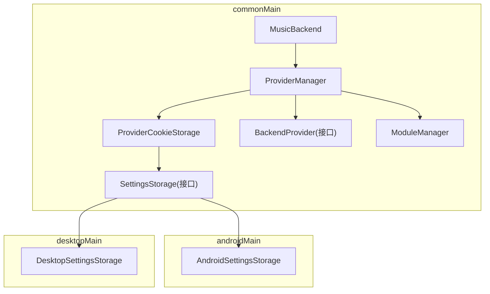
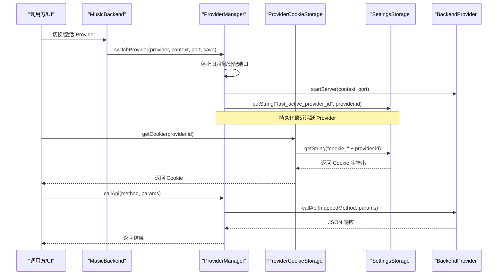
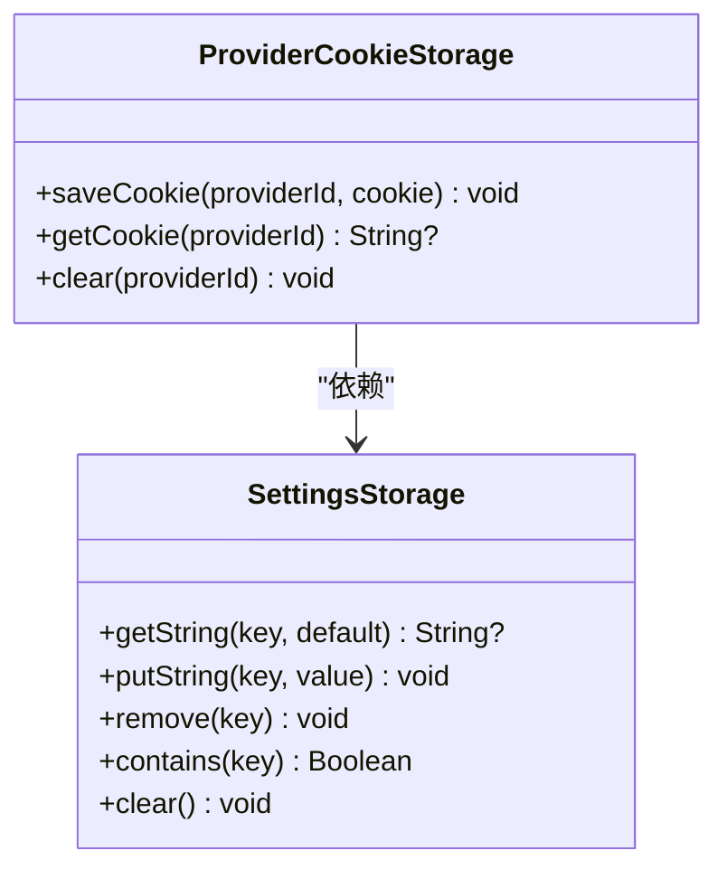
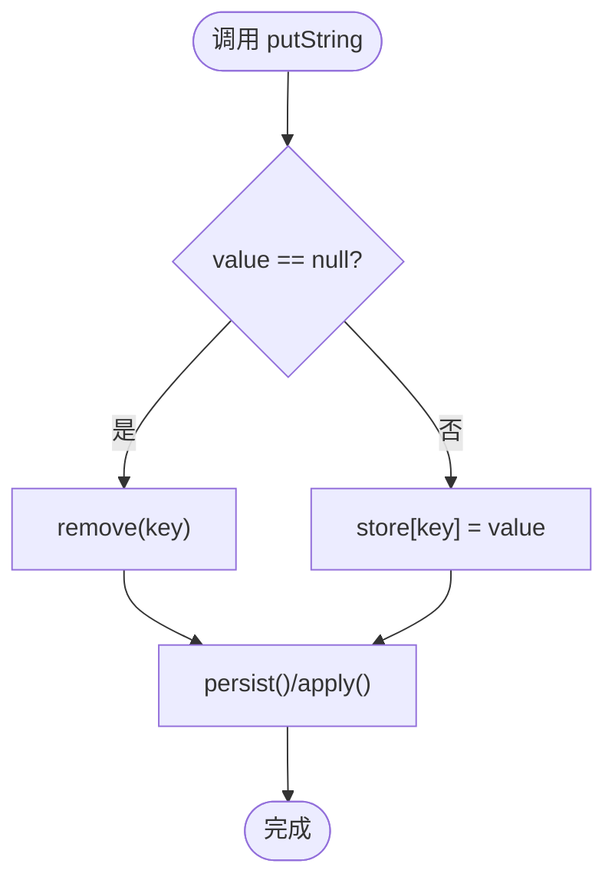
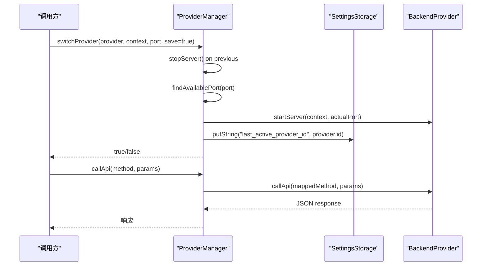
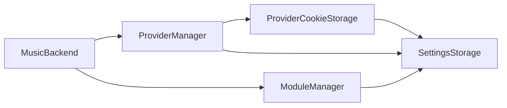
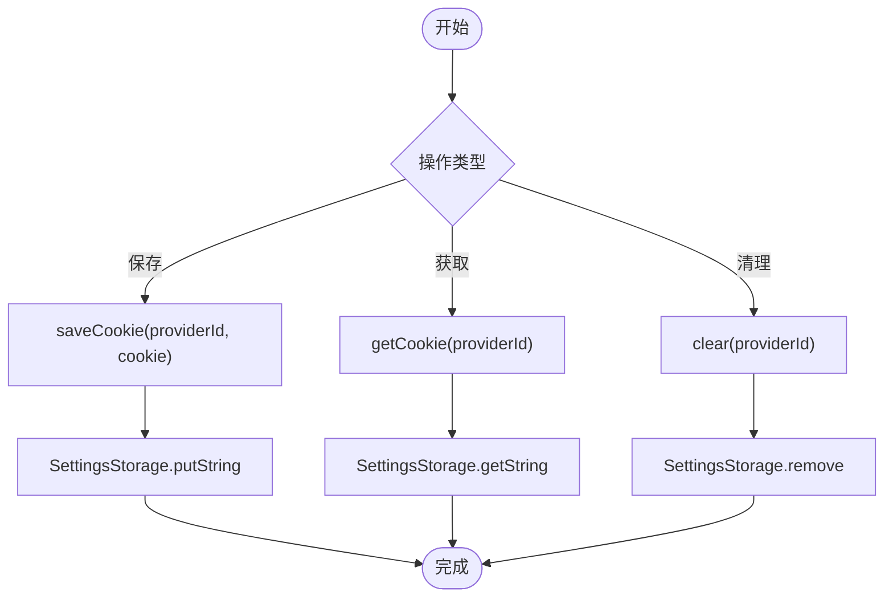

# Cookie 隔离机制

<cite>
**本文引用的文件**
- [ProviderManager.kt](file://kmp-pro/src/commonMain/kotlin/cp/player/kmp/provider/ProviderManager.kt)
- [SettingsStorage.kt](file://kmp-pro/src/commonMain/kotlin/cp/player/kmp/util/SettingsStorage.kt)
- [AndroidSettingsStorage.kt](file://kmp-pro/src/androidMain/kotlin/cp/player/kmp/util/AndroidSettingsStorage.kt)
- [DesktopSettingsStorage.kt](file://kmp-pro/src/desktopMain/kotlin/cp/player/kmp/util/DesktopSettingsStorage.kt)
- [BackendProvider.kt](file://kmp-pro/src/commonMain/kotlin/cp/player/kmp/provider/BackendProvider.kt)
- [ModuleManager.kt](file://kmp-pro/src/commonMain/kotlin/cp/player/kmp/provider/ModuleManager.kt)
- [MusicBackend.kt](file://kmp-pro/src/commonMain/kotlin/cp/player/kmp/MusicBackend.kt)
</cite>

## 目录
1. [简介](#简介)
2. [项目结构](#项目结构)
3. [核心组件](#核心组件)
4. [架构总览](#架构总览)
5. [详细组件分析](#详细组件分析)
6. [依赖关系分析](#依赖关系分析)
7. [性能考量](#性能考量)
8. [故障排查指南](#故障排查指南)
9. [结论](#结论)
10. [附录](#附录)

## 简介
本文件围绕“Cookie 隔离机制”展开，系统性说明多账号支持的设计原理与实现细节。重点包括：
- 按 Provider ID 隔离的存储策略与键值命名规范
- ProviderCookieStorage 的实现机制与存储抽象层
- Cookie 保存、获取、清理流程（含异步与错误处理）
- 跨平台存储适配（Android SharedPreferences 与 Desktop 文件存储差异）
- Cookie 安全考虑（敏感信息加密与访问权限控制建议）
- Cookie 迁移与版本升级策略
- 多账号登录典型场景与最佳实践
- Provider 切换时的状态保持机制

## 项目结构
本项目采用 KMP 分层设计，Cookie 隔离相关代码主要位于 kmp-pro 模块：
- commonMain：定义跨平台接口与核心逻辑（ProviderCookieStorage、SettingsStorage 抽象、ProviderManager）
- androidMain：Android 平台 SettingsStorage 实现（SharedPreferences）
- desktopMain：桌面端 SettingsStorage 实现（内存 Map + Properties 文件持久化）
- provider：后端 Provider 管理（ProviderManager、ModuleManager、BackendProvider）
- MusicBackend：统一入口，负责初始化并注入 ProviderCookieStorage

图表来源
- [ProviderManager.kt:15-35](file://kmp-pro/src/commonMain/kotlin/cp/player/kmp/provider/ProviderManager.kt#L15-L35)
- [SettingsStorage.kt:1-25](file://kmp-pro/src/commonMain/kotlin/cp/player/kmp/util/SettingsStorage.kt#L1-L25)
- [AndroidSettingsStorage.kt:1-35](file://kmp-pro/src/androidMain/kotlin/cp/player/kmp/util/AndroidSettingsStorage.kt#L1-L35)
- [DesktopSettingsStorage.kt:1-47](file://kmp-pro/src/desktopMain/kotlin/cp/player/kmp/util/DesktopSettingsStorage.kt#L1-L47)
- [BackendProvider.kt:1-110](file://kmp-pro/src/commonMain/kotlin/cp/player/kmp/provider/BackendProvider.kt#L1-L110)
- [ModuleManager.kt:1-137](file://kmp-pro/src/commonMain/kotlin/cp/player/kmp/provider/ModuleManager.kt#L1-L137)
- [MusicBackend.kt:312-370](file://kmp-pro/src/commonMain/kotlin/cp/player/kmp/MusicBackend.kt#L312-L370)

章节来源
- [ProviderManager.kt:15-35](file://kmp-pro/src/commonMain/kotlin/cp/player/kmp/provider/ProviderManager.kt#L15-L35)
- [SettingsStorage.kt:1-25](file://kmp-pro/src/commonMain/kotlin/cp/player/kmp/util/SettingsStorage.kt#L1-L25)

## 核心组件
- ProviderCookieStorage：按 Provider ID 隔离 Cookie 的轻量封装，提供 save/get/clear 方法，键名遵循 cookie_<providerId> 规范。
- SettingsStorage：跨平台键值存储抽象，屏蔽 Android SharedPreferences 与 Desktop 文件存储差异。
- ProviderManager：管理 Provider 生命周期与切换，持有 ProviderCookieStorage，并通过 StateFlow 暴露当前 Provider 状态。
- BackendProvider：Provider 抽象接口，定义 id/name/version/type/apiMap 等元数据及 start/stop/callApi 等方法。
- ModuleManager：扫描/导入/删除 Provider 模块，并在初始化时尝试恢复上次活跃的 Provider。
- MusicBackend：应用级后端入口，初始化时创建 ProviderCookieStorage 并注入到 ProviderManager。

章节来源
- [ProviderManager.kt:147-156](file://kmp-pro/src/commonMain/kotlin/cp/player/kmp/provider/ProviderManager.kt#L147-L156)
- [SettingsStorage.kt:1-25](file://kmp-pro/src/commonMain/kotlin/cp/player/kmp/util/SettingsStorage.kt#L1-L25)
- [BackendProvider.kt:24-96](file://kmp-pro/src/commonMain/kotlin/cp/player/kmp/provider/BackendProvider.kt#L24-L96)
- [ModuleManager.kt:35-48](file://kmp-pro/src/commonMain/kotlin/cp/player/kmp/provider/ModuleManager.kt#L35-L48)
- [MusicBackend.kt:312-370](file://kmp-pro/src/commonMain/kotlin/cp/player/kmp/MusicBackend.kt#L312-L370)

## 架构总览
下图展示了 Cookie 隔离在 Provider 切换过程中的整体交互：UI 或上层业务通过 MusicBackend 触发 Provider 切换；ProviderManager 负责停止旧服务、启动新服务、持久化最近活跃 Provider；ProviderCookieStorage 以 cookie_<providerId> 为键将 Cookie 与 Provider 绑定；底层由 SettingsStorage 在不同平台进行实际读写。

图表来源
- [ProviderManager.kt:75-109](file://kmp-pro/src/commonMain/kotlin/cp/player/kmp/provider/ProviderManager.kt#L75-L109)
- [ProviderManager.kt:123-141](file://kmp-pro/src/commonMain/kotlin/cp/player/kmp/provider/ProviderManager.kt#L123-L141)
- [ProviderManager.kt:147-156](file://kmp-pro/src/commonMain/kotlin/cp/player/kmp/provider/ProviderManager.kt#L147-L156)
- [SettingsStorage.kt:12-19](file://kmp-pro/src/commonMain/kotlin/cp/player/kmp/util/SettingsStorage.kt#L12-L19)
- [BackendProvider.kt:58-77](file://kmp-pro/src/commonMain/kotlin/cp/player/kmp/provider/BackendProvider.kt#L58-L77)

## 详细组件分析

### ProviderCookieStorage：按 Provider ID 隔离的 Cookie 存储
- 设计要点
  - 键值命名规范：cookie_<providerId>，确保不同 Provider 的 Cookie 严格隔离。
  - 操作语义：saveCookie 写入、getCookie 读取、clear 删除对应 Provider 的 Cookie。
  - 依赖抽象：仅依赖 SettingsStorage，不感知具体平台实现。
- 复杂度与性能
  - 时间复杂度：O(1) 读写（取决于底层实现）。
  - 空间复杂度：O(1) 每 Provider 一个 Cookie 条目。
- 错误处理
  - 若底层抛出异常，应在调用方捕获并降级（例如提示重新登录）。
- 使用示例路径
  - 保存 Cookie：[ProviderManager.kt:151-153](file://kmp-pro/src/commonMain/kotlin/cp/player/kmp/provider/ProviderManager.kt#L151-L153)
  - 获取 Cookie：[ProviderManager.kt:152-154](file://kmp-pro/src/commonMain/kotlin/cp/player/kmp/provider/ProviderManager.kt#L152-L154)
  - 清理 Cookie：[ProviderManager.kt:154-155](file://kmp-pro/src/commonMain/kotlin/cp/player/kmp/provider/ProviderManager.kt#L154-L155)

图表来源
- [ProviderManager.kt:147-156](file://kmp-pro/src/commonMain/kotlin/cp/player/kmp/provider/ProviderManager.kt#L147-L156)
- [SettingsStorage.kt:12-19](file://kmp-pro/src/commonMain/kotlin/cp/player/kmp/util/SettingsStorage.kt#L12-L19)

章节来源
- [ProviderManager.kt:147-156](file://kmp-pro/src/commonMain/kotlin/cp/player/kmp/provider/ProviderManager.kt#L147-L156)

### SettingsStorage：跨平台存储抽象
- 抽象能力
  - 提供统一的 getString/putString/remove/contains/clear 接口。
  - 通过 expect/actual 机制在 Android 与 Desktop 提供具体实现。
- 平台差异
  - Android：基于 SharedPreferences，文件名即 namespace，MODE_PRIVATE 保证应用内私有。
  - Desktop：内存 ConcurrentHashMap + 用户目录下的 .properties 文件持久化。
- 性能与安全
  - Android：I/O 由系统缓存，适合频繁小量读写；注意敏感数据可结合系统 KeyStore 或应用内加密。
  - Desktop：并发安全 Map + 同步写盘；磁盘文件需关注权限与备份风险。

图表来源
- [AndroidSettingsStorage.kt:15-21](file://kmp-pro/src/androidMain/kotlin/cp/player/kmp/util/AndroidSettingsStorage.kt#L15-L21)
- [DesktopSettingsStorage.kt:27-44](file://kmp-pro/src/desktopMain/kotlin/cp/player/kmp/util/DesktopSettingsStorage.kt#L27-L44)

章节来源
- [SettingsStorage.kt:1-25](file://kmp-pro/src/commonMain/kotlin/cp/player/kmp/util/SettingsStorage.kt#L1-L25)
- [AndroidSettingsStorage.kt:1-35](file://kmp-pro/src/androidMain/kotlin/cp/player/kmp/util/AndroidSettingsStorage.kt#L1-L35)
- [DesktopSettingsStorage.kt:1-47](file://kmp-pro/src/desktopMain/kotlin/cp/player/kmp/util/DesktopSettingsStorage.kt#L1-L47)

### ProviderManager：Provider 切换与 Cookie 关联
- 职责
  - 维护 currentProvider、currentPort，提供 switchProvider/restoreLastProvider/callApi 等方法。
  - 通过 SettingsStorage 持久化 last_active_provider_id，以便重启后恢复。
  - 通过 StateFlow 暴露当前 Provider 变化，供 UI 观察。
- 切换流程
  - 停止旧服务 -> 检测可用端口 -> 启动新服务 -> 更新 currentProvider -> 持久化选择 -> 通知监听器。
- API 调用
  - 在 IO 调度器执行，自动映射方法名，失败时返回结构化错误消息。

图表来源
- [ProviderManager.kt:75-109](file://kmp-pro/src/commonMain/kotlin/cp/player/kmp/provider/ProviderManager.kt#L75-L109)
- [ProviderManager.kt:123-141](file://kmp-pro/src/commonMain/kotlin/cp/player/kmp/provider/ProviderManager.kt#L123-L141)

章节来源
- [ProviderManager.kt:15-145](file://kmp-pro/src/commonMain/kotlin/cp/player/kmp/provider/ProviderManager.kt#L15-L145)

### BackendProvider：Provider 抽象与账号隔离约定
- 关键属性
  - id/name/version/type/apiMap/updateUrl/targetAppPackage
- 关键方法
  - startServer/stopServer/callApi/analyzeAudio/isReady
- 账号隔离约定
  - 每个 Provider 维护独立账号体系，Cookie、歌单、推荐等数据均与特定 Provider 绑定。

章节来源
- [BackendProvider.kt:24-96](file://kmp-pro/src/commonMain/kotlin/cp/player/kmp/provider/BackendProvider.kt#L24-L96)

### ModuleManager：模块加载与恢复
- 功能
  - 扫描 modulesDir，加载所有子目录模块，构建 Provider 列表。
  - 初始化时尝试 restoreLastProvider，若无则自动选择首个可用 Provider。
- 错误处理
  - 记录 lastLoadError，便于 UI 展示加载失败原因。

章节来源
- [ModuleManager.kt:35-48](file://kmp-pro/src/commonMain/kotlin/cp/player/kmp/provider/ModuleManager.kt#L35-L48)
- [ModuleManager.kt:50-137](file://kmp-pro/src/commonMain/kotlin/cp/player/kmp/provider/ModuleManager.kt#L50-L137)

### MusicBackend：统一入口与 Cookie 注入
- 初始化
  - 创建 ProviderCookieStorage(settings)，注入到 ProviderManager。
  - 创建 ModuleManager，扫描并恢复上次 Provider。
- 状态机
  - 根据 currentProvider 是否就绪，设置 Ready/Error/NoProvider 状态。

章节来源
- [MusicBackend.kt:312-370](file://kmp-pro/src/commonMain/kotlin/cp/player/kmp/MusicBackend.kt#L312-L370)

## 依赖关系分析
- ProviderCookieStorage 依赖 SettingsStorage 抽象，解耦平台实现。
- ProviderManager 依赖 SettingsStorage 与 ProviderCookieStorage，用于持久化与 Cookie 隔离。
- ModuleManager 依赖 PlatformSupport 与 JSON 解析，负责模块加载。
- MusicBackend 组合上述组件，对外暴露统一 API。

图表来源
- [ProviderManager.kt:147-156](file://kmp-pro/src/commonMain/kotlin/cp/player/kmp/provider/ProviderManager.kt#L147-L156)
- [SettingsStorage.kt:12-19](file://kmp-pro/src/commonMain/kotlin/cp/player/kmp/util/SettingsStorage.kt#L12-L19)
- [ModuleManager.kt:1-137](file://kmp-pro/src/commonMain/kotlin/cp/player/kmp/provider/ModuleManager.kt#L1-L137)
- [MusicBackend.kt:312-370](file://kmp-pro/src/commonMain/kotlin/cp/player/kmp/MusicBackend.kt#L312-L370)

章节来源
- [ProviderManager.kt:147-156](file://kmp-pro/src/commonMain/kotlin/cp/player/kmp/provider/ProviderManager.kt#L147-L156)
- [SettingsStorage.kt:12-19](file://kmp-pro/src/commonMain/kotlin/cp/player/kmp/util/SettingsStorage.kt#L12-L19)

## 性能考量
- 读写频率
  - Cookie 读写通常为低频操作，直接落库即可；如需高频，可在上层加短期缓存。
- 并发安全
  - Desktop 使用 ConcurrentHashMap 保障线程安全；Android SharedPreferences 内部已做同步。
- I/O 成本
  - Desktop 每次 putString/remove 都会写盘，应避免批量频繁写入；可考虑合并写入或延迟持久化。
- 内存占用
  - Desktop 启动时加载 properties 到内存，数据量较大时需评估内存压力。

## 故障排查指南
- 常见问题
  - Cookie 未生效：检查键名是否为 cookie_<providerId>，确认 Provider ID 一致。
  - 切换后 Cookie 丢失：确认 ProviderCookieStorage.clear 未被误调用；检查 SettingsStorage 实现是否正确持久化。
  - 平台差异导致异常：Android 需在 Application.onCreate 中调用 initKmpAndroidContext；Desktop 检查 ~/.kmp-pro/*.properties 权限。
- 定位步骤
  - 打印 currentProvider.id 与 key 前缀，确认隔离正确。
  - 在 SettingsStorage 实现中添加日志，观察 putString/remove/getString 调用链。
  - 检查 ProviderManager.switchProvider 返回值与异常堆栈。

章节来源
- [AndroidSettingsStorage.kt:27-35](file://kmp-pro/src/androidMain/kotlin/cp/player/kmp/util/AndroidSettingsStorage.kt#L27-L35)
- [DesktopSettingsStorage.kt:18-35](file://kmp-pro/src/desktopMain/kotlin/cp/player/kmp/util/DesktopSettingsStorage.kt#L18-L35)
- [ProviderManager.kt:75-109](file://kmp-pro/src/commonMain/kotlin/cp/player/kmp/provider/ProviderManager.kt#L75-L109)

## 结论
本项目通过 ProviderCookieStorage 与 SettingsStorage 抽象，实现了按 Provider ID 隔离的多账号 Cookie 存储。ProviderManager 在切换时自动管理生命周期与持久化，配合 ModuleManager 的恢复机制，保证了用户体验的一致性。跨平台实现屏蔽了 Android 与 Desktop 的差异，提供了稳定可靠的存储基础。后续可在安全层面引入加密与更严格的权限控制，进一步提升敏感数据安全。

## 附录

### Cookie 保存、获取、清理操作流程（含异步与错误处理）
- 保存流程
  - 调用 ProviderCookieStorage.saveCookie(providerId, cookie)
  - 底层 SettingsStorage.putString 写入，Android 立即 apply，Desktop 写盘
  - 建议在调用方捕获异常并提示重试
- 获取流程
  - 调用 ProviderCookieStorage.getCookie(providerId)
  - 若返回 null，应引导重新登录
- 清理流程
  - 调用 ProviderCookieStorage.clear(providerId)
  - 适用于退出登录或切换账号时

图表来源
- [ProviderManager.kt:147-156](file://kmp-pro/src/commonMain/kotlin/cp/player/kmp/provider/ProviderManager.kt#L147-L156)
- [SettingsStorage.kt:12-19](file://kmp-pro/src/commonMain/kotlin/cp/player/kmp/util/SettingsStorage.kt#L12-L19)

### 跨平台存储适配差异
- Android
  - 基于 SharedPreferences，文件名即 namespace，MODE_PRIVATE 限制访问范围
  - 需在 Application.onCreate 中初始化 Context
- Desktop
  - 内存 Map + 用户目录下的 .properties 文件
  - 启动时加载文件，变更时写回；注意文件权限与并发写入

章节来源
- [AndroidSettingsStorage.kt:1-35](file://kmp-pro/src/androidMain/kotlin/cp/player/kmp/util/AndroidSettingsStorage.kt#L1-L35)
- [DesktopSettingsStorage.kt:1-47](file://kmp-pro/src/desktopMain/kotlin/cp/player/kmp/util/DesktopSettingsStorage.kt#L1-L47)

### Cookie 安全考虑
- 敏感信息加密
  - 建议在应用层对 Cookie 进行加密后再存入 SettingsStorage（如 AES），解密在读取后进行
- 访问权限控制
  - Android：确保 SharedPreferences 使用 MODE_PRIVATE，避免被其他应用读取
  - Desktop：限制 ~/.kmp-pro 目录权限，仅当前用户可读写
- 传输安全
  - 与 Provider 通信建议使用 HTTPS，防止中间人攻击

### Cookie 迁移与版本升级策略
- 迁移方案
  - 在首次启动时检测旧版本键名（如 old_cookie_<providerId>），迁移至新键名 cookie_<providerId>
  - 迁移完成后删除旧键，保留日志便于回溯
- 版本兼容
  - 通过 SettingsStorage.contains 判断键是否存在，避免覆盖或丢失
  - 提供重置入口，允许用户清空 Cookie 并重新登录

### 多账号登录的典型使用场景与最佳实践
- 场景
  - 同一设备登录多个音乐账号，分别属于不同 Provider（如网易云、自建后端）
  - 切换 Provider 时自动切换到对应账号的 Cookie，互不干扰
- 最佳实践
  - 明确区分 Provider ID，避免冲突
  - 在切换 Provider 前保存当前 Cookie，切换后按需加载
  - 提供显式“退出登录”按钮，调用 clear(providerId) 清理 Cookie

### Provider 切换时的状态保持机制
- 状态保持
  - ProviderManager 通过 SettingsStorage 持久化 last_active_provider_id
  - 应用重启后，ModuleManager 尝试恢复上次 Provider，若不可用则选择首个可用
- 状态一致性
  - 切换过程中先停止旧服务，再启动新服务，失败时回滚到旧状态
  - 通过 StateFlow 通知 UI 最新状态，确保界面与后端一致

章节来源
- [ProviderManager.kt:75-109](file://kmp-pro/src/commonMain/kotlin/cp/player/kmp/provider/ProviderManager.kt#L75-L109)
- [ModuleManager.kt:35-48](file://kmp-pro/src/commonMain/kotlin/cp/player/kmp/provider/ModuleManager.kt#L35-L48)