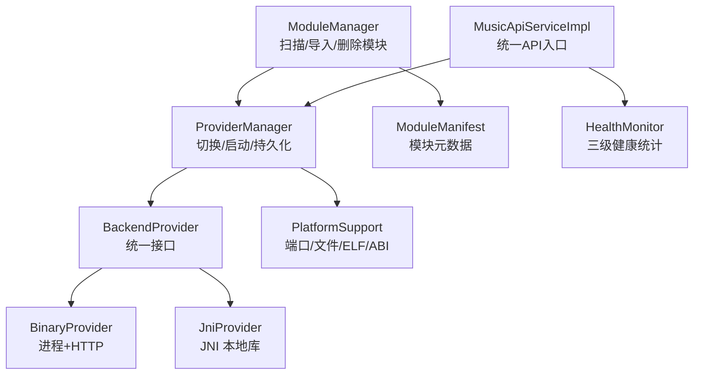
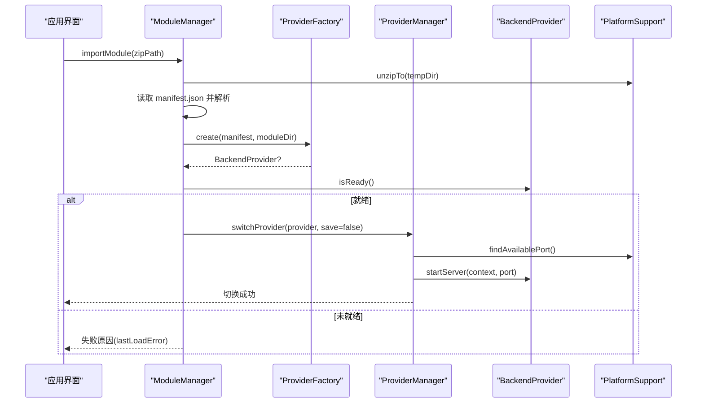
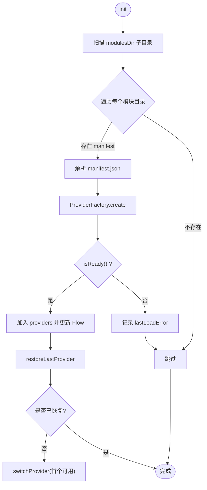
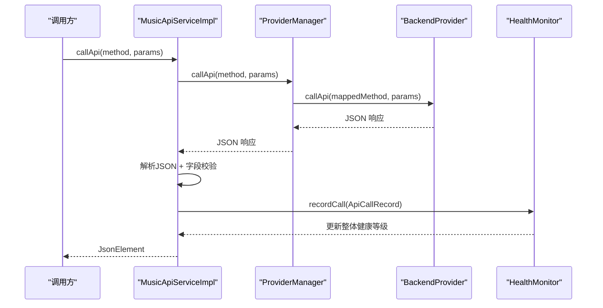
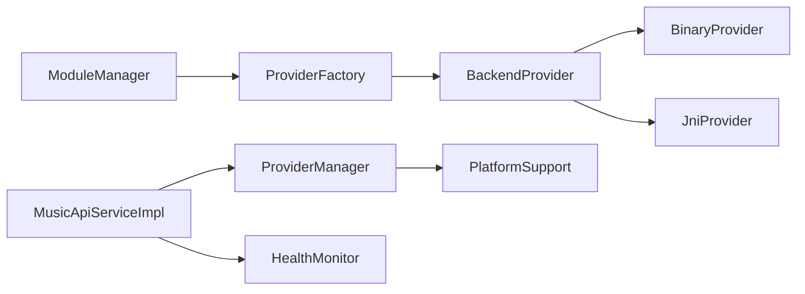

# ModuleManager 模块管理

<cite>
**本文引用的文件**
- [ModuleManager.kt](file://kmp-pro/src/commonMain/kotlin/cp/player/kmp/provider/ModuleManager.kt)
- [ModuleManifest.kt](file://kmp-pro/src/commonMain/kotlin/cp/player/kmp/provider/ModuleManifest.kt)
- [ProviderManager.kt](file://kmp-pro/src/commonMain/kotlin/cp/player/kmp/provider/ProviderManager.kt)
- [BackendProvider.kt](file://kmp-pro/src/commonMain/kotlin/cp/player/kmp/provider/BackendProvider.kt)
- [BinaryProvider.kt](file://kmp-pro/src/jvmMain/kotlin/cp/player/kmp/provider/BinaryProvider.kt)
- [JniProvider.kt](file://kmp-pro/src/jvmMain/kotlin/cp/player/kmp/provider/JniProvider.kt)
- [PlatformSupport.kt](file://kmp-pro/src/commonMain/kotlin/cp/player/kmp/util/PlatformSupport.kt)
- [MusicApiServiceImpl.kt](file://kmp-pro/src/commonMain/kotlin/cp/player/kmp/api/MusicApiServiceImpl.kt)
- [HealthMonitor.kt](file://kmp-pro/src/commonMain/kotlin/cp/player/kmp/monitor/HealthMonitor.kt)
</cite>

## 目录
1. [简介](#简介)
2. [项目结构](#项目结构)
3. [核心组件](#核心组件)
4. [架构总览](#架构总览)
5. [详细组件分析](#详细组件分析)
6. [依赖关系分析](#依赖关系分析)
7. [性能考量](#性能考量)
8. [故障排查指南](#故障排查指南)
9. [结论](#结论)
10. [附录](#附录)

## 简介
本文件为 CPPlayer-KMP 的 ModuleManager 模块管理系统提供系统化文档，覆盖模块加载机制（动态发现、依赖解析、初始化）、ModuleManifest 结构与校验规则、卸载与资源清理、热重载与运行时切换、健康检查与故障恢复、模块间通信与数据共享、自定义模块开发指导、典型工作流与错误处理模式。目标是帮助开发者快速理解并安全扩展模块体系。

## 项目结构
模块系统位于 kmp-pro 模块中，围绕“模块清单 + Provider 实现 + 平台能力抽象”组织：
- 模块管理与清单：ModuleManager、ModuleManifest
- Provider 接口与实现：BackendProvider、BinaryProvider、JniProvider
- 运行时管理：ProviderManager（活跃 Provider、端口分配、持久化）
- 平台能力：PlatformSupport（文件系统、ELF 校验、ABI 选择、端口探测）
- API 调用与健康监控：MusicApiServiceImpl、HealthMonitor

图表来源
- [ModuleManager.kt:19-137](file://kmp-pro/src/commonMain/kotlin/cp/player/kmp/provider/ModuleManager.kt#L19-L137)
- [ProviderManager.kt:31-145](file://kmp-pro/src/commonMain/kotlin/cp/player/kmp/provider/ProviderManager.kt#L31-L145)
- [BackendProvider.kt:24-110](file://kmp-pro/src/commonMain/kotlin/cp/player/kmp/provider/BackendProvider.kt#L24-L110)
- [BinaryProvider.kt:25-108](file://kmp-pro/src/jvmMain/kotlin/cp/player/kmp/provider/BinaryProvider.kt#L25-L108)
- [JniProvider.kt:9-142](file://kmp-pro/src/jvmMain/kotlin/cp/player/kmp/provider/JniProvider.kt#L9-L142)
- [PlatformSupport.kt:13-59](file://kmp-pro/src/commonMain/kotlin/cp/player/kmp/util/PlatformSupport.kt#L13-L59)
- [MusicApiServiceImpl.kt:28-101](file://kmp-pro/src/commonMain/kotlin/cp/player/kmp/api/MusicApiServiceImpl.kt#L28-L101)
- [HealthMonitor.kt:25-143](file://kmp-pro/src/commonMain/kotlin/cp/player/kmp/monitor/HealthMonitor.kt#L25-L143)

章节来源
- [ModuleManager.kt:19-137](file://kmp-pro/src/commonMain/kotlin/cp/player/kmp/provider/ModuleManager.kt#L19-L137)
- [PlatformSupport.kt:13-59](file://kmp-pro/src/commonMain/kotlin/cp/player/kmp/util/PlatformSupport.kt#L13-L59)

## 核心组件
- ModuleManager：负责模块目录扫描、zip 导入、manifest 解析、Provider 创建与就绪检查、模块删除与状态流更新。
- ModuleManifest：描述模块 id/name/version/type/entryPoint/apiMap/updateUrl/supportedAbis/targetAppPackage 等元数据。
- BackendProvider：定义 Provider 的统一生命周期与调用契约（start/stop/callApi/isReady/analyzeAudio）。
- BinaryProvider/JniProvider：两种后端实现，分别通过独立进程 HTTP 或 JNI 本地库提供服务。
- ProviderManager：管理当前活跃 Provider、端口分配、切换、持久化最近一次选择的 Provider。
- PlatformSupport：跨平台能力抽象（端口探测、解压、ELF 校验、ABI 选择、目录操作）。
- MusicApiServiceImpl：统一 API 入口，自动注入 cookie、响应校验、健康记录与回退策略。
- HealthMonitor：三级健康等级（OK/WARNING/ERROR），记录调用指标与整体健康度。

章节来源
- [ModuleManifest.kt:5-31](file://kmp-pro/src/commonMain/kotlin/cp/player/kmp/provider/ModuleManifest.kt#L5-L31)
- [BackendProvider.kt:24-110](file://kmp-pro/src/commonMain/kotlin/cp/player/kmp/provider/BackendProvider.kt#L24-L110)
- [BinaryProvider.kt:25-108](file://kmp-pro/src/jvmMain/kotlin/cp/player/kmp/provider/BinaryProvider.kt#L25-L108)
- [JniProvider.kt:9-142](file://kmp-pro/src/jvmMain/kotlin/cp/player/kmp/provider/JniProvider.kt#L9-L142)
- [ProviderManager.kt:31-145](file://kmp-pro/src/commonMain/kotlin/cp/player/kmp/provider/ProviderManager.kt#L31-L145)
- [PlatformSupport.kt:13-59](file://kmp-pro/src/commonMain/kotlin/cp/player/kmp/util/PlatformSupport.kt#L13-L59)
- [MusicApiServiceImpl.kt:28-101](file://kmp-pro/src/commonMain/kotlin/cp/player/kmp/api/MusicApiServiceImpl.kt#L28-L101)
- [HealthMonitor.kt:25-143](file://kmp-pro/src/commonMain/kotlin/cp/player/kmp/monitor/HealthMonitor.kt#L25-L143)

## 架构总览
模块系统采用“清单驱动 + 工厂创建 + 运行时管理”的分层架构：
- 清单驱动：每个模块以 manifest.json 声明类型与入口；加载时解析并据此创建具体 Provider。
- 工厂创建：ProviderFactory 根据 type 与平台实际能力创建对应实现（binary/http/jni）。
- 运行时管理：ProviderManager 维护当前活跃 Provider，负责端口分配、服务启停、切换与持久化。
- 平台抽象：PlatformSupport 屏蔽平台差异，提供 ELF 校验、ABI 选择、文件操作等能力。
- 统一 API：MusicApiServiceImpl 作为唯一入口，自动注入认证信息、校验响应、记录健康指标。

图表来源
- [ModuleManager.kt:57-117](file://kmp-pro/src/commonMain/kotlin/cp/player/kmp/provider/ModuleManager.kt#L57-L117)
- [ProviderManager.kt:80-108](file://kmp-pro/src/commonMain/kotlin/cp/player/kmp/provider/ProviderManager.kt#L80-L108)
- [PlatformSupport.kt:17-18](file://kmp-pro/src/commonMain/kotlin/cp/player/kmp/util/PlatformSupport.kt#L17-L18)
- [BinaryProvider.kt:54-81](file://kmp-pro/src/jvmMain/kotlin/cp/player/kmp/provider/BinaryProvider.kt#L54-L81)
- [JniProvider.kt:39-55](file://kmp-pro/src/jvmMain/kotlin/cp/player/kmp/provider/JniProvider.kt#L39-L55)

## 详细组件分析

### 模块加载机制（动态发现、依赖解析、初始化）
- 动态发现：ModuleManager.init 调用 scanAndLoadAll，使用 PlatformSupport.listChildDirectories 枚举 modulesDir 子目录，逐个尝试加载。
- 依赖解析：loadModuleIfExists 读取 manifest.json，解析 ModuleManifest，并通过 ProviderFactory.create 创建 Provider。对于 jni/binary 类型，PlatformSupport.resolveEntryPoint 会按 supportedAbis 顺序选择正确的入口文件路径。
- 初始化流程：创建 Provider 后调用 isReady() 检查就绪状态；若成功则加入 providers 映射，并更新 StateFlow；随后由 ProviderManager.restoreLastProvider 恢复上次活跃的 Provider，若无则自动选择首个可用 Provider。

图表来源
- [ModuleManager.kt:38-54](file://kmp-pro/src/commonMain/kotlin/cp/player/kmp/provider/ModuleManager.kt#L38-L54)
- [ModuleManager.kt:88-117](file://kmp-pro/src/commonMain/kotlin/cp/player/kmp/provider/ModuleManager.kt#L88-L117)
- [PlatformSupport.kt:38-46](file://kmp-pro/src/commonMain/kotlin/cp/player/kmp/util/PlatformSupport.kt#L38-L46)

章节来源
- [ModuleManager.kt:38-117](file://kmp-pro/src/commonMain/kotlin/cp/player/kmp/provider/ModuleManager.kt#L38-L117)
- [PlatformSupport.kt:38-46](file://kmp-pro/src/commonMain/kotlin/cp/player/kmp/util/PlatformSupport.kt#L38-L46)

### ModuleManifest 结构与验证规则
- 字段说明：
  - id/name/version/type/entryPoint：必填基础信息，type 支持 jni/binary/http 等。
  - apiMap：方法名映射表，key 为内部标准方法名，value 为 Provider 实际端点名；可标记 unsupported。
  - updateUrl：可选，指向版本检查 JSON 端点。
  - supportedAbis：可选，声明支持的 CPU ABI 列表，用于多架构 native 库选择。
  - targetAppPackage：可选，Android 端打开目标 App 的包名。
- 验证规则：
  - 模块导入时强制要求存在 manifest.json，否则返回失败。
  - 创建 Provider 失败时，依据 type 给出具体原因（如缺少 native 库、二进制不匹配、不支持的类型）。
  - 加载完成后调用 isReady()，若失败则提取 getLoadError 并记录到 lastLoadError。
- 版本兼容性：
  - 当前代码未对 version 进行语义化比较；updateUrl 可用于外部检查最新版本。
  - 建议在后续版本中加入基于 version 的兼容检查（例如最小/最大版本范围）。

章节来源
- [ModuleManifest.kt:5-31](file://kmp-pro/src/commonMain/kotlin/cp/player/kmp/provider/ModuleManifest.kt#L5-L31)
- [ModuleManager.kt:57-117](file://kmp-pro/src/commonMain/kotlin/cp/player/kmp/provider/ModuleManager.kt#L57-L117)

### 模块卸载与资源清理（内存泄漏防护）
- 删除模块：ModuleManager.deleteModule 递归删除模块目录并从 providers 移除，同时更新 Flow。
- 停止服务：ProviderManager.switchProvider 在切换前调用 previousProvider.stopServer()，确保旧服务释放资源。
- 二进制进程：BinaryProvider.stopServer 销毁进程，避免残留进程占用端口或内存。
- JNI 库：JniProvider.stopServer 重置加载状态，防止后续调用崩溃；异常路径中也会重置 isLoaded 并记录错误。
- 建议：
  - 在 Provider 实现中确保所有句柄、线程、监听器在 stopServer 中释放。
  - 对长时间运行的任务增加超时与取消机制，避免僵尸任务导致内存泄漏。

章节来源
- [ModuleManager.kt:130-136](file://kmp-pro/src/commonMain/kotlin/cp/player/kmp/provider/ModuleManager.kt#L130-L136)
- [ProviderManager.kt:80-108](file://kmp-pro/src/commonMain/kotlin/cp/player/kmp/provider/ProviderManager.kt#L80-L108)
- [BinaryProvider.kt:83-86](file://kmp-pro/src/jvmMain/kotlin/cp/player/kmp/provider/BinaryProvider.kt#L83-L86)
- [JniProvider.kt:57-59](file://kmp-pro/src/jvmMain/kotlin/cp/player/kmp/provider/JniProvider.kt#L57-L59)

### 热重载与运行时模块切换
- 运行时切换：ProviderManager.switchProvider 支持在运行期切换活跃 Provider，自动停止旧服务、分配新端口、启动新服务，并持久化用户选择。
- 热重载能力：
  - 当前实现未提供“原地热重载”（即替换二进制/JNI 后无需重启），但可通过“删除旧模块 -> 导入新模块 -> 切换为新 Provider”的流程达到等效效果。
  - 建议在后续版本引入“增量更新”与“热重载”，通过版本号比对与原子替换提升体验。
- 端口冲突处理：ProviderManager 使用 PlatformSupport.findAvailablePort 在指定范围内寻找可用端口，失败时回退并保持原状态。

章节来源
- [ProviderManager.kt:80-108](file://kmp-pro/src/commonMain/kotlin/cp/player/kmp/provider/ProviderManager.kt#L80-L108)
- [PlatformSupport.kt:17-18](file://kmp-pro/src/commonMain/kotlin/cp/player/kmp/util/PlatformSupport.kt#L17-L18)

### 健康检查机制（服务可用性检测与故障恢复）
- 服务就绪检测：BackendProvider.isReady() 用于判断 Provider 是否可服务；BinaryProvider/JniProvider 在构造或启动阶段设置 loadError，isReady 据此返回。
- 调用级健康监控：MusicApiServiceImpl.callApi 统一拦截请求，解析响应并进行字段校验，记录 HealthMonitor.ApiCallRecord，分类为 OK/WARNING/ERROR。
- 故障恢复策略：
  - 针对 URL 类接口（如歌曲播放地址），优先尝试 302 重定向版本，失败时自动降级到 v1 版本。
  - callWithAllProviders 支持遍历多个 Provider 进行容灾调用，优先尝试当前 Provider，再尝试其他 Provider。
- 综合健康等级：HealthMonitor.computeOverallLevel 基于最近 N 条记录计算整体等级，便于 UI 展示与告警。

图表来源
- [MusicApiServiceImpl.kt:35-101](file://kmp-pro/src/commonMain/kotlin/cp/player/kmp/api/MusicApiServiceImpl.kt#L35-L101)
- [ProviderManager.kt:129-141](file://kmp-pro/src/commonMain/kotlin/cp/player/kmp/provider/ProviderManager.kt#L129-L141)
- [HealthMonitor.kt:119-143](file://kmp-pro/src/commonMain/kotlin/cp/player/kmp/monitor/HealthMonitor.kt#L119-L143)

章节来源
- [BackendProvider.kt:87-96](file://kmp-pro/src/commonMain/kotlin/cp/player/kmp/provider/BackendProvider.kt#L87-L96)
- [MusicApiServiceImpl.kt:35-101](file://kmp-pro/src/commonMain/kotlin/cp/player/kmp/api/MusicApiServiceImpl.kt#L35-L101)
- [HealthMonitor.kt:25-143](file://kmp-pro/src/commonMain/kotlin/cp/player/kmp/monitor/HealthMonitor.kt#L25-L143)

### 模块间通信协议与数据共享
- 通信协议：
  - BinaryProvider 通过 HTTP POST 到 http://127.0.0.1:<port>/api/<method>，参数为 JSON 对象。
  - JniProvider 通过 JNI 调用 nativeCallApi，参数为 JSON 字符串。
  - 两者均遵循统一的 BackendProvider.callApi 契约，返回值均为 JSON 字符串。
- 数据共享：
  - 通过 ProviderCookieStorage 按 providerId 隔离 cookie，实现账号级数据隔离。
  - MusicApiServiceImpl 自动注入 cookie，调用方无需手动传递。
- 方法映射：
  - apiMap 允许 Provider 将内部标准方法名映射到其实际端点名，或标记 unsupported。
  - 当映射为空或 unsupported 时，上层返回“该提供商不支持此功能”。

章节来源
- [BinaryProvider.kt:88-104](file://kmp-pro/src/jvmMain/kotlin/cp/player/kmp/provider/BinaryProvider.kt#L88-L104)
- [JniProvider.kt:61-84](file://kmp-pro/src/jvmMain/kotlin/cp/player/kmp/provider/JniProvider.kt#L61-L84)
- [ProviderManager.kt:129-141](file://kmp-pro/src/commonMain/kotlin/cp/player/kmp/provider/ProviderManager.kt#L129-L141)
- [BackendProvider.kt:37-46](file://kmp-pro/src/commonMain/kotlin/cp/player/kmp/provider/BackendProvider.kt#L37-L46)

### 自定义模块开发指导原则与集成示例
- 模块结构：
  - 每个模块目录包含 manifest.json 与入口文件（二进制或 JNI 库）。
  - manifest 必须包含 id/name/version/type/entryPoint；可选字段包括 apiMap/updateUrl/supportedAbis/targetAppPackage。
- 开发步骤：
  1. 编写后端服务（二进制或 JNI），暴露 /api/<method> 或 JNI 接口。
  2. 生成 manifest.json，填写必要字段与方法映射。
  3. 打包为 zip，通过 ModuleManager.importModule 导入。
  4. 通过 ProviderManager.switchProvider 切换为自定义 Provider。
- 集成要点：
  - 确保入口文件与当前平台 ABI 匹配，必要时使用 supportedAbis 声明多架构。
  - 在 Provider 实现中正确处理 isReady/startServer/stopServer/callApi 生命周期。
  - 使用 apiMap 将内部方法映射到实际端点，或标记 unsupported。
  - 通过 Cookie 存储实现账号隔离，避免不同 Provider 之间数据串扰。

章节来源
- [ModuleManifest.kt:5-31](file://kmp-pro/src/commonMain/kotlin/cp/player/kmp/provider/ModuleManifest.kt#L5-L31)
- [ModuleManager.kt:57-117](file://kmp-pro/src/commonMain/kotlin/cp/player/kmp/provider/ModuleManager.kt#L57-L117)
- [BackendProvider.kt:24-110](file://kmp-pro/src/commonMain/kotlin/cp/player/kmp/provider/BackendProvider.kt#L24-L110)

### 典型工作流与错误处理模式
- 典型工作流：
  - 应用启动 -> ModuleManager.init 扫描并加载模块 -> ProviderManager.restoreLastProvider 恢复上次选择 -> 若无可自动选择首个可用 Provider。
  - 用户导入新模块 -> importModule 解压并校验 manifest -> 创建 Provider -> 切换并启动服务。
  - 调用 API -> MusicApiServiceImpl 统一入口 -> ProviderManager 路由到当前 Provider -> 健康记录与回退。
- 错误处理模式：
  - 导入失败：lastLoadError 记录具体原因（解压失败、缺少 manifest、Provider 创建失败、未就绪）。
  - 切换失败：ProviderManager 在端口占用或服务启动异常时回滚到上一个 Provider。
  - 调用失败：MusicApiServiceImpl 捕获异常并记录健康记录，返回统一错误格式。
  - 健康降级：根据响应字段缺失、慢响应、不支持等警告，分类为 WARNING/ERROR，并在 UI 展示整体健康等级。

章节来源
- [ModuleManager.kt:38-117](file://kmp-pro/src/commonMain/kotlin/cp/player/kmp/provider/ModuleManager.kt#L38-L117)
- [ProviderManager.kt:80-108](file://kmp-pro/src/commonMain/kotlin/cp/player/kmp/provider/ProviderManager.kt#L80-L108)
- [MusicApiServiceImpl.kt:35-101](file://kmp-pro/src/commonMain/kotlin/cp/player/kmp/api/MusicApiServiceImpl.kt#L35-L101)
- [HealthMonitor.kt:119-143](file://kmp-pro/src/commonMain/kotlin/cp/player/kmp/monitor/HealthMonitor.kt#L119-L143)

## 依赖关系分析
- 低耦合设计：
  - ModuleManager 仅依赖 PlatformSupport 与 ProviderFactory，不直接感知具体 Provider 实现细节。
  - ProviderManager 管理活跃 Provider 的生命周期，但不关心底层通信方式。
  - MusicApiServiceImpl 通过 ProviderManager 间接调用 Provider，保持上层稳定。
- 关键依赖链：
  - ModuleManager -> ProviderFactory -> BackendProvider（Binary/JNI）
  - ProviderManager -> PlatformSupport（端口/文件/ELF）
  - MusicApiServiceImpl -> ProviderManager -> BackendProvider
  - HealthMonitor 被 MusicApiServiceImpl 记录调用指标，供 UI 与诊断使用。

图表来源
- [ModuleManager.kt:19-137](file://kmp-pro/src/commonMain/kotlin/cp/player/kmp/provider/ModuleManager.kt#L19-L137)
- [ProviderManager.kt:31-145](file://kmp-pro/src/commonMain/kotlin/cp/player/kmp/provider/ProviderManager.kt#L31-L145)
- [BackendProvider.kt:24-110](file://kmp-pro/src/commonMain/kotlin/cp/player/kmp/provider/BackendProvider.kt#L24-L110)
- [BinaryProvider.kt:25-108](file://kmp-pro/src/jvmMain/kotlin/cp/player/kmp/provider/BinaryProvider.kt#L25-L108)
- [JniProvider.kt:9-142](file://kmp-pro/src/jvmMain/kotlin/cp/player/kmp/provider/JniProvider.kt#L9-L142)
- [PlatformSupport.kt:13-59](file://kmp-pro/src/commonMain/kotlin/cp/player/kmp/util/PlatformSupport.kt#L13-L59)
- [MusicApiServiceImpl.kt:28-101](file://kmp-pro/src/commonMain/kotlin/cp/player/kmp/api/MusicApiServiceImpl.kt#L28-L101)
- [HealthMonitor.kt:25-143](file://kmp-pro/src/commonMain/kotlin/cp/player/kmp/monitor/HealthMonitor.kt#L25-L143)

章节来源
- [ModuleManager.kt:19-137](file://kmp-pro/src/commonMain/kotlin/cp/player/kmp/provider/ModuleManager.kt#L19-L137)
- [ProviderManager.kt:31-145](file://kmp-pro/src/commonMain/kotlin/cp/player/kmp/provider/ProviderManager.kt#L31-L145)
- [MusicApiServiceImpl.kt:28-101](file://kmp-pro/src/commonMain/kotlin/cp/player/kmp/api/MusicApiServiceImpl.kt#L28-L101)

## 性能考量
- 端口探测：ProviderManager 使用 findAvailablePort 在默认范围内搜索可用端口，避免阻塞与冲突。
- 健康监控：HealthMonitor 使用环形缓冲区与 Flow.update 减少复制开销，查询从快照计算，不阻塞记录路径。
- 响应校验：MusicApiServiceImpl 对响应进行轻量校验，避免复杂解析带来的性能损耗。
- 建议：
  - 对频繁调用的接口增加缓存（如 ApiCache）以减少重复请求。
  - 对长耗时操作使用协程与超时控制，避免主线程阻塞。
  - 对日志输出进行分级与采样，降低 I/O 压力。

[本节为通用性能讨论，不直接分析具体文件]

## 故障排查指南
- 导入失败：
  - 检查 zip 是否包含 manifest.json，路径是否正确。
  - 查看 lastLoadError 获取具体原因（解压失败、移动失败、Provider 创建失败、未就绪）。
- 切换失败：
  - 检查端口是否被占用，ProviderManager 会在范围内尝试多个端口。
  - 确认 Provider 的 isReady() 返回 true，否则无法切换。
- 调用失败：
  - 查看 HealthMonitor 记录，定位错误码、消息与警告类型。
  - 对于 URL 类接口，确认 302 版本是否返回有效 redirectUrl/url。
- 资源泄漏：
  - 确保 stopServer 正确释放进程/JNI 状态。
  - 检查是否有未关闭的连接或线程。

章节来源
- [ModuleManager.kt:57-117](file://kmp-pro/src/commonMain/kotlin/cp/player/kmp/provider/ModuleManager.kt#L57-L117)
- [ProviderManager.kt:80-108](file://kmp-pro/src/commonMain/kotlin/cp/player/kmp/provider/ProviderManager.kt#L80-L108)
- [MusicApiServiceImpl.kt:35-101](file://kmp-pro/src/commonMain/kotlin/cp/player/kmp/api/MusicApiServiceImpl.kt#L35-L101)
- [HealthMonitor.kt:119-143](file://kmp-pro/src/commonMain/kotlin/cp/player/kmp/monitor/HealthMonitor.kt#L119-L143)

## 结论
ModuleManager 模块管理系统通过清单驱动、工厂创建与运行时管理，实现了模块的动态发现、加载、切换与健康监控。结合 PlatformSupport 的平台抽象与 MusicApiServiceImpl 的统一 API 入口，系统在稳定性、可扩展性与可维护性方面具备良好基础。未来可在版本兼容性检查、热重载与缓存优化等方面进一步增强。

[本节为总结性内容，不直接分析具体文件]

## 附录
- 术语：
  - Provider：音乐后端实现，封装具体服务逻辑。
  - Manifest：模块元数据，描述模块信息与入口。
  - 健康等级：OK/WARNING/ERROR，表示服务可用性与质量。
- 参考路径：
  - 模块清单：ModuleManifest.kt
  - 模块管理：ModuleManager.kt
  - 运行时管理：ProviderManager.kt
  - 平台能力：PlatformSupport.kt
  - 统一 API：MusicApiServiceImpl.kt
  - 健康监控：HealthMonitor.kt

[本节为补充信息，不直接分析具体文件]