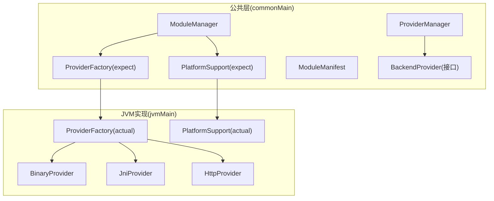
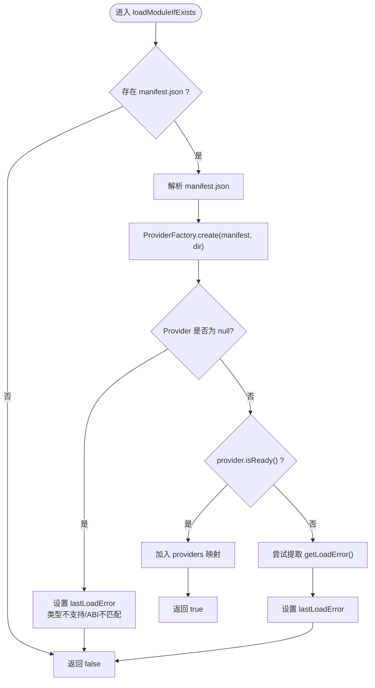
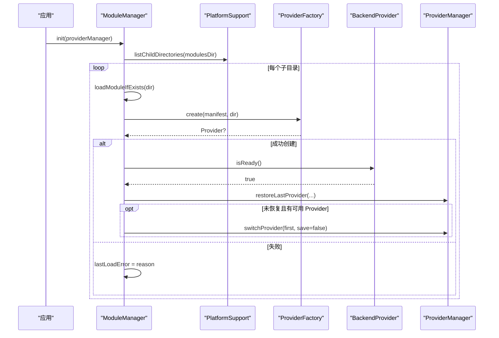
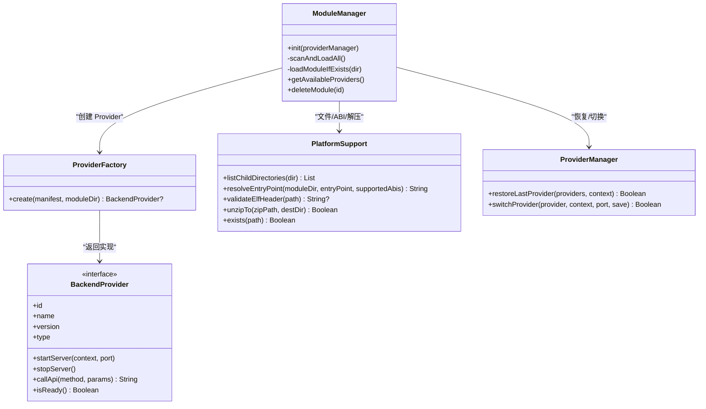

# 模块加载机制

<cite>
**本文引用的文件**
- [ModuleManager.kt](file://kmp-pro/src/commonMain/kotlin/cp/player/kmp/provider/ModuleManager.kt)
- [ProviderFactory.kt（common）](file://kmp-pro/src/commonMain/kotlin/cp/player/kmp/provider/ProviderFactory.kt)
- [ProviderFactory.kt（jvm）](file://kmp-pro/src/jvmMain/kotlin/cp/player/kmp/provider/ProviderFactory.kt)
- [PlatformSupport.kt（common）](file://kmp-pro/src/commonMain/kotlin/cp/player/kmp/util/PlatformSupport.kt)
- [PlatformSupport.kt（jvm）](file://kmp-pro/src/jvmMain/kotlin/cp/player/kmp/util/PlatformSupport.kt)
- [ModuleManifest.kt](file://kmp-pro/src/commonMain/kotlin/cp/player/kmp/provider/ModuleManifest.kt)
- [BackendProvider.kt](file://kmp-pro/src/commonMain/kotlin/cp/player/kmp/provider/BackendProvider.kt)
- [ProviderManager.kt](file://kmp-pro/src/commonMain/kotlin/cp/player/kmp/provider/ProviderManager.kt)
</cite>

## 目录
1. [简介](#简介)
2. [项目结构](#项目结构)
3. [核心组件](#核心组件)
4. [架构总览](#架构总览)
5. [详细组件分析](#详细组件分析)
6. [依赖关系分析](#依赖关系分析)
7. [性能考虑](#性能考虑)
8. [故障排查指南](#故障排查指南)
9. [结论](#结论)
10. [附录](#附录)

## 简介
本文件围绕 CPPlayer-KMP 的“模块加载机制”进行系统化说明，重点解释 ModuleManager 如何扫描 modulesDir、发现并加载子模块；解析 manifest.json；通过 ProviderFactory 创建具体 Provider；校验 ABI 与就绪状态；以及错误处理与回滚策略。文档同时提供时序图、流程图和类图，帮助读者从高层到代码级理解整个加载流程。

## 项目结构
模块加载相关代码主要位于 kmp-pro 模块：
- commonMain：定义跨平台抽象与核心逻辑（ModuleManager、ProviderFactory expect、PlatformSupport expect、ModuleManifest、BackendProvider、ProviderManager）。
- jvmMain：提供 JVM 共享实现（Android 与 Desktop 共用），包括 PlatformSupport actual、ProviderFactory actual、BinaryProvider/JniProvider 等。



图表来源
- [ModuleManager.kt:1-137](file://kmp-pro/src/commonMain/kotlin/cp/player/kmp/provider/ModuleManager.kt#L1-L137)
- [ProviderFactory.kt（common）:1-29](file://kmp-pro/src/commonMain/kotlin/cp/player/kmp/provider/ProviderFactory.kt#L1-L29)
- [ProviderFactory.kt（jvm）:1-31](file://kmp-pro/src/jvmMain/kotlin/cp/player/kmp/provider/ProviderFactory.kt#L1-L31)
- [PlatformSupport.kt（common）:1-59](file://kmp-pro/src/commonMain/kotlin/cp/player/kmp/util/PlatformSupport.kt#L1-L59)
- [PlatformSupport.kt（jvm）:1-135](file://kmp-pro/src/jvmMain/kotlin/cp/player/kmp/util/PlatformSupport.kt#L1-L135)
- [BackendProvider.kt:1-110](file://kmp-pro/src/commonMain/kotlin/cp/player/kmp/provider/BackendProvider.kt#L1-L110)
- [ProviderManager.kt:1-156](file://kmp-pro/src/commonMain/kotlin/cp/player/kmp/provider/ProviderManager.kt#L1-L156)

章节来源
- [ModuleManager.kt:1-137](file://kmp-pro/src/commonMain/kotlin/cp/player/kmp/provider/ModuleManager.kt#L1-L137)
- [PlatformSupport.kt（common）:1-59](file://kmp-pro/src/commonMain/kotlin/cp/player/kmp/util/PlatformSupport.kt#L1-L59)
- [PlatformSupport.kt（jvm）:1-135](file://kmp-pro/src/jvmMain/kotlin/cp/player/kmp/util/PlatformSupport.kt#L1-L135)

## 核心组件
- ModuleManager：负责扫描 modulesDir、导入 zip、加载每个子模块、维护已加载 Provider 列表、暴露可用 Provider 集合，并在初始化时尝试恢复或自动选择首个 Provider。
- ProviderFactory：根据 manifest.type 创建对应 Provider（http/binary/jni），在 jvmMain 中实际完成入口路径解析与实例化。
- PlatformSupport：跨平台能力封装，包含解压、文件操作、ABI 入口解析、ELF 校验、端口探测、子目录枚举等。
- ModuleManifest：模块清单数据模型，描述 id、name、version、type、entryPoint、apiMap、updateUrl、supportedAbis、targetAppPackage 等。
- BackendProvider：Provider 统一接口，定义启动/停止、API 调用、音频分析、就绪检查等。
- ProviderManager：管理当前活跃 Provider、切换、端口分配、持久化最近使用 Provider、对外暴露 StateFlow 供 UI 观察。

章节来源
- [ModuleManager.kt:1-137](file://kmp-pro/src/commonMain/kotlin/cp/player/kmp/provider/ModuleManager.kt#L1-L137)
- [ProviderFactory.kt（common）:1-29](file://kmp-pro/src/commonMain/kotlin/cp/player/kmp/provider/ProviderFactory.kt#L1-L29)
- [ProviderFactory.kt（jvm）:1-31](file://kmp-pro/src/jvmMain/kotlin/cp/player/kmp/provider/ProviderFactory.kt#L1-L31)
- [PlatformSupport.kt（common）:1-59](file://kmp-pro/src/commonMain/kotlin/cp/player/kmp/util/PlatformSupport.kt#L1-L59)
- [PlatformSupport.kt（jvm）:1-135](file://kmp-pro/src/jvmMain/kotlin/cp/player/kmp/util/PlatformSupport.kt#L1-L135)
- [ModuleManifest.kt:1-31](file://kmp-pro/src/commonMain/kotlin/cp/player/kmp/provider/ModuleManifest.kt#L1-L31)
- [BackendProvider.kt:1-110](file://kmp-pro/src/commonMain/kotlin/cp/player/kmp/provider/BackendProvider.kt#L1-L110)
- [ProviderManager.kt:1-156](file://kmp-pro/src/commonMain/kotlin/cp/player/kmp/provider/ProviderManager.kt#L1-L156)

## 架构总览
模块加载的整体流程如下：
- 应用启动后，ModuleManager.init() 被调用，确保 modulesDir 存在，然后 scanAndLoadAll() 遍历子目录逐一 loadModuleIfExists()。
- loadModuleIfExists() 读取 manifest.json，调用 ProviderFactory.create() 创建 Provider，随后验证 isReady()。
- 成功加载的 Provider 加入内存映射，并通过 ProviderManager 恢复或自动选择活跃 Provider。
- 平台差异由 PlatformSupport.actual 与 ProviderFactory.actual 承担，如 ABI 匹配、入口文件定位、ELF 校验等。

```mermaid
sequenceDiagram
participant App as "应用"
participant MM as "ModuleManager"
participant PS as "PlatformSupport"
participant PF as "ProviderFactory"
participant Prov as "BackendProvider"
participant PM as "ProviderManager"
App->>MM : init(providerManager)
MM->>PS : exists(modulesDir)
MM->>MM : scanAndLoadAll()
loop 遍历子目录
MM->>PS : listChildDirectories(modulesDir)
MM->>MM : loadModuleIfExists(dir)
alt 存在 manifest.json
MM->>MM : 解析 manifest.json
MM->>PF : create(manifest, dir)
PF-->>MM : Provider? (可能为 null)
opt Provider 非空
MM->>Prov : isReady()
Prov-->>MM : true/false
alt 就绪
MM->>PM : 更新可用 Provider 列表
else 未就绪
MM->>MM : 记录 lastLoadError
end
else Provider 为空
MM->>MM : 记录 lastLoadError类型不支持/ABI不匹配
end
else 无 manifest
MM-->>MM : 跳过
end
end
MM->>PM : restoreLastProvider(availableProviders, context)
opt 未恢复且存在可用 Provider
MM->>PM : switchProvider(first, save=false)
end
```

图表来源
- [ModuleManager.kt:35-48](file://kmp-pro/src/commonMain/kotlin/cp/player/kmp/provider/ModuleManager.kt#L35-L48)
- [ModuleManager.kt:50-54](file://kmp-pro/src/commonMain/kotlin/cp/player/kmp/provider/ModuleManager.kt#L50-L54)
- [ModuleManager.kt:88-117](file://kmp-pro/src/commonMain/kotlin/cp/player/kmp/provider/ModuleManager.kt#L88-L117)
- [ProviderFactory.kt（jvm）:7-30](file://kmp-pro/src/jvmMain/kotlin/cp/player/kmp/provider/ProviderFactory.kt#L7-L30)
- [PlatformSupport.kt（jvm）:67-82](file://kmp-pro/src/jvmMain/kotlin/cp/player/kmp/util/PlatformSupport.kt#L67-L82)
- [PlatformSupport.kt（jvm）:123-127](file://kmp-pro/src/jvmMain/kotlin/cp/player/kmp/util/PlatformSupport.kt#L123-L127)
- [ProviderManager.kt:116-121](file://kmp-pro/src/commonMain/kotlin/cp/player/kmp/provider/ProviderManager.kt#L116-L121)

## 详细组件分析

### ModuleManager.init() 与 scanAndLoadAll()
- init() 会确保 modulesDir 存在，调用 scanAndLoadAll() 扫描并加载所有子模块，更新 providersFlow，并尝试通过 ProviderManager.restoreLastProvider() 恢复上次活跃的 Provider；若未恢复且存在可用 Provider，则自动选择第一个作为默认。
- scanAndLoadAll() 通过 PlatformSupport.listChildDirectories() 获取 modulesDir 下的所有子目录，并对每个子目录调用 loadModuleIfExists()。

章节来源
- [ModuleManager.kt:35-48](file://kmp-pro/src/commonMain/kotlin/cp/player/kmp/provider/ModuleManager.kt#L35-L48)
- [ModuleManager.kt:50-54](file://kmp-pro/src/commonMain/kotlin/cp/player/kmp/provider/ModuleManager.kt#L50-L54)
- [PlatformSupport.kt（jvm）:123-127](file://kmp-pro/src/jvmMain/kotlin/cp/player/kmp/util/PlatformSupport.kt#L123-L127)

### loadModuleIfExists() 工作流程
- 检查子目录是否存在 manifest.json；不存在则直接返回 false。
- 解析 manifest.json 为 ModuleManifest。
- 调用 ProviderFactory.create(manifest, dir) 创建 Provider。
- 若 Provider 为 null，根据 manifest.type 设置 lastLoadError（如 JNI 缺少 native 库、binary 入口缺失或不匹配 ABI、未知类型）。
- 若 Provider 不为空但 isReady() 为 false，则通过反射尝试提取 getLoadError() 详情，并记录 lastLoadError。
- 成功后将 Provider 加入内存映射，并返回 true。



图表来源
- [ModuleManager.kt:88-117](file://kmp-pro/src/commonMain/kotlin/cp/player/kmp/provider/ModuleManager.kt#L88-L117)
- [ProviderFactory.kt（jvm）:7-30](file://kmp-pro/src/jvmMain/kotlin/cp/player/kmp/provider/ProviderFactory.kt#L7-L30)

章节来源
- [ModuleManager.kt:88-117](file://kmp-pro/src/commonMain/kotlin/cp/player/kmp/provider/ModuleManager.kt#L88-L117)

### 模块依赖解析与版本兼容性
- 版本兼容性：manifest.version 用于声明模块版本；当前加载流程未对版本范围进行强制校验，仅作为元信息保存。如需版本兼容检查，可在后续扩展中对 version 进行语义化比较。
- ABI 匹配验证：
  - PlatformSupport.resolveEntryPoint() 按平台支持的 ABI 顺序查找 lib/{abi}/{entryPoint}，优先匹配 supportedAbis 与平台 ABI 的交集，最后回退到根 entryPoint。
  - validateElfHeader() 读取 ELF 魔数与机器码，对比当前设备架构；若不匹配则返回错误描述，可用于阻止加载/启动。
  - 在 ProviderFactory.actual 中，对于 binary/jni 类型，先 resolveEntryPoint 再判断文件是否存在，不存在则返回 null，从而避免加载不匹配的 ABI。

章节来源
- [PlatformSupport.kt（jvm）:67-82](file://kmp-pro/src/jvmMain/kotlin/cp/player/kmp/util/PlatformSupport.kt#L67-L82)
- [PlatformSupport.kt（jvm）:89-121](file://kmp-pro/src/jvmMain/kotlin/cp/player/kmp/util/PlatformSupport.kt#L89-L121)
- [ProviderFactory.kt（jvm）:18-27](file://kmp-pro/src/jvmMain/kotlin/cp/player/kmp/provider/ProviderFactory.kt#L18-L27)
- [ModuleManifest.kt:5-31](file://kmp-pro/src/commonMain/kotlin/cp/player/kmp/provider/ModuleManifest.kt#L5-L31)

### 错误处理策略与回滚机制
- 导入失败回滚：importModule() 在解压失败或缺少 manifest.json 时会删除临时目录，并记录 lastLoadError。
- 移动失败：moveDir() 失败时保留临时目录以便重试，并记录 lastLoadError。
- 加载失败：loadModuleIfExists() 捕获异常并记录 lastLoadError；当 Provider 创建失败或未就绪时，不会将其加入 providers 映射，避免污染可用列表。
- 切换失败保护：ProviderManager.switchProvider() 在端口不可用或 startServer() 抛异常时，回滚到 previousProvider，并通知 UI。

章节来源
- [ModuleManager.kt:56-86](file://kmp-pro/src/commonMain/kotlin/cp/player/kmp/provider/ModuleManager.kt#L56-L86)
- [ModuleManager.kt:88-117](file://kmp-pro/src/commonMain/kotlin/cp/player/kmp/provider/ModuleManager.kt#L88-L117)
- [ProviderManager.kt:80-109](file://kmp-pro/src/commonMain/kotlin/cp/player/kmp/provider/ProviderManager.kt#L80-L109)

### 典型时序图：模块加载与激活


图表来源
- [ModuleManager.kt:35-48](file://kmp-pro/src/commonMain/kotlin/cp/player/kmp/provider/ModuleManager.kt#L35-L48)
- [ModuleManager.kt:50-54](file://kmp-pro/src/commonMain/kotlin/cp/player/kmp/provider/ModuleManager.kt#L50-L54)
- [ModuleManager.kt:88-117](file://kmp-pro/src/commonMain/kotlin/cp/player/kmp/provider/ModuleManager.kt#L88-L117)
- [ProviderFactory.kt（jvm）:7-30](file://kmp-pro/src/jvmMain/kotlin/cp/player/kmp/provider/ProviderFactory.kt#L7-L30)
- [ProviderManager.kt:116-121](file://kmp-pro/src/commonMain/kotlin/cp/player/kmp/provider/ProviderManager.kt#L116-L121)

### 异常处理示例
- 场景一：JNI 模块缺少 native 库或 ABI 不匹配
  - 现象：ProviderFactory.create() 返回 null；ModuleManager.lastLoadError 设置为“缺少与当前平台 ABI 匹配的 native 库文件”。
  - 依据：[ProviderFactory.kt（jvm）:23-27](file://kmp-pro/src/jvmMain/kotlin/cp/player/kmp/provider/ProviderFactory.kt#L23-L27)、[ModuleManager.kt:98-104](file://kmp-pro/src/commonMain/kotlin/cp/player/kmp/provider/ModuleManager.kt#L98-L104)
- 场景二：二进制入口文件不存在
  - 现象：resolveEntryPoint 找到路径但不存在；create() 返回 null；lastLoadError 提示“二进制入口文件不存在或与当前平台 ABI 不匹配”。
  - 依据：[ProviderFactory.kt（jvm）:18-22](file://kmp-pro/src/jvmMain/kotlin/cp/player/kmp/provider/ProviderFactory.kt#L18-L22)、[ModuleManager.kt:98-104](file://kmp-pro/src/commonMain/kotlin/cp/player/kmp/provider/ModuleManager.kt#L98-L104)
- 场景三：Provider 未就绪（例如 JNI 加载失败）
  - 现象：isReady() 返回 false；extractLoadError() 尝试获取 getLoadError()；lastLoadError 记录“Provider 未就绪 [...]”。
  - 依据：[ModuleManager.kt:106-110](file://kmp-pro/src/commonMain/kotlin/cp/player/kmp/provider/ModuleManager.kt#L106-L110)、[ModuleManager.kt:119-124](file://kmp-pro/src/commonMain/kotlin/cp/player/kmp/provider/ModuleManager.kt#L119-L124)
- 场景四：端口占用导致切换失败
  - 现象：findAvailablePort() 找不到可用端口；switchProvider() 回滚到 previousProvider。
  - 依据：[ProviderManager.kt:80-109](file://kmp-pro/src/commonMain/kotlin/cp/player/kmp/provider/ProviderManager.kt#L80-L109)

章节来源
- [ProviderFactory.kt（jvm）:18-27](file://kmp-pro/src/jvmMain/kotlin/cp/player/kmp/provider/ProviderFactory.kt#L18-L27)
- [ModuleManager.kt:98-110](file://kmp-pro/src/commonMain/kotlin/cp/player/kmp/provider/ModuleManager.kt#L98-L110)
- [ProviderManager.kt:80-109](file://kmp-pro/src/commonMain/kotlin/cp/player/kmp/provider/ProviderManager.kt#L80-L109)

## 依赖关系分析
- ModuleManager 依赖：
  - PlatformSupport：文件系统、ABI 入口解析、解压、子目录枚举。
  - ProviderFactory：按 manifest.type 创建 Provider。
  - ProviderManager：恢复/切换活跃 Provider。
- ProviderFactory（jvm）依赖：
  - PlatformSupport：resolveEntryPoint、exists。
  - 具体 Provider 类型：HttpProvider、BinaryProvider、JniProvider。
- PlatformSupport（jvm）依赖：
  - PlatformInfo：supportedAbis、modulesDirectory（通过 PlatformContext）。
  - Java IO：ZipInputStream、File、ServerSocket。



图表来源
- [ModuleManager.kt:1-137](file://kmp-pro/src/commonMain/kotlin/cp/player/kmp/provider/ModuleManager.kt#L1-L137)
- [ProviderFactory.kt（common）:1-29](file://kmp-pro/src/commonMain/kotlin/cp/player/kmp/provider/ProviderFactory.kt#L1-L29)
- [ProviderFactory.kt（jvm）:1-31](file://kmp-pro/src/jvmMain/kotlin/cp/player/kmp/provider/ProviderFactory.kt#L1-L31)
- [PlatformSupport.kt（common）:1-59](file://kmp-pro/src/commonMain/kotlin/cp/player/kmp/util/PlatformSupport.kt#L1-L59)
- [PlatformSupport.kt（jvm）:1-135](file://kmp-pro/src/jvmMain/kotlin/cp/player/kmp/util/PlatformSupport.kt#L1-L135)
- [BackendProvider.kt:1-110](file://kmp-pro/src/commonMain/kotlin/cp/player/kmp/provider/BackendProvider.kt#L1-L110)
- [ProviderManager.kt:1-156](file://kmp-pro/src/commonMain/kotlin/cp/player/kmp/provider/ProviderManager.kt#L1-L156)

章节来源
- [ModuleManager.kt:1-137](file://kmp-pro/src/commonMain/kotlin/cp/player/kmp/provider/ModuleManager.kt#L1-L137)
- [ProviderFactory.kt（jvm）:1-31](file://kmp-pro/src/jvmMain/kotlin/cp/player/kmp/provider/ProviderFactory.kt#L1-L31)
- [PlatformSupport.kt（jvm）:1-135](file://kmp-pro/src/jvmMain/kotlin/cp/player/kmp/util/PlatformSupport.kt#L1-L135)
- [BackendProvider.kt:1-110](file://kmp-pro/src/commonMain/kotlin/cp/player/kmp/provider/BackendProvider.kt#L1-L110)
- [ProviderManager.kt:1-156](file://kmp-pro/src/commonMain/kotlin/cp/player/kmp/provider/ProviderManager.kt#L1-L156)

## 性能考虑
- 目录遍历：listChildDirectories() 仅列出子目录，避免递归遍历深层结构，减少 I/O 开销。
- ABI 解析：resolveEntryPoint() 按平台 ABI 顺序查找，命中即返回，减少不必要的文件访问。
- 端口探测：findAvailablePort() 限制最大尝试次数，避免长时间阻塞。
- JSON 解析：ignoreUnknownKeys=true 提升兼容性，降低因字段变更导致的解析失败概率。
- 建议：
  - 对大目录可考虑异步扫描与增量更新。
  - 对 ELF 校验可缓存结果以避免重复读取。
  - 对 Provider 启动失败可引入重试与退避策略。

## 故障排查指南
- 问题：模块未出现在可用列表中
  - 检查 modulesDir 下是否存在子目录与 manifest.json。
  - 查看 lastLoadError 是否记录了“Provider 创建失败”或“Provider 未就绪”。
  - 确认 ABI 匹配：检查 manifest.supportedAbis 与设备 ABI，必要时调整 lib/{abi}/ 目录结构。
- 问题：切换 Provider 失败
  - 检查端口是否被占用；ProviderManager 会在端口不可用时回滚。
  - 查看 Provider.startServer() 是否抛出异常；必要时增加日志与重试。
- 问题：JNI 模块加载失败
  - 确认 .so/.dll/.dylib 文件存在且与平台 ABI 匹配。
  - 使用 validateElfHeader() 检查 ELF 头与架构是否一致。
  - 通过反射提取 getLoadError() 获取更详细信息。

章节来源
- [ModuleManager.kt:56-86](file://kmp-pro/src/commonMain/kotlin/cp/player/kmp/provider/ModuleManager.kt#L56-L86)
- [ModuleManager.kt:88-117](file://kmp-pro/src/commonMain/kotlin/cp/player/kmp/provider/ModuleManager.kt#L88-L117)
- [PlatformSupport.kt（jvm）:89-121](file://kmp-pro/src/jvmMain/kotlin/cp/player/kmp/util/PlatformSupport.kt#L89-L121)
- [ProviderManager.kt:80-109](file://kmp-pro/src/commonMain/kotlin/cp/player/kmp/provider/ProviderManager.kt#L80-L109)

## 结论
该模块加载机制以 ModuleManager 为核心，结合 PlatformSupport 的跨平台能力与 ProviderFactory 的类型分发，实现了从目录扫描、清单解析、ABI 匹配到 Provider 初始化的完整链路。错误处理贯穿导入、移动、加载与切换各阶段，确保系统健壮性。未来可扩展版本兼容性检查、异步扫描与更丰富的诊断信息，以提升用户体验与可维护性。

## 附录
- 关键数据结构
  - ModuleManifest：id、name、version、type、entryPoint、apiMap、updateUrl、supportedAbis、targetAppPackage。
  - BackendProvider：id、name、version、type、apiMap、updateUrl、targetAppPackage、startServer/stopServer/callApi/analyzeAudio/isReady。
- 关键方法路径参考
  - 扫描与加载：[ModuleManager.kt:35-54](file://kmp-pro/src/commonMain/kotlin/cp/player/kmp/provider/ModuleManager.kt#L35-L54)
  - 清单解析与 Provider 创建：[ModuleManager.kt:88-117](file://kmp-pro/src/commonMain/kotlin/cp/player/kmp/provider/ModuleManager.kt#L88-L117)
  - ABI 入口解析与 ELF 校验：[PlatformSupport.kt（jvm）:67-121](file://kmp-pro/src/jvmMain/kotlin/cp/player/kmp/util/PlatformSupport.kt#L67-L121)
  - Provider 切换与恢复：[ProviderManager.kt:80-121](file://kmp-pro/src/commonMain/kotlin/cp/player/kmp/provider/ProviderManager.kt#L80-L121)