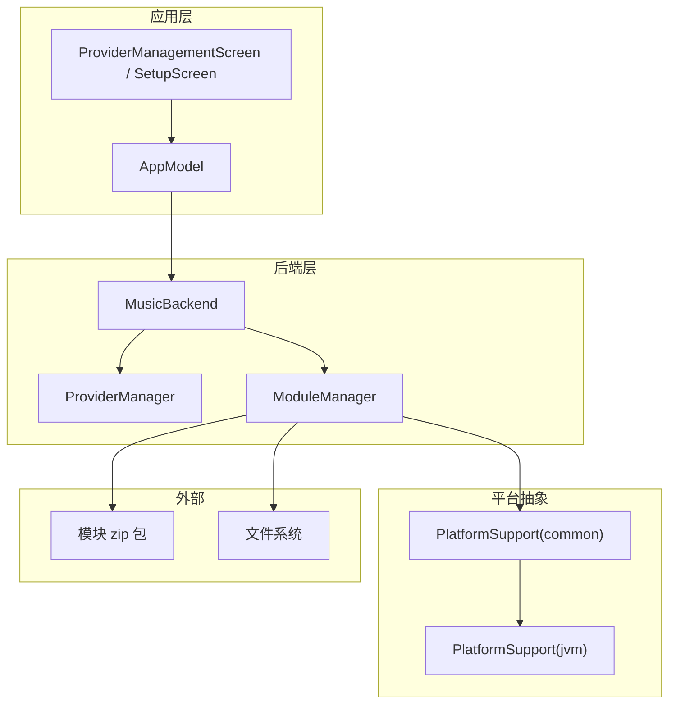
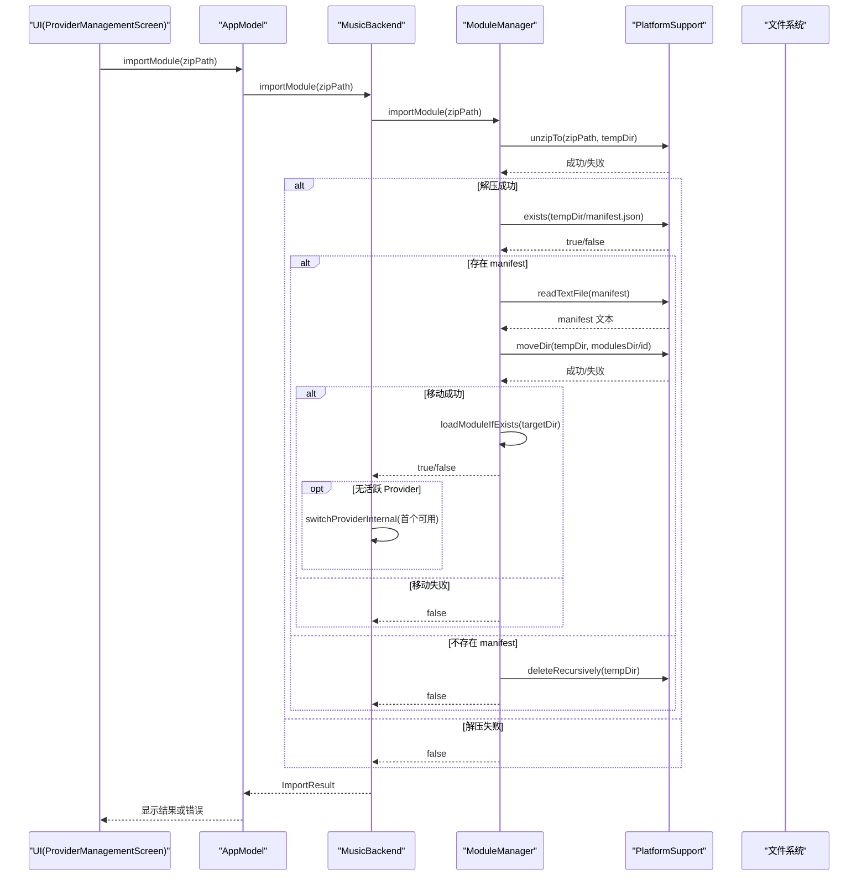
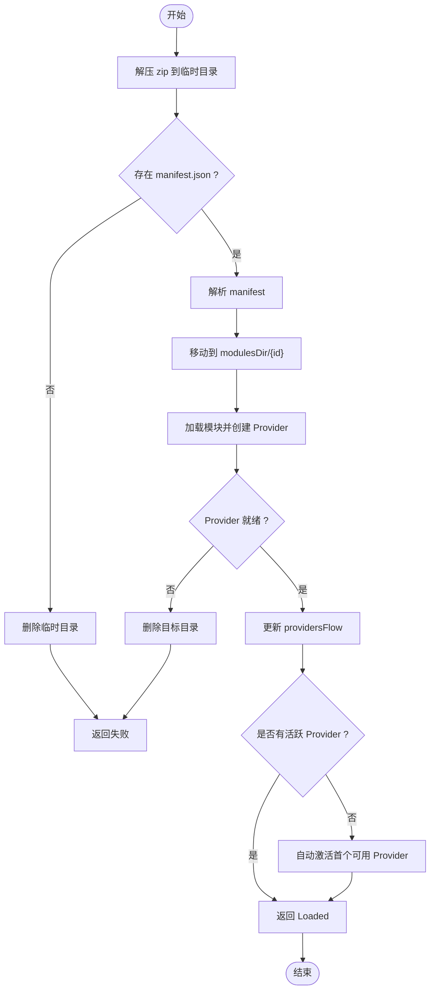
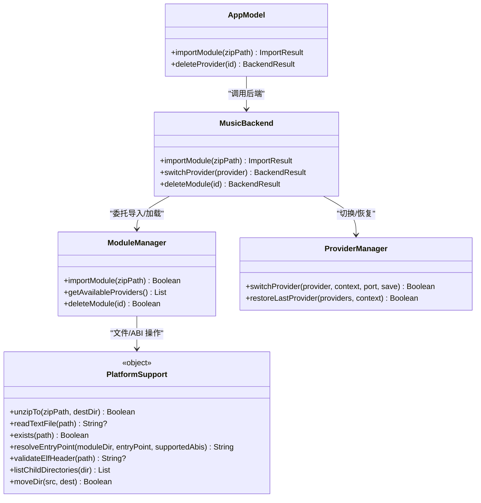

# 模块导入导出

<cite>
**本文引用的文件**
- [ModuleManager.kt](file://kmp-pro/src/commonMain/kotlin/cp/player/kmp/provider/ModuleManager.kt)
- [ModuleManifest.kt](file://kmp-pro/src/commonMain/kotlin/cp/player/kmp/provider/ModuleManifest.kt)
- [PlatformSupport.kt（common）](file://kmp-pro/src/commonMain/kotlin/cp/player/kmp/util/PlatformSupport.kt)
- [PlatformSupport.kt（jvm）](file://kmp-pro/src/jvmMain/kotlin/cp/player/kmp/util/PlatformSupport.kt)
- [MusicBackend.kt](file://kmp-pro/src/commonMain/kotlin/cp/player/kmp/MusicBackend.kt)
- [ProviderManager.kt](file://kmp-pro/src/commonMain/kotlin/cp/player/kmp/provider/ProviderManager.kt)
- [AppModel.kt](file://app/src/commonMain/kotlin/cp/player/kmp/app/AppModel.kt)
- [PlatformFilePicker.kt（common）](file://app/src/commonMain/kotlin/cp/player/kmp/app/platform/PlatformFilePicker.kt)
- [PlatformFilePicker.android.kt](file://app/src/androidMain/kotlin/cp/player/kmp/app/platform/PlatformFilePicker.android.kt)
- [build_module.sh](file://API_MODULE_AND_OLD_PROJECT_REPO/3rd-CPPlayer-netcloudMusic-Muti/build_module.sh)
</cite>

## 目录
1. [简介](#简介)
2. [项目结构](#项目结构)
3. [核心组件](#核心组件)
4. [架构总览](#架构总览)
5. [详细组件分析](#详细组件分析)
6. [依赖关系分析](#依赖关系分析)
7. [性能考虑](#性能考虑)
8. [故障排查指南](#故障排查指南)
9. [结论](#结论)
10. [附录：API 使用与最佳实践](#附录api-使用与最佳实践)

## 简介
本章节面向 CPPlayer KMP 的“模块导入导出”能力，聚焦以下目标：
- 详细说明 importModule() 的实现逻辑：zip 解压、临时目录管理、manifest.json 校验、目标目录移动与冲突处理、模块加载与 Provider 激活。
- 明确模块包打包规范：目录结构要求、manifest.json 字段约定、ABI 多架构支持。
- 阐述导入过程中的错误处理：解压失败、缺少 manifest、文件冲突、权限问题、ABI 不匹配等。
- 说明模块导出机制：如何打包为 zip、分发格式与产物命名建议。
- 跨平台兼容性：Android 与 Desktop 的文件路径、编码、ABI 选择差异。
- API 使用示例与批量操作指南：从 UI 到后端的调用链路、常见用法。
- 版本管理与升级策略：基于 manifest 的版本控制与更新流程建议。

## 项目结构
模块导入导出相关代码主要分布在以下位置：
- 模块管理器与清单定义：kmp-pro 模块的 provider 层
- 平台抽象与实现：kmp-pro 模块的 util 层（expect/actual）
- 后端入口与状态机：kmp-pro 模块的 MusicBackend
- 应用层集成：app 模块的 UI 与模型层
- 第三方模块构建脚本：用于生成符合规范的 zip 模块包

图表来源
- [MusicBackend.kt:180-204](file://kmp-pro/src/commonMain/kotlin/cp/player/kmp/MusicBackend.kt#L180-L204)
- [ModuleManager.kt:56-86](file://kmp-pro/src/commonMain/kotlin/cp/player/kmp/provider/ModuleManager.kt#L56-L86)
- [PlatformSupport.kt（common）:13-59](file://kmp-pro/src/commonMain/kotlin/cp/player/kmp/util/PlatformSupport.kt#L13-L59)
- [PlatformSupport.kt（jvm）:35-59](file://kmp-pro/src/jvmMain/kotlin/cp/player/kmp/util/PlatformSupport.kt#L35-L59)

章节来源
- [MusicBackend.kt:180-204](file://kmp-pro/src/commonMain/kotlin/cp/player/kmp/MusicBackend.kt#L180-L204)
- [ModuleManager.kt:56-86](file://kmp-pro/src/commonMain/kotlin/cp/player/kmp/provider/ModuleManager.kt#L56-L86)
- [PlatformSupport.kt（common）:13-59](file://kmp-pro/src/commonMain/kotlin/cp/player/kmp/util/PlatformSupport.kt#L13-L59)
- [PlatformSupport.kt（jvm）:35-59](file://kmp-pro/src/jvmMain/kotlin/cp/player/kmp/util/PlatformSupport.kt#L35-L59)

## 核心组件
- ModuleManager：负责模块扫描、导入、加载、删除；维护已加载 Provider 列表与最近错误信息。
- ModuleManifest：描述模块元数据（id、name、version、type、entryPoint、supportedAbis、targetAppPackage 等）。
- PlatformSupport：跨平台文件与 ABI 能力抽象（解压、移动、读取、ABI 解析、ELF 校验等）。
- MusicBackend：对外统一入口，封装导入、切换、删除模块，并驱动状态迁移与自动激活。
- ProviderManager：活跃 Provider 切换、端口探测与服务启停、Cookie 隔离存储。
- AppModel：UI 与后端之间的桥梁，暴露 importModule/deleteProvider 等方法。

章节来源
- [ModuleManager.kt:1-137](file://kmp-pro/src/commonMain/kotlin/cp/player/kmp/provider/ModuleManager.kt#L1-L137)
- [ModuleManifest.kt:1-31](file://kmp-pro/src/commonMain/kotlin/cp/player/kmp/provider/ModuleManifest.kt#L1-L31)
- [PlatformSupport.kt（common）:1-59](file://kmp-pro/src/commonMain/kotlin/cp/player/kmp/util/PlatformSupport.kt#L1-L59)
- [MusicBackend.kt:180-248](file://kmp-pro/src/commonMain/kotlin/cp/player/kmp/MusicBackend.kt#L180-L248)
- [ProviderManager.kt:62-121](file://kmp-pro/src/commonMain/kotlin/cp/player/kmp/provider/ProviderManager.kt#L62-L121)
- [AppModel.kt:270-282](file://app/src/commonMain/kotlin/cp/player/kmp/app/AppModel.kt#L270-L282)

## 架构总览
模块导入导出的整体流程如下：
- UI 通过 AppModel 触发 importModule(zipPath)。
- MusicBackend 委托 ModuleManager.importModule 执行解压、校验、移动与加载。
- ModuleManager 使用 PlatformSupport 进行跨平台文件操作与 ABI 解析。
- 成功加载后，若此前无活跃 Provider，则自动激活首个可用 Provider。
- 失败时设置 lastLoadError，供 UI 展示。

图表来源
- [MusicBackend.kt:180-204](file://kmp-pro/src/commonMain/kotlin/cp/player/kmp/MusicBackend.kt#L180-L204)
- [ModuleManager.kt:56-86](file://kmp-pro/src/commonMain/kotlin/cp/player/kmp/provider/ModuleManager.kt#L56-L86)
- [PlatformSupport.kt（jvm）:35-59](file://kmp-pro/src/jvmMain/kotlin/cp/player/kmp/util/PlatformSupport.kt#L35-L59)

## 详细组件分析

### importModule() 实现逻辑
- 解压 zip：调用 PlatformSupport.unzipTo 将 zip 解压到 modulesDir/temp_<时间戳> 临时目录。
- 校验 manifest：检查 tempDir/manifest.json 是否存在；不存在则清理临时目录并返回失败。
- 解析清单：读取并反序列化为 ModuleManifest，提取 id、type、entryPoint、supportedAbis 等。
- 目标目录移动：根据 manifest.id 计算目标目录 modulesDir/id；若已存在则先删除再移动。
- 加载模块：调用 loadModuleIfExists 解析 entryPoint、创建 Provider、校验 isReady。
- 流式更新：成功后更新 providersFlow；失败则清理目标目录并记录 lastLoadError。
- 自动激活：MusicBackend 在导入成功后，若无活跃 Provider，则自动切换到首个可用 Provider。

图表来源
- [ModuleManager.kt:56-86](file://kmp-pro/src/commonMain/kotlin/cp/player/kmp/provider/ModuleManager.kt#L56-L86)
- [ModuleManager.kt:88-117](file://kmp-pro/src/commonMain/kotlin/cp/player/kmp/provider/ModuleManager.kt#L88-L117)
- [MusicBackend.kt:180-204](file://kmp-pro/src/commonMain/kotlin/cp/player/kmp/MusicBackend.kt#L180-L204)

章节来源
- [ModuleManager.kt:56-86](file://kmp-pro/src/commonMain/kotlin/cp/player/kmp/provider/ModuleManager.kt#L56-L86)
- [ModuleManager.kt:88-117](file://kmp-pro/src/commonMain/kotlin/cp/player/kmp/provider/ModuleManager.kt#L88-L117)
- [MusicBackend.kt:180-204](file://kmp-pro/src/commonMain/kotlin/cp/player/kmp/MusicBackend.kt#L180-L204)

### 模块包打包规范
- 目录结构要求：
  - 根目录包含 manifest.json。
  - 入口文件按 ABI 组织：lib/{abi}/{entryPoint}（例如 lib/arm64-v8a/libcp_api.so）。
  - 非 JNI/binary 类型（如 http）按具体实现约定放置资源。
- manifest.json 配置字段：
  - id：模块唯一标识。
  - name：模块名称。
  - version：模块版本号。
  - type：模块类型（jni、binary、http）。
  - entryPoint：入口文件名（如 libcp_api.so）。
  - supportedAbis：支持的 ABI 列表（可选），用于多架构选择。
  - targetAppPackage：目标 App 包名（可选，仅 Android 生效）。
- 打包产物：
  - 将模块目录压缩为 zip 包，便于传输与导入。
  - 建议使用 CI/CD 自动生成 zip，并在 Release 中发布。

章节来源
- [ModuleManifest.kt:5-31](file://kmp-pro/src/commonMain/kotlin/cp/player/kmp/provider/ModuleManifest.kt#L5-L31)
- [PlatformSupport.kt（jvm）:67-82](file://kmp-pro/src/jvmMain/kotlin/cp/player/kmp/util/PlatformSupport.kt#L67-L82)
- [build_module.sh:46-81](file://API_MODULE_AND_OLD_PROJECT_REPO/3rd-CPPlayer-netcloudMusic-Muti/build_module.sh#L46-L81)

### 导入过程错误处理
- 解压失败：unzipTo 返回 false，lastLoadError 设置为“解压失败”。
- 缺少 manifest：检测 tempDir/manifest.json 不存在，清理临时目录，lastLoadError 设置为“模块包中缺少 manifest.json”。
- 移动失败：moveDir 失败，lastLoadError 设置为“移动临时目录失败”。
- 加载失败：loadModuleIfExists 捕获异常，lastLoadError 设置为“加载失败: {message}”。
- Provider 创建失败：根据 type 给出原因（如 ABI 不匹配、二进制缺失、不支持的类型）。
- Provider 未就绪：尝试通过反射获取 getLoadError 详情，lastLoadError 设置为“Provider 未就绪 [{id}]: {detail}”。
- 权限问题：PlatformSupport 底层 IO 异常会被 catch 并返回 false；建议在 UI 提示用户检查存储权限与磁盘空间。

章节来源
- [ModuleManager.kt:56-86](file://kmp-pro/src/commonMain/kotlin/cp/player/kmp/provider/ModuleManager.kt#L56-L86)
- [ModuleManager.kt:88-117](file://kmp-pro/src/commonMain/kotlin/cp/player/kmp/provider/ModuleManager.kt#L88-L117)
- [PlatformSupport.kt（jvm）:35-59](file://kmp-pro/src/jvmMain/kotlin/cp/player/kmp/util/PlatformSupport.kt#L35-L59)

### 模块导出机制
- 导出格式：zip 压缩包，内部包含 manifest.json 与入口文件（按 ABI 组织）。
- 构建脚本参考：build_module.sh 演示了复制 .so 到 lib/{abi}/、生成 manifest.json、压缩为 zip 的流程。
- 分发建议：
  - 通过 CI/CD 生成 zip 并上传至制品库或发布页。
  - 提供版本信息与更新 URL（manifest.updateUrl 可选），便于后续升级。

章节来源
- [build_module.sh:46-81](file://API_MODULE_AND_OLD_PROJECT_REPO/3rd-CPPlayer-netcloudMusic-Muti/build_module.sh#L46-L81)
- [ModuleManifest.kt:5-31](file://kmp-pro/src/commonMain/kotlin/cp/player/kmp/provider/ModuleManifest.kt#L5-L31)

### 跨平台兼容性
- 文件路径与编码：
  - 使用 PlatformSupport 提供的统一接口，避免直接依赖平台特定 API。
  - 读取 manifest.json 使用 readTextFile，确保跨平台一致性。
- ABI 选择：
  - resolveEntryPoint 按平台支持的 ABI 顺序查找 lib/{abi}/{entryPoint}。
  - 当 manifest 声明 supportedAbis 时，优先取与平台 ABI 的交集。
- ELF 校验：
  - validateElfHeader 检查 ELF 魔数与架构是否匹配当前设备 ABI，防止加载错误架构的二进制。
- 模块根目录：
  - modulesDir(context) 由平台实际实现决定，Android 与 Desktop 路径不同但接口一致。

章节来源
- [PlatformSupport.kt（common）:13-59](file://kmp-pro/src/commonMain/kotlin/cp/player/kmp/util/PlatformSupport.kt#L13-L59)
- [PlatformSupport.kt（jvm）:67-121](file://kmp-pro/src/jvmMain/kotlin/cp/player/kmp/util/PlatformSupport.kt#L67-L121)

## 依赖关系分析
- MusicBackend 依赖 ModuleManager 与 ProviderManager，屏蔽内部细节，提供统一 API。
- ModuleManager 依赖 PlatformSupport 完成跨平台文件与 ABI 操作。
- ProviderManager 负责活跃 Provider 切换、端口探测与服务生命周期。
- AppModel 作为 UI 与后端的桥梁，简化调用并转发结果。

图表来源
- [MusicBackend.kt:180-248](file://kmp-pro/src/commonMain/kotlin/cp/player/kmp/MusicBackend.kt#L180-L248)
- [ModuleManager.kt:56-137](file://kmp-pro/src/commonMain/kotlin/cp/player/kmp/provider/ModuleManager.kt#L56-L137)
- [PlatformSupport.kt（common）:13-59](file://kmp-pro/src/commonMain/kotlin/cp/player/kmp/util/PlatformSupport.kt#L13-L59)
- [AppModel.kt:270-282](file://app/src/commonMain/kotlin/cp/player/kmp/app/AppModel.kt#L270-L282)

章节来源
- [MusicBackend.kt:180-248](file://kmp-pro/src/commonMain/kotlin/cp/player/kmp/MusicBackend.kt#L180-L248)
- [ModuleManager.kt:56-137](file://kmp-pro/src/commonMain/kotlin/cp/player/kmp/provider/ModuleManager.kt#L56-L137)
- [PlatformSupport.kt（common）:13-59](file://kmp-pro/src/commonMain/kotlin/cp/player/kmp/util/PlatformSupport.kt#L13-L59)
- [AppModel.kt:270-282](file://app/src/commonMain/kotlin/cp/player/kmp/app/AppModel.kt#L270-L282)

## 性能考虑
- 解压与移动：
  - 使用临时目录避免污染 modulesDir；移动前删除目标目录减少冲突。
  - 大 zip 包解压耗时较长，建议在后台协程执行并反馈进度。
- Provider 启动：
  - 端口探测最多尝试固定次数，避免长时间阻塞。
  - 首次加载需校验 ELF 与 ABI，避免无效启动。
- 流式更新：
  - 使用 StateFlow 通知 UI，减少重复渲染。
- 缓存与复用：
  - 已加载 Provider 可复用，避免重复创建与启动。

[本节为通用指导，无需引用具体文件]

## 故障排查指南
- 解压失败：
  - 检查 zip 完整性与大小；确认存储权限与磁盘空间。
  - 查看 lastLoadError 是否为“解压失败”。
- 缺少 manifest：
  - 确认 zip 根目录包含 manifest.json；检查 JSON 格式与必填字段。
- 文件冲突：
  - 目标目录已存在时会被删除重建；若权限不足，检查写入权限。
- ABI 不匹配：
  - 检查 manifest.supportedAbis 与设备 ABI 是否匹配；确认 lib/{abi}/{entryPoint} 存在。
- Provider 未就绪：
  - 通过反射获取 getLoadError 详情；检查服务启动日志与端口占用情况。
- 权限问题：
  - Android 端需授予存储权限；Desktop 端需确保目标目录可写。

章节来源
- [ModuleManager.kt:56-86](file://kmp-pro/src/commonMain/kotlin/cp/player/kmp/provider/ModuleManager.kt#L56-L86)
- [ModuleManager.kt:88-117](file://kmp-pro/src/commonMain/kotlin/cp/player/kmp/provider/ModuleManager.kt#L88-L117)
- [PlatformSupport.kt（jvm）:35-59](file://kmp-pro/src/jvmMain/kotlin/cp/player/kmp/util/PlatformSupport.kt#L35-L59)

## 结论
本方案通过 ModuleManager 与 PlatformSupport 实现了跨平台的模块导入与加载，结合 MusicBackend 的状态机与自动激活机制，提供了简洁稳定的 API。模块包采用 manifest.json 描述元数据与 ABI 支持，便于多架构部署与版本管理。错误处理覆盖了解压、校验、移动、加载等关键环节，保障导入过程的健壮性。配合构建脚本与 CI/CD，可实现模块的自动化打包与分发。

[本节为总结，无需引用具体文件]

## 附录：API 使用与最佳实践

### API 使用示例
- 从 UI 触发导入：
  - 使用 rememberZipPicker 选择 zip 文件，回调中调用 AppModel.importModule(zipPath)。
  - 根据 ImportResult 显示成功或错误信息。
- 后端调用链：
  - AppModel.importModule -> MusicBackend.importModule -> ModuleManager.importModule。
  - 成功后若无活跃 Provider，自动激活首个可用 Provider。

章节来源
- [PlatformFilePicker.kt（common）:5-16](file://app/src/commonMain/kotlin/cp/player/kmp/app/platform/PlatformFilePicker.kt#L5-L16)
- [PlatformFilePicker.android.kt:17-30](file://app/src/androidMain/kotlin/cp/player/kmp/app/platform/PlatformFilePicker.android.kt#L17-L30)
- [AppModel.kt:270-282](file://app/src/commonMain/kotlin/cp/player/kmp/app/AppModel.kt#L270-L282)
- [MusicBackend.kt:180-204](file://kmp-pro/src/commonMain/kotlin/cp/player/kmp/MusicBackend.kt#L180-L204)

### 批量操作指南
- 批量导入：
  - 遍历多个 zip 路径，依次调用 AppModel.importModule；收集 ImportResult 汇总结果。
  - 对失败的条目记录 lastLoadError 并提示用户。
- 批量删除：
  - 遍历模块 ID，调用 AppModel.deleteProvider；若删除的是活跃 Provider，自动切换至剩余第一个。
- 并发控制：
  - 使用协程并发执行，限制并发度以避免 I/O 瓶颈。
  - 每个任务独立 try-catch，确保单个失败不影响其他任务。

[本节为通用指导，无需引用具体文件]

### 版本管理与升级策略
- 版本字段：
  - manifest.version 用于标识模块版本；UI 可显示版本信息。
- 更新检查：
  - manifest.updateUrl 指向返回最新版本信息的 JSON 端点；客户端定期拉取并提示升级。
- 升级流程：
  - 下载新版本 zip，调用 importModule；若目标目录已存在，先删除再移动。
  - 升级成功后自动激活新 Provider；失败则回滚或提示重试。
- 兼容性：
  - 通过 supportedAbis 声明兼容的 ABI；加载时按平台 ABI 选择正确入口。
  - 若 ABI 不匹配，拒绝加载并提示用户更换模块。

章节来源
- [ModuleManifest.kt:5-31](file://kmp-pro/src/commonMain/kotlin/cp/player/kmp/provider/ModuleManifest.kt#L5-L31)
- [ModuleManager.kt:71-80](file://kmp-pro/src/commonMain/kotlin/cp/player/kmp/provider/ModuleManager.kt#L71-L80)
- [PlatformSupport.kt（jvm）:67-82](file://kmp-pro/src/jvmMain/kotlin/cp/player/kmp/util/PlatformSupport.kt#L67-L82)