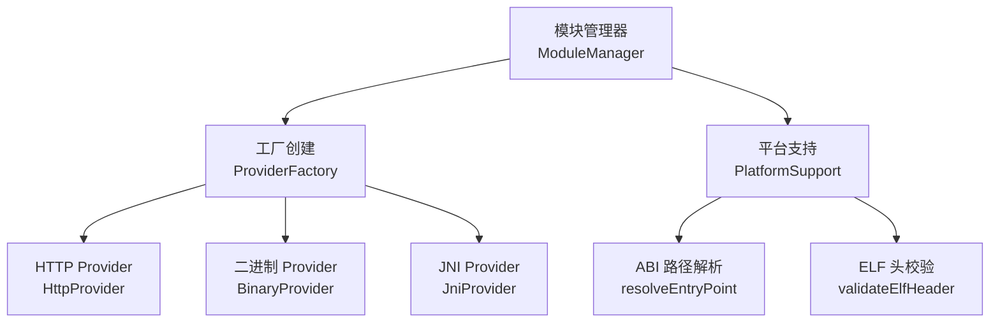
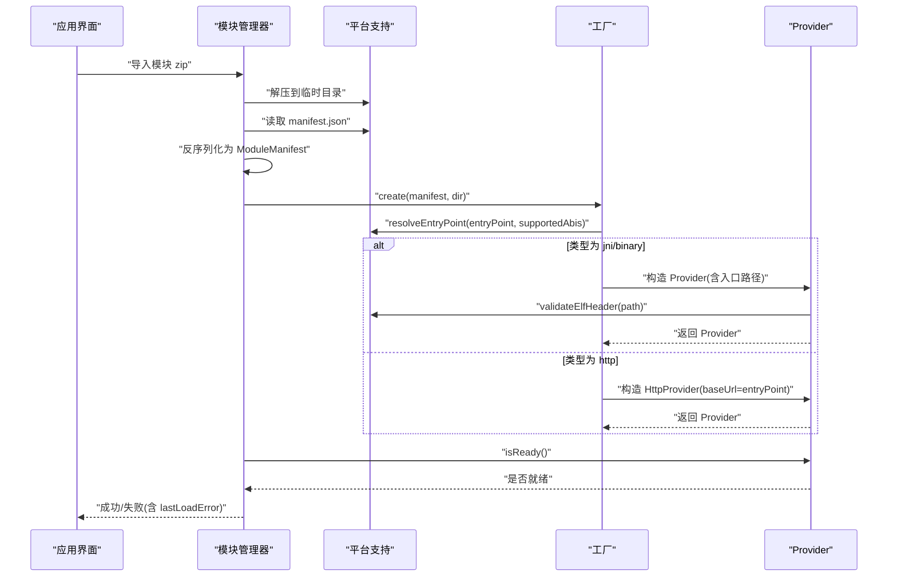
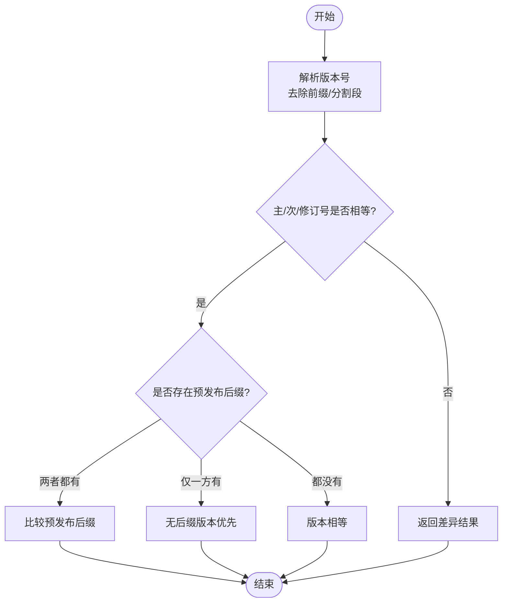
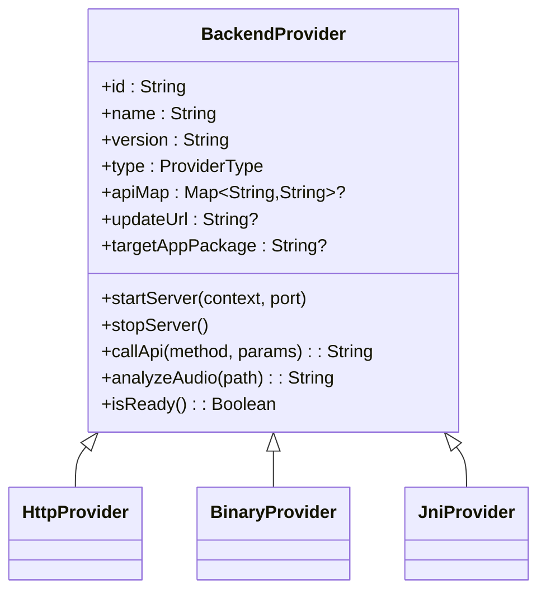
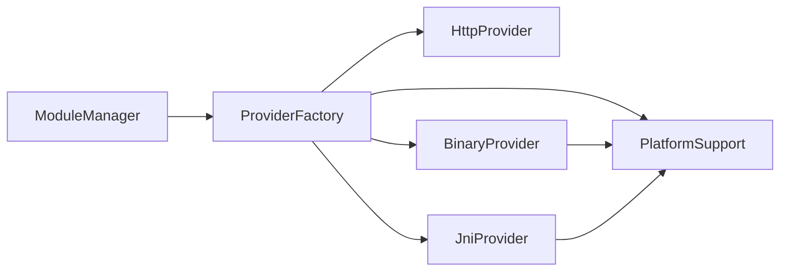

# 模块清单验证

<cite>
**本文引用的文件**
- [ModuleManifest.kt](file://kmp-pro/src/commonMain/kotlin/cp/player/kmp/provider/ModuleManifest.kt)
- [ModuleManager.kt](file://kmp-pro/src/commonMain/kotlin/cp/player/kmp/provider/ModuleManager.kt)
- [BackendProvider.kt](file://kmp-pro/src/commonMain/kotlin/cp/player/kmp/provider/BackendProvider.kt)
- [HttpProvider.kt](file://kmp-pro/src/commonMain/kotlin/cp/player/kmp/provider/HttpProvider.kt)
- [ProviderFactory.kt（common）](file://kmp-pro/src/commonMain/kotlin/cp/player/kmp/provider/ProviderFactory.kt)
- [ProviderFactory.kt（jvm）](file://kmp-pro/src/jvmMain/kotlin/cp/player/kmp/provider/ProviderFactory.kt)
- [PlatformSupport.kt（common）](file://kmp-pro/src/commonMain/kotlin/cp/player/kmp/util/PlatformSupport.kt)
- [PlatformSupport.kt（jvm）](file://kmp-pro/src/jvmMain/kotlin/cp/player/kmp/util/PlatformSupport.kt)
- [JniProvider.kt（jvm）](file://kmp-pro/src/jvmMain/kotlin/cp/player/kmp/provider/JniProvider.kt)
- [BinaryProvider.kt（jvm）](file://kmp-pro/src/jvmMain/kotlin/cp/player/kmp/provider/BinaryProvider.kt)
- [AppUpdateChecker.kt](file://app/src/commonMain/kotlin/cp/player/app/update/AppUpdateChecker.kt)
</cite>

## 目录
1. [简介](#简介)
2. [项目结构](#项目结构)
3. [核心组件](#核心组件)
4. [架构总览](#架构总览)
5. [详细组件分析](#详细组件分析)
6. [依赖关系分析](#依赖关系分析)
7. [性能考量](#性能考量)
8. [故障排查指南](#故障排查指南)
9. [结论](#结论)
10. [附录](#附录)

## 简介
本文件面向“模块清单验证系统”，围绕 ModuleManifest 数据模型、manifest.json 文件格式与必填字段、版本兼容性检查机制、模块类型与入口点要求、元数据校验规则，以及常见错误处理与最佳实践进行系统化说明。目标是帮助开发者正确编写和调试模块清单，确保模块在导入、加载、运行各阶段稳定可用。

## 项目结构
- 模块清单数据模型定义于 commonMain 的 Provider 包中，使用序列化注解描述 manifest.json 的结构。
- 模块管理器负责扫描、导入、加载模块，并基于清单创建具体 Provider。
- 平台相关能力（ABI 解析、ELF 校验等）通过 expect/actual 抽象到 PlatformSupport。
- 不同 Provider 实现（HTTP、Binary、JNI）根据清单 type 与 entryPoint 初始化。

图表来源
- [ModuleManager.kt:1-137](file://kmp-pro/src/commonMain/kotlin/cp/player/kmp/provider/ModuleManager.kt#L1-L137)
- [ProviderFactory.kt（jvm）:1-31](file://kmp-pro/src/jvmMain/kotlin/cp/player/kmp/provider/ProviderFactory.kt#L1-L31)
- [PlatformSupport.kt（common）:37-59](file://kmp-pro/src/commonMain/kotlin/cp/player/kmp/util/PlatformSupport.kt#L37-L59)
- [PlatformSupport.kt（jvm）:68-100](file://kmp-pro/src/jvmMain/kotlin/cp/player/kmp/util/PlatformSupport.kt#L68-L100)

章节来源
- [ModuleManager.kt:1-137](file://kmp-pro/src/commonMain/kotlin/cp/player/kmp/provider/ModuleManager.kt#L1-L137)
- [PlatformSupport.kt（common）:37-59](file://kmp-pro/src/commonMain/kotlin/cp/player/kmp/util/PlatformSupport.kt#L37-L59)

## 核心组件
- ModuleManifest：描述模块标识、名称、版本、类型、入口点、API 映射、更新地址、支持的 ABI、目标 App 包名等。
- ModuleManager：扫描模块目录、导入 zip、解析 manifest、创建 Provider、管理生命周期与错误信息。
- ProviderFactory：依据清单 type 选择并构造对应 Provider；对 jni/binary 类型调用 PlatformSupport.resolveEntryPoint 定位入口文件。
- PlatformSupport：提供跨平台的入口路径解析与 ELF 头校验。
- BackendProvider 及具体实现：统一接口与 HTTP/Binary/JNI 三种后端实现。

章节来源
- [ModuleManifest.kt:1-31](file://kmp-pro/src/commonMain/kotlin/cp/player/kmp/provider/ModuleManifest.kt#L1-L31)
- [ModuleManager.kt:1-137](file://kmp-pro/src/commonMain/kotlin/cp/player/kmp/provider/ModuleManager.kt#L1-L137)
- [BackendProvider.kt:1-110](file://kmp-pro/src/commonMain/kotlin/cp/player/kmp/provider/BackendProvider.kt#L1-L110)
- [HttpProvider.kt:1-60](file://kmp-pro/src/commonMain/kotlin/cp/player/kmp/provider/HttpProvider.kt#L1-L60)
- [ProviderFactory.kt（jvm）:1-31](file://kmp-pro/src/jvmMain/kotlin/cp/player/kmp/provider/ProviderFactory.kt#L1-L31)
- [PlatformSupport.kt（common）:37-59](file://kmp-pro/src/commonMain/kotlin/cp/player/kmp/util/PlatformSupport.kt#L37-L59)
- [PlatformSupport.kt（jvm）:68-100](file://kmp-pro/src/jvmMain/kotlin/cp/player/kmp/util/PlatformSupport.kt#L68-L100)

## 架构总览
模块从 zip 导入或本地目录加载时，流程如下：
- 解压/扫描模块目录，读取 manifest.json。
- 反序列化为 ModuleManifest。
- 根据 type 调用 ProviderFactory.create，内部按 ABI 策略解析 entryPoint。
- 若为 JNI/Binary，启动前执行 ELF 头校验与就绪检查。
- 将可用的 Provider 注册到管理器，供上层切换与调用。

图表来源
- [ModuleManager.kt:56-117](file://kmp-pro/src/commonMain/kotlin/cp/player/kmp/provider/ModuleManager.kt#L56-L117)
- [ProviderFactory.kt（jvm）:7-31](file://kmp-pro/src/jvmMain/kotlin/cp/player/kmp/provider/ProviderFactory.kt#L7-L31)
- [PlatformSupport.kt（common）:37-59](file://kmp-pro/src/commonMain/kotlin/cp/player/kmp/util/PlatformSupport.kt#L37-L59)
- [PlatformSupport.kt（jvm）:68-100](file://kmp-pro/src/jvmMain/kotlin/cp/player/kmp/util/PlatformSupport.kt#L68-L100)
- [JniProvider.kt（jvm）:118-135](file://kmp-pro/src/jvmMain/kotlin/cp/player/kmp/provider/JniProvider.kt#L118-L135)
- [BinaryProvider.kt（jvm）:54-74](file://kmp-pro/src/jvmMain/kotlin/cp/player/kmp/provider/BinaryProvider.kt#L54-L74)

## 详细组件分析

### ModuleManifest 数据类与 manifest.json 规范
- id：模块唯一标识，用于目录命名与 Provider 注册键。
- name：显示名称，便于用户识别。
- version：语义化版本字符串，用于比较与更新提示。
- type：模块类型，支持 jni、binary、http。
- entryPoint：
  - jni：native 库文件名（如 libxxx.so），实际路径由 resolveEntryPoint 按 ABI 解析。
  - binary：可执行文件名，同样按 ABI 解析。
  - http：服务基础地址（baseUrl）。
- apiMap：可选，方法名映射表，key 为内部标准方法名，value 为 Provider 实际端点名；值为 "unsupported" 表示该功能不支持。
- updateUrl：可选，指向返回最新版本信息的 JSON 端点。
- supportedAbis：可选，声明支持的 CPU 架构列表；为空或 null 表示单架构向后兼容。
- targetAppPackage：可选，Android 端打开目标 App 的包名。

必填字段与约束
- 必填：id、name、version、type、entryPoint。
- type 取值限制：jni、binary、http。
- entryPoint 约束：
  - jni/binary：必须存在与当前平台 ABI 匹配的文件；否则 Provider 创建失败。
  - http：应为有效的服务地址。
- supportedAbis：若提供，需与实际目录结构 lib/{abi}/ 一致，以便自动选择。

章节来源
- [ModuleManifest.kt:1-31](file://kmp-pro/src/commonMain/kotlin/cp/player/kmp/provider/ModuleManifest.kt#L1-L31)
- [ProviderFactory.kt（jvm）:7-31](file://kmp-pro/src/jvmMain/kotlin/cp/player/kmp/provider/ProviderFactory.kt#L7-L31)
- [PlatformSupport.kt（common）:37-59](file://kmp-pro/src/commonMain/kotlin/cp/player/kmp/util/PlatformSupport.kt#L37-L59)

### 版本兼容性检查机制
- 版本解析与比较：
  - 支持带前缀的版本号（如 v1.2.3-alpha），去除前缀后按段比较主版本号、次版本号、修订号。
  - 预发布后缀比较：先字母部分再数字部分，未指定预发布的版本视为更高优先级。
- 向后兼容性：
  - 当远程版本高于本地版本时，认为有新版本可用；比较逻辑保证语义化版本的严格顺序。
- 适用场景：
  - 模块 updateUrl 指向的服务返回新版本信息时，可使用相同比较逻辑判断是否需要更新。

图表来源
- [AppUpdateChecker.kt:96-134](file://app/src/commonMain/kotlin/cp/player/app/update/AppUpdateChecker.kt#L96-L134)

章节来源
- [AppUpdateChecker.kt:96-134](file://app/src/commonMain/kotlin/cp/player/app/update/AppUpdateChecker.kt#L96-L134)

### 模块类型与入口点要求
- jni：
  - entryPoint 为 native 库文件名。
  - 通过 resolveEntryPoint 按平台 ABI 顺序查找 lib/{abi}/ 下的文件。
  - 加载前执行 validateElfHeader 校验 ELF 魔数与架构。
- binary：
  - entryPoint 为可执行文件名。
  - 同样按 ABI 解析，并在启动前执行 ELF 头校验。
  - 启动时将自身设为可执行并传入端口参数。
- http：
  - entryPoint 为服务 baseUrl。
  - 不启动本地进程，直接通过 HTTP 客户端调用。

图表来源
- [BackendProvider.kt:1-110](file://kmp-pro/src/commonMain/kotlin/cp/player/kmp/provider/BackendProvider.kt#L1-L110)
- [HttpProvider.kt:1-60](file://kmp-pro/src/commonMain/kotlin/cp/player/kmp/provider/HttpProvider.kt#L1-L60)
- [BinaryProvider.kt（jvm）:36-74](file://kmp-pro/src/jvmMain/kotlin/cp/player/kmp/provider/BinaryProvider.kt#L36-L74)
- [JniProvider.kt（jvm）:40-141](file://kmp-pro/src/jvmMain/kotlin/cp/player/kmp/provider/JniProvider.kt#L40-L141)

章节来源
- [ProviderFactory.kt（jvm）:7-31](file://kmp-pro/src/jvmMain/kotlin/cp/player/kmp/provider/ProviderFactory.kt#L7-L31)
- [PlatformSupport.kt（jvm）:68-100](file://kmp-pro/src/jvmMain/kotlin/cp/player/kmp/util/PlatformSupport.kt#L68-L100)
- [JniProvider.kt（jvm）:118-135](file://kmp-pro/src/jvmMain/kotlin/cp/player/kmp/provider/JniProvider.kt#L118-L135)
- [BinaryProvider.kt（jvm）:54-74](file://kmp-pro/src/jvmMain/kotlin/cp/player/kmp/provider/BinaryProvider.kt#L54-L74)

### 元数据校验规则
- 名称格式：name 作为显示名称，建议简洁可读；代码层未做强制正则校验，但应保持一致性。
- 路径合法性：
  - jni/binary 的 entryPoint 必须存在且与当前 ABI 匹配；否则 Provider 创建失败。
  - 入口文件需通过 validateElfHeader 校验，确保魔数为 ELF 且架构匹配。
- 依赖关系：
  - 当前清单不包含显式依赖声明；若需要，可通过 apiMap 控制方法可用性（如标记 unsupported）。
- 其他：
  - supportedAbis 应与实际目录结构一致，避免运行时找不到文件。
  - targetAppPackage 仅在 Android 端生效。

章节来源
- [ModuleManager.kt:88-117](file://kmp-pro/src/commonMain/kotlin/cp/player/kmp/provider/ModuleManager.kt#L88-L117)
- [PlatformSupport.kt（jvm）:68-100](file://kmp-pro/src/jvmMain/kotlin/cp/player/kmp/util/PlatformSupport.kt#L68-L100)
- [BackendProvider.kt:37-56](file://kmp-pro/src/commonMain/kotlin/cp/player/kmp/provider/BackendProvider.kt#L37-L56)

### 有效 manifest.json 示例与常见错误
- 有效示例要点：
  - jni 模块：包含 id、name、version、type="jni"、entryPoint 为 .so 文件名；可选 supportedAbis 与 updateUrl。
  - binary 模块：type="binary"，entryPoint 为可执行文件名；需确保文件存在并可执行。
  - http 模块：type="http"，entryPoint 为服务 baseUrl；无需本地文件。
- 常见错误与处理：
  - 缺少 manifest.json：导入失败，清理临时目录。
  - 入口文件不存在或 ABI 不匹配：Provider 创建失败，提示原因。
  - ELF 头校验失败：阻止加载/启动，提示具体错误。
  - Provider 未就绪：提取 getLoadError 详情，展示给用户。

章节来源
- [ModuleManager.kt:56-117](file://kmp-pro/src/commonMain/kotlin/cp/player/kmp/provider/ModuleManager.kt#L56-L117)
- [PlatformSupport.kt（jvm）:68-100](file://kmp-pro/src/jvmMain/kotlin/cp/player/kmp/util/PlatformSupport.kt#L68-L100)
- [JniProvider.kt（jvm）:118-135](file://kmp-pro/src/jvmMain/kotlin/cp/player/kmp/provider/JniProvider.kt#L118-L135)
- [BinaryProvider.kt（jvm）:54-74](file://kmp-pro/src/jvmMain/kotlin/cp/player/kmp/provider/BinaryProvider.kt#L54-L74)

### 自定义模块开发清单配置最佳实践
- 明确 type 与 entryPoint：
  - jni/binary 务必提供与设备 ABI 匹配的入口文件，建议使用多 ABI 目录结构 lib/{abi}/。
  - http 模块确保 baseUrl 可达且 API 响应符合约定。
- 合理声明 supportedAbis：
  - 列出所有支持的架构，便于加载器自动选择。
- 使用 apiMap 控制能力：
  - 对不支持的方法设置为 "unsupported"，避免调用失败。
- 版本管理：
  - 遵循语义化版本，便于更新比较；必要时提供 updateUrl。
- 安全与健壮性：
  - 确保入口文件权限正确，ELF 头合法；避免损坏或越权导致加载失败。
- 可观测性：
  - 在 Provider 中记录加载与调用日志，便于定位问题。

章节来源
- [ModuleManifest.kt:1-31](file://kmp-pro/src/commonMain/kotlin/cp/player/kmp/provider/ModuleManifest.kt#L1-L31)
- [ProviderFactory.kt（jvm）:7-31](file://kmp-pro/src/jvmMain/kotlin/cp/player/kmp/provider/ProviderFactory.kt#L7-L31)
- [PlatformSupport.kt（jvm）:68-100](file://kmp-pro/src/jvmMain/kotlin/cp/player/kmp/util/PlatformSupport.kt#L68-L100)
- [BackendProvider.kt:37-56](file://kmp-pro/src/commonMain/kotlin/cp/player/kmp/provider/BackendProvider.kt#L37-L56)

## 依赖关系分析
- ModuleManager 依赖 PlatformSupport 进行文件操作与 ABI 解析。
- ProviderFactory 依赖 PlatformSupport 解析入口路径，并实例化具体 Provider。
- JniProvider/BinaryProvider 在启动前调用 PlatformSupport.validateElfHeader 进行安全校验。
- HttpProvider 依赖网络客户端发起请求，不依赖本地文件。

图表来源
- [ModuleManager.kt:1-137](file://kmp-pro/src/commonMain/kotlin/cp/player/kmp/provider/ModuleManager.kt#L1-L137)
- [ProviderFactory.kt（jvm）:1-31](file://kmp-pro/src/jvmMain/kotlin/cp/player/kmp/provider/ProviderFactory.kt#L1-L31)
- [PlatformSupport.kt（common）:37-59](file://kmp-pro/src/commonMain/kotlin/cp/player/kmp/util/PlatformSupport.kt#L37-L59)
- [PlatformSupport.kt（jvm）:68-100](file://kmp-pro/src/jvmMain/kotlin/cp/player/kmp/util/PlatformSupport.kt#L68-L100)

章节来源
- [ModuleManager.kt:1-137](file://kmp-pro/src/commonMain/kotlin/cp/player/kmp/provider/ModuleManager.kt#L1-L137)
- [ProviderFactory.kt（jvm）:1-31](file://kmp-pro/src/jvmMain/kotlin/cp/player/kmp/provider/ProviderFactory.kt#L1-L31)

## 性能考量
- ABI 解析与文件存在性检查应在导入阶段完成，避免运行时重复开销。
- ELF 头校验仅在加载/启动时执行一次，减少 IO 次数。
- HTTP Provider 的网络调用应避免阻塞主线程；当前实现使用同步契约并通过协程桥接，注意超时与重试策略。
- 大模块解压与移动目录可能耗时，建议在后台任务中执行并提供进度反馈。

[本节为通用指导，不直接分析具体文件]

## 故障排查指南
- 导入失败：
  - 检查 zip 是否包含 manifest.json；若无，清理临时目录并重新打包。
  - 查看 lastLoadError 获取具体原因。
- Provider 创建失败：
  - jni/binary：确认 entryPoint 与 ABI 匹配，文件存在且 ELF 头合法。
  - http：确认 baseUrl 可达且返回预期响应。
- 启动失败：
  - 检查 ELF 校验结果与进程启动参数；查看 getLoadError 详情。
- 响应异常：
  - 检查 apiMap 映射是否正确；关注响应 code 与数据字段是否符合预期。

章节来源
- [ModuleManager.kt:56-117](file://kmp-pro/src/commonMain/kotlin/cp/player/kmp/provider/ModuleManager.kt#L56-L117)
- [JniProvider.kt（jvm）:118-135](file://kmp-pro/src/jvmMain/kotlin/cp/player/kmp/provider/JniProvider.kt#L118-L135)
- [BinaryProvider.kt（jvm）:54-74](file://kmp-pro/src/jvmMain/kotlin/cp/player/kmp/provider/BinaryProvider.kt#L54-L74)
- [HttpProvider.kt:41-57](file://kmp-pro/src/commonMain/kotlin/cp/player/kmp/provider/HttpProvider.kt#L41-L57)

## 结论
模块清单验证系统通过清晰的 ModuleManifest 模型、严格的入口点与 ABI 解析、以及 ELF 头校验，确保了模块在不同平台上的安全与稳定加载。结合语义化版本比较与统一的错误上报机制，开发者可以快速定位并修复清单与资源问题。遵循本文的最佳实践，能够显著提升自定义模块的可维护性与用户体验。

[本节为总结，不直接分析具体文件]

## 附录
- 清单字段速查：
  - id/name/version/type/entryPoint：必填。
  - apiMap/updateUrl/supportedAbis/targetAppPackage：可选。
- 推荐目录结构：
  - 根目录：manifest.json
  - 资源目录：lib/{abi}/ 下放置对应 ABI 的入口文件（jni/binary）。
- 常用命令与检查：
  - 校验 ELF 头：validateElfHeader。
  - 解析入口路径：resolveEntryPoint。
  - 查看最近错误：lastLoadError。

[本节为补充说明，不直接分析具体文件]