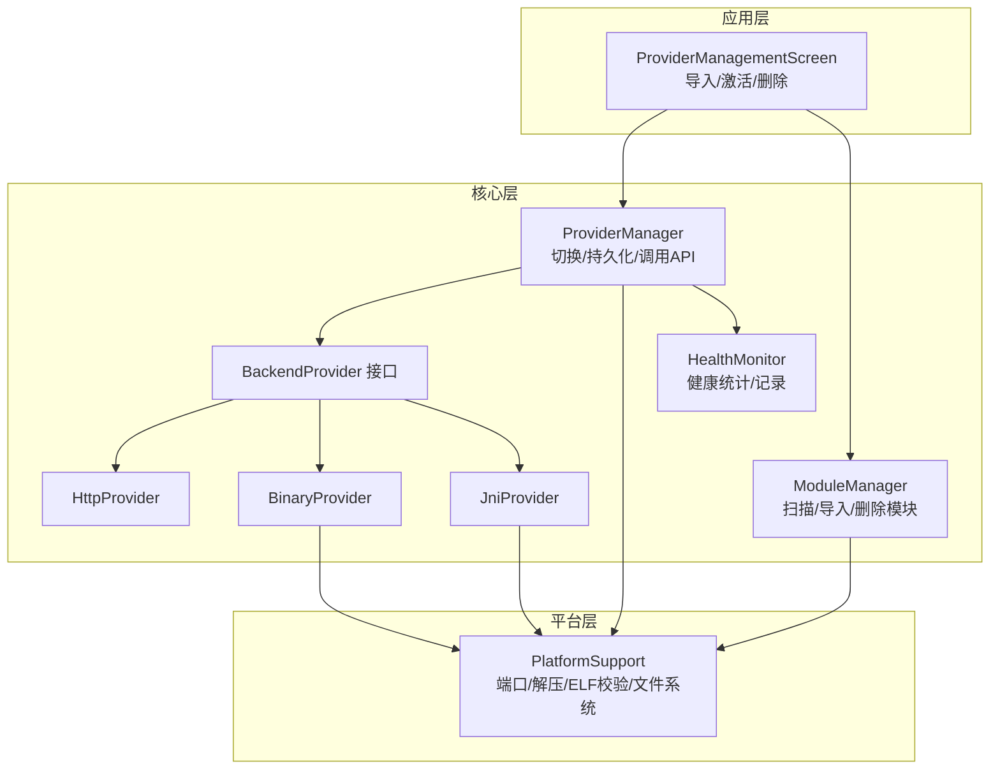
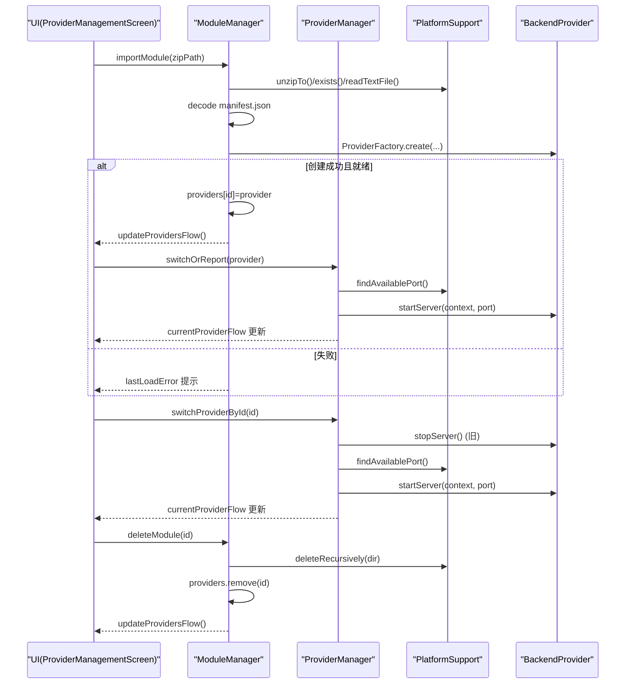
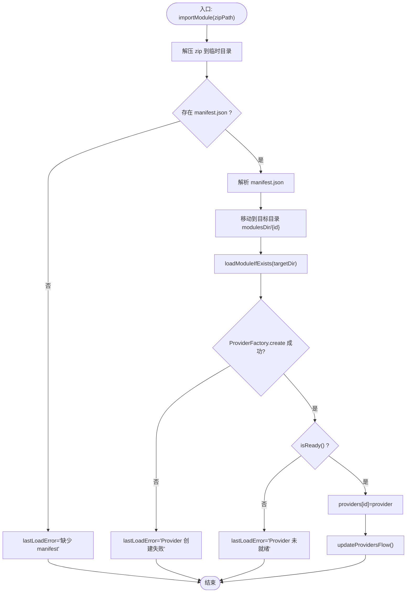
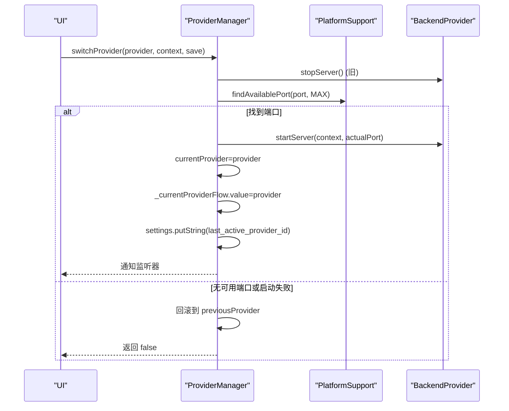
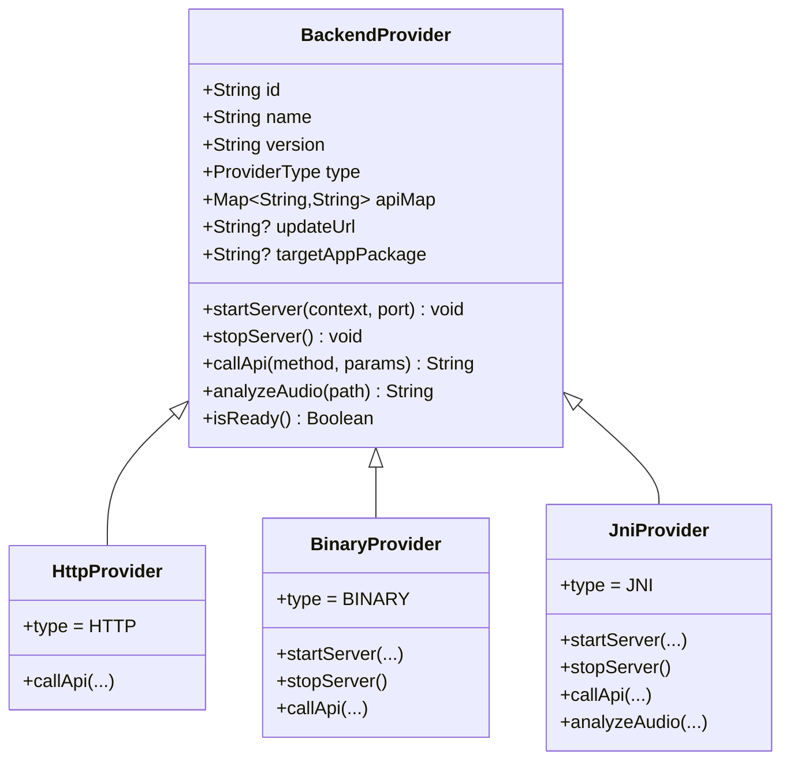
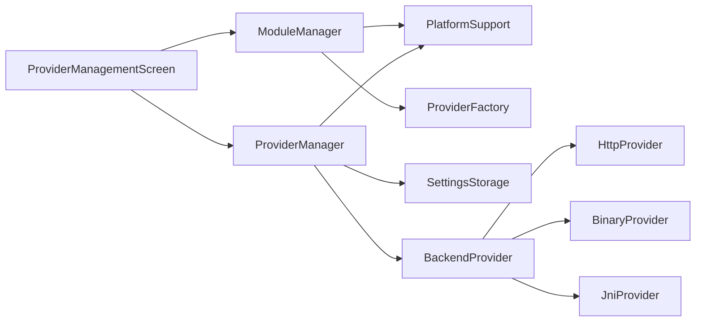

# 模块生命周期管理

<cite>
**本文引用的文件**
- [ModuleManager.kt](file://kmp-pro/src/commonMain/kotlin/cp/player/kmp/provider/ModuleManager.kt)
- [ProviderManager.kt](file://kmp-pro/src/commonMain/kotlin/cp/player/kmp/provider/ProviderManager.kt)
- [BackendProvider.kt](file://kmp-pro/src/commonMain/kotlin/cp/player/kmp/provider/BackendProvider.kt)
- [HttpProvider.kt](file://kmp-pro/src/commonMain/kotlin/cp/player/kmp/provider/HttpProvider.kt)
- [BinaryProvider.kt](file://kmp-pro/src/jvmMain/kotlin/cp/player/kmp/provider/BinaryProvider.kt)
- [JniProvider.kt](file://kmp-pro/src/jvmMain/kotlin/cp/player/kmp/provider/JniProvider.kt)
- [PlatformSupport.kt](file://kmp-pro/src/commonMain/kotlin/cp/player/kmp/util/PlatformSupport.kt)
- [PlatformSupport.kt](file://kmp-pro/src/jvmMain/kotlin/cp/player/kmp/util/PlatformSupport.kt)
- [HealthMonitor.kt](file://kmp-pro/src/commonMain/kotlin/cp/player/kmp/monitor/HealthMonitor.kt)
- [ProviderManagementScreen.kt](file://app/src/commonMain/kotlin/cp/player/app/ui/screen/ProviderManagementScreen.kt)
</cite>

## 目录
1. [简介](#简介)
2. [项目结构](#项目结构)
3. [核心组件](#核心组件)
4. [架构总览](#架构总览)
5. [详细组件分析](#详细组件分析)
6. [依赖关系分析](#依赖关系分析)
7. [性能考量](#性能考量)
8. [故障排查指南](#故障排查指南)
9. [结论](#结论)
10. [附录](#附录)

## 简介
本文件围绕“模块生命周期管理”展开，系统阐述模块从导入到卸载的完整流程，覆盖 init()、importModule()、deleteModule() 等关键方法；说明 providers 映射表与 StateFlow 状态同步机制；解释热重载支持（运行时切换与动态更新）；详述资源清理与内存泄漏防护策略；阐明 Provider 接口约定与数据共享机制；展示典型工作流（正常启动、异常恢复、优雅关闭）；并提供监控指标与调试工具使用方法。

## 项目结构
本项目采用 KMP 分层组织：
- commonMain：跨平台抽象与核心逻辑（模块管理、Provider 接口、HTTP Provider、健康监控）
- jvmMain：JVM 平台实现（二进制/JNI Provider、平台能力 PlatformSupport）
- app：Compose UI 层（音源管理界面）

图表来源
- [ModuleManager.kt:19-137](file://kmp-pro/src/commonMain/kotlin/cp/player/kmp/provider/ModuleManager.kt#L19-L137)
- [ProviderManager.kt:31-145](file://kmp-pro/src/commonMain/kotlin/cp/player/kmp/provider/ProviderManager.kt#L31-L145)
- [BackendProvider.kt:24-110](file://kmp-pro/src/commonMain/kotlin/cp/player/kmp/provider/BackendProvider.kt#L24-L110)
- [HttpProvider.kt:23-60](file://kmp-pro/src/commonMain/kotlin/cp/player/kmp/provider/HttpProvider.kt#L23-L60)
- [BinaryProvider.kt:25-108](file://kmp-pro/src/jvmMain/kotlin/cp/player/kmp/provider/BinaryProvider.kt#L25-L108)
- [JniProvider.kt:9-142](file://kmp-pro/src/jvmMain/kotlin/cp/player/kmp/provider/JniProvider.kt#L9-L142)
- [PlatformSupport.kt:13-59](file://kmp-pro/src/commonMain/kotlin/cp/player/kmp/util/PlatformSupport.kt#L13-L59)
- [PlatformSupport.kt:17-135](file://kmp-pro/src/jvmMain/kotlin/cp/player/kmp/util/PlatformSupport.kt#L17-L135)
- [HealthMonitor.kt:25-290](file://kmp-pro/src/commonMain/kotlin/cp/player/kmp/monitor/HealthMonitor.kt#L25-L290)

章节来源
- [ModuleManager.kt:19-137](file://kmp-pro/src/commonMain/kotlin/cp/player/kmp/provider/ModuleManager.kt#L19-L137)
- [ProviderManager.kt:31-145](file://kmp-pro/src/commonMain/kotlin/cp/player/kmp/provider/ProviderManager.kt#L31-L145)
- [PlatformSupport.kt:17-135](file://kmp-pro/src/jvmMain/kotlin/cp/player/kmp/util/PlatformSupport.kt#L17-L135)

## 核心组件
- ModuleManager：负责模块扫描、导入、加载、删除，维护 providers 映射表，并通过 StateFlow 暴露可用 Provider 列表。
- ProviderManager：管理当前活跃 Provider，处理切换、端口分配、服务启停、API 调用转发，并持久化最近一次选择的 Provider。
- BackendProvider 接口：统一后端接入契约，定义 id/name/version/type/apiMap/updateUrl/targetAppPackage/startServer/stopServer/callApi/analyzeAudio/isReady。
- HttpProvider/BinaryProvider/JniProvider：三种具体实现，分别对接外部 HTTP API、独立进程、JNI 本地库。
- PlatformSupport：跨平台能力封装（端口探测、zip 解压、ELF 校验、目录枚举、移动目录等）。
- HealthMonitor：API 调用健康监控，提供环形缓冲记录、统计聚合、整体健康等级流。

章节来源
- [BackendProvider.kt:24-110](file://kmp-pro/src/commonMain/kotlin/cp/player/kmp/provider/BackendProvider.kt#L24-L110)
- [HttpProvider.kt:23-60](file://kmp-pro/src/commonMain/kotlin/cp/player/kmp/provider/HttpProvider.kt#L23-L60)
- [BinaryProvider.kt:25-108](file://kmp-pro/src/jvmMain/kotlin/cp/player/kmp/provider/BinaryProvider.kt#L25-L108)
- [JniProvider.kt:9-142](file://kmp-pro/src/jvmMain/kotlin/cp/player/kmp/provider/JniProvider.kt#L9-L142)
- [PlatformSupport.kt:13-59](file://kmp-pro/src/commonMain/kotlin/cp/player/kmp/util/PlatformSupport.kt#L13-L59)
- [HealthMonitor.kt:25-290](file://kmp-pro/src/commonMain/kotlin/cp/player/kmp/monitor/HealthMonitor.kt#L25-L290)

## 架构总览
模块生命周期由“模块管理器 + 提供商管理器 + 具体 Provider 实现 + 平台能力”共同完成。UI 通过 Compose 观察 StateFlow 变化，触发导入/切换/删除等操作。

图表来源
- [ModuleManager.kt:38-137](file://kmp-pro/src/commonMain/kotlin/cp/player/kmp/provider/ModuleManager.kt#L38-L137)
- [ProviderManager.kt:65-145](file://kmp-pro/src/commonMain/kotlin/cp/player/kmp/provider/ProviderManager.kt#L65-L145)
- [PlatformSupport.kt:17-135](file://kmp-pro/src/jvmMain/kotlin/cp/player/kmp/util/PlatformSupport.kt#L17-L135)
- [BackendProvider.kt:24-110](file://kmp-pro/src/commonMain/kotlin/cp/player/kmp/provider/BackendProvider.kt#L24-L110)

## 详细组件分析

### ModuleManager：模块导入/加载/删除
- 职责
  - 扫描 modulesDir 子目录，解析 manifest.json，创建 Provider 实例并加入 providers 映射表。
  - 导入 zip 模块包：解压、校验 manifest、移动到目标目录、加载并刷新 Flow。
  - 删除模块：递归删除目录并从映射表移除，刷新 Flow。
- 状态同步
  - 使用 MutableStateFlow<List<BackendProvider>> 暴露 providersFlow，任何变更都会通知 UI。
- 错误处理
  - 记录 lastLoadError，便于 UI 展示最近一次失败原因。
- 关键点
  - loadModuleIfExists 中通过 ProviderFactory.create 创建实例，并调用 isReady() 检查就绪性。
  - extractLoadError 通过反射获取 getLoadError 以提取底层加载错误信息。

图表来源
- [ModuleManager.kt:57-117](file://kmp-pro/src/commonMain/kotlin/cp/player/kmp/provider/ModuleManager.kt#L57-L117)

章节来源
- [ModuleManager.kt:19-137](file://kmp-pro/src/commonMain/kotlin/cp/player/kmp/provider/ModuleManager.kt#L19-L137)

### ProviderManager：活跃 Provider 切换与服务管理
- 职责
  - 切换当前 Provider：停止旧服务、分配端口、启动新服务、持久化选择、通知监听器。
  - 恢复上次 Provider：读取设置中的 last_active_provider_id 并尝试切换。
  - 调用 API：在 IO 调度器上执行，按 apiMap 映射后转发到当前 Provider。
- 状态同步
  - 使用 MutableStateFlow<BackendProvider?> 暴露 currentProviderFlow，供 UI 观察。
- 端口管理
  - 使用 PlatformSupport.findAvailablePort 自动寻找可用端口，失败时回退到上一个 Provider。
- 错误处理
  - 捕获启动异常，保持 currentProvider 不变并返回 false。

图表来源
- [ProviderManager.kt:80-121](file://kmp-pro/src/commonMain/kotlin/cp/player/kmp/provider/ProviderManager.kt#L80-L121)
- [PlatformSupport.kt:25-31](file://kmp-pro/src/jvmMain/kotlin/cp/player/kmp/util/PlatformSupport.kt#L25-L31)

章节来源
- [ProviderManager.kt:31-145](file://kmp-pro/src/commonMain/kotlin/cp/player/kmp/provider/ProviderManager.kt#L31-L145)

### BackendProvider 及具体实现
- 接口约定
  - id/name/version/type/apiMap/updateUrl/targetAppPackage
  - startServer(context, port)/stopServer/callApi(method, params)/analyzeAudio(path)/isReady()
- HttpProvider
  - 连接已有 HTTP API，start/stop 为空操作，callApi 通过 Ktor POST JSON。
- BinaryProvider
  - 启动独立可执行文件（ProcessBuilder），通过 HTTP 通信；启动前进行 ELF 校验。
- JniProvider
  - 加载 .so/.dll/.dylib，调用 native 方法；启动前进行文件存在性、大小、权限、ELF 校验。

图表来源
- [BackendProvider.kt:24-110](file://kmp-pro/src/commonMain/kotlin/cp/player/kmp/provider/BackendProvider.kt#L24-L110)
- [HttpProvider.kt:23-60](file://kmp-pro/src/commonMain/kotlin/cp/player/kmp/provider/HttpProvider.kt#L23-L60)
- [BinaryProvider.kt:25-108](file://kmp-pro/src/jvmMain/kotlin/cp/player/kmp/provider/BinaryProvider.kt#L25-L108)
- [JniProvider.kt:9-142](file://kmp-pro/src/jvmMain/kotlin/cp/player/kmp/provider/JniProvider.kt#L9-L142)

章节来源
- [BackendProvider.kt:24-110](file://kmp-pro/src/commonMain/kotlin/cp/player/kmp/provider/BackendProvider.kt#L24-L110)
- [HttpProvider.kt:23-60](file://kmp-pro/src/commonMain/kotlin/cp/player/kmp/provider/HttpProvider.kt#L23-L60)
- [BinaryProvider.kt:25-108](file://kmp-pro/src/jvmMain/kotlin/cp/player/kmp/provider/BinaryProvider.kt#L25-L108)
- [JniProvider.kt:9-142](file://kmp-pro/src/jvmMain/kotlin/cp/player/kmp/provider/JniProvider.kt#L9-L142)

### 平台能力：PlatformSupport
- 功能
  - 端口探测与查找可用端口
  - zip 解压（含路径穿越保护）
  - 目录枚举、文件读写、递归删除、目录移动
  - ELF 头校验（魔数与架构匹配）
  - 多 ABI 入口解析（优先按平台 ABI 顺序，其次按 manifest 声明的 supportedAbis）
- 作用
  - 为 ModuleManager/ProviderManager/具体 Provider 提供跨平台能力支撑。

章节来源
- [PlatformSupport.kt:13-59](file://kmp-pro/src/commonMain/kotlin/cp/player/kmp/util/PlatformSupport.kt#L13-L59)
- [PlatformSupport.kt:17-135](file://kmp-pro/src/jvmMain/kotlin/cp/player/kmp/util/PlatformSupport.kt#L17-L135)

### 健康监控：HealthMonitor
- 功能
  - 记录 API 调用（时间戳、providerId、method、耗时、成功/失败、警告类型、降级信息等）
  - 计算提供者级与方法级统计（成功率、平均耗时、P95、降级次数、健康分数、整体等级）
  - 暴露 recordsFlow 与 overallLevelFlow 供 UI 观察
- 设计要点
  - 环形缓冲区（MAX_RECORDS=500）避免无限增长
  - 使用 MutableStateFlow.update 减少复制开销
  - 查询基于快照计算，不阻塞记录路径

章节来源
- [HealthMonitor.kt:25-290](file://kmp-pro/src/commonMain/kotlin/cp/player/kmp/monitor/HealthMonitor.kt#L25-L290)

## 依赖关系分析
- ModuleManager 依赖 PlatformSupport 进行文件与端口相关操作，依赖 ProviderFactory 创建 Provider。
- ProviderManager 依赖 PlatformSupport 进行端口查找，依赖 SettingsStorage 持久化选择，依赖 BackendProvider 进行服务启停与 API 调用。
- 具体 Provider 实现依赖 PlatformSupport（如 ELF 校验）与网络客户端（Ktor）。
- UI 层通过 StateFlow 订阅 ModuleManager.providersFlow 与 ProviderManager.currentProviderFlow。

图表来源
- [ModuleManager.kt:19-137](file://kmp-pro/src/commonMain/kotlin/cp/player/kmp/provider/ModuleManager.kt#L19-L137)
- [ProviderManager.kt:31-145](file://kmp-pro/src/commonMain/kotlin/cp/player/kmp/provider/ProviderManager.kt#L31-L145)
- [PlatformSupport.kt:17-135](file://kmp-pro/src/jvmMain/kotlin/cp/player/kmp/util/PlatformSupport.kt#L17-L135)
- [ProviderManagementScreen.kt:123-158](file://app/src/commonMain/kotlin/cp/player/app/ui/screen/ProviderManagementScreen.kt#L123-L158)

章节来源
- [ModuleManager.kt:19-137](file://kmp-pro/src/commonMain/kotlin/cp/player/kmp/provider/ModuleManager.kt#L19-L137)
- [ProviderManager.kt:31-145](file://kmp-pro/src/commonMain/kotlin/cp/player/kmp/provider/ProviderManager.kt#L31-L145)
- [ProviderManagementScreen.kt:123-158](file://app/src/commonMain/kotlin/cp/player/app/ui/screen/ProviderManagementScreen.kt#L123-L158)

## 性能考量
- 状态同步
  - 使用 StateFlow 暴露 providersFlow/currentProviderFlow，避免频繁全量刷新。
  - HealthMonitor 使用 MutableStateFlow.update 与环形缓冲区降低内存与 CPU 开销。
- 端口分配
  - 批量尝试最多 20 个端口，快速失败避免长时间阻塞。
- 文件与网络
  - zip 解压包含路径穿越保护，防止恶意条目。
  - ELF 校验在启动前进行，避免无效进程启动。
  - callApi 在 IO 调度器执行，避免阻塞主线程。

[本节为通用指导，无需特定文件引用]

## 故障排查指南
- 导入失败
  - 检查 lastLoadError：可能为“解压失败”“缺少 manifest.json”“移动临时目录失败”“Provider 创建失败”“Provider 未就绪”。
  - 确认 zip 包结构与 manifest.json 字段正确。
- 切换失败
  - 检查端口是否被占用（findAvailablePort 返回 null）。
  - 检查 Provider.isReady() 与底层加载错误（getLoadError）。
  - 查看 currentProviderFlow 是否回滚到上一个 Provider。
- 运行期崩溃
  - BinaryProvider：确认二进制文件存在、可执行、ELF 校验通过。
  - JniProvider：确认 so/dll/dylib 存在、可读、大小合理、ELF 校验通过；若 native 调用崩溃会重置 isLoaded 并记录错误。
- 监控与诊断
  - 使用 HealthMonitor.getStats/getAllStats/getRecentRecords 获取调用统计与失败详情。
  - 关注 overallLevelFlow 的整体健康等级变化。

章节来源
- [ModuleManager.kt:57-117](file://kmp-pro/src/commonMain/kotlin/cp/player/kmp/provider/ModuleManager.kt#L57-L117)
- [ProviderManager.kt:80-121](file://kmp-pro/src/commonMain/kotlin/cp/player/kmp/provider/ProviderManager.kt#L80-L121)
- [BinaryProvider.kt:42-80](file://kmp-pro/src/jvmMain/kotlin/cp/player/kmp/provider/BinaryProvider.kt#L42-L80)
- [JniProvider.kt:23-55](file://kmp-pro/src/jvmMain/kotlin/cp/player/kmp/provider/JniProvider.kt#L23-L55)
- [HealthMonitor.kt:147-216](file://kmp-pro/src/commonMain/kotlin/cp/player/kmp/monitor/HealthMonitor.kt#L147-L216)

## 结论
本方案通过清晰的模块管理器与提供商管理器分工，结合统一的 BackendProvider 接口与平台能力抽象，实现了模块从导入、加载、切换到卸载的全生命周期管理。借助 StateFlow 的状态同步与健康监控，提供了良好的可观测性与用户体验。通过严格的资源清理与错误处理策略，有效降低了内存泄漏与不稳定风险。

[本节为总结，无需特定文件引用]

## 附录

### 典型工作流

#### 正常启动
- 初始化 ModuleManager.init：扫描模块、加载所有可用 Provider、恢复上次 Provider 或自动选择首个。
- ProviderManager.restoreLastProvider：尝试恢复上次活跃的 Provider，若失败则保持空状态。
- UI 订阅 providersFlow/currentProviderFlow，渲染列表与当前激活状态。

章节来源
- [ModuleManager.kt:38-48](file://kmp-pro/src/commonMain/kotlin/cp/player/kmp/provider/ModuleManager.kt#L38-L48)
- [ProviderManager.kt:117-121](file://kmp-pro/src/commonMain/kotlin/cp/player/kmp/provider/ProviderManager.kt#L117-L121)

#### 异常恢复
- 切换失败时回滚到 previousProvider，并保持 currentProviderFlow 一致。
- 端口不可用或启动异常时，记录日志并返回失败，UI 显示错误消息。
- 通过 HealthMonitor 记录失败与警告，辅助定位问题。

章节来源
- [ProviderManager.kt:80-109](file://kmp-pro/src/commonMain/kotlin/cp/player/kmp/provider/ProviderManager.kt#L80-L109)
- [HealthMonitor.kt:122-143](file://kmp-pro/src/commonMain/kotlin/cp/player/kmp/monitor/HealthMonitor.kt#L122-L143)

#### 优雅关闭
- 切换 Provider 时先停止旧服务（stopServer），再启动新服务。
- 删除模块时递归删除目录并从 providers 映射移除，刷新 Flow。
- JniProvider.stopServer 重置 isLoaded，避免后续调用崩溃。

章节来源
- [ProviderManager.kt:80-109](file://kmp-pro/src/commonMain/kotlin/cp/player/kmp/provider/ProviderManager.kt#L80-L109)
- [ModuleManager.kt:130-137](file://kmp-pro/src/commonMain/kotlin/cp/player/kmp/provider/ModuleManager.kt#L130-L137)
- [JniProvider.kt:57-59](file://kmp-pro/src/jvmMain/kotlin/cp/player/kmp/provider/JniProvider.kt#L57-L59)

### 监控指标与调试工具
- 指标
  - 调用总数、成功/失败计数、警告/错误计数、平均耗时、P95 耗时、降级次数、健康分数、整体健康等级。
- 工具
  - HealthMonitor.getStats/getAllStats/getRecentRecords/getStatsByMethod
  - UI 层通过 collectAsState 订阅 Flow，实时展示状态与消息。

章节来源
- [HealthMonitor.kt:147-216](file://kmp-pro/src/commonMain/kotlin/cp/player/kmp/monitor/HealthMonitor.kt#L147-L216)
- [ProviderManagementScreen.kt:123-158](file://app/src/commonMain/kotlin/cp/player/app/ui/screen/ProviderManagementScreen.kt#L123-L158)