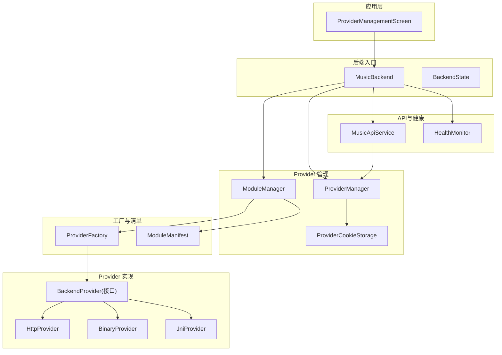
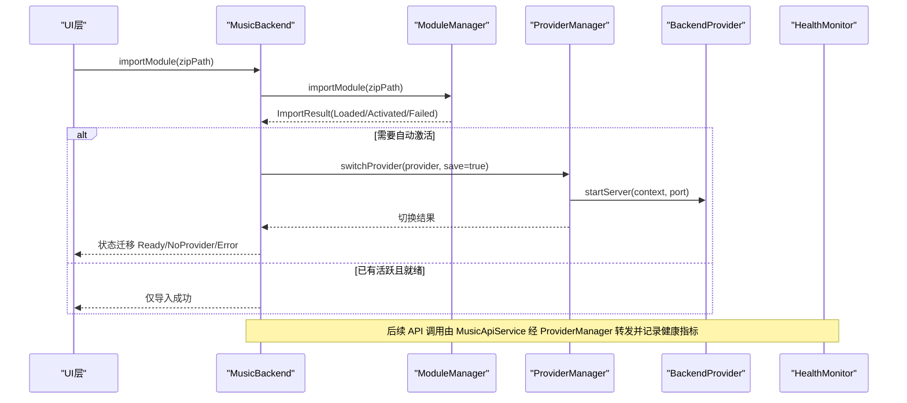
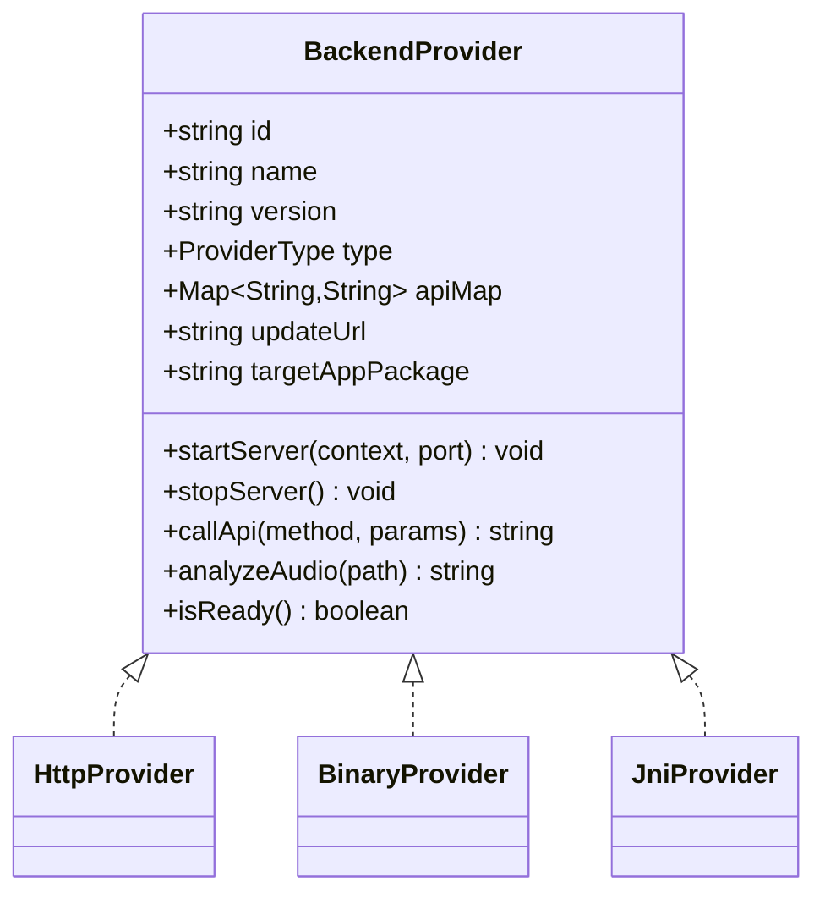
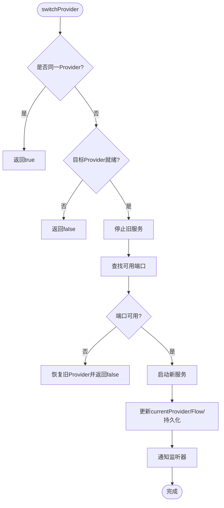
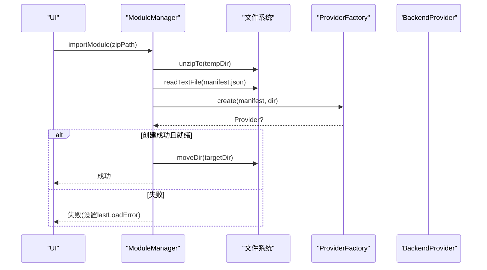
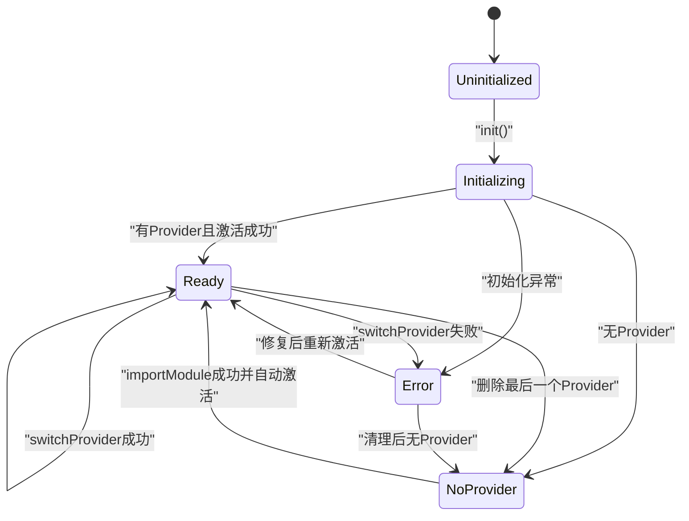
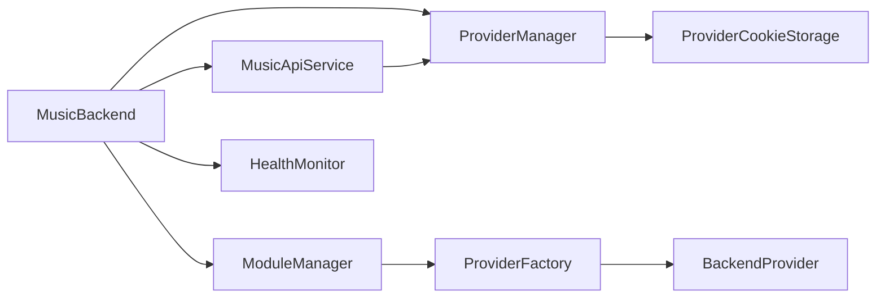

# Provider 管理系统架构

<cite>
**本文引用的文件**
- [ProviderManager.kt](file://kmp-pro/src/commonMain/kotlin/cp/player/kmp/provider/ProviderManager.kt)
- [ModuleManager.kt](file://kmp-pro/src/commonMain/kotlin/cp/player/kmp/provider/ModuleManager.kt)
- [BackendProvider.kt](file://kmp-pro/src/commonMain/kotlin/cp/player/kmp/provider/BackendProvider.kt)
- [HttpProvider.kt](file://kmp-pro/src/commonMain/kotlin/cp/player/kmp/provider/HttpProvider.kt)
- [BinaryProvider.kt](file://kmp-pro/src/jvmMain/kotlin/cp/player/kmp/provider/BinaryProvider.kt)
- [JniProvider.kt](file://kmp-pro/src/jvmMain/kotlin/cp/player/kmp/provider/JniProvider.kt)
- [ModuleManifest.kt](file://kmp-pro/src/commonMain/kotlin/cp/player/kmp/provider/ModuleManifest.kt)
- [ProviderFactory.kt](file://kmp-pro/src/commonMain/kotlin/cp/player/kmp/provider/ProviderFactory.kt)
- [MusicBackend.kt](file://kmp-pro/src/commonMain/kotlin/cp/player/kmp/MusicBackend.kt)
- [BackendState.kt](file://kmp-pro/src/commonMain/kotlin/cp/player/kmp/BackendState.kt)
- [HealthMonitor.kt](file://kmp-pro/src/commonMain/kotlin/cp/player/kmp/monitor/HealthMonitor.kt)
- [MusicApiService.kt](file://kmp-pro/src/commonMain/kotlin/cp/player/kmp/api/MusicApiService.kt)
- [ProviderManagementScreen.kt](file://app/src/commonMain/kotlin/cp/player/app/ui/screen/ProviderManagementScreen.kt)
</cite>

## 目录
1. [简介](#简介)
2. [项目结构](#项目结构)
3. [核心组件](#核心组件)
4. [架构总览](#架构总览)
5. [详细组件分析](#详细组件分析)
6. [依赖关系分析](#依赖关系分析)
7. [性能考量](#性能考量)
8. [故障排查指南](#故障排查指南)
9. [结论](#结论)
10. [附录](#附录)

## 简介
本架构文档聚焦于 CPPlayer KMP 的 Provider 管理系统，围绕以下目标展开：
- 明确 ProviderManager 与 ModuleManager 的职责分离与设计原则
- 解释 BackendProvider 接口的设计意图与扩展机制
- 阐述模块加载、卸载、切换的完整生命周期
- 说明 Cookie 隔离机制、Provider 健康检查与自动激活逻辑
- 提供自定义 Provider 实现的指导原则与最佳实践
- 展示典型使用场景与错误处理模式

## 项目结构
Provider 管理相关代码主要位于 kmp-pro 模块中，按职责分层组织：
- 接口与抽象：BackendProvider、ProviderType、ModuleManifest
- 管理器：ModuleManager（模块加载/导入/删除）、ProviderManager（活跃 Provider 切换与服务启停）
- 具体实现：HttpProvider、BinaryProvider、JniProvider
- 工厂与平台适配：ProviderFactory（expect/actual）
- 统一入口与状态机：MusicBackend、BackendState
- 健康监控：HealthMonitor
- API 层：MusicApiService（统一调用入口）
- UI 示例：ProviderManagementScreen（导入、激活、删除）

图表来源
- [MusicBackend.kt:73-389](file://kmp-pro/src/commonMain/kotlin/cp/player/kmp/MusicBackend.kt#L73-L389)
- [ModuleManager.kt:19-137](file://kmp-pro/src/commonMain/kotlin/cp/player/kmp/provider/ModuleManager.kt#L19-L137)
- [ProviderManager.kt:31-145](file://kmp-pro/src/commonMain/kotlin/cp/player/kmp/provider/ProviderManager.kt#L31-L145)
- [BackendProvider.kt:24-110](file://kmp-pro/src/commonMain/kotlin/cp/player/kmp/provider/BackendProvider.kt#L24-L110)
- [HttpProvider.kt:23-60](file://kmp-pro/src/commonMain/kotlin/cp/player/kmp/provider/HttpProvider.kt#L23-L60)
- [BinaryProvider.kt:25-108](file://kmp-pro/src/jvmMain/kotlin/cp/player/kmp/provider/BinaryProvider.kt#L25-L108)
- [JniProvider.kt:9-142](file://kmp-pro/src/jvmMain/kotlin/cp/player/kmp/provider/JniProvider.kt#L9-L142)
- [ProviderFactory.kt:11-29](file://kmp-pro/src/commonMain/kotlin/cp/player/kmp/provider/ProviderFactory.kt#L11-L29)
- [ModuleManifest.kt:5-31](file://kmp-pro/src/commonMain/kotlin/cp/player/kmp/provider/ModuleManifest.kt#L5-L31)
- [MusicApiService.kt:24-40](file://kmp-pro/src/commonMain/kotlin/cp/player/kmp/api/MusicApiService.kt#L24-L40)
- [HealthMonitor.kt:25-138](file://kmp-pro/src/commonMain/kotlin/cp/player/kmp/monitor/HealthMonitor.kt#L25-L138)

章节来源
- [MusicBackend.kt:73-389](file://kmp-pro/src/commonMain/kotlin/cp/player/kmp/MusicBackend.kt#L73-L389)
- [ProviderManagementScreen.kt:58-203](file://app/src/commonMain/kotlin/cp/player/app/ui/screen/ProviderManagementScreen.kt#L58-L203)

## 核心组件
- BackendProvider：定义统一的 Provider 契约（id/name/version/type、apiMap、updateUrl、targetAppPackage、startServer/stopServer、callApi、analyzeAudio、isReady）。通过类型枚举 ProviderType 区分 JNI/BINARY/HTTP/WEBSOCKET。
- ProviderManager：管理当前活跃 Provider、端口分配、切换流程、持久化最近使用的 Provider ID、暴露 StateFlow 供 UI 观察；提供 Cookie 隔离存储 ProviderCookieStorage。
- ModuleManager：扫描 modulesDir、导入 zip 模块、解析 manifest.json、创建 Provider、校验就绪状态、维护可用 Provider 列表、支持删除模块。
- MusicBackend：统一后端入口，封装状态机（BackendState）、自动激活策略、导入/切换/删除的高层 API、健康监控接入、播放控制器与统一数据源装配。
- HealthMonitor：记录 API 调用健康指标，三级分类（OK/WARNING/ERROR），提供统计与整体健康等级流。
- MusicApiService：统一音乐 API 调用入口，内部注入 cookie，屏蔽 Provider 差异。

章节来源
- [BackendProvider.kt:24-110](file://kmp-pro/src/commonMain/kotlin/cp/player/kmp/provider/BackendProvider.kt#L24-L110)
- [ProviderManager.kt:31-145](file://kmp-pro/src/commonMain/kotlin/cp/player/kmp/provider/ProviderManager.kt#L31-L145)
- [ModuleManager.kt:19-137](file://kmp-pro/src/commonMain/kotlin/cp/player/kmp/provider/ModuleManager.kt#L19-L137)
- [MusicBackend.kt:73-389](file://kmp-pro/src/commonMain/kotlin/cp/player/kmp/MusicBackend.kt#L73-L389)
- [HealthMonitor.kt:25-138](file://kmp-pro/src/commonMain/kotlin/cp/player/kmp/monitor/HealthMonitor.kt#L25-L138)
- [MusicApiService.kt:24-40](file://kmp-pro/src/commonMain/kotlin/cp/player/kmp/api/MusicApiService.kt#L24-L40)

## 架构总览
Provider 管理系统采用“接口 + 多实现 + 管理器”的分层设计：
- 接口层：BackendProvider 抽象所有后端能力，屏蔽底层差异（HTTP/JNI/二进制进程）。
- 管理层：ModuleManager 负责模块生命周期（加载/导入/删除），ProviderManager 负责运行时切换与资源管理（端口、服务启停、Cookie 隔离）。
- 统一入口：MusicBackend 将状态机、自动激活、健康监控、API 访问整合为单一入口，对外暴露稳定 API。
- 健康与可观测性：HealthMonitor 对 API 调用进行采集与统计，辅助定位问题与降级决策。

图表来源
- [MusicBackend.kt:189-242](file://kmp-pro/src/commonMain/kotlin/cp/player/kmp/MusicBackend.kt#L189-L242)
- [ModuleManager.kt:57-117](file://kmp-pro/src/commonMain/kotlin/cp/player/kmp/provider/ModuleManager.kt#L57-L117)
- [ProviderManager.kt:80-121](file://kmp-pro/src/commonMain/kotlin/cp/player/kmp/provider/ProviderManager.kt#L80-L121)
- [BackendProvider.kt:65-95](file://kmp-pro/src/commonMain/kotlin/cp/player/kmp/provider/BackendProvider.kt#L65-L95)
- [HealthMonitor.kt:119-138](file://kmp-pro/src/commonMain/kotlin/cp/player/kmp/monitor/HealthMonitor.kt#L119-L138)

## 详细组件分析

### BackendProvider 接口设计与扩展机制
- 设计意图：以最小契约暴露后端能力，使上层无需感知 HTTP/JNI/二进制等实现细节。
- 关键成员：
  - id/name/version/type：标识与元信息
  - apiMap：方法名映射，支持“unsupported”标记功能不可用
  - updateUrl/targetAppPackage：可选更新与跳转目标 App
  - startServer/stopServer：服务生命周期
  - callApi/analyzeAudio：业务调用与音频分析
  - isReady：就绪检查（默认 true，JNI 可在失败时返回 false）
- 扩展机制：新增 Provider 类型只需实现 BackendProvider，并通过 ProviderFactory 在对应平台创建实例。

图表来源
- [BackendProvider.kt:24-110](file://kmp-pro/src/commonMain/kotlin/cp/player/kmp/provider/BackendProvider.kt#L24-L110)
- [HttpProvider.kt:23-60](file://kmp-pro/src/commonMain/kotlin/cp/player/kmp/provider/HttpProvider.kt#L23-L60)
- [BinaryProvider.kt:25-108](file://kmp-pro/src/jvmMain/kotlin/cp/player/kmp/provider/BinaryProvider.kt#L25-L108)
- [JniProvider.kt:9-142](file://kmp-pro/src/jvmMain/kotlin/cp/player/kmp/provider/JniProvider.kt#L9-L142)

章节来源
- [BackendProvider.kt:24-110](file://kmp-pro/src/commonMain/kotlin/cp/player/kmp/provider/BackendProvider.kt#L24-L110)

### ProviderManager：活跃 Provider 管理与 Cookie 隔离
- 职责：
  - 维护 currentProvider/currentPort
  - 切换 Provider：停止旧服务、分配端口、启动新服务、持久化 last_active_provider_id
  - 暴露 StateFlow 供 Compose 观察
  - 提供 callApi 桥接（含 unsupported 处理）
- Cookie 隔离：ProviderCookieStorage 以 cookie_<providerId> 键隔离不同 Provider 的账号凭证。

图表来源
- [ProviderManager.kt:80-121](file://kmp-pro/src/commonMain/kotlin/cp/player/kmp/provider/ProviderManager.kt#L80-L121)
- [ProviderManager.kt:151-156](file://kmp-pro/src/commonMain/kotlin/cp/player/kmp/provider/ProviderManager.kt#L151-L156)

章节来源
- [ProviderManager.kt:31-145](file://kmp-pro/src/commonMain/kotlin/cp/player/kmp/provider/ProviderManager.kt#L31-L145)

### ModuleManager：模块加载、导入、删除
- 扫描与加载：读取 modulesDir 子目录，解析 manifest.json，通过 ProviderFactory 创建 Provider，校验 isReady。
- 导入流程：解压 zip -> 校验 manifest -> 移动到目标目录 -> 加载并刷新列表。
- 删除流程：删除目录并从内存移除，必要时触发状态回退。

图表来源
- [ModuleManager.kt:57-117](file://kmp-pro/src/commonMain/kotlin/cp/player/kmp/provider/ModuleManager.kt#L57-L117)
- [ProviderFactory.kt:11-29](file://kmp-pro/src/commonMain/kotlin/cp/player/kmp/provider/ProviderFactory.kt#L11-L29)
- [ModuleManifest.kt:5-31](file://kmp-pro/src/commonMain/kotlin/cp/player/kmp/provider/ModuleManifest.kt#L5-L31)

章节来源
- [ModuleManager.kt:19-137](file://kmp-pro/src/commonMain/kotlin/cp/player/kmp/provider/ModuleManager.kt#L19-L137)

### MusicBackend：统一入口与自动激活
- 初始化：构建 ProviderManager、ModuleManager、MusicApiServiceImpl、缓存与健康监控，计算初始状态。
- 自动激活：导入成功后若无活跃或当前不就绪，则自动激活首个可用 Provider。
- 状态机：Uninitialized -> Initializing -> NoProvider/Ready/Error，支持 reset。
- 高层 API：importModule、switchProvider、deleteModule，统一返回 BackendResult。

图表来源
- [BackendState.kt:25-57](file://kmp-pro/src/commonMain/kotlin/cp/player/kmp/BackendState.kt#L25-L57)
- [MusicBackend.kt:330-389](file://kmp-pro/src/commonMain/kotlin/cp/player/kmp/MusicBackend.kt#L330-L389)

章节来源
- [MusicBackend.kt:73-389](file://kmp-pro/src/commonMain/kotlin/cp/player/kmp/MusicBackend.kt#L73-L389)
- [BackendState.kt:25-130](file://kmp-pro/src/commonMain/kotlin/cp/player/kmp/BackendState.kt#L25-L130)

### 具体 Provider 实现要点
- HttpProvider：通过 Ktor 向外部 HTTP 服务发起 POST，startServer/stopServer 为空操作。
- BinaryProvider：启动独立进程（带 --port），本地 HTTP 通信；启动前校验 ELF 头与可执行权限。
- JniProvider：加载 .so/.dll/.dylib，调用 native 方法；加载失败或崩溃时设置 loadError 并影响 isReady。

章节来源
- [HttpProvider.kt:23-60](file://kmp-pro/src/commonMain/kotlin/cp/player/kmp/provider/HttpProvider.kt#L23-L60)
- [BinaryProvider.kt:25-108](file://kmp-pro/src/jvmMain/kotlin/cp/player/kmp/provider/BinaryProvider.kt#L25-L108)
- [JniProvider.kt:9-142](file://kmp-pro/src/jvmMain/kotlin/cp/player/kmp/provider/JniProvider.kt#L9-L142)

### 健康检查与自动激活逻辑
- 健康检查：各 Provider 的 isReady 用于快速判断可用性；JNI/Binary 在加载/启动失败时返回 false。
- 自动激活：导入成功后若当前无活跃或不可用，MusicBackend 自动激活首个可用 Provider，并迁移到 Ready 状态。
- 健康监控：HealthMonitor 记录 API 调用的成功率、响应时间、警告类型与整体健康等级，便于诊断与降级。

章节来源
- [BackendProvider.kt:87-95](file://kmp-pro/src/commonMain/kotlin/cp/player/kmp/provider/BackendProvider.kt#L87-L95)
- [MusicBackend.kt:189-242](file://kmp-pro/src/commonMain/kotlin/cp/player/kmp/MusicBackend.kt#L189-L242)
- [HealthMonitor.kt:25-138](file://kmp-pro/src/commonMain/kotlin/cp/player/kmp/monitor/HealthMonitor.kt#L25-L138)

### 典型使用场景与错误处理模式
- 导入模块：UI 选择 zip -> MusicBackend.importModule -> ModuleManager 导入 -> 自动激活 -> 状态迁移。
- 切换 Provider：用户选择 -> MusicBackend.switchProvider -> ProviderManager 切换 -> 端口分配与服务启停。
- 删除模块：删除后若删除的是当前活跃，尝试切换到剩余第一个；若无剩余则进入 NoProvider。
- 错误处理：
  - 导入失败：ModuleManager.lastLoadError 提供原因（如缺少 manifest、ABI 不匹配）。
  - 切换失败：ProviderManager 返回 false，MusicBackend 转为 Error 状态并提示。
  - 不支持功能：apiMap 映射为 "unsupported"，返回 BackendResult.Unsupported。

章节来源
- [ProviderManagementScreen.kt:123-158](file://app/src/commonMain/kotlin/cp/player/app/ui/screen/ProviderManagementScreen.kt#L123-L158)
- [ModuleManager.kt:57-117](file://kmp-pro/src/commonMain/kotlin/cp/player/kmp/provider/ModuleManager.kt#L57-L117)
- [ProviderManager.kt:80-121](file://kmp-pro/src/commonMain/kotlin/cp/player/kmp/provider/ProviderManager.kt#L80-L121)
- [BackendState.kt:67-130](file://kmp-pro/src/commonMain/kotlin/cp/player/kmp/BackendState.kt#L67-L130)

## 依赖关系分析
- 低耦合：MusicBackend 仅依赖抽象（BackendProvider、MusicApiService），通过 ProviderManager/ModuleManager 管理具体实现。
- 高内聚：每个 Provider 实现自包含其启动、通信与错误处理逻辑。
- 平台适配：ProviderFactory 与 PlatformSupport 解耦平台差异（Android/Desktop）。
- 潜在循环依赖：通过 expect/actual 与接口隔离避免 commonMain 直接依赖平台实现。

图表来源
- [MusicBackend.kt:73-389](file://kmp-pro/src/commonMain/kotlin/cp/player/kmp/MusicBackend.kt#L73-L389)
- [ProviderManager.kt:31-145](file://kmp-pro/src/commonMain/kotlin/cp/player/kmp/provider/ProviderManager.kt#L31-L145)
- [ModuleManager.kt:19-137](file://kmp-pro/src/commonMain/kotlin/cp/player/kmp/provider/ModuleManager.kt#L19-L137)
- [ProviderFactory.kt:11-29](file://kmp-pro/src/commonMain/kotlin/cp/player/kmp/provider/ProviderFactory.kt#L11-L29)

章节来源
- [MusicBackend.kt:73-389](file://kmp-pro/src/commonMain/kotlin/cp/player/kmp/MusicBackend.kt#L73-L389)
- [ProviderManager.kt:31-145](file://kmp-pro/src/commonMain/kotlin/cp/player/kmp/provider/ProviderManager.kt#L31-L145)
- [ModuleManager.kt:19-137](file://kmp-pro/src/commonMain/kotlin/cp/player/kmp/provider/ModuleManager.kt#L19-L137)
- [ProviderFactory.kt:11-29](file://kmp-pro/src/commonMain/kotlin/cp/player/kmp/provider/ProviderFactory.kt#L11-L29)

## 性能考量
- 端口分配：ProviderManager 使用有限次尝试查找可用端口，避免阻塞与冲突。
- 网络 IO：HttpProvider/BinaryProvider 使用 Ktor 客户端，callApi 同步契约下通过 runBlocking 转发，注意避免主线程阻塞。
- 健康监控：HealthMonitor 使用环形缓冲区与 Flow.update 减少复制开销，查询基于快照计算。
- 模块加载：ModuleManager 在导入时先解压到临时目录，校验 manifest 后再移动，降低污染风险。

[本节为通用性能建议，不直接分析具体文件]

## 故障排查指南
- 导入失败：
  - 检查 zip 是否包含 manifest.json，以及 ABI 是否匹配（JNI/Binary）。
  - 查看 ModuleManager.lastLoadError 获取具体原因。
- 切换失败：
  - 确认目标 Provider.isReady() 为 true。
  - 检查端口是否被占用，ProviderManager 会尝试多次回退。
- JNI 加载失败：
  - 确认 soPath 存在、可读、大小合理、ELF 头校验通过。
  - 关注 JniProvider.loadError 与日志输出。
- 功能不支持：
  - 检查 apiMap 映射是否为 "unsupported"，UI 应提示“该音源不支持此功能”。

章节来源
- [ModuleManager.kt:57-117](file://kmp-pro/src/commonMain/kotlin/cp/player/kmp/provider/ModuleManager.kt#L57-L117)
- [ProviderManager.kt:80-121](file://kmp-pro/src/commonMain/kotlin/cp/player/kmp/provider/ProviderManager.kt#L80-L121)
- [JniProvider.kt:99-136](file://kmp-pro/src/jvmMain/kotlin/cp/player/kmp/provider/JniProvider.kt#L99-L136)
- [BackendState.kt:84-94](file://kmp-pro/src/commonMain/kotlin/cp/player/kmp/BackendState.kt#L84-L94)

## 结论
Provider 管理系统通过清晰的职责分离（ModuleManager 负责模块生命周期，ProviderManager 负责运行时切换与资源管理）、稳定的接口契约（BackendProvider）与统一入口（MusicBackend），实现了可扩展、可观测、易维护的后端插件体系。结合 Cookie 隔离、健康检查与自动激活，系统能够在多 Provider 环境下提供一致的用户体验与可靠的错误处理能力。

## 附录
- 自定义 Provider 实现指导原则：
  - 实现 BackendProvider，明确 id/name/version/type 与 apiMap 映射。
  - 在 startServer 中完成服务启动与资源准备，确保 isReady 准确反映就绪状态。
  - 在 callApi 中统一返回 JSON 格式响应，错误时包含 code/msg。
  - 通过 ProviderFactory 在对应平台创建实例，遵循 expect/actual 约定。
  - 利用 HealthMonitor 记录调用指标，便于诊断与优化。
- 最佳实践：
  - 使用 apiMap 声明不支持的功能，避免误用。
  - 在切换 Provider 前检查 isReady，避免无效切换。
  - 使用 ProviderCookieStorage 隔离账号凭证，防止串号。
  - 在 UI 层消费 StateFlow 与 BackendResult，提供友好的反馈与重试路径。

[本节为通用指导，不直接分析具体文件]