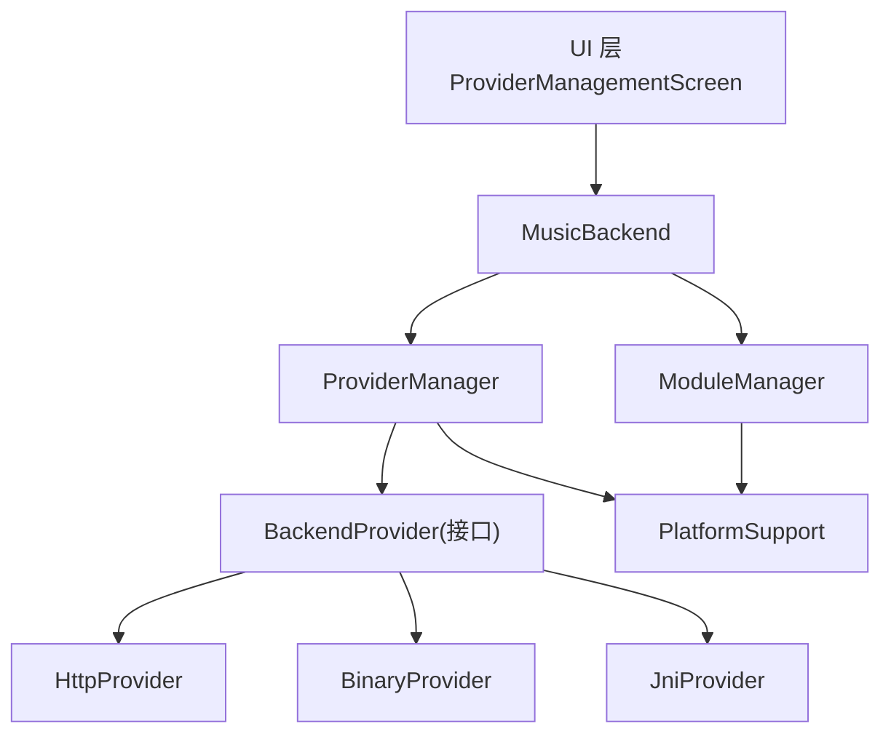
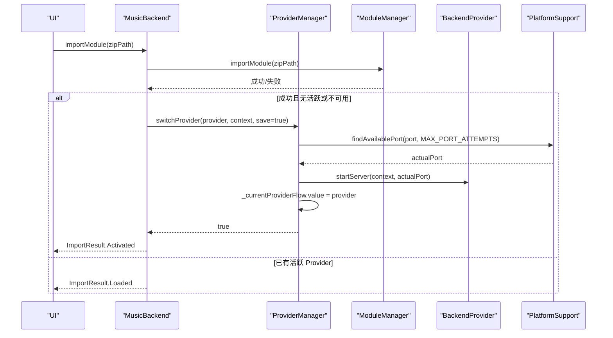
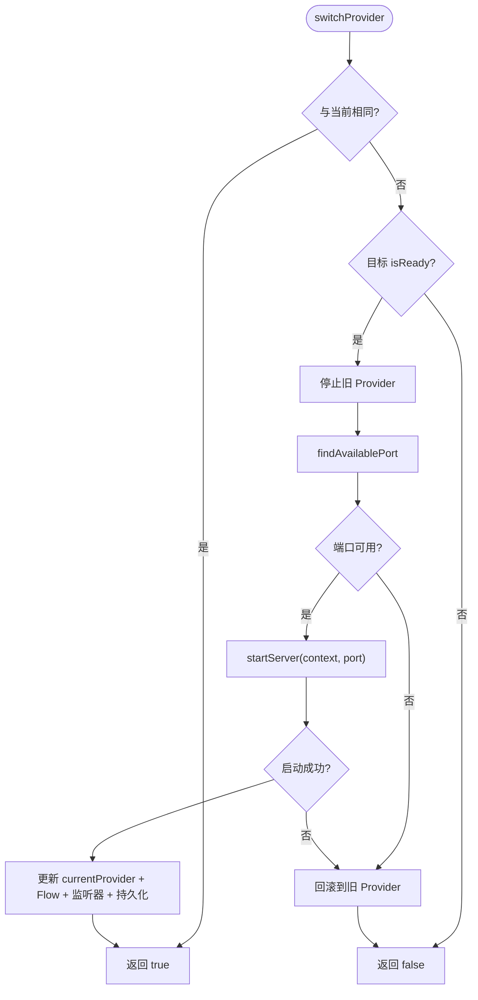
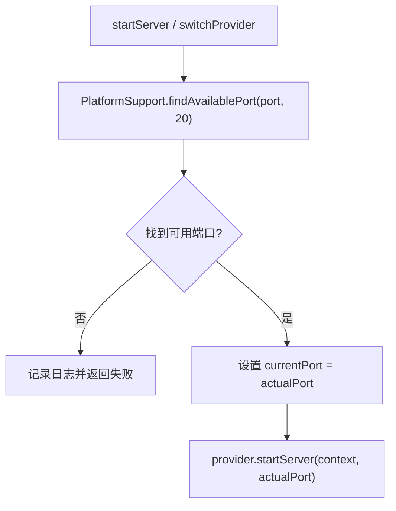
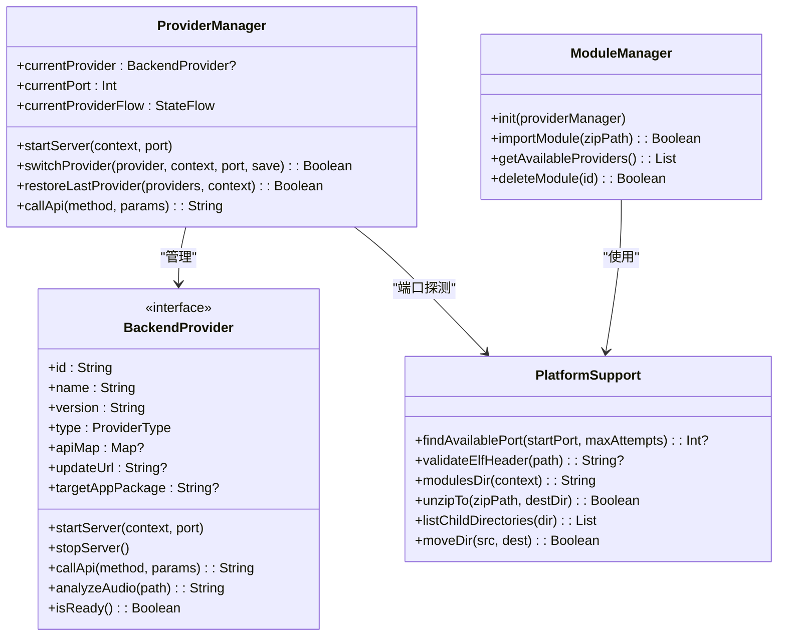

# ProviderManager 核心管理

<cite>
**本文引用的文件**
- [ProviderManager.kt](file://kmp-pro/src/commonMain/kotlin/cp/player/kmp/provider/ProviderManager.kt)
- [BackendProvider.kt](file://kmp-pro/src/commonMain/kotlin/cp/player/kmp/provider/BackendProvider.kt)
- [HttpProvider.kt](file://kmp-pro/src/commonMain/kotlin/cp/player/kmp/provider/HttpProvider.kt)
- [BinaryProvider.kt](file://kmp-pro/src/jvmMain/kotlin/cp/player/kmp/provider/BinaryProvider.kt)
- [JniProvider.kt](file://kmp-pro/src/jvmMain/kotlin/cp/player/kmp/provider/JniProvider.kt)
- [ModuleManager.kt](file://kmp-pro/src/commonMain/kotlin/cp/player/kmp/provider/ModuleManager.kt)
- [PlatformSupport.kt](file://kmp-pro/src/commonMain/kotlin/cp/player/kmp/util/PlatformSupport.kt)
- [MusicBackend.kt](file://kmp-pro/src/commonMain/kotlin/cp/player/kmp/MusicBackend.kt)
- [BackendState.kt](file://kmp-pro/src/commonMain/kotlin/cp/player/kmp/BackendState.kt)
- [ProviderManagementScreen.kt](file://app/src/commonMain/kotlin/cp/player/app/ui/screen/ProviderManagementScreen.kt)
</cite>

## 目录
1. [简介](#简介)
2. [项目结构](#项目结构)
3. [核心组件](#核心组件)
4. [架构总览](#架构总览)
5. [详细组件分析](#详细组件分析)
6. [依赖关系分析](#依赖关系分析)
7. [性能考量](#性能考量)
8. [故障排查指南](#故障排查指南)
9. [结论](#结论)
10. [附录：典型使用场景与最佳实践](#附录典型使用场景与最佳实践)

## 简介
本文件围绕 ProviderManager 核心组件，系统阐述其职责边界与设计原则，覆盖活跃 Provider 的管理、状态流转与生命周期控制；端口管理机制（检测、冲突处理、自动回退）；Provider 切换的完整流程（旧服务停止、新服务启动、状态同步与监听器通知）；StateFlow 响应式状态更新模式；Provider 恢复机制（持久化存储与重启恢复）；错误处理策略与异常恢复方案；并提供典型使用场景的代码示例路径与最佳实践。

## 项目结构
ProviderManager 位于 KMP 公共模块中，负责“当前活跃 Provider”的生命周期与切换；与之协作的关键组件包括：
- BackendProvider 接口及多种实现（HTTP、二进制进程、JNI）
- ModuleManager 负责模块加载与可用 Provider 列表维护
- PlatformSupport 提供跨平台能力（端口探测、ELF 校验、文件系统操作等）
- MusicBackend 作为统一入口，封装状态机与高层 API，内部组合 ProviderManager
- UI 层通过 StateFlow 观察 Provider 状态并驱动界面



图表来源
- [MusicBackend.kt:330-367](file://kmp-pro/src/commonMain/kotlin/cp/player/kmp/MusicBackend.kt#L330-L367)
- [ProviderManager.kt:31-145](file://kmp-pro/src/commonMain/kotlin/cp/player/kmp/provider/ProviderManager.kt#L31-L145)
- [BackendProvider.kt:24-110](file://kmp-pro/src/commonMain/kotlin/cp/player/kmp/provider/BackendProvider.kt#L24-L110)
- [PlatformSupport.kt:13-59](file://kmp-pro/src/commonMain/kotlin/cp/player/kmp/util/PlatformSupport.kt#L13-L59)

章节来源
- [MusicBackend.kt:330-367](file://kmp-pro/src/commonMain/kotlin/cp/player/kmp/MusicBackend.kt#L330-L367)
- [ProviderManager.kt:31-145](file://kmp-pro/src/commonMain/kotlin/cp/player/kmp/provider/ProviderManager.kt#L31-L145)
- [BackendProvider.kt:24-110](file://kmp-pro/src/commonMain/kotlin/cp/player/kmp/provider/BackendProvider.kt#L24-L110)
- [PlatformSupport.kt:13-59](file://kmp-pro/src/commonMain/kotlin/cp/player/kmp/util/PlatformSupport.kt#L13-L59)

## 核心组件
- ProviderManager：管理当前活跃 Provider、端口选择与服务启停、状态流与监听器、持久化最近使用的 Provider ID。
- BackendProvider：抽象后端提供者，定义 id/name/version/type/apiMap/updateUrl/targetAppPackage/startServer/stopServer/callApi/analyzeAudio/isReady。
- HttpProvider/BinaryProvider/JniProvider：三种具体实现，分别对应 HTTP 服务、独立可执行进程、JNI 本地库。
- ModuleManager：扫描/导入/删除模块，维护可用 Provider 列表，并在初始化时尝试恢复上次 Provider。
- PlatformSupport：跨平台能力（端口探测、ELF 校验、目录操作等）。
- MusicBackend：统一入口，封装状态机（BackendState）、Provider 管理、音乐数据访问、播放控制等。

章节来源
- [ProviderManager.kt:31-145](file://kmp-pro/src/commonMain/kotlin/cp/player/kmp/provider/ProviderManager.kt#L31-L145)
- [BackendProvider.kt:24-110](file://kmp-pro/src/commonMain/kotlin/cp/player/kmp/provider/BackendProvider.kt#L24-L110)
- [HttpProvider.kt:23-60](file://kmp-pro/src/commonMain/kotlin/cp/player/kmp/provider/HttpProvider.kt#L23-L60)
- [BinaryProvider.kt:25-108](file://kmp-pro/src/jvmMain/kotlin/cp/player/kmp/provider/BinaryProvider.kt#L25-L108)
- [JniProvider.kt:9-142](file://kmp-pro/src/jvmMain/kotlin/cp/player/kmp/provider/JniProvider.kt#L9-L142)
- [ModuleManager.kt:19-137](file://kmp-pro/src/commonMain/kotlin/cp/player/kmp/provider/ModuleManager.kt#L19-L137)
- [PlatformSupport.kt:13-59](file://kmp-pro/src/commonMain/kotlin/cp/player/kmp/util/PlatformSupport.kt#L13-L59)
- [MusicBackend.kt:73-389](file://kmp-pro/src/commonMain/kotlin/cp/player/kmp/MusicBackend.kt#L73-L389)

## 架构总览
ProviderManager 在整体架构中的角色：
- 作为“活跃 Provider”的单一事实源，对外暴露 currentProviderFlow（StateFlow），供 UI 与上层组件观察。
- 协调端口分配与 Provider 服务启停，保证同一时刻仅有一个 Provider 处于活跃状态。
- 与 ModuleManager 配合，完成模块加载、恢复上次 Provider、以及删除模块后的回退逻辑。
- 通过 SettingsStorage 持久化 last_active_provider_id，确保应用重启后能恢复到用户上次选择的 Provider。



图表来源
- [MusicBackend.kt:189-204](file://kmp-pro/src/commonMain/kotlin/cp/player/kmp/MusicBackend.kt#L189-L204)
- [ModuleManager.kt:57-86](file://kmp-pro/src/commonMain/kotlin/cp/player/kmp/provider/ModuleManager.kt#L57-L86)
- [ProviderManager.kt:80-109](file://kmp-pro/src/commonMain/kotlin/cp/player/kmp/provider/ProviderManager.kt#L80-L109)
- [PlatformSupport.kt:17-18](file://kmp-pro/src/commonMain/kotlin/cp/player/kmp/util/PlatformSupport.kt#L17-L18)

章节来源
- [MusicBackend.kt:189-204](file://kmp-pro/src/commonMain/kotlin/cp/player/kmp/MusicBackend.kt#L189-L204)
- [ModuleManager.kt:57-86](file://kmp-pro/src/commonMain/kotlin/cp/player/kmp/provider/ModuleManager.kt#L57-L86)
- [ProviderManager.kt:80-109](file://kmp-pro/src/commonMain/kotlin/cp/player/kmp/provider/ProviderManager.kt#L80-L109)
- [PlatformSupport.kt:17-18](file://kmp-pro/src/commonMain/kotlin/cp/player/kmp/util/PlatformSupport.kt#L17-L18)

## 详细组件分析

### ProviderManager：职责边界与设计原则
- 职责边界
  - 不直接加载模块，仅管理“已加载 Provider”的活跃状态。
  - 负责端口检测与分配、服务启停、状态流更新、监听器通知、持久化最近使用的 Provider ID。
- 设计原则
  - 单一活跃 Provider：同一时间只允许一个 Provider 处于活跃状态。
  - 原子切换：先停止旧 Provider，再启动新 Provider；任一阶段失败则回滚到之前的状态。
  - 响应式状态：通过 StateFlow 暴露 currentProvider，UI 可实时订阅。
  - 可恢复性：通过 SettingsStorage 持久化 last_active_provider_id，重启后自动恢复。
  - 解耦：通过 BackendProvider 接口屏蔽不同实现细节（HTTP/Binary/JNI）。

章节来源
- [ProviderManager.kt:15-35](file://kmp-pro/src/commonMain/kotlin/cp/player/kmp/provider/ProviderManager.kt#L15-L35)
- [ProviderManager.kt:40-56](file://kmp-pro/src/commonMain/kotlin/cp/player/kmp/provider/ProviderManager.kt#L40-L56)
- [ProviderManager.kt:80-109](file://kmp-pro/src/commonMain/kotlin/cp/player/kmp/provider/ProviderManager.kt#L80-L109)
- [ProviderManager.kt:116-121](file://kmp-pro/src/commonMain/kotlin/cp/player/kmp/provider/ProviderManager.kt#L116-L121)

### 活跃 Provider 管理与状态流转
- 活跃 Provider 由 currentProvider 字段维护，并通过 _currentProviderFlow 暴露为 StateFlow。
- 切换流程：
  - 若目标 Provider 与当前相同，直接返回成功。
  - 若目标不可用（isReady=false），拒绝切换。
  - 停止旧 Provider（try-catch 保护）。
  - 为新 Provider 分配端口（findAvailablePort），失败则回滚到旧 Provider。
  - 启动新 Provider，失败则回滚到旧 Provider。
  - 更新 currentProvider 与 StateFlow，触发监听器回调，可选持久化 last_active_provider_id。
- 恢复流程：
  - restoreLastProvider 从 SettingsStorage 读取 last_active_provider_id，按 ID 查找并切换。



图表来源
- [ProviderManager.kt:80-109](file://kmp-pro/src/commonMain/kotlin/cp/player/kmp/provider/ProviderManager.kt#L80-L109)
- [PlatformSupport.kt:17-18](file://kmp-pro/src/commonMain/kotlin/cp/player/kmp/util/PlatformSupport.kt#L17-L18)

章节来源
- [ProviderManager.kt:80-109](file://kmp-pro/src/commonMain/kotlin/cp/player/kmp/provider/ProviderManager.kt#L80-L109)
- [ProviderManager.kt:116-121](file://kmp-pro/src/commonMain/kotlin/cp/player/kmp/provider/ProviderManager.kt#L116-L121)

### 端口管理机制：检测、冲突处理与自动回退
- 默认起始端口与最大尝试次数：
  - DEFAULT_PORT=3000，MAX_PORT_ATTEMPTS=20。
- 端口检测：
  - 使用 PlatformSupport.findAvailablePort(startPort, maxAttempts) 从指定端口开始搜索可用端口。
- 冲突处理：
  - 若范围内所有端口均被占用，记录日志并返回失败（调用方需处理）。
- 自动回退：
  - 在 switchProvider 中，若端口分配失败或新 Provider 启动失败，会回滚到之前的 Provider，保持系统一致性。



图表来源
- [ProviderManager.kt:65-73](file://kmp-pro/src/commonMain/kotlin/cp/player/kmp/provider/ProviderManager.kt#L65-L73)
- [ProviderManager.kt:80-109](file://kmp-pro/src/commonMain/kotlin/cp/player/kmp/provider/ProviderManager.kt#L80-L109)
- [PlatformSupport.kt:17-18](file://kmp-pro/src/commonMain/kotlin/cp/player/kmp/util/PlatformSupport.kt#L17-L18)

章节来源
- [ProviderManager.kt:65-73](file://kmp-pro/src/commonMain/kotlin/cp/player/kmp/provider/ProviderManager.kt#L65-L73)
- [ProviderManager.kt:80-109](file://kmp-pro/src/commonMain/kotlin/cp/player/kmp/provider/ProviderManager.kt#L80-L109)
- [PlatformSupport.kt:17-18](file://kmp-pro/src/commonMain/kotlin/cp/player/kmp/util/PlatformSupport.kt#L17-L18)

### Provider 切换流程：旧服务停止、新服务启动、状态同步与监听器通知
- 旧服务停止：
  - 在切换前调用 previousProvider?.stopServer()，异常被捕获以避免阻断切换流程。
- 新服务启动：
  - 分配端口后调用 provider.startServer(context, actualPort)。
- 状态同步：
  - 成功后更新 currentProvider 与 _currentProviderFlow.value，确保 UI 与上层组件一致。
- 监听器通知：
  - 遍历 changeListeners 并逐一调用，异常被 runCatching 包裹，避免单个监听器失败影响整体。

```mermaid
sequenceDiagram
participant Caller as "调用方"
participant PM as "ProviderManager"
participant Old as "旧 Provider"
participant New as "新 Provider"
participant UI as "监听器/UI"
Caller->>PM : switchProvider(new, context, port, save)
PM->>Old : stopServer()
PM->>PM : findAvailablePort()
PM->>New : startServer(context, port)
New-->>PM : 成功
PM->>PM : currentProvider = new; _currentProviderFlow.value = new
PM->>UI : forEach listener(provider)
PM-->>Caller : true
```

图表来源
- [ProviderManager.kt:80-109](file://kmp-pro/src/commonMain/kotlin/cp/player/kmp/provider/ProviderManager.kt#L80-L109)

章节来源
- [ProviderManager.kt:80-109](file://kmp-pro/src/commonMain/kotlin/cp/player/kmp/provider/ProviderManager.kt#L80-L109)

### StateFlow 的使用模式与响应式状态更新
- currentProviderFlow：
  - 以 MutableStateFlow 暴露当前活跃 Provider，UI 可通过 collectAsState 订阅。
- 变更时机：
  - 切换成功时立即更新 Flow，确保 UI 即时反映最新状态。
- 优势：
  - 线程安全、背压友好、适合 Compose 等声明式 UI 框架。

章节来源
- [ProviderManager.kt:48-56](file://kmp-pro/src/commonMain/kotlin/cp/player/kmp/provider/ProviderManager.kt#L48-L56)
- [ProviderManager.kt:104-108](file://kmp-pro/src/commonMain/kotlin/cp/player/kmp/provider/ProviderManager.kt#L104-L108)

### Provider 恢复机制：持久化存储与重启恢复
- 持久化键：
  - KEY_LAST_PROVIDER_ID="last_active_provider_id"。
- 写入时机：
  - 切换成功且 save=true 时，将 provider.id 写入 SettingsStorage。
- 恢复流程：
  - restoreLastProvider 读取 last_active_provider_id，按 ID 查找并切换；若找不到或已是当前，则直接返回。
- 初始化集成：
  - ModuleManager.init 完成后调用 providerManager.restoreLastProvider；若无上次选择但有可用 Provider，则自动激活第一个。

章节来源
- [ProviderManager.kt:38-39](file://kmp-pro/src/commonMain/kotlin/cp/player/kmp/provider/ProviderManager.kt#L38-L39)
- [ProviderManager.kt:106-108](file://kmp-pro/src/commonMain/kotlin/cp/player/kmp/provider/ProviderManager.kt#L106-L108)
- [ProviderManager.kt:116-121](file://kmp-pro/src/commonMain/kotlin/cp/player/kmp/provider/ProviderManager.kt#L116-L121)
- [ModuleManager.kt:38-48](file://kmp-pro/src/commonMain/kotlin/cp/player/kmp/provider/ModuleManager.kt#L38-L48)

### 错误处理策略与异常恢复方案
- 切换失败回滚：
  - 端口不可用或新 Provider 启动失败时，回滚到 previousProvider，保持系统稳定。
- 调用 API 的错误包装：
  - callApi 方法在 IO 调度器上执行，捕获异常并返回统一的 JSON 错误格式。
- Provider 就绪检查：
  - 切换前检查 isReady；对于 JNI Provider，若 .so 加载失败，isReady 返回 false。
- 健康监控与状态机：
  - MusicBackend 根据 Provider 就绪情况设置 BackendState（Ready/Error/NoProvider），便于 UI 展示与引导。

章节来源
- [ProviderManager.kt:80-109](file://kmp-pro/src/commonMain/kotlin/cp/player/kmp/provider/ProviderManager.kt#L80-L109)
- [ProviderManager.kt:129-141](file://kmp-pro/src/commonMain/kotlin/cp/player/kmp/provider/ProviderManager.kt#L129-L141)
- [BackendProvider.kt:87-95](file://kmp-pro/src/commonMain/kotlin/cp/player/kmp/provider/BackendProvider.kt#L87-L95)
- [MusicBackend.kt:273-293](file://kmp-pro/src/commonMain/kotlin/cp/player/kmp/MusicBackend.kt#L273-L293)
- [BackendState.kt:25-57](file://kmp-pro/src/commonMain/kotlin/cp/player/kmp/BackendState.kt#L25-L57)

### 具体 Provider 实现要点
- HttpProvider：
  - startServer/stopServer 为空操作（服务由外部启动）。
  - callApi 通过 Ktor HTTP 客户端 POST 到 baseUrl/method，返回 JSON 文本。
- BinaryProvider：
  - 启动独立进程（ProcessBuilder），参数 --port <port>。
  - 通信地址 http://127.0.0.1:<port>/api/<method>。
  - 启动前进行 ELF 头校验，失败则设置 loadError 并抛出异常。
- JniProvider：
  - 加载 .so 库，调用 native 方法 startNativeServer/nativeCallApi/analyzeAudioFile。
  - 对加载与调用过程中的异常进行捕获，设置 loadError 并返回错误 JSON。

章节来源
- [HttpProvider.kt:23-60](file://kmp-pro/src/commonMain/kotlin/cp/player/kmp/provider/HttpProvider.kt#L23-L60)
- [BinaryProvider.kt:25-108](file://kmp-pro/src/jvmMain/kotlin/cp/player/kmp/provider/BinaryProvider.kt#L25-L108)
- [JniProvider.kt:9-142](file://kmp-pro/src/jvmMain/kotlin/cp/player/kmp/provider/JniProvider.kt#L9-L142)

## 依赖关系分析
- ProviderManager 依赖：
  - SettingsStorage（持久化 last_active_provider_id）
  - ProviderCookieStorage（按 Provider 隔离 cookie）
  - PlatformSupport（端口探测）
  - BackendProvider（抽象接口）
- ModuleManager 依赖：
  - PlatformSupport（模块目录、解压、移动、ELF 校验）
  - ProviderFactory（根据 manifest 创建 Provider）
- MusicBackend 组合：
  - ProviderManager、ModuleManager、MusicApiServiceImpl、CachedMusicApiService、HealthMonitor、PlaybackControllerImpl



图表来源
- [ProviderManager.kt:31-145](file://kmp-pro/src/commonMain/kotlin/cp/player/kmp/provider/ProviderManager.kt#L31-L145)
- [ModuleManager.kt:19-137](file://kmp-pro/src/commonMain/kotlin/cp/player/kmp/provider/ModuleManager.kt#L19-L137)
- [PlatformSupport.kt:13-59](file://kmp-pro/src/commonMain/kotlin/cp/player/kmp/util/PlatformSupport.kt#L13-L59)
- [BackendProvider.kt:24-110](file://kmp-pro/src/commonMain/kotlin/cp/player/kmp/provider/BackendProvider.kt#L24-L110)

章节来源
- [ProviderManager.kt:31-145](file://kmp-pro/src/commonMain/kotlin/cp/player/kmp/provider/ProviderManager.kt#L31-L145)
- [ModuleManager.kt:19-137](file://kmp-pro/src/commonMain/kotlin/cp/player/kmp/provider/ModuleManager.kt#L19-L137)
- [PlatformSupport.kt:13-59](file://kmp-pro/src/commonMain/kotlin/cp/player/kmp/util/PlatformSupport.kt#L13-L59)
- [BackendProvider.kt:24-110](file://kmp-pro/src/commonMain/kotlin/cp/player/kmp/provider/BackendProvider.kt#L24-L110)

## 性能考量
- 端口探测范围限制：
  - MAX_PORT_ATTEMPTS=20，避免无限重试导致阻塞。
- 异步与调度：
  - callApi 使用 Dispatchers.IO 执行，避免阻塞主线程。
- 资源释放：
  - BinaryProvider 通过 Process.destroy() 释放子进程；JniProvider 在崩溃时重置 isLoaded 并记录错误。
- 缓存与健康监控：
  - MusicBackend 集成 CachedMusicApiService 与 HealthMonitor，减少重复请求并提升可观测性。

[本节为通用指导，不直接分析具体文件]

## 故障排查指南
- 端口全被占用：
  - 现象：startServer/switchProvider 返回失败，日志提示端口范围被占用。
  - 处理：调整默认起始端口或关闭占用端口的进程。
- 二进制文件不存在或 ELF 校验失败：
  - 现象：BinaryProvider.isReady=false，loadError 包含原因。
  - 处理：检查模块包是否包含正确的二进制文件与 ABI。
- JNI 库加载失败：
  - 现象：JniProvider.loadError 非空，isReady=false。
  - 处理：确认 .so 文件存在、可读、ABI 匹配，且未被损坏。
- 切换失败回滚：
  - 现象：switchProvider 返回 false，currentProvider 保持不变。
  - 处理：查看 lastLoadError 或 Provider 启动日志，定位失败原因。

章节来源
- [ProviderManager.kt:65-73](file://kmp-pro/src/commonMain/kotlin/cp/player/kmp/provider/ProviderManager.kt#L65-L73)
- [BinaryProvider.kt:42-80](file://kmp-pro/src/jvmMain/kotlin/cp/player/kmp/provider/BinaryProvider.kt#L42-L80)
- [JniProvider.kt:23-55](file://kmp-pro/src/jvmMain/kotlin/cp/player/kmp/provider/JniProvider.kt#L23-L55)
- [ModuleManager.kt:88-117](file://kmp-pro/src/commonMain/kotlin/cp/player/kmp/provider/ModuleManager.kt#L88-L117)

## 结论
ProviderManager 作为活跃 Provider 的核心管理器，通过清晰的职责边界、健壮的状态流转与端口管理机制，确保了多音源环境下的稳定切换与恢复。结合 MusicBackend 的状态机与 UI 层的响应式订阅，提供了良好的用户体验与可维护性。推荐在应用中遵循“通过 MusicBackend 统一入口”、“使用 StateFlow 观察状态”、“妥善处理错误与回滚”的最佳实践。

[本节为总结，不直接分析具体文件]

## 附录：典型使用场景与最佳实践
- 初始化与恢复：
  - 在平台 Application.onCreate/main 中调用 MusicBackend.init(context, settings)，内部会构建 ProviderManager、ModuleManager 并恢复上次 Provider。
  - 参考路径：[MusicBackend.kt:330-367](file://kmp-pro/src/commonMain/kotlin/cp/player/kmp/MusicBackend.kt#L330-L367)
- 导入模块并自动激活：
  - 调用 backend.importModule(zipPath)，若此前无活跃 Provider 或当前不可用，将自动激活首个可用 Provider。
  - 参考路径：[MusicBackend.kt:189-204](file://kmp-pro/src/commonMain/kotlin/cp/player/kmp/MusicBackend.kt#L189-L204)
- 切换 Provider：
  - 通过 backend.switchProvider(provider) 或 switchProviderById(providerId) 切换，失败时返回 BackendResult.Error。
  - 参考路径：[MusicBackend.kt:212-222](file://kmp-pro/src/commonMain/kotlin/cp/player/kmp/MusicBackend.kt#L212-L222)
- UI 观察与交互：
  - 使用 providersFlow、activeProviderFlow 观察 Provider 列表与当前活跃 Provider。
  - 在 ProviderManagementScreen 中演示导入、激活、删除等操作。
  - 参考路径：[ProviderManagementScreen.kt:123-157](file://app/src/commonMain/kotlin/cp/player/app/ui/screen/ProviderManagementScreen.kt#L123-L157)
- Cookie 隔离：
  - 使用 ProviderCookieStorage 按 Provider ID 隔离账号 cookie，登录/登出时直接操作。
  - 参考路径：[ProviderManager.kt:147-156](file://kmp-pro/src/commonMain/kotlin/cp/player/kmp/provider/ProviderManager.kt#L147-L156)

章节来源
- [MusicBackend.kt:330-367](file://kmp-pro/src/commonMain/kotlin/cp/player/kmp/MusicBackend.kt#L330-L367)
- [MusicBackend.kt:189-204](file://kmp-pro/src/commonMain/kotlin/cp/player/kmp/MusicBackend.kt#L189-L204)
- [MusicBackend.kt:212-222](file://kmp-pro/src/commonMain/kotlin/cp/player/kmp/MusicBackend.kt#L212-L222)
- [ProviderManagementScreen.kt:123-157](file://app/src/commonMain/kotlin/cp/player/app/ui/screen/ProviderManagementScreen.kt#L123-L157)
- [ProviderManager.kt:147-156](file://kmp-pro/src/commonMain/kotlin/cp/player/kmp/provider/ProviderManager.kt#L147-L156)