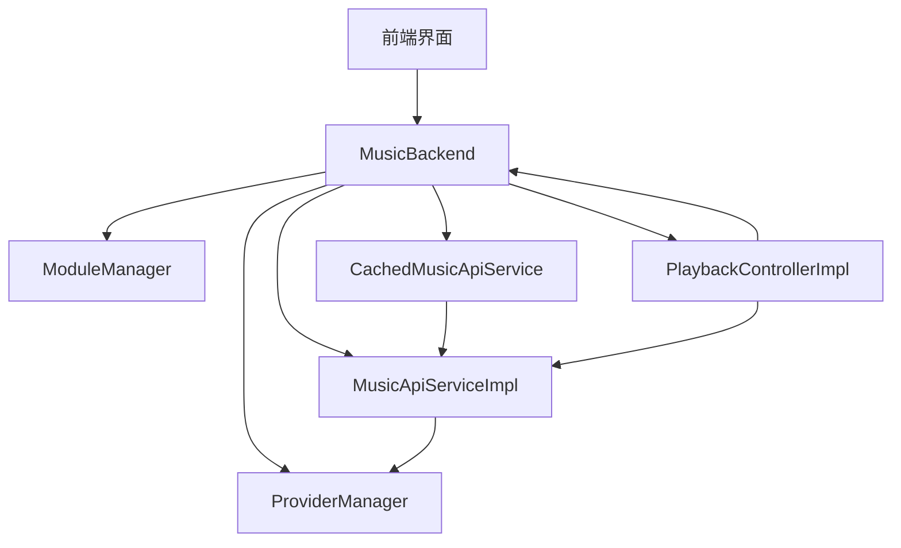
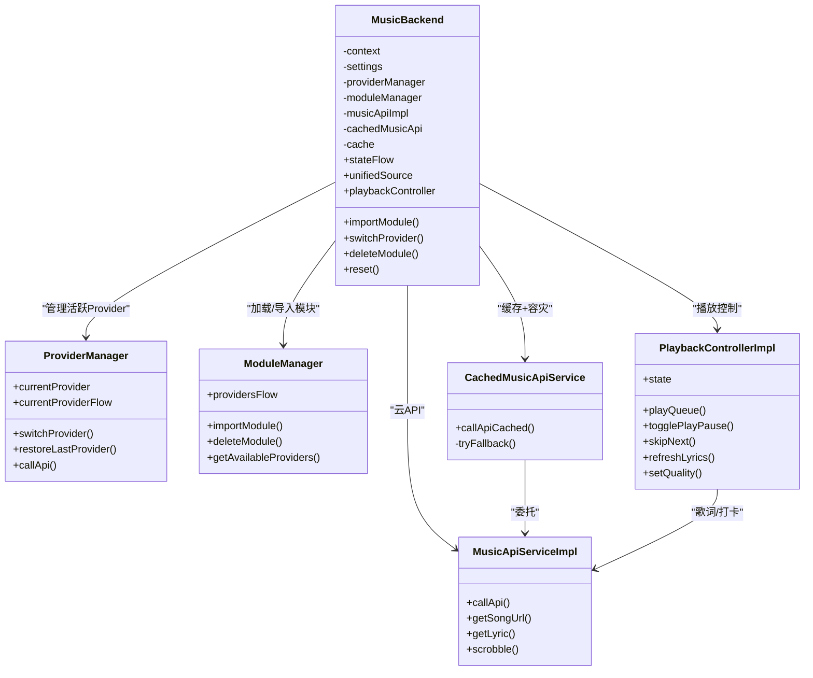
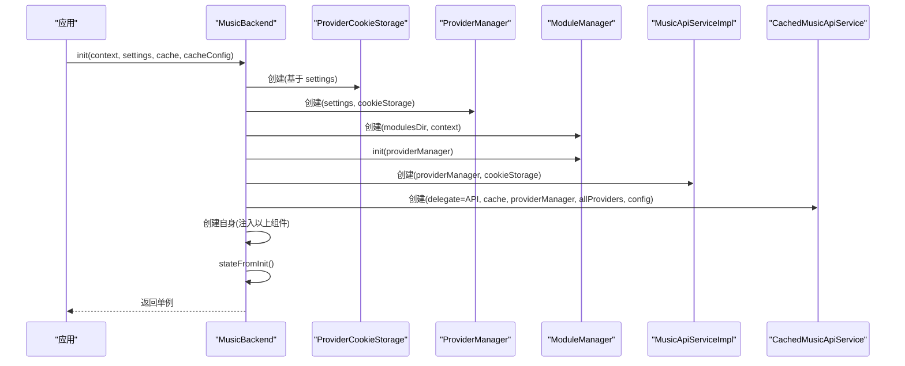

# MusicBackend 核心设计

<cite>
**本文引用的文件**
- [MusicBackend.kt](file://kmp-pro/src/commonMain/kotlin/cp/player/kmp/MusicBackend.kt)
- [ProviderManager.kt](file://kmp-pro/src/commonMain/kotlin/cp/player/kmp/provider/ProviderManager.kt)
- [ModuleManager.kt](file://kmp-pro/src/commonMain/kotlin/cp/player/kmp/provider/ModuleManager.kt)
- [MusicApiServiceImpl.kt](file://kmp-pro/src/commonMain/kotlin/cp/player/kmp/api/MusicApiServiceImpl.kt)
- [CachedMusicApiService.kt](file://kmp-pro/src/commonMain/kotlin/cp/player/kmp/cache/CachedMusicApiService.kt)
- [PlaybackControllerImpl.kt](file://kmp-pro/src/commonMain/kotlin/cp/player/kmp/playback/PlaybackControllerImpl.kt)
- [BackendState.kt](file://kmp-pro/src/commonMain/kotlin/cp/player/kmp/BackendState.kt)
</cite>

## 目录
1. [简介](#简介)
2. [项目结构](#项目结构)
3. [核心组件](#核心组件)
4. [架构总览](#架构总览)
5. [详细组件分析](#详细组件分析)
6. [依赖关系分析](#依赖关系分析)
7. [性能考量](#性能考量)
8. [故障排查指南](#故障排查指南)
9. [结论](#结论)
10. [附录：初始化与使用示例](#附录初始化与使用示例)

## 简介
本文件聚焦 MusicBackend 作为统一入口点的设计模式，详细说明其单例模式的线程安全实现、构造函数参数依赖注入、内部组件协调机制，并逐一解释 providerManager（Provider 管理）、moduleManager（模块管理）、musicApiImpl（API 服务）、cachedMusicApi（缓存服务）、playbackController（播放控制）等核心属性的职责。文档还包含初始化流程中各组件的创建顺序与依赖关系，以及正确的初始化与使用方式。

## 项目结构
MusicBackend 位于 KMP 公共模块中，围绕“后端统一入口”组织：
- 入口与状态机：MusicBackend、BackendState
- Provider 与模块：ProviderManager、ModuleManager、ProviderCookieStorage
- API 层：MusicApiServiceImpl、CachedMusicApiService
- 播放层：PlaybackControllerImpl、平台播放器抽象
- 工具与上下文：PlatformContext、SettingsStorage、HealthMonitor

图表来源
- [MusicBackend.kt:73-161](file://kmp-pro/src/commonMain/kotlin/cp/player/kmp/MusicBackend.kt#L73-L161)
- [ProviderManager.kt:31-145](file://kmp-pro/src/commonMain/kotlin/cp/player/kmp/provider/ProviderManager.kt#L31-L145)
- [ModuleManager.kt:19-137](file://kmp-pro/src/commonMain/kotlin/cp/player/kmp/provider/ModuleManager.kt#L19-L137)
- [MusicApiServiceImpl.kt:28-101](file://kmp-pro/src/commonMain/kotlin/cp/player/kmp/api/MusicApiServiceImpl.kt#L28-L101)
- [CachedMusicApiService.kt:46-88](file://kmp-pro/src/commonMain/kotlin/cp/player/kmp/cache/CachedMusicApiService.kt#L46-L88)
- [PlaybackControllerImpl.kt:35-44](file://kmp-pro/src/commonMain/kotlin/cp/player/kmp/playback/PlaybackControllerImpl.kt#L35-L44)

章节来源
- [MusicBackend.kt:30-72](file://kmp-pro/src/commonMain/kotlin/cp/player/kmp/MusicBackend.kt#L30-L72)

## 核心组件
- MusicBackend：统一入口，封装生命周期、状态机、Provider 管理、数据访问、播放控制与健康监控。
- ProviderManager：管理当前活跃 Provider、切换、端口分配、Cookie 存储、恢复上次选择。
- ModuleManager：扫描/导入/删除模块，加载 BackendProvider，维护可用 Provider 列表。
- MusicApiServiceImpl：将调用转发到当前 Provider，自动注入 Cookie，健康监控与响应校验。
- CachedMusicApiService：带缓存与多 Provider 容灾回退的 API 封装，返回 Flow 的多值结果。
- PlaybackControllerImpl：队列管理、URL 解析、歌词抓取、听歌打卡、自动下一首、音质降级等。

章节来源
- [MusicBackend.kt:73-161](file://kmp-pro/src/commonMain/kotlin/cp/player/kmp/MusicBackend.kt#L73-L161)
- [ProviderManager.kt:31-145](file://kmp-pro/src/commonMain/kotlin/cp/player/kmp/provider/ProviderManager.kt#L31-L145)
- [ModuleManager.kt:19-137](file://kmp-pro/src/commonMain/kotlin/cp/player/kmp/provider/ModuleManager.kt#L19-L137)
- [MusicApiServiceImpl.kt:28-101](file://kmp-pro/src/commonMain/kotlin/cp/player/kmp/api/MusicApiServiceImpl.kt#L28-L101)
- [CachedMusicApiService.kt:46-88](file://kmp-pro/src/commonMain/kotlin/cp/player/kmp/cache/CachedMusicApiService.kt#L46-L88)
- [PlaybackControllerImpl.kt:35-44](file://kmp-pro/src/commonMain/kotlin/cp/player/kmp/playback/PlaybackControllerImpl.kt#L35-L44)

## 架构总览
MusicBackend 通过依赖注入组合多个子系统，对外暴露统一接口；内部以 StateFlow 驱动状态机，保证 UI 可观察且一致。

图表来源
- [MusicBackend.kt:73-161](file://kmp-pro/src/commonMain/kotlin/cp/player/kmp/MusicBackend.kt#L73-L161)
- [ProviderManager.kt:31-145](file://kmp-pro/src/commonMain/kotlin/cp/player/kmp/provider/ProviderManager.kt#L31-L145)
- [ModuleManager.kt:19-137](file://kmp-pro/src/commonMain/kotlin/cp/player/kmp/provider/ModuleManager.kt#L19-L137)
- [MusicApiServiceImpl.kt:28-101](file://kmp-pro/src/commonMain/kotlin/cp/player/kmp/api/MusicApiServiceImpl.kt#L28-L101)
- [CachedMusicApiService.kt:46-88](file://kmp-pro/src/commonMain/kotlin/cp/player/kmp/cache/CachedMusicApiService.kt#L46-L88)
- [PlaybackControllerImpl.kt:35-44](file://kmp-pro/src/commonMain/kotlin/cp/player/kmp/playback/PlaybackControllerImpl.kt#L35-L44)

## 详细组件分析

### MusicBackend：统一入口与单例
- 单例模式与线程安全
  - 伴生对象持有 @Volatile INSTANCE，init 方法使用 synchronized(COMPA) 双重检查锁定，确保多线程下仅创建一次实例。
  - reset 时释放资源并清空单例引用，便于测试或重新初始化。
- 构造函数参数依赖注入
  - 通过私有构造接收 PlatformContext、SettingsStorage、ProviderManager、ModuleManager、MusicApiServiceImpl、CachedMusicApiService、ApiCache，解耦具体实现，便于替换与测试。
- 内部组件协调
  - stateFlow 驱动状态机，结合 moduleManager 与 providerManager 计算终态。
  - importModule 在导入后若无活跃 Provider，则自动激活首个可用 Provider。
  - playbackController 惰性创建，绑定 UnifiedMusicSource、MusicApiServiceImpl 与平台播放器。
- 关键属性职责
  - providerManager：当前活跃 Provider 管理与切换、Cookie 隔离、端口分配。
  - moduleManager：模块扫描/导入/删除、可用 Provider 列表。
  - musicApiImpl：云 API 调用、Cookie 注入、健康监控与响应校验。
  - cachedMusicApi：带缓存与多 Provider 容灾回退的 API 封装。
  - playbackController：播放队列、URL 解析、歌词抓取、听歌打卡、自动下一首、音质降级。

章节来源
- [MusicBackend.kt:73-161](file://kmp-pro/src/commonMain/kotlin/cp/player/kmp/MusicBackend.kt#L73-L161)
- [MusicBackend.kt:180-248](file://kmp-pro/src/commonMain/kotlin/cp/player/kmp/MusicBackend.kt#L180-L248)
- [MusicBackend.kt:314-371](file://kmp-pro/src/commonMain/kotlin/cp/player/kmp/MusicBackend.kt#L314-L371)

### ProviderManager：Provider 管理
- 职责
  - 维护 currentProvider、currentPort，提供 switchProvider、restoreLastProvider、startServer 等方法。
  - 通过 SettingsStorage 持久化最近活跃的 Provider ID。
  - 提供 callApi 在 IO 调度器上执行，按 Provider.apiMap 映射方法名，处理不支持的情况。
- 错误与恢复
  - 切换失败时回滚到上一个 Provider 并更新流状态。
  - 端口占用时尝试回退端口，最多尝试次数受控。

章节来源
- [ProviderManager.kt:31-145](file://kmp-pro/src/commonMain/kotlin/cp/player/kmp/provider/ProviderManager.kt#L31-L145)

### ModuleManager：模块管理
- 职责
  - 扫描 modulesDir，加载所有子目录模块，按 manifest.json 创建 BackendProvider。
  - 支持 importModule（解压 zip、移动目录、加载模块）、deleteModule（删除目录并更新列表）。
  - 初始化时恢复上次选择的 Provider，若无则自动选择第一个可用 Provider。
- 错误处理
  - lastLoadError 记录最近一次导入/加载失败原因，供 UI 展示。

章节来源
- [ModuleManager.kt:19-137](file://kmp-pro/src/commonMain/kotlin/cp/player/kmp/provider/ModuleManager.kt#L19-L137)

### MusicApiServiceImpl：API 服务
- 职责
  - 将请求转发给当前 Provider，自动注入 Cookie（区分认证类接口）。
  - 对响应进行 JSON 解析、字段校验、健康监控分类（OK/WARNING/ERROR）。
  - 提供 getSongUrl 的容错逻辑（302 版本失败回退到 v1），以及 scrobble、lyric 等常用方法。
- 容灾
  - callWithAllProviders 依次尝试所有已加载 Provider，优先当前 Provider，记录 wasFallback。

章节来源
- [MusicApiServiceImpl.kt:28-101](file://kmp-pro/src/commonMain/kotlin/cp/player/kmp/api/MusicApiServiceImpl.kt#L28-L101)
- [MusicApiServiceImpl.kt:189-221](file://kmp-pro/src/commonMain/kotlin/cp/player/kmp/api/MusicApiServiceImpl.kt#L189-L221)
- [MusicApiServiceImpl.kt:429-479](file://kmp-pro/src/commonMain/kotlin/cp/player/kmp/api/MusicApiServiceImpl.kt#L429-L479)

### CachedMusicApiService：缓存服务
- 职责
  - 对幂等读类接口启用缓存，键由 providerId、method、params、cookieHash 组成。
  - 先发射缓存（可能 stale），后台拉取新数据，指纹比对决定是否写回缓存。
  - 健康监控 ERROR 时触发多 Provider 容灾回退，成功则标记 FALLBACK。
- 配置
  - enableCache、freshTtlMs、enableFallback 等策略可控。

章节来源
- [CachedMusicApiService.kt:18-52](file://kmp-pro/src/commonMain/kotlin/cp/player/kmp/cache/CachedMusicApiService.kt#L18-L52)
- [CachedMusicApiService.kt:60-88](file://kmp-pro/src/commonMain/kotlin/cp/player/kmp/cache/CachedMusicApiService.kt#L60-L88)
- [CachedMusicApiService.kt:90-140](file://kmp-pro/src/commonMain/kotlin/cp/player/kmp/cache/CachedMusicApiService.kt#L90-L140)
- [CachedMusicApiService.kt:142-180](file://kmp-pro/src/commonMain/kotlin/cp/player/kmp/cache/CachedMusicApiService.kt#L142-L180)

### PlaybackControllerImpl：播放控制
- 职责
  - 队列管理（含 shuffle、repeat）、URL 解析、歌词抓取、听歌打卡、自动下一首、音质降级。
  - 通过 UnifiedMusicSource 获取曲目详情与播放 URL，结合 cookieProvider 注入请求头。
  - 监听平台播放器状态，折叠进 PlaybackUiState，提供丰富 UI 状态。
- 健壮性
  - 播放失败时自动降级到 standard 音质重试一次。
  - 收藏状态本地乐观更新，失败回滚。

章节来源
- [PlaybackControllerImpl.kt:18-44](file://kmp-pro/src/commonMain/kotlin/cp/player/kmp/playback/PlaybackControllerImpl.kt#L18-L44)
- [PlaybackControllerImpl.kt:495-556](file://kmp-pro/src/commonMain/kotlin/cp/player/kmp/playback/PlaybackControllerImpl.kt#L495-L556)
- [PlaybackControllerImpl.kt:558-575](file://kmp-pro/src/commonMain/kotlin/cp/player/kmp/playback/PlaybackControllerImpl.kt#L558-L575)
- [PlaybackControllerImpl.kt:719-753](file://kmp-pro/src/commonMain/kotlin/cp/player/kmp/playback/PlaybackControllerImpl.kt#L719-L753)

## 依赖关系分析
- 初始化顺序与依赖
  - 先创建 ProviderCookieStorage（基于 SettingsStorage）。
  - 再创建 ProviderManager（依赖 settings、cookieStorage）。
  - 创建 ModuleManager（依赖 modulesDir、context），并 init(providerManager)。
  - 创建 MusicApiServiceImpl（依赖 providerManager、cookieStorage）。
  - 创建 CachedMusicApiService（委托 MusicApiServiceImpl，依赖 cache、providerManager、allProviders、config）。
  - 最后创建 MusicBackend（注入以上所有组件），并计算终态。
- 运行时依赖
  - playbackController 惰性创建，依赖 unifiedSource、musicApiImpl、platform player、backendScope。
  - importModule 依赖 moduleManager 导入，并在必要时调用 switchProviderInternal 激活。

图表来源
- [MusicBackend.kt:330-367](file://kmp-pro/src/commonMain/kotlin/cp/player/kmp/MusicBackend.kt#L330-L367)
- [ProviderManager.kt:31-49](file://kmp-pro/src/commonMain/kotlin/cp/player/kmp/provider/ProviderManager.kt#L31-L49)
- [ModuleManager.kt:38-48](file://kmp-pro/src/commonMain/kotlin/cp/player/kmp/provider/ModuleManager.kt#L38-L48)
- [MusicApiServiceImpl.kt:28-31](file://kmp-pro/src/commonMain/kotlin/cp/player/kmp/api/MusicApiServiceImpl.kt#L28-L31)
- [CachedMusicApiService.kt:46-52](file://kmp-pro/src/commonMain/kotlin/cp/player/kmp/cache/CachedMusicApiService.kt#L46-L52)

章节来源
- [MusicBackend.kt:330-367](file://kmp-pro/src/commonMain/kotlin/cp/player/kmp/MusicBackend.kt#L330-L367)

## 性能考量
- 缓存策略
  - 仅对幂等读类接口启用缓存，避免写操作被缓存导致数据不一致。
  - 指纹比对减少重复写入，降低 I/O 压力。
- 多 Provider 容灾
  - 健康监控 ERROR 时触发回退，提升可用性；WARNING 仍返回数据但附带告警。
- 懒加载
  - playbackController 惰性创建，减少启动开销。
- 队列批量解析
  - 解析队列条目时按块批量请求，减少网络往返。

[本节为通用指导，不直接分析具体文件]

## 故障排查指南
- 导入模块失败
  - 查看 moduleManager.lastLoadError，常见原因：解压失败、缺少 manifest.json、移动临时目录失败、ABI 不匹配。
- Provider 未就绪
  - 检查端口是否被占用（ProviderManager 会尝试回退端口），或 JNI/Binary 入口是否存在。
- API 调用异常
  - 关注 HealthMonitor 记录的 level 与 warnings，定位缺失字段、慢响应、不支持功能等问题。
- 播放失败
  - 自动降级到 standard 音质重试；若仍失败，检查 URL 有效性、Cookie 注入、平台播放器兼容性。

章节来源
- [ModuleManager.kt:57-86](file://kmp-pro/src/commonMain/kotlin/cp/player/kmp/provider/ModuleManager.kt#L57-L86)
- [ProviderManager.kt:65-109](file://kmp-pro/src/commonMain/kotlin/cp/player/kmp/provider/ProviderManager.kt#L65-L109)
- [MusicApiServiceImpl.kt:48-101](file://kmp-pro/src/commonMain/kotlin/cp/player/kmp/api/MusicApiServiceImpl.kt#L48-L101)
- [PlaybackControllerImpl.kt:540-556](file://kmp-pro/src/commonMain/kotlin/cp/player/kmp/playback/PlaybackControllerImpl.kt#L540-L556)

## 结论
MusicBackend 以单例与依赖注入为核心，将 Provider 管理、模块管理、API 服务、缓存与播放控制有机整合，通过状态机与响应式流驱动 UI，提供稳定、可扩展的后端统一入口。其设计兼顾了可测试性、可维护性与跨平台能力，适合在复杂音乐应用中作为核心基础设施。

[本节为总结，不直接分析具体文件]

## 附录：初始化与使用示例
- 初始化
  - 在平台 Application.onCreate 或 JVM main 中调用 MusicBackend.init(context, settings)，可选传入自定义 ApiCache 与 CacheConfig。
  - 首次运行若无模块，状态为 NoProvider，引导用户导入模块。
- 导入模块
  - 调用 importModule(zipPath)，若此前无活跃 Provider，会自动激活首个可用 Provider；否则仅加载不切换。
- 切换 Provider
  - 使用 switchProvider 或 switchProviderById，失败时状态保持原样并返回错误。
- 数据访问
  - 推荐使用 unifiedSource 进行统一数据访问；旧版可直接使用 musicApi/cachedApi（已标注废弃）。
- 播放控制
  - 通过 playbackController 进行播放队列管理、播放/暂停、切歌、歌词刷新、音质设置等。

章节来源
- [MusicBackend.kt:30-72](file://kmp-pro/src/commonMain/kotlin/cp/player/kmp/MusicBackend.kt#L30-L72)
- [MusicBackend.kt:180-248](file://kmp-pro/src/commonMain/kotlin/cp/player/kmp/MusicBackend.kt#L180-L248)
- [MusicBackend.kt:330-367](file://kmp-pro/src/commonMain/kotlin/cp/player/kmp/MusicBackend.kt#L330-L367)
- [BackendState.kt:5-57](file://kmp-pro/src/commonMain/kotlin/cp/player/kmp/BackendState.kt#L5-L57)
- [BackendState.kt:59-130](file://kmp-pro/src/commonMain/kotlin/cp/player/kmp/BackendState.kt#L59-L130)