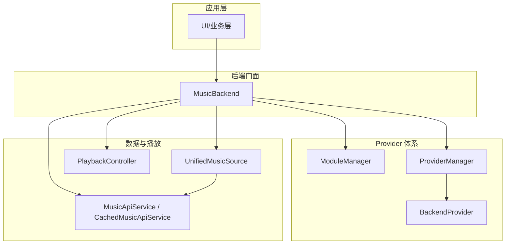
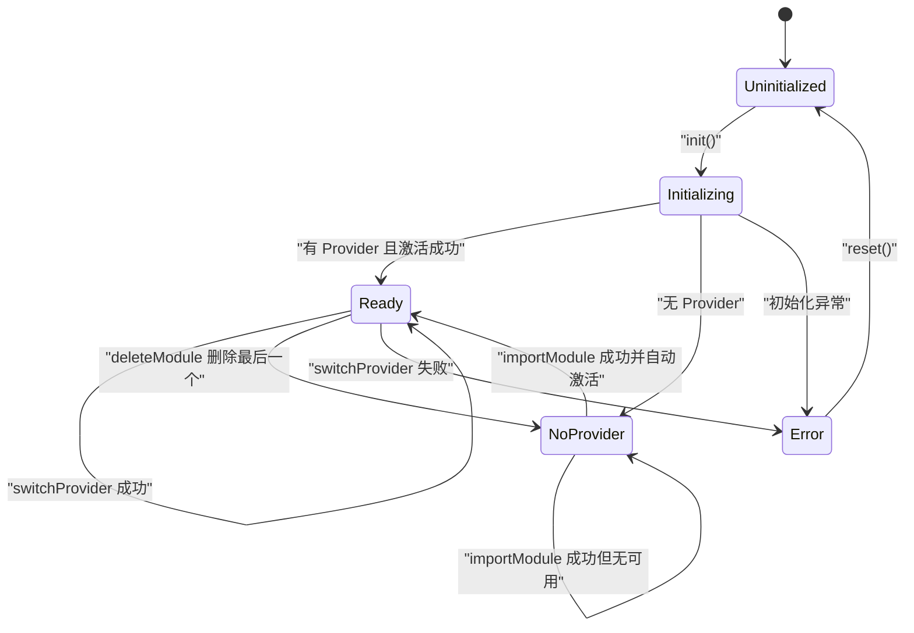
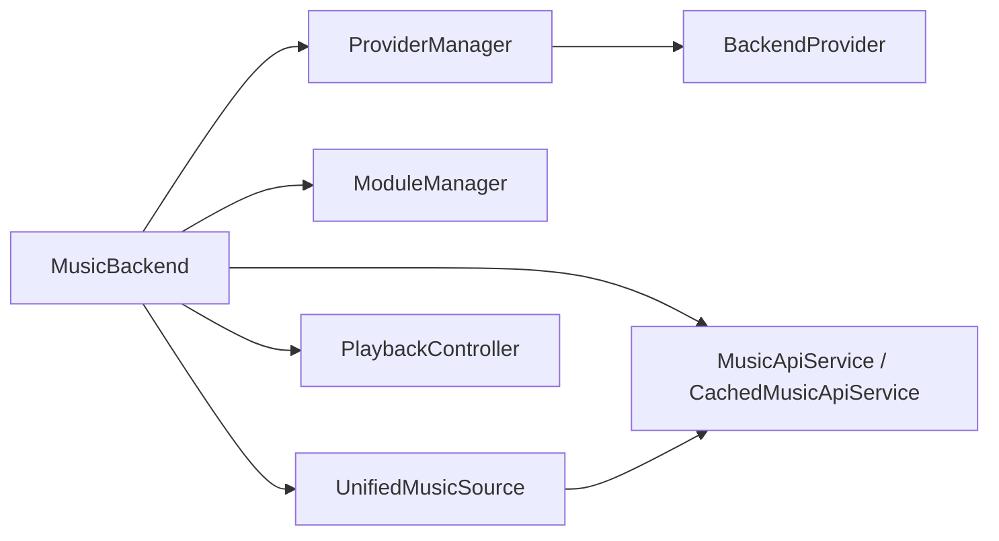

# 后端架构设计

<cite>
**本文引用的文件列表**
- [MusicBackend.kt](file://kmp-pro/src/commonMain/kotlin/cp/player/kmp/MusicBackend.kt)
- [BackendState.kt](file://kmp-pro/src/commonMain/kotlin/cp/player/kmp/BackendState.kt)
- [ProviderManager.kt](file://kmp-pro/src/commonMain/kotlin/cp/player/kmp/provider/ProviderManager.kt)
- [ModuleManager.kt](file://kmp-pro/src/commonMain/kotlin/cp/player/kmp/provider/ModuleManager.kt)
- [BackendProvider.kt](file://kmp-pro/src/commonMain/kotlin/cp/player/kmp/provider/BackendProvider.kt)
- [MusicApiService.kt](file://kmp-pro/src/commonMain/kotlin/cp/player/kmp/api/MusicApiService.kt)
- [UnifiedMusicSource.kt](file://kmp-pro/src/commonMain/kotlin/cp/player/kmp/music/UnifiedMusicSource.kt)
- [PlaybackController.kt](file://kmp-pro/src/commonMain/kotlin/cp/player/kmp/playback/PlaybackController.kt)
- [Main.kt](file://app/src/desktopMain/kotlin/cp/player/app/Main.kt)
- [MainActivity.kt](file://androidApp/src/main/kotlin/cp/player/app/MainActivity.kt)
</cite>

## 目录
1. [简介](#简介)
2. [项目结构](#项目结构)
3. [核心组件](#核心组件)
4. [架构总览](#架构总览)
5. [详细组件分析](#详细组件分析)
6. [依赖关系分析](#依赖关系分析)
7. [性能考量](#性能考量)
8. [故障排查指南](#故障排查指南)
9. [结论](#结论)
10. [附录：集成示例](#附录：集成示例)

## 简介
本文件面向 CPPlayer-KMP 的后端架构，聚焦 MusicBackend 作为统一入口点的设计模式，包括其单例初始化、生命周期管理、状态机（BackendState）以及它与 ProviderManager、ModuleManager、MusicApiService 等核心组件的协作方式。文档同时覆盖初始化流程、错误处理机制、资源释放策略，并给出应用集成的具体使用路径与调用序列图。

## 项目结构
- 后端核心位于 kmp-pro 模块的 commonMain，提供跨平台一致的 API 与编排逻辑。
- MusicBackend 是对外唯一暴露的后端门面，封装了：
  - 状态机与生命周期（stateFlow/state）
  - Provider 导入/切换/删除
  - 音乐数据访问（MusicApiService/CachedMusicApiService/UnifiedMusicSource）
  - 播放控制（PlaybackController）
  - 健康监控（HealthMonitor）
- Provider 体系由 ModuleManager（加载/导入/删除模块）和 ProviderManager（活跃 Provider 切换与持久化）组成。
- 各平台入口在 app 模块中完成 MusicBackend.init(context, settings)。



图表来源
- [MusicBackend.kt:30-161](file://kmp-pro/src/commonMain/kotlin/cp/player/kmp/MusicBackend.kt#L30-L161)
- [ProviderManager.kt:15-145](file://kmp-pro/src/commonMain/kotlin/cp/player/kmp/provider/ProviderManager.kt#L15-L145)
- [ModuleManager.kt:10-137](file://kmp-pro/src/commonMain/kotlin/cp/player/kmp/provider/ModuleManager.kt#L10-L137)
- [BackendProvider.kt:5-96](file://kmp-pro/src/commonMain/kotlin/cp/player/kmp/provider/BackendProvider.kt#L5-L96)
- [MusicApiService.kt:5-23](file://kmp-pro/src/commonMain/kotlin/cp/player/kmp/api/MusicApiService.kt#L5-L23)
- [UnifiedMusicSource.kt:3-38](file://kmp-pro/src/commonMain/kotlin/cp/player/kmp/music/UnifiedMusicSource.kt#L3-L38)
- [PlaybackController.kt:6-16](file://kmp-pro/src/commonMain/kotlin/cp/player/kmp/playback/PlaybackController.kt#L6-L16)

章节来源
- [MusicBackend.kt:30-161](file://kmp-pro/src/commonMain/kotlin/cp/player/kmp/MusicBackend.kt#L30-L161)
- [ProviderManager.kt:15-145](file://kmp-pro/src/commonMain/kotlin/cp/player/kmp/provider/ProviderManager.kt#L15-L145)
- [ModuleManager.kt:10-137](file://kmp-pro/src/commonMain/kotlin/cp/player/kmp/provider/ModuleManager.kt#L10-L137)
- [BackendProvider.kt:5-96](file://kmp-pro/src/commonMain/kotlin/cp/player/kmp/provider/BackendProvider.kt#L5-L96)
- [MusicApiService.kt:5-23](file://kmp-pro/src/commonMain/kotlin/cp/player/kmp/api/MusicApiService.kt#L5-L23)
- [UnifiedMusicSource.kt:3-38](file://kmp-pro/src/commonMain/kotlin/cp/player/kmp/music/UnifiedMusicSource.kt#L3-L38)
- [PlaybackController.kt:6-16](file://kmp-pro/src/commonMain/kotlin/cp/player/kmp/playback/PlaybackController.kt#L6-L16)

## 核心组件
- MusicBackend：统一入口，负责单例初始化、状态机、Provider 管理、API 访问、播放控制、健康监控与资源释放。
- BackendState：描述后端从 Uninitialized → Initializing → NoProvider/Ready/Error 的状态机。
- ProviderManager：维护当前活跃 Provider、端口分配、切换与持久化。
- ModuleManager：扫描/导入/删除模块，创建 BackendProvider 实例并维护可用列表。
- BackendProvider：抽象不同实现（JNI/Binary/HTTP），定义 startServer/stopServer/callApi/isReady 等能力。
- MusicApiService：统一的云侧 API 接口集合，内部通过 ProviderManager 路由到具体 Provider。
- UnifiedMusicSource：统一媒体 ID 的数据源抽象，屏蔽多 Provider 与本地源差异。
- PlaybackController：前端唯一播放控制入口，协调取源、歌词、收藏、音质、定时等。

章节来源
- [MusicBackend.kt:30-161](file://kmp-pro/src/commonMain/kotlin/cp/player/kmp/MusicBackend.kt#L30-L161)
- [BackendState.kt:5-57](file://kmp-pro/src/commonMain/kotlin/cp/player/kmp/BackendState.kt#L5-L57)
- [ProviderManager.kt:15-145](file://kmp-pro/src/commonMain/kotlin/cp/player/kmp/provider/ProviderManager.kt#L15-L145)
- [ModuleManager.kt:10-137](file://kmp-pro/src/commonMain/kotlin/cp/player/kmp/provider/ModuleManager.kt#L10-L137)
- [BackendProvider.kt:5-96](file://kmp-pro/src/commonMain/kotlin/cp/player/kmp/provider/BackendProvider.kt#L5-L96)
- [MusicApiService.kt:5-23](file://kmp-pro/src/commonMain/kotlin/cp/player/kmp/api/MusicApiService.kt#L5-L23)
- [UnifiedMusicSource.kt:3-38](file://kmp-pro/src/commonMain/kotlin/cp/player/kmp/music/UnifiedMusicSource.kt#L3-L38)
- [PlaybackController.kt:6-16](file://kmp-pro/src/commonMain/kotlin/cp/player/kmp/playback/PlaybackController.kt#L6-L16)

## 架构总览
MusicBackend 作为门面，将“模块加载—激活—切换—数据访问—播放”串联为一条清晰链路。Provider 以模块形式存在，由 ModuleManager 负责加载；ProviderManager 负责选择并启动服务；MusicApiService 与 UnifiedMusicSource 提供上层数据访问；PlaybackController 负责播放相关能力。

```mermaid
sequenceDiagram
participant App as "应用"
participant MB as "MusicBackend"
participant MM as "ModuleManager"
participant PM as "ProviderManager"
participant BP as "BackendProvider"
participant API as "MusicApiService"
participant UMS as "UnifiedMusicSource"
participant PC as "PlaybackController"
App->>MB : init(context, settings)
MB->>MM : init(providerManager)
MM->>PM : restoreLastProvider(...)
MM-->>MB : 已加载 Provider 列表
MB->>MB : stateFromInit()
MB-->>App : stateFlow(NoProvider/Ready/Error)
App->>MB : importModule(zipPath)
MB->>MM : importModule(zipPath)
MM-->>MB : 成功/失败
MB->>PM : switchProvider(首个可用)
PM->>BP : startServer(context, port)
BP-->>PM : 就绪
PM-->>MB : 切换成功
MB-->>App : stateFlow(Ready)
App->>UMS : getTrackDetail(mediaId)
UMS->>API : callApi(...)
API->>PM : callApi(method, params)
PM->>BP : callApi(mappedMethod, params)
BP-->>API : JSON
API-->>UMS : JsonElement
UMS-->>App : TrackSummary
App->>PC : playQueue(mediaIds)
PC->>UMS : getSongUrl(mediaId)
UMS->>API : ...
API->>PM->>BP : ...
BP-->>API : URL
API-->>UMS : SongUrl
UMS-->>PC : URL
PC->>PlatformPlayer : play(url)
```

图表来源
- [MusicBackend.kt:330-388](file://kmp-pro/src/commonMain/kotlin/cp/player/kmp/MusicBackend.kt#L330-L388)
- [ModuleManager.kt:38-48](file://kmp-pro/src/commonMain/kotlin/cp/player/kmp/provider/ModuleManager.kt#L38-L48)
- [ProviderManager.kt:65-109](file://kmp-pro/src/commonMain/kotlin/cp/player/kmp/provider/ProviderManager.kt#L65-L109)
- [MusicApiService.kt:24-40](file://kmp-pro/src/commonMain/kotlin/cp/player/kmp/api/MusicApiService.kt#L24-L40)
- [UnifiedMusicSource.kt:7-38](file://kmp-pro/src/commonMain/kotlin/cp/player/kmp/music/UnifiedMusicSource.kt#L7-L38)
- [PlaybackController.kt:16-31](file://kmp-pro/src/commonMain/kotlin/cp/player/kmp/playback/PlaybackController.kt#L16-L31)

## 详细组件分析

### MusicBackend：统一入口与单例
- 单例模式：companion object 中的 init 方法保证全局唯一实例，并在初始化完成后计算终态。
- 生命周期：
  - 构造时注入 PlatformContext、SettingsStorage、ProviderManager、ModuleManager、MusicApiServiceImpl、CachedMusicApiService、ApiCache。
  - 初始化后调用 stateFromInit() 根据当前 Provider 是否就绪决定初始状态。
  - reset() 用于释放资源（停止服务、释放播放器、取消协程作用域、重置状态）。
- 状态机：
  - stateFlow 暴露 BackendState，支持 UI 观察。
  - 导入/切换/删除模块会触发状态迁移。
- 组件协调：
  - Provider 管理：importModule、switchProvider、deleteModule。
  - 数据访问：musicApi/cachedApi（兼容层）、unifiedSource（推荐）。
  - 播放控制：playbackController 惰性创建，绑定 unifiedSource、musicApiImpl、cookieProvider。
- 错误处理：
  - switchProviderInternal 捕获异常并转为 Error 状态。
  - extractProviderError 尝试反射获取 JNI 加载错误信息。

章节来源
- [MusicBackend.kt:73-161](file://kmp-pro/src/commonMain/kotlin/cp/player/kmp/MusicBackend.kt#L73-L161)
- [MusicBackend.kt:189-248](file://kmp-pro/src/commonMain/kotlin/cp/player/kmp/MusicBackend.kt#L189-L248)
- [MusicBackend.kt:273-310](file://kmp-pro/src/commonMain/kotlin/cp/player/kmp/MusicBackend.kt#L273-L310)
- [MusicBackend.kt:330-388](file://kmp-pro/src/commonMain/kotlin/cp/player/kmp/MusicBackend.kt#L330-L388)
- [MusicBackend.kt:260-269](file://kmp-pro/src/commonMain/kotlin/cp/player/kmp/MusicBackend.kt#L260-L269)

### BackendState：状态机设计
- 状态定义：
  - Uninitialized：尚未初始化。
  - Initializing：初始化过程中（短暂同步）。
  - NoProvider：已初始化但无可用 Provider。
  - Ready(provider)：有活跃且就绪的 Provider。
  - Error(message)：初始化或切换失败。
- 转换逻辑：
  - init() 后根据 currentProvider 是否就绪、是否有可用模块决定初始状态。
  - importModule 成功后若此前无活跃 Provider，自动激活并切换到 Ready。
  - deleteModule 删除最后一个 Provider 时回到 NoProvider。
  - switchProvider 失败保持原状态并返回 Error。
  - reset() 回到 Uninitialized。



图表来源
- [BackendState.kt:5-57](file://kmp-pro/src/commonMain/kotlin/cp/player/kmp/BackendState.kt#L5-L57)
- [MusicBackend.kt:373-388](file://kmp-pro/src/commonMain/kotlin/cp/player/kmp/MusicBackend.kt#L373-L388)
- [MusicBackend.kt:189-248](file://kmp-pro/src/commonMain/kotlin/cp/player/kmp/MusicBackend.kt#L189-L248)

章节来源
- [BackendState.kt:5-57](file://kmp-pro/src/commonMain/kotlin/cp/player/kmp/BackendState.kt#L5-L57)
- [MusicBackend.kt:373-388](file://kmp-pro/src/commonMain/kotlin/cp/player/kmp/MusicBackend.kt#L373-L388)

### ProviderManager：活跃 Provider 管理与持久化
- 职责：
  - 维护 currentProvider、currentPort。
  - 切换 Provider 时自动停止旧服务、寻找可用端口、启动新服务。
  - 持久化最近使用的 Provider ID，重启恢复。
  - 提供 callApi 统一调用通道，按 apiMap 映射方法名。
- 关键点：
  - 端口冲突自动回退。
  - 切换失败回滚到 previousProvider。
  - Cookie 存储按 providerId 隔离。

章节来源
- [ProviderManager.kt:15-145](file://kmp-pro/src/commonMain/kotlin/cp/player/kmp/provider/ProviderManager.kt#L15-L145)

### ModuleManager：模块加载与导入
- 职责：
  - 扫描 modulesDir，加载所有子目录模块。
  - 导入 zip 包，解析 manifest.json，移动到目标目录并创建 Provider。
  - 维护 providers 列表与 Flow。
  - 删除模块并更新列表。
- 关键点：
  - 加载失败记录 lastLoadError。
  - 通过 ProviderFactory 创建 Provider，校验 isReady。
  - 首次启动时尝试恢复上次 Provider 或自动选择第一个。

章节来源
- [ModuleManager.kt:10-137](file://kmp-pro/src/commonMain/kotlin/cp/player/kmp/provider/ModuleManager.kt#L10-L137)

### BackendProvider：Provider 抽象
- 定义：
  - id/name/version/type、apiMap/updateUrl/targetAppPackage。
  - startServer/stopServer/callApi/analyzeAudio/isReady。
- 类型：
  - JNI、BINARY、WEBSOCKET、HTTP。
- 作用：
  - 屏蔽不同后端实现细节，统一接入 MusicBackend。

章节来源
- [BackendProvider.kt:5-96](file://kmp-pro/src/commonMain/kotlin/cp/player/kmp/provider/BackendProvider.kt#L5-L96)

### MusicApiService：统一 API 服务
- 职责：
  - 提供认证、用户、歌单、专辑、歌手、搜索、播放、社交、榜单、推荐、MV、视频、电台等大量 API。
  - 所有方法返回 JsonElement，内部通过 ProviderManager 路由到具体 Provider。
  - 自动注入 cookie，错误统一格式。
- 调用链：
  - Repository/业务层 → MusicApiService → ProviderManager → BackendProvider。

章节来源
- [MusicApiService.kt:5-23](file://kmp-pro/src/commonMain/kotlin/cp/player/kmp/api/MusicApiService.kt#L5-L23)
- [MusicApiService.kt:24-528](file://kmp-pro/src/commonMain/kotlin/cp/player/kmp/api/MusicApiService.kt#L24-L528)

### UnifiedMusicSource：统一媒体源
- 职责：
  - 基于 CPMediaId 路由到对应 Provider 或本地源。
  - 提供 getTrackDetail/getSongUrl/search/getUserPlaylists 等高层接口。
- 优势：
  - 屏蔽多 Provider 与本地源差异，统一模型返回。

章节来源
- [UnifiedMusicSource.kt:3-38](file://kmp-pro/src/commonMain/kotlin/cp/player/kmp/music/UnifiedMusicSource.kt#L3-L38)

### PlaybackController：播放控制入口
- 职责：
  - 队列管理、播放控制、收藏、音质、睡眠定时、歌词刷新、音量等。
  - 内部协调 PlatformPlayer、UnifiedMusicSource、MusicApiService。
- 约定：
  - 前端只与此接口交互，禁止直接操作底层引擎或做模型转换。

章节来源
- [PlaybackController.kt:6-106](file://kmp-pro/src/commonMain/kotlin/cp/player/kmp/playback/PlaybackController.kt#L6-L106)

## 依赖关系分析
- MusicBackend 依赖：
  - ProviderManager（切换/持久化）
  - ModuleManager（模块加载/导入/删除）
  - MusicApiServiceImpl/CachedMusicApiService（云 API）
  - UnifiedMusicSource（统一数据源）
  - PlaybackController（播放控制）
  - HealthMonitor（健康监控）
- ProviderManager 依赖：
  - SettingsStorage（持久化）
  - PlatformSupport（端口查找）
  - BackendProvider（start/stop/callApi）
- ModuleManager 依赖：
  - PlatformSupport（文件系统、解压、移动）
  - ProviderFactory（创建 Provider）
  - ModuleManifest（模块清单）



图表来源
- [MusicBackend.kt:73-161](file://kmp-pro/src/commonMain/kotlin/cp/player/kmp/MusicBackend.kt#L73-L161)
- [ProviderManager.kt:15-145](file://kmp-pro/src/commonMain/kotlin/cp/player/kmp/provider/ProviderManager.kt#L15-L145)
- [ModuleManager.kt:10-137](file://kmp-pro/src/commonMain/kotlin/cp/player/kmp/provider/ModuleManager.kt#L10-L137)
- [MusicApiService.kt:5-23](file://kmp-pro/src/commonMain/kotlin/cp/player/kmp/api/MusicApiService.kt#L5-L23)
- [UnifiedMusicSource.kt:3-38](file://kmp-pro/src/commonMain/kotlin/cp/player/kmp/music/UnifiedMusicSource.kt#L3-L38)
- [PlaybackController.kt:6-16](file://kmp-pro/src/commonMain/kotlin/cp/player/kmp/playback/PlaybackController.kt#L6-L16)

章节来源
- [MusicBackend.kt:73-161](file://kmp-pro/src/commonMain/kotlin/cp/player/kmp/MusicBackend.kt#L73-L161)
- [ProviderManager.kt:15-145](file://kmp-pro/src/commonMain/kotlin/cp/player/kmp/provider/ProviderManager.kt#L15-L145)
- [ModuleManager.kt:10-137](file://kmp-pro/src/commonMain/kotlin/cp/player/kmp/provider/ModuleManager.kt#L10-L137)

## 性能考量
- 端口分配：ProviderManager 在切换时自动检测端口可用性，避免冲突。
- 缓存：CachedMusicApiService 结合 ApiCache 减少重复网络请求。
- 懒加载：PlaybackController 惰性创建，减少启动开销。
- 流式状态：StateFlow 暴露状态变更，UI 高效响应。
- 模块加载：ModuleManager 仅在必要时扫描/导入，避免频繁 I/O。

[本节为通用指导，不直接分析具体文件]

## 故障排查指南
- 初始化失败：
  - 检查 stateFlow 是否为 Error，查看 lastLoadError。
  - 确认 modulesDir 是否存在、manifest.json 是否有效。
- Provider 未就绪：
  - 检查 BackendProvider.isReady()，JNI 类型可能加载失败。
  - 使用 extractProviderError 获取详细原因。
- 切换失败：
  - 检查端口是否被占用，ProviderManager 会尝试回退。
  - 确认 Provider 的 startServer 是否抛出异常。
- 删除模块后状态异常：
  - 若删除的是最后一个 Provider，状态应回到 NoProvider。
- 资源释放：
  - 调用 reset() 停止服务、释放播放器、取消协程作用域、重置状态。

章节来源
- [MusicBackend.kt:273-310](file://kmp-pro/src/commonMain/kotlin/cp/player/kmp/MusicBackend.kt#L273-L310)
- [ModuleManager.kt:57-117](file://kmp-pro/src/commonMain/kotlin/cp/player/kmp/provider/ModuleManager.kt#L57-L117)
- [ProviderManager.kt:65-109](file://kmp-pro/src/commonMain/kotlin/cp/player/kmp/provider/ProviderManager.kt#L65-L109)
- [MusicBackend.kt:260-269](file://kmp-pro/src/commonMain/kotlin/cp/player/kmp/MusicBackend.kt#L260-L269)

## 结论
MusicBackend 通过单例模式与状态机设计，提供了稳定、可观测、可扩展的后端统一入口。它协调 ModuleManager 与 ProviderManager 完成模块加载与激活，借助 MusicApiService 与 UnifiedMusicSource 屏蔽多 Provider 差异，并通过 PlaybackController 提供一致的播放体验。该架构具备良好的错误处理与资源管理能力，适合在多平台 KMP 项目中复用。

[本节为总结性内容，不直接分析具体文件]

## 附录：集成示例
- 桌面端初始化：
  - 在 main 函数中调用 MusicBackend.init(context, settings)，随后启动 UI。
- Android 端初始化：
  - 在 Activity.onCreate 中初始化 KMP 上下文与 MusicBackend，再设置 Compose 内容。

章节来源
- [Main.kt:10-38](file://app/src/desktopMain/kotlin/cp/player/app/Main.kt#L10-L38)
- [MainActivity.kt:14-39](file://androidApp/src/main/kotlin/cp/player/app/MainActivity.kt#L14-L39)