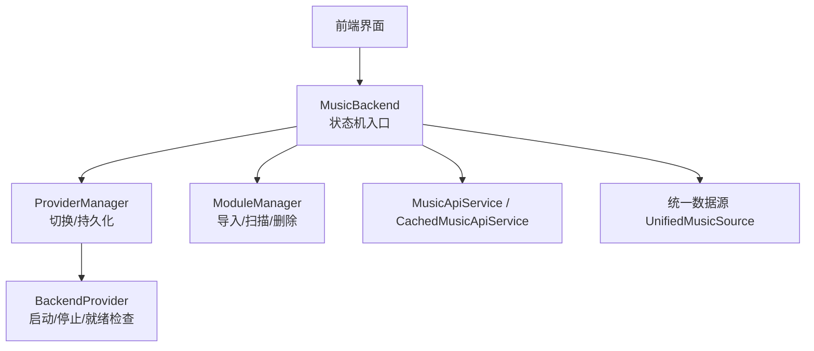
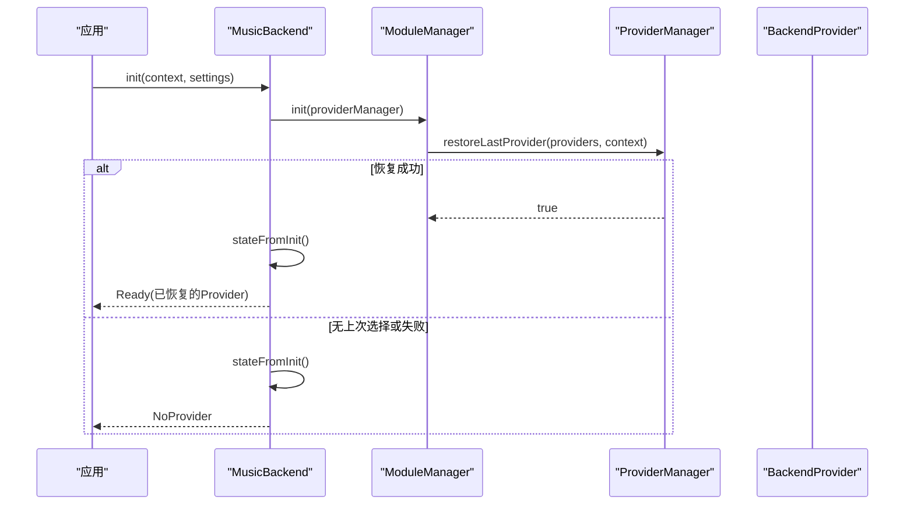
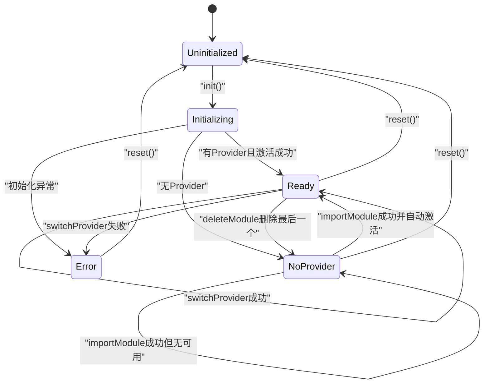
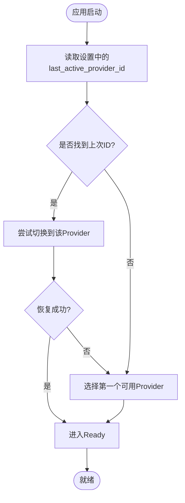
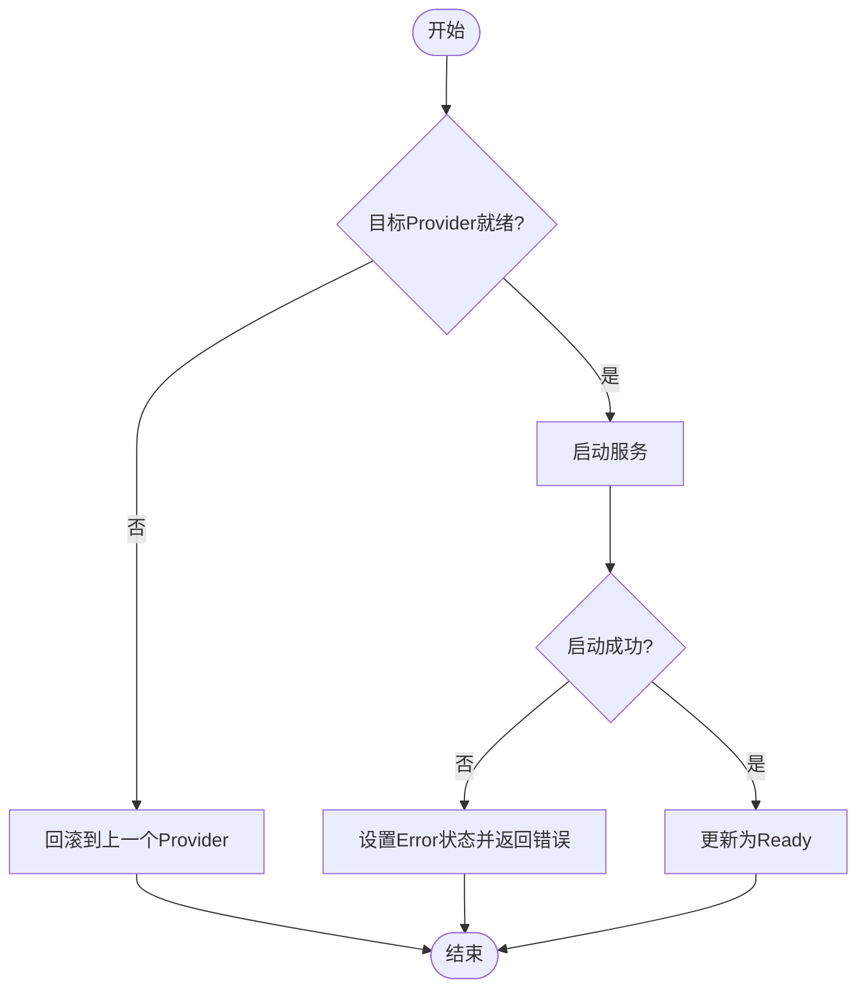
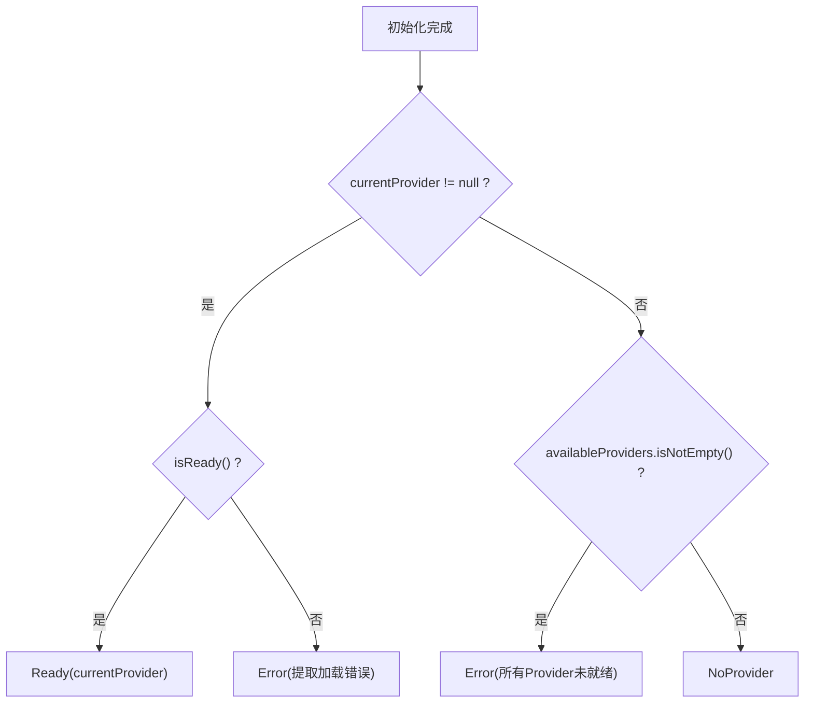
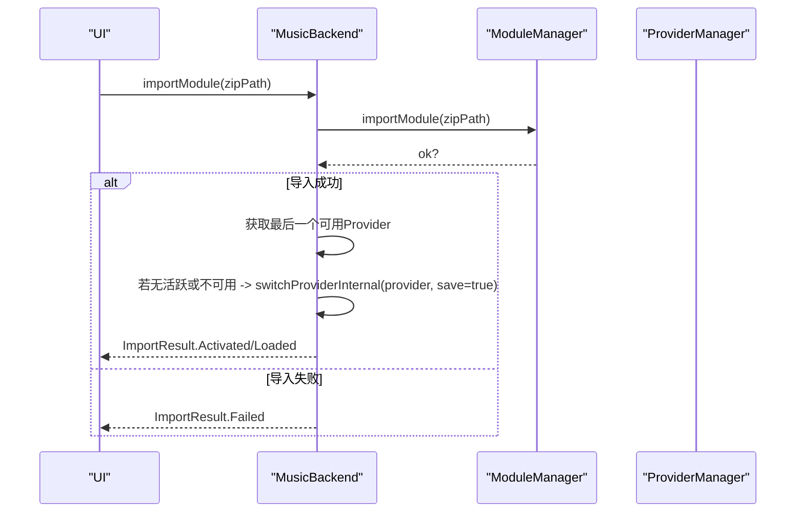
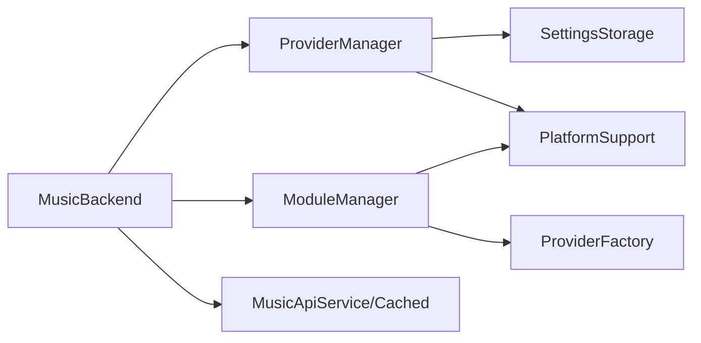

# 后端状态机设计

<cite>
**本文引用的文件**
- [BackendState.kt](file://kmp-pro/src/commonMain/kotlin/cp/player/kmp/BackendState.kt)
- [MusicBackend.kt](file://kmp-pro/src/commonMain/kotlin/cp/player/kmp/MusicBackend.kt)
- [ProviderManager.kt](file://kmp-pro/src/commonMain/kotlin/cp/player/kmp/provider/ProviderManager.kt)
- [ModuleManager.kt](file://kmp-pro/src/commonMain/kotlin/cp/player/kmp/provider/ModuleManager.kt)
- [BackendProvider.kt](file://kmp-pro/src/commonMain/kotlin/cp/player/kmp/provider/BackendProvider.kt)
</cite>

## 目录
1. [简介](#简介)
2. [项目结构](#项目结构)
3. [核心组件](#核心组件)
4. [架构总览](#架构总览)
5. [详细组件分析](#详细组件分析)
6. [依赖关系分析](#依赖关系分析)
7. [性能考量](#性能考量)
8. [故障排查指南](#故障排查指南)
9. [结论](#结论)
10. [附录：使用示例与最佳实践](#附录使用示例与最佳实践)

## 简介
本文件面向 CPPlayer KMP 后端的“状态机系统”，围绕 BackendState 枚举及其在 MusicBackend 中的流转进行系统化说明。重点包括：
- BackendState 各状态（Uninitialized、Initializing、NoProvider、Ready、Error）的含义与转换条件
- 通过 StateFlow 暴露状态变化，UI 可观察并响应
- 状态持久化机制（最近活跃 Provider 的恢复）
- 错误状态的恢复策略（重试、回退、用户引导）
- 状态流转图与具体使用示例

## 项目结构
与状态机直接相关的代码集中在 kmp-pro 模块的 commonMain 中：
- 状态定义：BackendState.kt
- 状态机主体：MusicBackend.kt
- Provider 管理：ProviderManager.kt
- 模块加载：ModuleManager.kt
- Provider 接口：BackendProvider.kt

图表来源
- [MusicBackend.kt:30-72](file://kmp-pro/src/commonMain/kotlin/cp/player/kmp/MusicBackend.kt#L30-L72)
- [ProviderManager.kt:15-30](file://kmp-pro/src/commonMain/kotlin/cp/player/kmp/provider/ProviderManager.kt#L15-L30)
- [ModuleManager.kt:10-22](file://kmp-pro/src/commonMain/kotlin/cp/player/kmp/provider/ModuleManager.kt#L10-L22)
- [BackendProvider.kt:5-23](file://kmp-pro/src/commonMain/kotlin/cp/player/kmp/provider/BackendProvider.kt#L5-L23)

章节来源
- [MusicBackend.kt:30-72](file://kmp-pro/src/commonMain/kotlin/cp/player/kmp/MusicBackend.kt#L30-L72)
- [BackendState.kt:5-57](file://kmp-pro/src/commonMain/kotlin/cp/player/kmp/BackendState.kt#L5-L57)

## 核心组件
- BackendState：描述后端生命周期状态，包含 Uninitialized、Initializing、NoProvider、Ready、Error，并提供便捷判断与 activeProvider 访问。
- MusicBackend：状态机主体，封装初始化、Provider 导入/切换/删除、播放控制、健康监控等；通过 stateFlow 暴露状态变化。
- ProviderManager：负责当前活跃 Provider 的切换、端口分配、Cookie 隔离、持久化最近活跃 Provider ID。
- ModuleManager：负责从 modules 目录扫描、导入 zip 模块、加载 Provider 实例、维护可用 Provider 列表。
- BackendProvider：Provider 抽象接口，定义 id/name/version/type、API 映射、启动/停止、调用 API、就绪检查等。

章节来源
- [BackendState.kt:25-57](file://kmp-pro/src/commonMain/kotlin/cp/player/kmp/BackendState.kt#L25-L57)
- [MusicBackend.kt:73-179](file://kmp-pro/src/commonMain/kotlin/cp/player/kmp/MusicBackend.kt#L73-L179)
- [ProviderManager.kt:31-145](file://kmp-pro/src/commonMain/kotlin/cp/player/kmp/provider/ProviderManager.kt#L31-L145)
- [ModuleManager.kt:19-137](file://kmp-pro/src/commonMain/kotlin/cp/player/kmp/provider/ModuleManager.kt#L19-L137)
- [BackendProvider.kt:24-96](file://kmp-pro/src/commonMain/kotlin/cp/player/kmp/provider/BackendProvider.kt#L24-L96)

## 架构总览
状态机以 MusicBackend 为核心，结合 ProviderManager 与 ModuleManager 完成 Provider 的生命周期管理。状态通过 MutableStateFlow 暴露为 StateFlow，供 UI 订阅。

图表来源
- [MusicBackend.kt:330-367](file://kmp-pro/src/commonMain/kotlin/cp/player/kmp/MusicBackend.kt#L330-L367)
- [MusicBackend.kt:373-388](file://kmp-pro/src/commonMain/kotlin/cp/player/kmp/MusicBackend.kt#L373-L388)
- [ProviderManager.kt:117-121](file://kmp-pro/src/commonMain/kotlin/cp/player/kmp/provider/ProviderManager.kt#L117-L121)
- [ModuleManager.kt:38-48](file://kmp-pro/src/commonMain/kotlin/cp/player/kmp/provider/ModuleManager.kt#L38-L48)

## 详细组件分析

### BackendState 状态机与转换规则
- 状态集合
  - Uninitialized：尚未调用 init
  - Initializing：正在初始化（短暂且同步）
  - NoProvider：已初始化但无可用 Provider
  - Ready(provider)：有活跃 Provider 提供服务
  - Error(message)：初始化或切换失败

- 转换条件（依据源码注释与实现）
  - Uninitialized → Initializing：调用 init
  - Initializing → Ready(provider)：存在 Provider 且激活成功
  - Initializing → NoProvider：无可用 Provider
  - Initializing → Error(message)：初始化异常
  - NoProvider → Ready(provider)：importModule 成功并自动激活
  - NoProvider → NoProvider：importModule 成功但无可用（保持）
  - Ready → Ready(newProvider)：switchProvider 成功
  - Ready → NoProvider：deleteModule 删除最后一个
  - Ready → Error：switchProvider 失败
  - 任意 → Uninitialized：reset

图表来源
- [BackendState.kt:11-23](file://kmp-pro/src/commonMain/kotlin/cp/player/kmp/BackendState.kt#L11-L23)
- [MusicBackend.kt:189-242](file://kmp-pro/src/commonMain/kotlin/cp/player/kmp/MusicBackend.kt#L189-L242)
- [MusicBackend.kt:273-298](file://kmp-pro/src/commonMain/kotlin/cp/player/kmp/MusicBackend.kt#L273-L298)
- [MusicBackend.kt:373-388](file://kmp-pro/src/commonMain/kotlin/cp/player/kmp/MusicBackend.kt#L373-L388)

章节来源
- [BackendState.kt:25-57](file://kmp-pro/src/commonMain/kotlin/cp/player/kmp/BackendState.kt#L25-L57)
- [MusicBackend.kt:189-242](file://kmp-pro/src/commonMain/kotlin/cp/player/kmp/MusicBackend.kt#L189-L242)
- [MusicBackend.kt:273-298](file://kmp-pro/src/commonMain/kotlin/cp/player/kmp/MusicBackend.kt#L273-L298)
- [MusicBackend.kt:373-388](file://kmp-pro/src/commonMain/kotlin/cp/player/kmp/MusicBackend.kt#L373-L388)

### 状态持久化机制
- 最近活跃 Provider ID 持久化
  - ProviderManager 通过 SettingsStorage 保存 last_active_provider_id
  - 重启时尝试恢复该 Provider；若不可用则回退到第一个可用 Provider
- Cookie 按 Provider 隔离
  - ProviderCookieStorage 以 cookie_<providerId> 键存储，切换 Provider 时自动切换账号上下文

图表来源
- [ProviderManager.kt:38-49](file://kmp-pro/src/commonMain/kotlin/cp/player/kmp/provider/ProviderManager.kt#L38-L49)
- [ProviderManager.kt:117-121](file://kmp-pro/src/commonMain/kotlin/cp/player/kmp/provider/ProviderManager.kt#L117-L121)
- [ProviderManager.kt:104-108](file://kmp-pro/src/commonMain/kotlin/cp/player/kmp/provider/ProviderManager.kt#L104-L108)

章节来源
- [ProviderManager.kt:38-49](file://kmp-pro/src/commonMain/kotlin/cp/player/kmp/provider/ProviderManager.kt#L38-L49)
- [ProviderManager.kt:104-108](file://kmp-pro/src/commonMain/kotlin/cp/player/kmp/provider/ProviderManager.kt#L104-L108)
- [ProviderManager.kt:117-121](file://kmp-pro/src/commonMain/kotlin/cp/player/kmp/provider/ProviderManager.kt#L117-L121)

### 错误状态与恢复策略
- 错误来源
  - 初始化阶段：Provider 服务启动失败、JNI/Binary 加载失败、端口占用等
  - 切换阶段：目标 Provider 未就绪、startServer 抛异常
- 恢复策略
  - 自动回退：切换失败时回滚到上一个 Provider（ProviderManager 内部逻辑）
  - 用户引导：NoProvider 状态下提示导入模块；Error 状态下展示错误信息
  - 重试机制：UI 层可基于错误信息进行重试（如重新导入、更换端口、重新激活）

图表来源
- [ProviderManager.kt:80-109](file://kmp-pro/src/commonMain/kotlin/cp/player/kmp/provider/ProviderManager.kt#L80-L109)
- [MusicBackend.kt:273-298](file://kmp-pro/src/commonMain/kotlin/cp/player/kmp/MusicBackend.kt#L273-L298)

章节来源
- [ProviderManager.kt:80-109](file://kmp-pro/src/commonMain/kotlin/cp/player/kmp/provider/ProviderManager.kt#L80-L109)
- [MusicBackend.kt:273-298](file://kmp-pro/src/commonMain/kotlin/cp/player/kmp/MusicBackend.kt#L273-L298)

### 业务逻辑详解：关键流程

#### 从 Uninitialized 到 NoProvider 的初始状态判断
- 初始化完成后计算终态：
  - 若 currentProvider 存在且 isReady() → Ready
  - 若 currentProvider 存在但未就绪 → Error
  - 若有模块但未激活（isReady=false）→ Error
  - 否则 → NoProvider

图表来源
- [MusicBackend.kt:373-388](file://kmp-pro/src/commonMain/kotlin/cp/player/kmp/MusicBackend.kt#L373-L388)

章节来源
- [MusicBackend.kt:373-388](file://kmp-pro/src/commonMain/kotlin/cp/player/kmp/MusicBackend.kt#L373-L388)

#### 从 NoProvider 到 Ready 的 Provider 激活流程
- importModule(zipPath)：
  - 解压并校验 manifest.json
  - 移动到 modules/<id>
  - 加载模块并更新 providersFlow
  - 若无活跃 Provider 或当前不可用，自动 switchProviderInternal 并保存
  - 成功后 stateFlow 迁移到 Ready

图表来源
- [MusicBackend.kt:189-204](file://kmp-pro/src/commonMain/kotlin/cp/player/kmp/MusicBackend.kt#L189-L204)
- [ModuleManager.kt:57-86](file://kmp-pro/src/commonMain/kotlin/cp/player/kmp/provider/ModuleManager.kt#L57-L86)

章节来源
- [MusicBackend.kt:189-204](file://kmp-pro/src/commonMain/kotlin/cp/player/kmp/MusicBackend.kt#L189-L204)
- [ModuleManager.kt:57-86](file://kmp-pro/src/commonMain/kotlin/cp/player/kmp/provider/ModuleManager.kt#L57-L86)

#### Error 状态的重试机制
- 切换失败时：
  - ProviderManager 会回滚到 previousProvider
  - MusicBackend 将 stateFlow 设置为 Error，并返回 BackendResult.Error
- UI 侧可据此提示用户重试（例如重新导入、更换端口、重新激活）

章节来源
- [ProviderManager.kt:80-109](file://kmp-pro/src/commonMain/kotlin/cp/player/kmp/provider/ProviderManager.kt#L80-L109)
- [MusicBackend.kt:273-298](file://kmp-pro/src/commonMain/kotlin/cp/player/kmp/MusicBackend.kt#L273-L298)

## 依赖关系分析
- MusicBackend 依赖：
  - ProviderManager：切换/持久化
  - ModuleManager：导入/扫描/删除
  - MusicApiServiceImpl/CachedMusicApiService：云音乐 API
  - PlatformContext/SettingsStorage：平台上下文与设置
- ProviderManager 依赖：
  - SettingsStorage：持久化 last_active_provider_id
  - PlatformSupport：端口查找
- ModuleManager 依赖：
  - PlatformSupport：文件系统操作、解压、移动目录
  - ProviderFactory：根据 manifest 创建 Provider

图表来源
- [MusicBackend.kt:73-87](file://kmp-pro/src/commonMain/kotlin/cp/player/kmp/MusicBackend.kt#L73-L87)
- [ProviderManager.kt:31-49](file://kmp-pro/src/commonMain/kotlin/cp/player/kmp/provider/ProviderManager.kt#L31-L49)
- [ModuleManager.kt:19-33](file://kmp-pro/src/commonMain/kotlin/cp/player/kmp/provider/ModuleManager.kt#L19-L33)

章节来源
- [MusicBackend.kt:73-87](file://kmp-pro/src/commonMain/kotlin/cp/player/kmp/MusicBackend.kt#L73-L87)
- [ProviderManager.kt:31-49](file://kmp-pro/src/commonMain/kotlin/cp/player/kmp/provider/ProviderManager.kt#L31-L49)
- [ModuleManager.kt:19-33](file://kmp-pro/src/commonMain/kotlin/cp/player/kmp/provider/ModuleManager.kt#L19-L33)

## 性能考量
- 端口分配：ProviderManager 支持端口探测与回退，避免阻塞
- 状态流：StateFlow 提供高效的状态订阅，减少不必要的重渲染
- 模块加载：ModuleManager 仅在导入/扫描时执行 I/O，正常切换不重复加载
- 缓存：CachedMusicApiService 对 API 结果进行缓存，降低网络开销

[本节为通用指导，无需特定文件引用]

## 故障排查指南
- 常见问题定位
  - 初始化后仍显示 NoProvider：检查是否有模块、manifest 是否有效、Provider 是否 isReady
  - 切换失败：查看 lastLoadError、Provider 日志、端口是否被占用
  - Error 状态：提取 Provider 的错误信息（反射 getLoadError），确认 JNI/Binary 是否匹配平台 ABI
- 建议步骤
  - 重置后端：调用 reset() 回到 Uninitialized，再重新 init
  - 删除问题模块：deleteModule(providerId)，然后重新导入
  - 手动切换：switchProviderById(providerId) 验证可用性

章节来源
- [MusicBackend.kt:261-269](file://kmp-pro/src/commonMain/kotlin/cp/player/kmp/MusicBackend.kt#L261-L269)
- [MusicBackend.kt:247-248](file://kmp-pro/src/commonMain/kotlin/cp/player/kmp/MusicBackend.kt#L247-L248)
- [ModuleManager.kt:130-137](file://kmp-pro/src/commonMain/kotlin/cp/player/kmp/provider/ModuleManager.kt#L130-L137)

## 结论
该状态机以 MusicBackend 为中心，通过 StateFlow 暴露状态变化，结合 ProviderManager 与 ModuleManager 完成 Provider 的导入、切换、删除与持久化。状态转换清晰、错误处理完善，支持 UI 层友好交互与恢复策略。遵循本文档的流程与约定，可在多平台上稳定运行。

[本节为总结性内容，无需特定文件引用]

## 附录：使用示例与最佳实践

### 典型使用流程
- 初始化与观察状态
  - 在应用启动时调用 MusicBackend.init(context, settings)
  - 订阅 stateFlow，根据状态渲染不同界面（NoProvider → Setup 页面；Ready → 主界面）
- 导入模块并自动激活
  - 调用 importModule(zipPath)，根据 ImportResult 提示用户
- 切换与删除 Provider
  - 使用 switchProviderById(providerId) 切换
  - 使用 deleteModule(providerId) 删除，若删除最后一个则回到 NoProvider

章节来源
- [MusicBackend.kt:47-72](file://kmp-pro/src/commonMain/kotlin/cp/player/kmp/MusicBackend.kt#L47-L72)
- [MusicBackend.kt:189-242](file://kmp-pro/src/commonMain/kotlin/cp/player/kmp/MusicBackend.kt#L189-L242)

### 最佳实践
- 始终通过 MusicBackend 访问后端能力，避免直接操作内部组件
- 使用 BackendResult 处理可失败操作，确保 UI 穷举 Success/Error/Unsupported
- 在 NoProvider 状态下引导用户导入模块；在 Error 状态下展示错误并允许重试
- 利用 ProviderCookieStorage 管理账号隔离，切换 Provider 时自动切换账号上下文

章节来源
- [BackendState.kt:67-115](file://kmp-pro/src/commonMain/kotlin/cp/player/kmp/BackendState.kt#L67-L115)
- [ProviderManager.kt:151-156](file://kmp-pro/src/commonMain/kotlin/cp/player/kmp/provider/ProviderManager.kt#L151-L156)