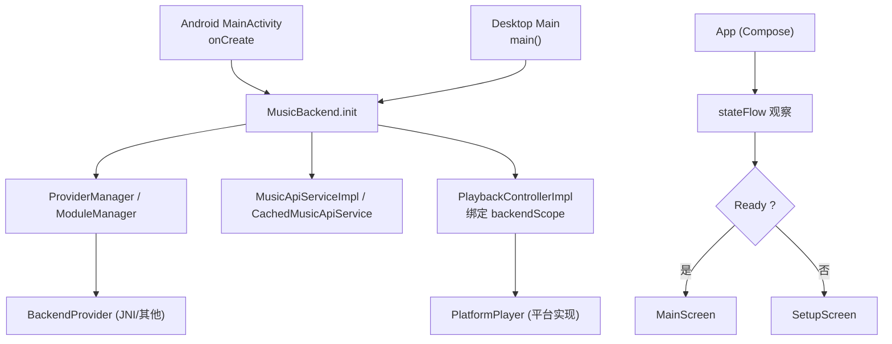
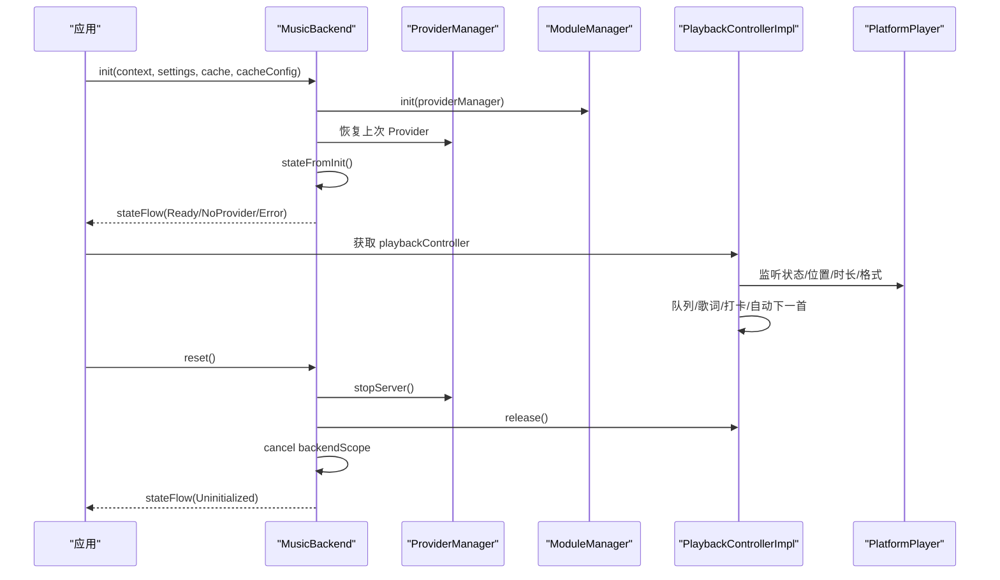
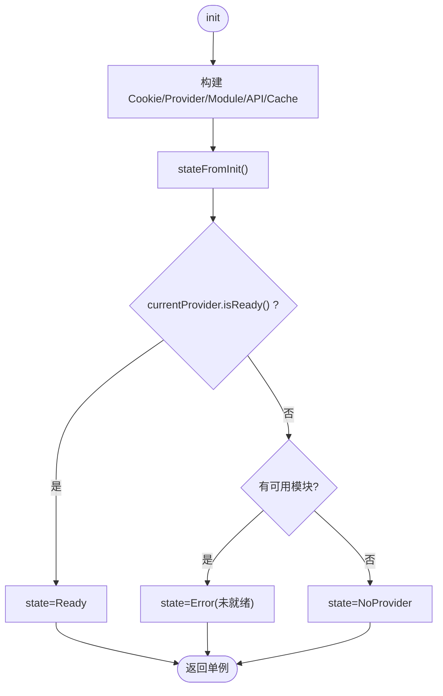
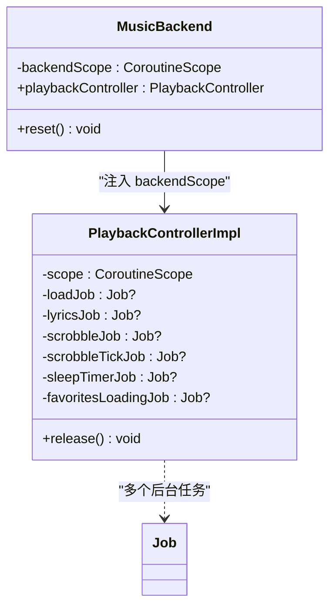
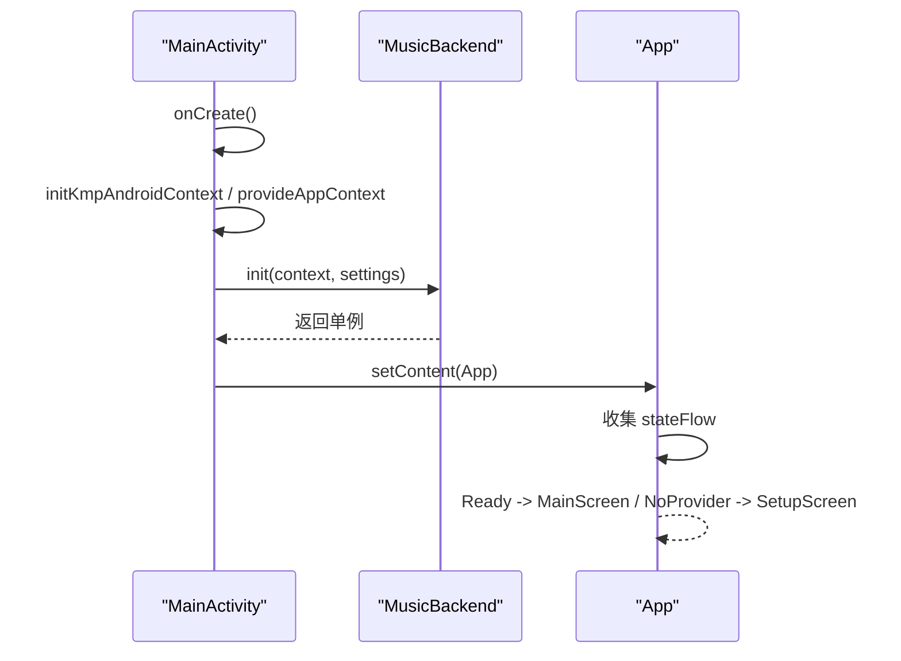
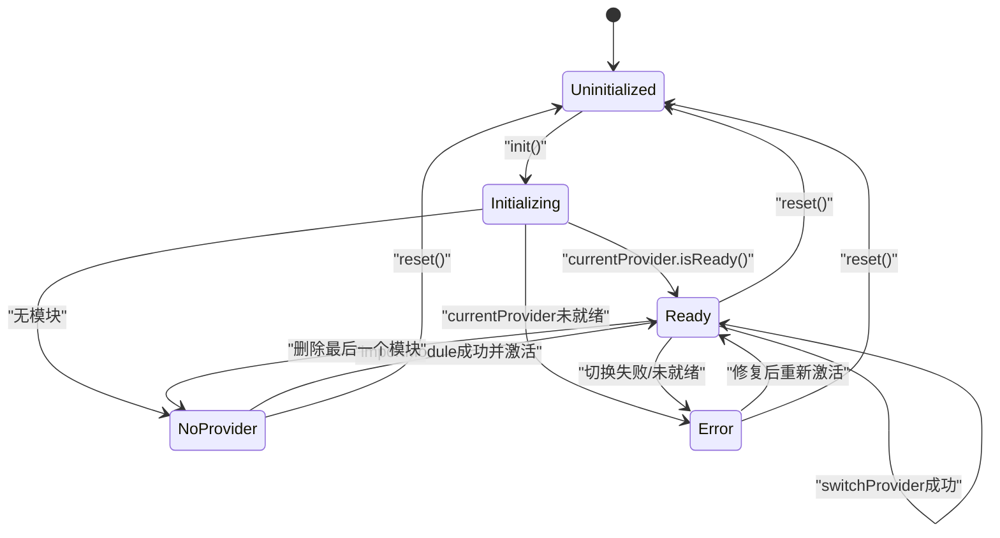
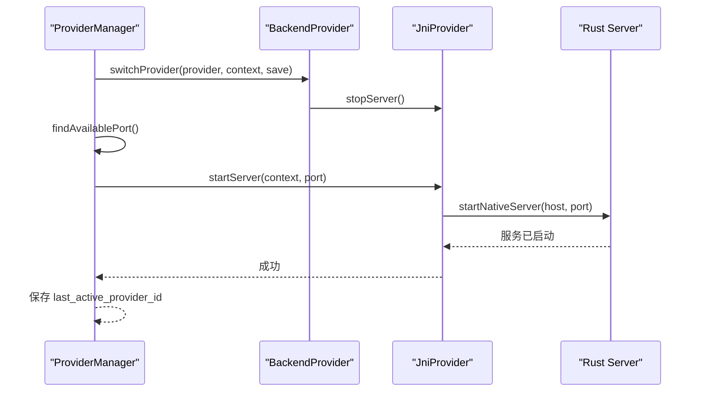
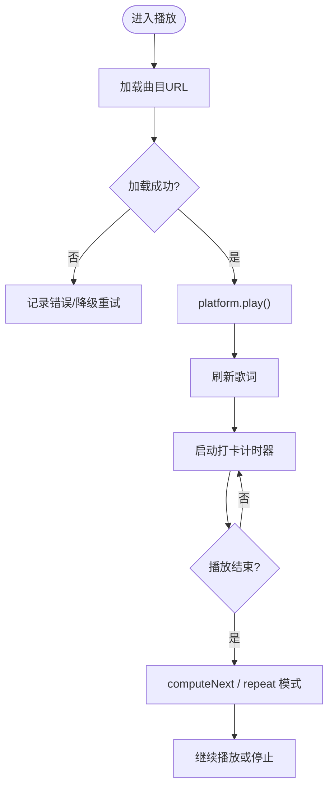
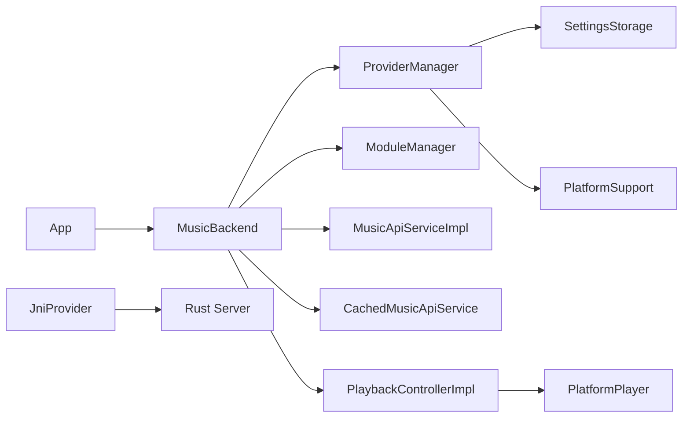

# 生命周期管理

<cite>
**本文引用的文件**
- [MusicBackend.kt](file://kmp-pro/src/commonMain/kotlin/cp/player/kmp/MusicBackend.kt)
- [BackendState.kt](file://kmp-pro/src/commonMain/kotlin/cp/player/kmp/BackendState.kt)
- [PlaybackControllerImpl.kt](file://kmp-pro/src/commonMain/kotlin/cp/player/kmp/playback/PlaybackControllerImpl.kt)
- [ProviderManager.kt](file://kmp-pro/src/commonMain/kotlin/cp/player/kmp/provider/ProviderManager.kt)
- [ModuleManager.kt](file://kmp-pro/src/commonMain/kotlin/cp/player/kmp/provider/ModuleManager.kt)
- [JniProvider.kt](file://kmp-pro/src/jvmMain/kotlin/cp/player/kmp/provider/JniProvider.kt)
- [MainActivity.kt](file://androidApp/src/main/kotlin/cp/player/app/MainActivity.kt)
- [Main.kt](file://app/src/desktopMain/kotlin/cp/player/app/Main.kt)
- [App.kt](file://app/src/commonMain/kotlin/cp/player/app/App.kt)
- [MusicApiServiceFactory.kt](file://kmp-pro/src/commonMain/kotlin/cp/player/kmp/api/MusicApiServiceFactory.kt)
</cite>

## 目录
1. [简介](#简介)
2. [项目结构](#项目结构)
3. [核心组件](#核心组件)
4. [架构总览](#架构总览)
5. [详细组件分析](#详细组件分析)
6. [依赖关系分析](#依赖关系分析)
7. [性能考量](#性能考量)
8. [故障排查指南](#故障排查指南)
9. [结论](#结论)
10. [附录](#附录)

## 简介
本文件面向后端生命周期管理系统，围绕 MusicBackend 的完整生命周期展开：初始化（init）、运行期（业务操作与状态流转）、销毁（reset）。重点说明协程作用域管理（SupervisorJob、取消策略、资源释放顺序），以及平台特定的生命周期适配（Android Application.onCreate 与 JVM main 启动流程）。同时给出生命周期事件监听与资源泄漏防护的最佳实践。

## 项目结构
- 后端统一入口：MusicBackend（commonMain）
- 状态机：BackendState（commonMain）
- 播放控制器：PlaybackControllerImpl（commonMain）
- Provider 管理：ProviderManager、ModuleManager（commonMain）
- JNI 提供者：JniProvider（jvmMain）
- 平台入口：Android MainActivity、Desktop Main（各自平台）
- 应用层：App（commonMain）观察 BackendState 并导航

图表来源
- [MainActivity.kt:15-37](file://androidApp/src/main/kotlin/cp/player/app/MainActivity.kt#L15-L37)
- [Main.kt:10-38](file://app/src/desktopMain/kotlin/cp/player/app/Main.kt#L10-L38)
- [MusicBackend.kt:330-367](file://kmp-pro/src/commonMain/kotlin/cp/player/kmp/MusicBackend.kt#L330-L367)
- [App.kt:37-69](file://app/src/commonMain/kotlin/cp/player/app/App.kt#L37-L69)

章节来源
- [MusicBackend.kt:330-367](file://kmp-pro/src/commonMain/kotlin/cp/player/kmp/MusicBackend.kt#L330-L367)
- [MainActivity.kt:15-37](file://androidApp/src/main/kotlin/cp/player/app/MainActivity.kt#L15-L37)
- [Main.kt:10-38](file://app/src/desktopMain/kotlin/cp/player/app/Main.kt#L10-L38)
- [App.kt:37-69](file://app/src/commonMain/kotlin/cp/player/app/App.kt#L37-L69)

## 核心组件
- MusicBackend：后端单例，负责生命周期、状态机、Provider 管理、API 访问、播放控制入口、健康监控。
- BackendState：描述从 Uninitialized → Initializing → Ready/NoProvider/Error 的状态机。
- PlaybackControllerImpl：队列、URL 解析、歌词抓取、打卡上报、自动下一首等播放逻辑；所有后台任务在其构造时注入的 CoroutineScope 中运行。
- ProviderManager：活跃 Provider 切换、端口分配、持久化选择、API 调用转发。
- ModuleManager：模块扫描、导入、删除、可用 Provider 列表。
- JniProvider：JNI 桥接，加载原生库、启动 Rust 服务、调用 API。

章节来源
- [MusicBackend.kt:30-72](file://kmp-pro/src/commonMain/kotlin/cp/player/kmp/MusicBackend.kt#L30-L72)
- [BackendState.kt:5-57](file://kmp-pro/src/commonMain/kotlin/cp/player/kmp/BackendState.kt#L5-L57)
- [PlaybackControllerImpl.kt:18-41](file://kmp-pro/src/commonMain/kotlin/cp/player/kmp/playback/PlaybackControllerImpl.kt#L18-L41)
- [ProviderManager.kt:15-35](file://kmp-pro/src/commonMain/kotlin/cp/player/kmp/provider/ProviderManager.kt#L15-L35)
- [ModuleManager.kt:10-22](file://kmp-pro/src/commonMain/kotlin/cp/player/kmp/provider/ModuleManager.kt#L10-L22)
- [JniProvider.kt:40-59](file://kmp-pro/src/jvmMain/kotlin/cp/player/kmp/provider/JniProvider.kt#L40-L59)

## 架构总览
MusicBackend 作为唯一后端入口，在 init 阶段完成：
- 创建 Cookie 存储、ProviderManager、ModuleManager
- 初始化 API 服务与缓存
- 计算终态（Ready/NoProvider/Error）
- 暴露 stateFlow 供 UI 观察

运行期：
- importModule/switchProvider/deleteModule 驱动状态机变化
- playbackController 通过 backendScope 管理播放相关协程
- ProviderManager 负责端口分配与服务启停

销毁期：
- reset 停止当前 Provider、释放播放器、取消 backendScope、重置状态并清空单例

图表来源
- [MusicBackend.kt:330-367](file://kmp-pro/src/commonMain/kotlin/cp/player/kmp/MusicBackend.kt#L330-L367)
- [MusicBackend.kt:261-269](file://kmp-pro/src/commonMain/kotlin/cp/player/kmp/MusicBackend.kt#L261-L269)
- [PlaybackControllerImpl.kt:90-127](file://kmp-pro/src/commonMain/kotlin/cp/player/kmp/playback/PlaybackControllerImpl.kt#L90-L127)
- [PlaybackControllerImpl.kt:487-491](file://kmp-pro/src/commonMain/kotlin/cp/player/kmp/playback/PlaybackControllerImpl.kt#L487-L491)

## 详细组件分析

### MusicBackend 生命周期
- 初始化（init）
  - 构建 CookieStorage、ProviderManager、ModuleManager
  - 初始化 MusicApiServiceImpl 与 CachedMusicApiService
  - 计算终态：根据 currentProvider.isReady() 与 availableProviders 决定 Ready/NoProvider/Error
- 运行期
  - importModule：导入后若无可用 Provider 或当前不可用则自动激活
  - switchProvider：校验 isReady，失败回退到旧状态
  - deleteModule：删除当前或最后一个时处理状态迁移
- 销毁（reset）
  - 停止当前 Provider
  - 释放播放器
  - 取消 backendScope
  - 重置状态为 Uninitialized
  - 清空单例实例

图表来源
- [MusicBackend.kt:330-367](file://kmp-pro/src/commonMain/kotlin/cp/player/kmp/MusicBackend.kt#L330-L367)
- [MusicBackend.kt:373-388](file://kmp-pro/src/commonMain/kotlin/cp/player/kmp/MusicBackend.kt#L373-L388)

章节来源
- [MusicBackend.kt:330-367](file://kmp-pro/src/commonMain/kotlin/cp/player/kmp/MusicBackend.kt#L330-L367)
- [MusicBackend.kt:373-388](file://kmp-pro/src/commonMain/kotlin/cp/player/kmp/MusicBackend.kt#L373-L388)
- [MusicBackend.kt:261-269](file://kmp-pro/src/commonMain/kotlin/cp/player/kmp/MusicBackend.kt#L261-L269)

### 协程作用域管理与取消策略
- backendScope
  - 使用 SupervisorJob + Dispatchers.Main，用于承载播放控制器内部协程
  - 在 reset 中显式 cancel，确保所有子协程被取消
- PlaybackControllerImpl
  - 接收外部 scope（backendScope），所有后台任务（队列解析、歌词、打卡、定时器等）都在该 scope 下运行
  - release 中取消所有 Job（scrobbleTickJob、scrobbleJob、lyricsJob、loadJob、sleepTimerJob、favoritesLoadingJob）并释放 PlatformPlayer
- 取消传播
  - SupervisorJob 保证子协程异常不会级联取消兄弟协程
  - 父 scope 取消会级联取消所有子协程，避免资源泄漏

图表来源
- [MusicBackend.kt:142-161](file://kmp-pro/src/commonMain/kotlin/cp/player/kmp/MusicBackend.kt#L142-L161)
- [PlaybackControllerImpl.kt:487-491](file://kmp-pro/src/commonMain/kotlin/cp/player/kmp/playback/PlaybackControllerImpl.kt#L487-L491)

章节来源
- [MusicBackend.kt:142-161](file://kmp-pro/src/commonMain/kotlin/cp/player/kmp/MusicBackend.kt#L142-L161)
- [PlaybackControllerImpl.kt:487-491](file://kmp-pro/src/commonMain/kotlin/cp/player/kmp/playback/PlaybackControllerImpl.kt#L487-L491)

### 平台特定生命周期适配
- Android
  - MainActivity.onCreate 中初始化 KMP Android Context、提供 AppContext、调用 MusicBackend.init，然后设置 Compose UI
- Desktop
  - Main.main 中调用 ensureBackendInitialized，内部执行 MusicBackend.init，再显示窗口

图表来源
- [MainActivity.kt:15-37](file://androidApp/src/main/kotlin/cp/player/app/MainActivity.kt#L15-L37)
- [Main.kt:10-38](file://app/src/desktopMain/kotlin/cp/player/app/Main.kt#L10-L38)
- [App.kt:37-69](file://app/src/commonMain/kotlin/cp/player/app/App.kt#L37-L69)

章节来源
- [MainActivity.kt:15-37](file://androidApp/src/main/kotlin/cp/player/app/MainActivity.kt#L15-L37)
- [Main.kt:10-38](file://app/src/desktopMain/kotlin/cp/player/app/Main.kt#L10-L38)
- [App.kt:37-69](file://app/src/commonMain/kotlin/cp/player/app/App.kt#L37-L69)

### 状态机与错误处理
- BackendState 定义 Uninitialized、Initializing、NoProvider、Ready(Error)、Error(message)
- MusicBackend.stateFromInit 根据 currentProvider 与 availableProviders 计算初始状态
- switchProviderInternal 捕获异常并转为 Error 状态，保留 cause
- extractProviderError 通过反射读取 JNI Provider 的错误信息，便于诊断

图表来源
- [BackendState.kt:5-57](file://kmp-pro/src/commonMain/kotlin/cp/player/kmp/BackendState.kt#L5-L57)
- [MusicBackend.kt:373-388](file://kmp-pro/src/commonMain/kotlin/cp/player/kmp/MusicBackend.kt#L373-L388)
- [MusicBackend.kt:273-293](file://kmp-pro/src/commonMain/kotlin/cp/player/kmp/MusicBackend.kt#L273-L293)

章节来源
- [BackendState.kt:5-57](file://kmp-pro/src/commonMain/kotlin/cp/player/kmp/BackendState.kt#L5-L57)
- [MusicBackend.kt:273-293](file://kmp-pro/src/commonMain/kotlin/cp/player/kmp/MusicBackend.kt#L273-L293)
- [MusicBackend.kt:373-388](file://kmp-pro/src/commonMain/kotlin/cp/player/kmp/MusicBackend.kt#L373-L388)

### Provider 管理与 JNI 生命周期
- ProviderManager
  - startServer：查找可用端口并调用 provider.startServer
  - switchProvider：先停止旧 Provider，再启动新 Provider，失败回滚
  - restoreLastProvider：从 SettingsStorage 恢复上次选择的 Provider
- JniProvider
  - startServer：加载原生库，调用 Java_cp_player_kmp_provider_JniProvider_startNativeServer 启动 Rust 服务
  - stopServer：标记未加载，防止后续调用
  - callApi：在未加载时返回错误 JSON

图表来源
- [ProviderManager.kt:65-109](file://kmp-pro/src/commonMain/kotlin/cp/player/kmp/provider/ProviderManager.kt#L65-L109)
- [JniProvider.kt:40-59](file://kmp-pro/src/jvmMain/kotlin/cp/player/kmp/provider/JniProvider.kt#L40-L59)

章节来源
- [ProviderManager.kt:65-109](file://kmp-pro/src/commonMain/kotlin/cp/player/kmp/provider/ProviderManager.kt#L65-L109)
- [JniProvider.kt:40-59](file://kmp-pro/src/jvmMain/kotlin/cp/player/kmp/provider/JniProvider.kt#L40-L59)

### 播放控制器与资源释放
- PlaybackControllerImpl
  - observePlatform：将平台状态/位置/时长/格式折叠进 UI 状态
  - playCurrent：加载 URL、设置头、播放、拉取歌词
  - onTrackEnded：按重复模式自动下一首或结束
  - release：取消所有 Job 并释放 PlatformPlayer
- 与 MusicBackend 的关系
  - 通过 backendScope 统一管理生命周期
  - reset 中调用 release，确保播放资源释放

图表来源
- [PlaybackControllerImpl.kt:495-556](file://kmp-pro/src/commonMain/kotlin/cp/player/kmp/playback/PlaybackControllerImpl.kt#L495-L556)
- [PlaybackControllerImpl.kt:577-602](file://kmp-pro/src/commonMain/kotlin/cp/player/kmp/playback/PlaybackControllerImpl.kt#L577-L602)
- [PlaybackControllerImpl.kt:721-753](file://kmp-pro/src/commonMain/kotlin/cp/player/kmp/playback/PlaybackControllerImpl.kt#L721-L753)
- [PlaybackControllerImpl.kt:487-491](file://kmp-pro/src/commonMain/kotlin/cp/player/kmp/playback/PlaybackControllerImpl.kt#L487-L491)

章节来源
- [PlaybackControllerImpl.kt:495-556](file://kmp-pro/src/commonMain/kotlin/cp/player/kmp/playback/PlaybackControllerImpl.kt#L495-L556)
- [PlaybackControllerImpl.kt:577-602](file://kmp-pro/src/commonMain/kotlin/cp/player/kmp/playback/PlaybackControllerImpl.kt#L577-L602)
- [PlaybackControllerImpl.kt:721-753](file://kmp-pro/src/commonMain/kotlin/cp/player/kmp/playback/PlaybackControllerImpl.kt#L721-L753)
- [PlaybackControllerImpl.kt:487-491](file://kmp-pro/src/commonMain/kotlin/cp/player/kmp/playback/PlaybackControllerImpl.kt#L487-L491)

## 依赖关系分析
- MusicBackend 依赖：
  - ProviderManager：活跃 Provider 切换与持久化
  - ModuleManager：模块扫描与导入
  - MusicApiServiceImpl/CachedMusicApiService：云音乐 API 访问与缓存
  - PlaybackControllerImpl：播放控制
- ProviderManager 依赖：
  - SettingsStorage：持久化 last_active_provider_id
  - PlatformSupport：端口检测
- JniProvider 依赖：
  - 原生 Rust 服务：start_server
- App 依赖：
  - MusicBackend.stateFlow：UI 导航与渲染

图表来源
- [MusicBackend.kt:330-367](file://kmp-pro/src/commonMain/kotlin/cp/player/kmp/MusicBackend.kt#L330-L367)
- [ProviderManager.kt:65-109](file://kmp-pro/src/commonMain/kotlin/cp/player/kmp/provider/ProviderManager.kt#L65-L109)
- [JniProvider.kt:40-59](file://kmp-pro/src/jvmMain/kotlin/cp/player/kmp/provider/JniProvider.kt#L40-L59)
- [App.kt:37-69](file://app/src/commonMain/kotlin/cp/player/app/App.kt#L37-L69)

章节来源
- [MusicBackend.kt:330-367](file://kmp-pro/src/commonMain/kotlin/cp/player/kmp/MusicBackend.kt#L330-L367)
- [ProviderManager.kt:65-109](file://kmp-pro/src/commonMain/kotlin/cp/player/kmp/provider/ProviderManager.kt#L65-L109)
- [JniProvider.kt:40-59](file://kmp-pro/src/jvmMain/kotlin/cp/player/kmp/provider/JniProvider.kt#L40-L59)
- [App.kt:37-69](file://app/src/commonMain/kotlin/cp/player/app/App.kt#L37-L69)

## 性能考量
- 端口分配：ProviderManager 支持端口回退，避免冲突
- 懒加载：播放控制器对队列条目进行懒解析，减少不必要请求
- 降级策略：播放失败时自动降级音质重试，提升成功率
- 缓存：CachedMusicApiService 减少重复网络请求
- 协程隔离：SupervisorJob 避免单个任务失败影响整体

[本节为通用指导，不直接分析具体文件]

## 故障排查指南
- 初始化失败
  - 检查 stateFlow 是否为 Error，查看 extractProviderError 提供的消息
  - 确认 ModuleManager 扫描到的模块是否可加载
- Provider 未就绪
  - 检查 JniProvider 是否成功加载原生库并启动 Rust 服务
  - 确认端口未被占用，ProviderManager 是否能找到可用端口
- 播放失败
  - 检查 URL 获取结果与 headers（Cookie）是否正确注入
  - 关注降级重试逻辑与错误信息
- 资源泄漏
  - 确保 reset 被调用，释放播放器与取消 backendScope
  - 验证 PlaybackControllerImpl.release 是否取消所有 Job

章节来源
- [MusicBackend.kt:300-310](file://kmp-pro/src/commonMain/kotlin/cp/player/kmp/MusicBackend.kt#L300-L310)
- [ProviderManager.kt:65-109](file://kmp-pro/src/commonMain/kotlin/cp/player/kmp/provider/ProviderManager.kt#L65-L109)
- [PlaybackControllerImpl.kt:487-491](file://kmp-pro/src/commonMain/kotlin/cp/player/kmp/playback/PlaybackControllerImpl.kt#L487-L491)

## 结论
MusicBackend 通过清晰的生命周期与状态机管理后端初始化、运行与销毁。借助 SupervisorJob 与统一的 backendScope，协程取消与资源释放有序可控。平台入口（Android/Desktop）在合适的时机调用 init，UI 通过 stateFlow 响应状态变化。ProviderManager 与 JniProvider 协作完成模块加载与服务启停。遵循本文最佳实践可有效避免资源泄漏与状态不一致问题。

## 附录
- 全局工厂兼容层：MusicApiServiceFactory.init 委托给 MusicBackend.init，reset 委托给 backend.reset
- 建议：在测试或热重载场景调用 reset，确保状态与资源完全清理

章节来源
- [MusicApiServiceFactory.kt:33-57](file://kmp-pro/src/commonMain/kotlin/cp/player/kmp/api/MusicApiServiceFactory.kt#L33-L57)