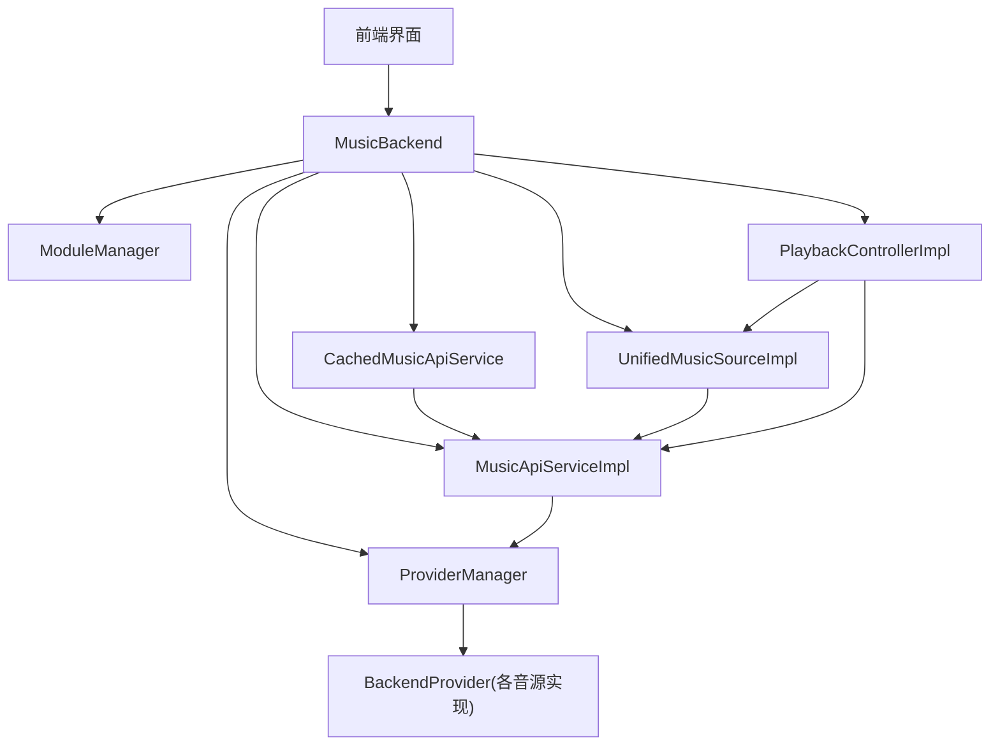
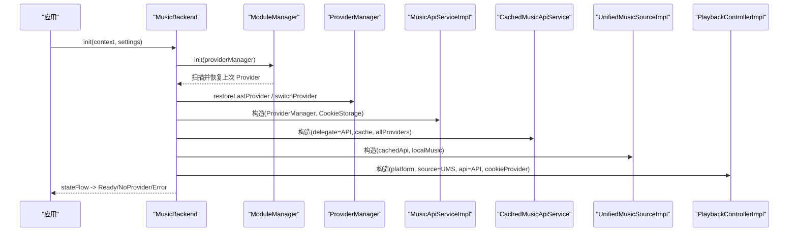
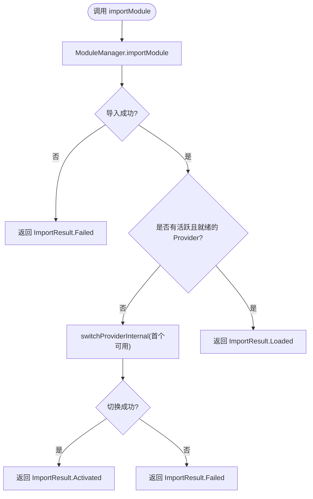
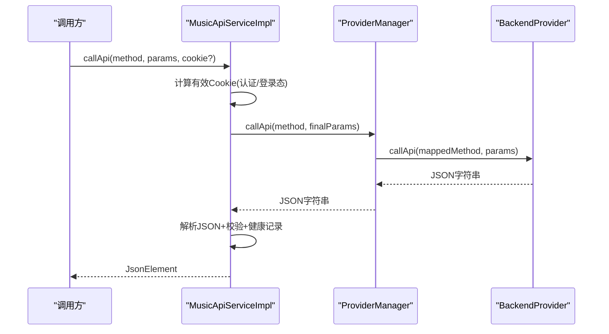
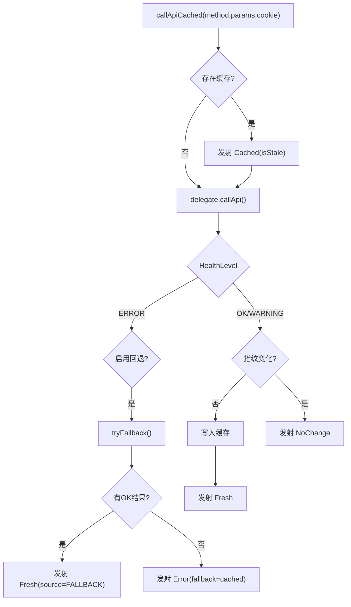
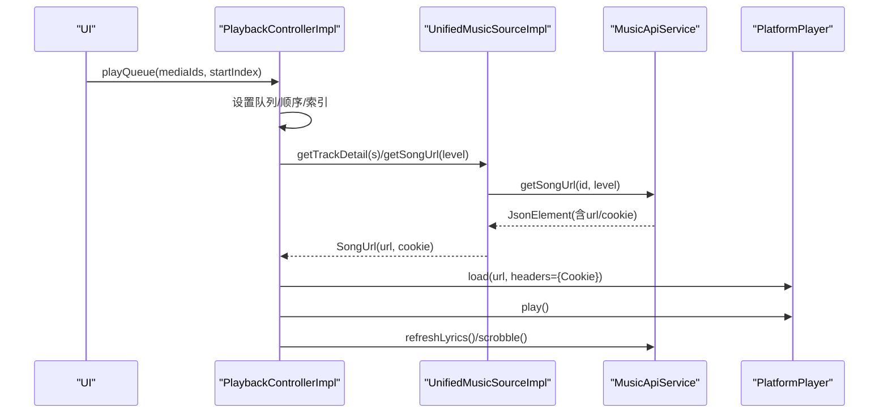
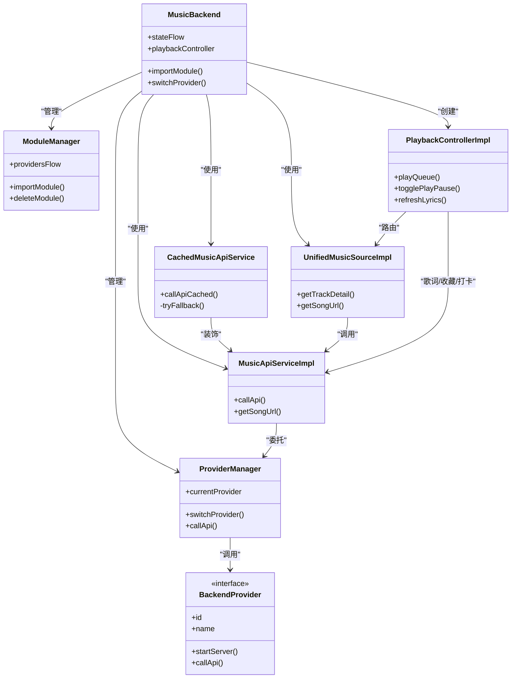

# 组件协调机制

<cite>
**本文引用的文件**
- [MusicBackend.kt](file://kmp-pro/src/commonMain/kotlin/cp/player/kmp/MusicBackend.kt)
- [ProviderManager.kt](file://kmp-pro/src/commonMain/kotlin/cp/player/kmp/provider/ProviderManager.kt)
- [ModuleManager.kt](file://kmp-pro/src/commonMain/kotlin/cp/player/kmp/provider/ModuleManager.kt)
- [MusicApiServiceImpl.kt](file://kmp-pro/src/commonMain/kotlin/cp/player/kmp/api/MusicApiServiceImpl.kt)
- [CachedMusicApiService.kt](file://kmp-pro/src/commonMain/kotlin/cp/player/kmp/cache/CachedMusicApiService.kt)
- [PlaybackController.kt](file://kmp-pro/src/commonMain/kotlin/cp/player/kmp/playback/PlaybackController.kt)
- [PlaybackControllerImpl.kt](file://kmp-pro/src/commonMain/kotlin/cp/player/kmp/playback/PlaybackControllerImpl.kt)
- [BackendProvider.kt](file://kmp-pro/src/commonMain/kotlin/cp/player/kmp/provider/BackendProvider.kt)
- [UnifiedMusicSourceImpl.kt](file://kmp-pro/src/commonMain/kotlin/cp/player/kmp/music/UnifiedMusicSourceImpl.kt)
- [BackendState.kt](file://kmp-pro/src/commonMain/kotlin/cp/player/kmp/BackendState.kt)
</cite>

## 目录
1. [简介](#简介)
2. [项目结构](#项目结构)
3. [核心组件](#核心组件)
4. [架构总览](#架构总览)
5. [详细组件分析](#详细组件分析)
6. [依赖关系分析](#依赖关系分析)
7. [性能考量](#性能考量)
8. [故障排查指南](#故障排查指南)
9. [结论](#结论)

## 简介
本文档聚焦于后端组件协调机制，系统性说明 MusicBackend 如何编排 ProviderManager（Provider 生命周期管理）、ModuleManager（模块加载卸载）、MusicApiServiceImpl（网络请求处理）、CachedMusicApiService（缓存策略）与 PlaybackController（播放控制）。重点阐述：
- 组件间的依赖关系与数据流向
- Provider 切换时的状态同步
- API 调用时的上下文传递（Cookie、Provider 路由）
- 播放控制时的数据源路由（统一媒体 ID）
- 组件间通信模式与错误传播机制

## 项目结构
KMP 后端位于 kmp-pro 模块中，采用分层组织：
- provider：Provider 抽象与加载/切换管理
- api：统一 API 实现与健康监控
- cache：带缓存与回退的 API 封装
- music：统一媒体 ID 与数据源路由
- playback：播放控制器与平台播放器适配
- 顶层：MusicBackend 作为统一入口与状态机

图表来源
- [MusicBackend.kt:73-161](file://kmp-pro/src/commonMain/kotlin/cp/player/kmp/MusicBackend.kt#L73-L161)
- [ProviderManager.kt:31-145](file://kmp-pro/src/commonMain/kotlin/cp/player/kmp/provider/ProviderManager.kt#L31-L145)
- [ModuleManager.kt:19-137](file://kmp-pro/src/commonMain/kotlin/cp/player/kmp/provider/ModuleManager.kt#L19-L137)
- [MusicApiServiceImpl.kt:28-101](file://kmp-pro/src/commonMain/kotlin/cp/player/kmp/api/MusicApiServiceImpl.kt#L28-L101)
- [CachedMusicApiService.kt:46-88](file://kmp-pro/src/commonMain/kotlin/cp/player/kmp/cache/CachedMusicApiService.kt#L46-L88)
- [UnifiedMusicSourceImpl.kt:15-122](file://kmp-pro/src/commonMain/kotlin/cp/player/kmp/music/UnifiedMusicSourceImpl.kt#L15-L122)
- [PlaybackControllerImpl.kt:35-44](file://kmp-pro/src/commonMain/kotlin/cp/player/kmp/playback/PlaybackControllerImpl.kt#L35-L44)

章节来源
- [MusicBackend.kt:30-161](file://kmp-pro/src/commonMain/kotlin/cp/player/kmp/MusicBackend.kt#L30-L161)
- [BackendState.kt:25-57](file://kmp-pro/src/commonMain/kotlin/cp/player/kmp/BackendState.kt#L25-L57)

## 核心组件
- MusicBackend：统一入口，负责初始化、状态机、Provider 导入/切换、播放控制器装配、健康监控暴露。
- ModuleManager：扫描并加载模块（manifest + 入口），维护已加载 Provider 列表，支持导入/删除。
- ProviderManager：管理当前活跃 Provider，启动/停止服务，持久化最近选择，提供 callApi 委托。
- MusicApiServiceImpl：统一 API 实现，注入 Cookie，响应校验与健康记录，URL 方法容灾回退。
- CachedMusicApiService：对 API 进行缓存包装，返回 Flow，支持指纹比对、多 Provider 容灾回退。
- UnifiedMusicSourceImpl：按 CPMediaId 路由到本地或云端，统一 TrackSummary/SongUrl 模型。
- PlaybackControllerImpl：队列、播放控制、歌词、收藏、音质降级、Scrobble 上报等。

章节来源
- [MusicBackend.kt:73-161](file://kmp-pro/src/commonMain/kotlin/cp/player/kmp/MusicBackend.kt#L73-L161)
- [ModuleManager.kt:19-137](file://kmp-pro/src/commonMain/kotlin/cp/player/kmp/provider/ModuleManager.kt#L19-L137)
- [ProviderManager.kt:31-145](file://kmp-pro/src/commonMain/kotlin/cp/player/kmp/provider/ProviderManager.kt#L31-L145)
- [MusicApiServiceImpl.kt:28-101](file://kmp-pro/src/commonMain/kotlin/cp/player/kmp/api/MusicApiServiceImpl.kt#L28-L101)
- [CachedMusicApiService.kt:46-88](file://kmp-pro/src/commonMain/kotlin/cp/player/kmp/cache/CachedMusicApiService.kt#L46-L88)
- [UnifiedMusicSourceImpl.kt:15-122](file://kmp-pro/src/commonMain/kotlin/cp/player/kmp/music/UnifiedMusicSourceImpl.kt#L15-L122)
- [PlaybackControllerImpl.kt:35-44](file://kmp-pro/src/commonMain/kotlin/cp/player/kmp/playback/PlaybackControllerImpl.kt#L35-L44)

## 架构总览
MusicBackend 在 init 时组装各组件：创建 ProviderManager、ModuleManager、MusicApiServiceImpl、CachedMusicApiService，并构建统一数据源与播放控制器。状态通过 StateFlow 暴露给 UI；Provider 切换会更新状态流并触发服务启停；API 调用经 ProviderManager 路由到当前 Provider；播放控制通过 UnifiedMusicSourceImpl 路由到本地或云端。

图表来源
- [MusicBackend.kt:330-367](file://kmp-pro/src/commonMain/kotlin/cp/player/kmp/MusicBackend.kt#L330-L367)
- [ModuleManager.kt:38-48](file://kmp-pro/src/commonMain/kotlin/cp/player/kmp/provider/ModuleManager.kt#L38-L48)
- [ProviderManager.kt:117-121](file://kmp-pro/src/commonMain/kotlin/cp/player/kmp/provider/ProviderManager.kt#L117-L121)
- [MusicApiServiceImpl.kt:28-31](file://kmp-pro/src/commonMain/kotlin/cp/player/kmp/api/MusicApiServiceImpl.kt#L28-L31)
- [CachedMusicApiService.kt:46-52](file://kmp-pro/src/commonMain/kotlin/cp/player/kmp/cache/CachedMusicApiService.kt#L46-L52)
- [UnifiedMusicSourceImpl.kt:15-18](file://kmp-pro/src/commonMain/kotlin/cp/player/kmp/music/UnifiedMusicSourceImpl.kt#L15-L18)
- [PlaybackControllerImpl.kt:35-41](file://kmp-pro/src/commonMain/kotlin/cp/player/kmp/playback/PlaybackControllerImpl.kt#L35-L41)

## 详细组件分析

### MusicBackend：统一入口与状态机
- 职责：
  - 生命周期与状态机：Uninitialized → Initializing → Ready/NoProvider/Error，通过 stateFlow 暴露。
  - Provider 管理：importModule、switchProvider、deleteModule，自动激活首个可用 Provider。
  - 数据访问：musicApi/cachedApi（兼容层），unifiedSource（统一媒体 ID）。
  - 播放控制：playbackController 惰性创建，绑定 PlatformPlayer、UnifiedMusicSource、MusicApiService。
  - 健康监控：暴露 HealthMonitor。
- 关键流程：
  - importModule：解压→解析 manifest→加载 Provider→若无活跃则自动激活。
  - switchProviderInternal：调用 ProviderManager.switchProvider，成功则置 Ready，失败则 Error。
  - reset：释放播放控制器、取消协程、重置状态。

图表来源
- [MusicBackend.kt:189-204](file://kmp-pro/src/commonMain/kotlin/cp/player/kmp/MusicBackend.kt#L189-L204)
- [MusicBackend.kt:273-293](file://kmp-pro/src/commonMain/kotlin/cp/player/kmp/MusicBackend.kt#L273-L293)

章节来源
- [MusicBackend.kt:73-161](file://kmp-pro/src/commonMain/kotlin/cp/player/kmp/MusicBackend.kt#L73-L161)
- [MusicBackend.kt:189-248](file://kmp-pro/src/commonMain/kotlin/cp/player/kmp/MusicBackend.kt#L189-L248)
- [MusicBackend.kt:273-310](file://kmp-pro/src/commonMain/kotlin/cp/player/kmp/MusicBackend.kt#L273-L310)
- [BackendState.kt:25-57](file://kmp-pro/src/commonMain/kotlin/cp/player/kmp/BackendState.kt#L25-L57)

### ModuleManager：模块加载与卸载
- 职责：
  - 扫描 modulesDir，加载所有子目录模块（manifest.json + 入口）。
  - 导入 zip 包：解压→校验 manifest→移动到目标目录→加载。
  - 删除模块：删除目录并从内存移除，更新 providersFlow。
- 关键点：
  - 首次 init 时尝试恢复上次 Provider；若无则自动选择第一个。
  - 加载失败时记录 lastLoadError，便于 UI 诊断。

章节来源
- [ModuleManager.kt:19-137](file://kmp-pro/src/commonMain/kotlin/cp/player/kmp/provider/ModuleManager.kt#L19-L137)

### ProviderManager：Provider 生命周期与路由
- 职责：
  - 管理 currentProvider，切换时停止旧服务、启动新服务（端口探测）。
  - 持久化最近选择的 Provider ID。
  - 提供 callApi(method, params) 委托到当前 Provider，处理 unsupported 映射。
- 关键点：
  - startServer/findAvailablePort：避免端口冲突。
  - switchProvider：原子性更新 currentProvider 与 StateFlow，通知监听器。
  - restoreLastProvider：重启后恢复用户选择。

章节来源
- [ProviderManager.kt:31-145](file://kmp-pro/src/commonMain/kotlin/cp/player/kmp/provider/ProviderManager.kt#L31-L145)
- [BackendProvider.kt:24-96](file://kmp-pro/src/commonMain/kotlin/cp/player/kmp/provider/BackendProvider.kt#L24-L96)

### MusicApiServiceImpl：网络请求处理与健康监控
- 职责：
  - 统一 API 实现，按 method 参数调用 ProviderManager.callApi。
  - 自动注入 Cookie（区分认证接口与只读查询）。
  - 响应校验：检查 code、期望字段、空数组/对象、慢响应、URL 字段。
  - 健康记录：记录每次调用的级别（OK/WARNING/ERROR）与警告项。
  - URL 方法容灾：优先 302 版本，失败回退到 v1。
- 关键点：
  - callWithAllProviders：遍历所有 Provider 重试，标记 wasFallback。
  - validateResponse：集中校验逻辑，生成 ResponseWarning。

图表来源
- [MusicApiServiceImpl.kt:35-101](file://kmp-pro/src/commonMain/kotlin/cp/player/kmp/api/MusicApiServiceImpl.kt#L35-L101)
- [ProviderManager.kt:129-141](file://kmp-pro/src/commonMain/kotlin/cp/player/kmp/provider/ProviderManager.kt#L129-L141)

章节来源
- [MusicApiServiceImpl.kt:28-101](file://kmp-pro/src/commonMain/kotlin/cp/player/kmp/api/MusicApiServiceImpl.kt#L28-L101)
- [MusicApiServiceImpl.kt:189-221](file://kmp-pro/src/commonMain/kotlin/cp/player/kmp/api/MusicApiServiceImpl.kt#L189-L221)
- [MusicApiServiceImpl.kt:437-479](file://kmp-pro/src/commonMain/kotlin/cp/player/kmp/api/MusicApiServiceImpl.kt#L437-L479)
- [MusicApiServiceImpl.kt:481-658](file://kmp-pro/src/commonMain/kotlin/cp/player/kmp/api/MusicApiServiceImpl.kt#L481-L658)

### CachedMusicApiService：缓存策略与回退
- 职责：
  - 对 API 调用返回 Flow：先发射缓存（可能 stale），后台拉取新鲜数据。
  - 指纹比对：与缓存相同且不处于 ERROR 级别则 NoChange。
  - 健康集成：ERROR 级别触发多 Provider 容灾回退；WARNING 附带 warnings。
  - 仅幂等读类接口缓存，写/动作直通网络。
- 关键点：
  - tryFallback：跳过当前失败 Provider，依次尝试其他 Provider。
  - collectRecentWarnings：从 HealthMonitor 获取最近告警。

图表来源
- [CachedMusicApiService.kt:60-88](file://kmp-pro/src/commonMain/kotlin/cp/player/kmp/cache/CachedMusicApiService.kt#L60-L88)
- [CachedMusicApiService.kt:90-140](file://kmp-pro/src/commonMain/kotlin/cp/player/kmp/cache/CachedMusicApiService.kt#L90-L140)
- [CachedMusicApiService.kt:149-180](file://kmp-pro/src/commonMain/kotlin/cp/player/kmp/cache/CachedMusicApiService.kt#L149-L180)

章节来源
- [CachedMusicApiService.kt:46-88](file://kmp-pro/src/commonMain/kotlin/cp/player/kmp/cache/CachedMusicApiService.kt#L46-L88)
- [CachedMusicApiService.kt:90-140](file://kmp-pro/src/commonMain/kotlin/cp/player/kmp/cache/CachedMusicApiService.kt#L90-L140)
- [CachedMusicApiService.kt:149-219](file://kmp-pro/src/commonMain/kotlin/cp/player/kmp/cache/CachedMusicApiService.kt#L149-L219)

### PlaybackController：播放控制与数据源路由
- 职责：
  - 队列管理（追加、移除、重排、随机/循环模式）。
  - 通过 UnifiedMusicSourceImpl 获取 TrackSummary 与 SongUrl。
  - 平台播放器适配：加载、播放、暂停、seek、音量。
  - 歌词抓取与高亮、收藏状态同步、Scrobble 上报、音质降级。
- 关键点：
  - playCurrent：懒解析 summary，获取 URL，注入 Cookie 头，失败时降级 standard。
  - onTrackEnded：根据 RepeatMode 决定下一首或停止。
  - refreshLyrics：按 providerId 判断是否本地（无歌词）。

图表来源
- [PlaybackControllerImpl.kt:144-158](file://kmp-pro/src/commonMain/kotlin/cp/player/kmp/playback/PlaybackControllerImpl.kt#L144-L158)
- [PlaybackControllerImpl.kt:495-556](file://kmp-pro/src/commonMain/kotlin/cp/player/kmp/playback/PlaybackControllerImpl.kt#L495-L556)
- [UnifiedMusicSourceImpl.kt:100-118](file://kmp-pro/src/commonMain/kotlin/cp/player/kmp/music/UnifiedMusicSourceImpl.kt#L100-L118)
- [MusicApiServiceImpl.kt:189-221](file://kmp-pro/src/commonMain/kotlin/cp/player/kmp/api/MusicApiServiceImpl.kt#L189-L221)

章节来源
- [PlaybackController.kt:6-106](file://kmp-pro/src/commonMain/kotlin/cp/player/kmp/playback/PlaybackController.kt#L6-L106)
- [PlaybackControllerImpl.kt:35-44](file://kmp-pro/src/commonMain/kotlin/cp/player/kmp/playback/PlaybackControllerImpl.kt#L35-L44)
- [PlaybackControllerImpl.kt:495-556](file://kmp-pro/src/commonMain/kotlin/cp/player/kmp/playback/PlaybackControllerImpl.kt#L495-L556)
- [UnifiedMusicSourceImpl.kt:15-122](file://kmp-pro/src/commonMain/kotlin/cp/player/kmp/music/UnifiedMusicSourceImpl.kt#L15-L122)

## 依赖关系分析
- MusicBackend 依赖：
  - ProviderManager：切换/恢复 Provider，持久化选择。
  - ModuleManager：模块导入/删除，Provider 列表。
  - MusicApiServiceImpl：云侧 API 调用。
  - CachedMusicApiService：缓存与回退。
  - UnifiedMusicSourceImpl：统一媒体 ID 路由。
  - PlaybackControllerImpl：播放控制。
- ProviderManager 依赖：
  - BackendProvider：startServer/stopServer/callApi/isReady。
  - SettingsStorage：持久化 last_active_provider_id。
- MusicApiServiceImpl 依赖：
  - ProviderManager：callApi 委托。
  - HealthMonitor：健康记录。
- CachedMusicApiService 依赖：
  - MusicApiService：底层调用。
  - ApiCache：缓存读写。
  - ProviderManager/allProviders：容灾回退。
- UnifiedMusicSourceImpl 依赖：
  - MusicApiService：云端数据。
  - LocalMusicSource：本地数据。
- PlaybackControllerImpl 依赖：
  - UnifiedMusicSourceImpl：曲目详情与 URL。
  - MusicApiService：歌词、收藏、打卡。
  - PlatformPlayer：实际播放。

图表来源
- [MusicBackend.kt:73-161](file://kmp-pro/src/commonMain/kotlin/cp/player/kmp/MusicBackend.kt#L73-L161)
- [ProviderManager.kt:31-145](file://kmp-pro/src/commonMain/kotlin/cp/player/kmp/provider/ProviderManager.kt#L31-L145)
- [ModuleManager.kt:19-137](file://kmp-pro/src/commonMain/kotlin/cp/player/kmp/provider/ModuleManager.kt#L19-L137)
- [MusicApiServiceImpl.kt:28-101](file://kmp-pro/src/commonMain/kotlin/cp/player/kmp/api/MusicApiServiceImpl.kt#L28-L101)
- [CachedMusicApiService.kt:46-88](file://kmp-pro/src/commonMain/kotlin/cp/player/kmp/cache/CachedMusicApiService.kt#L46-L88)
- [UnifiedMusicSourceImpl.kt:15-122](file://kmp-pro/src/commonMain/kotlin/cp/player/kmp/music/UnifiedMusicSourceImpl.kt#L15-L122)
- [PlaybackControllerImpl.kt:35-44](file://kmp-pro/src/commonMain/kotlin/cp/player/kmp/playback/PlaybackControllerImpl.kt#L35-L44)
- [BackendProvider.kt:24-96](file://kmp-pro/src/commonMain/kotlin/cp/player/kmp/provider/BackendProvider.kt#L24-L96)

## 性能考量
- 缓存策略：
  - 仅对幂等读类接口缓存，减少重复网络请求。
  - 指纹比对避免无效刷新，降低带宽与 CPU。
- 容灾回退：
  - 当健康级别为 ERROR 时，依次尝试其他 Provider，提升可用性。
- 端口探测：
  - ProviderManager 自动寻找可用端口，避免冲突导致启动失败。
- 懒解析与批量：
  - PlaybackControllerImpl 对队列条目懒解析，批量获取详情，减少请求次数。
- 音质降级：
  - 播放失败时自动降级到 standard，提高兼容性。

[本节为通用指导，不直接分析具体文件]

## 故障排查指南
- Provider 切换失败：
  - 检查 isReady() 与 startServer 是否成功；查看 lastLoadError。
  - 确认端口未被占用；观察 ProviderManager 日志。
- API 调用异常：
  - 查看 HealthMonitor 记录，定位 code/msg/expected field。
  - 检查 Cookie 是否正确注入（认证接口 vs 只读接口）。
  - 对于 URL 方法，确认 redirectUrl/url 字段是否存在。
- 缓存未命中：
  - 确认方法是否在可缓存白名单；检查指纹是否变化。
  - 若健康级别为 ERROR，可能被回退覆盖。
- 播放失败：
  - 检查 UnifiedMusicSourceImpl 返回的 URL 是否有效。
  - 观察是否触发音质降级；确认 Cookie 头是否正确传递。
  - 查看 PlatformPlayer 错误信息。

章节来源
- [MusicBackend.kt:273-310](file://kmp-pro/src/commonMain/kotlin/cp/player/kmp/MusicBackend.kt#L273-L310)
- [ModuleManager.kt:88-117](file://kmp-pro/src/commonMain/kotlin/cp/player/kmp/provider/ModuleManager.kt#L88-L117)
- [MusicApiServiceImpl.kt:481-658](file://kmp-pro/src/commonMain/kotlin/cp/player/kmp/api/MusicApiServiceImpl.kt#L481-L658)
- [CachedMusicApiService.kt:90-140](file://kmp-pro/src/commonMain/kotlin/cp/player/kmp/cache/CachedMusicApiService.kt#L90-L140)
- [PlaybackControllerImpl.kt:540-575](file://kmp-pro/src/commonMain/kotlin/cp/player/kmp/playback/PlaybackControllerImpl.kt#L540-L575)

## 结论
MusicBackend 作为统一入口，将 Provider 管理、模块加载、API 调用、缓存策略与播放控制有机整合，形成清晰的数据流与错误传播路径。通过 ProviderManager 的生命周期管理与 Cookie 隔离，确保多音源环境下的账号独立与稳定切换；MusicApiServiceImpl 与 CachedMusicApiService 共同保障网络调用的健壮性与性能；UnifiedMusicSourceImpl 与 PlaybackControllerImpl 实现播放控制与数据源路由的解耦。整体设计具备良好的可扩展性与容错能力，适合跨平台音乐播放场景。

[本节为总结，不直接分析具体文件]