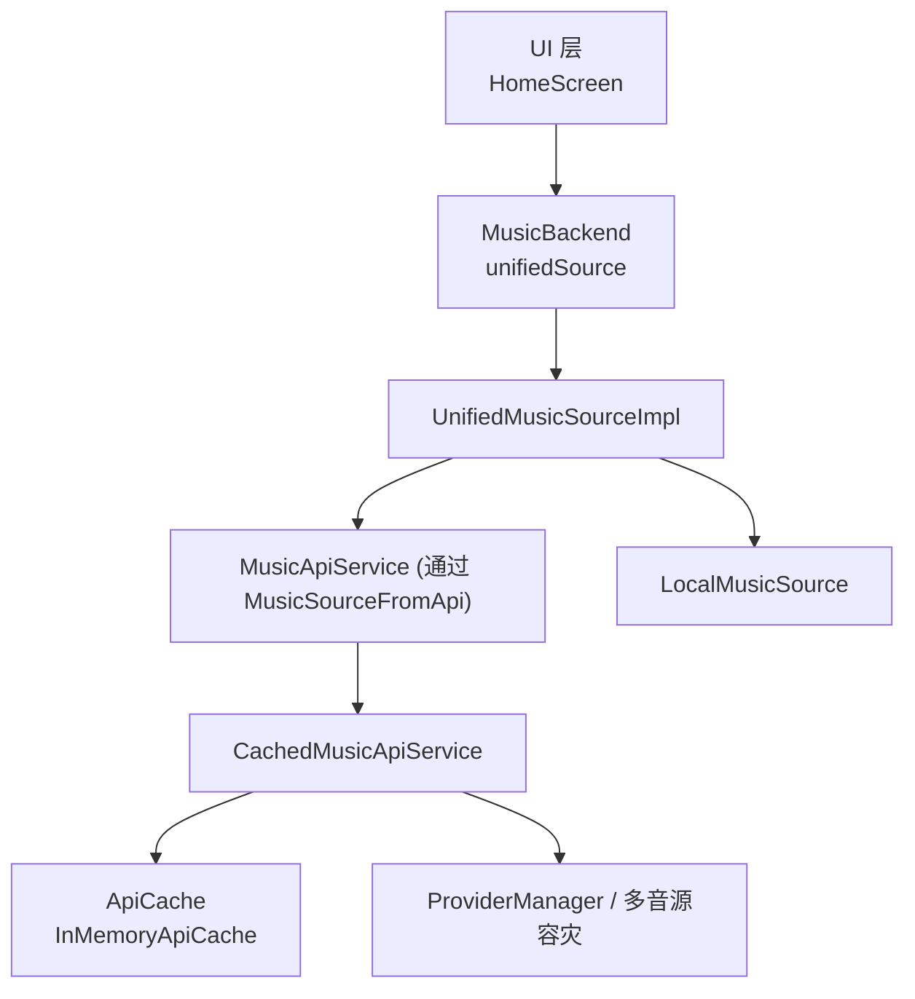
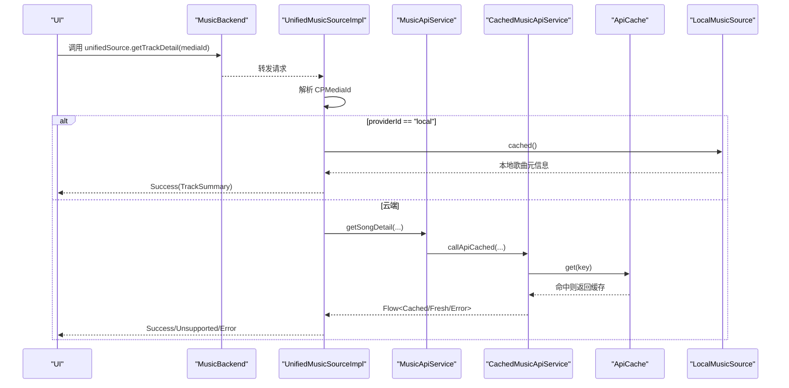
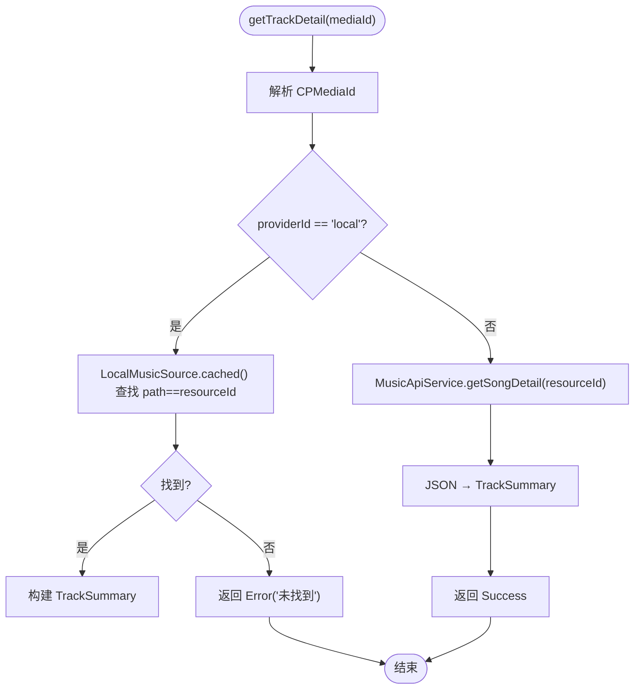
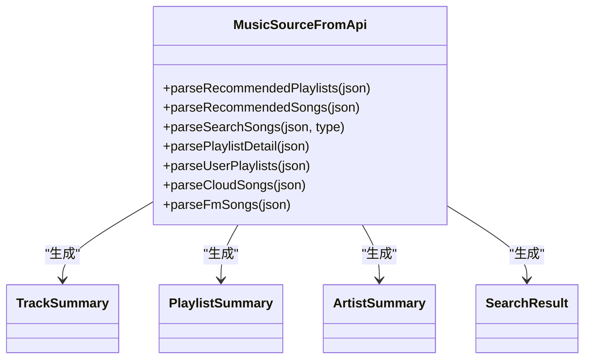
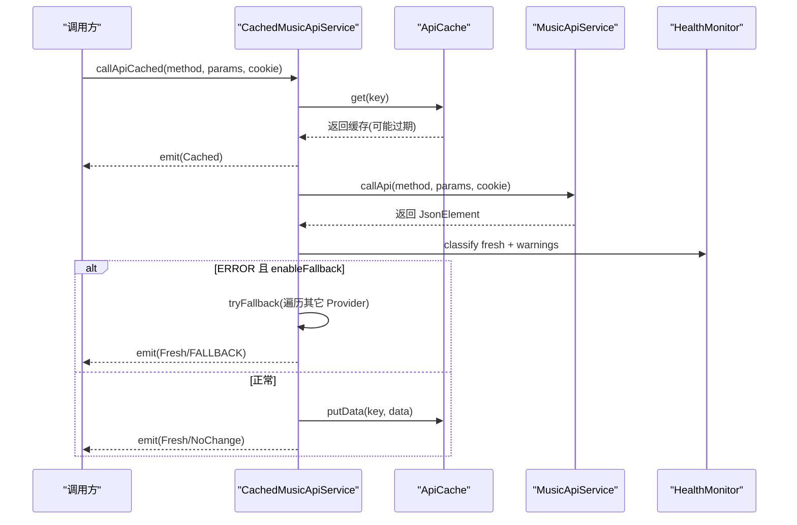
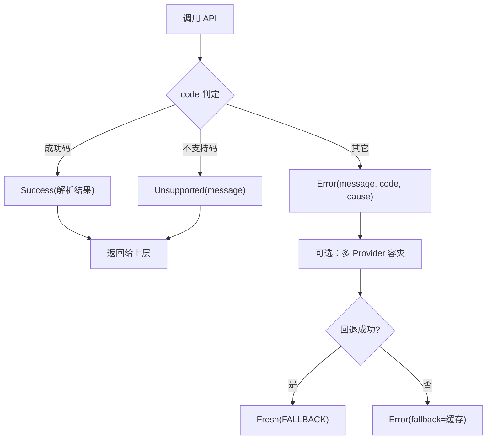
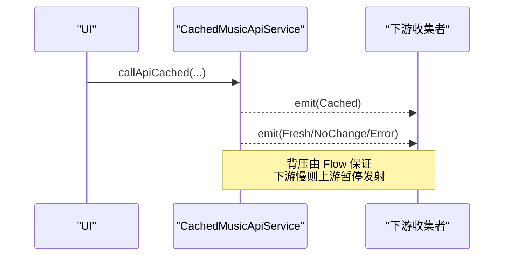
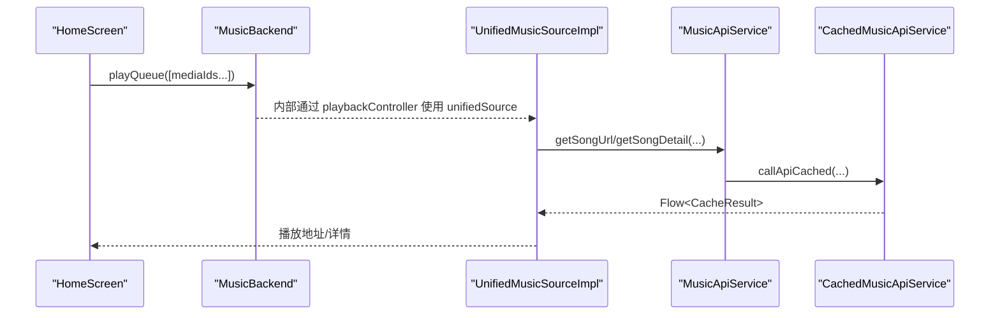
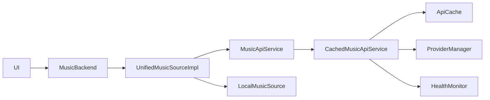

# 数据流设计

<cite>
**本文引用的文件**
- [UnifiedMusicSource.kt](file://kmp-pro/src/commonMain/kotlin/cp/player/kmp/music/UnifiedMusicSource.kt)
- [UnifiedMusicSourceImpl.kt](file://kmp-pro/src/commonMain/kotlin/cp/player/kmp/music/UnifiedMusicSourceImpl.kt)
- [CPMediaId.kt](file://kmp-pro/src/commonMain/kotlin/cp/player/kmp/music/CPMediaId.kt)
- [MusicSource.kt](file://kmp-pro/src/commonMain/kotlin/cp/player/kmp/music/MusicSource.kt)
- [MusicSourceFromApi.kt](file://kmp-pro/src/commonMain/kotlin/cp/player/kmp/music/MusicSourceFromApi.kt)
- [CachedMusicApiService.kt](file://kmp-pro/src/commonMain/kotlin/cp/player/kmp/cache/CachedMusicApiService.kt)
- [ApiCache.kt](file://kmp-pro/src/commonMain/kotlin/cp/player/kmp/cache/ApiCache.kt)
- [CacheConfig.kt](file://kmp-pro/src/commonMain/kotlin/cp/player/kmp/cache/CacheConfig.kt)
- [LocalMusicSource.kt](file://kmp-pro/src/commonMain/kotlin/cp/player/kmp/local/LocalMusicSource.kt)
- [MusicBackend.kt](file://kmp-pro/src/commonMain/kotlin/cp/player/kmp/MusicBackend.kt)
- [BackendState.kt](file://kmp-pro/src/commonMain/kotlin/cp/player/kmp/BackendState.kt)
- [HomeScreen.kt](file://app/src/commonMain/kotlin/cp/player/app/ui/screen/HomeScreen.kt)
</cite>

## 目录
1. [简介](#简介)
2. [项目结构](#项目结构)
3. [核心组件](#核心组件)
4. [架构总览](#架构总览)
5. [详细组件分析](#详细组件分析)
6. [依赖关系分析](#依赖关系分析)
7. [性能考量](#性能考量)
8. [故障排查指南](#故障排查指南)
9. [结论](#结论)
10. [附录](#附录)

## 简介
本文件面向“数据流设计”，聚焦以下目标：
- 统一数据源抽象 UnifiedMusicSource 的设计与职责边界
- CPMediaId 路由机制（providerId、resourceType、resourceId）如何驱动数据分发
- 从 UI 层到 Provider 层的完整数据流转路径
- 缓存策略在数据流中的位置与实现细节
- 错误传播机制与数据转换流程
- 关键路径的组件交互数据流图
- 异步数据处理与背压处理策略

## 项目结构
围绕数据流的关键代码分布在如下模块：
- 统一数据源抽象与实现：music 包下的 UnifiedMusicSource、UnifiedMusicSourceImpl、MusicSource、MusicSourceFromApi
- 媒体标识与路由：CPMediaId
- 缓存与健康监控：cache 包下的 CachedMusicApiService、ApiCache、CacheConfig
- 本地音乐源：local 包下的 LocalMusicSource
- 后端入口与状态：MusicBackend、BackendState
- UI 使用示例：HomeScreen（展示如何构造 MediaId 并触发播放）

图表来源
- [MusicBackend.kt:121-129](file://kmp-pro/src/commonMain/kotlin/cp/player/kmp/MusicBackend.kt#L121-L129)
- [UnifiedMusicSourceImpl.kt:15-126](file://kmp-pro/src/commonMain/kotlin/cp/player/kmp/music/UnifiedMusicSourceImpl.kt#L15-L126)
- [CachedMusicApiService.kt:46-88](file://kmp-pro/src/commonMain/kotlin/cp/player/kmp/cache/CachedMusicApiService.kt#L46-L88)
- [ApiCache.kt:26-67](file://kmp-pro/src/commonMain/kotlin/cp/player/kmp/cache/ApiCache.kt#L26-L67)

章节来源
- [MusicBackend.kt:121-129](file://kmp-pro/src/commonMain/kotlin/cp/player/kmp/MusicBackend.kt#L121-L129)
- [UnifiedMusicSourceImpl.kt:15-126](file://kmp-pro/src/commonMain/kotlin/cp/player/kmp/music/UnifiedMusicSourceImpl.kt#L15-L126)
- [CachedMusicApiService.kt:46-88](file://kmp-pro/src/commonMain/kotlin/cp/player/kmp/cache/CachedMusicApiService.kt#L46-L88)
- [ApiCache.kt:26-67](file://kmp-pro/src/commonMain/kotlin/cp/player/kmp/cache/ApiCache.kt#L26-L67)

## 核心组件
- UnifiedMusicSource：前端统一调用的音乐源接口，所有资源定位入参采用带命名空间的 CPMediaId（字符串），屏蔽底层 Provider 差异。
- UnifiedMusicSourceImpl：根据 CPMediaId.providerId 路由到本地或云端；负责 JSON→领域模型转换；聚合搜索与歌单等能力。
- CPMediaId：统一媒体 ID 规范 {providerId}://{resourceType}/{resourceId}，提供解析器。
- MusicSourceFromApi：JSON 到强类型模型的解析桥，封装跨 Provider 的 code 判定与错误分类。
- CachedMusicApiService：带网络缓存 + 异步加载的 MusicApiService 装饰器，返回 Flow<CacheResult>，支持多 Provider 容灾与健康监控。
- ApiCache：缓存抽象与默认进程内 LRU 实现；缓存键包含 providerId、method、参数排序、cookie 哈希。
- LocalMusicSource：本地音乐扫描与缓存接口，作为统一数据源的一部分。
- MusicBackend：后端统一入口，暴露 unifiedSource、playbackController、状态机与 Provider 管理。

章节来源
- [UnifiedMusicSource.kt:3-38](file://kmp-pro/src/commonMain/kotlin/cp/player/kmp/music/UnifiedMusicSource.kt#L3-L38)
- [UnifiedMusicSourceImpl.kt:15-126](file://kmp-pro/src/commonMain/kotlin/cp/player/kmp/music/UnifiedMusicSourceImpl.kt#L15-L126)
- [CPMediaId.kt:3-32](file://kmp-pro/src/commonMain/kotlin/cp/player/kmp/music/CPMediaId.kt#L3-L32)
- [MusicSourceFromApi.kt:16-26](file://kmp-pro/src/commonMain/kotlin/cp/player/kmp/music/MusicSourceFromApi.kt#L16-L26)
- [CachedMusicApiService.kt:18-52](file://kmp-pro/src/commonMain/kotlin/cp/player/kmp/cache/CachedMusicApiService.kt#L18-L52)
- [ApiCache.kt:6-18](file://kmp-pro/src/commonMain/kotlin/cp/player/kmp/cache/ApiCache.kt#L6-L18)
- [LocalMusicSource.kt:3-32](file://kmp-pro/src/commonMain/kotlin/cp/player/kmp/local/LocalMusicSource.kt#L3-L32)
- [MusicBackend.kt:30-72](file://kmp-pro/src/commonMain/kotlin/cp/player/kmp/MusicBackend.kt#L30-L72)

## 架构总览
整体数据流遵循“UI → Backend → UnifiedMusicSource → 路由 → 缓存/网络/本地”的分层模式：
- UI 层通过 MusicBackend.unifiedSource 发起请求，使用 CPMediaId 指定资源归属。
- UnifiedMusicSourceImpl 解析 CPMediaId，按 providerId 路由到本地或云端。
- 云端调用经 CachedMusicApiService 包装，先返回缓存（若存在），再后台拉取新鲜数据，必要时进行多 Provider 容灾回退。
- 数据在 MusicSourceFromApi 中完成 JSON→领域模型的转换，并以 MusicResult 统一成功/失败/不支持语义。
- 本地数据通过 LocalMusicSource 直接读取缓存列表。

图表来源
- [UnifiedMusicSourceImpl.kt:20-52](file://kmp-pro/src/commonMain/kotlin/cp/player/kmp/music/UnifiedMusicSourceImpl.kt#L20-L52)
- [CachedMusicApiService.kt:60-88](file://kmp-pro/src/commonMain/kotlin/cp/player/kmp/cache/CachedMusicApiService.kt#L60-L88)
- [ApiCache.kt:26-67](file://kmp-pro/src/commonMain/kotlin/cp/player/kmp/cache/ApiCache.kt#L26-L67)
- [LocalMusicSource.kt:15-32](file://kmp-pro/src/commonMain/kotlin/cp/player/kmp/local/LocalMusicSource.kt#L15-L32)

## 详细组件分析

### UnifiedMusicSource 与 CPMediaId 路由
- UnifiedMusicSource 定义统一的获取详情、批量详情、播放地址、搜索、用户歌单等方法，所有资源定位以 CPMediaId（字符串）为入参。
- CPMediaId.parse 将字符串拆分为 providerId、resourceType、resourceId，用于后续路由。
- UnifiedMusicSourceImpl 根据 providerId 决定走本地或云端：
  - local：从 LocalMusicSource.cached() 查找 path 匹配的资源，转换为 TrackSummary。
  - 非 local：调用 MusicApiService.getSongDetail，并将 JSON 转为 TrackSummary。
- 批量详情方法对本地与云端分别处理，云端分批请求避免 URI 过长。

图表来源
- [UnifiedMusicSourceImpl.kt:20-52](file://kmp-pro/src/commonMain/kotlin/cp/player/kmp/music/UnifiedMusicSourceImpl.kt#L20-L52)
- [CPMediaId.kt:20-31](file://kmp-pro/src/commonMain/kotlin/cp/player/kmp/music/CPMediaId.kt#L20-L31)
- [LocalMusicSource.kt:15-32](file://kmp-pro/src/commonMain/kotlin/cp/player/kmp/local/LocalMusicSource.kt#L15-L32)

章节来源
- [UnifiedMusicSource.kt:3-38](file://kmp-pro/src/commonMain/kotlin/cp/player/kmp/music/UnifiedMusicSource.kt#L3-L38)
- [UnifiedMusicSourceImpl.kt:20-98](file://kmp-pro/src/commonMain/kotlin/cp/player/kmp/music/UnifiedMusicSourceImpl.kt#L20-L98)
- [CPMediaId.kt:3-32](file://kmp-pro/src/commonMain/kotlin/cp/player/kmp/music/CPMediaId.kt#L3-L32)

### 数据转换流程（JSON → 领域模型）
- MusicSourceFromApi 提供解析桥，统一处理不同 Provider 的字段名差异，优先兼容常见字段，找不到时回退为空。
- 对响应 code 进行分类：成功码集合、不支持码集合（如 -1、501、404）、其它视为错误。
- 将 JsonElement 转换为 PlaylistSummary、TrackSummary、ArtistSummary、SearchResult 等强类型对象。
- 统一封装 toMusicResult 将异常与 code 映射为 BackendResult.Success/Unsupported/Error。

图表来源
- [MusicSourceFromApi.kt:62-122](file://kmp-pro/src/commonMain/kotlin/cp/player/kmp/music/MusicSourceFromApi.kt#L62-L122)
- [MusicSourceFromApi.kt:161-199](file://kmp-pro/src/commonMain/kotlin/cp/player/kmp/music/MusicSourceFromApi.kt#L161-L199)
- [MusicSource.kt:73-132](file://kmp-pro/src/commonMain/kotlin/cp/player/kmp/music/MusicSource.kt#L73-L132)

章节来源
- [MusicSourceFromApi.kt:16-26](file://kmp-pro/src/commonMain/kotlin/cp/player/kmp/music/MusicSourceFromApi.kt#L16-L26)
- [MusicSourceFromApi.kt:62-122](file://kmp-pro/src/commonMain/kotlin/cp/player/kmp/music/MusicSourceFromApi.kt#L62-L122)
- [MusicSourceFromApi.kt:161-199](file://kmp-pro/src/commonMain/kotlin/cp/player/kmp/music/MusicSourceFromApi.kt#L161-L199)
- [MusicSource.kt:73-132](file://kmp-pro/src/commonMain/kotlin/cp/player/kmp/music/MusicSource.kt#L73-L132)

### 缓存策略与多 Provider 容灾
- CachedMusicApiService 对每个请求返回 Flow<CacheResult>：
  - 立即发射缓存（若存在），标记是否过期（freshTtlMs）。
  - 后台拉取新数据，计算指纹并与缓存比对：相同且非 ERROR 则发射 NoChange；不同则写回缓存并发射 Fresh。
  - 健康监控集成：当响应为 ERROR 且启用回退时，尝试其它 Provider 调用同一方法（经 apiMap 映射），成功则标记 FALLBACK。
- 缓存键由 providerId、method、排序后的参数、cookie 哈希组成，确保隔离与一致性。
- 仅幂等读类接口可缓存，写/动作类直通网络。

图表来源
- [CachedMusicApiService.kt:60-140](file://kmp-pro/src/commonMain/kotlin/cp/player/kmp/cache/CachedMusicApiService.kt#L60-L140)
- [ApiCache.kt:52-67](file://kmp-pro/src/commonMain/kotlin/cp/player/kmp/cache/ApiCache.kt#L52-L67)
- [CacheConfig.kt:1-16](file://kmp-pro/src/commonMain/kotlin/cp/player/kmp/cache/CacheConfig.kt#L1-L16)

章节来源
- [CachedMusicApiService.kt:18-52](file://kmp-pro/src/commonMain/kotlin/cp/player/kmp/cache/CachedMusicApiService.kt#L18-L52)
- [CachedMusicApiService.kt:60-140](file://kmp-pro/src/commonMain/kotlin/cp/player/kmp/cache/CachedMusicApiService.kt#L60-L140)
- [ApiCache.kt:26-67](file://kmp-pro/src/commonMain/kotlin/cp/player/kmp/cache/ApiCache.kt#L26-L67)
- [CacheConfig.kt:1-16](file://kmp-pro/src/commonMain/kotlin/cp/player/kmp/cache/CacheConfig.kt#L1-L16)

### 错误传播机制
- BackendResult 统一封装 Success/Error/Unsupported，UI 可穷举处理。
- MusicSourceFromApi.toMusicResult 将 code 分类映射为 Unsupported 或 Error，并携带 message/code/cause。
- UnifiedMusicSourceImpl 在本地未找到或网络异常时返回 Error，并保留 cause。
- CachedMusicApiService 在网络错误或健康监控 ERROR 时发射 CacheResult.Error，并在回退成功后标记 FALLBACK。

图表来源
- [BackendState.kt:67-115](file://kmp-pro/src/commonMain/kotlin/cp/player/kmp/BackendState.kt#L67-L115)
- [MusicSourceFromApi.kt:29-60](file://kmp-pro/src/commonMain/kotlin/cp/player/kmp/music/MusicSourceFromApi.kt#L29-L60)
- [UnifiedMusicSourceImpl.kt:40-52](file://kmp-pro/src/commonMain/kotlin/cp/player/kmp/music/UnifiedMusicSourceImpl.kt#L40-L52)
- [CachedMusicApiService.kt:103-140](file://kmp-pro/src/commonMain/kotlin/cp/player/kmp/cache/CachedMusicApiService.kt#L103-L140)

章节来源
- [BackendState.kt:67-115](file://kmp-pro/src/commonMain/kotlin/cp/player/kmp/BackendState.kt#L67-L115)
- [MusicSourceFromApi.kt:29-60](file://kmp-pro/src/commonMain/kotlin/cp/player/kmp/music/MusicSourceFromApi.kt#L29-L60)
- [UnifiedMusicSourceImpl.kt:40-52](file://kmp-pro/src/commonMain/kotlin/cp/player/kmp/music/UnifiedMusicSourceImpl.kt#L40-L52)
- [CachedMusicApiService.kt:103-140](file://kmp-pro/src/commonMain/kotlin/cp/player/kmp/cache/CachedMusicApiService.kt#L103-L140)

### 异步数据处理与背压策略
- 缓存层使用 Kotlin Flow 返回多值序列：先缓存后新鲜数据，天然支持背压（下游收集速率控制上游发射）。
- 调用方（UI/业务层）通过 collectAsState 或 flow.collect 消费，Flow 保证有序与背压。
- 批量详情方法对云端请求进行分块（chunked），避免单次请求过大导致内存或网络压力。
- 健康监控与多 Provider 容灾在 Flow 内部完成，不阻塞主线程。

图表来源
- [CachedMusicApiService.kt:60-88](file://kmp-pro/src/commonMain/kotlin/cp/player/kmp/cache/CachedMusicApiService.kt#L60-L88)
- [UnifiedMusicSourceImpl.kt:76-95](file://kmp-pro/src/commonMain/kotlin/cp/player/kmp/music/UnifiedMusicSourceImpl.kt#L76-L95)

章节来源
- [CachedMusicApiService.kt:60-88](file://kmp-pro/src/commonMain/kotlin/cp/player/kmp/cache/CachedMusicApiService.kt#L60-L88)
- [UnifiedMusicSourceImpl.kt:76-95](file://kmp-pro/src/commonMain/kotlin/cp/player/kmp/music/UnifiedMusicSourceImpl.kt#L76-L95)

### 从 UI 到 Provider 的完整流转
- UI 层构造 MediaId：例如将纯 id 拼接为 "{providerId}://song/{id}"，然后传入播放队列或详情接口。
- MusicBackend.unifiedSource 接收请求，交由 UnifiedMusicSourceImpl 路由。
- 云端路径经 MusicSourceFromApi 解析 JSON 为领域模型，并通过 BackendResult 返回。
- 本地路径直接从 LocalMusicSource.cached() 获取元信息并转换。

图表来源
- [HomeScreen.kt:89-124](file://app/src/commonMain/kotlin/cp/player/app/ui/screen/HomeScreen.kt#L89-L124)
- [MusicBackend.kt:145-161](file://kmp-pro/src/commonMain/kotlin/cp/player/kmp/MusicBackend.kt#L145-L161)
- [UnifiedMusicSourceImpl.kt:100-118](file://kmp-pro/src/commonMain/kotlin/cp/player/kmp/music/UnifiedMusicSourceImpl.kt#L100-L118)
- [CachedMusicApiService.kt:60-88](file://kmp-pro/src/commonMain/kotlin/cp/player/kmp/cache/CachedMusicApiService.kt#L60-L88)

章节来源
- [HomeScreen.kt:89-124](file://app/src/commonMain/kotlin/cp/player/app/ui/screen/HomeScreen.kt#L89-L124)
- [MusicBackend.kt:145-161](file://kmp-pro/src/commonMain/kotlin/cp/player/kmp/MusicBackend.kt#L145-L161)
- [UnifiedMusicSourceImpl.kt:100-118](file://kmp-pro/src/commonMain/kotlin/cp/player/kmp/music/UnifiedMusicSourceImpl.kt#L100-L118)
- [CachedMusicApiService.kt:60-88](file://kmp-pro/src/commonMain/kotlin/cp/player/kmp/cache/CachedMusicApiService.kt#L60-L88)

## 依赖关系分析
- UnifiedMusicSourceImpl 依赖 MusicApiService 与 LocalMusicSource，并通过 MusicSourceFromApi 完成解析。
- CachedMusicApiService 依赖 MusicApiService、ApiCache、ProviderManager、HealthMonitor，实现缓存与容灾。
- MusicBackend 组合 ProviderManager、ModuleManager、MusicApiServiceImpl、CachedMusicApiService、LocalMusicSource，暴露 unifiedSource 与 playbackController。
- UI 层通过 MusicBackend 间接依赖上述组件，保持解耦。

图表来源
- [MusicBackend.kt:73-129](file://kmp-pro/src/commonMain/kotlin/cp/player/kmp/MusicBackend.kt#L73-L129)
- [UnifiedMusicSourceImpl.kt:15-126](file://kmp-pro/src/commonMain/kotlin/cp/player/kmp/music/UnifiedMusicSourceImpl.kt#L15-L126)
- [CachedMusicApiService.kt:46-52](file://kmp-pro/src/commonMain/kotlin/cp/player/kmp/cache/CachedMusicApiService.kt#L46-L52)

章节来源
- [MusicBackend.kt:73-129](file://kmp-pro/src/commonMain/kotlin/cp/player/kmp/MusicBackend.kt#L73-L129)
- [UnifiedMusicSourceImpl.kt:15-126](file://kmp-pro/src/commonMain/kotlin/cp/player/kmp/music/UnifiedMusicSourceImpl.kt#L15-L126)
- [CachedMusicApiService.kt:46-52](file://kmp-pro/src/commonMain/kotlin/cp/player/kmp/cache/CachedMusicApiService.kt#L46-L52)

## 性能考量
- 缓存键设计考虑了 providerId、method、参数排序与 cookie 哈希，避免误命中。
- 新鲜度阈值 freshTtlMs 控制缓存是否 stale，既保证首屏快速渲染，又能在后台更新。
- 批量详情分块请求避免 URI 过长与内存峰值。
- Flow 背压确保 UI 与网络/缓存层协调工作，避免过载。
- 多 Provider 容灾在 ERROR 时自动切换，提升可用性。

[本节为通用指导，无需特定文件引用]

## 故障排查指南
- 检查 CPMediaId 格式是否正确，解析失败会抛出异常。
- 若返回 Unsupported，确认当前 Provider 的 apiMap 是否将该方法映射为 unsupported。
- 若返回 Error，查看 message/code/cause，结合 HealthMonitor 最近记录判断是否为网络或 Provider 问题。
- 缓存未命中或 stale：检查 cacheKey 生成逻辑与 ApiCache 实现；确认 enableCache 开关。
- 多 Provider 容灾未生效：确认 enableFallback 配置与健康监控级别分类。

章节来源
- [CPMediaId.kt:20-31](file://kmp-pro/src/commonMain/kotlin/cp/player/kmp/music/CPMediaId.kt#L20-L31)
- [MusicSourceFromApi.kt:29-60](file://kmp-pro/src/commonMain/kotlin/cp/player/kmp/music/MusicSourceFromApi.kt#L29-L60)
- [CachedMusicApiService.kt:103-140](file://kmp-pro/src/commonMain/kotlin/cp/player/kmp/cache/CachedMusicApiService.kt#L103-L140)
- [ApiCache.kt:52-67](file://kmp-pro/src/commonMain/kotlin/cp/player/kmp/cache/ApiCache.kt#L52-L67)

## 结论
本数据流设计通过 UnifiedMusicSource 与 CPMediaId 实现了跨 Provider 的统一访问与路由，借助 CachedMusicApiService 提供缓存与容灾能力，配合 MusicSourceFromApi 完成稳健的数据转换，并以 BackendResult 统一错误语义。UI 层只需关注 MediaId 与状态流，即可获得一致、可靠、高性能的音乐数据体验。

## 附录
- 关键路径建议：
  - 始终使用 CPMediaId 进行资源定位，避免裸 id 传递。
  - 使用 MusicBackend.unifiedSource 作为唯一数据入口，屏蔽底层差异。
  - 利用 Flow 的背压特性，合理设置 UI 收集策略，避免卡顿。
  - 关注 HealthMonitor 与 CacheConfig，调整容灾与缓存策略以适应不同环境。

[本节为补充说明，无需特定文件引用]