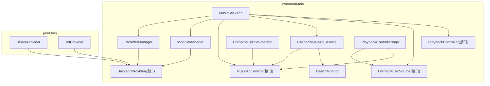
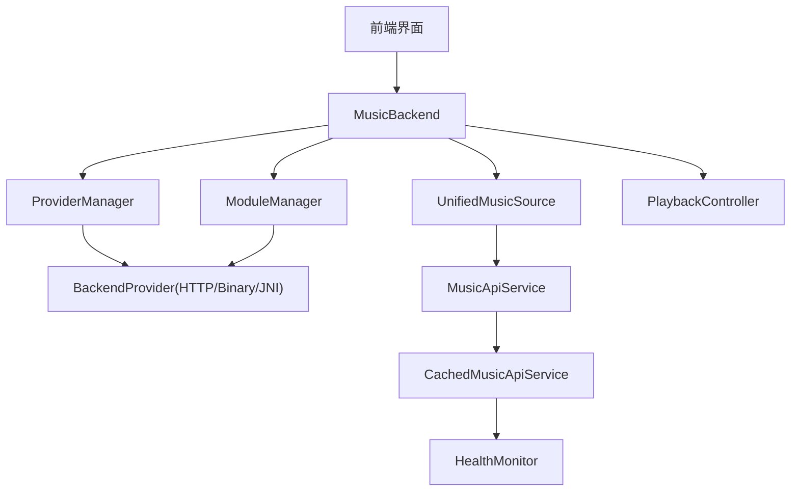
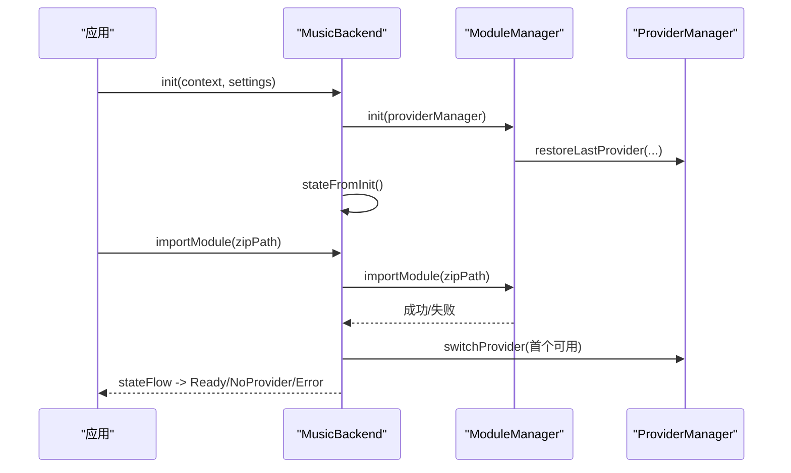
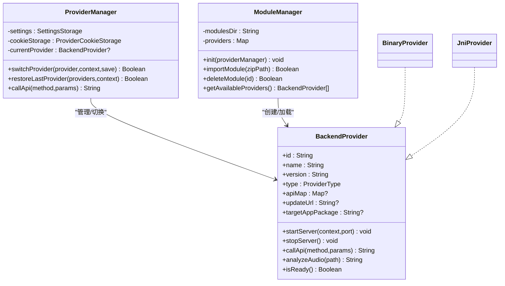
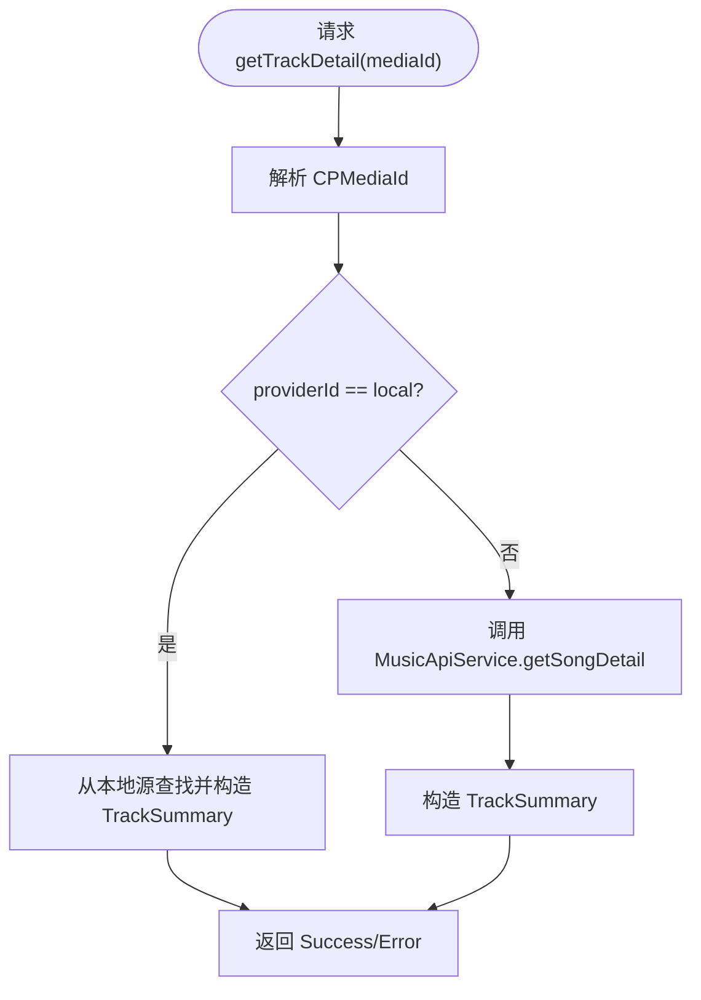
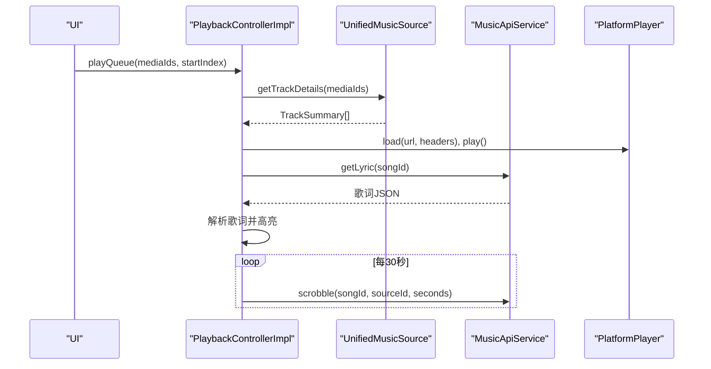
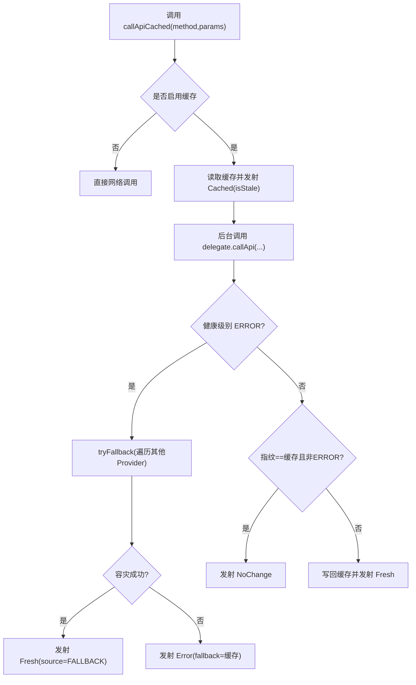
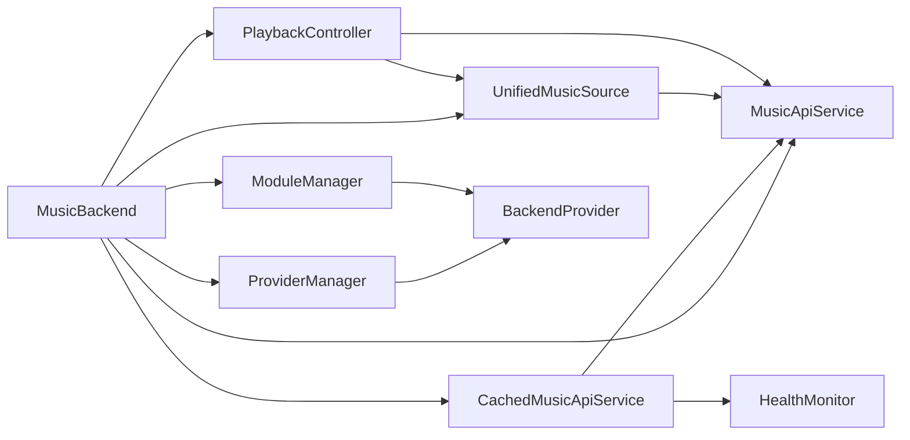

# 架构设计

<cite>
**本文引用的文件**
- [MusicBackend.kt](file://kmp-pro/src/commonMain/kotlin/cp/player/kmp/MusicBackend.kt)
- [ProviderManager.kt](file://kmp-pro/src/commonMain/kotlin/cp/player/kmp/provider/ProviderManager.kt)
- [ModuleManager.kt](file://kmp-pro/src/commonMain/kotlin/cp/player/kmp/provider/ModuleManager.kt)
- [BackendProvider.kt](file://kmp-pro/src/commonMain/kotlin/cp/player/kmp/provider/BackendProvider.kt)
- [BinaryProvider.kt](file://kmp-pro/src/jvmMain/kotlin/cp/player/kmp/provider/BinaryProvider.kt)
- [JniProvider.kt](file://kmp-pro/src/jvmMain/kotlin/cp/player/kmp/provider/JniProvider.kt)
- [MusicApiService.kt](file://kmp-pro/src/commonMain/kotlin/cp/player/kmp/api/MusicApiService.kt)
- [CachedMusicApiService.kt](file://kmp-pro/src/commonMain/kotlin/cp/player/kmp/cache/CachedMusicApiService.kt)
- [HealthMonitor.kt](file://kmp-pro/src/commonMain/kotlin/cp/player/kmp/monitor/HealthMonitor.kt)
- [UnifiedMusicSource.kt](file://kmp-pro/src/commonMain/kotlin/cp/player/kmp/music/UnifiedMusicSource.kt)
- [UnifiedMusicSourceImpl.kt](file://kmp-pro/src/commonMain/kotlin/cp/player/kmp/music/UnifiedMusicSourceImpl.kt)
- [PlaybackController.kt](file://kmp-pro/src/commonMain/kotlin/cp/player/kmp/playback/PlaybackController.kt)
- [PlaybackControllerImpl.kt](file://kmp-pro/src/commonMain/kotlin/cp/player/kmp/playback/PlaybackControllerImpl.kt)
- [README.md](file://README.md)
</cite>

## 目录
1. [引言](#引言)
2. [项目结构](#项目结构)
3. [核心组件](#核心组件)
4. [架构总览](#架构总览)
5. [详细组件分析](#详细组件分析)
6. [依赖关系分析](#依赖关系分析)
7. [性能与可扩展性](#性能与可扩展性)
8. [安全、监控与灾难恢复](#安全监控与灾难恢复)
9. [基础设施与部署拓扑](#基础设施与部署拓扑)
10. [故障排查指南](#故障排查指南)
11. [结论](#结论)

## 引言
本架构文档面向 CPPlayer-KMP 项目的后端与数据层，聚焦以下目标：
- 统一入口 MusicBackend 的职责与状态机
- Provider 插件化架构（HTTP/Binary/JNI）与管理机制
- 统一音乐源 UnifiedMusicSource 的跨 Provider 路由与本地源融合
- 播放控制 PlaybackController 的队列、歌词、收藏、打卡等能力
- 健康监控 HealthMonitor 的三级分类与多 Provider 容灾
- 技术栈、版本兼容、扩展点与部署拓扑

## 项目结构
KMP 模块采用 commonMain → jvmMain → { androidMain, desktopMain } 的分层组织。commonMain 定义跨平台接口与核心逻辑；jvmMain 提供 JVM 共享实现（如 BinaryProvider、HttpClient 工厂等）；androidMain/desktopMain 提供平台差异实现（如 SettingsStorage、PlatformContext）。

图表来源
- [MusicBackend.kt:30-160](file://kmp-pro/src/commonMain/kotlin/cp/player/kmp/MusicBackend.kt#L30-L160)
- [ProviderManager.kt:15-145](file://kmp-pro/src/commonMain/kotlin/cp/player/kmp/provider/ProviderManager.kt#L15-L145)
- [ModuleManager.kt:10-137](file://kmp-pro/src/commonMain/kotlin/cp/player/kmp/provider/ModuleManager.kt#L10-L137)
- [BackendProvider.kt:5-110](file://kmp-pro/src/commonMain/kotlin/cp/player/kmp/provider/BackendProvider.kt#L5-L110)
- [MusicApiService.kt:5-528](file://kmp-pro/src/commonMain/kotlin/cp/player/kmp/api/MusicApiService.kt#L5-L528)
- [CachedMusicApiService.kt:18-219](file://kmp-pro/src/commonMain/kotlin/cp/player/kmp/cache/CachedMusicApiService.kt#L18-L219)
- [UnifiedMusicSource.kt:1-39](file://kmp-pro/src/commonMain/kotlin/cp/player/kmp/music/UnifiedMusicSource.kt#L1-L39)
- [UnifiedMusicSourceImpl.kt:15-176](file://kmp-pro/src/commonMain/kotlin/cp/player/kmp/music/UnifiedMusicSourceImpl.kt#L15-L176)
- [PlaybackController.kt:6-106](file://kmp-pro/src/commonMain/kotlin/cp/player/kmp/playback/PlaybackController.kt#L6-L106)
- [PlaybackControllerImpl.kt:18-763](file://kmp-pro/src/commonMain/kotlin/cp/player/kmp/playback/PlaybackControllerImpl.kt#L18-L763)
- [HealthMonitor.kt:10-290](file://kmp-pro/src/commonMain/kotlin/cp/player/kmp/monitor/HealthMonitor.kt#L10-L290)

章节来源
- [README.md:11-63](file://README.md#L11-L63)

## 核心组件
- MusicBackend：应用唯一后端入口，封装生命周期、Provider 管理、统一数据访问、播放控制与健康监控。
- ProviderManager：管理当前活跃 Provider、端口分配、Cookie 隔离、切换与持久化。
- ModuleManager：扫描/导入/删除模块包，加载 BackendProvider 实例并维护可用列表。
- BackendProvider：Provider 抽象，支持 HTTP/Binary/JNI 三种实现。
- MusicApiService：统一 API 接口，自动注入 Cookie，返回 JsonElement。
- CachedMusicApiService：在 API 之上增加缓存、指纹比对、健康监控与多 Provider 容灾。
- UnifiedMusicSource：统一资源定位（CPMediaId），聚合云与本地源。
- PlaybackController：前端唯一播控入口，协调取源、播放、歌词、收藏、打卡等。
- HealthMonitor：三级健康分类、统计与整体等级流。

章节来源
- [MusicBackend.kt:30-160](file://kmp-pro/src/commonMain/kotlin/cp/player/kmp/MusicBackend.kt#L30-L160)
- [ProviderManager.kt:15-145](file://kmp-pro/src/commonMain/kotlin/cp/player/kmp/provider/ProviderManager.kt#L15-L145)
- [ModuleManager.kt:10-137](file://kmp-pro/src/commonMain/kotlin/cp/player/kmp/provider/ModuleManager.kt#L10-L137)
- [BackendProvider.kt:5-110](file://kmp-pro/src/commonMain/kotlin/cp/player/kmp/provider/BackendProvider.kt#L5-L110)
- [MusicApiService.kt:5-528](file://kmp-pro/src/commonMain/kotlin/cp/player/kmp/api/MusicApiService.kt#L5-L528)
- [CachedMusicApiService.kt:18-219](file://kmp-pro/src/commonMain/kotlin/cp/player/kmp/cache/CachedMusicApiService.kt#L18-L219)
- [UnifiedMusicSource.kt:1-39](file://kmp-pro/src/commonMain/kotlin/cp/player/kmp/music/UnifiedMusicSource.kt#L1-L39)
- [PlaybackController.kt:6-106](file://kmp-pro/src/commonMain/kotlin/cp/player/kmp/playback/PlaybackController.kt#L6-L106)
- [HealthMonitor.kt:10-290](file://kmp-pro/src/commonMain/kotlin/cp/player/kmp/monitor/HealthMonitor.kt#L10-L290)

## 架构总览
系统以 MusicBackend 为统一入口，向上暴露状态流与高层 API；向下通过 ProviderManager/ModuleManager 管理可插拔音源；通过 UnifiedMusicSource 屏蔽多源差异；通过 PlaybackController 统一播放体验；通过 HealthMonitor 提供健康观测与回退策略。

图表来源
- [MusicBackend.kt:30-160](file://kmp-pro/src/commonMain/kotlin/cp/player/kmp/MusicBackend.kt#L30-L160)
- [ProviderManager.kt:15-145](file://kmp-pro/src/commonMain/kotlin/cp/player/kmp/provider/ProviderManager.kt#L15-L145)
- [ModuleManager.kt:10-137](file://kmp-pro/src/commonMain/kotlin/cp/player/kmp/provider/ModuleManager.kt#L10-L137)
- [BackendProvider.kt:5-110](file://kmp-pro/src/commonMain/kotlin/cp/player/kmp/provider/BackendProvider.kt#L5-L110)
- [MusicApiService.kt:5-528](file://kmp-pro/src/commonMain/kotlin/cp/player/kmp/api/MusicApiService.kt#L5-L528)
- [CachedMusicApiService.kt:18-219](file://kmp-pro/src/commonMain/kotlin/cp/player/kmp/cache/CachedMusicApiService.kt#L18-L219)
- [UnifiedMusicSource.kt:1-39](file://kmp-pro/src/commonMain/kotlin/cp/player/kmp/music/UnifiedMusicSource.kt#L1-L39)
- [PlaybackController.kt:6-106](file://kmp-pro/src/commonMain/kotlin/cp/player/kmp/playback/PlaybackController.kt#L6-L106)
- [HealthMonitor.kt:10-290](file://kmp-pro/src/commonMain/kotlin/cp/player/kmp/monitor/HealthMonitor.kt#L10-L290)

## 详细组件分析

### MusicBackend：统一入口与状态机
- 职责：初始化 Provider/模块/API/缓存；暴露 stateFlow 驱动 UI；管理导入/切换/删除 Provider；提供 unifiedSource 与 playbackController。
- 关键流程：init 构建各组件并计算终态；importModule 自动激活首个可用 Provider；switch/delete 时更新状态流。
- 错误处理：捕获 Provider 启动失败，反射提取错误信息，迁移到 Error 状态。

图表来源
- [MusicBackend.kt:330-388](file://kmp-pro/src/commonMain/kotlin/cp/player/kmp/MusicBackend.kt#L330-L388)
- [ModuleManager.kt:38-48](file://kmp-pro/src/commonMain/kotlin/cp/player/kmp/provider/ModuleManager.kt#L38-L48)
- [ProviderManager.kt:117-121](file://kmp-pro/src/commonMain/kotlin/cp/player/kmp/provider/ProviderManager.kt#L117-L121)

章节来源
- [MusicBackend.kt:30-160](file://kmp-pro/src/commonMain/kotlin/cp/player/kmp/MusicBackend.kt#L30-L160)
- [MusicBackend.kt:180-248](file://kmp-pro/src/commonMain/kotlin/cp/player/kmp/MusicBackend.kt#L180-L248)
- [MusicBackend.kt:330-388](file://kmp-pro/src/commonMain/kotlin/cp/player/kmp/MusicBackend.kt#L330-L388)

### Provider 管理系统：插件化与生命周期
- BackendProvider：抽象出 id/name/version/type/apiMap/updateUrl/targetAppPackage/startServer/stopServer/callApi/isReady。
- ProviderManager：负责端口探测、切换、持久化 last_active_provider_id、按 providerId 调用 Cookie 存储。
- ModuleManager：从 modulesDir 扫描/导入 zip，解析 manifest.json，创建 Provider 并维护可用列表。
- 实现类型：
  - BinaryProvider：进程外二进制，HTTP 通信，ELF 校验，端口参数传递。
  - JniProvider：JNI 本地库，Android/Desktop 可用（Desktop 可能不可用）。

图表来源
- [BackendProvider.kt:24-96](file://kmp-pro/src/commonMain/kotlin/cp/player/kmp/provider/BackendProvider.kt#L24-L96)
- [ProviderManager.kt:31-145](file://kmp-pro/src/commonMain/kotlin/cp/player/kmp/provider/ProviderManager.kt#L31-L145)
- [ModuleManager.kt:19-137](file://kmp-pro/src/commonMain/kotlin/cp/player/kmp/provider/ModuleManager.kt#L19-L137)
- [BinaryProvider.kt:25-108](file://kmp-pro/src/jvmMain/kotlin/cp/player/kmp/provider/BinaryProvider.kt#L25-L108)
- [JniProvider.kt:1-200](file://kmp-pro/src/jvmMain/kotlin/cp/player/kmp/provider/JniProvider.kt#L1-L200)

章节来源
- [BackendProvider.kt:24-110](file://kmp-pro/src/commonMain/kotlin/cp/player/kmp/provider/BackendProvider.kt#L24-L110)
- [ProviderManager.kt:31-145](file://kmp-pro/src/commonMain/kotlin/cp/player/kmp/provider/ProviderManager.kt#L31-L145)
- [ModuleManager.kt:19-137](file://kmp-pro/src/commonMain/kotlin/cp/player/kmp/provider/ModuleManager.kt#L19-L137)
- [BinaryProvider.kt:25-108](file://kmp-pro/src/jvmMain/kotlin/cp/player/kmp/provider/BinaryProvider.kt#L25-L108)

### 统一音乐源：跨 Provider 路由与本地融合
- UnifiedMusicSource：以 CPMediaId 作为统一资源标识，屏蔽 provider 差异。
- UnifiedMusicSourceImpl：根据 providerId 路由到本地或云端；批量获取详情；搜索与歌单委托给 MusicSourceFromApi。
- 优势：UI 无需关心数据来源，仅操作 mediaId。

图表来源
- [UnifiedMusicSource.kt:7-38](file://kmp-pro/src/commonMain/kotlin/cp/player/kmp/music/UnifiedMusicSource.kt#L7-L38)
- [UnifiedMusicSourceImpl.kt:20-52](file://kmp-pro/src/commonMain/kotlin/cp/player/kmp/music/UnifiedMusicSourceImpl.kt#L20-L52)

章节来源
- [UnifiedMusicSource.kt:1-39](file://kmp-pro/src/commonMain/kotlin/cp/player/kmp/music/UnifiedMusicSource.kt#L1-L39)
- [UnifiedMusicSourceImpl.kt:15-176](file://kmp-pro/src/commonMain/kotlin/cp/player/kmp/music/UnifiedMusicSourceImpl.kt#L15-L176)

### 播放控制器：队列、歌词、收藏与打卡
- PlaybackController：前端唯一播控入口，提供队列、播放控制、收藏、音质、睡眠定时、歌词刷新等。
- PlaybackControllerImpl：协调 PlatformPlayer、UnifiedMusicSource、MusicApiService；懒解析曲目、自动下一首、scrobble 上报、歌词解析与高亮、收藏乐观更新与回滚、音质降级重试。

图表来源
- [PlaybackController.kt:16-106](file://kmp-pro/src/commonMain/kotlin/cp/player/kmp/playback/PlaybackController.kt#L16-L106)
- [PlaybackControllerImpl.kt:144-158](file://kmp-pro/src/commonMain/kotlin/cp/player/kmp/playback/PlaybackControllerImpl.kt#L144-L158)
- [PlaybackControllerImpl.kt:495-556](file://kmp-pro/src/commonMain/kotlin/cp/player/kmp/playback/PlaybackControllerImpl.kt#L495-L556)
- [PlaybackControllerImpl.kt:721-753](file://kmp-pro/src/commonMain/kotlin/cp/player/kmp/playback/PlaybackControllerImpl.kt#L721-L753)

章节来源
- [PlaybackController.kt:6-106](file://kmp-pro/src/commonMain/kotlin/cp/player/kmp/playback/PlaybackController.kt#L6-L106)
- [PlaybackControllerImpl.kt:18-763](file://kmp-pro/src/commonMain/kotlin/cp/player/kmp/playback/PlaybackControllerImpl.kt#L18-L763)

### 缓存与健康监控：三级分类与多 Provider 容灾
- CachedMusicApiService：先返回缓存，后台拉取网络，指纹比对决定是否替换；ERROR 触发多 Provider 容灾；写动作不缓存。
- HealthMonitor：记录每次调用，分类 OK/WARNING/ERROR，提供 overallLevelFlow 供 UI 指示。

图表来源
- [CachedMusicApiService.kt:60-140](file://kmp-pro/src/commonMain/kotlin/cp/player/kmp/cache/CachedMusicApiService.kt#L60-L140)
- [CachedMusicApiService.kt:149-180](file://kmp-pro/src/commonMain/kotlin/cp/player/kmp/cache/CachedMusicApiService.kt#L149-L180)
- [HealthMonitor.kt:117-138](file://kmp-pro/src/commonMain/kotlin/cp/player/kmp/monitor/HealthMonitor.kt#L117-L138)

章节来源
- [CachedMusicApiService.kt:18-219](file://kmp-pro/src/commonMain/kotlin/cp/player/kmp/cache/CachedMusicApiService.kt#L18-L219)
- [HealthMonitor.kt:10-290](file://kmp-pro/src/commonMain/kotlin/cp/player/kmp/monitor/HealthMonitor.kt#L10-L290)

## 依赖关系分析
- 耦合度：
  - MusicBackend 对 ProviderManager/ModuleManager/MusicApiService/CachedMusicApiService 强依赖，但通过接口与工厂解耦具体实现。
  - ProviderManager 与 ModuleManager 低耦合，分别负责“运行时切换”和“模块装载”。
  - UnifiedMusicSource 屏蔽底层 API 与本地源差异，降低上层复杂度。
- 外部依赖：
  - Ktor 用于 HTTP 客户端（BinaryProvider、jvmMain HttpClientFactory）。
  - kotlinx-serialization 用于 JSON 解析与模型序列化。
  - Coroutines 用于异步与 Flow 状态管理。
- 循环依赖：无显式循环；通过接口与回调避免。

图表来源
- [MusicBackend.kt:30-160](file://kmp-pro/src/commonMain/kotlin/cp/player/kmp/MusicBackend.kt#L30-L160)
- [ProviderManager.kt:31-145](file://kmp-pro/src/commonMain/kotlin/cp/player/kmp/provider/ProviderManager.kt#L31-L145)
- [ModuleManager.kt:19-137](file://kmp-pro/src/commonMain/kotlin/cp/player/kmp/provider/ModuleManager.kt#L19-L137)
- [MusicApiService.kt:5-528](file://kmp-pro/src/commonMain/kotlin/cp/player/kmp/api/MusicApiService.kt#L5-L528)
- [CachedMusicApiService.kt:18-219](file://kmp-pro/src/commonMain/kotlin/cp/player/kmp/cache/CachedMusicApiService.kt#L18-L219)
- [UnifiedMusicSource.kt:1-39](file://kmp-pro/src/commonMain/kotlin/cp/player/kmp/music/UnifiedMusicSource.kt#L1-L39)
- [PlaybackController.kt:6-106](file://kmp-pro/src/commonMain/kotlin/cp/player/kmp/playback/PlaybackController.kt#L6-L106)
- [HealthMonitor.kt:10-290](file://kmp-pro/src/commonMain/kotlin/cp/player/kmp/monitor/HealthMonitor.kt#L10-L290)

章节来源
- [README.md:45-63](file://README.md#L45-L63)

## 性能与可扩展性
- 性能特性
  - 缓存优先：CachedMusicApiService 先返回缓存，再异步拉取，减少首屏等待。
  - 指纹比对：仅在内容变化时写回缓存，避免无效写入与 UI 抖动。
  - 健康监控：基于环形缓冲区与 StateFlow 增量更新，避免全量复制。
  - 播放优化：懒解析曲目详情、批量请求、自动音质降级重试。
- 可扩展性
  - Provider 插件化：新增音源只需实现 BackendProvider 并提供 manifest.json。
  - 统一数据源：新增本地源或第三方源，仅需适配 UnifiedMusicSource。
  - 可配置缓存：CacheConfig 控制 TTL、最大条目数、回退开关。
- 约束条件
  - JNI 模块仅 Android 可用；Desktop 需处理不可用情况。
  - 端口冲突：ProviderManager 自动探测可用端口，最多尝试固定次数。
  - Cookie 隔离：按 providerId 前缀存储，避免账号串扰。

[本节为通用指导，不直接分析具体文件]

## 安全、监控与灾难恢复
- 安全性
  - Cookie 隔离：ProviderCookieStorage 按 providerId 隔离账号凭证。
  - 最小权限：API 层仅暴露必要方法，内部细节由 Provider 实现。
  - 输入校验：ProviderManager 对不支持的方法映射为 unsupported，避免非法调用。
- 监控
  - HealthMonitor 记录每次调用的耗时、成功与否、警告类型、是否回退，并提供 overallLevelFlow 供 UI 展示。
  - 统计查询：按 Provider/Method 维度汇总成功率、平均耗时、P95、回退次数等。
- 灾难恢复
  - 多 Provider 容灾：当当前 Provider 响应 ERROR，CachedMusicApiService 依次尝试其它 Provider，直至成功或全部失败。
  - 缓存降级：网络异常或 ERROR 时，返回缓存作为 fallback，保证基本可用性。
  - 播放降级：播放失败时自动降级到 standard 音质重试一次，提升兼容性。

章节来源
- [ProviderManager.kt:148-156](file://kmp-pro/src/commonMain/kotlin/cp/player/kmp/provider/ProviderManager.kt#L148-L156)
- [HealthMonitor.kt:117-290](file://kmp-pro/src/commonMain/kotlin/cp/player/kmp/monitor/HealthMonitor.kt#L117-L290)
- [CachedMusicApiService.kt:104-140](file://kmp-pro/src/commonMain/kotlin/cp/player/kmp/cache/CachedMusicApiService.kt#L104-L140)
- [PlaybackControllerImpl.kt:548-575](file://kmp-pro/src/commonMain/kotlin/cp/player/kmp/playback/PlaybackControllerImpl.kt#L548-L575)

## 基础设施与部署拓扑
- 技术栈
  - Kotlin Multiplatform (commonMain/jvmMain/androidMain/desktopMain)
  - Ktor 3（HTTP 客户端）
  - kotlinx-serialization 1.7（JSON）
  - Coroutines 1.9（异步与 Flow）
  - Gradle 9.4.1 / Kotlin 2.1.0 / AGP 8.7.3
- 第三方依赖
  - Ktor Client（jvmMain 使用）
  - kotlinx-serialization（commonMain）
- 版本兼容性
  - Android：JNI 模块可用；SettingsStorage 基于 SharedPreferences。
  - Desktop：JNI 模块不可用时标记不可用；SettingsStorage 基于 Properties 文件。
- 部署拓扑
  - 本地模式：应用内加载模块（zip），启动 BinaryProvider 进程或通过 JNI 加载本地库。
  - 远程模式：HttpProvider 连接已有 HTTP API 服务（由外部启动）。
  - 模块目录：modulesDir 存放已导入模块，每个模块含 manifest.json 与入口文件。

章节来源
- [README.md:30-41](file://README.md#L30-L41)
- [README.md:45-63](file://README.md#L45-L63)
- [BinaryProvider.kt:17-24](file://kmp-pro/src/jvmMain/kotlin/cp/player/kmp/provider/BinaryProvider.kt#L17-L24)
- [ModuleManager.kt:10-22](file://kmp-pro/src/commonMain/kotlin/cp/player/kmp/provider/ModuleManager.kt#L10-L22)

## 故障排查指南
- 常见错误与定位
  - Provider 未就绪：检查 isReady 与 getLoadError（反射提取），确认二进制/JNI 文件存在且 ABI 匹配。
  - 端口占用：ProviderManager 会尝试多个端口，若全部失败则切换失败；查看日志中的端口占用提示。
  - 模块导入失败：ModuleManager.lastLoadError 包含解压/manifest/移动失败原因。
  - API 健康：通过 HealthMonitor.recordsFlow 与 overallLevelFlow 观察最近调用质量与整体等级。
  - 播放失败：PlaybackControllerImpl 会自动降级到 standard 音质重试；若仍失败，检查 URL 与 Cookie 头。
- 诊断步骤
  - 查看 lastLoadError 与 HealthMonitor 最近记录。
  - 确认 modulesDir 下模块结构正确（manifest.json + 入口）。
  - 验证 Provider apiMap 映射是否将方法映射为 unsupported。
  - 检查 Cookie 是否按 providerId 正确隔离。

章节来源
- [ModuleManager.kt:57-86](file://kmp-pro/src/commonMain/kotlin/cp/player/kmp/provider/ModuleManager.kt#L57-L86)
- [ProviderManager.kt:65-109](file://kmp-pro/src/commonMain/kotlin/cp/player/kmp/provider/ProviderManager.kt#L65-L109)
- [HealthMonitor.kt:117-178](file://kmp-pro/src/commonMain/kotlin/cp/player/kmp/monitor/HealthMonitor.kt#L117-L178)
- [PlaybackControllerImpl.kt:548-575](file://kmp-pro/src/commonMain/kotlin/cp/player/kmp/playback/PlaybackControllerImpl.kt#L548-L575)

## 结论
CPPlayer-KMP 通过 MusicBackend 统一入口、Provider 插件化、UnifiedMusicSource 资源路由、PlaybackController 播放编排以及 HealthMonitor 健康监控，构建了高内聚、低耦合、可扩展的后端体系。其设计在保证用户体验（缓存、降级、容灾）的同时，提供了清晰的扩展点（新 Provider、新本地源）与完善的监控能力，适用于 Android 与 Desktop 多平台部署。