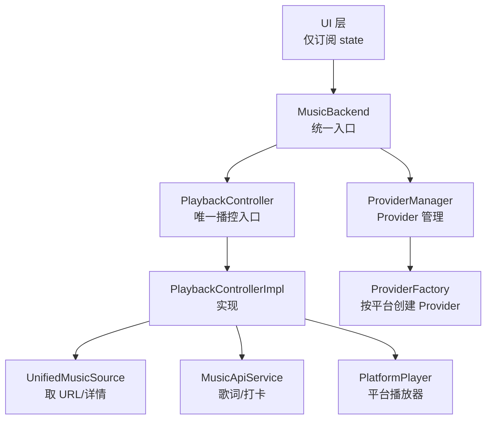
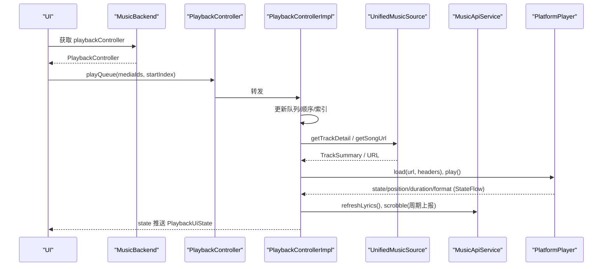
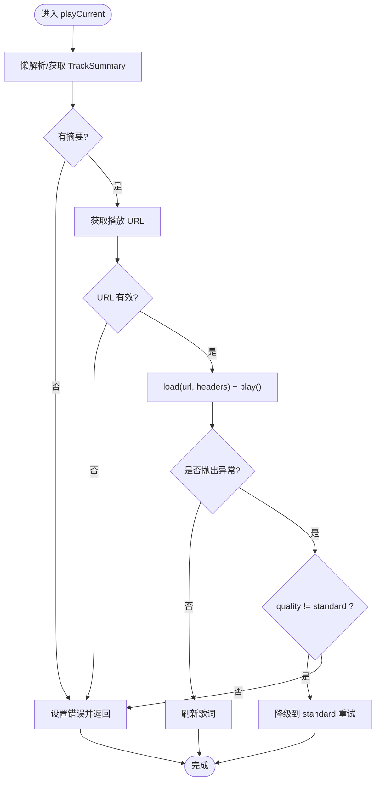
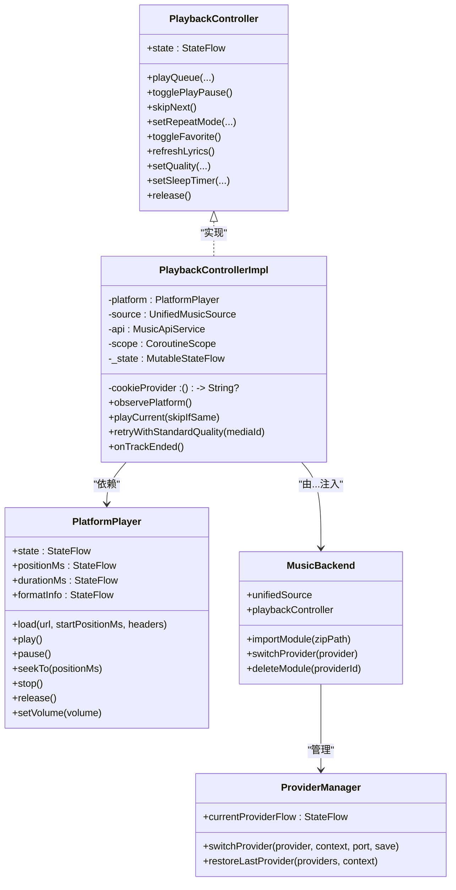
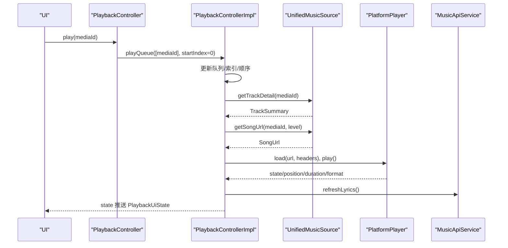
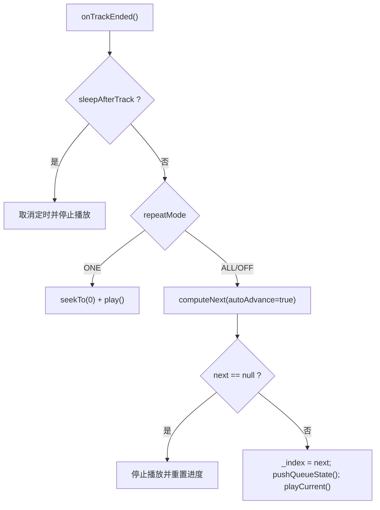

# 组件交互模式

<cite>
**本文引用的文件**
- [PlaybackController.kt](file://kmp-pro/src/commonMain/kotlin/cp/player/kmp/playback/PlaybackController.kt)
- [PlaybackControllerImpl.kt](file://kmp-pro/src/commonMain/kotlin/cp/player/kmp/playback/PlaybackControllerImpl.kt)
- [PlatformPlayer.kt](file://kmp-pro/src/commonMain/kotlin/cp/player/kmp/playback/PlatformPlayer.kt)
- [PlaybackEngine.kt](file://kmp-pro/src/commonMain/kotlin/cp/player/kmp/playback/PlaybackEngine.kt)
- [PlaybackUiState.kt](file://kmp-pro/src/commonMain/kotlin/cp/player/kmp/playback/PlaybackUiState.kt)
- [MusicBackend.kt](file://kmp-pro/src/commonMain/kotlin/cp/player/kmp/MusicBackend.kt)
- [ProviderManager.kt](file://kmp-pro/src/commonMain/kotlin/cp/player/kmp/provider/ProviderManager.kt)
- [ProviderFactory.kt](file://kmp-pro/src/commonMain/kotlin/cp/player/kmp/provider/ProviderFactory.kt)
</cite>

## 目录
1. [简介](#简介)
2. [项目结构](#项目结构)
3. [核心组件](#核心组件)
4. [架构总览](#架构总览)
5. [详细组件分析](#详细组件分析)
6. [依赖关系分析](#依赖关系分析)
7. [性能考量](#性能考量)
8. [故障排查指南](#故障排查指南)
9. [结论](#结论)
10. [附录](#附录)

## 简介
本文档围绕“播放控制唯一入口”的架构设计，系统阐述 PlaybackController 作为前端与播放子系统交互的唯一边界；解释组件间通过依赖注入实现的松耦合；说明基于 StateFlow 的响应式状态管理；并给出事件驱动与观察者模式在系统中的落地方式。文档包含时序图、流程图和类图，帮助读者理解组件通信、异常处理与降级策略在各层间的传递机制。

## 项目结构
本项目采用分层与模块化组织：
- 播放控制层：PlaybackController 接口与其实现 PlaybackControllerImpl，封装队列、播放、歌词、收藏、音质、睡眠定时等能力。
- 平台抽象层：PlatformPlayer 抽象具体平台的播放器行为；PlaybackEngine 提供更高阶的引擎抽象（当前为骨架）。
- 后端统一入口：MusicBackend 聚合 Provider 管理、音乐数据访问、播放控制器创建与生命周期管理。
- Provider 模块：ProviderManager/ProviderFactory 负责音源模块的加载、切换与 Cookie 隔离。

图表来源
- [MusicBackend.kt:140-161](file://kmp-pro/src/commonMain/kotlin/cp/player/kmp/MusicBackend.kt#L140-L161)
- [PlaybackController.kt:6-15](file://kmp-pro/src/commonMain/kotlin/cp/player/kmp/playback/PlaybackController.kt#L6-L15)
- [PlaybackControllerImpl.kt:18-41](file://kmp-pro/src/commonMain/kotlin/cp/player/kmp/playback/PlaybackControllerImpl.kt#L18-L41)
- [PlatformPlayer.kt:16-31](file://kmp-pro/src/commonMain/kotlin/cp/player/kmp/playback/PlatformPlayer.kt#L16-L31)
- [ProviderManager.kt:15-35](file://kmp-pro/src/commonMain/kotlin/cp/player/kmp/provider/ProviderManager.kt#L15-L35)
- [ProviderFactory.kt:1-20](file://kmp-pro/src/commonMain/kotlin/cp/player/kmp/provider/ProviderFactory.kt#L1-L20)

章节来源
- [MusicBackend.kt:30-72](file://kmp-pro/src/commonMain/kotlin/cp/player/kmp/MusicBackend.kt#L30-L72)
- [PlaybackController.kt:6-15](file://kmp-pro/src/commonMain/kotlin/cp/player/kmp/playback/PlaybackController.kt#L6-L15)

## 核心组件
- PlaybackController：定义播放控制的完整能力集，是 UI 的唯一入口，屏蔽底层差异。
- PlaybackControllerImpl：实现队列管理、URL 解析、播放、歌词、收藏、音质、睡眠定时、自动下一首、听歌打卡等。
- PlatformPlayer：平台无关的播放器接口，暴露状态流与基本操作。
- MusicBackend：应用级后端单例，负责初始化、Provider 管理、统一数据访问、播放控制器构造。
- ProviderManager/ProviderFactory：Provider 的加载、切换、Cookie 隔离与平台适配。

章节来源
- [PlaybackController.kt:16-106](file://kmp-pro/src/commonMain/kotlin/cp/player/kmp/playback/PlaybackController.kt#L16-L106)
- [PlaybackControllerImpl.kt:35-92](file://kmp-pro/src/commonMain/kotlin/cp/player/kmp/playback/PlaybackControllerImpl.kt#L35-L92)
- [PlatformPlayer.kt:16-31](file://kmp-pro/src/commonMain/kotlin/cp/player/kmp/playback/PlatformPlayer.kt#L16-L31)
- [MusicBackend.kt:140-161](file://kmp-pro/src/commonMain/kotlin/cp/player/kmp/MusicBackend.kt#L140-L161)
- [ProviderManager.kt:31-109](file://kmp-pro/src/commonMain/kotlin/cp/player/kmp/provider/ProviderManager.kt#L31-L109)
- [ProviderFactory.kt:11-20](file://kmp-pro/src/commonMain/kotlin/cp/player/kmp/provider/ProviderFactory.kt#L11-L20)

## 架构总览
播放控制以“单一入口 + 响应式状态 + 事件驱动”为核心：
- 单一入口：UI 仅调用 PlaybackController，不直接访问 UnifiedMusicSource、PlatformPlayer 或 API。
- 响应式状态：所有 UI 渲染由 PlaybackController.state 的 StateFlow 驱动，内部将平台状态、位置、时长、格式、歌词、错误等折叠进统一的 PlaybackUiState。
- 事件驱动：PlatformPlayer 的状态变化通过 Flow 观察，触发后续动作（如自动下一首、打卡上报、歌词高亮）。
- 松耦合：通过依赖注入将 PlatformPlayer、UnifiedMusicSource、MusicApiService、CookieProvider 注入到 PlaybackControllerImpl，便于替换与测试。

图表来源
- [MusicBackend.kt:140-161](file://kmp-pro/src/commonMain/kotlin/cp/player/kmp/MusicBackend.kt#L140-L161)
- [PlaybackControllerImpl.kt:144-158](file://kmp-pro/src/commonMain/kotlin/cp/player/kmp/playback/PlaybackControllerImpl.kt#L144-L158)
- [PlaybackControllerImpl.kt:496-556](file://kmp-pro/src/commonMain/kotlin/cp/player/kmp/playback/PlaybackControllerImpl.kt#L496-L556)
- [PlaybackControllerImpl.kt:96-127](file://kmp-pro/src/commonMain/kotlin/cp/player/kmp/playback/PlaybackControllerImpl.kt#L96-L127)
- [PlaybackControllerImpl.kt:721-753](file://kmp-pro/src/commonMain/kotlin/cp/player/kmp/playback/PlaybackControllerImpl.kt#L721-L753)

## 详细组件分析

### PlaybackController：播放控制唯一入口
- 职责：对外暴露播放控制方法（播放、暂停、跳转、队列操作、重复/随机、音量、收藏、音质、睡眠定时、歌词刷新），对内协调数据源、API 与平台播放器。
- 设计要点：
  - 禁止 UI 直接访问底层资源与引擎类型，所有差异由接口及其 StateFlow 屏蔽。
  - 暴露 state: StateFlow<PlaybackUiState>，供 UI 直接渲染。
  - 暴露 likedIds: StateFlow<Set<String>>，用于收藏态展示。

章节来源
- [PlaybackController.kt:6-15](file://kmp-pro/src/commonMain/kotlin/cp/player/kmp/playback/PlaybackController.kt#L6-L15)
- [PlaybackController.kt:16-106](file://kmp-pro/src/commonMain/kotlin/cp/player/kmp/playback/PlaybackController.kt#L16-L106)

### PlaybackControllerImpl：核心编排与状态折叠
- 依赖注入：
  - PlatformPlayer：负责实际音频播放与状态输出。
  - UnifiedMusicSource：负责获取曲目详情与播放 URL。
  - MusicApiService：负责歌词获取、收藏切换、听歌打卡。
  - CookieProvider：注入请求头中的 Cookie。
  - CoroutineScope：统一管理协程生命周期。
- 状态管理：
  - 使用 MutableStateFlow 维护 _state，并通过 asStateFlow 暴露只读 StateFlow。
  - 监听 PlatformPlayer 的 state/position/duration/format 流，将其折叠进 PlaybackUiState。
- 队列与播放：
  - 支持 setQueue/playQueue/addToQueue/removeQueueItem/moveQueueItem/playAt。
  - 懒解析 TrackSummary，批量后台解析以提升性能。
  - 自动下一首逻辑依据 RepeatMode 与 shuffle 顺序计算。
- 歌词与收藏：
  - 播放时自动拉取歌词，失败回退为无歌词或错误态。
  - 收藏切换采用乐观更新，失败自动回滚。
- 音质与降级：
  - 可设置 qualityLevel，默认 exhigh。
  - 播放失败时尝试降级到 standard 音质重试一次。
- 睡眠定时：
  - 支持 N 分钟后暂停或“播完当前曲目后暂停”。
- 听歌打卡：
  - 播放中每秒计数，每固定间隔上报一次，失败静默不影响体验。

图表来源
- [PlaybackControllerImpl.kt:496-556](file://kmp-pro/src/commonMain/kotlin/cp/player/kmp/playback/PlaybackControllerImpl.kt#L496-L556)
- [PlaybackControllerImpl.kt:558-575](file://kmp-pro/src/commonMain/kotlin/cp/player/kmp/playback/PlaybackControllerImpl.kt#L558-L575)

章节来源
- [PlaybackControllerImpl.kt:18-41](file://kmp-pro/src/commonMain/kotlin/cp/player/kmp/playback/PlaybackControllerImpl.kt#L18-L41)
- [PlaybackControllerImpl.kt:96-127](file://kmp-pro/src/commonMain/kotlin/cp/player/kmp/playback/PlaybackControllerImpl.kt#L96-L127)
- [PlaybackControllerImpl.kt:144-172](file://kmp-pro/src/commonMain/kotlin/cp/player/kmp/playback/PlaybackControllerImpl.kt#L144-L172)
- [PlaybackControllerImpl.kt:261-315](file://kmp-pro/src/commonMain/kotlin/cp/player/kmp/playback/PlaybackControllerImpl.kt#L261-L315)
- [PlaybackControllerImpl.kt:319-401](file://kmp-pro/src/commonMain/kotlin/cp/player/kmp/playback/PlaybackControllerImpl.kt#L319-L401)
- [PlaybackControllerImpl.kt:405-453](file://kmp-pro/src/commonMain/kotlin/cp/player/kmp/playback/PlaybackControllerImpl.kt#L405-L453)
- [PlaybackControllerImpl.kt:457-481](file://kmp-pro/src/commonMain/kotlin/cp/player/kmp/playback/PlaybackControllerImpl.kt#L457-L481)
- [PlaybackControllerImpl.kt:558-575](file://kmp-pro/src/commonMain/kotlin/cp/player/kmp/playback/PlaybackControllerImpl.kt#L558-L575)
- [PlaybackControllerImpl.kt:577-637](file://kmp-pro/src/commonMain/kotlin/cp/player/kmp/playback/PlaybackControllerImpl.kt#L577-L637)
- [PlaybackControllerImpl.kt:643-694](file://kmp-pro/src/commonMain/kotlin/cp/player/kmp/playback/PlaybackControllerImpl.kt#L643-L694)
- [PlaybackControllerImpl.kt:721-753](file://kmp-pro/src/commonMain/kotlin/cp/player/kmp/playback/PlaybackControllerImpl.kt#L721-L753)

### PlatformPlayer：平台播放器抽象
- 暴露状态流：state、positionMs、durationMs、formatInfo。
- 基本操作：load、play、pause、seekTo、stop、release、setVolume/getVolume。
- 当前实现 AudioPlayerImpl 基于第三方音频库，轮询状态并映射到平台状态。

章节来源
- [PlatformPlayer.kt:16-31](file://kmp-pro/src/commonMain/kotlin/cp/player/kmp/playback/PlatformPlayer.kt#L16-L31)
- [PlatformPlayer.kt:43-131](file://kmp-pro/src/commonMain/kotlin/cp/player/kmp/playback/PlatformPlayer.kt#L43-L131)

### MusicBackend：后端统一入口与依赖注入
- 职责：
  - 初始化 ProviderManager、ModuleManager、MusicApiServiceImpl、缓存。
  - 提供 unifiedSource（统一媒体 ID 路由）、localMusic（本地源占位）。
  - 惰性创建 playbackController，注入 PlatformPlayer、UnifiedMusicSource、MusicApiService、CookieProvider 与应用级 CoroutineScope。
  - 管理 Provider 导入、切换、删除与状态迁移。
- 设计要点：
  - 前端唯一依赖的后端类型，屏蔽内部组件细节。
  - 通过 StateFlow 暴露后端状态机（初始化、就绪、错误、无 Provider）。

章节来源
- [MusicBackend.kt:30-72](file://kmp-pro/src/commonMain/kotlin/cp/player/kmp/MusicBackend.kt#L30-L72)
- [MusicBackend.kt:121-161](file://kmp-pro/src/commonMain/kotlin/cp/player/kmp/MusicBackend.kt#L121-L161)
- [MusicBackend.kt:189-242](file://kmp-pro/src/commonMain/kotlin/cp/player/kmp/MusicBackend.kt#L189-L242)
- [MusicBackend.kt:330-367](file://kmp-pro/src/commonMain/kotlin/cp/player/kmp/MusicBackend.kt#L330-L367)

### ProviderManager/ProviderFactory：模块管理与依赖注入
- ProviderManager：
  - 管理已加载 Provider、当前活跃 Provider、端口分配与服务启停。
  - 通过 StateFlow 暴露 currentProviderFlow，支持添加监听器（观察者模式）。
  - 持久化最近活跃的 Provider ID，启动时恢复。
- ProviderFactory：
  - 根据 manifest 与解压目录创建 BackendProvider，平台期望函数 createJniProvider 负责 JNI Provider 实例化。

章节来源
- [ProviderManager.kt:15-35](file://kmp-pro/src/commonMain/kotlin/cp/player/kmp/provider/ProviderManager.kt#L15-L35)
- [ProviderManager.kt:48-109](file://kmp-pro/src/commonMain/kotlin/cp/player/kmp/provider/ProviderManager.kt#L48-L109)
- [ProviderManager.kt:116-141](file://kmp-pro/src/commonMain/kotlin/cp/player/kmp/provider/ProviderManager.kt#L116-L141)
- [ProviderFactory.kt:1-20](file://kmp-pro/src/commonMain/kotlin/cp/player/kmp/provider/ProviderFactory.kt#L1-L20)

## 依赖关系分析
- 松耦合与依赖注入：
  - PlaybackControllerImpl 通过构造函数注入 PlatformPlayer、UnifiedMusicSource、MusicApiService、CookieProvider、CoroutineScope，避免硬编码依赖。
  - MusicBackend 负责组装这些依赖，并在应用生命周期内管理其生命周期。
- 组件耦合度：
  - UI 仅依赖 PlaybackController 与 StateFlow，对底层实现完全解耦。
  - ProviderManager 与 ModuleManager 解耦 Provider 的具体实现，通过接口与工厂创建。
- 外部依赖：
  - 第三方音频库（AudioPlayer）被封装在 PlatformPlayer 内部，对外暴露稳定接口。
  - HTTP/网络相关通过 MusicApiService 与缓存层统一处理。

图表来源
- [PlaybackController.kt:16-106](file://kmp-pro/src/commonMain/kotlin/cp/player/kmp/playback/PlaybackController.kt#L16-L106)
- [PlaybackControllerImpl.kt:35-41](file://kmp-pro/src/commonMain/kotlin/cp/player/kmp/playback/PlaybackControllerImpl.kt#L35-L41)
- [PlatformPlayer.kt:16-31](file://kmp-pro/src/commonMain/kotlin/cp/player/kmp/playback/PlatformPlayer.kt#L16-L31)
- [MusicBackend.kt:140-161](file://kmp-pro/src/commonMain/kotlin/cp/player/kmp/MusicBackend.kt#L140-L161)
- [ProviderManager.kt:31-109](file://kmp-pro/src/commonMain/kotlin/cp/player/kmp/provider/ProviderManager.kt#L31-L109)

章节来源
- [PlaybackControllerImpl.kt:35-41](file://kmp-pro/src/commonMain/kotlin/cp/player/kmp/playback/PlaybackControllerImpl.kt#L35-L41)
- [MusicBackend.kt:140-161](file://kmp-pro/src/commonMain/kotlin/cp/player/kmp/MusicBackend.kt#L140-L161)
- [ProviderManager.kt:31-109](file://kmp-pro/src/commonMain/kotlin/cp/player/kmp/provider/ProviderManager.kt#L31-L109)

## 性能考量
- 懒解析与批量解析：
  - 队列条目 Entry 的 summary 延迟解析，减少不必要的网络请求。
  - resolveQueueInBackground 按距离当前曲目的远近分批解析，提升首屏与切换速度。
- 状态折叠与最小化重绘：
  - 将平台状态、位置、时长、格式、歌词、错误等折叠进 PlaybackUiState，UI 仅订阅该状态，避免多次更新。
- 协程与并发控制：
  - 使用 Mutex 保护队列导航变更，避免竞态。
  - 使用 Job 管理加载、歌词、打卡、睡眠定时等任务，确保取消与释放。
- 网络与降级：
  - 播放失败时自动降级到 standard 音质重试一次，提高兼容性。
  - 听歌打卡失败静默处理，不影响主流程。

章节来源
- [PlaybackControllerImpl.kt:48-69](file://kmp-pro/src/commonMain/kotlin/cp/player/kmp/playback/PlaybackControllerImpl.kt#L48-L69)
- [PlaybackControllerImpl.kt:643-694](file://kmp-pro/src/commonMain/kotlin/cp/player/kmp/playback/PlaybackControllerImpl.kt#L643-L694)
- [PlaybackControllerImpl.kt:558-575](file://kmp-pro/src/commonMain/kotlin/cp/player/kmp/playback/PlaybackControllerImpl.kt#L558-L575)
- [PlaybackControllerImpl.kt:721-753](file://kmp-pro/src/commonMain/kotlin/cp/player/kmp/playback/PlaybackControllerImpl.kt#L721-L753)

## 故障排查指南
- 播放失败与降级：
  - 现象：无法获取播放地址或加载失败。
  - 处理：若 qualityLevel 非 standard，则降级到 standard 重试一次；仍失败则设置 error 状态。
  - 参考路径：[PlaybackControllerImpl.kt:525-556](file://kmp-pro/src/commonMain/kotlin/cp/player/kmp/playback/PlaybackControllerImpl.kt#L525-L556)、[PlaybackControllerImpl.kt:558-575](file://kmp-pro/src/commonMain/kotlin/cp/player/kmp/playback/PlaybackControllerImpl.kt#L558-L575)
- 歌词获取失败：
  - 现象：歌词为空或网络异常。
  - 处理：设置为 LyricsState.NoLyrics 或 Error，activeLyricIndex 重置为 -1。
  - 参考路径：[PlaybackControllerImpl.kt:457-481](file://kmp-pro/src/commonMain/kotlin/cp/player/kmp/playback/PlaybackControllerImpl.kt#L457-L481)
- 收藏状态不一致：
  - 现象：切换收藏后状态回滚。
  - 处理：先乐观更新，再调用 API；失败则回滚到之前状态。
  - 参考路径：[PlaybackControllerImpl.kt:324-345](file://kmp-pro/src/commonMain/kotlin/cp/player/kmp/playback/PlaybackControllerImpl.kt#L324-L345)
- Provider 切换失败：
  - 现象：切换后仍显示未就绪或报错。
  - 处理：检查端口占用、服务启动异常；状态迁移到 Error 并记录 lastLoadError。
  - 参考路径：[MusicBackend.kt:273-293](file://kmp-pro/src/commonMain/kotlin/cp/player/kmp/MusicBackend.kt#L273-L293)、[ProviderManager.kt:80-109](file://kmp-pro/src/commonMain/kotlin/cp/player/kmp/provider/ProviderManager.kt#L80-L109)
- 听歌打卡失败：
  - 现象：后台上报失败。
  - 处理：静默忽略，不影响播放体验。
  - 参考路径：[PlaybackControllerImpl.kt:736-753](file://kmp-pro/src/commonMain/kotlin/cp/player/kmp/playback/PlaybackControllerImpl.kt#L736-L753)

章节来源
- [PlaybackControllerImpl.kt:525-575](file://kmp-pro/src/commonMain/kotlin/cp/player/kmp/playback/PlaybackControllerImpl.kt#L525-L575)
- [PlaybackControllerImpl.kt:457-481](file://kmp-pro/src/commonMain/kotlin/cp/player/kmp/playback/PlaybackControllerImpl.kt#L457-L481)
- [PlaybackControllerImpl.kt:324-345](file://kmp-pro/src/commonMain/kotlin/cp/player/kmp/playback/PlaybackControllerImpl.kt#L324-L345)
- [MusicBackend.kt:273-293](file://kmp-pro/src/commonMain/kotlin/cp/player/kmp/MusicBackend.kt#L273-L293)
- [ProviderManager.kt:80-109](file://kmp-pro/src/commonMain/kotlin/cp/player/kmp/provider/ProviderManager.kt#L80-L109)
- [PlaybackControllerImpl.kt:736-753](file://kmp-pro/src/commonMain/kotlin/cp/player/kmp/playback/PlaybackControllerImpl.kt#L736-L753)

## 结论
本架构通过 PlaybackController 作为播放控制唯一入口，结合依赖注入与 StateFlow 响应式状态管理，实现了 UI 与底层播放引擎、数据源的松耦合。事件驱动与观察者模式贯穿 Provider 切换与平台状态流转，异常处理与降级策略保障了播放体验的稳定性。整体设计清晰、可扩展性强，适合跨平台 KMP 项目的长期演进。

## 附录

### 关键时序图：播放一首歌曲

图表来源
- [PlaybackController.kt:22-28](file://kmp-pro/src/commonMain/kotlin/cp/player/kmp/playback/PlaybackController.kt#L22-L28)
- [PlaybackControllerImpl.kt:144-158](file://kmp-pro/src/commonMain/kotlin/cp/player/kmp/playback/PlaybackControllerImpl.kt#L144-L158)
- [PlaybackControllerImpl.kt:496-556](file://kmp-pro/src/commonMain/kotlin/cp/player/kmp/playback/PlaybackControllerImpl.kt#L496-L556)
- [PlaybackControllerImpl.kt:96-127](file://kmp-pro/src/commonMain/kotlin/cp/player/kmp/playback/PlaybackControllerImpl.kt#L96-L127)
- [PlaybackControllerImpl.kt:457-481](file://kmp-pro/src/commonMain/kotlin/cp/player/kmp/playback/PlaybackControllerImpl.kt#L457-L481)

### 关键流程图：自动下一首与循环模式

图表来源
- [PlaybackControllerImpl.kt:577-602](file://kmp-pro/src/commonMain/kotlin/cp/player/kmp/playback/PlaybackControllerImpl.kt#L577-L602)
- [PlaybackControllerImpl.kt:604-633](file://kmp-pro/src/commonMain/kotlin/cp/player/kmp/playback/PlaybackControllerImpl.kt#L604-L633)