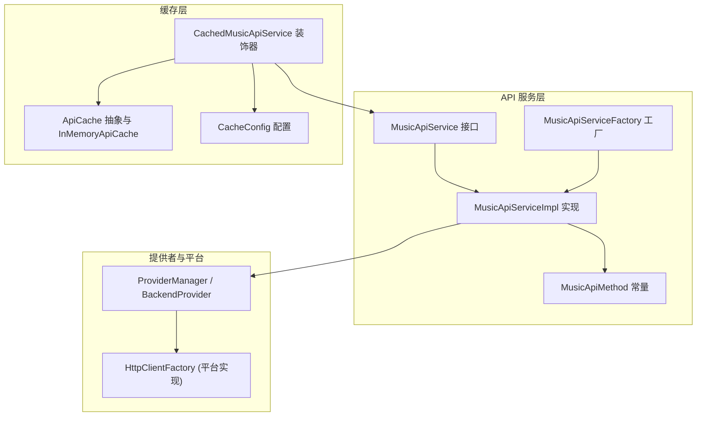
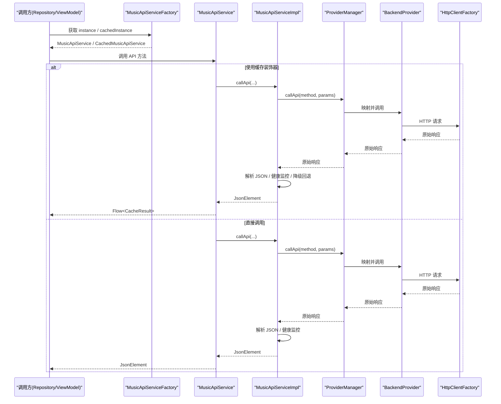
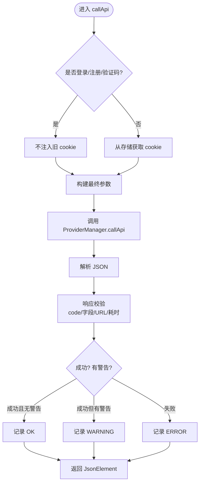
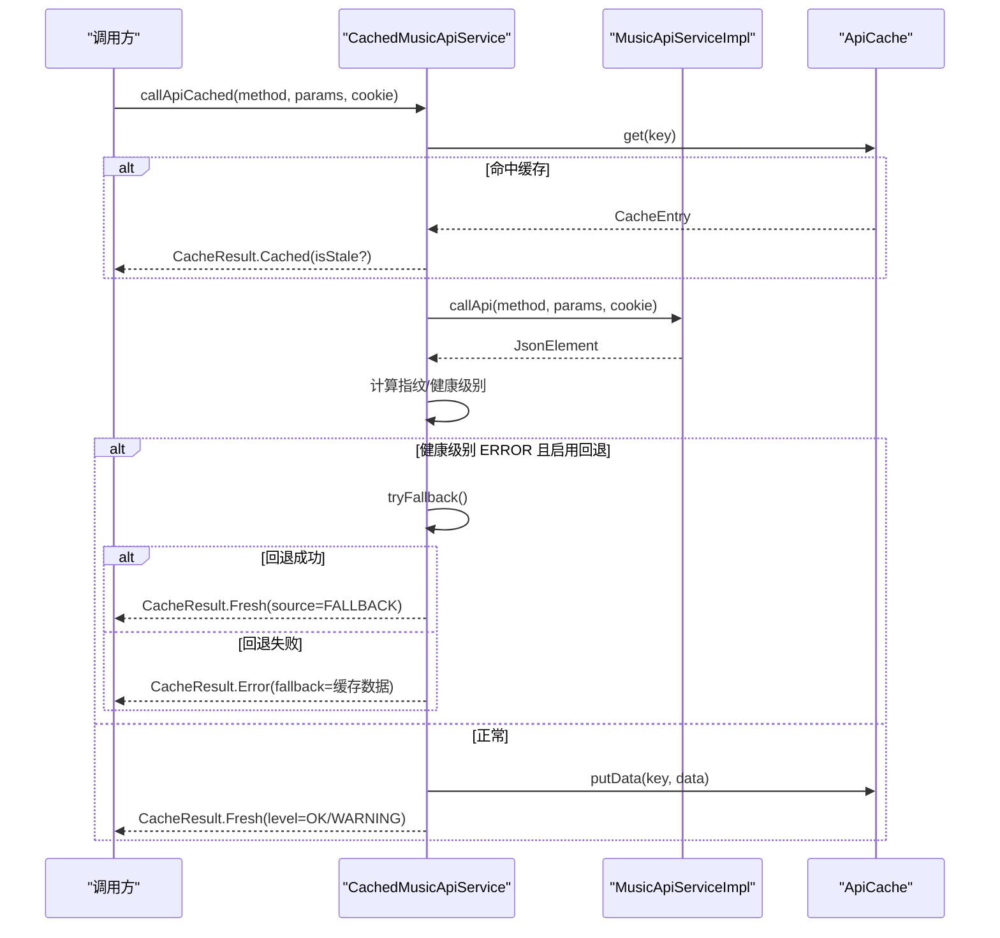
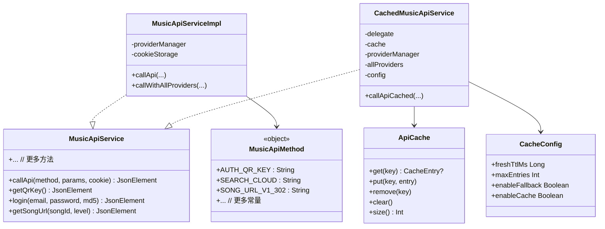

# API 服务层

<cite>
**本文引用的文件**
- [MusicApiService.kt](file://kmp-pro/src/commonMain/kotlin/cp/player/kmp/api/MusicApiService.kt)
- [MusicApiServiceImpl.kt](file://kmp-pro/src/commonMain/kotlin/cp/player/kmp/api/MusicApiServiceImpl.kt)
- [MusicApiMethod.kt](file://kmp-pro/src/commonMain/kotlin/cp/player/kmp/api/MusicApiMethod.kt)
- [MusicApiServiceFactory.kt](file://kmp-pro/src/commonMain/kotlin/cp/player/kmp/api/MusicApiServiceFactory.kt)
- [CachedMusicApiService.kt](file://kmp-pro/src/commonMain/kotlin/cp/player/kmp/cache/CachedMusicApiService.kt)
- [ApiCache.kt](file://kmp-pro/src/commonMain/kotlin/cp/player/kmp/cache/ApiCache.kt)
- [CacheConfig.kt](file://kmp-pro/src/commonMain/kotlin/cp/player/kmp/cache/CacheConfig.kt)
- [Song.kt](file://kmp-pro/src/commonMain/kotlin/cp/player/kmp/model/Song.kt)
- [Playlist.kt](file://kmp-pro/src/commonMain/kotlin/cp/player/kmp/model/Playlist.kt)
- [HttpClientFactory.kt](file://kmp-pro/src/commonMain/kotlin/cp/player/kmp/util/HttpClientFactory.kt)
</cite>

## 目录
1. [简介](#简介)
2. [项目结构](#项目结构)
3. [核心组件](#核心组件)
4. [架构总览](#架构总览)
5. [详细组件分析](#详细组件分析)
6. [依赖关系分析](#依赖关系分析)
7. [性能考量](#性能考量)
8. [故障排查指南](#故障排查指南)
9. [结论](#结论)
10. [附录：API 方法与使用示例](#附录api-方法与使用示例)

## 简介
本技术文档面向 CPPlayer-KMP 的 API 服务层，聚焦 MusicApiService 接口的设计理念与实现架构，系统说明网络请求封装、错误处理机制、重试策略、缓存集成与数据一致性保证。同时提供各 API 方法的功能描述、参数定义、返回类型与调用示例，帮助开发者快速、安全地接入音乐后端能力。

## 项目结构
API 服务层位于 kmp-pro 模块的 commonMain 中，采用“接口 + 默认实现 + 工厂 + 缓存装饰器”的分层组织方式：
- 接口层：统一对外暴露的 MusicApiService 接口，按业务域划分方法（认证、用户、歌单、播放、社交、推荐等）。
- 实现层：MusicApiServiceImpl 负责将接口调用委托给 ProviderManager，并注入 Cookie、解析响应、健康监控与降级回退。
- 常量层：MusicApiMethod 集中管理所有后端 API 路径常量，避免裸字符串。
- 工厂层：MusicApiServiceFactory 提供全局初始化与实例访问，内部委托 MusicBackend。
- 缓存层：CachedMusicApiService 对 MusicApiService 进行装饰，提供“先缓存后网络”的 Flow 式结果流；配合 ApiCache 与 CacheConfig 控制缓存行为。

图表来源
- [MusicApiService.kt:1-528](file://kmp-pro/src/commonMain/kotlin/cp/player/kmp/api/MusicApiService.kt#L1-L528)
- [MusicApiServiceImpl.kt:1-714](file://kmp-pro/src/commonMain/kotlin/cp/player/kmp/api/MusicApiServiceImpl.kt#L1-L714)
- [MusicApiMethod.kt:1-458](file://kmp-pro/src/commonMain/kotlin/cp/player/kmp/api/MusicApiMethod.kt#L1-L458)
- [MusicApiServiceFactory.kt:1-57](file://kmp-pro/src/commonMain/kotlin/cp/player/kmp/api/MusicApiServiceFactory.kt#L1-L57)
- [CachedMusicApiService.kt:1-219](file://kmp-pro/src/commonMain/kotlin/cp/player/kmp/cache/CachedMusicApiService.kt#L1-L219)
- [ApiCache.kt:1-67](file://kmp-pro/src/commonMain/kotlin/cp/player/kmp/cache/ApiCache.kt#L1-L67)
- [CacheConfig.kt:1-16](file://kmp-pro/src/commonMain/kotlin/cp/player/kmp/cache/CacheConfig.kt#L1-L16)
- [HttpClientFactory.kt:1-10](file://kmp-pro/src/commonMain/kotlin/cp/player/kmp/util/HttpClientFactory.kt#L1-L10)

章节来源
- [MusicApiService.kt:1-528](file://kmp-pro/src/commonMain/kotlin/cp/player/kmp/api/MusicApiService.kt#L1-L528)
- [MusicApiServiceImpl.kt:1-714](file://kmp-pro/src/commonMain/kotlin/cp/player/kmp/api/MusicApiServiceImpl.kt#L1-L714)
- [MusicApiMethod.kt:1-458](file://kmp-pro/src/commonMain/kotlin/cp/player/kmp/api/MusicApiMethod.kt#L1-L458)
- [MusicApiServiceFactory.kt:1-57](file://kmp-pro/src/commonMain/kotlin/cp/player/kmp/api/MusicApiServiceFactory.kt#L1-L57)
- [CachedMusicApiService.kt:1-219](file://kmp-pro/src/commonMain/kotlin/cp/player/kmp/cache/CachedMusicApiService.kt#L1-L219)
- [ApiCache.kt:1-67](file://kmp-pro/src/commonMain/kotlin/cp/player/kmp/cache/ApiCache.kt#L1-L67)
- [CacheConfig.kt:1-16](file://kmp-pro/src/commonMain/kotlin/cp/player/kmp/cache/CacheConfig.kt#L1-L16)
- [HttpClientFactory.kt:1-10](file://kmp-pro/src/commonMain/kotlin/cp/player/kmp/util/HttpClientFactory.kt#L1-L10)

## 核心组件
- MusicApiService：统一的音乐 API 服务接口，覆盖认证、用户、歌单、专辑、歌手、搜索、播放、社交、排行榜、推荐、MV、视频、电台、云盘等全部能力。所有方法均为 suspend 函数，返回 JsonElement，由上层 Repository 解析为领域模型。
- MusicApiServiceImpl：默认实现，负责：
  - 自动注入 Cookie（登录相关接口特殊处理）
  - 通过 ProviderManager 调用具体后端
  - 响应解析与健康监控（三级分类：OK/WARNING/ERROR）
  - URL 类端点的容错与回退（如 song/url/v1/302 失败回退到 v1）
  - 多 Provider 容灾（callWithAllProviders）
- MusicApiMethod：集中管理所有后端 API 路径常量，禁止裸字符串。
- MusicApiServiceFactory：全局初始化与实例获取，内部委托 MusicBackend。
- CachedMusicApiService：对 MusicApiService 的装饰器，提供带缓存的 Flow 式调用，支持新鲜度 TTL、指纹比对、多 Provider 容灾回退。
- ApiCache：缓存抽象与进程内 LRU 实现 InMemoryApiCache。
- CacheConfig：缓存开关、新鲜度阈值、最大条目数、是否启用回退等配置。

章节来源
- [MusicApiService.kt:1-528](file://kmp-pro/src/commonMain/kotlin/cp/player/kmp/api/MusicApiService.kt#L1-L528)
- [MusicApiServiceImpl.kt:1-714](file://kmp-pro/src/commonMain/kotlin/cp/player/kmp/api/MusicApiServiceImpl.kt#L1-L714)
- [MusicApiMethod.kt:1-458](file://kmp-pro/src/commonMain/kotlin/cp/player/kmp/api/MusicApiMethod.kt#L1-L458)
- [MusicApiServiceFactory.kt:1-57](file://kmp-pro/src/commonMain/kotlin/cp/player/kmp/api/MusicApiServiceFactory.kt#L1-L57)
- [CachedMusicApiService.kt:1-219](file://kmp-pro/src/commonMain/kotlin/cp/player/kmp/cache/CachedMusicApiService.kt#L1-L219)
- [ApiCache.kt:1-67](file://kmp-pro/src/commonMain/kotlin/cp/player/kmp/cache/ApiCache.kt#L1-L67)
- [CacheConfig.kt:1-16](file://kmp-pro/src/commonMain/kotlin/cp/player/kmp/cache/CacheConfig.kt#L1-L16)

## 架构总览
API 服务层采用“接口 + 实现 + 装饰器 + 工厂”的组合模式，结合 ProviderManager 的多后端能力，形成高可用、可观测、可扩展的网络调用体系。

图表来源
- [MusicApiServiceFactory.kt:1-57](file://kmp-pro/src/commonMain/kotlin/cp/player/kmp/api/MusicApiServiceFactory.kt#L1-L57)
- [MusicApiServiceImpl.kt:1-714](file://kmp-pro/src/commonMain/kotlin/cp/player/kmp/api/MusicApiServiceImpl.kt#L1-L714)
- [CachedMusicApiService.kt:1-219](file://kmp-pro/src/commonMain/kotlin/cp/player/kmp/cache/CachedMusicApiService.kt#L1-L219)
- [HttpClientFactory.kt:1-10](file://kmp-pro/src/commonMain/kotlin/cp/player/kmp/util/HttpClientFactory.kt#L1-L10)

## 详细组件分析

### MusicApiService 接口设计
- 设计理念
  - 单一入口：所有音乐 API 调用必须通过此接口，禁止直接调用 ProviderManager。
  - 统一返回：所有方法返回 JsonElement，由调用方解析为领域模型，保持跨平台通用性。
  - 自动注入 Cookie：调用方无需手动传递 cookie，实现层根据方法类型自动注入或忽略。
  - 错误统一：异常或非法响应统一以 {"code": 500, "msg": "..."} 形式返回，便于上层统一处理。
  - 协程友好：所有方法均为 suspend fun，内部在 IO 线程执行网络调用。
- 方法分组
  - 通用：callApi
  - 认证：扫码登录、邮箱/手机登录、验证码、登出、游客登录、登录状态
  - 用户：歌单列表、详情、云盘、喜欢列表、推荐等
  - 歌单：详情、曲目、增删、创建、删除、收藏
  - 专辑/歌手：详情、歌曲、专辑列表
  - 搜索：云搜索、热搜、建议
  - 播放：URL（302 优先）、下载 URL、详情、私人 FM、智能列表、歌词、打卡
  - 社交：评论、消息、私信
  - 排行榜/推荐：榜单、精选、Banner、历史日推
  - MV/视频/电台：详情、播放地址、列表、收藏
  - 扩展：数字专辑、歌手扩展、用户扩展、歌单扩展、云盘扩展
  - 其他：检查可用性、批量、日历、动态、分享等

章节来源
- [MusicApiService.kt:1-528](file://kmp-pro/src/commonMain/kotlin/cp/player/kmp/api/MusicApiService.kt#L1-L528)

### MusicApiServiceImpl 实现细节
- 网络请求封装
  - 通过 ProviderManager.callApi 将请求委派给当前活跃 Provider。
  - 自动注入 Cookie：除登录/注册/验证码等动作接口外，其余接口若未显式传入 cookie，则从 ProviderCookieStorage 获取当前 provider 的 cookie 并注入。
  - 时间戳注入：部分接口（如个人 FM）会注入 timestamp 参数。
- 响应解析与健康监控
  - 使用宽松 JSON 解析器（忽略未知键、严格模式放宽），捕获解析异常并统一返回 code=500。
  - 对每个调用记录 HealthMonitor.ApiCallRecord，包含成功与否、耗时、级别（OK/WARNING/ERROR）、错误码、错误信息、期望字段、原始响应等。
  - 响应校验：检查 code、期望数据字段、空数组/对象、URL 字段、慢响应（>5s）等，生成警告项。
- 重试与降级策略
  - 歌曲 URL 获取：优先尝试 302 重定向版本（song/url/v1/302），若无有效 URL，自动回退到普通版本（song/url/v1），并记录降级日志。
  - 多 Provider 容灾：callWithAllProviders 依次尝试所有已加载 Provider，首次成功即返回；每次尝试最多两次，间隔短暂延迟。
- 工具方法
  - extractUrl/findUrlRecursive：递归查找 JSON 中的 http(s) URL。
  - typeToCode：资源类型到后端编码的转换。
  - now：跨平台毫秒时间戳。

图表来源
- [MusicApiServiceImpl.kt:35-101](file://kmp-pro/src/commonMain/kotlin/cp/player/kmp/api/MusicApiServiceImpl.kt#L35-L101)
- [MusicApiServiceImpl.kt:481-658](file://kmp-pro/src/commonMain/kotlin/cp/player/kmp/api/MusicApiServiceImpl.kt#L481-L658)

章节来源
- [MusicApiServiceImpl.kt:1-714](file://kmp-pro/src/commonMain/kotlin/cp/player/kmp/api/MusicApiServiceImpl.kt#L1-L714)

### 缓存层集成与数据一致性
- 缓存策略
  - 仅对幂等的读类接口缓存（如歌曲详情、歌单详情、搜索、榜单等），写/动作类接口直通网络。
  - 缓存键：providerId#method#sortedParams#cookieHash，确保不同 provider、方法、参数和会话隔离。
  - 新鲜度 TTL：超过 freshTtlMs 视为 stale，但仍先返回缓存，后台拉取新数据。
- 异步流程
  - 先发射缓存（若有），再后台调用底层 MusicApiService。
  - 计算新响应指纹，与缓存指纹比较：相同且非 ERROR → 发射 NoChange；不同 → 发射 Fresh 并写回缓存。
  - 健康监控 ERROR 时，若启用回退，则尝试其它 Provider 获取数据，成功后标记 FALLBACK。
- 数据一致性
  - 指纹比对避免重复写入。
  - 错误时保留 fallback（缓存数据）作为兜底。
  - 通过 CacheConfig.enableCache 总开关控制是否启用缓存。

图表来源
- [CachedMusicApiService.kt:60-140](file://kmp-pro/src/commonMain/kotlin/cp/player/kmp/cache/CachedMusicApiService.kt#L60-L140)
- [ApiCache.kt:1-67](file://kmp-pro/src/commonMain/kotlin/cp/player/kmp/cache/ApiCache.kt#L1-L67)
- [CacheConfig.kt:1-16](file://kmp-pro/src/commonMain/kotlin/cp/player/kmp/cache/CacheConfig.kt#L1-L16)

章节来源
- [CachedMusicApiService.kt:1-219](file://kmp-pro/src/commonMain/kotlin/cp/player/kmp/cache/CachedMusicApiService.kt#L1-L219)
- [ApiCache.kt:1-67](file://kmp-pro/src/commonMain/kotlin/cp/player/kmp/cache/ApiCache.kt#L1-L67)
- [CacheConfig.kt:1-16](file://kmp-pro/src/commonMain/kotlin/cp/player/kmp/cache/CacheConfig.kt#L1-L16)

### 错误处理机制
- 统一错误格式：解析异常或非法响应统一返回 {"code": 500, "msg": "..."}。
- 健康监控分级：
  - OK：无警告，成功。
  - WARNING：成功但存在警告（如缺少期望字段、空数组/对象、慢响应）。
  - ERROR：失败或严重问题（如不支持、异常 code、缺失关键 URL）。
- 降级与回退：
  - 歌曲 URL 优先 302，失败回退 v1。
  - 缓存层在 ERROR 时尝试其它 Provider 回退。
- 告警收集：缓存层从 HealthMonitor 收集最近警告，附加到 Fresh 结果中供上层展示。

章节来源
- [MusicApiServiceImpl.kt:53-101](file://kmp-pro/src/commonMain/kotlin/cp/player/kmp/api/MusicApiServiceImpl.kt#L53-L101)
- [MusicApiServiceImpl.kt:594-658](file://kmp-pro/src/commonMain/kotlin/cp/player/kmp/api/MusicApiServiceImpl.kt#L594-L658)
- [CachedMusicApiService.kt:90-140](file://kmp-pro/src/commonMain/kotlin/cp/player/kmp/cache/CachedMusicApiService.kt#L90-L140)

### 重试策略
- 内置重试：callWithAllProviders 对每个 Provider 最多尝试两次，间隔短暂延迟。
- 外部重试：建议在调用方（Repository/ViewModel）对关键接口增加指数退避重试，结合缓存层的 fallback 提升鲁棒性。
- 回退优先级：当前 Provider → 其它 Provider（按顺序），优先返回第一个成功结果。

章节来源
- [MusicApiServiceImpl.kt:437-479](file://kmp-pro/src/commonMain/kotlin/cp/player/kmp/api/MusicApiServiceImpl.kt#L437-L479)
- [CachedMusicApiService.kt:149-180](file://kmp-pro/src/commonMain/kotlin/cp/player/kmp/cache/CachedMusicApiService.kt#L149-L180)

## 依赖关系分析
- 组件耦合
  - MusicApiServiceImpl 依赖 ProviderManager、ProviderCookieStorage、HealthMonitor、MusicApiMethod。
  - CachedMusicApiService 依赖 MusicApiService、ApiCache、ProviderManager、HealthMonitor、CacheConfig。
  - MusicApiServiceFactory 依赖 MusicBackend（统一封装状态机、Provider 管理、本地音乐与播放引擎入口）。
- 外部依赖
  - HttpClientFactory：平台侧实现 Ktor HttpClient，commonMain 仅声明 expect。
- 潜在循环依赖
  - 当前结构清晰，未见循环依赖。
- 接口契约
  - MusicApiService 定义稳定契约，实现与缓存装饰器均遵循该契约，便于替换与扩展。

图表来源
- [MusicApiService.kt:1-528](file://kmp-pro/src/commonMain/kotlin/cp/player/kmp/api/MusicApiService.kt#L1-L528)
- [MusicApiServiceImpl.kt:1-714](file://kmp-pro/src/commonMain/kotlin/cp/player/kmp/api/MusicApiServiceImpl.kt#L1-L714)
- [CachedMusicApiService.kt:1-219](file://kmp-pro/src/commonMain/kotlin/cp/player/kmp/cache/CachedMusicApiService.kt#L1-L219)
- [ApiCache.kt:1-67](file://kmp-pro/src/commonMain/kotlin/cp/player/kmp/cache/ApiCache.kt#L1-L67)
- [CacheConfig.kt:1-16](file://kmp-pro/src/commonMain/kotlin/cp/player/kmp/cache/CacheConfig.kt#L1-L16)
- [MusicApiMethod.kt:1-458](file://kmp-pro/src/commonMain/kotlin/cp/player/kmp/api/MusicApiMethod.kt#L1-L458)

章节来源
- [MusicApiService.kt:1-528](file://kmp-pro/src/commonMain/kotlin/cp/player/kmp/api/MusicApiService.kt#L1-L528)
- [MusicApiServiceImpl.kt:1-714](file://kmp-pro/src/commonMain/kotlin/cp/player/kmp/api/MusicApiServiceImpl.kt#L1-L714)
- [CachedMusicApiService.kt:1-219](file://kmp-pro/src/commonMain/kotlin/cp/player/kmp/cache/CachedMusicApiService.kt#L1-L219)
- [ApiCache.kt:1-67](file://kmp-pro/src/commonMain/kotlin/cp/player/kmp/cache/ApiCache.kt#L1-L67)
- [CacheConfig.kt:1-16](file://kmp-pro/src/commonMain/kotlin/cp/player/kmp/cache/CacheConfig.kt#L1-L16)
- [MusicApiMethod.kt:1-458](file://kmp-pro/src/commonMain/kotlin/cp/player/kmp/api/MusicApiMethod.kt#L1-L458)

## 性能考量
- 网络优化
  - 优先使用 302 重定向 URL，减少中间跳转开销。
  - 合理设置 freshTtlMs，平衡实时性与缓存命中率。
  - 限制内存缓存大小（maxEntries），避免 OOM。
- 并发与线程
  - 所有 API 方法为 suspend，适合协程并发调用；注意在 Repository 层控制并发度。
- 健康监控
  - 通过 HealthMonitor 记录每次调用的耗时与级别，便于定位慢接口与不稳定 Provider。
- 回退与容灾
  - 启用 enableFallback，在 ERROR 时自动尝试其它 Provider，提升可用性。

[本节为通用指导，不直接分析具体文件]

## 故障排查指南
- 常见问题
  - JSON 解析失败：检查后端返回是否为合法 JSON；实现层已捕获并返回 code=500。
  - 缺少期望字段：查看 HealthMonitor 记录的 ResponseWarning，确认后端响应结构变化。
  - 慢响应：关注 >5s 的警告，考虑优化网络或切换 Provider。
  - 登录态失效：检查 Cookie 注入逻辑与 ProviderCookieStorage 是否正确。
- 调试建议
  - 开启缓存并观察 CacheResult 的 source（CACHE/FRESH/FALLBACK）与 isStale。
  - 使用 HealthMonitor 最近记录过滤 method，定位特定接口的告警。
  - 对于歌曲 URL，分别测试 302 与普通版本，确认回退路径是否生效。

章节来源
- [MusicApiServiceImpl.kt:53-101](file://kmp-pro/src/commonMain/kotlin/cp/player/kmp/api/MusicApiServiceImpl.kt#L53-L101)
- [MusicApiServiceImpl.kt:594-658](file://kmp-pro/src/commonMain/kotlin/cp/player/kmp/api/MusicApiServiceImpl.kt#L594-L658)
- [CachedMusicApiService.kt:90-140](file://kmp-pro/src/commonMain/kotlin/cp/player/kmp/cache/CachedMusicApiService.kt#L90-L140)

## 结论
CPPlayer-KMP 的 API 服务层通过清晰的接口设计、健壮的默认实现、完善的缓存装饰器与多 Provider 容灾机制，提供了高可用、可观测、易扩展的音乐后端能力。开发者应优先通过 MusicApiService 调用，结合缓存层与 HealthMonitor 进行性能优化与故障排查，并在必要时自定义 ApiCache 实现以满足持久化需求。

[本节为总结，不直接分析具体文件]

## 附录：API 方法与使用示例

### 认证相关
- getQrKey：获取扫码登录二维码 key
  - 参数：无
  - 返回：JsonElement
  - 示例：调用后获取 key，用于前端展示二维码
- createQrCode(key)：创建二维码图片
  - 参数：key
  - 返回：JsonElement
- checkQrStatus(key)：检查扫码登录状态
  - 参数：key
  - 返回：JsonElement
- login(email, password, md5)：邮箱登录
  - 参数：email, password, md5（可选）
  - 返回：JsonElement
- loginWithPhone(phone, password, captcha, md5)：手机号登录
  - 参数：phone, password, captcha（可选）, md5（可选）
  - 返回：JsonElement
- sendCaptcha(phone)：发送验证码
  - 参数：phone
  - 返回：JsonElement
- logout()：登出
  - 参数：无
  - 返回：JsonElement
- loginAnonymous()：游客登录
  - 参数：无
  - 返回：JsonElement
- getLoginStatus(cookie)：获取登录状态
  - 参数：cookie（可选）
  - 返回：JsonElement

章节来源
- [MusicApiService.kt:44-75](file://kmp-pro/src/commonMain/kotlin/cp/player/kmp/api/MusicApiService.kt#L44-L75)
- [MusicApiServiceImpl.kt:105-126](file://kmp-pro/src/commonMain/kotlin/cp/player/kmp/api/MusicApiServiceImpl.kt#L105-L126)
- [MusicApiMethod.kt:18-43](file://kmp-pro/src/commonMain/kotlin/cp/player/kmp/api/MusicApiMethod.kt#L18-L43)

### 用户相关
- getUserPlaylists(uid)：获取用户歌单列表
  - 参数：uid
  - 返回：JsonElement
- getUserCreatedPlaylists(uid)：获取用户创建的歌单列表
  - 参数：uid
  - 返回：JsonElement
- getUserCollectedPlaylists(uid)：获取用户收藏的歌单列表
  - 参数：uid
  - 返回：JsonElement
- getUserDetail(uid)：获取用户详情
  - 参数：uid
  - 返回：JsonElement
- getUserCloud(limit, offset)：获取用户云盘歌曲
  - 参数：limit, offset
  - 返回：JsonElement
- getLikeList(uid)：获取喜欢的音乐 ID 列表
  - 参数：uid
  - 返回：JsonElement
- likeSong(id, like)：喜欢/取消喜欢歌曲
  - 参数：id, like
  - 返回：JsonElement
- getRecommendedSongs()：获取每日推荐歌曲
  - 参数：无
  - 返回：JsonElement
- getRecommendedPlaylists()：获取推荐歌单
  - 参数：无
  - 返回：JsonElement
- dislikeSong(id)：不喜欢推荐歌曲
  - 参数：id
  - 返回：JsonElement

章节来源
- [MusicApiService.kt:78-107](file://kmp-pro/src/commonMain/kotlin/cp/player/kmp/api/MusicApiService.kt#L78-L107)
- [MusicApiServiceImpl.kt:129-147](file://kmp-pro/src/commonMain/kotlin/cp/player/kmp/api/MusicApiServiceImpl.kt#L129-L147)
- [MusicApiMethod.kt:47-76](file://kmp-pro/src/commonMain/kotlin/cp/player/kmp/api/MusicApiMethod.kt#L47-L76)

### 歌单相关
- getPlaylistDetail(id)：获取歌单详情
  - 参数：id
  - 返回：JsonElement
- getPlaylistTracks(id, limit, offset)：获取歌单全部歌曲
  - 参数：id, limit, offset
  - 返回：JsonElement
- addTracksToPlaylist(pid, trackIds)：添加歌曲到歌单
  - 参数：pid, trackIds
  - 返回：JsonElement
- removeTracksFromPlaylist(pid, trackIds)：从歌单删除歌曲
  - 参数：pid, trackIds
  - 返回：JsonElement
- createPlaylist(name, privacy)：创建歌单
  - 参数：name, privacy
  - 返回：JsonElement
- deletePlaylist(id)：删除歌单
  - 参数：id
  - 返回：JsonElement
- subscribePlaylist(id, t)：收藏/取消收藏歌单
  - 参数：id, t（1=收藏, 2=取消收藏）
  - 返回：JsonElement

章节来源
- [MusicApiService.kt:110-133](file://kmp-pro/src/commonMain/kotlin/cp/player/kmp/api/MusicApiService.kt#L110-L133)
- [MusicApiServiceImpl.kt:150-164](file://kmp-pro/src/commonMain/kotlin/cp/player/kmp/api/MusicApiServiceImpl.kt#L150-L164)
- [MusicApiMethod.kt:79-96](file://kmp-pro/src/commonMain/kotlin/cp/player/kmp/api/MusicApiMethod.kt#L79-L96)

### 播放相关
- getSongUrl(songId, level)：获取歌曲播放 URL（302 优先）
  - 参数：songId, level（音质等级）
  - 返回：JsonElement
  - 示例：调用后提取 redirectUrl 或 url 字段，若为空则自动回退到 v1
- getSongUrlFallback(songId, level)：获取歌曲播放 URL（直接返回版本）
  - 参数：songId, level
  - 返回：JsonElement
- getSongDownloadUrl(songId, level)：获取歌曲下载 URL
  - 参数：songId, level
  - 返回：JsonElement
- getSongDetail(ids)：获取歌曲详情（可批量）
  - 参数：ids
  - 返回：JsonElement
- getPersonalFm()：获取私人 FM 歌曲
  - 参数：无
  - 返回：JsonElement
- getIntelligenceList(songId, playlistId)：获取心动模式/智能播放列表
  - 参数：songId, playlistId
  - 返回：JsonElement
- getLyric(songId)：获取歌词
  - 参数：songId
  - 返回：JsonElement
- scrobble(songId, sourceId, playedSeconds)：听歌打卡
  - 参数：songId, sourceId, playedSeconds
  - 返回：JsonElement

章节来源
- [MusicApiService.kt:166-204](file://kmp-pro/src/commonMain/kotlin/cp/player/kmp/api/MusicApiService.kt#L166-L204)
- [MusicApiServiceImpl.kt:189-222](file://kmp-pro/src/commonMain/kotlin/cp/player/kmp/api/MusicApiServiceImpl.kt#L189-L222)
- [MusicApiMethod.kt:138-161](file://kmp-pro/src/commonMain/kotlin/cp/player/kmp/api/MusicApiMethod.kt#L138-L161)

### 社交相关
- getComments(id, type, limit, offset, sortType)：获取评论列表
  - 参数：id, type, limit, offset, sortType
  - 返回：JsonElement
- getFloorComments(id, parentCommentId, type, limit, time)：获取楼层评论
  - 参数：id, parentCommentId, type, limit, time
  - 返回：JsonElement
- likeComment(id, cid, type, liked)：点赞评论
  - 参数：id, cid, type, liked
  - 返回：JsonElement
- postComment(id, type, content, replyId)：发表/回复评论
  - 参数：id, type, content, replyId
  - 返回：JsonElement
- getUnreadCount()：获取未读消息数
  - 参数：无
  - 返回：JsonElement
- getRecentContacts()：获取最近联系人
  - 参数：无
  - 返回：JsonElement
- getPrivateMessages()：获取私信列表
  - 参数：无
  - 返回：JsonElement
- getMessageHistory(uid)：获取与某人的私信历史
  - 参数：uid
  - 返回：JsonElement
- markMessageAsRead(uid)：标记私信已读
  - 参数：uid
  - 返回：JsonElement
- sendMessage(uid, text)：发送文本消息
  - 参数：uid, text
  - 返回：JsonElement

章节来源
- [MusicApiService.kt:207-285](file://kmp-pro/src/commonMain/kotlin/cp/player/kmp/api/MusicApiService.kt#L207-L285)
- [MusicApiServiceImpl.kt:225-250](file://kmp-pro/src/commonMain/kotlin/cp/player/kmp/api/MusicApiServiceImpl.kt#L225-L250)
- [MusicApiMethod.kt:164-210](file://kmp-pro/src/commonMain/kotlin/cp/player/kmp/api/MusicApiMethod.kt#L164-L210)

### 排行榜与推荐
- getToplist()：获取所有榜单列表
  - 参数：无
  - 返回：JsonElement
- getToplistDetail()：获取所有榜单内容摘要
  - 参数：无
  - 返回：JsonElement
- getTopSongs(type)：新歌速递
  - 参数：type（地区）
  - 返回：JsonElement
- getTopAlbums(area, limit)：新碟上架
  - 参数：area, limit
  - 返回：JsonElement
- getTopArtists(limit)：热门歌手
  - 参数：limit
  - 返回：JsonElement
- getTopPlaylists(order, cat, limit)：热门歌单
  - 参数：order, cat, limit
  - 返回：JsonElement
- getHighqualityPlaylists(cat, limit)：精品歌单
  - 参数：cat, limit
  - 返回：JsonElement
- getPersonalizedPlaylists(limit)：推荐歌单（无需登录）
  - 参数：limit
  - 返回：JsonElement
- getPersonalizedNewSongs(limit)：推荐新音乐
  - 参数：limit
  - 返回：JsonElement
- getBanner()：首页 Banner
  - 参数：无
  - 返回：JsonElement
- getHistoryRecommendSongs()：历史日推可用日期列表
  - 参数：无
  - 返回：JsonElement
- getHistoryRecommendSongsDetail(date)：历史日推详情
  - 参数：date
  - 返回：JsonElement

章节来源
- [MusicApiService.kt:288-325](file://kmp-pro/src/commonMain/kotlin/cp/player/kmp/api/MusicApiService.kt#L288-L325)
- [MusicApiServiceImpl.kt:253-278](file://kmp-pro/src/commonMain/kotlin/cp/player/kmp/api/MusicApiServiceImpl.kt#L253-L278)
- [MusicApiMethod.kt:213-250](file://kmp-pro/src/commonMain/kotlin/cp/player/kmp/api/MusicApiMethod.kt#L213-L250)

### MV、视频、电台
- getMvDetail(mvId)：获取 MV 详情
  - 参数：mvId
  - 返回：JsonElement
- getMvUrl(mvId, resolution)：获取 MV 播放地址
  - 参数：mvId, resolution
  - 返回：JsonElement
- getAllMv(area, limit, offset)：获取全部 MV
  - 参数：area, limit, offset
  - 返回：JsonElement
- getFirstMv(limit)：获取最新 MV
  - 参数：limit
  - 返回：JsonElement
- subscribeMv(mvId, t)：收藏/取消收藏 MV
  - 参数：mvId, t
  - 返回：JsonElement
- getMvSublist(limit, offset)：获取已收藏 MV 列表
  - 参数：limit, offset
  - 返回：JsonElement
- getVideoDetail(videoId)：获取视频详情
  - 参数：videoId
  - 返回：JsonElement
- getVideoUrl(videoId, resolution)：获取视频播放地址
  - 参数：videoId, resolution
  - 返回：JsonElement
- getVideoGroup()：获取视频分组列表
  - 参数：无
  - 返回：JsonElement
- getVideoTimelineAll(offset)：获取视频时间线
  - 参数：offset
  - 返回：JsonElement
- getDjDetail(djId)：获取电台详情
  - 参数：djId
  - 返回：JsonElement
- getDjProgram(djId, limit, offset, asc)：获取电台节目列表
  - 参数：djId, limit, offset, asc
  - 返回：JsonElement
- getDjHot(limit, offset)：获取热门电台
  - 参数：limit, offset
  - 返回：JsonElement
- getDjToplist(limit, offset)：获取电台排行榜
  - 参数：limit, offset
  - 返回：JsonElement
- getDjRecommend()：获取推荐电台
  - 参数：无
  - 返回：JsonElement
- subscribeDj(djId, t)：收藏/取消收藏电台
  - 参数：djId, t
  - 返回：JsonElement
- getDjSublist()：获取已收藏电台列表
  - 参数：无
  - 返回：JsonElement
- getProgramRecommend(limit, offset)：获取推荐节目
  - 参数：limit, offset
  - 返回：JsonElement

章节来源
- [MusicApiService.kt:344-401](file://kmp-pro/src/commonMain/kotlin/cp/player/kmp/api/MusicApiService.kt#L344-L401)
- [MusicApiServiceImpl.kt:294-333](file://kmp-pro/src/commonMain/kotlin/cp/player/kmp/api/MusicApiServiceImpl.kt#L294-L333)
- [MusicApiMethod.kt:264-321](file://kmp-pro/src/commonMain/kotlin/cp/player/kmp/api/MusicApiMethod.kt#L264-L321)

### 扩展能力
- 专辑扩展：getAlbumList/getAlbumNew/getAlbumNewest/subscribeAlbum/getAlbumSublist
- 歌手扩展：getArtistTopSong/subscribeArtist/getArtistSublist/getArtistMv/getArtistList/getArtistFollowCount
- 用户扩展：getUserRecord/getUserFollows/getUserFolloweds/getUserEvent/updateUser/getUserAccount/getUserDj
- 歌单扩展：getPlaylistCatlist/getPlaylistHot/updatePlaylist/getPlaylistSubscribers/getPlaylistHighqualityTags/updatePlaylistDesc/updatePlaylistName
- 云盘扩展：deleteUserCloud/cloudImport/cloudMatch
- 其他：checkMusic/batch/getCalendar/getEvent/deleteEvent/forwardEvent/getRecentSongs/shareResource

章节来源
- [MusicApiService.kt:404-528](file://kmp-pro/src/commonMain/kotlin/cp/player/kmp/api/MusicApiService.kt#L404-L528)
- [MusicApiServiceImpl.kt:336-428](file://kmp-pro/src/commonMain/kotlin/cp/player/kmp/api/MusicApiServiceImpl.kt#L336-L428)
- [MusicApiMethod.kt:322-458](file://kmp-pro/src/commonMain/kotlin/cp/player/kmp/api/MusicApiMethod.kt#L322-L458)

### 使用示例与最佳实践
- 初始化
  - 在应用入口调用 MusicApiServiceFactory.init(context, settings, cache, cacheConfig)。
  - 通过 MusicApiServiceFactory.instance 获取 MusicApiServiceImpl，或通过 cachedInstance 获取 CachedMusicApiService。
- 基本调用
  - 直接使用 MusicApiService 的方法，例如 getSongUrl、getPlaylistDetail 等，返回 JsonElement 后由 Repository 解析为 Song/Playlist 等领域模型。
- 缓存调用
  - 使用 CachedMusicApiService.callApiCached，接收 Flow<CacheResult<JsonElement>>，先显示缓存，再更新为新鲜数据或错误。
- 错误处理
  - 检查返回的 code 与 msg，结合 HealthMonitor 的警告信息进行用户提示。
  - 对关键接口（如播放 URL）实现重试与回退。
- 性能优化
  - 合理设置 freshTtlMs，避免频繁网络请求。
  - 控制并发度，避免过多协程同时发起请求。
  - 使用 InMemoryApiCache 或平台持久化实现，平衡内存占用与用户体验。

章节来源
- [MusicApiServiceFactory.kt:44-51](file://kmp-pro/src/commonMain/kotlin/cp/player/kmp/api/MusicApiServiceFactory.kt#L44-L51)
- [CachedMusicApiService.kt:60-88](file://kmp-pro/src/commonMain/kotlin/cp/player/kmp/cache/CachedMusicApiService.kt#L60-L88)
- [ApiCache.kt:26-49](file://kmp-pro/src/commonMain/kotlin/cp/player/kmp/cache/ApiCache.kt#L26-L49)
- [CacheConfig.kt:11-16](file://kmp-pro/src/commonMain/kotlin/cp/player/kmp/cache/CacheConfig.kt#L11-L16)