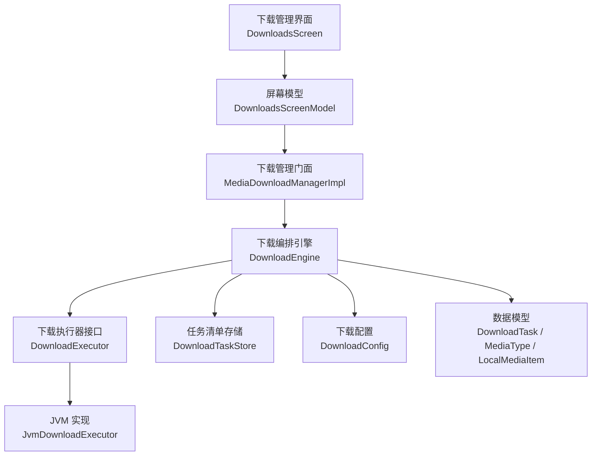
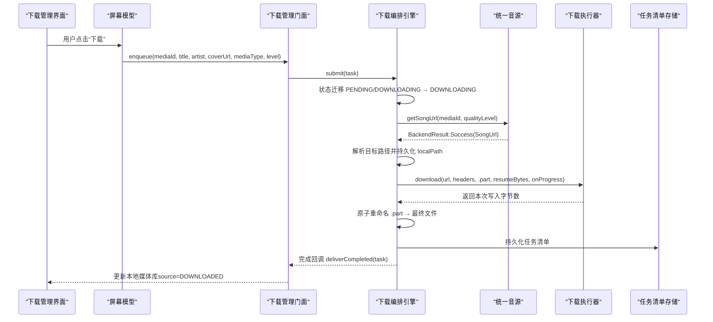
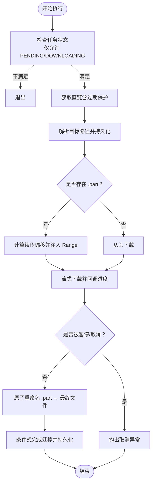
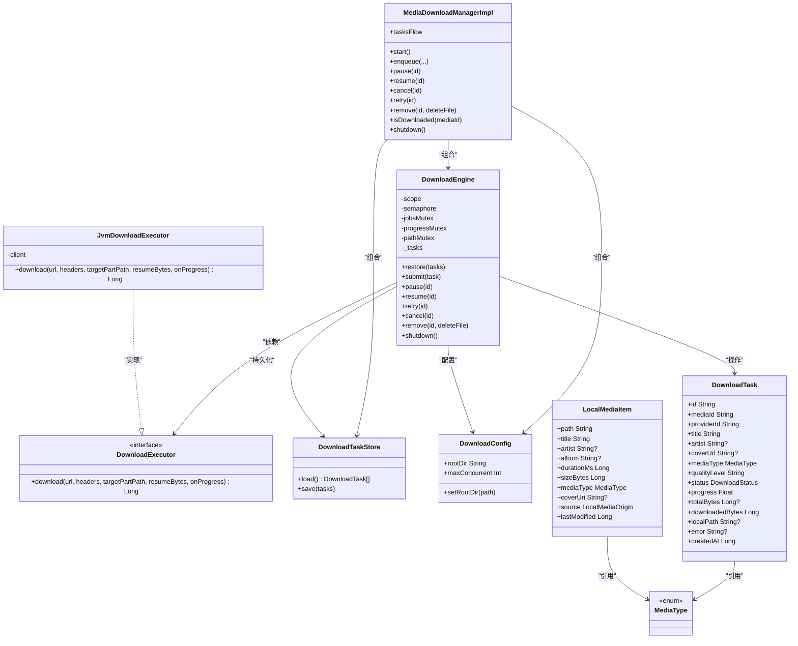

# 下载系统

<cite>
**本文引用的文件**
- [DownloadEngine.kt](file://kmp-pro/src/commonMain/kotlin/cp/player/kmp/download/DownloadEngine.kt)
- [MediaDownloadManager.kt](file://kmp-pro/src/commonMain/kotlin/cp/player/kmp/download/MediaDownloadManager.kt)
- [DownloadExecutor.kt](file://kmp-pro/src/commonMain/kotlin/cp/player/kmp/download/DownloadExecutor.kt)
- [JvmDownloadExecutor.kt](file://kmp-pro/src/jvmMain/kotlin/cp/player/kmp/download/JvmDownloadExecutor.kt)
- [DownloadTaskStore.kt](file://kmp-pro/src/commonMain/kotlin/cp/player/kmp/download/DownloadTaskStore.kt)
- [DownloadConfig.kt](file://kmp-pro/src/commonMain/kotlin/cp/player/kmp/download/DownloadConfig.kt)
- [DownloadTask.kt](file://kmp-pro/src/commonMain/kotlin/cp/player/kmp/model/DownloadTask.kt)
- [MediaType.kt](file://kmp-pro/src/commonMain/kotlin/cp/player/kmp/media/MediaType.kt)
- [LocalMediaItem.kt](file://kmp-pro/src/commonMain/kotlin/cp/player/kmp/media/LocalMediaItem.kt)
- [DownloadsScreen.kt](file://app/src/commonMain/kotlin/cp/player/app/ui/screen/DownloadsScreen.kt)
- [DownloadsScreenModel.kt](file://app/src/commonMain/kotlin/cp/player/app/ui/model/DownloadsScreenModel.kt)
</cite>

## 目录
1. [简介](#简介)
2. [项目结构](#项目结构)
3. [核心组件](#核心组件)
4. [架构总览](#架构总览)
5. [详细组件分析](#详细组件分析)
6. [依赖关系分析](#依赖关系分析)
7. [性能考量](#性能考量)
8. [故障排查指南](#故障排查指南)
9. [结论](#结论)
10. [附录](#附录)

## 简介
本下载系统为 CPPlayer-KMP 的通用媒体下载子系统，支持音频与视频的统一下载、断点续传、并发控制、任务持久化与恢复，并通过 UI 层提供可视化的任务管理与本地媒体库展示。系统采用分层设计：管理门面（对外入口）→ 编排引擎（状态机、重试、路径解析、进度节流）→ 执行器（平台实现流式下载）→ 存储（任务清单持久化）。

## 项目结构
下载系统主要位于 kmp-pro 模块的 download 包中，UI 在 app 模块的 screen/model 中。关键目录与职责如下：
- commonMain/download：跨平台下载编排与数据模型
- jvmMain/download：JVM 平台的下载执行器实现（Android/Desktop 共用）
- model：下载任务数据模型与状态枚举
- media：媒体类型与本地条目模型
- app/ui：下载管理界面与屏幕模型

图表来源
- [MediaDownloadManager.kt:88-125](file://kmp-pro/src/commonMain/kotlin/cp/player/kmp/download/MediaDownloadManager.kt#L88-L125)
- [DownloadEngine.kt:50-106](file://kmp-pro/src/commonMain/kotlin/cp/player/kmp/download/DownloadEngine.kt#L50-L106)
- [JvmDownloadExecutor.kt:33-79](file://kmp-pro/src/jvmMain/kotlin/cp/player/kmp/download/JvmDownloadExecutor.kt#L33-L79)
- [DownloadTaskStore.kt:27-60](file://kmp-pro/src/commonMain/kotlin/cp/player/kmp/download/DownloadTaskStore.kt#L27-L60)
- [DownloadConfig.kt:16-31](file://kmp-pro/src/commonMain/kotlin/cp/player/kmp/download/DownloadConfig.kt#L16-L31)
- [DownloadTask.kt:36-68](file://kmp-pro/src/commonMain/kotlin/cp/player/kmp/model/DownloadTask.kt#L36-L68)
- [MediaType.kt:9-17](file://kmp-pro/src/commonMain/kotlin/cp/player/kmp/media/MediaType.kt#L9-L17)
- [LocalMediaItem.kt:22-44](file://kmp-pro/src/commonMain/kotlin/cp/player/kmp/media/LocalMediaItem.kt#L22-L44)

章节来源
- [MediaDownloadManager.kt:1-205](file://kmp-pro/src/commonMain/kotlin/cp/player/kmp/download/MediaDownloadManager.kt#L1-L205)
- [DownloadEngine.kt:1-488](file://kmp-pro/src/commonMain/kotlin/cp/player/kmp/download/DownloadEngine.kt#L1-L488)
- [JvmDownloadExecutor.kt:1-115](file://kmp-pro/src/jvmMain/kotlin/cp/player/kmp/download/JvmDownloadExecutor.kt#L1-L115)
- [DownloadTaskStore.kt:1-81](file://kmp-pro/src/commonMain/kotlin/cp/player/kmp/download/DownloadTaskStore.kt#L1-L81)
- [DownloadConfig.kt:1-41](file://kmp-pro/src/commonMain/kotlin/cp/player/kmp/download/DownloadConfig.kt#L1-L41)
- [DownloadTask.kt:1-69](file://kmp-pro/src/commonMain/kotlin/cp/player/kmp/model/DownloadTask.kt#L1-L69)
- [MediaType.kt:1-48](file://kmp-pro/src/commonMain/kotlin/cp/player/kmp/media/MediaType.kt#L1-L48)
- [LocalMediaItem.kt:1-45](file://kmp-pro/src/commonMain/kotlin/cp/player/kmp/media/LocalMediaItem.kt#L1-L45)
- [DownloadsScreen.kt:69-150](file://app/src/commonMain/kotlin/cp/player/app/ui/screen/DownloadsScreen.kt#L69-L150)
- [DownloadsScreenModel.kt:70-113](file://app/src/commonMain/kotlin/cp/player/app/ui/model/DownloadsScreenModel.kt#L70-L113)

## 核心组件
- MediaDownloadManager：对外唯一入口，负责入队、暂停/恢复/取消/重试、恢复启动、完成回调组装本地条目等。
- DownloadEngine：下载编排核心，维护任务状态流、并发控制、取直链、目标路径解析、断点续传、失败重试、进度节流与持久化。
- DownloadExecutor：抽象下载执行器，由平台实现具体网络与IO逻辑；JVM 实现使用独立 Ktor/OkHttp 客户端流式分块写盘。
- DownloadTaskStore：任务清单持久化，加载时复位未完成状态，保存时原子替换，超限裁剪保留策略。
- DownloadConfig：下载根目录与并发数配置，动态读取设置或回退平台默认目录。
- 数据模型：DownloadTask、DownloadStatus、MediaType、LocalMediaItem 用于描述任务、状态、媒体类型与本地条目。

章节来源
- [MediaDownloadManager.kt:19-77](file://kmp-pro/src/commonMain/kotlin/cp/player/kmp/download/MediaDownloadManager.kt#L19-L77)
- [DownloadEngine.kt:33-78](file://kmp-pro/src/commonMain/kotlin/cp/player/kmp/download/DownloadEngine.kt#L33-L78)
- [DownloadExecutor.kt:3-54](file://kmp-pro/src/commonMain/kotlin/cp/player/kmp/download/DownloadExecutor.kt#L3-L54)
- [DownloadTaskStore.kt:13-26](file://kmp-pro/src/commonMain/kotlin/cp/player/kmp/download/DownloadTaskStore.kt#L13-L26)
- [DownloadConfig.kt:7-15](file://kmp-pro/src/commonMain/kotlin/cp/player/kmp/download/DownloadConfig.kt#L7-L15)
- [DownloadTask.kt:6-68](file://kmp-pro/src/commonMain/kotlin/cp/player/kmp/model/DownloadTask.kt#L6-L68)
- [MediaType.kt:3-17](file://kmp-pro/src/commonMain/kotlin/cp/player/kmp/media/MediaType.kt#L3-L17)
- [LocalMediaItem.kt:5-44](file://kmp-pro/src/commonMain/kotlin/cp/player/kmp/media/LocalMediaItem.kt#L5-L44)

## 架构总览
下载流程从 UI 触发入队开始，经管理门面校验与幂等处理，进入编排引擎进行状态迁移、直链获取、路径解析、断点续传、流式下载、完成重命名与持久化，最终通过回调产出本地媒体条目供上层索引。

图表来源
- [DownloadsScreen.kt:152-262](file://app/src/commonMain/kotlin/cp/player/app/ui/screen/DownloadsScreen.kt#L152-L262)
- [DownloadsScreenModel.kt:75-113](file://app/src/commonMain/kotlin/cp/player/app/ui/model/DownloadsScreenModel.kt#L75-L113)
- [MediaDownloadManager.kt:127-166](file://kmp-pro/src/commonMain/kotlin/cp/player/kmp/download/MediaDownloadManager.kt#L127-L166)
- [DownloadEngine.kt:236-308](file://kmp-pro/src/commonMain/kotlin/cp/player/kmp/download/DownloadEngine.kt#L236-L308)
- [JvmDownloadExecutor.kt:52-79](file://kmp-pro/src/jvmMain/kotlin/cp/player/kmp/download/JvmDownloadExecutor.kt#L52-L79)
- [DownloadTaskStore.kt:47-60](file://kmp-pro/src/commonMain/kotlin/cp/player/kmp/download/DownloadTaskStore.kt#L47-L60)

## 详细组件分析

### 下载编排引擎（DownloadEngine）
- 并发控制：基于信号量限制最大并发任务数，每个任务一个协程 Job。
- 状态机：PENDING → DOWNLOADING → COMPLETED/FAILED/CANCELLED/PAUSED，所有状态变更通过条件式原子更新避免竞态。
- 直链获取：执行时现取直链，带过期保护与多次尝试；失败抛出特定异常以便上层区分。
- 路径解析：首次解析后持久化 localPath，保证续传稳定；文件名清洗与冲突处理。
- 断点续传：检测 .part 文件大小并注入 Range 头；服务端不支持时清空 .part 从头下载。
- 进度节流：按固定间隔上报进度，减少频繁状态更新开销。
- 失败重试：指数退避重试，超过次数标记 FAILED。
- 持久化：每次状态/进度变更调用 store.save。

图表来源
- [DownloadEngine.kt:202-308](file://kmp-pro/src/commonMain/kotlin/cp/player/kmp/download/DownloadEngine.kt#L202-L308)
- [DownloadEngine.kt:323-343](file://kmp-pro/src/commonMain/kotlin/cp/player/kmp/download/DownloadEngine.kt#L323-L343)
- [DownloadEngine.kt:345-384](file://kmp-pro/src/commonMain/kotlin/cp/player/kmp/download/DownloadEngine.kt#L345-L384)
- [DownloadEngine.kt:386-414](file://kmp-pro/src/commonMain/kotlin/cp/player/kmp/download/DownloadEngine.kt#L386-L414)

章节来源
- [DownloadEngine.kt:33-78](file://kmp-pro/src/commonMain/kotlin/cp/player/kmp/download/DownloadEngine.kt#L33-L78)
- [DownloadEngine.kt:108-177](file://kmp-pro/src/commonMain/kotlin/cp/player/kmp/download/DownloadEngine.kt#L108-L177)
- [DownloadEngine.kt:181-234](file://kmp-pro/src/commonMain/kotlin/cp/player/kmp/download/DownloadEngine.kt#L181-L234)
- [DownloadEngine.kt:236-308](file://kmp-pro/src/commonMain/kotlin/cp/player/kmp/download/DownloadEngine.kt#L236-L308)
- [DownloadEngine.kt:323-414](file://kmp-pro/src/commonMain/kotlin/cp/player/kmp/download/DownloadEngine.kt#L323-L414)

### 下载管理门面（MediaDownloadManagerImpl）
- 入队幂等：同 mediaId 已完成且文件存在则直接返回；失败/取消/完成但文件丢失自动重试；进行中/暂停原样返回。
- 启动恢复：加载持久化清单并将 DOWNLOADING/PENDING 复位为 FAILED；COMPLETED 但文件丢失也复位为 FAILED。
- 完成回调：将 DownloadTask 转换为 LocalMediaItem（source=DOWNLOADED），交由上层本地索引登记。

章节来源
- [MediaDownloadManager.kt:88-125](file://kmp-pro/src/commonMain/kotlin/cp/player/kmp/download/MediaDownloadManager.kt#L88-L125)
- [MediaDownloadManager.kt:127-166](file://kmp-pro/src/commonMain/kotlin/cp/player/kmp/download/MediaDownloadManager.kt#L127-L166)
- [MediaDownloadManager.kt:187-203](file://kmp-pro/src/commonMain/kotlin/cp/player/kmp/download/MediaDownloadManager.kt#L187-L203)

### 下载执行器（JvmDownloadExecutor）
- 独立 HTTP 客户端：使用 Ktor + OkHttp，连接超时 30s，socket 读写空闲超时 5 分钟，整体请求不设超时以支持大文件。
- 流式分块写盘：bodyAsChannel 逐块读取，RandomAccessFile 追加写入，支持断点续传。
- 续传支持判断：携带 Range 但响应 200 或 416 时抛出 ResumeNotSupportedException，交由编排层清空 .part 重下。
- 取消支持：响应协程取消天然支持，中断后保留 .part 供续传。

章节来源
- [JvmDownloadExecutor.kt:19-32](file://kmp-pro/src/jvmMain/kotlin/cp/player/kmp/download/JvmDownloadExecutor.kt#L19-L32)
- [JvmDownloadExecutor.kt:52-79](file://kmp-pro/src/jvmMain/kotlin/cp/player/kmp/download/JvmDownloadExecutor.kt#L52-L79)
- [JvmDownloadExecutor.kt:81-106](file://kmp-pro/src/jvmMain/kotlin/cp/player/kmp/download/JvmDownloadExecutor.kt#L81-L106)

### 任务清单存储（DownloadTaskStore）
- 加载语义：文件缺失/损坏返回空列表；DOWNLOADING/PENDING 复位为 FAILED（error="上次未完成"）。
- 保存语义：临时文件 + 原子 rename 避免半写坏清单；超限裁剪策略优先保留 COMPLETED（最近优先），其余按创建时间丢弃旧项。
- 位置决策：清单文件位于数据目录（Desktop ~/.kmp-pro/downloads.json；Android filesDir/downloads.json），与用户可见下载目录分离。

章节来源
- [DownloadTaskStore.kt:13-26](file://kmp-pro/src/commonMain/kotlin/cp/player/kmp/download/DownloadTaskStore.kt#L13-L26)
- [DownloadTaskStore.kt:32-45](file://kmp-pro/src/commonMain/kotlin/cp/player/kmp/download/DownloadTaskStore.kt#L32-L45)
- [DownloadTaskStore.kt:47-71](file://kmp-pro/src/commonMain/kotlin/cp/player/kmp/download/DownloadTaskStore.kt#L47-L71)

### 下载配置（DownloadConfig）
- 根目录：优先读取 SettingsStorage 中的自定义路径，未配置时回退平台默认下载目录。
- 并发数：固定最大值（默认 3）。
- 动态生效：修改 rootDir 后新任务立即使用新目录，无需重建实例。

章节来源
- [DownloadConfig.kt:7-15](file://kmp-pro/src/commonMain/kotlin/cp/player/kmp/download/DownloadConfig.kt#L7-L15)
- [DownloadConfig.kt:16-31](file://kmp-pro/src/commonMain/kotlin/cp/player/kmp/download/DownloadConfig.kt#L16-L31)
- [DownloadConfig.kt:33-39](file://kmp-pro/src/commonMain/kotlin/cp/player/kmp/download/DownloadConfig.kt#L33-L39)

### 数据模型
- DownloadTask：包含任务 ID、媒体 ID、提供者 ID、标题、艺术家、封面 URL、媒体类型、质量档位、状态、进度、总字节、已下载字节、本地路径、错误信息、创建时间。
- DownloadStatus：PENDING、DOWNLOADING、PAUSED、COMPLETED、FAILED、CANCELLED。
- MediaType：AUDIO、VIDEO、OTHER，并提供扩展名推断能力。
- LocalMediaItem：本地媒体条目，包含路径、标题、艺术家、专辑、时长、大小、媒体类型、封面 URI、来源（DOWNLOADED/IMPORTED）、最后修改时间。

章节来源
- [DownloadTask.kt:6-68](file://kmp-pro/src/commonMain/kotlin/cp/player/kmp/model/DownloadTask.kt#L6-L68)
- [MediaType.kt:3-17](file://kmp-pro/src/commonMain/kotlin/cp/player/kmp/media/MediaType.kt#L3-L17)
- [LocalMediaItem.kt:5-44](file://kmp-pro/src/commonMain/kotlin/cp/player/kmp/media/LocalMediaItem.kt#L5-L44)

## 依赖关系分析
- 管理门面依赖编排引擎与存储、配置；编排引擎依赖统一音源、执行器、存储、配置与平台支持。
- 执行器为平台具体实现，JVM 端使用 Ktor/OkHttp；commonMain 仅定义接口。
- UI 层通过屏幕模型订阅任务流与本地媒体流，驱动界面更新。

图表来源
- [MediaDownloadManager.kt:88-125](file://kmp-pro/src/commonMain/kotlin/cp/player/kmp/download/MediaDownloadManager.kt#L88-L125)
- [DownloadEngine.kt:50-106](file://kmp-pro/src/commonMain/kotlin/cp/player/kmp/download/DownloadEngine.kt#L50-L106)
- [DownloadExecutor.kt:25-54](file://kmp-pro/src/commonMain/kotlin/cp/player/kmp/download/DownloadExecutor.kt#L25-L54)
- [JvmDownloadExecutor.kt:33-79](file://kmp-pro/src/jvmMain/kotlin/cp/player/kmp/download/JvmDownloadExecutor.kt#L33-L79)
- [DownloadTaskStore.kt:27-60](file://kmp-pro/src/commonMain/kotlin/cp/player/kmp/download/DownloadTaskStore.kt#L27-L60)
- [DownloadConfig.kt:16-31](file://kmp-pro/src/commonMain/kotlin/cp/player/kmp/download/DownloadConfig.kt#L16-L31)
- [DownloadTask.kt:36-68](file://kmp-pro/src/commonMain/kotlin/cp/player/kmp/model/DownloadTask.kt#L36-L68)
- [MediaType.kt:9-17](file://kmp-pro/src/commonMain/kotlin/cp/player/kmp/media/MediaType.kt#L9-L17)
- [LocalMediaItem.kt:22-44](file://kmp-pro/src/commonMain/kotlin/cp/player/kmp/media/LocalMediaItem.kt#L22-L44)

章节来源
- [MediaDownloadManager.kt:88-125](file://kmp-pro/src/commonMain/kotlin/cp/player/kmp/download/MediaDownloadManager.kt#L88-L125)
- [DownloadEngine.kt:50-106](file://kmp-pro/src/commonMain/kotlin/cp/player/kmp/download/DownloadEngine.kt#L50-L106)
- [DownloadExecutor.kt:25-54](file://kmp-pro/src/commonMain/kotlin/cp/player/kmp/download/DownloadExecutor.kt#L25-L54)
- [JvmDownloadExecutor.kt:33-79](file://kmp-pro/src/jvmMain/kotlin/cp/player/kmp/download/JvmDownloadExecutor.kt#L33-L79)
- [DownloadTaskStore.kt:27-60](file://kmp-pro/src/commonMain/kotlin/cp/player/kmp/download/DownloadTaskStore.kt#L27-L60)
- [DownloadConfig.kt:16-31](file://kmp-pro/src/commonMain/kotlin/cp/player/kmp/download/DownloadConfig.kt#L16-L31)
- [DownloadTask.kt:36-68](file://kmp-pro/src/commonMain/kotlin/cp/player/kmp/model/DownloadTask.kt#L36-L68)
- [MediaType.kt:9-17](file://kmp-pro/src/commonMain/kotlin/cp/player/kmp/media/MediaType.kt#L9-L17)
- [LocalMediaItem.kt:22-44](file://kmp-pro/src/commonMain/kotlin/cp/player/kmp/media/LocalMediaItem.kt#L22-L44)

## 性能考量
- 并发控制：信号量限制最大并发下载数，避免资源争用。
- 进度节流：固定间隔上报进度，降低 StateFlow 更新频率。
- 流式下载：分块读取与写入，内存占用低，适合大文件。
- 断点续传：利用 Range 头与 .part 文件，减少重复下载。
- 持久化优化：原子替换清单文件，超限裁剪保留策略减少 IO 压力。
- 直链缓存防护：过期保护与接近过期重新取链，避免中途失效。

[本节为通用指导，不直接分析具体文件]

## 故障排查指南
- 取直链失败：检查统一音源返回结果，确认 URL 非空且未过期；若多次失败，记录错误消息。
- 服务端不支持续传：当携带 Range 响应 200 或 416 时，清空 .part 从头下载；该情况不计入通用失败重试次数。
- 文件重命名失败：检查磁盘权限与可用空间；确保 .part 与目标路径在同一文件系统。
- 任务状态不一致：检查条件式状态迁移是否被其他操作覆盖；确认 pause/cancel 已正确终止 Job。
- 清单损坏：加载失败返回空列表；保存失败会保留临时文件便于诊断。

章节来源
- [DownloadEngine.kt:323-343](file://kmp-pro/src/commonMain/kotlin/cp/player/kmp/download/DownloadEngine.kt#L323-L343)
- [DownloadEngine.kt:215-233](file://kmp-pro/src/commonMain/kotlin/cp/player/kmp/download/DownloadEngine.kt#L215-L233)
- [DownloadEngine.kt:286-308](file://kmp-pro/src/commonMain/kotlin/cp/player/kmp/download/DownloadEngine.kt#L286-L308)
- [JvmDownloadExecutor.kt:66-79](file://kmp-pro/src/jvmMain/kotlin/cp/player/kmp/download/JvmDownloadExecutor.kt#L66-L79)
- [DownloadTaskStore.kt:32-45](file://kmp-pro/src/commonMain/kotlin/cp/player/kmp/download/DownloadTaskStore.kt#L32-L45)
- [DownloadTaskStore.kt:47-60](file://kmp-pro/src/commonMain/kotlin/cp/player/kmp/download/DownloadTaskStore.kt#L47-L60)

## 结论
下载系统通过清晰的分层与职责划分，实现了可靠的媒体下载能力：统一的入队接口、健壮的编排逻辑、平台无关的执行器抽象、稳定的持久化机制以及友好的 UI 交互。其断点续传、并发控制、失败重试与进度节流等特性，确保了在大文件下载场景下的稳定性与效率。

[本节为总结性内容，不直接分析具体文件]

## 附录
- 下载管理界面提供三个 Tab：下载中、已完成、本地媒体库，支持暂停/继续/取消/重试/删除等操作。
- 屏幕模型订阅任务流与本地媒体流，驱动界面状态更新，并处理扫描与导入流程。

章节来源
- [DownloadsScreen.kt:69-150](file://app/src/commonMain/kotlin/cp/player/app/ui/screen/DownloadsScreen.kt#L69-L150)
- [DownloadsScreen.kt:152-421](file://app/src/commonMain/kotlin/cp/player/app/ui/screen/DownloadsScreen.kt#L152-L421)
- [DownloadsScreenModel.kt:70-113](file://app/src/commonMain/kotlin/cp/player/app/ui/model/DownloadsScreenModel.kt#L70-L113)
- [DownloadsScreenModel.kt:128-184](file://app/src/commonMain/kotlin/cp/player/app/ui/model/DownloadsScreenModel.kt#L128-L184)