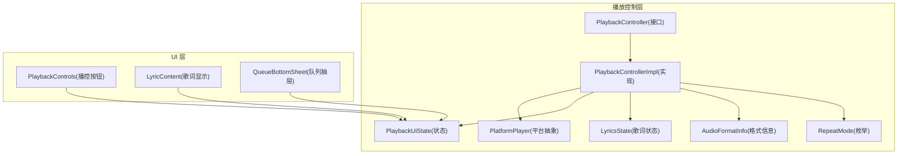
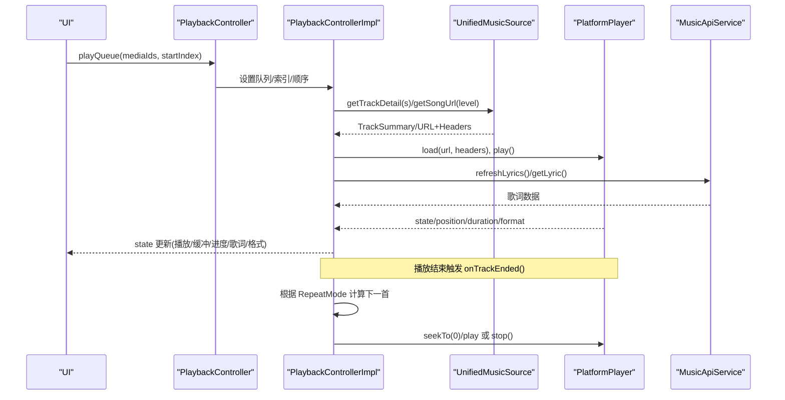
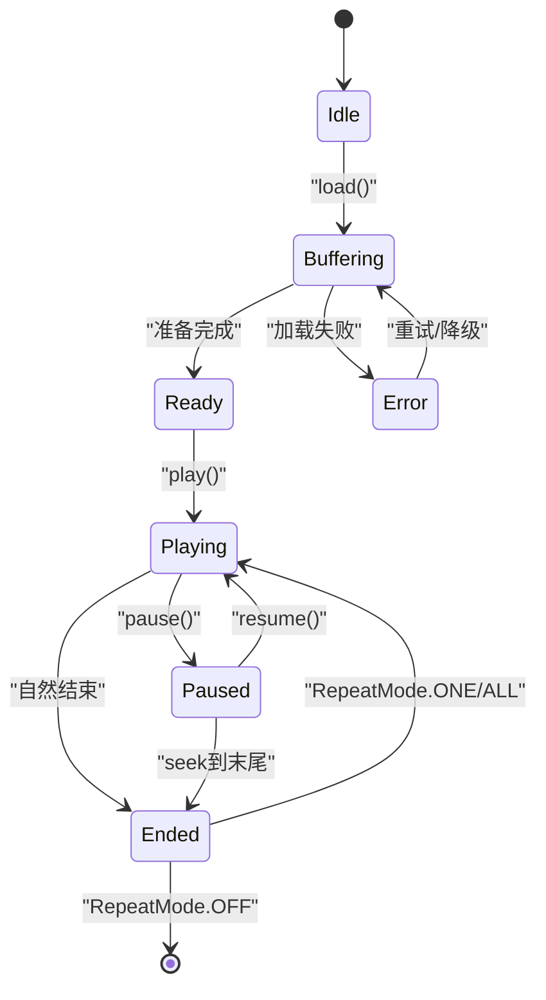
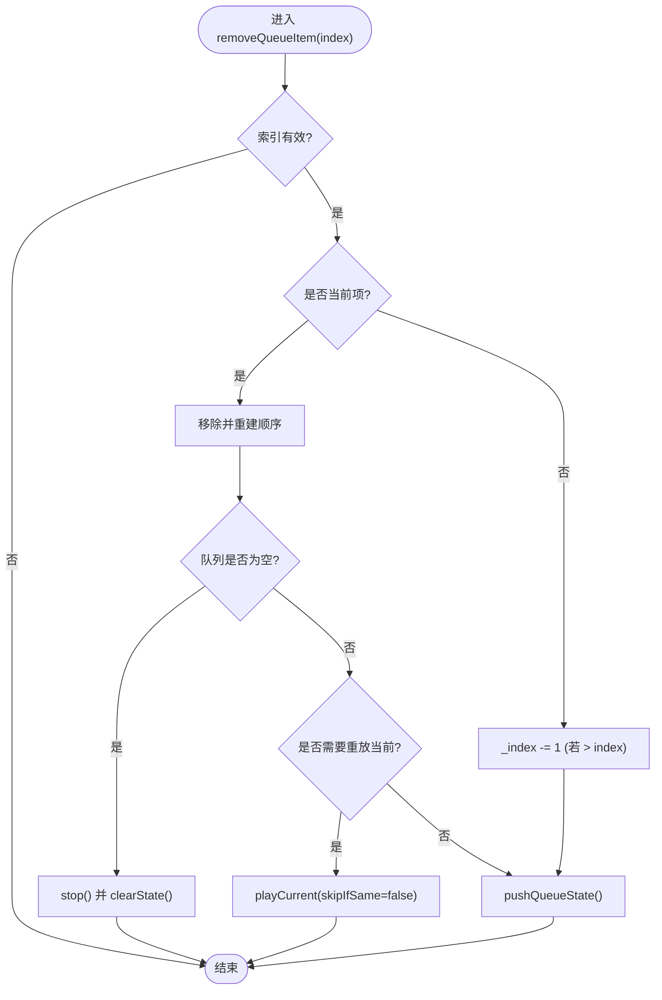
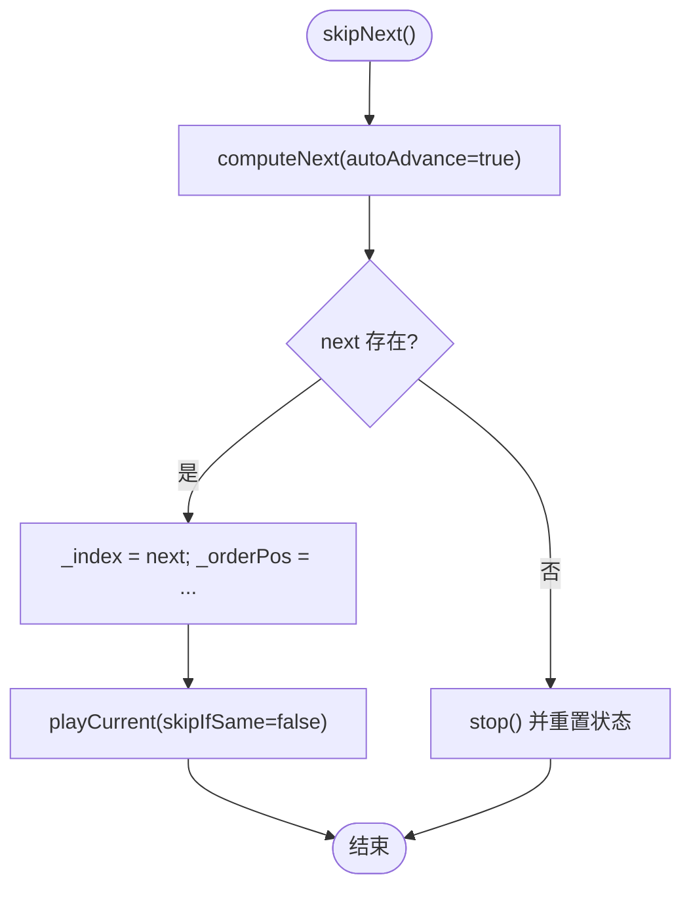
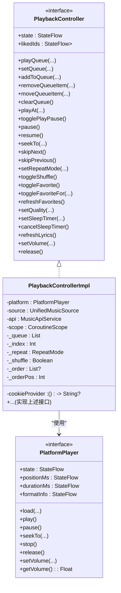

# 播放控制系统

<cite>
**本文引用的文件**
- [PlaybackController.kt](file://kmp-pro/src/commonMain/kotlin/cp/player/kmp/playback/PlaybackController.kt)
- [PlaybackControllerImpl.kt](file://kmp-pro/src/commonMain/kotlin/cp/player/kmp/playback/PlaybackControllerImpl.kt)
- [PlatformPlayer.kt](file://kmp-pro/src/commonMain/kotlin/cp/player/kmp/playback/PlatformPlayer.kt)
- [RepeatMode.kt](file://kmp-pro/src/commonMain/kotlin/cp/player/kmp/playback/RepeatMode.kt)
- [PlaybackUiState.kt](file://kmp-pro/src/commonMain/kotlin/cp/player/kmp/playback/PlaybackUiState.kt)
- [LyricsState.kt](file://kmp-pro/src/commonMain/kotlin/cp/player/kmp/playback/LyricsState.kt)
- [SyncedLyricLine.kt](file://kmp-pro/src/commonMain/kotlin/cp/player/kmp/playback/SyncedLyricLine.kt)
- [AudioFormatInfo.kt](file://kmp-pro/src/commonMain/kotlin/cp/player/kmp/playback/AudioFormatInfo.kt)
- [PlaybackControls.kt](file://app/src/commonMain/kotlin/cp/player/app/ui/component/PlaybackControls.kt)
- [LyricContent.kt](file://app/src/commonMain/kotlin/cp/player/app/ui/component/LyricContent.kt)
- [QueueBottomSheet.kt](file://app/src/commonMain/kotlin/cp/player/app/ui/component/QueueBottomSheet.kt)
</cite>

## 目录
1. [简介](#简介)
2. [项目结构](#项目结构)
3. [核心组件](#核心组件)
4. [架构总览](#架构总览)
5. [详细组件分析](#详细组件分析)
6. [依赖关系分析](#依赖关系分析)
7. [性能考量](#性能考量)
8. [故障排查指南](#故障排查指南)
9. [结论](#结论)
10. [附录：API 参考与使用示例](#附录api-参考与使用示例)

## 简介
本技术文档聚焦 CPPlayer-KMP 的播放控制系统，围绕 PlaybackController 接口及其实现，系统阐述播放队列管理、播放控制操作、收藏状态管理、歌词同步、播放模式切换（单曲循环、列表循环、随机播放）等核心能力；说明与 PlatformPlayer 的交互方式、状态流转与错误处理策略；并提供面向前端的正确使用范式与示例路径。

## 项目结构
播放控制相关代码主要位于 kmp-pro 模块的 playback 包中，UI 层在 app 模块的 ui/component 中通过 StateFlow 消费控制器状态进行渲染。

图表来源
- [PlaybackController.kt:1-106](file://kmp-pro/src/commonMain/kotlin/cp/player/kmp/playback/PlaybackController.kt#L1-L106)
- [PlaybackControllerImpl.kt:18-92](file://kmp-pro/src/commonMain/kotlin/cp/player/kmp/playback/PlaybackControllerImpl.kt#L18-L92)
- [PlatformPlayer.kt:16-41](file://kmp-pro/src/commonMain/kotlin/cp/player/kmp/playback/PlatformPlayer.kt#L16-L41)
- [RepeatMode.kt:1-11](file://kmp-pro/src/commonMain/kotlin/cp/player/kmp/playback/RepeatMode.kt#L1-L11)
- [PlaybackUiState.kt:1-35](file://kmp-pro/src/commonMain/kotlin/cp/player/kmp/playback/PlaybackUiState.kt#L1-L35)
- [LyricsState.kt:1-41](file://kmp-pro/src/commonMain/kotlin/cp/player/kmp/playback/LyricsState.kt#L1-L41)
- [AudioFormatInfo.kt:1-23](file://kmp-pro/src/commonMain/kotlin/cp/player/kmp/playback/AudioFormatInfo.kt#L1-L23)
- [PlaybackControls.kt:30-118](file://app/src/commonMain/kotlin/cp/player/app/ui/component/PlaybackControls.kt#L30-L118)
- [LyricContent.kt:30-142](file://app/src/commonMain/kotlin/cp/player/app/ui/component/LyricContent.kt#L30-L142)
- [QueueBottomSheet.kt:57-187](file://app/src/commonMain/kotlin/cp/player/app/ui/component/QueueBottomSheet.kt#L57-L187)

章节来源
- [PlaybackController.kt:1-106](file://kmp-pro/src/commonMain/kotlin/cp/player/kmp/playback/PlaybackController.kt#L1-L106)
- [PlaybackControllerImpl.kt:18-92](file://kmp-pro/src/commonMain/kotlin/cp/player/kmp/playback/PlaybackControllerImpl.kt#L18-L92)
- [PlatformPlayer.kt:16-41](file://kmp-pro/src/commonMain/kotlin/cp/player/kmp/playback/PlatformPlayer.kt#L16-L41)

## 核心组件
- PlaybackController：前端唯一入口，屏蔽底层差异，暴露完整状态流 state 与全部播放控制方法。
- PlaybackControllerImpl：平台无关实现，负责队列管理、URL 解析、PlatformPlayer 调用、歌词拉取与解析、听歌打卡、自动下一首、音质降级重试、睡眠定时等。
- PlatformPlayer：平台播放器抽象，封装加载、播放、暂停、跳转、停止、释放、音量等能力，并输出状态流。
- RepeatMode：播放循环模式（关闭、单曲循环、列表循环）。
- PlaybackUiState：不可变的前端渲染状态，包含当前曲目、队列、播放态、缓冲、进度、时长、循环/随机、歌词、格式信息、错误、收藏态、音质等级、睡眠定时等。
- LyricsState / SyncedLyricLine：统一歌词状态与行模型，支持翻译、罗马音、逐字时间戳。
- AudioFormatInfo：音频格式信息，提供归一化质量标签。

章节来源
- [PlaybackController.kt:6-106](file://kmp-pro/src/commonMain/kotlin/cp/player/kmp/playback/PlaybackController.kt#L6-L106)
- [PlaybackControllerImpl.kt:18-92](file://kmp-pro/src/commonMain/kotlin/cp/player/kmp/playback/PlaybackControllerImpl.kt#L18-L92)
- [PlatformPlayer.kt:16-41](file://kmp-pro/src/commonMain/kotlin/cp/player/kmp/playback/PlatformPlayer.kt#L16-L41)
- [RepeatMode.kt:1-11](file://kmp-pro/src/commonMain/kotlin/cp/player/kmp/playback/RepeatMode.kt#L1-L11)
- [PlaybackUiState.kt:1-35](file://kmp-pro/src/commonMain/kotlin/cp/player/kmp/playback/PlaybackUiState.kt#L1-L35)
- [LyricsState.kt:1-41](file://kmp-pro/src/commonMain/kotlin/cp/player/kmp/playback/LyricsState.kt#L1-L41)
- [SyncedLyricLine.kt:1-29](file://kmp-pro/src/commonMain/kotlin/cp/player/kmp/playback/SyncedLyricLine.kt#L1-L29)
- [AudioFormatInfo.kt:1-23](file://kmp-pro/src/commonMain/kotlin/cp/player/kmp/playback/AudioFormatInfo.kt#L1-L23)

## 架构总览
播放控制采用“控制器 + 平台抽象”的分层设计：UI 仅订阅 PlaybackController.state，所有 URL 获取、Song/MediaItem 转换、歌词解析、引擎差异均被控制器封装。控制器内部维护队列与顺序（含随机），将 PlatformPlayer 的状态/位置/时长/格式信息折叠进 PlaybackUiState，并在曲目结束时依据 RepeatMode 决定继续或停止。

图表来源
- [PlaybackControllerImpl.kt:144-158](file://kmp-pro/src/commonMain/kotlin/cp/player/kmp/playback/PlaybackControllerImpl.kt#L144-L158)
- [PlaybackControllerImpl.kt:496-556](file://kmp-pro/src/commonMain/kotlin/cp/player/kmp/playback/PlaybackControllerImpl.kt#L496-L556)
- [PlaybackControllerImpl.kt:577-602](file://kmp-pro/src/commonMain/kotlin/cp/player/kmp/playback/PlaybackControllerImpl.kt#L577-L602)
- [PlatformPlayer.kt:16-41](file://kmp-pro/src/commonMain/kotlin/cp/player/kmp/playback/PlatformPlayer.kt#L16-L41)

## 详细组件分析

### 播放状态机与状态流转
- 平台状态映射：Idle/Buffering/Ready/Playing/Paused/Ended/Error → 控制器将其折叠为 isPlaying/isBuffering/error 等字段，并驱动 UI。
- 播放结束处理：onTrackEnded 根据 RepeatMode 决定单曲循环、列表循环或停止；若启用“播完当前后暂停”，则直接暂停并清除定时。
- 进度与歌词高亮：每帧 positionMs 更新时计算 activeLyricIndex，使歌词按时间匹配高亮。

图表来源
- [PlatformPlayer.kt:33-41](file://kmp-pro/src/commonMain/kotlin/cp/player/kmp/playback/PlatformPlayer.kt#L33-L41)
- [PlaybackControllerImpl.kt:96-127](file://kmp-pro/src/commonMain/kotlin/cp/player/kmp/playback/PlaybackControllerImpl.kt#L96-L127)
- [PlaybackControllerImpl.kt:577-602](file://kmp-pro/src/commonMain/kotlin/cp/player/kmp/playback/PlaybackControllerImpl.kt#L577-L602)

章节来源
- [PlaybackControllerImpl.kt:96-127](file://kmp-pro/src/commonMain/kotlin/cp/player/kmp/playback/PlaybackControllerImpl.kt#L96-L127)
- [PlaybackControllerImpl.kt:577-602](file://kmp-pro/src/commonMain/kotlin/cp/player/kmp/playback/PlaybackControllerImpl.kt#L577-L602)

### 队列管理与顺序算法
- 数据结构：内部维护 Entry(mediaId, summary?) 列表 _queue，以及 _index/_order/_orderPos 表示当前索引与播放顺序（_order 为 null 表示自然顺序）。
- 懒解析：Entry.summary 延迟解析，优先解析当前及附近条目，批量并发提升体验。
- 随机播放：开启 shuffle 时生成 _order 序列，移动/插入/删除时维护 _order 与 _orderPos。
- 关键操作：
  - playQueue/setQueue：替换队列，设置起始索引与顺序，后台解析并立即播放当前。
  - addToQueue：尾部追加，shuffle 模式下追加到 _order。
  - removeQueueItem：移除指定项，若移除的是当前项则按规则跳到下一首；空队列则停止并清空状态。
  - moveQueueItem：拖拽重排，维护 _index 与 shuffle 顺序。
  - playAt：跳转到指定索引并播放。

图表来源
- [PlaybackControllerImpl.kt:183-211](file://kmp-pro/src/commonMain/kotlin/cp/player/kmp/playback/PlaybackControllerImpl.kt#L183-L211)
- [PlaybackControllerImpl.kt:228-248](file://kmp-pro/src/commonMain/kotlin/cp/player/kmp/playback/PlaybackControllerImpl.kt#L228-L248)
- [PlaybackControllerImpl.kt:643-685](file://kmp-pro/src/commonMain/kotlin/cp/player/kmp/playback/PlaybackControllerImpl.kt#L643-L685)

章节来源
- [PlaybackControllerImpl.kt:144-172](file://kmp-pro/src/commonMain/kotlin/cp/player/kmp/playback/PlaybackControllerImpl.kt#L144-L172)
- [PlaybackControllerImpl.kt:174-211](file://kmp-pro/src/commonMain/kotlin/cp/player/kmp/playback/PlaybackControllerImpl.kt#L174-L211)
- [PlaybackControllerImpl.kt:228-248](file://kmp-pro/src/commonMain/kotlin/cp/player/kmp/playback/PlaybackControllerImpl.kt#L228-L248)
- [PlaybackControllerImpl.kt:643-685](file://kmp-pro/src/commonMain/kotlin/cp/player/kmp/playback/PlaybackControllerImpl.kt#L643-L685)

### 播放控制与模式切换
- 基础控制：togglePlayPause/pause/resume/seekTo/skipNext/skipPrevious。
- 模式切换：
  - setRepeatMode：OFF/ONE/ALL。
  - toggleShuffle：切换随机播放，重新生成 _order。
- 下一首/上一首逻辑：
  - skipNext：根据 _order 或 _index 计算 next，结合 RepeatMode 决定是否回到队首或停止。
  - skipPrevious：3 秒内回退到上一首，否则回到当前开头。

图表来源
- [PlaybackControllerImpl.kt:278-291](file://kmp-pro/src/commonMain/kotlin/cp/player/kmp/playback/PlaybackControllerImpl.kt#L278-L291)
- [PlaybackControllerImpl.kt:604-633](file://kmp-pro/src/commonMain/kotlin/cp/player/kmp/playback/PlaybackControllerImpl.kt#L604-L633)
- [RepeatMode.kt:1-11](file://kmp-pro/src/commonMain/kotlin/cp/player/kmp/playback/RepeatMode.kt#L1-L11)

章节来源
- [PlaybackControllerImpl.kt:261-315](file://kmp-pro/src/commonMain/kotlin/cp/player/kmp/playback/PlaybackControllerImpl.kt#L261-L315)
- [PlaybackControllerImpl.kt:604-633](file://kmp-pro/src/commonMain/kotlin/cp/player/kmp/playback/PlaybackControllerImpl.kt#L604-L633)
- [RepeatMode.kt:1-11](file://kmp-pro/src/commonMain/kotlin/cp/player/kmp/playback/RepeatMode.kt#L1-L11)

### 收藏状态管理
- likedIds：当前账号已收藏的歌曲 ID 集合（裸资源 ID），未登录/未加载为空集。
- toggleFavorite/toggleFavoriteFor：乐观更新本地集合，再调用 API 确认；失败则回滚。
- refreshFavorites：强制刷新收藏列表（登录/登出/切换账号后）。
- 同步：当当前曲目变化或收藏集合变化时，同步 isFavorite 到 UI 状态。

章节来源
- [PlaybackController.kt:59-71](file://kmp-pro/src/commonMain/kotlin/cp/player/kmp/playback/PlaybackController.kt#L59-L71)
- [PlaybackControllerImpl.kt:319-401](file://kmp-pro/src/commonMain/kotlin/cp/player/kmp/playback/PlaybackControllerImpl.kt#L319-L401)

### 歌词同步
- refreshLyrics：拉取歌词并解析为 LyricsState.Success(lines)，同时计算 activeLyricIndex。
- LyricsState：Idle/Loading/Success/NoLyrics/Error，UI 据此展示不同提示。
- 歌词高亮：基于 positionMs 与 lines 的时间戳计算当前高亮行。

章节来源
- [PlaybackController.kt:89-95](file://kmp-pro/src/commonMain/kotlin/cp/player/kmp/playback/PlaybackController.kt#L89-L95)
- [PlaybackControllerImpl.kt:457-481](file://kmp-pro/src/commonMain/kotlin/cp/player/kmp/playback/PlaybackControllerImpl.kt#L457-L481)
- [LyricsState.kt:1-41](file://kmp-pro/src/commonMain/kotlin/cp/player/kmp/playback/LyricsState.kt#L1-L41)
- [SyncedLyricLine.kt:1-29](file://kmp-pro/src/commonMain/kotlin/cp/player/kmp/playback/SyncedLyricLine.kt#L1-L29)

### 音质与错误降级
- setQuality：设置后续加载的音质等级（standard/exhigh/lossless/hires…）。
- 自动降级：加载失败且非 standard 时，尝试以 standard 音质重试一次，提升兼容性。

章节来源
- [PlaybackController.kt:73-76](file://kmp-pro/src/commonMain/kotlin/cp/player/kmp/playback/PlaybackController.kt#L73-L76)
- [PlaybackControllerImpl.kt:558-575](file://kmp-pro/src/commonMain/kotlin/cp/player/kmp/playback/PlaybackControllerImpl.kt#L558-L575)

### 睡眠定时
- setSleepTimer：支持 N 分钟后暂停或“播完当前后暂停”。
- cancelSleepTimer：取消定时。
- 到时行为：暂停播放并清理状态。

章节来源
- [PlaybackController.kt:78-87](file://kmp-pro/src/commonMain/kotlin/cp/player/kmp/playback/PlaybackController.kt#L78-L87)
- [PlaybackControllerImpl.kt:413-441](file://kmp-pro/src/commonMain/kotlin/cp/player/kmp/playback/PlaybackControllerImpl.kt#L413-L441)

### 与 PlatformPlayer 的交互
- 生命周期：observePlatform 监听 state/position/duration/format 并折叠到 UI 状态。
- 播放流程：load(url, startPositionMs, headers) → play()；必要时 seekTo。
- 错误处理：Error 状态透传到 UI；播放失败触发音质降级重试。
- 释放：release 时取消所有任务并释放播放器。

章节来源
- [PlaybackControllerImpl.kt:96-127](file://kmp-pro/src/commonMain/kotlin/cp/player/kmp/playback/PlaybackControllerImpl.kt#L96-L127)
- [PlaybackControllerImpl.kt:496-556](file://kmp-pro/src/commonMain/kotlin/cp/player/kmp/playback/PlaybackControllerImpl.kt#L496-L556)
- [PlatformPlayer.kt:16-41](file://kmp-pro/src/commonMain/kotlin/cp/player/kmp/playback/PlatformPlayer.kt#L16-L41)
- [PlatformPlayer.kt:92-131](file://kmp-pro/src/commonMain/kotlin/cp/player/kmp/playback/PlatformPlayer.kt#L92-L131)

## 依赖关系分析
- 耦合性：PlaybackControllerImpl 强依赖 PlatformPlayer、UnifiedMusicSource、MusicApiService；通过接口隔离平台差异。
- 内聚性：队列、顺序、播放控制、歌词、收藏、音质、定时等功能集中在一个实现类，职责清晰。
- 外部依赖：
  - UnifiedMusicSource：提供曲目详情与播放 URL。
  - MusicApiService：提供歌词、收藏、听歌打卡等网络能力。
  - PlatformPlayer：具体平台播放器实现（如 AudioPlayerImpl）。

图表来源
- [PlaybackController.kt:6-106](file://kmp-pro/src/commonMain/kotlin/cp/player/kmp/playback/PlaybackController.kt#L6-L106)
- [PlaybackControllerImpl.kt:35-41](file://kmp-pro/src/commonMain/kotlin/cp/player/kmp/playback/PlaybackControllerImpl.kt#L35-L41)
- [PlatformPlayer.kt:16-31](file://kmp-pro/src/commonMain/kotlin/cp/player/kmp/playback/PlatformPlayer.kt#L16-L31)

章节来源
- [PlaybackController.kt:6-106](file://kmp-pro/src/commonMain/kotlin/cp/player/kmp/playback/PlaybackController.kt#L6-L106)
- [PlaybackControllerImpl.kt:35-41](file://kmp-pro/src/commonMain/kotlin/cp/player/kmp/playback/PlaybackControllerImpl.kt#L35-L41)
- [PlatformPlayer.kt:16-31](file://kmp-pro/src/commonMain/kotlin/cp/player/kmp/playback/PlatformPlayer.kt#L16-L31)

## 性能考量
- 懒解析与批量解析：队列条目延迟解析，并按距离当前索引远近分批解析，减少不必要的网络请求。
- 并发控制：使用协程与 Job 管理加载、歌词、打卡、定时等任务，避免重复与泄漏。
- 状态合并：平台状态高频事件被折叠到单一 StateFlow，降低 UI 刷新频率。
- 音质降级：失败时自动降级到 standard，提高成功率与用户体验。
- 随机顺序维护：shuffle 模式下维护 _order 与 _orderPos，保证前后跳与重排的 O(1)~O(n) 复杂度可控。

[本节为通用指导，不直接分析具体文件]

## 故障排查指南
- 无法获取播放地址：检查 source.getSongUrl 返回与 headers（Cookie）是否正确注入；查看 error 字段。
- 格式不支持导致播放失败：控制器会自动降级到 standard 音质重试；若仍失败，检查 formatInfo 与后端返回。
- 歌词不显示：确认 LyricsState 不为 NoLyrics/Error；检查 refreshLyrics 是否被调用；核对 CPMediaId 解析结果。
- 收藏状态不一致：确保先 ensureFavoritesLoaded，再进行 toggleFavorite；失败会回滚本地集合。
- 队列异常：检查 _queue 与 _order/_orderPos 的一致性；移除/移动后是否触发了正确的 playCurrent。
- 睡眠定时未生效：确认 setSleepTimer 参数与 cancelSleepTimer 调用时机；注意“播完当前后暂停”的特殊值。

章节来源
- [PlaybackControllerImpl.kt:496-556](file://kmp-pro/src/commonMain/kotlin/cp/player/kmp/playback/PlaybackControllerImpl.kt#L496-L556)
- [PlaybackControllerImpl.kt:558-575](file://kmp-pro/src/commonMain/kotlin/cp/player/kmp/playback/PlaybackControllerImpl.kt#L558-L575)
- [PlaybackControllerImpl.kt:457-481](file://kmp-pro/src/commonMain/kotlin/cp/player/kmp/playback/PlaybackControllerImpl.kt#L457-L481)
- [PlaybackControllerImpl.kt:319-401](file://kmp-pro/src/commonMain/kotlin/cp/player/kmp/playback/PlaybackControllerImpl.kt#L319-L401)
- [PlaybackControllerImpl.kt:183-211](file://kmp-pro/src/commonMain/kotlin/cp/player/kmp/playback/PlaybackControllerImpl.kt#L183-L211)
- [PlaybackControllerImpl.kt:413-441](file://kmp-pro/src/commonMain/kotlin/cp/player/kmp/playback/PlaybackControllerImpl.kt#L413-L441)

## 结论
PlaybackController 作为播放控制的唯一入口，提供了完整的队列管理、播放控制、收藏与歌词同步、模式切换与音质降级等能力，并通过 PlatformPlayer 抽象屏蔽平台差异。其状态机清晰、错误处理稳健、性能优化到位，适合跨平台音乐应用集成。

[本节为总结，不直接分析具体文件]

## 附录：API 参考与使用示例

### 公共方法概览（PlaybackController）
- 队列管理
  - play(mediaId)：播放单首曲目（替换队列）。
  - playQueue(mediaIds, startIndex, sourceId)：播放指定列表，从 startIndex 起。
  - setQueue(mediaIds, startIndex, sourceId)：设置队列但不立即播放。
  - addToQueue(mediaId)：追加到队列尾部。
  - removeQueueItem(index)：移除指定索引；若移除的是当前曲目，按规则跳到下一首。
  - moveQueueItem(from, to)：队列内拖拽重排。
  - clearQueue()：清空队列并停止。
  - playAt(index)：跳到指定索引并播放。
- 播放控制
  - togglePlayPause()：切换播放/暂停。
  - pause()：暂停。
  - resume()：恢复播放。
  - seekTo(positionMs)：跳转到指定位置。
  - skipNext()：下一首。
  - skipPrevious()：上一首（3 秒内回退到上一首，否则回到当前开头）。
  - setRepeatMode(mode)：设置循环模式（OFF/ONE/ALL）。
  - toggleShuffle()：切换随机播放。
- 收藏
  - likedIds：已收藏歌曲 ID 集合。
  - toggleFavorite()：切换当前曲目的收藏状态（乐观更新，失败回滚）。
  - toggleFavoriteFor(mediaId)：切换指定 mediaId 的收藏状态。
  - refreshFavorites()：强制刷新收藏列表。
- 音质与定时
  - setQuality(level)：设置在线播放音质等级。
  - setSleepTimer(minutes)：设置睡眠定时（SLEEP_AFTER_TRACK 表示播完当前后暂停）。
  - cancelSleepTimer()：取消睡眠定时。
- 歌词
  - refreshLyrics()：强制重新拉取当前曲目歌词。
- 其它
  - setVolume(volume)：设置音量。
  - release()：释放资源。

章节来源
- [PlaybackController.kt:20-100](file://kmp-pro/src/commonMain/kotlin/cp/player/kmp/playback/PlaybackController.kt#L20-L100)

### 使用示例（UI 侧）
- 播放控制按钮：通过回调调用 controller.togglePlayPause()/skipNext()/skipPrevious()。
- 歌词显示：订阅 state.lyrics 与 state.positionMs，使用 LyricContent 渲染。
- 队列抽屉：订阅 state.queue 与 currentIndex，调用 controller.playAt/removeQueueItem/moveQueueItem/clearQueue。

章节来源
- [PlaybackControls.kt:30-118](file://app/src/commonMain/kotlin/cp/player/app/ui/component/PlaybackControls.kt#L30-L118)
- [LyricContent.kt:30-142](file://app/src/commonMain/kotlin/cp/player/app/ui/component/LyricContent.kt#L30-L142)
- [QueueBottomSheet.kt:57-187](file://app/src/commonMain/kotlin/cp/player/app/ui/component/QueueBottomSheet.kt#L57-L187)