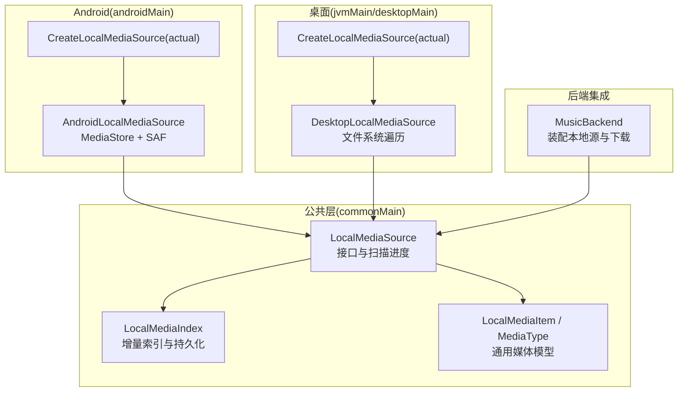
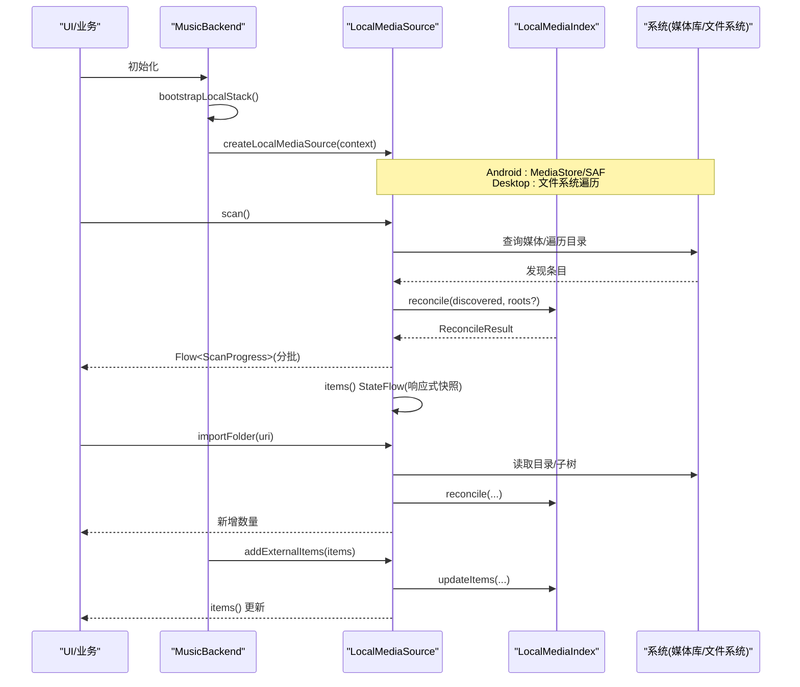
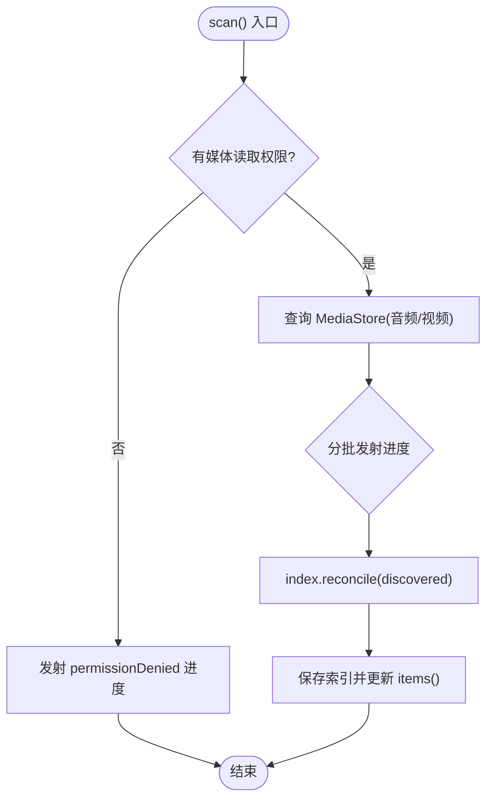
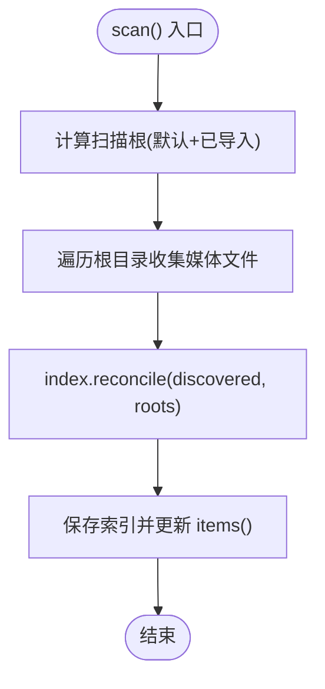
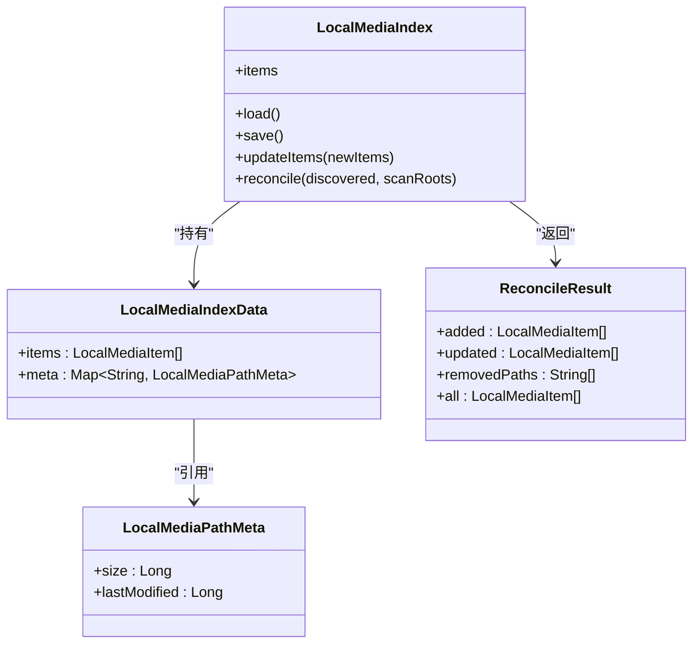
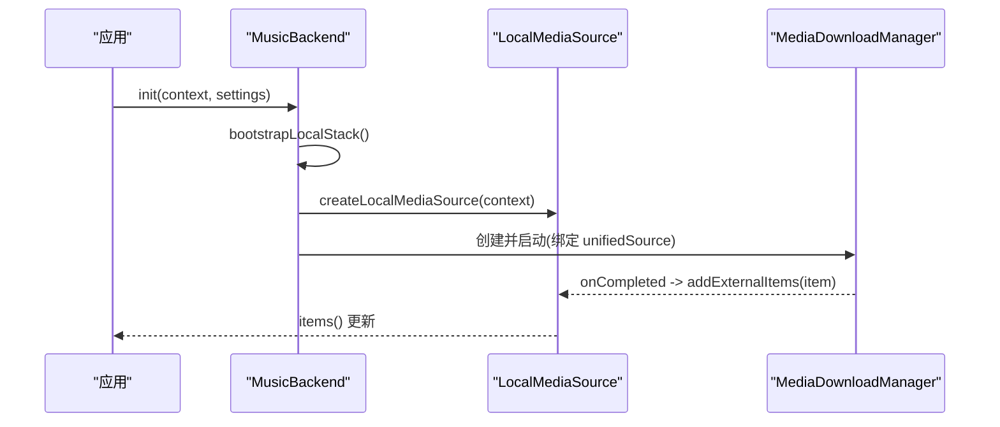
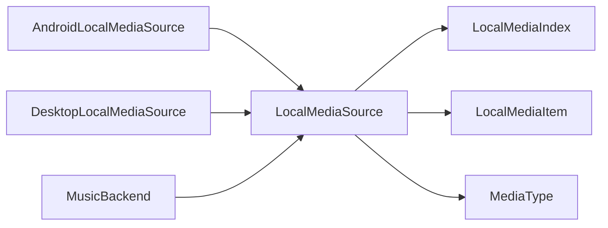

# 本地媒体管理

<cite>
**本文引用的文件**
- [LocalMediaSource.kt](file://kmp-pro/src/commonMain/kotlin/cp/player/kmp/local/LocalMediaSource.kt)
- [AndroidLocalMediaSource.kt](file://kmp-pro/src/androidMain/kotlin/cp/player/kmp/local/AndroidLocalMediaSource.kt)
- [DesktopLocalMediaSource.kt](file://kmp-pro/src/jvmMain/kotlin/cp/player/kmp/local/DesktopLocalMediaSource.kt)
- [CreateLocalMediaSource.kt（Android）](file://kmp-pro/src/androidMain/kotlin/cp/player/kmp/local/CreateLocalMediaSource.kt)
- [CreateLocalMediaSource.kt（Desktop）](file://kmp-pro/src/desktopMain/kotlin/cp/player/kmp/local/CreateLocalMediaSource.kt)
- [LocalMediaIndex.kt](file://kmp-pro/src/commonMain/kotlin/cp/player/kmp/local/LocalMediaIndex.kt)
- [LocalMediaItem.kt](file://kmp-pro/src/commonMain/kotlin/cp/player/kmp/media/LocalMediaItem.kt)
- [MediaType.kt](file://kmp-pro/src/commonMain/kotlin/cp/player/kmp/media/MediaType.kt)
- [MusicBackend.kt](file://kmp-pro/src/commonMain/kotlin/cp/player/kmp/MusicBackend.kt)
</cite>

## 目录
1. [简介](#简介)
2. [项目结构](#项目结构)
3. [核心组件](#核心组件)
4. [架构总览](#架构总览)
5. [详细组件分析](#详细组件分析)
6. [依赖关系分析](#依赖关系分析)
7. [性能考量](#性能考量)
8. [故障排查指南](#故障排查指南)
9. [结论](#结论)

## 简介
本模块实现跨平台“本地媒体管理”，统一扫描、导入与索引本地音频/视频文件，并提供响应式条目列表与扫描进度。它屏蔽了 Android（MediaStore + SAF）与 Desktop（文件系统遍历）的差异，通过统一的接口暴露给上层播放与下载子系统。

## 项目结构
本地媒体管理位于 kmp-pro 模块中，采用 commonMain 定义抽象与数据模型，androidMain/jvmMain 提供平台具体实现，并通过 expect/actual 机制在运行时选择对应实现。

图表来源
- [LocalMediaSource.kt:19-82](file://kmp-pro/src/commonMain/kotlin/cp/player/kmp/local/LocalMediaSource.kt#L19-L82)
- [LocalMediaIndex.kt:57-164](file://kmp-pro/src/commonMain/kotlin/cp/player/kmp/local/LocalMediaIndex.kt#L57-L164)
- [LocalMediaItem.kt:22-45](file://kmp-pro/src/commonMain/kotlin/cp/player/kmp/media/LocalMediaItem.kt#L22-L45)
- [MediaType.kt:9-48](file://kmp-pro/src/commonMain/kotlin/cp/player/kmp/media/MediaType.kt#L9-L48)
- [AndroidLocalMediaSource.kt:40-281](file://kmp-pro/src/androidMain/kotlin/cp/player/kmp/local/AndroidLocalMediaSource.kt#L40-L281)
- [DesktopLocalMediaSource.kt:33-193](file://kmp-pro/src/jvmMain/kotlin/cp/player/kmp/local/DesktopLocalMediaSource.kt#L33-L193)
- [CreateLocalMediaSource.kt（Android）:7-9](file://kmp-pro/src/androidMain/kotlin/cp/player/kmp/local/CreateLocalMediaSource.kt#L7-L9)
- [CreateLocalMediaSource.kt（Desktop）:6-8](file://kmp-pro/src/desktopMain/kotlin/cp/player/kmp/local/CreateLocalMediaSource.kt#L6-L8)
- [MusicBackend.kt:156-170](file://kmp-pro/src/commonMain/kotlin/cp/player/kmp/MusicBackend.kt#L156-L170)

章节来源
- [LocalMediaSource.kt:19-82](file://kmp-pro/src/commonMain/kotlin/cp/player/kmp/local/LocalMediaSource.kt#L19-L82)
- [LocalMediaIndex.kt:57-164](file://kmp-pro/src/commonMain/kotlin/cp/player/kmp/local/LocalMediaIndex.kt#L57-L164)
- [LocalMediaItem.kt:22-45](file://kmp-pro/src/commonMain/kotlin/cp/player/kmp/media/LocalMediaItem.kt#L22-L45)
- [MediaType.kt:9-48](file://kmp-pro/src/commonMain/kotlin/cp/player/kmp/media/MediaType.kt#L9-L48)
- [AndroidLocalMediaSource.kt:40-281](file://kmp-pro/src/androidMain/kotlin/cp/player/kmp/local/AndroidLocalMediaSource.kt#L40-L281)
- [DesktopLocalMediaSource.kt:33-193](file://kmp-pro/src/jvmMain/kotlin/cp/player/kmp/local/DesktopLocalMediaSource.kt#L33-L193)
- [CreateLocalMediaSource.kt（Android）:7-9](file://kmp-pro/src/androidMain/kotlin/cp/player/kmp/local/CreateLocalMediaSource.kt#L7-L9)
- [CreateLocalMediaSource.kt（Desktop）:6-8](file://kmp-pro/src/desktopMain/kotlin/cp/player/kmp/local/CreateLocalMediaSource.kt#L6-L8)
- [MusicBackend.kt:156-170](file://kmp-pro/src/commonMain/kotlin/cp/player/kmp/MusicBackend.kt#L156-L170)

## 核心组件
- LocalMediaSource：统一本地媒体源接口，定义扫描、导入、移除、条目流、扫描状态与外部登记等能力。
- AndroidLocalMediaSource：基于 MediaStore 的增量扫描与 SAF 树导入，处理权限与分批进度。
- DesktopLocalMediaSource：基于文件系统遍历默认音乐/视频目录与已导入文件夹，按扩展名白名单过滤。
- LocalMediaIndex：JSON 持久化的增量索引，维护 items 与 path→元信息映射，支持 reconcile 合并。
- LocalMediaItem/MediaType：通用媒体条目与类型推断（音频/视频/其他）。
- MusicBackend：后端入口，惰性创建并装配本地媒体源，将下载完成产物登记回本地源。

章节来源
- [LocalMediaSource.kt:19-82](file://kmp-pro/src/commonMain/kotlin/cp/player/kmp/local/LocalMediaSource.kt#L19-L82)
- [AndroidLocalMediaSource.kt:40-281](file://kmp-pro/src/androidMain/kotlin/cp/player/kmp/local/AndroidLocalMediaSource.kt#L40-L281)
- [DesktopLocalMediaSource.kt:33-193](file://kmp-pro/src/jvmMain/kotlin/cp/player/kmp/local/DesktopLocalMediaSource.kt#L33-L193)
- [LocalMediaIndex.kt:57-164](file://kmp-pro/src/commonMain/kotlin/cp/player/kmp/local/LocalMediaIndex.kt#L57-L164)
- [LocalMediaItem.kt:22-45](file://kmp-pro/src/commonMain/kotlin/cp/player/kmp/media/LocalMediaItem.kt#L22-L45)
- [MediaType.kt:9-48](file://kmp-pro/src/commonMain/kotlin/cp/player/kmp/media/MediaType.kt#L9-L48)
- [MusicBackend.kt:156-170](file://kmp-pro/src/commonMain/kotlin/cp/player/kmp/MusicBackend.kt#L156-L170)

## 架构总览
本地媒体管理以接口为中心，平台差异由 actual 实现承担；索引层负责增量合并与持久化；后端在初始化时装配本地源，并将下载完成项登记到本地源，形成闭环。

图表来源
- [MusicBackend.kt:156-170](file://kmp-pro/src/commonMain/kotlin/cp/player/kmp/MusicBackend.kt#L156-L170)
- [LocalMediaSource.kt:19-82](file://kmp-pro/src/commonMain/kotlin/cp/player/kmp/local/LocalMediaSource.kt#L19-L82)
- [AndroidLocalMediaSource.kt:66-131](file://kmp-pro/src/androidMain/kotlin/cp/player/kmp/local/AndroidLocalMediaSource.kt#L66-L131)
- [DesktopLocalMediaSource.kt:66-114](file://kmp-pro/src/jvmMain/kotlin/cp/player/kmp/local/DesktopLocalMediaSource.kt#L66-L114)
- [LocalMediaIndex.kt:91-136](file://kmp-pro/src/commonMain/kotlin/cp/player/kmp/local/LocalMediaIndex.kt#L91-L136)

## 详细组件分析

### 接口与数据模型
- LocalMediaSource
  - scan(): 触发增量扫描，返回 Flow<ScanProgress>，按批次发射，缺失权限时仅提示不抛异常。
  - importFolder(uri): 导入文件夹/SAF 树，返回新增条目数。
  - removeItem(item)/addExternalItems(items): 移除或登记外部条目（如下载完成）。
  - items()/isScanningFlow: 响应式快照。
- LocalMediaItem/MediaType
  - 通用条目包含路径、标题、艺术家、专辑、时长、大小、媒体类型、封面、来源、修改时间。
  - MediaType.fromFileName 根据扩展名推断音频/视频/其他。

章节来源
- [LocalMediaSource.kt:19-82](file://kmp-pro/src/commonMain/kotlin/cp/player/kmp/local/LocalMediaSource.kt#L19-L82)
- [LocalMediaItem.kt:22-45](file://kmp-pro/src/commonMain/kotlin/cp/player/kmp/media/LocalMediaItem.kt#L22-L45)
- [MediaType.kt:9-48](file://kmp-pro/src/commonMain/kotlin/cp/player/kmp/media/MediaType.kt#L9-L48)

### Android 本地媒体源
- 扫描流程
  - 检查媒体读取权限（API 33+ 为 READ_MEDIA_AUDIO），无权限则发射 permissionDenied 进度。
  - 查询 MediaStore 的 Audio 与 Video（后者需额外权限），构造 LocalMediaItem。
  - 分批发射 ScanProgress，完成后调用 index.reconcile 合并并保存。
- 导入流程
  - 校验 content:// 树 URI 与持久化读取权限，递归遍历子树，按 MIME/扩展名过滤。
  - 去重后并入索引，更新 items 流。
- 并发与一致性
  - 使用 Mutex 保护「index 读改写 + _items 赋值 + save」临界区，避免与下载登记竞争。
- 权限与健壮性
  - 对子树查询失败进行捕获并跳过分支，保证整体稳定性。

图表来源
- [AndroidLocalMediaSource.kt:66-97](file://kmp-pro/src/androidMain/kotlin/cp/player/kmp/local/AndroidLocalMediaSource.kt#L66-L97)
- [AndroidLocalMediaSource.kt:172-233](file://kmp-pro/src/androidMain/kotlin/cp/player/kmp/local/AndroidLocalMediaSource.kt#L172-L233)
- [LocalMediaIndex.kt:91-136](file://kmp-pro/src/commonMain/kotlin/cp/player/kmp/local/LocalMediaIndex.kt#L91-L136)

章节来源
- [AndroidLocalMediaSource.kt:40-281](file://kmp-pro/src/androidMain/kotlin/cp/player/kmp/local/AndroidLocalMediaSource.kt#L40-L281)

### Desktop 本地媒体源
- 扫描范围
  - 默认根目录：用户主目录下的 Music/Videos，加上已导入文件夹列表。
  - 仅保留存在的目录，去重后遍历。
- 文件收集
  - 深度优先遍历，按扩展名白名单（复用 MediaType.fromFileName）筛选媒体文件。
  - 轻量元数据：title 来自文件名，duration 未知填 0。
- 增量合并
  - 同样调用 index.reconcile，传入本次扫描根目录，用于判断消失条目归属。
- 导入文件夹
  - 记录导入目录列表并持久化，随后执行一次全量扫描合并。

图表来源
- [DesktopLocalMediaSource.kt:66-87](file://kmp-pro/src/jvmMain/kotlin/cp/player/kmp/local/DesktopLocalMediaSource.kt#L66-L87)
- [DesktopLocalMediaSource.kt:145-182](file://kmp-pro/src/jvmMain/kotlin/cp/player/kmp/local/DesktopLocalMediaSource.kt#L145-L182)
- [LocalMediaIndex.kt:91-136](file://kmp-pro/src/commonMain/kotlin/cp/player/kmp/local/LocalMediaIndex.kt#L91-L136)

章节来源
- [DesktopLocalMediaSource.kt:33-193](file://kmp-pro/src/jvmMain/kotlin/cp/player/kmp/local/DesktopLocalMediaSource.kt#L33-L193)

### 索引与增量合并
- 数据结构
  - LocalMediaIndexData：items 列表与 path→{size,lastModified} 元信息映射。
  - ReconcileResult：新增、更新、删除路径与合并后的完整列表。
- 合并策略
  - 新增：path 不存在则加入。
  - 更新：size 或 lastModified 变化则重建条目。
  - 保持：未变化则沿用旧条目。
  - 删除：不在本次 discovered 中的条目，若为 content:// 或 DOWNLOADED 来源，或不在本次扫描根下，则原样保留；否则标记为删除。
- 持久化
  - JSON 存储于平台数据目录（Android: filesDir/local-media；Desktop: ~/.kmp-pro/local-media）。

图表来源
- [LocalMediaIndex.kt:12-43](file://kmp-pro/src/commonMain/kotlin/cp/player/kmp/local/LocalMediaIndex.kt#L12-L43)
- [LocalMediaIndex.kt:57-164](file://kmp-pro/src/commonMain/kotlin/cp/player/kmp/local/LocalMediaIndex.kt#L57-L164)

章节来源
- [LocalMediaIndex.kt:57-164](file://kmp-pro/src/commonMain/kotlin/cp/player/kmp/local/LocalMediaIndex.kt#L57-L164)

### 后端集成与生命周期
- 惰性装配
  - MusicBackend 在 init 末尾调用 bootstrapLocalStack()，先创建 localMedia（实际实现由 createLocalMediaSource 决定），再创建 downloadManager。
- 下载联动
  - 下载管理器绑定 unifiedSource，并在下载完成回调中将产物登记到 localMedia.addExternalItems，确保本地库可见。
- 统一路由
  - attachLocalMedia 会重建 UnifiedMusicSourceImpl，使本地源参与统一 MediaId 路由。

图表来源
- [MusicBackend.kt:156-170](file://kmp-pro/src/commonMain/kotlin/cp/player/kmp/MusicBackend.kt#L156-L170)
- [MusicBackend.kt:172-195](file://kmp-pro/src/commonMain/kotlin/cp/player/kmp/MusicBackend.kt#L172-L195)
- [MusicBackend.kt:411-449](file://kmp-pro/src/commonMain/kotlin/cp/player/kmp/MusicBackend.kt#L411-L449)

章节来源
- [MusicBackend.kt:156-195](file://kmp-pro/src/commonMain/kotlin/cp/player/kmp/MusicBackend.kt#L156-L195)
- [MusicBackend.kt:411-449](file://kmp-pro/src/commonMain/kotlin/cp/player/kmp/MusicBackend.kt#L411-L449)

## 依赖关系分析
- 耦合度
  - LocalMediaSource 与 LocalMediaIndex 低耦合：前者负责 IO 与流程控制，后者专注增量合并与持久化。
  - 平台实现仅依赖 commonMain 接口与数据模型，便于替换与测试。
- 外部依赖
  - Android：MediaStore、DocumentsContract、权限系统。
  - Desktop：文件系统 API、JSON 序列化。
- 潜在循环依赖
  - 无直接循环；MusicBackend 通过工厂方法创建 LocalMediaSource，避免强耦合。

图表来源
- [LocalMediaSource.kt:19-82](file://kmp-pro/src/commonMain/kotlin/cp/player/kmp/local/LocalMediaSource.kt#L19-L82)
- [LocalMediaIndex.kt:57-164](file://kmp-pro/src/commonMain/kotlin/cp/player/kmp/local/LocalMediaIndex.kt#L57-L164)
- [LocalMediaItem.kt:22-45](file://kmp-pro/src/commonMain/kotlin/cp/player/kmp/media/LocalMediaItem.kt#L22-L45)
- [MediaType.kt:9-48](file://kmp-pro/src/commonMain/kotlin/cp/player/kmp/media/MediaType.kt#L9-L48)
- [AndroidLocalMediaSource.kt:40-281](file://kmp-pro/src/androidMain/kotlin/cp/player/kmp/local/AndroidLocalMediaSource.kt#L40-L281)
- [DesktopLocalMediaSource.kt:33-193](file://kmp-pro/src/jvmMain/kotlin/cp/player/kmp/local/DesktopLocalMediaSource.kt#L33-L193)
- [MusicBackend.kt:156-170](file://kmp-pro/src/commonMain/kotlin/cp/player/kmp/MusicBackend.kt#L156-L170)

章节来源
- [LocalMediaSource.kt:19-82](file://kmp-pro/src/commonMain/kotlin/cp/player/kmp/local/LocalMediaSource.kt#L19-L82)
- [LocalMediaIndex.kt:57-164](file://kmp-pro/src/commonMain/kotlin/cp/player/kmp/local/LocalMediaIndex.kt#L57-L164)
- [MusicBackend.kt:156-170](file://kmp-pro/src/commonMain/kotlin/cp/player/kmp/MusicBackend.kt#L156-L170)

## 性能考量
- 批量发射
  - 扫描按固定批次（约 50 条/批）发射进度，降低 UI 压力与内存峰值。
- 增量合并
  - 基于 size/lastModified 的元信息比对，避免重复解析大文件，提升重扫效率。
- 并发安全
  - 使用 Mutex 保护索引读写与 StateFlow 更新，避免下载登记与扫描并发导致的数据不一致。
- I/O 调度
  - 扫描与文件遍历运行在 IO 线程池，避免阻塞主线程。
- 权限优化
  - Android 端按需请求视频权限，减少不必要的授权提示。

[本节为通用性能建议，无需特定文件引用]

## 故障排查指南
- 扫描无结果
  - Android：确认已授予媒体读取权限；若无权限，scan 会发射 permissionDenied 进度，引导用户授权。
  - Desktop：确认默认目录存在且可访问；检查已导入文件夹是否有效。
- 导入文件夹无效
  - Android：确保 uri 为 content:// 树且具备持久化读取权限；权限丢失时会跳过并返回 0。
  - Desktop：确保传入的是有效目录路径。
- 条目未更新
  - 检查 index.json 是否损坏或被外部修改；索引加载失败会重置为空索引。
  - 确认 reconcile 的 scanRoots 设置是否正确，避免误删非扫描根下的条目。
- 下载产物未入库
  - 确认下载管理器已正确绑定 unifiedSource，并在完成回调中调用 addExternalItems。

章节来源
- [AndroidLocalMediaSource.kt:66-97](file://kmp-pro/src/androidMain/kotlin/cp/player/kmp/local/AndroidLocalMediaSource.kt#L66-L97)
- [AndroidLocalMediaSource.kt:99-131](file://kmp-pro/src/androidMain/kotlin/cp/player/kmp/local/AndroidLocalMediaSource.kt#L99-L131)
- [LocalMediaIndex.kt:68-82](file://kmp-pro/src/commonMain/kotlin/cp/player/kmp/local/LocalMediaIndex.kt#L68-L82)
- [MusicBackend.kt:172-195](file://kmp-pro/src/commonMain/kotlin/cp/player/kmp/MusicBackend.kt#L172-L195)

## 结论
本地媒体管理模块通过统一的接口与增量索引机制，实现了跨平台的本地音频/视频文件扫描、导入与持久化管理。其设计清晰、职责分离明确，并与后端下载子系统紧密协作，确保下载产物及时入库。建议在大规模媒体库场景下关注权限引导与扫描批次的调优，以获得更流畅的用户体验。