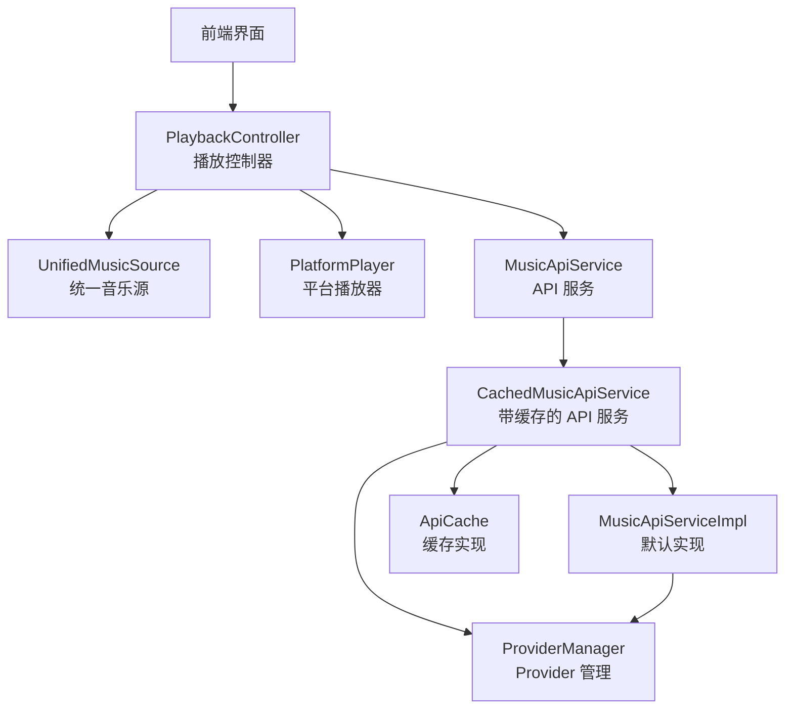
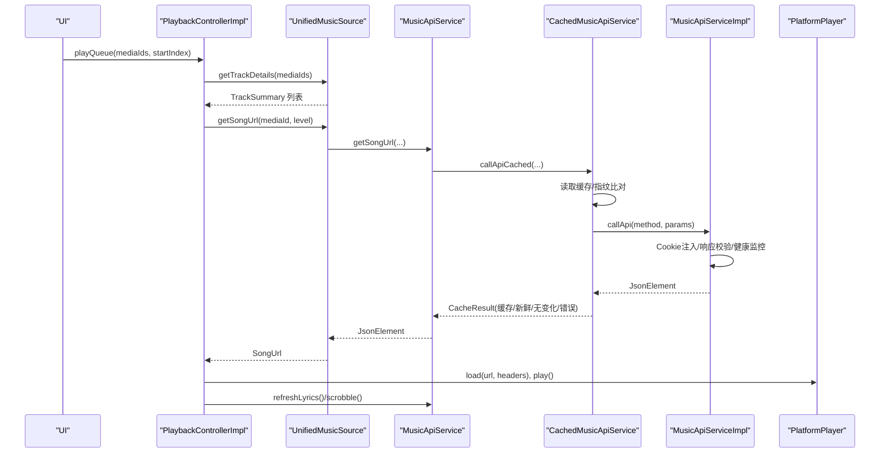
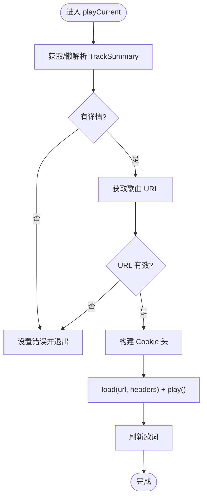
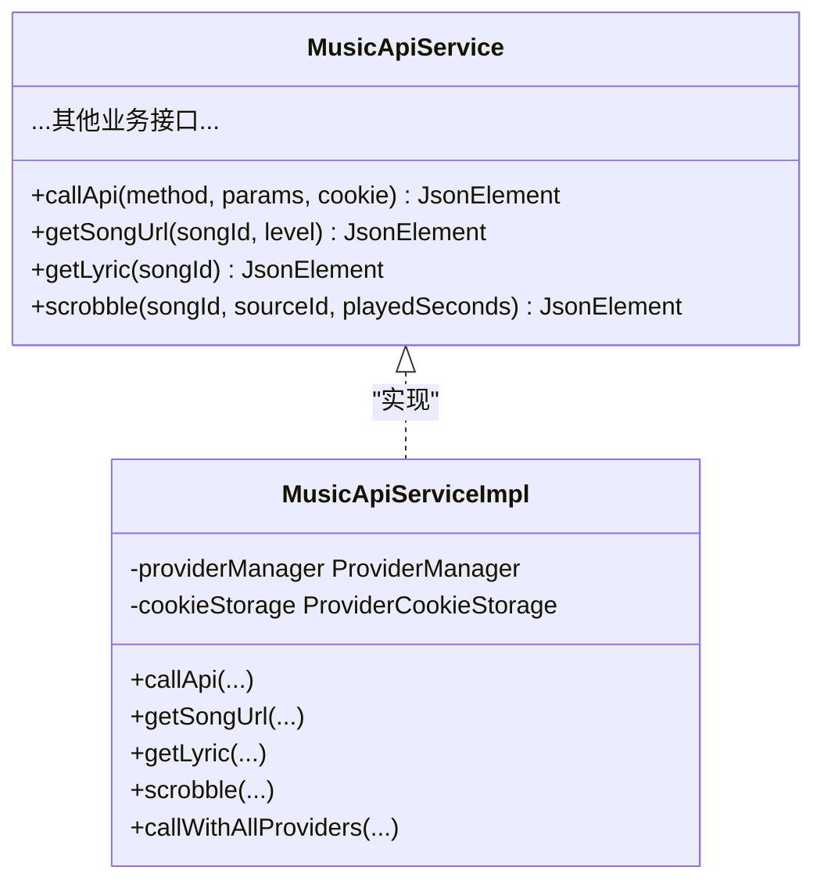
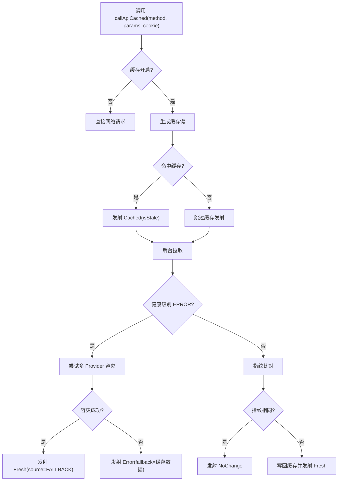
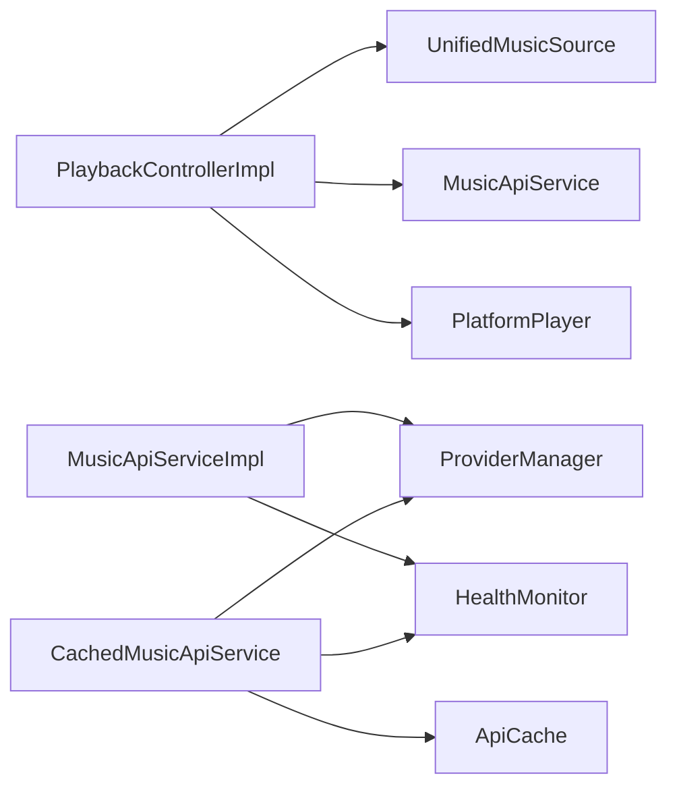

# 核心模块

<cite>
**本文引用的文件**
- [PlaybackController.kt](file://kmp-pro/src/commonMain/kotlin/cp/player/kmp/playback/PlaybackController.kt)
- [PlaybackControllerImpl.kt](file://kmp-pro/src/commonMain/kotlin/cp/player/kmp/playback/PlaybackControllerImpl.kt)
- [MusicApiService.kt](file://kmp-pro/src/commonMain/kotlin/cp/player/kmp/api/MusicApiService.kt)
- [MusicApiServiceImpl.kt](file://kmp-pro/src/commonMain/kotlin/cp/player/kmp/api/MusicApiServiceImpl.kt)
- [CachedMusicApiService.kt](file://kmp-pro/src/commonMain/kotlin/cp/player/kmp/cache/CachedMusicApiService.kt)
- [ApiCache.kt](file://kmp-pro/src/commonMain/kotlin/cp/player/kmp/cache/ApiCache.kt)
- [CacheConfig.kt](file://kmp-pro/src/commonMain/kotlin/cp/player/kmp/cache/CacheConfig.kt)
- [PlatformPlayer.kt](file://kmp-pro/src/commonMain/kotlin/cp/player/kmp/playback/PlatformPlayer.kt)
- [UnifiedMusicSource.kt](file://kmp-pro/src/commonMain/kotlin/cp/player/kmp/music/UnifiedMusicSource.kt)
</cite>

## 目录
1. [简介](#简介)
2. [项目结构](#项目结构)
3. [核心组件](#核心组件)
4. [架构总览](#架构总览)
5. [详细组件分析](#详细组件分析)
6. [依赖关系分析](#依赖关系分析)
7. [性能考量](#性能考量)
8. [故障排查指南](#故障排查指南)
9. [结论](#结论)
10. [附录：接口与配置速查](#附录接口与配置速查)

## 简介
本技术文档聚焦 CPPlayer-KMP 的核心模块，围绕播放控制系统、API 服务层与缓存系统展开，详细说明各组件的职责边界、调用关系、关键接口定义与使用模式。重点覆盖：
- PlaybackController 的播放控制逻辑（队列管理、自动续播、收藏、歌词、睡眠定时、音质降级等）
- MusicApiService 的网络请求封装（统一入口、Cookie 注入、响应校验与健康监控）
- CachedMusicApiService 的缓存策略与健康监控深度集成（多 Provider 容灾回退）

文档兼顾初学者友好与资深开发者所需的技术深度，提供流程图、时序图与类图辅助理解。

## 项目结构
核心代码位于 kmp-pro 模块的 commonMain 中，按职责分层组织：
- playback：播放控制与平台播放器抽象
- api：统一的音乐 API 服务接口与实现
- cache：API 响应缓存与配置
- music：统一音乐源抽象（资源定位、URL 获取、搜索等）
- provider：Provider 管理与 Cookie 存储（被 api/cache 使用）
- monitor：健康监控（被 api/cache 使用）

图表来源
- [PlaybackController.kt:16-106](file://kmp-pro/src/commonMain/kotlin/cp/player/kmp/playback/PlaybackController.kt#L16-L106)
- [MusicApiService.kt:24-528](file://kmp-pro/src/commonMain/kotlin/cp/player/kmp/api/MusicApiService.kt#L24-L528)
- [CachedMusicApiService.kt:46-219](file://kmp-pro/src/commonMain/kotlin/cp/player/kmp/cache/CachedMusicApiService.kt#L46-L219)
- [MusicApiServiceImpl.kt:28-714](file://kmp-pro/src/commonMain/kotlin/cp/player/kmp/api/MusicApiServiceImpl.kt#L28-L714)
- [ApiCache.kt:11-67](file://kmp-pro/src/commonMain/kotlin/cp/player/kmp/cache/ApiCache.kt#L11-L67)
- [PlatformPlayer.kt:16-135](file://kmp-pro/src/commonMain/kotlin/cp/player/kmp/playback/PlatformPlayer.kt#L16-L135)
- [UnifiedMusicSource.kt:7-39](file://kmp-pro/src/commonMain/kotlin/cp/player/kmp/music/UnifiedMusicSource.kt#L7-L39)

章节来源
- [PlaybackController.kt:16-106](file://kmp-pro/src/commonMain/kotlin/cp/player/kmp/playback/PlaybackController.kt#L16-L106)
- [MusicApiService.kt:24-528](file://kmp-pro/src/commonMain/kotlin/cp/player/kmp/api/MusicApiService.kt#L24-L528)
- [CachedMusicApiService.kt:46-219](file://kmp-pro/src/commonMain/kotlin/cp/player/kmp/cache/CachedMusicApiService.kt#L46-L219)
- [MusicApiServiceImpl.kt:28-714](file://kmp-pro/src/commonMain/kotlin/cp/player/kmp/api/MusicApiServiceImpl.kt#L28-L714)
- [ApiCache.kt:11-67](file://kmp-pro/src/commonMain/kotlin/cp/player/kmp/cache/ApiCache.kt#L11-L67)
- [PlatformPlayer.kt:16-135](file://kmp-pro/src/commonMain/kotlin/cp/player/kmp/playback/PlatformPlayer.kt#L16-L135)
- [UnifiedMusicSource.kt:7-39](file://kmp-pro/src/commonMain/kotlin/cp/player/kmp/music/UnifiedMusicSource.kt#L7-L39)

## 核心组件
- PlaybackController：播放控制的唯一入口，屏蔽引擎差异、URL 解析、歌词格式转换等细节，暴露 StateFlow 状态供 UI 渲染。
- MusicApiService：统一 API 服务接口，所有音乐相关网络调用均通过此接口进行；实现类负责 Cookie 注入、响应校验与健康监控记录。
- CachedMusicApiService：对 MusicApiService 的装饰器，提供“先返回缓存再后台拉取”的 Flow 结果，并集成健康监控与多 Provider 容灾回退。
- PlatformPlayer：平台无关的播放器抽象，封装加载、播放、暂停、跳转、音量等操作，并通过 StateFlow 暴露状态。
- UnifiedMusicSource：统一音乐源抽象，聚合多 Provider 和本地音乐，对外暴露资源详情与 URL 获取能力。

章节来源
- [PlaybackController.kt:16-106](file://kmp-pro/src/commonMain/kotlin/cp/player/kmp/playback/PlaybackController.kt#L16-L106)
- [MusicApiService.kt:24-528](file://kmp-pro/src/commonMain/kotlin/cp/player/kmp/api/MusicApiService.kt#L24-L528)
- [CachedMusicApiService.kt:46-219](file://kmp-pro/src/commonMain/kotlin/cp/player/kmp/cache/CachedMusicApiService.kt#L46-L219)
- [PlatformPlayer.kt:16-135](file://kmp-pro/src/commonMain/kotlin/cp/player/kmp/playback/PlatformPlayer.kt#L16-L135)
- [UnifiedMusicSource.kt:7-39](file://kmp-pro/src/commonMain/kotlin/cp/player/kmp/music/UnifiedMusicSource.kt#L7-L39)

## 架构总览
播放控制流与网络请求流的交互如下：

图表来源
- [PlaybackControllerImpl.kt:144-158](file://kmp-pro/src/commonMain/kotlin/cp/player/kmp/playback/PlaybackControllerImpl.kt#L144-L158)
- [MusicApiServiceImpl.kt:189-221](file://kmp-pro/src/commonMain/kotlin/cp/player/kmp/api/MusicApiServiceImpl.kt#L189-L221)
- [CachedMusicApiService.kt:60-140](file://kmp-pro/src/commonMain/kotlin/cp/player/kmp/cache/CachedMusicApiService.kt#L60-L140)
- [PlatformPlayer.kt:23-31](file://kmp-pro/src/commonMain/kotlin/cp/player/kmp/playback/PlatformPlayer.kt#L23-L31)

## 详细组件分析

### 播放控制器 PlaybackController
- 职责
  - 队列管理：支持设置队列、追加、移除、移动条目、清空队列、跳转到指定索引播放。
  - 播放控制：播放/暂停、下一首/上一首、循环模式、随机播放。
  - 收藏：当前曲目收藏切换、指定媒体 ID 收藏切换、刷新收藏列表。
  - 音质：设置在线播放音质等级，影响后续加载的曲目。
  - 睡眠定时：N 分钟后暂停或播完当前曲目后暂停。
  - 歌词：强制重新拉取当前曲目歌词。
  - 音量与释放：设置音量、释放资源。
- 状态流
  - state: StateFlow<PlaybackUiState>，包含当前曲目、队列、播放状态、缓冲、位置、时长、歌词、格式信息、错误、来源、收藏态、音质、睡眠定时等。
- 关键行为
  - 懒解析：队列中的 TrackSummary 延迟解析，优先解析当前及前后条目。
  - 自动续播：根据 RepeatMode 与 shuffle 顺序自动推进到下一首。
  - 音质降级：播放失败时尝试以 standard 音质重试一次。
  - 听歌打卡：播放中每秒计数，每固定间隔上报 scrobble。
  - 歌词高亮：根据当前位置计算活跃歌词行索引。

图表来源
- [PlaybackControllerImpl.kt:496-556](file://kmp-pro/src/commonMain/kotlin/cp/player/kmp/playback/PlaybackControllerImpl.kt#L496-L556)

章节来源
- [PlaybackController.kt:16-106](file://kmp-pro/src/commonMain/kotlin/cp/player/kmp/playback/PlaybackController.kt#L16-L106)
- [PlaybackControllerImpl.kt:144-763](file://kmp-pro/src/commonMain/kotlin/cp/player/kmp/playback/PlaybackControllerImpl.kt#L144-L763)
- [PlaybackUiState.kt:12-35](file://kmp-pro/src/commonMain/kotlin/cp/player/kmp/playback/PlaybackUiState.kt#L12-L35)

### API 服务层 MusicApiService
- 设计原则
  - 统一入口：所有音乐 API 调用通过此接口，禁止直接调用底层 Provider。
  - 返回类型：方法签名返回 JsonElement，由调用方解析为领域模型。
  - Cookie 注入：内部自动注入 cookie，调用方无需手动传递。
  - 错误格式：统一返回 {"code": 500, "msg": "..."} 格式的 JSON。
  - 异步执行：所有方法均为 suspend fun，内部在 IO 线程执行网络调用。
- 主要功能域
  - 认证：扫码登录、邮箱/手机号登录、登出、匿名登录、登录状态查询。
  - 用户：歌单列表、云盘歌曲、喜欢列表、推荐等。
  - 歌单：详情、全部歌曲、添加/删除、创建/删除、收藏/取消收藏。
  - 专辑/歌手：详情、歌曲/专辑列表。
  - 搜索：云搜索、热搜、搜索建议。
  - 播放：歌曲 URL（302 重定向版本优先）、下载 URL、歌曲详情、私人 FM、智能列表、歌词、听歌打卡。
  - 社交：评论、消息、私信。
  - 排行榜/推荐/相似/签到/MV/视频/电台/扩展接口等。
- 实现要点（MusicApiServiceImpl）
  - 通过 ProviderManager 将请求委托给当前活跃 Provider。
  - 自动按 Provider 注入 cookie。
  - URL 解析等多 Provider 容灾使用 callWithAllProviders。
  - 响应兼容性验证 + HealthMonitor 三级分类记录。
  - 特殊处理 302 重定向端点（song/url/v1/302），若成功则注入 redirectUrl。

图表来源
- [MusicApiService.kt:24-528](file://kmp-pro/src/commonMain/kotlin/cp/player/kmp/api/MusicApiService.kt#L24-L528)
- [MusicApiServiceImpl.kt:28-714](file://kmp-pro/src/commonMain/kotlin/cp/player/kmp/api/MusicApiServiceImpl.kt#L28-L714)

章节来源
- [MusicApiService.kt:24-528](file://kmp-pro/src/commonMain/kotlin/cp/player/kmp/api/MusicApiService.kt#L24-L528)
- [MusicApiServiceImpl.kt:28-714](file://kmp-pro/src/commonMain/kotlin/cp/player/kmp/api/MusicApiServiceImpl.kt#L28-L714)

### 缓存系统 CachedMusicApiService
- 调用流程（每个请求返回多值的 Flow）
  - 先返回缓存：若存在条目，立即发射 Cached（标记是否超过 freshTtlMs）。
  - 后台拉取 + 指纹比对：
    - 成功且指纹相同 → NoChange（可忽略）
    - 成功且指纹不同 → Fresh（写回缓存）
    - 失败 → Error（附带 fallback 缓存数据）
  - 健康监控深度集成：
    - ERROR 级别触发多 Provider 容灾（callWithAllProviders），成功则标记 FALLBACK。
    - WARNING 级别仍发射数据，附带 warnings。
    - OK 级别正常发射。
- 缓存策略
  - 键：providerId#method#sortedParams#cookieHash。
  - 仅对幂等的“读”类接口缓存；写/动作类直通网络。
  - 默认内存 LRU 缓存，最大条目数可配置。
- 配置项（CacheConfig）
  - freshTtlMs：缓存“新鲜”阈值（超过视为 stale，但仍先返回）。
  - maxEntries：内存缓存最大条目数。
  - enableFallback：是否在 ERROR 时启用多 Provider 容灾。
  - enableCache：总开关；false 时所有请求直通底层。

图表来源
- [CachedMusicApiService.kt:60-140](file://kmp-pro/src/commonMain/kotlin/cp/player/kmp/cache/CachedMusicApiService.kt#L60-L140)
- [ApiCache.kt:52-67](file://kmp-pro/src/commonMain/kotlin/cp/player/kmp/cache/ApiCache.kt#L52-L67)
- [CacheConfig.kt:11-16](file://kmp-pro/src/commonMain/kotlin/cp/player/kmp/cache/CacheConfig.kt#L11-L16)

章节来源
- [CachedMusicApiService.kt:46-219](file://kmp-pro/src/commonMain/kotlin/cp/player/kmp/cache/CachedMusicApiService.kt#L46-L219)
- [ApiCache.kt:11-67](file://kmp-pro/src/commonMain/kotlin/cp/player/kmp/cache/ApiCache.kt#L11-L67)
- [CacheConfig.kt:11-16](file://kmp-pro/src/commonMain/kotlin/cp/player/kmp/cache/CacheConfig.kt#L11-L16)

### 平台播放器 PlatformPlayer
- 抽象接口：state、positionMs、durationMs、formatInfo 等状态流；load、play、pause、seekTo、stop、release、setVolume 等操作。
- 默认实现：AudioPlayerImpl，基于 composemediaplayer 的 AudioPlayer，轮询状态并更新 StateFlow。
- 与播放控制器的协作：PlaybackControllerImpl 监听平台状态，折叠进 PlaybackUiState，并在播放结束时自动续播。

章节来源
- [PlatformPlayer.kt:16-135](file://kmp-pro/src/commonMain/kotlin/cp/player/kmp/playback/PlatformPlayer.kt#L16-L135)
- [PlaybackControllerImpl.kt:96-127](file://kmp-pro/src/commonMain/kotlin/cp/player/kmp/playback/PlaybackControllerImpl.kt#L96-L127)

### 统一音乐源 UnifiedMusicSource
- 职责：整合多 Provider 和本地音乐，对外暴露资源定位与 URL 获取能力。
- 关键方法：getTrackDetail、getTrackDetails、getSongUrl、search、getUserPlaylists。
- 与播放控制器的协作：PlaybackControllerImpl 通过该接口获取歌曲详情与播放 URL，屏蔽底层 Provider 差异。

章节来源
- [UnifiedMusicSource.kt:7-39](file://kmp-pro/src/commonMain/kotlin/cp/player/kmp/music/UnifiedMusicSource.kt#L7-L39)
- [PlaybackControllerImpl.kt:505-556](file://kmp-pro/src/commonMain/kotlin/cp/player/kmp/playback/PlaybackControllerImpl.kt#L505-L556)

## 依赖关系分析
- 耦合与内聚
  - PlaybackControllerImpl 高内聚于播放控制逻辑，低耦合于 PlatformPlayer 与 UnifiedMusicSource。
  - MusicApiServiceImpl 通过 ProviderManager 解耦具体后端实现，便于多 Provider 容灾。
  - CachedMusicApiService 作为装饰器，增强 MusicApiService 的缓存与健康监控能力，不改变上层调用方式。
- 直接/间接依赖
  - PlaybackControllerImpl → UnifiedMusicSource、MusicApiService、PlatformPlayer。
  - MusicApiServiceImpl → ProviderManager、ProviderCookieStorage、HealthMonitor。
  - CachedMusicApiService → ApiCache、ProviderManager、HealthMonitor。
- 外部依赖与集成点
  - ProviderManager：动态选择当前 Provider，支持多后端。
  - HealthMonitor：记录 API 调用健康度，用于容灾决策与告警。
  - ApiCache：进程内 LRU 缓存，可扩展为持久化实现。

图表来源
- [PlaybackControllerImpl.kt:35-41](file://kmp-pro/src/commonMain/kotlin/cp/player/kmp/playback/PlaybackControllerImpl.kt#L35-L41)
- [MusicApiServiceImpl.kt:28-31](file://kmp-pro/src/commonMain/kotlin/cp/player/kmp/api/MusicApiServiceImpl.kt#L28-L31)
- [CachedMusicApiService.kt:46-52](file://kmp-pro/src/commonMain/kotlin/cp/player/kmp/cache/CachedMusicApiService.kt#L46-L52)

章节来源
- [PlaybackControllerImpl.kt:35-41](file://kmp-pro/src/commonMain/kotlin/cp/player/kmp/playback/PlaybackControllerImpl.kt#L35-L41)
- [MusicApiServiceImpl.kt:28-31](file://kmp-pro/src/commonMain/kotlin/cp/player/kmp/api/MusicApiServiceImpl.kt#L28-L31)
- [CachedMusicApiService.kt:46-52](file://kmp-pro/src/commonMain/kotlin/cp/player/kmp/cache/CachedMusicApiService.kt#L46-L52)

## 性能考量
- 缓存命中率与新鲜度
  - 合理设置 freshTtlMs，平衡实时性与性能；过短导致频繁网络请求，过长可能导致数据陈旧。
  - 仅对幂等读接口缓存，避免写操作污染缓存。
- 多 Provider 容灾
  - 在 ERROR 级别触发容灾，提升可用性；但会增加额外网络开销，需结合业务场景权衡。
- 队列懒解析与批量获取
  - 队列条目延迟解析，优先解析当前及前后条目，减少不必要请求。
  - 批量获取歌曲详情，降低网络往返次数。
- 音质降级
  - 播放失败时自动降级到 standard 音质重试，提高成功率，但可能牺牲音质。
- 平台播放器轮询
  - 状态轮询间隔（如 200ms）影响 UI 更新频率与性能，需根据设备性能调整。

[本节为通用性能讨论，不直接分析具体文件]

## 故障排查指南
- 播放失败
  - 现象：无法获取播放地址或加载失败。
  - 排查：检查 UnifiedMusicSource.getSongUrl 返回值；确认 Cookie 是否正确注入；观察是否触发音质降级。
  - 参考路径：[PlaybackControllerImpl.kt:525-556](file://kmp-pro/src/commonMain/kotlin/cp/player/kmp/playback/PlaybackControllerImpl.kt#L525-L556)
- 歌词加载失败
  - 现象：歌词为空或报错。
  - 排查：检查 MusicApiService.getLyric 返回；确认歌词解析逻辑；查看 LyricsState 状态。
  - 参考路径：[PlaybackControllerImpl.kt:457-481](file://kmp-pro/src/commonMain/kotlin/cp/player/kmp/playback/PlaybackControllerImpl.kt#L457-L481)
- 收藏状态不一致
  - 现象：收藏按钮状态与实际不符。
  - 排查：检查 ensureFavoritesLoadedInternal 是否成功拉取；确认 likeSong 返回码；观察乐观更新与回滚逻辑。
  - 参考路径：[PlaybackControllerImpl.kt:359-401](file://kmp-pro/src/commonMain/kotlin/cp/player/kmp/playback/PlaybackControllerImpl.kt#L359-L401)
- 缓存未命中或数据陈旧
  - 现象：首次加载慢或显示旧数据。
  - 排查：检查 CacheConfig.freshTtlMs；确认缓存键生成逻辑；观察 CacheResult.Cached.isStale。
  - 参考路径：[CachedMusicApiService.kt:74-88](file://kmp-pro/src/commonMain/kotlin/cp/player/kmp/cache/CachedMusicApiService.kt#L74-L88)
- 多 Provider 容灾未生效
  - 现象：主 Provider 失败但未回退到其他 Provider。
  - 排查：检查 HealthMonitor 健康级别；确认 enableFallback 配置；观察 tryFallback 日志。
  - 参考路径：[CachedMusicApiService.kt:104-116](file://kmp-pro/src/commonMain/kotlin/cp/player/kmp/cache/CachedMusicApiService.kt#L104-L116)

章节来源
- [PlaybackControllerImpl.kt:457-556](file://kmp-pro/src/commonMain/kotlin/cp/player/kmp/playback/PlaybackControllerImpl.kt#L457-L556)
- [CachedMusicApiService.kt:74-116](file://kmp-pro/src/commonMain/kotlin/cp/player/kmp/cache/CachedMusicApiService.kt#L74-L116)

## 结论
CPPlayer-KMP 的核心模块通过清晰的职责划分与良好的抽象设计，实现了播放控制、网络请求与缓存系统的解耦与协同。PlaybackController 作为播放控制唯一入口，屏蔽了底层复杂性；MusicApiService 提供了统一的 API 访问点，并集成了健康监控与响应校验；CachedMusicApiService 增强了缓存与容灾能力，提升了用户体验与系统稳定性。整体架构具备良好的扩展性与可维护性，适合跨平台音乐播放应用的持续演进。

[本节为总结性内容，不直接分析具体文件]

## 附录：接口与配置速查
- PlaybackController 关键方法
  - playQueue(mediaIds, startIndex, sourceId)：设置队列并播放。
  - setQueue(mediaIds, startIndex, sourceId)：设置队列但不立即播放。
  - toggleFavorite()/toggleFavoriteFor(mediaId)：切换收藏状态。
  - setQuality(level)：设置音质等级。
  - setSleepTimer(minutes)/cancelSleepTimer()：设置/取消睡眠定时。
  - refreshLyrics()：强制刷新歌词。
  - 参考路径：[PlaybackController.kt:22-100](file://kmp-pro/src/commonMain/kotlin/cp/player/kmp/playback/PlaybackController.kt#L22-L100)
- MusicApiService 关键方法
  - callApi(method, params, cookie)：通用 API 调用。
  - getSongUrl(songId, level)：获取歌曲播放 URL。
  - getLyric(songId)：获取歌词。
  - scrobble(songId, sourceId, playedSeconds)：听歌打卡。
  - 参考路径：[MusicApiService.kt:36-203](file://kmp-pro/src/commonMain/kotlin/cp/player/kmp/api/MusicApiService.kt#L36-L203)
- CacheConfig 配置项
  - freshTtlMs：缓存新鲜阈值。
  - maxEntries：内存缓存最大条目数。
  - enableFallback：是否启用多 Provider 容灾。
  - enableCache：缓存总开关。
  - 参考路径：[CacheConfig.kt:11-16](file://kmp-pro/src/commonMain/kotlin/cp/player/kmp/cache/CacheConfig.kt#L11-L16)

章节来源
- [PlaybackController.kt:22-100](file://kmp-pro/src/commonMain/kotlin/cp/player/kmp/playback/PlaybackController.kt#L22-L100)
- [MusicApiService.kt:36-203](file://kmp-pro/src/commonMain/kotlin/cp/player/kmp/api/MusicApiService.kt#L36-L203)
- [CacheConfig.kt:11-16](file://kmp-pro/src/commonMain/kotlin/cp/player/kmp/cache/CacheConfig.kt#L11-L16)