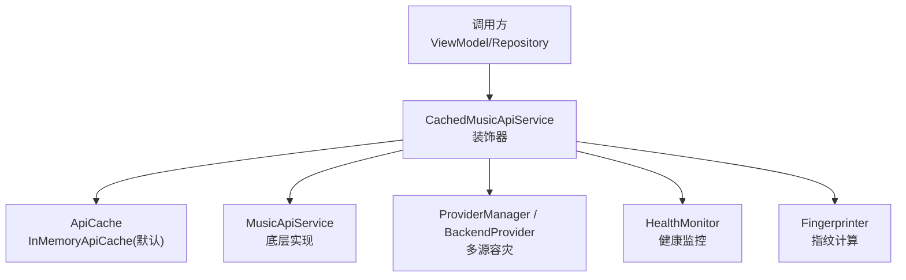
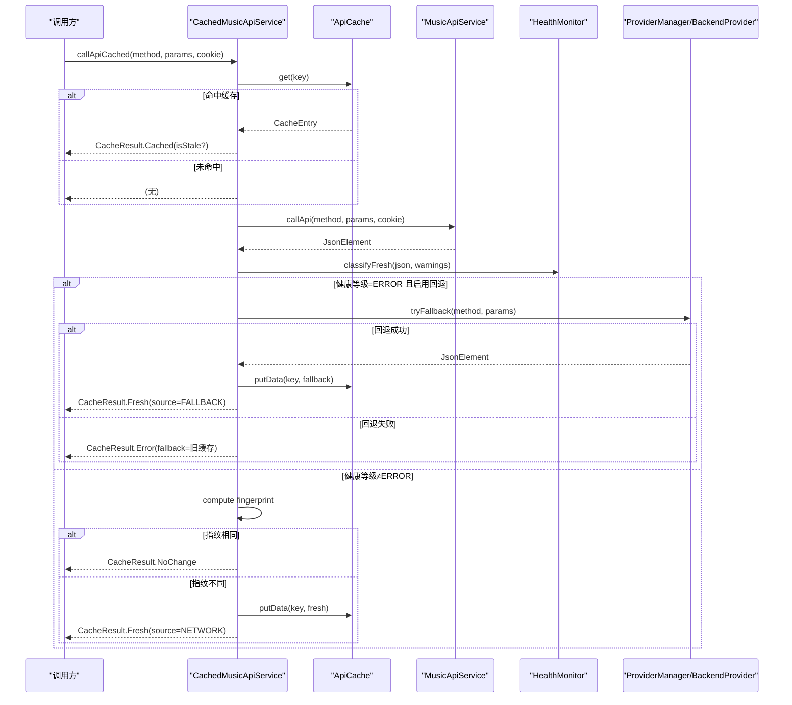
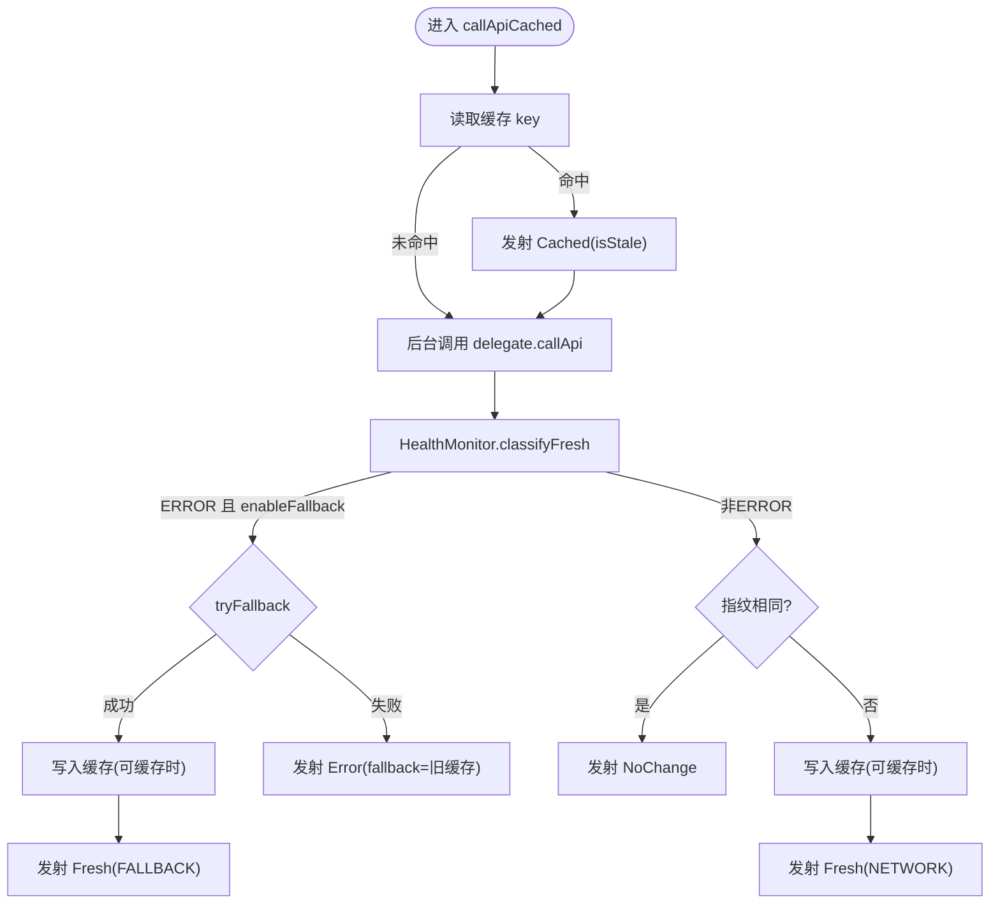
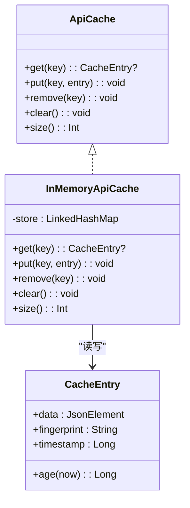
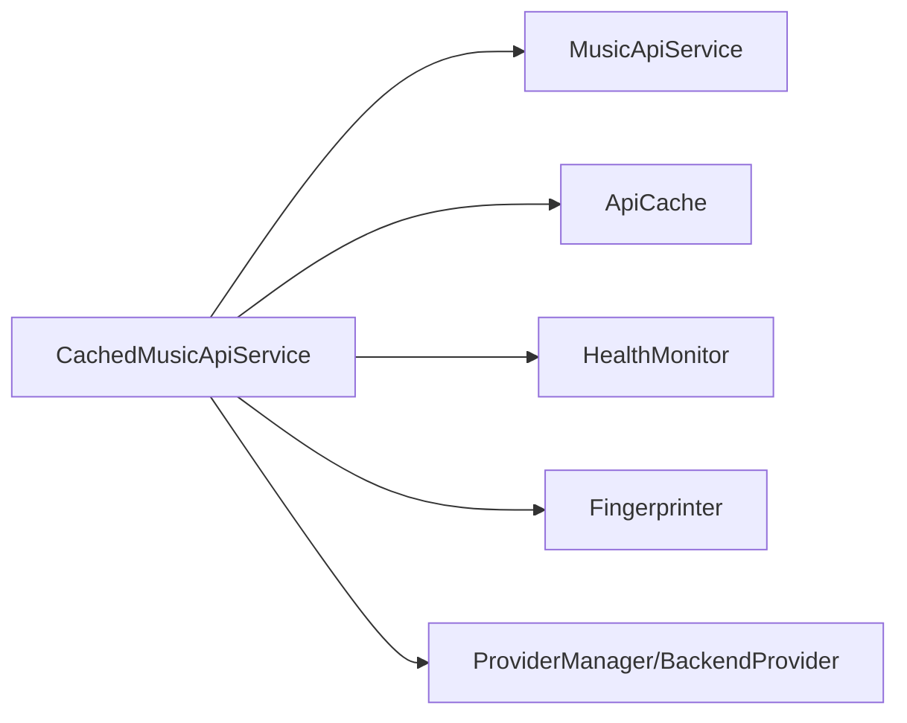

# 缓存系统

<cite>
**本文引用的文件**
- [CachedMusicApiService.kt](file://kmp-pro/src/commonMain/kotlin/cp/player/kmp/cache/CachedMusicApiService.kt)
- [ApiCache.kt](file://kmp-pro/src/commonMain/kotlin/cp/player/kmp/cache/ApiCache.kt)
- [Fingerprinter.kt](file://kmp-pro/src/commonMain/kotlin/cp/player/kmp/cache/Fingerprinter.kt)
- [CacheConfig.kt](file://kmp-pro/src/commonMain/kotlin/cp/player/kmp/cache/CacheConfig.kt)
- [CacheEntry.kt](file://kmp-pro/src/commonMain/kotlin/cp/player/kmp/cache/CacheEntry.kt)
- [CacheResult.kt](file://kmp-pro/src/commonMain/kotlin/cp/player/kmp/cache/CacheResult.kt)
- [HealthMonitor.kt](file://kmp-pro/src/commonMain/kotlin/cp/player/kmp/monitor/HealthMonitor.kt)
- [MusicApiService.kt](file://kmp-pro/src/commonMain/kotlin/cp/player/kmp/api/MusicApiService.kt)
</cite>

## 目录
1. [简介](#简介)
2. [项目结构](#项目结构)
3. [核心组件](#核心组件)
4. [架构总览](#架构总览)
5. [详细组件分析](#详细组件分析)
6. [依赖关系分析](#依赖关系分析)
7. [性能与并发](#性能与并发)
8. [故障排查指南](#故障排查指南)
9. [结论](#结论)
10. [附录：配置示例与调优建议](#附录：配置示例与调优建议)

## 简介
本技术文档聚焦 CPPlayer-KMP 的缓存子系统，围绕 CachedMusicApiService 的装饰器模式实现，系统性阐述缓存策略、过期机制、内存管理、指纹比对、健康监控与健康降级、并发安全与数据一致性等关键技术点。同时提供缓存命中率优化、失效与清理、监控与最佳实践，以及可操作的配置示例与性能调优建议。

## 项目结构
缓存子系统位于 kmp-pro 模块的 commonMain 中，核心文件包括：
- 装饰器与服务封装：CachedMusicApiService.kt
- 缓存抽象与内存实现：ApiCache.kt（含 InMemoryApiCache）
- 指纹生成：Fingerprinter.kt
- 配置与数据模型：CacheConfig.kt、CacheEntry.kt、CacheResult.kt
- 健康监控：HealthMonitor.kt
- 统一 API 接口：MusicApiService.kt

图表来源
- [CachedMusicApiService.kt:46-88](file://kmp-pro/src/commonMain/kotlin/cp/player/kmp/cache/CachedMusicApiService.kt#L46-L88)
- [ApiCache.kt:11-49](file://kmp-pro/src/commonMain/kotlin/cp/player/kmp/cache/ApiCache.kt#L11-L49)
- [MusicApiService.kt:24-40](file://kmp-pro/src/commonMain/kotlin/cp/player/kmp/api/MusicApiService.kt#L24-L40)
- [HealthMonitor.kt:25-138](file://kmp-pro/src/commonMain/kotlin/cp/player/kmp/monitor/HealthMonitor.kt#L25-L138)
- [Fingerprinter.kt:24-62](file://kmp-pro/src/commonMain/kotlin/cp/player/kmp/cache/Fingerprinter.kt#L24-L62)

章节来源
- [CachedMusicApiService.kt:18-52](file://kmp-pro/src/commonMain/kotlin/cp/player/kmp/cache/CachedMusicApiService.kt#L18-L52)
- [ApiCache.kt:1-67](file://kmp-pro/src/commonMain/kotlin/cp/player/kmp/cache/ApiCache.kt#L1-L67)
- [Fingerprinter.kt:1-93](file://kmp-pro/src/commonMain/kotlin/cp/player/kmp/cache/Fingerprinter.kt#L1-L93)
- [CacheConfig.kt:1-16](file://kmp-pro/src/commonMain/kotlin/cp/player/kmp/cache/CacheConfig.kt#L1-L16)
- [CacheEntry.kt:1-22](file://kmp-pro/src/commonMain/kotlin/cp/player/kmp/cache/CacheEntry.kt#L1-L22)
- [CacheResult.kt:1-44](file://kmp-pro/src/commonMain/kotlin/cp/player/kmp/cache/CacheResult.kt#L1-L44)
- [HealthMonitor.kt:1-290](file://kmp-pro/src/commonMain/kotlin/cp/player/kmp/monitor/HealthMonitor.kt#L1-L290)
- [MusicApiService.kt:1-528](file://kmp-pro/src/commonMain/kotlin/cp/player/kmp/api/MusicApiService.kt#L1-L528)

## 核心组件
- CachedMusicApiService：以装饰器模式包装 MusicApiService，提供“先返回缓存、后台拉取并比对指纹”的双阶段 Flow 结果流；集成健康监控与多 Provider 容灾回退。
- ApiCache：缓存抽象与默认进程内 LRU 实现；提供 get/put/remove/clear/size 能力，并提供便捷 putData 自动计算指纹与时间戳。
- CacheEntry：缓存条目，包含完整 JSON、轻量指纹与存入时间，支持 age(now) 计算。
- CacheResult：统一的结果契约，区分 Cached/Fresh/Error/NoChange，并携带来源、健康等级与警告信息。
- Fingerprinter：对响应体进行轻量指纹提取，用于快速判断两次响应内容是否变化。
- CacheConfig：控制 freshTtlMs、maxEntries、enableFallback、enableCache 等关键开关与阈值。
- HealthMonitor：记录 API 调用健康状态（OK/WARNING/ERROR），提供统计、最近记录查询与综合健康等级。

章节来源
- [CachedMusicApiService.kt:46-219](file://kmp-pro/src/commonMain/kotlin/cp/player/kmp/cache/CachedMusicApiService.kt#L46-L219)
- [ApiCache.kt:11-67](file://kmp-pro/src/commonMain/kotlin/cp/player/kmp/cache/ApiCache.kt#L11-L67)
- [CacheEntry.kt:16-22](file://kmp-pro/src/commonMain/kotlin/cp/player/kmp/cache/CacheEntry.kt#L16-L22)
- [CacheResult.kt:14-44](file://kmp-pro/src/commonMain/kotlin/cp/player/kmp/cache/CacheResult.kt#L14-L44)
- [Fingerprinter.kt:24-93](file://kmp-pro/src/commonMain/kotlin/cp/player/kmp/cache/Fingerprinter.kt#L24-L93)
- [CacheConfig.kt:11-16](file://kmp-pro/src/commonMain/kotlin/cp/player/kmp/cache/CacheConfig.kt#L11-L16)
- [HealthMonitor.kt:25-290](file://kmp-pro/src/commonMain/kotlin/cp/player/kmp/monitor/HealthMonitor.kt#L25-L290)

## 架构总览
CachedMusicApiService 作为装饰器，将缓存逻辑与网络请求解耦：
- 首次发射：若命中缓存则立即返回 Cached，并标记 isStale 基于 freshTtlMs。
- 后台拉取：调用底层 MusicApiService 获取 Fresh 数据，计算指纹并与缓存比对。
- 健康监控：根据 HealthMonitor 的分类决定是否需要多 Provider 容灾回退。
- 写回缓存：仅在方法可缓存且非 ERROR 时写入新数据。
- 结果流：依次可能发出 Cached → NoChange/Fresh/Error，供 UI 或上层消费。

图表来源
- [CachedMusicApiService.kt:60-140](file://kmp-pro/src/commonMain/kotlin/cp/player/kmp/cache/CachedMusicApiService.kt#L60-L140)
- [ApiCache.kt:64-67](file://kmp-pro/src/commonMain/kotlin/cp/player/kmp/cache/ApiCache.kt#L64-L67)
- [HealthMonitor.kt:194-203](file://kmp-pro/src/commonMain/kotlin/cp/player/kmp/monitor/HealthMonitor.kt#L194-L203)

## 详细组件分析

### CachedMusicApiService：装饰器与双阶段 Flow
- 职责：在 MusicApiService 之上叠加缓存、健康监控与多 Provider 容灾。
- 关键流程：
  - 首值：从 ApiCache.get 读取并立即发射 Cached，isStale 由 freshTtlMs 判定。
  - 后台：调用 delegate.callApi 获取最新数据，结合 HealthMonitor 分类决定是否触发回退。
  - 指纹比对：使用 Fingerprinter.compute 比较新旧响应，避免不必要的数据替换。
  - 写回策略：仅当方法可缓存且健康等级非 ERROR 时写入缓存。
  - 错误处理：捕获异常并返回 Error，附带 fallback（若有）。
- 可缓存方法白名单：通过 isCacheable 限定幂等读类接口，写/动作类直通网络。

图表来源
- [CachedMusicApiService.kt:60-140](file://kmp-pro/src/commonMain/kotlin/cp/player/kmp/cache/CachedMusicApiService.kt#L60-L140)
- [CachedMusicApiService.kt:205-219](file://kmp-pro/src/commonMain/kotlin/cp/player/kmp/cache/CachedMusicApiService.kt#L205-L219)

章节来源
- [CachedMusicApiService.kt:46-219](file://kmp-pro/src/commonMain/kotlin/cp/player/kmp/cache/CachedMusicApiService.kt#L46-L219)

### ApiCache：存储结构与内存管理
- 抽象接口：get/put/remove/clear/size，便于平台提供持久化实现。
- 默认实现 InMemoryApiCache：
  - 基于 LinkedHashMap 的 LRU 淘汰策略，超过 maxEntries 移除最久未用项。
  - 线程安全：所有操作加同步锁，保证并发访问安全。
  - 适合“先返回缓存，再后台比对”的临时存储场景。
- 便捷方法：putData 自动计算指纹并打时间戳，简化写入流程。
- 键生成：cacheKey 使用 providerId#method#sortedParams#cookieHash，确保唯一性与稳定性。

图表来源
- [ApiCache.kt:11-49](file://kmp-pro/src/commonMain/kotlin/cp/player/kmp/cache/ApiCache.kt#L11-L49)
- [CacheEntry.kt:16-22](file://kmp-pro/src/commonMain/kotlin/cp/player/kmp/cache/CacheEntry.kt#L16-L22)

章节来源
- [ApiCache.kt:11-67](file://kmp-pro/src/commonMain/kotlin/cp/player/kmp/cache/ApiCache.kt#L11-L67)

### Fingerprinter：键生成与指纹算法
- 目标：以极小开销生成稳定签名，比较两次响应的“内容身份”，避免逐字段比对大对象。
- 组成：
  - code：原始字符串（缺失记为占位符）。
  - 顶层数组长度集合：按字典序拼接，反映数据结构规模。
  - 主数据数组 id 列表：探测常见主键（如 songs、playlist、data 等），提取每个对象的 id，去重排序后拼接。
  - 版本位：version/updateTime 等版本字段。
- 优势：对同一份“内容”稳定；增删/重排条目会改变指纹；无关字段变更不影响指纹。

章节来源
- [Fingerprinter.kt:24-93](file://kmp-pro/src/commonMain/kotlin/cp/player/kmp/cache/Fingerprinter.kt#L24-L93)

### CacheConfig：配置选项
- freshTtlMs：缓存“新鲜”阈值，超过视为 stale，但仍优先返回。
- maxEntries：内存缓存最大条目数，影响 LRU 淘汰策略。
- enableFallback：是否在 ERROR 时启用多 Provider 容灾回退。
- enableCache：总开关，关闭时所有请求直通底层服务。

章节来源
- [CacheConfig.kt:11-16](file://kmp-pro/src/commonMain/kotlin/cp/player/kmp/cache/CacheConfig.kt#L11-L16)

### CacheResult：结果契约
- Cached：来自缓存，携带 ageMs、isStale、source、level、warnings。
- Fresh：来自网络的最新数据，携带 source、level、warnings。
- Error：请求失败，可能附带 fallback 降级数据。
- NoChange：后台比对发现与缓存一致，无需替换（可选信号）。

章节来源
- [CacheResult.kt:14-44](file://kmp-pro/src/commonMain/kotlin/cp/player/kmp/cache/CacheResult.kt#L14-L44)

### HealthMonitor：健康监控与降级
- 三级分类：OK、WARNING、ERROR，覆盖所有 API 调用。
- 记录与查询：环形缓冲区记录最近 N 条调用，提供统计、最近记录查询、综合健康等级。
- 与缓存集成：
  - classifyFresh 根据响应码与警告确定健康等级。
  - ERROR 时触发多 Provider 容灾回退，成功则标记 FALLBACK。
  - WARNING 时仍发射数据但携带 warnings。

章节来源
- [HealthMonitor.kt:25-290](file://kmp-pro/src/commonMain/kotlin/cp/player/kmp/monitor/HealthMonitor.kt#L25-L290)
- [CachedMusicApiService.kt:90-140](file://kmp-pro/src/commonMain/kotlin/cp/player/kmp/cache/CachedMusicApiService.kt#L90-L140)

## 依赖关系分析
- CachedMusicApiService 依赖：
  - MusicApiService：底层网络调用。
  - ApiCache：缓存读写。
  - ProviderManager/BackendProvider：多 Provider 容灾。
  - HealthMonitor：健康监控与降级决策。
  - Fingerprinter：指纹计算。
- 耦合与内聚：
  - 装饰器模式使缓存逻辑与业务逻辑解耦，易于扩展与测试。
  - 通过 CacheConfig 集中管理策略，降低分散配置带来的不一致性。

图表来源
- [CachedMusicApiService.kt:46-52](file://kmp-pro/src/commonMain/kotlin/cp/player/kmp/cache/CachedMusicApiService.kt#L46-L52)
- [MusicApiService.kt:24-40](file://kmp-pro/src/commonMain/kotlin/cp/player/kmp/api/MusicApiService.kt#L24-L40)

章节来源
- [CachedMusicApiService.kt:46-219](file://kmp-pro/src/commonMain/kotlin/cp/player/kmp/cache/CachedMusicApiService.kt#L46-L219)
- [MusicApiService.kt:24-40](file://kmp-pro/src/commonMain/kotlin/cp/player/kmp/api/MusicApiService.kt#L24-L40)

## 性能与并发
- 并发安全：
  - InMemoryApiCache 使用同步锁保护 get/put/remove/clear/size，避免并发竞争。
  - HealthMonitor 使用 MutableStateFlow.update 避免每次记录都完整复制列表，提升高吞吐下的性能。
- 性能特征：
  - 指纹计算轻量，避免全量比对，减少 CPU 与内存压力。
  - LRU 淘汰控制内存占用，防止无限增长。
  - 双阶段 Flow 设计：首值即时返回缓存，后台异步拉取，提升用户体验。
- 优化建议：
  - 合理设置 freshTtlMs 与 maxEntries，平衡命中率与内存占用。
  - 针对高频接口，考虑平台级持久化缓存实现，提高跨重启可用性。
  - 监控 HealthMonitor 的 p95 响应时间与错误率，动态调整策略。

章节来源
- [ApiCache.kt:26-49](file://kmp-pro/src/commonMain/kotlin/cp/player/kmp/cache/ApiCache.kt#L26-L49)
- [HealthMonitor.kt:122-138](file://kmp-pro/src/commonMain/kotlin/cp/player/kmp/monitor/HealthMonitor.kt#L122-L138)
- [Fingerprinter.kt:24-62](file://kmp-pro/src/commonMain/kotlin/cp/player/kmp/cache/Fingerprinter.kt#L24-L62)

## 故障排查指南
- 常见问题：
  - 缓存未命中：检查 cacheKey 生成是否正确（providerId/method/params/cookie）。
  - 指纹未更新：确认 Fingerprinter 的主数据数组识别是否匹配实际响应结构。
  - 健康监控误判：查看 HealthMonitor 的警告类型与 classify 逻辑。
  - 回退失败：检查 ProviderManager 的 apiMap 映射与后端可用性。
- 诊断步骤：
  - 使用 HealthMonitor.getRecentRecords 获取最近警告与错误。
  - 检查 CacheResult 的 level 与 warnings，定位问题来源。
  - 验证 isCacheable 白名单是否包含目标方法。
- 恢复策略：
  - 临时禁用缓存（enableCache=false）观察问题是否消失。
  - 调整 freshTtlMs 或 maxEntries 缓解性能问题。
  - 启用 enableFallback 提升容错能力。

章节来源
- [HealthMonitor.kt:159-178](file://kmp-pro/src/commonMain/kotlin/cp/player/kmp/monitor/HealthMonitor.kt#L159-L178)
- [CachedMusicApiService.kt:149-180](file://kmp-pro/src/commonMain/kotlin/cp/player/kmp/cache/CachedMusicApiService.kt#L149-L180)
- [ApiCache.kt:51-62](file://kmp-pro/src/commonMain/kotlin/cp/player/kmp/cache/ApiCache.kt#L51-L62)

## 结论
CPPlayer-KMP 的缓存系统通过装饰器模式将缓存、健康监控与多 Provider 容灾有机整合，实现了高性能、高可用的 API 响应管理。其核心优势在于：
- 双阶段 Flow 设计：即时返回缓存，后台异步刷新。
- 轻量指纹比对：避免全量比对，提升效率。
- 健康监控驱动降级：智能选择最优数据源。
- 灵活的配置与可扩展的缓存实现：适配不同平台需求。

## 附录：配置示例与调优建议
- 配置示例：
  - 基础配置：freshTtlMs=5*60*1000，maxEntries=64，enableFallback=true，enableCache=true。
  - 高频接口：适当增大 maxEntries，缩短 freshTtlMs 以提升命中率。
  - 低延迟场景：减小 freshTtlMs，更频繁地刷新数据。
- 调优建议：
  - 监控缓存命中率与 p95 响应时间，动态调整参数。
  - 针对大响应体，考虑压缩或分页策略。
  - 结合 HealthMonitor 的统计信息，识别瓶颈接口并优化。
- 最佳实践：
  - 定期清理无效缓存（clear 或 remove），避免内存泄漏。
  - 使用 PlatformContext 或 SettingsStorage 持久化配置，确保一致性。
  - 在 UI 层展示健康状态与警告，提升用户感知。

章节来源
- [CacheConfig.kt:11-16](file://kmp-pro/src/commonMain/kotlin/cp/player/kmp/cache/CacheConfig.kt#L11-L16)
- [HealthMonitor.kt:235-290](file://kmp-pro/src/commonMain/kotlin/cp/player/kmp/monitor/HealthMonitor.kt#L235-L290)