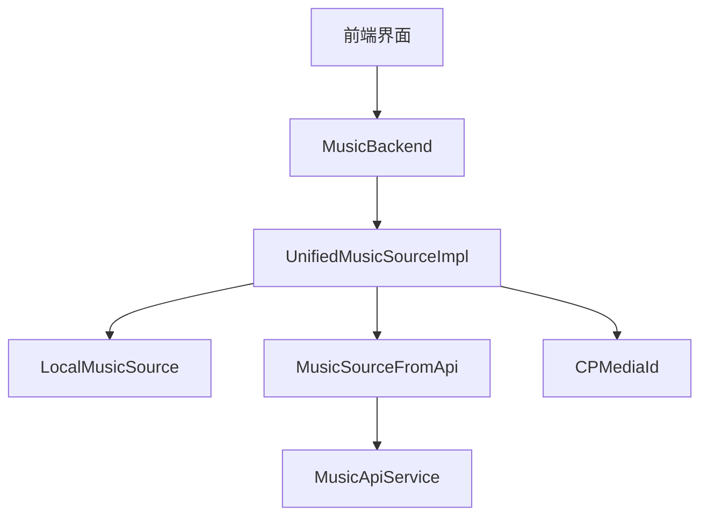
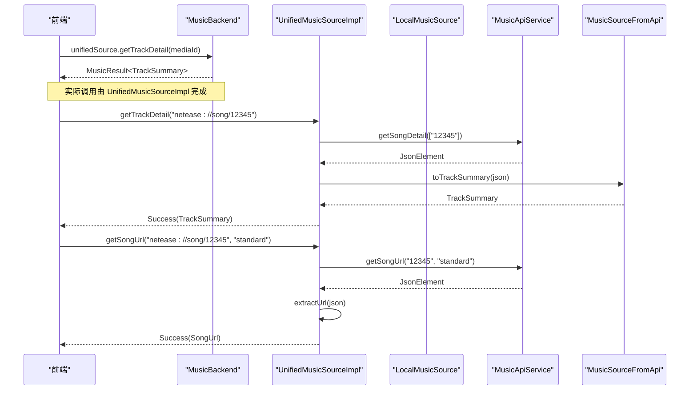
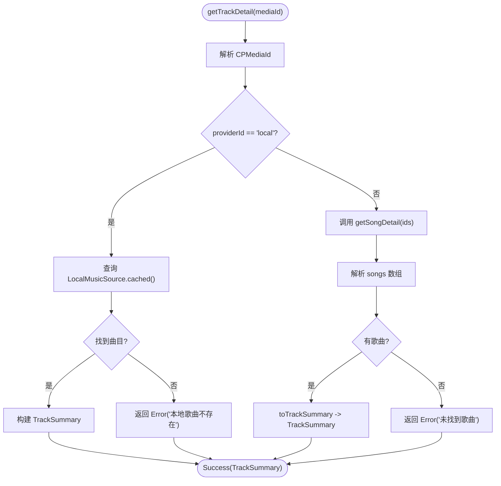
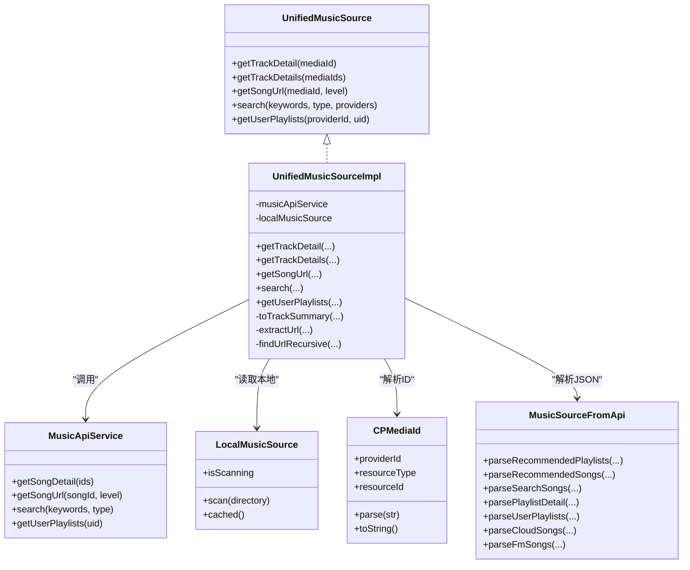

# 音乐源抽象层

<cite>
**本文引用的文件**
- [UnifiedMusicSource.kt](file://kmp-pro/src/commonMain/kotlin/cp/player/kmp/music/UnifiedMusicSource.kt)
- [UnifiedMusicSourceImpl.kt](file://kmp-pro/src/commonMain/kotlin/cp/player/kmp/music/UnifiedMusicSourceImpl.kt)
- [MusicSource.kt](file://kmp-pro/src/commonMain/kotlin/cp/player/kmp/music/MusicSource.kt)
- [MusicSourceFromApi.kt](file://kmp-pro/src/commonMain/kotlin/cp/player/kmp/music/MusicSourceFromApi.kt)
- [CPMediaId.kt](file://kmp-pro/src/commonMain/kotlin/cp/player/kmp/music/CPMediaId.kt)
- [LocalMusicSource.kt](file://kmp-pro/src/commonMain/kotlin/cp/player/kmp/local/LocalMusicSource.kt)
- [MusicApiService.kt](file://kmp-pro/src/commonMain/kotlin/cp/player/kmp/api/MusicApiService.kt)
- [MusicBackend.kt](file://kmp-pro/src/commonMain/kotlin/cp/player/kmp/MusicBackend.kt)
- [BackendState.kt](file://kmp-pro/src/commonMain/kotlin/cp/player/kmp/BackendState.kt)
</cite>

## 目录
1. [简介](#简介)
2. [项目结构](#项目结构)
3. [核心组件](#核心组件)
4. [架构总览](#架构总览)
5. [详细组件分析](#详细组件分析)
6. [依赖关系分析](#依赖关系分析)
7. [性能考量](#性能考量)
8. [故障排查指南](#故障排查指南)
9. [结论](#结论)
10. [附录：自定义音乐源实现指南](#附录自定义音乐源实现指南)

## 简介
本技术文档聚焦 CPPlayer-KMP 的音乐源抽象层，围绕 UnifiedMusicSource 接口的设计理念与 UnifiedMusicSourceImpl 的具体实现展开。内容涵盖统一数据获取抽象、多源数据聚合、错误回退机制、数据模型转换、元数据处理、媒体 URL 解析、缓存集成与并发处理等关键技术点，并提供扩展新音乐源的实践指南。

## 项目结构
该抽象层位于 kmp-pro 模块的 music 包中，核心由以下文件组成：
- 统一入口与实现：UnifiedMusicSource 接口与 UnifiedMusicSourceImpl 实现
- 领域模型与旧版兼容：MusicSource 接口及领域模型（PlaylistSummary、TrackSummary、SongUrl、SearchResult、ArtistSummary）
- API 适配与解析桥：MusicSourceFromApi（JSON→领域模型）
- 媒体标识规范：CPMediaId（provider://type/id）
- 本地音乐源：LocalMusicSource（扫描与缓存）
- 云 API 服务：MusicApiService（统一网络调用入口）
- 后端编排：MusicBackend（统一入口、Provider 管理、缓存注入、播放控制装配）
- 状态与结果：BackendState、BackendResult（类型化结果封装）

图表来源
- [MusicBackend.kt:121-129](file://kmp-pro/src/commonMain/kotlin/cp/player/kmp/MusicBackend.kt#L121-L129)
- [UnifiedMusicSourceImpl.kt:15-18](file://kmp-pro/src/commonMain/kotlin/cp/player/kmp/music/UnifiedMusicSourceImpl.kt#L15-L18)
- [MusicSourceFromApi.kt:27-26](file://kmp-pro/src/commonMain/kotlin/cp/player/kmp/music/MusicSourceFromApi.kt#L27-L26)
- [MusicApiService.kt:5-23](file://kmp-pro/src/commonMain/kotlin/cp/player/kmp/api/MusicApiService.kt#L5-L23)
- [CPMediaId.kt:3-10](file://kmp-pro/src/commonMain/kotlin/cp/player/kmp/music/CPMediaId.kt#L3-L10)

章节来源
- [MusicBackend.kt:30-72](file://kmp-pro/src/commonMain/kotlin/cp/player/kmp/MusicBackend.kt#L30-L72)
- [UnifiedMusicSource.kt:3-38](file://kmp-pro/src/commonMain/kotlin/cp/player/kmp/music/UnifiedMusicSource.kt#L3-L38)

## 核心组件
- UnifiedMusicSource：面向前端的统一音乐源接口，屏蔽 provider 差异，所有资源定位使用 CPMediaId（如 "netease://song/12345" 或 "local://song/path/to/file"）。提供歌曲详情、批量详情、播放地址、搜索、用户歌单等方法。
- UnifiedMusicSourceImpl：具体实现，负责：
  - 根据 providerId 路由到本地或云端
  - 本地缓存命中与缺失处理
  - 云端批量请求分片与错误容错
  - JSON→领域模型的转换与健壮解析
  - 媒体 URL 提取与校验
- MusicSourceFromApi：将 MusicApiService 返回的 JsonElement 转换为强类型领域模型，并统一错误码判定与不支持功能提示。
- LocalMusicSource：平台无关的本地音乐扫描与缓存接口。
- MusicApiService：统一的云侧 API 调用入口，内部自动注入 cookie、线程调度与错误格式。
- CPMediaId：统一媒体 ID 规范，支持 provider://resourceType/resourceId 格式解析与序列化。
- MusicBackend：后端统一入口，装配 UnifiedMusicSourceImpl、缓存、Provider 管理与播放控制器。

章节来源
- [UnifiedMusicSource.kt:7-38](file://kmp-pro/src/commonMain/kotlin/cp/player/kmp/music/UnifiedMusicSource.kt#L7-L38)
- [UnifiedMusicSourceImpl.kt:15-176](file://kmp-pro/src/commonMain/kotlin/cp/player/kmp/music/UnifiedMusicSourceImpl.kt#L15-L176)
- [MusicSourceFromApi.kt:27-221](file://kmp-pro/src/commonMain/kotlin/cp/player/kmp/music/MusicSourceFromApi.kt#L27-L221)
- [LocalMusicSource.kt:15-48](file://kmp-pro/src/commonMain/kotlin/cp/player/kmp/local/LocalMusicSource.kt#L15-L48)
- [MusicApiService.kt:24-188](file://kmp-pro/src/commonMain/kotlin/cp/player/kmp/api/MusicApiService.kt#L24-L188)
- [CPMediaId.kt:11-32](file://kmp-pro/src/commonMain/kotlin/cp/player/kmp/music/CPMediaId.kt#L11-L32)
- [MusicBackend.kt:121-129](file://kmp-pro/src/commonMain/kotlin/cp/player/kmp/MusicBackend.kt#L121-L129)

## 架构总览
统一数据流从前端进入 MusicBackend.unifiedSource，再路由到 UnifiedMusicSourceImpl。对于本地资源，直接查询 LocalMusicSource.cached()；对于云端资源，通过 MusicApiService 调用对应 API，并使用 MusicSourceFromApi 进行 JSON→领域模型转换。URL 获取时，UnifiedMusicSourceImpl 会递归提取有效 URL，并附带 size、cookie 等元信息。

图表来源
- [UnifiedMusicSourceImpl.kt:20-52](file://kmp-pro/src/commonMain/kotlin/cp/player/kmp/music/UnifiedMusicSourceImpl.kt#L20-L52)
- [UnifiedMusicSourceImpl.kt:100-118](file://kmp-pro/src/commonMain/kotlin/cp/player/kmp/music/UnifiedMusicSourceImpl.kt#L100-L118)
- [MusicSourceFromApi.kt:175-189](file://kmp-pro/src/commonMain/kotlin/cp/player/kmp/music/MusicSourceFromApi.kt#L175-L189)
- [MusicApiService.kt:166-188](file://kmp-pro/src/commonMain/kotlin/cp/player/kmp/api/MusicApiService.kt#L166-L188)

## 详细组件分析

### UnifiedMusicSource 接口设计
- 统一数据获取抽象：所有入参采用 CPMediaId 字符串，屏蔽 provider 差异。
- 多源数据聚合：search 方法支持跨多个 provider 搜索并聚合结果（当前委托给 MusicSourceFromApi.search）。
- 错误回退机制：对本地缺失、云端异常、URL 无效等情况返回明确的 BackendResult.Error，便于上层统一处理。
- 扩展点：新增方法可保持统一语义，例如后续增加评论、MV、电台等。

章节来源
- [UnifiedMusicSource.kt:7-38](file://kmp-pro/src/commonMain/kotlin/cp/player/kmp/music/UnifiedMusicSource.kt#L7-L38)

### UnifiedMusicSourceImpl 实现要点
- 数据源选择策略：
  - 解析 mediaId 为 CPMediaId，若 providerId == "local"，则走本地路径；否则走云端。
  - 本地路径通过 LocalMusicSource.cached() 查找匹配 path 的曲目。
- 缓存集成：
  - 本地缓存命中直接构造 TrackSummary/SongUrl。
  - 云端批量详情按 chunked(500) 分批请求，避免 URI 过长导致失败。
- 并发处理：
  - 各方法均为 suspend 函数，适合在协程中并行调用；当前实现未显式并发聚合，但可通过上层并发调用提升吞吐。
- 数据模型转换：
  - JsonObject.toTrackSummary 兼容多种字段名（ar/artists、al/album、dt/duration），提高跨 Provider 兼容性。
- 媒体 URL 解析：
  - extractUrl 优先取 redirectUrl，其次递归查找 url/picUrl/coverImgUrl/avatarUrl 等键，确保返回 http 开头的有效链接。
- 错误处理：
  - 本地缺失返回 Error；云端异常捕获并包装为 Error；URL 无效返回 Error。

图表来源
- [UnifiedMusicSourceImpl.kt:20-52](file://kmp-pro/src/commonMain/kotlin/cp/player/kmp/music/UnifiedMusicSourceImpl.kt#L20-L52)
- [UnifiedMusicSourceImpl.kt:130-144](file://kmp-pro/src/commonMain/kotlin/cp/player/kmp/music/UnifiedMusicSourceImpl.kt#L130-L144)

章节来源
- [UnifiedMusicSourceImpl.kt:20-176](file://kmp-pro/src/commonMain/kotlin/cp/player/kmp/music/UnifiedMusicSourceImpl.kt#L20-L176)

### MusicSourceFromApi 解析桥
- code 判定：兼容 code/status 字段，成功码包括 200/0/201/301。
- 统一封装 toMusicResult：
  - 非 JsonObject → Error
  - code 不在成功集合且属于不支持码集 → Unsupported
  - 其他失败 → Error（携带 msg/message）
  - 解析异常 → Error（携带 cause）
- 覆盖场景：推荐歌单、日推、搜索、歌单详情、用户歌单、云盘歌曲、私人 FM。
- 单元解析：toPlaylistSummary、toTrackSummary、toArtistSummary 均做字段兼容与空值保护。

章节来源
- [MusicSourceFromApi.kt:27-221](file://kmp-pro/src/commonMain/kotlin/cp/player/kmp/music/MusicSourceFromApi.kt#L27-L221)

### 数据模型与元数据处理
- 领域模型：PlaylistSummary、TrackSummary、SongUrl、SearchResult、ArtistSummary（定义于 MusicSource.kt）。
- 元数据处理：
  - TrackSummary 包含 id/name/artist/album/coverUrl/durationMs。
  - SongUrl 包含 url/level/sizeBytes/expireAt/cookie，便于播放器设置头与进度预估。
- 媒体 URL 解析：
  - UnifiedMusicSourceImpl.extractUrl/findUrlRecursive 递归查找有效 URL，过滤 null 与短串，保证稳定性。

章节来源
- [MusicSource.kt:75-132](file://kmp-pro/src/commonMain/kotlin/cp/player/kmp/music/MusicSource.kt#L75-L132)
- [UnifiedMusicSourceImpl.kt:146-174](file://kmp-pro/src/commonMain/kotlin/cp/player/kmp/music/UnifiedMusicSourceImpl.kt#L146-L174)

### 媒体标识 CPMediaId
- 格式：{providerId}://{resourceType}/{resourceId}
- 示例：local://song//storage/emulated/0/Music/song.mp3；netease://song/12345
- 解析与序列化：parse 严格校验格式，toString 输出标准形式。

章节来源
- [CPMediaId.kt:3-32](file://kmp-pro/src/commonMain/kotlin/cp/player/kmp/music/CPMediaId.kt#L3-L32)

### 本地音乐源 LocalMusicSource
- 能力：scan(directory?) 扫描指定目录；cached() 返回上次扫描结果；isScanning 指示扫描状态。
- 设计意图：与云侧统一抽象，前端无需区分数据来源。
- 占位实现：NoopLocalMusicSource 返回空列表，便于无本地库环境运行。

章节来源
- [LocalMusicSource.kt:15-48](file://kmp-pro/src/commonMain/kotlin/cp/player/kmp/local/LocalMusicSource.kt#L15-L48)
- [MusicBackend.kt:393-397](file://kmp-pro/src/commonMain/kotlin/cp/player/kmp/MusicBackend.kt#L393-L397)

### 后端编排 MusicBackend
- 统一入口：unifiedSource 暴露 UnifiedMusicSourceImpl，装配 cachedMusicApi 与 localMusic。
- Provider 管理：importModule/switchProvider/deleteModule 带状态机与错误恢复。
- 播放控制：playbackController 绑定 unifiedSource、api、cookieProvider 与平台播放器。
- 初始化流程：init 创建 ProviderManager、ModuleManager、MusicApiServiceImpl、CachedMusicApiService，并计算终态。

章节来源
- [MusicBackend.kt:30-72](file://kmp-pro/src/commonMain/kotlin/cp/player/kmp/MusicBackend.kt#L30-L72)
- [MusicBackend.kt:121-161](file://kmp-pro/src/commonMain/kotlin/cp/player/kmp/MusicBackend.kt#L121-L161)
- [MusicBackend.kt:180-242](file://kmp-pro/src/commonMain/kotlin/cp/player/kmp/MusicBackend.kt#L180-L242)
- [MusicBackend.kt:330-388](file://kmp-pro/src/commonMain/kotlin/cp/player/kmp/MusicBackend.kt#L330-L388)

## 依赖关系分析
- UnifiedMusicSourceImpl 依赖：
  - MusicApiService：云端数据与 URL 获取
  - LocalMusicSource：本地缓存与扫描
  - CPMediaId：媒体标识解析
  - MusicSourceFromApi：JSON→领域模型转换（部分方法委托）
- MusicBackend 依赖：
  - ProviderManager/ModuleManager：Provider 生命周期管理
  - CachedMusicApiService：API 缓存
  - PlaybackControllerImpl：播放控制装配
- 结果与状态：
  - BackendResult：类型化结果（Success/Error/Unsupported）
  - BackendState：后端状态机（Uninitialized/Initializing/NoProvider/Ready/Error）

图表来源
- [UnifiedMusicSource.kt:7-38](file://kmp-pro/src/commonMain/kotlin/cp/player/kmp/music/UnifiedMusicSource.kt#L7-L38)
- [UnifiedMusicSourceImpl.kt:15-176](file://kmp-pro/src/commonMain/kotlin/cp/player/kmp/music/UnifiedMusicSourceImpl.kt#L15-L176)
- [MusicSourceFromApi.kt:27-221](file://kmp-pro/src/commonMain/kotlin/cp/player/kmp/music/MusicSourceFromApi.kt#L27-L221)
- [LocalMusicSource.kt:15-48](file://kmp-pro/src/commonMain/kotlin/cp/player/kmp/local/LocalMusicSource.kt#L15-L48)
- [MusicApiService.kt:24-188](file://kmp-pro/src/commonMain/kotlin/cp/player/kmp/api/MusicApiService.kt#L24-L188)
- [CPMediaId.kt:11-32](file://kmp-pro/src/commonMain/kotlin/cp/player/kmp/music/CPMediaId.kt#L11-L32)

章节来源
- [MusicBackend.kt:121-161](file://kmp-pro/src/commonMain/kotlin/cp/player/kmp/MusicBackend.kt#L121-L161)
- [BackendState.kt:25-115](file://kmp-pro/src/commonMain/kotlin/cp/player/kmp/BackendState.kt#L25-L115)

## 性能考量
- 批量详情分片：getTrackDetails 使用 chunked(500) 分批请求，避免 URI 过长导致的失败与超时。
- 本地缓存优先：本地资源直接从 cached() 读取，减少网络开销。
- URL 快速提取：extractUrl 优先取 redirectUrl，降低二次跳转成本。
- 并发潜力：suspend 方法可在上层并发调用以提升吞吐，但需注意 Provider 限流与并发限制。
- 缓存集成：MusicBackend 初始化时注入 CachedMusicApiService，对 API 响应进行缓存，减少重复请求。

[本节为通用指导，不直接分析具体文件]

## 故障排查指南
- 本地歌曲不存在：
  - 现象：getTrackDetail 返回 Error("Local song not found")
  - 排查：确认 LocalMusicSource.cached() 是否包含目标 path；检查扫描目录是否正确。
- 云端歌曲未找到：
  - 现象：getTrackDetail 返回 Error("Song not found: ...")
  - 排查：确认 mediaId 的 resourceId 是否正确；检查 MusicApiService.getSongDetail 返回的 songs 是否为空。
- URL 无效：
  - 现象：getSongUrl 返回 Error("No valid URL returned for ...")
  - 排查：检查 extractUrl/findUrlRecursive 是否能找到 http 开头的 URL；确认服务端返回结构。
- 解析异常：
  - 现象：MusicSourceFromApi.toMusicResult 捕获解析异常并返回 Error
  - 排查：核对 JSON 字段名兼容性（ar/artists、al/album、dt/duration 等）；必要时扩展解析逻辑。
- Provider 切换失败：
  - 现象：MusicBackend.switchProviderInternal 抛出 Error 并更新 stateFlow 为 Error
  - 排查：检查 Provider.isReady()；查看 lastLoadError 与 extractProviderError 提取的错误信息。

章节来源
- [UnifiedMusicSourceImpl.kt:20-52](file://kmp-pro/src/commonMain/kotlin/cp/player/kmp/music/UnifiedMusicSourceImpl.kt#L20-L52)
- [UnifiedMusicSourceImpl.kt:100-118](file://kmp-pro/src/commonMain/kotlin/cp/player/kmp/music/UnifiedMusicSourceImpl.kt#L100-L118)
- [MusicSourceFromApi.kt:45-60](file://kmp-pro/src/commonMain/kotlin/cp/player/kmp/music/MusicSourceFromApi.kt#L45-L60)
- [MusicBackend.kt:273-293](file://kmp-pro/src/commonMain/kotlin/cp/player/kmp/MusicBackend.kt#L273-L293)

## 结论
UnifiedMusicSource 抽象层通过 CPMediaId 统一资源定位，结合 UnifiedMusicSourceImpl 的路由、缓存、解析与 URL 提取能力，实现了本地与云端数据的无缝聚合。MusicSourceFromApi 提供了健壮的 JSON→领域模型转换与错误分类。MusicBackend 作为后端统一入口，装配了 Provider 管理、缓存与播放控制，形成完整的音乐数据访问闭环。该设计具备良好的扩展性，便于添加新的音乐源与功能。

[本节为总结，不直接分析具体文件]

## 附录：自定义音乐源实现指南
- 目标：在不修改现有接口的前提下，扩展新的音乐源支持。
- 步骤：
  1. 实现新的 Provider：
     - 在 ProviderManager/ModuleManager 中注册新模块，确保 isReady() 正确。
     - 在 MusicApiService 中新增对应 API 方法（如需）。
  2. 扩展 MusicSourceFromApi：
     - 新增 parseXxx 方法，处理新 API 的 JSON 结构，复用 toMusicResult 进行错误分类。
  3. 更新 UnifiedMusicSourceImpl：
     - 若需新的路由逻辑（如新增 providerId），在 getTrackDetail/getSongUrl 等方法中增加分支。
     - 若需新的 URL 提取规则，扩展 extractUrl/findUrlRecursive。
  4. 测试与验证：
     - 使用 CPMediaId 构造媒体标识，调用 unifiedSource 方法验证数据与 URL。
     - 检查错误路径（本地缺失、云端异常、URL 无效）是否返回正确的 BackendResult。
- 最佳实践：
  - 保持字段兼容（ar/artists、al/album、dt/duration 等）。
  - 对批量请求进行分片，避免 URI 过长。
  - 使用 BackendResult 的 fold 方法进行穷举处理，确保 UI 能区分 Error 与 Unsupported。

[本节为概念性指导，不直接分析具体文件]