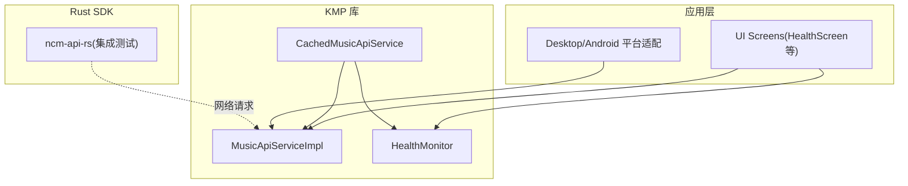
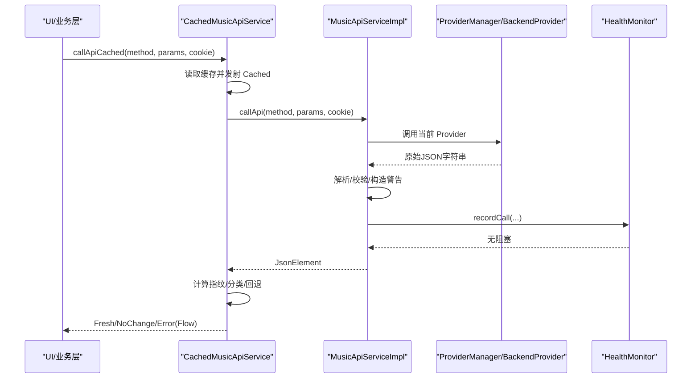
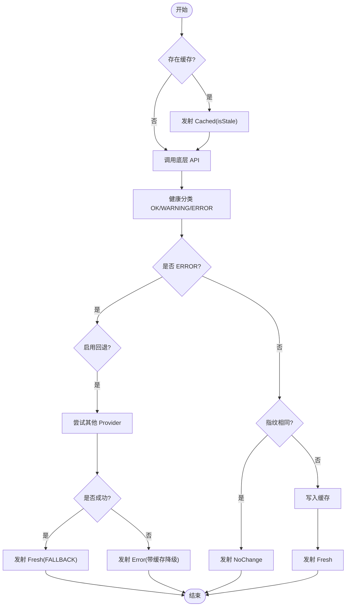
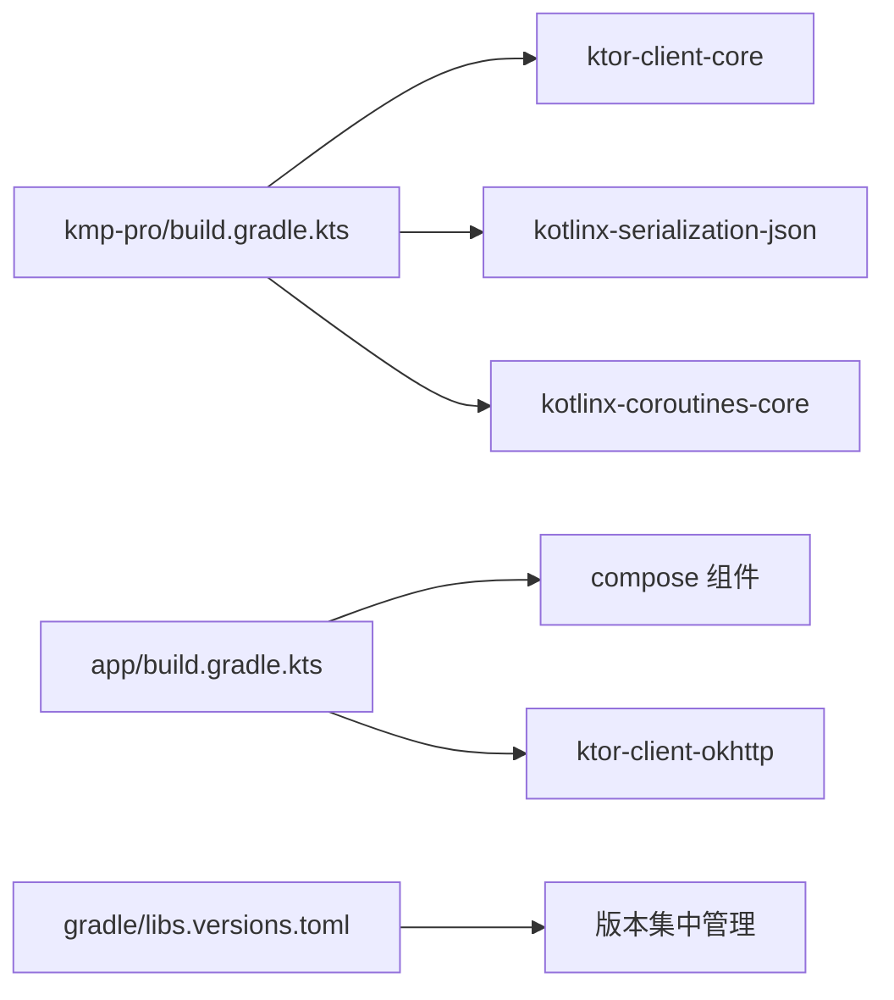

# 测试策略

<cite>
**本文引用的文件**
- [README.md](file://README.md)
- [kmp-pro/build.gradle.kts](file://kmp-pro/build.gradle.kts)
- [app/build.gradle.kts](file://app/build.gradle.kts)
- [gradle/libs.versions.toml](file://gradle/libs.versions.toml)
- [CachedMusicApiService.kt](file://kmp-pro/src/commonMain/kotlin/cp/player/kmp/cache/CachedMusicApiService.kt)
- [MusicApiServiceImpl.kt](file://kmp-pro/src/commonMain/kotlin/cp/player/kmp/api/MusicApiServiceImpl.kt)
- [HealthMonitor.kt](file://kmp-pro/src/commonMain/kotlin/cp/player/kmp/monitor/HealthMonitor.kt)
- [integration.rs](file://API_MODULE_AND_OLD_PROJECT_REPO/3rd-CPPlayer-netcloudMusic-Muti/tests/integration.rs)
- [query.rs](file://API_MODULE_AND_OLD_PROJECT_REPO/3rd-CPPlayer-netcloudMusic-Muti/tests/query.rs)
- [error.rs](file://API_MODULE_AND_OLD_PROJECT_REPO/3rd-CPPlayer-netcloudMusic-Muti/tests/error.rs)
- [Cargo.toml](file://API_MODULE_AND_OLD_PROJECT_REPO/3rd-CPPlayer-netcloudMusic-Muti/Cargo.toml)
- [PlatformActions.desktop.kt](file://app/src/desktopMain/kotlin/cp/player/app/platform/PlatformActions.desktop.kt)
- [HealthScreen.kt](file://app/src/commonMain/kotlin/cp/player/app/ui/screen/HealthScreen.kt)
- [UiFoundation.kt](file://app/src/commonMain/kotlin/cp/player/app/ui/component/UiFoundation.kt)
- [QrCodeGen.kt](file://app/src/commonMain/kotlin/cp/player/app/ui/screen/QrCodeGen.kt)
</cite>

## 目录
1. [引言](#引言)
2. [项目结构](#项目结构)
3. [核心组件](#核心组件)
4. [架构总览](#架构总览)
5. [详细组件分析](#详细组件分析)
6. [依赖分析](#依赖分析)
7. [性能考虑](#性能考虑)
8. [故障排查指南](#故障排查指南)
9. [结论](#结论)
10. [附录](#附录)

## 引言
本测试策略面向 CPPlayer-KMP 项目的跨平台音乐后端与 UI 应用，覆盖单元测试、集成测试与性能测试。重点包括：
- Rust API 模块的测试方法（基于 Cargo 测试框架）
- KMP 代码的跨平台测试策略（commonMain/jvmMain/androidMain/desktopMain）
- UI 组件的测试方案（Compose 桌面端为主）
- Mock 策略、测试数据准备、覆盖率要求与持续集成流程
- 调试技巧与性能分析方法

## 项目结构
本项目由三大部分组成：
- KMP 库模块（kmp-pro）：提供跨平台的 API 服务、缓存与健康监控
- Android/Desktop 应用模块（app）：基于 Compose 的多端 UI
- Rust API 模块（API_MODULE_AND_OLD_PROJECT_REPO/...）：网易云音乐 API 的 Rust SDK，含集成测试

图表来源
- [MusicApiServiceImpl.kt:28-101](file://kmp-pro/src/commonMain/kotlin/cp/player/kmp/api/MusicApiServiceImpl.kt#L28-L101)
- [CachedMusicApiService.kt:46-88](file://kmp-pro/src/commonMain/kotlin/cp/player/kmp/cache/CachedMusicApiService.kt#L46-L88)
- [HealthMonitor.kt:25-138](file://kmp-pro/src/commonMain/kotlin/cp/player/kmp/monitor/HealthMonitor.kt#L25-L138)

章节来源
- [README.md:11-28](file://README.md#L11-L28)
- [kmp-pro/build.gradle.kts:12-27](file://kmp-pro/build.gradle.kts#L12-L27)
- [app/build.gradle.kts:14-63](file://app/build.gradle.kts#L14-L63)

## 核心组件
- MusicApiServiceImpl：统一封装 Provider 调用、Cookie 注入、响应校验与健康记录
- CachedMusicApiService：在 API 之上增加“缓存优先 + 指纹比对 + 多 Provider 容灾”的 Flow 结果流
- HealthMonitor：三级健康分类（OK/WARNING/ERROR）、环形缓冲记录、统计与整体等级流
- UI 健康页：展示最近调用记录与综合状态，便于定位问题

章节来源
- [MusicApiServiceImpl.kt:28-101](file://kmp-pro/src/commonMain/kotlin/cp/player/kmp/api/MusicApiServiceImpl.kt#L28-L101)
- [CachedMusicApiService.kt:46-88](file://kmp-pro/src/commonMain/kotlin/cp/player/kmp/cache/CachedMusicApiService.kt#L46-L88)
- [HealthMonitor.kt:25-138](file://kmp-pro/src/commonMain/kotlin/cp/player/kmp/monitor/HealthMonitor.kt#L25-L138)
- [HealthScreen.kt:112-171](file://app/src/commonMain/kotlin/cp/player/app/ui/screen/HealthScreen.kt#L112-L171)

## 架构总览
下图展示了带缓存的 API 调用流程，以及健康监控与多 Provider 容灾的交互。

图表来源
- [CachedMusicApiService.kt:60-140](file://kmp-pro/src/commonMain/kotlin/cp/player/kmp/cache/CachedMusicApiService.kt#L60-L140)
- [MusicApiServiceImpl.kt:35-101](file://kmp-pro/src/commonMain/kotlin/cp/player/kmp/api/MusicApiServiceImpl.kt#L35-L101)
- [HealthMonitor.kt:119-138](file://kmp-pro/src/commonMain/kotlin/cp/player/kmp/monitor/HealthMonitor.kt#L119-L138)

## 详细组件分析

### Rust API 模块测试策略
- 单元测试
  - Query 参数构建与类型安全辅助：验证 get/get_or/get_i64/get_bool/cookie/default 行为
  - Error 类型映射：从 HTTP code 到 NcmError 的分类与显示
- 集成测试
  - 真实网络请求：banner/search/song_detail/toplist/login_status/countries_code_list 等
  - 注意：CI 环境需支持网络或跳过；建议通过环境变量开关
- 工具链
  - 使用 tokio::test 异步测试
  - dev-dependencies 包含 test-util

章节来源
- [query.rs:1-79](file://API_MODULE_AND_OLD_PROJECT_REPO/3rd-CPPlayer-netcloudMusic-Muti/tests/query.rs#L1-L79)
- [error.rs:1-50](file://API_MODULE_AND_OLD_PROJECT_REPO/3rd-CPPlayer-netcloudMusic-Muti/tests/error.rs#L1-L50)
- [integration.rs:1-92](file://API_MODULE_AND_OLD_PROJECT_REPO/3rd-CPPlayer-netcloudMusic-Muti/tests/integration.rs#L1-L92)
- [Cargo.toml:59-67](file://API_MODULE_AND_OLD_PROJECT_REPO/3rd-CPPlayer-netcloudMusic-Muti/Cargo.toml#L59-L67)

### KMP 跨平台测试策略
- 目标
  - commonMain：纯逻辑（缓存、健康监控、API 组装）可单测
  - jvmMain/desktopMain：HTTP 客户端、平台能力（如 Desktop 浏览器打开 URL）
  - androidMain：Context/SharedPreferences/JNI 相关（受限于设备/模拟器）
- 分层测试
  - 单元层：Mock ProviderManager、ApiCache、SettingsStorage，验证缓存键生成、指纹比对、回退逻辑
  - 集成层：使用内存缓存与 Stub Provider，验证完整 Flow 序列（Cached→Fresh/NoChange/Error）
  - 平台层：桌面端 UI 与平台能力（如 openUrl）断言行为
- 并发与协程
  - 使用 kotlinx.coroutines.test 控制时间、调度器与协程上下文
  - 对 Flow 收集进行超时与顺序断言

章节来源
- [kmp-pro/build.gradle.kts:12-27](file://kmp-pro/build.gradle.kts#L12-L27)
- [app/build.gradle.kts:24-63](file://app/build.gradle.kts#L24-L63)
- [PlatformActions.desktop.kt:13-19](file://app/src/desktopMain/kotlin/cp/player/app/platform/PlatformActions.desktop.kt#L13-L19)

### UI 组件测试方案
- 目标
  - 健康页：展示最近记录、综合状态、原始响应弹窗
  - 通用状态组件：加载/错误/空态切换
  - 二维码渲染：QrCodeImage 绘制
- 方法
  - Compose 测试：使用 compose-ui-test 与 compose-junit 规则
  - 以 StateFlow/SharedFlow 驱动 UI 状态，断言可见文本、图标与交互
  - 桌面端可结合 PlatformActions 的 openUrl 行为进行集成断言

章节来源
- [HealthScreen.kt:112-171](file://app/src/commonMain/kotlin/cp/player/app/ui/screen/HealthScreen.kt#L112-L171)
- [UiFoundation.kt:110-141](file://app/src/commonMain/kotlin/cp/player/app/ui/component/UiFoundation.kt#L110-L141)
- [QrCodeGen.kt:12-23](file://app/src/commonMain/kotlin/cp/player/app/ui/screen/QrCodeGen.kt#L12-L23)
- [PlatformActions.desktop.kt:13-19](file://app/src/desktopMain/kotlin/cp/player/app/platform/PlatformActions.desktop.kt#L13-L19)

### 缓存与健康监控测试要点
- 缓存键与可缓存判定
  - 键：providerId#method#sortedParams#cookieHash
  - 仅幂等读接口缓存，写/动作直通网络
- 指纹比对
  - 基于 code、顶层数组长度、主数据 id 列表前 64 去重排序与版本位
- 健康分类与回退
  - ERROR 触发多 Provider 容灾；WARNING 附带告警；OK 正常
  - 容灾成功标记 FALLBACK，失败则返回 Error 并携带缓存降级

图表来源
- [CachedMusicApiService.kt:60-140](file://kmp-pro/src/commonMain/kotlin/cp/player/kmp/cache/CachedMusicApiService.kt#L60-L140)
- [MusicApiServiceImpl.kt:481-658](file://kmp-pro/src/commonMain/kotlin/cp/player/kmp/api/MusicApiServiceImpl.kt#L481-L658)
- [HealthMonitor.kt:52-56](file://kmp-pro/src/commonMain/kotlin/cp/player/kmp/monitor/HealthMonitor.kt#L52-L56)

章节来源
- [CachedMusicApiService.kt:142-219](file://kmp-pro/src/commonMain/kotlin/cp/player/kmp/cache/CachedMusicApiService.kt#L142-L219)
- [MusicApiServiceImpl.kt:481-658](file://kmp-pro/src/commonMain/kotlin/cp/player/kmp/api/MusicApiServiceImpl.kt#L481-L658)
- [HealthMonitor.kt:147-216](file://kmp-pro/src/commonMain/kotlin/cp/player/kmp/monitor/HealthMonitor.kt#L147-L216)

## 依赖分析
- Gradle 版本与插件
  - Kotlin Multiplatform、Serialization、Compose、Android 插件
- 关键库
  - Ktor 客户端、序列化 JSON、Coroutines、Media3（Android）、JNA/D-Bus（Desktop）
- 测试依赖
  - Rust：tokio test-util
  - KMP：建议使用 kotlinx-coroutines-test、compose-ui-test、junit5（通过 Gradle 管理）

图表来源
- [kmp-pro/build.gradle.kts:29-47](file://kmp-pro/build.gradle.kts#L29-L47)
- [app/build.gradle.kts:24-63](file://app/build.gradle.kts#L24-L63)
- [gradle/libs.versions.toml:23-64](file://gradle/libs.versions.toml#L23-L64)

章节来源
- [gradle/libs.versions.toml:1-22](file://gradle/libs.versions.toml#L1-L22)
- [kmp-pro/build.gradle.kts:12-66](file://kmp-pro/build.gradle.kts#L12-L66)
- [app/build.gradle.kts:1-76](file://app/build.gradle.kts#L1-L76)

## 性能考虑
- 健康监控采用环形缓冲区与 Flow update，避免频繁复制与锁竞争
- 缓存指纹比对轻量，减少不必要的数据回传
- 多 Provider 容灾按序尝试，首次成功即止，降低平均延迟
- 建议在测试中：
  - 使用固定时间源与协程测试调度器，确保确定性
  - 对慢接口设置超时与重试上限
  - 采集 p95/p99 延迟与错误率指标

章节来源
- [HealthMonitor.kt:20-24](file://kmp-pro/src/commonMain/kotlin/cp/player/kmp/monitor/HealthMonitor.kt#L20-L24)
- [HealthMonitor.kt:235-289](file://kmp-pro/src/commonMain/kotlin/cp/player/kmp/monitor/HealthMonitor.kt#L235-L289)

## 故障排查指南
- 常见问题
  - 响应缺少必要字段：检查 EXPECTED_FIELDS 映射与 validateResponse 逻辑
  - Provider 不支持：关注 UNSUPPORTED_BY_PROVIDER 警告与回退路径
  - 网络异常：确认 Cookie 注入与 Provider 选择是否正确
- 调试手段
  - 使用 HealthScreen 查看最近记录与原始响应
  - 在 CI 中输出 HealthMonitor 统计（成功率、平均耗时、回退次数）
  - Rust 集成测试用于快速验证外部 API 可用性

章节来源
- [MusicApiServiceImpl.kt:481-658](file://kmp-pro/src/commonMain/kotlin/cp/player/kmp/api/MusicApiServiceImpl.kt#L481-L658)
- [HealthScreen.kt:112-171](file://app/src/commonMain/kotlin/cp/player/app/ui/screen/HealthScreen.kt#L112-L171)
- [integration.rs:1-92](file://API_MODULE_AND_OLD_PROJECT_REPO/3rd-CPPlayer-netcloudMusic-Muti/tests/integration.rs#L1-L92)

## 结论
本策略围绕 KMP 的 API 层、缓存与健康监控，以及 Rust SDK 的集成测试，构建了从单元到集成的完整测试闭环。通过 Mock 策略、跨平台适配与 UI 测试，确保功能正确性与稳定性。配合性能分析与 CI 流程，可有效保障质量与交付效率。

## 附录

### 测试环境与数据准备
- 环境
  - 本地：启用网络访问；禁用或替换真实网络为 Stub
  - CI：根据环境变量决定是否运行集成测试
- 数据
  - 使用固定 ID（如歌曲/歌单）作为稳定用例输入
  - 预置不同 Cookie 场景（未登录、已登录、过期）

章节来源
- [integration.rs:1-92](file://API_MODULE_AND_OLD_PROJECT_REPO/3rd-CPPlayer-netcloudMusic-Muti/tests/integration.rs#L1-L92)

### Mock 策略
- 对象
  - ProviderManager：返回预设 Provider 列表与当前 Provider
  - ApiCache：内存实现，支持清空与查询
  - SettingsStorage：返回固定配置（freshTtlMs、maxEntries、enableFallback）
- 行为
  - 模拟不同响应（OK/WARNING/ERROR）与不同指纹，覆盖缓存分支
  - 模拟网络异常与 Provider 不支持，验证回退路径

章节来源
- [CachedMusicApiService.kt:142-219](file://kmp-pro/src/commonMain/kotlin/cp/player/kmp/cache/CachedMusicApiService.kt#L142-L219)
- [MusicApiServiceImpl.kt:437-479](file://kmp-pro/src/commonMain/kotlin/cp/player/kmp/api/MusicApiServiceImpl.kt#L437-L479)

### 测试覆盖率要求
- 单元层：核心逻辑（缓存键、指纹、分类、回退）≥ 90%
- 集成层：关键接口（登录、搜索、详情、URL）≥ 80%
- UI 层：关键状态（加载/错误/空态）与交互 ≥ 80%
- 报告：使用 JaCoCo（KMP）与 Rust 原生覆盖率工具（cargo-tarpaulin 或 llvm-cov）

[本节为通用指导，不直接分析具体文件]

### 持续集成流程
- 阶段
  - 编译：KMP 多目标编译（android/desktop）
  - 单测：KMP 单元 + Rust 单元
  - 集成：可选（网络可用时执行）
  - 打包：AAR/JAR 产物
- 命令参考
  - KMP：./gradlew :kmp-pro:compileKotlinDesktop、:kmp-pro:assembleDebug
  - Rust：cargo test、cargo test --features server（如需）

章节来源
- [README.md:30-41](file://README.md#L30-L41)
- [Cargo.toml:54-67](file://API_MODULE_AND_OLD_PROJECT_REPO/3rd-CPPlayer-netcloudMusic-Muti/Cargo.toml#L54-L67)

### 调试技巧
- 日志
  - 利用 HealthMonitor 的 rawResponse 与 errorMessage 快速定位
- 断点
  - 在 classifyLevel、tryFallback、emitNetworkResult 处断点
- 快照
  - 导出 HealthMonitor 统计（getAllStats/getStatsByMethod）

章节来源
- [HealthMonitor.kt:147-216](file://kmp-pro/src/commonMain/kotlin/cp/player/kmp/monitor/HealthMonitor.kt#L147-L216)
- [HealthScreen.kt:112-171](file://app/src/commonMain/kotlin/cp/player/app/ui/screen/HealthScreen.kt#L112-L171)

### 性能分析方法
- 指标
  - 平均/分位延迟、错误率、回退次数、健康分数
- 工具
  - KMP：自定义计时与 Stats 聚合
  - Rust：tokio 运行时指标与 tracing（可选）
- 实践
  - 在测试中注入固定耗时，观察 Flow 时序与背压处理

章节来源
- [HealthMonitor.kt:235-289](file://kmp-pro/src/commonMain/kotlin/cp/player/kmp/monitor/HealthMonitor.kt#L235-L289)