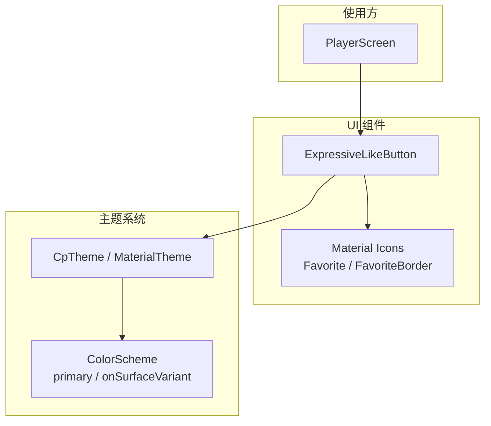
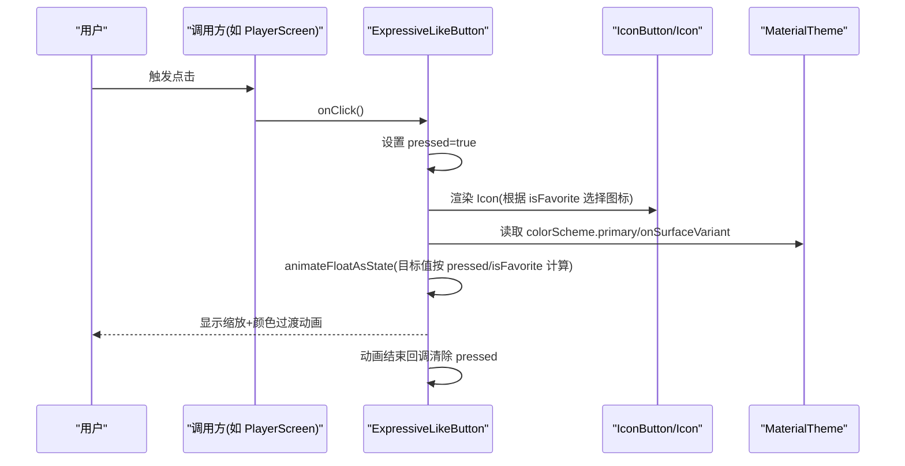
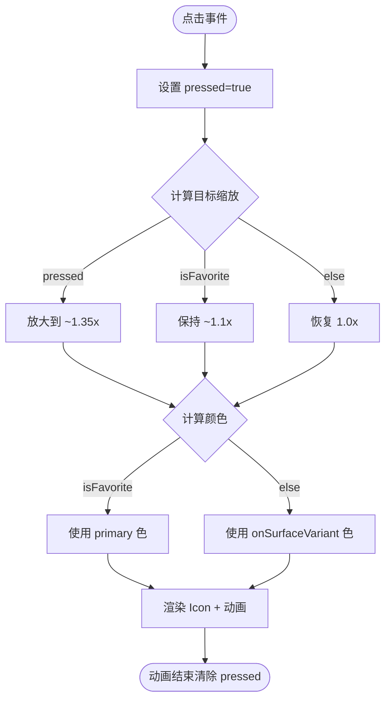
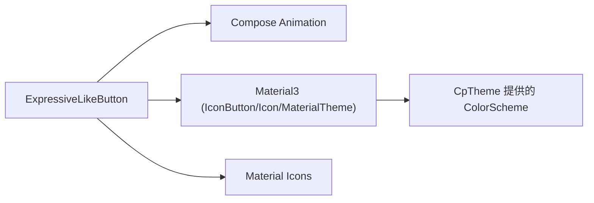

# ExpressiveLikeButton 表达性点赞按钮

<cite>
**本文引用的文件**
- [ExpressiveLikeButton.kt](file://app/src/commonMain/kotlin/cp/player/app/ui/component/ExpressiveLikeButton.kt)
- [PlayerScreen.kt](file://app/src/commonMain/kotlin/cp/player/app/ui/screen/PlayerScreen.kt)
- [Theme.kt](file://app/src/commonMain/kotlin/cp/player/app/ui/theme/Theme.kt)
- [Color.kt](file://app/src/commonMain/kotlin/cp/player/app/ui/theme/Color.kt)
</cite>

## 目录
1. [简介](#简介)
2. [项目结构](#项目结构)
3. [核心组件](#核心组件)
4. [架构总览](#架构总览)
5. [详细组件分析](#详细组件分析)
6. [依赖关系分析](#依赖关系分析)
7. [性能与内存优化](#性能与内存优化)
8. [故障排查指南](#故障排查指南)
9. [结论](#结论)
10. [附录：使用示例与最佳实践](#附录使用示例与最佳实践)

## 简介
ExpressiveLikeButton 是一个基于 Material Design 3（M3）的“表达性”点赞/收藏按钮。它提供点击时的缩放回弹动画、颜色渐变切换以及图标在“已收藏/未收藏”之间的切换，用于增强用户交互反馈。该组件通过 Compose 状态驱动 UI，适合嵌入到播放器、列表项等需要轻量级点赞反馈的场景。

## 项目结构
本组件位于应用通用模块的 UI 组件层，被播放器页面多处复用。主题与配色由应用主题统一管理，确保在不同主题下表现一致。

图表来源
- [ExpressiveLikeButton.kt:1-64](file://app/src/commonMain/kotlin/cp/player/app/ui/component/ExpressiveLikeButton.kt#L1-L64)
- [PlayerScreen.kt:471-474](file://app/src/commonMain/kotlin/cp/player/app/ui/screen/PlayerScreen.kt#L471-L474)
- [PlayerScreen.kt:571-574](file://app/src/commonMain/kotlin/cp/player/app/ui/screen/PlayerScreen.kt#L571-L574)
- [PlayerScreen.kt:636-639](file://app/src/commonMain/kotlin/cp/player/app/ui/screen/PlayerScreen.kt#L636-L639)
- [Theme.kt:31-65](file://app/src/commonMain/kotlin/cp/player/app/ui/theme/Theme.kt#L31-L65)
- [Color.kt:69-97](file://app/src/commonMain/kotlin/cp/player/app/ui/theme/Color.kt#L69-L97)

章节来源
- [ExpressiveLikeButton.kt:1-64](file://app/src/commonMain/kotlin/cp/player/app/ui/component/ExpressiveLikeButton.kt#L1-L64)
- [PlayerScreen.kt:471-474](file://app/src/commonMain/kotlin/cp/player/app/ui/screen/PlayerScreen.kt#L471-L474)
- [PlayerScreen.kt:571-574](file://app/src/commonMain/kotlin/cp/player/app/ui/screen/PlayerScreen.kt#L571-L574)
- [PlayerScreen.kt:636-639](file://app/src/commonMain/kotlin/cp/player/app/ui/screen/PlayerScreen.kt#L636-L639)
- [Theme.kt:31-65](file://app/src/commonMain/kotlin/cp/player/app/ui/theme/Theme.kt#L31-L65)
- [Color.kt:69-97](file://app/src/commonMain/kotlin/cp/player/app/ui/theme/Color.kt#L69-L97)

## 核心组件
- 组件名称：ExpressiveLikeButton
- 功能：提供带弹簧缩放动画与颜色过渡的点赞/收藏按钮，支持图标在“实心收藏/空心收藏”之间切换。
- 关键特性：
  - 点击时放大并回弹（高弹性阻尼弹簧）
  - 根据是否已收藏切换颜色（主色 vs 表面变体色）
  - 自动切换图标（Filled.Favorite / Filled.FavoriteBorder）
  - 无障碍描述随状态变化

章节来源
- [ExpressiveLikeButton.kt:21-63](file://app/src/commonMain/kotlin/cp/player/app/ui/component/ExpressiveLikeButton.kt#L21-L63)

## 架构总览
ExpressiveLikeButton 作为纯展示型 Composable，不持有业务状态，仅接收外部传入的状态与回调。其内部维护一个短暂的 pressed 状态以驱动点击瞬间的缩放动画；颜色与图标则由外部 isFavorite 决定。

图表来源
- [ExpressiveLikeButton.kt:30-48](file://app/src/commonMain/kotlin/cp/player/app/ui/component/ExpressiveLikeButton.kt#L30-L48)
- [ExpressiveLikeButton.kt:49-62](file://app/src/commonMain/kotlin/cp/player/app/ui/component/ExpressiveLikeButton.kt#L49-L62)
- [Theme.kt:57-64](file://app/src/commonMain/kotlin/cp/player/app/ui/theme/Theme.kt#L57-L64)

## 详细组件分析

### 属性与行为
- isFavorite: Boolean
  - 含义：当前是否为“已收藏/已点赞”状态
  - 影响：图标选择、默认缩放比例、颜色
- onClick: () -> Unit
  - 含义：点击回调，由调用方负责更新 isFavorite 等业务逻辑
- modifier: Modifier = Modifier
  - 含义：修饰符，可设置尺寸、布局、样式等
  - 注意：组件内部未暴露 size 参数，可通过 modifier 控制大小（例如 .size(...)）

章节来源
- [ExpressiveLikeButton.kt:25-29](file://app/src/commonMain/kotlin/cp/player/app/ui/component/ExpressiveLikeButton.kt#L25-L29)
- [PlayerScreen.kt:471-474](file://app/src/commonMain/kotlin/cp/player/app/ui/screen/PlayerScreen.kt#L471-L474)
- [PlayerScreen.kt:571-574](file://app/src/commonMain/kotlin/cp/player/app/ui/screen/PlayerScreen.kt#L571-L574)
- [PlayerScreen.kt:636-639](file://app/src/commonMain/kotlin/cp/player/app/ui/screen/PlayerScreen.kt#L636-L639)

### 动画效果
- 缩放动画（scale）
  - 按下时放大至约 1.35x，松开后回到 1.0x
  - 已收藏状态下默认保持约 1.1x 的轻微放大
  - 使用高弹性阻尼弹簧，带来“回弹”触感
- 颜色过渡（tint）
  - 已收藏：使用主题主色（primary）
  - 未收藏：使用主题表面变体色（onSurfaceVariant）
- 图标切换
  - 已收藏：实心收藏图标
  - 未收藏：空心收藏边框图标

图表来源
- [ExpressiveLikeButton.kt:30-48](file://app/src/commonMain/kotlin/cp/player/app/ui/component/ExpressiveLikeButton.kt#L30-L48)
- [ExpressiveLikeButton.kt:49-62](file://app/src/commonMain/kotlin/cp/player/app/ui/component/ExpressiveLikeButton.kt#L49-L62)

章节来源
- [ExpressiveLikeButton.kt:30-62](file://app/src/commonMain/kotlin/cp/player/app/ui/component/ExpressiveLikeButton.kt#L30-L62)

### 状态管理
- 内部短暂状态：pressed（记录点击瞬间，用于触发缩放动画）
- 外部受控状态：isFavorite（由调用方管理，如播放器状态）
- 状态流转：
  - 点击 → pressed=true → 触发缩放动画 → 动画结束 → pressed=false
  - isFavorite 变化 → 颜色与图标切换，同时影响默认缩放

章节来源
- [ExpressiveLikeButton.kt:30-48](file://app/src/commonMain/kotlin/cp/player/app/ui/component/ExpressiveLikeButton.kt#L30-L48)
- [PlayerScreen.kt:471-474](file://app/src/commonMain/kotlin/cp/player/app/ui/screen/PlayerScreen.kt#L471-L474)

### 无障碍访问与键盘导航
- 内容描述：根据 isFavorite 动态设置“收藏/取消收藏”，便于读屏器识别
- 可聚焦性：基于 IconButton，天然支持键盘操作（Enter/Space）与焦点管理
- 建议：在复杂场景中为外层容器提供合适的语义标签或辅助文本

章节来源
- [ExpressiveLikeButton.kt:49-62](file://app/src/commonMain/kotlin/cp/player/app/ui/component/ExpressiveLikeButton.kt#L49-L62)

### 与其他 UI 框架的集成
- 本组件基于 Jetpack Compose 与 Material3，适用于 Android/iOS/Desktop 多端 Compose 工程
- 若需与现有 View 体系集成，可在宿主 Activity/Fragment 中通过 ComposeView 承载包含该组件的 Composable
- 主题方面：遵循 CpTheme/MaterialTheme 的颜色体系，确保跨平台一致性

[本节为概念性说明，不直接分析具体文件]

## 依赖关系分析
- 运行时依赖
  - Compose Animation：animateFloatAsState、animateColorAsState、spring
  - Material3：IconButton、Icon、MaterialTheme
  - Material Icons：Filled.Favorite / Filled.FavoriteBorder
- 主题依赖
  - 颜色来自 MaterialTheme.colorScheme.primary 与 onSurfaceVariant
  - 主题由 CpTheme 统一注入

图表来源
- [ExpressiveLikeButton.kt:3-19](file://app/src/commonMain/kotlin/cp/player/app/ui/component/ExpressiveLikeButton.kt#L3-L19)
- [Theme.kt:57-64](file://app/src/commonMain/kotlin/cp/player/app/ui/theme/Theme.kt#L57-L64)

章节来源
- [ExpressiveLikeButton.kt:3-19](file://app/src/commonMain/kotlin/cp/player/app/ui/component/ExpressiveLikeButton.kt#L3-L19)
- [Theme.kt:57-64](file://app/src/commonMain/kotlin/cp/player/app/ui/theme/Theme.kt#L57-L64)

## 性能与内存优化
- 动画性能
  - 使用 spring 动画，具备物理回弹效果且开销可控
  - 仅在 pressed 与 isFavorite 变化时触发动画，避免频繁重绘
- 状态最小化
  - 内部仅维护 pressed 短暂状态，减少不必要的重组
  - 外部 isFavorite 由调用方集中管理，保证单一数据源
- 内存使用
  - 无持久化状态，生命周期内资源占用极低
  - 图标与颜色均来自主题与系统资源，重复利用

[本节为通用指导，不直接分析具体文件]

## 故障排查指南
- 问题：点击无动画或动画不明显
  - 检查是否设置了过小的尺寸导致视觉不明显
  - 确认未覆盖 modifier 导致 scale 无效
- 问题：颜色不符合预期
  - 确认处于正确的主题环境（浅色/深色），颜色取自 colorScheme
  - 如需自定义颜色，可在上层通过主题覆盖 primary 与 onSurfaceVariant
- 问题：状态不同步
  - 确保 onClick 中正确更新 isFavorite，使组件能响应最新状态
- 问题：无障碍提示不正确
  - 检查 isFavorite 是否正确传递，以保证 contentDescription 准确

章节来源
- [ExpressiveLikeButton.kt:44-62](file://app/src/commonMain/kotlin/cp/player/app/ui/component/ExpressiveLikeButton.kt#L44-L62)
- [Theme.kt:57-64](file://app/src/commonMain/kotlin/cp/player/app/ui/theme/Theme.kt#L57-L64)

## 结论
ExpressiveLikeButton 以简洁的 API 提供了富有表现力的点赞反馈，结合 Compose 动画与 Material3 主题，能够在多种场景下快速落地。通过外部状态管理与内部短暂状态分离，既保证了可维护性，又实现了良好的性能与用户体验。

[本节为总结性内容，不直接分析具体文件]

## 附录：使用示例与最佳实践

### 基本用法
- 绑定数据状态：将 isFavorite 与业务状态绑定（如播放器的收藏状态）
- 处理用户交互：onClick 中执行收藏/取消收藏的业务逻辑，并更新 isFavorite
- 自定义尺寸：通过 modifier 设置按钮大小（例如 .size(...)）

章节来源
- [PlayerScreen.kt:471-474](file://app/src/commonMain/kotlin/cp/player/app/ui/screen/PlayerScreen.kt#L471-L474)
- [PlayerScreen.kt:571-574](file://app/src/commonMain/kotlin/cp/player/app/ui/screen/PlayerScreen.kt#L571-L574)
- [PlayerScreen.kt:636-639](file://app/src/commonMain/kotlin/cp/player/app/ui/screen/PlayerScreen.kt#L636-L639)

### 主题与样式
- 颜色来源于 MaterialTheme.colorScheme，支持浅色/深色与动态取色
- 如需全局调整点赞颜色，可在 CpTheme 中配置 primary 与 onSurfaceVariant

章节来源
- [Theme.kt:31-65](file://app/src/commonMain/kotlin/cp/player/app/ui/theme/Theme.kt#L31-L65)
- [Color.kt:69-97](file://app/src/commonMain/kotlin/cp/player/app/ui/theme/Color.kt#L69-L97)

### 无障碍与键盘
- 组件自带 contentDescription，读屏器可播报“收藏/取消收藏”
- 支持键盘 Enter/Space 触发点击，符合无障碍规范

章节来源
- [ExpressiveLikeButton.kt:49-62](file://app/src/commonMain/kotlin/cp/player/app/ui/component/ExpressiveLikeButton.kt#L49-L62)