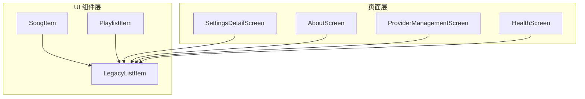
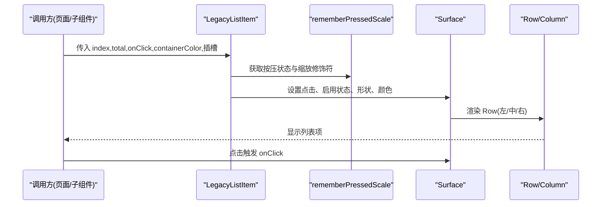
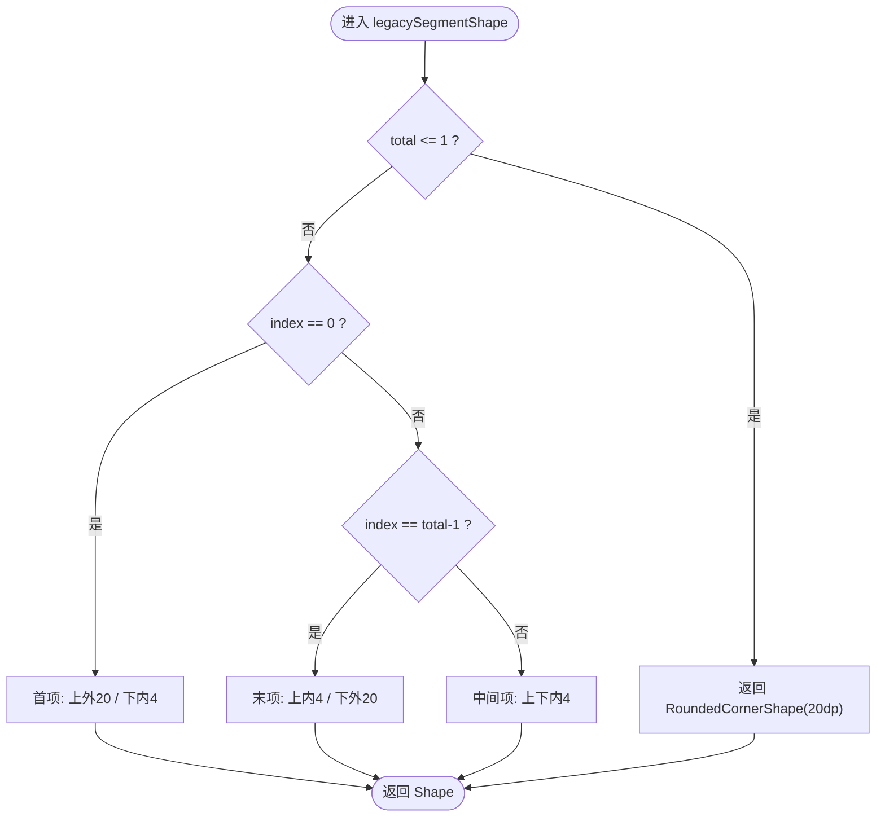
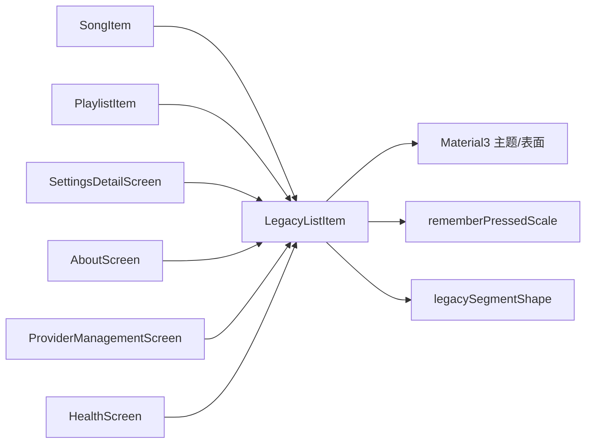

# LegacyListItem 遗留列表项组件

<cite>
**本文引用的文件**
- [LegacyListItem.kt](file://app/src/commonMain/kotlin/cp/player/app/ui/component/LegacyListItem.kt)
- [SongItem.kt](file://app/src/commonMain/kotlin/cp/player/app/ui/component/SongItem.kt)
- [PlaylistCard.kt](file://app/src/commonMain/kotlin/cp/player/app/ui/component/PlaylistCard.kt)
- [UiFoundation.kt](file://app/src/commonMain/kotlin/cp/player/app/ui/component/UiFoundation.kt)
- [SettingsDetailScreen.kt](file://app/src/commonMain/kotlin/cp/player/app/ui/screen/SettingsDetailScreen.kt)
- [AboutScreen.kt](file://app/src/commonMain/kotlin/cp/player/app/ui/screen/AboutScreen.kt)
- [ProviderManagementScreen.kt](file://app/src/commonMain/kotlin/cp/player/app/ui/screen/ProviderManagementScreen.kt)
- [HealthScreen.kt](file://app/src/commonMain/kotlin/cp/player/app/ui/screen/HealthScreen.kt)
</cite>

## 目录
1. [简介](#简介)
2. [项目结构](#项目结构)
3. [核心组件](#核心组件)
4. [架构总览](#架构总览)
5. [详细组件分析](#详细组件分析)
6. [依赖关系分析](#依赖关系分析)
7. [性能考量](#性能考量)
8. [故障排查指南](#故障排查指南)
9. [结论](#结论)
10. [附录：使用示例与最佳实践](#附录使用示例与最佳实践)

## 简介
LegacyListItem 是一个通用的列表项基础组件，提供标准的 Material Design 3 风格的列表项布局。它通过组合前置内容、主标题、副标题和尾部内容等插槽，实现高度可复用的行级展示单元。组件支持点击交互、容器颜色定制，以及基于序号与总数的圆角分段形状计算，适用于歌曲列表、歌单列表、设置项、健康检查记录等多种场景。

## 项目结构
LegacyListItem 位于通用 UI 组件层，被多个业务页面与子组件复用。其关键位置如下：
- 组件定义：app/src/commonMain/kotlin/cp/player/app/ui/component/LegacyListItem.kt
- 典型使用者：
  - 歌曲列表项：app/src/commonMain/kotlin/cp/player/app/ui/component/SongItem.kt
  - 歌单列表项：app/src/commonMain/kotlin/cp/player/app/ui/component/PlaylistCard.kt
  - 设置详情项：app/src/commonMain/kotlin/cp/player/app/ui/screen/SettingsDetailScreen.kt
  - 关于页条目：app/src/commonMain/kotlin/cp/player/app/ui/screen/AboutScreen.kt
  - 提供者管理行：app/src/commonMain/kotlin/cp/player/app/ui/screen/ProviderManagementScreen.kt
  - 健康检查记录行：app/src/commonMain/kotlin/cp/player/app/ui/screen/HealthScreen.kt

图表来源
- [LegacyListItem.kt:21-54](file://app/src/commonMain/kotlin/cp/player/app/ui/component/LegacyListItem.kt#L21-L54)
- [SongItem.kt:50-129](file://app/src/commonMain/kotlin/cp/player/app/ui/component/SongItem.kt#L50-L129)
- [PlaylistCard.kt:54-125](file://app/src/commonMain/kotlin/cp/player/app/ui/component/PlaylistCard.kt#L54-L125)
- [SettingsDetailScreen.kt:72-176](file://app/src/commonMain/kotlin/cp/player/app/ui/screen/SettingsDetailScreen.kt#L72-L176)
- [AboutScreen.kt:197-205](file://app/src/commonMain/kotlin/cp/player/app/ui/screen/AboutScreen.kt#L197-L205)
- [ProviderManagementScreen.kt:169-186](file://app/src/commonMain/kotlin/cp/player/app/ui/screen/ProviderManagementScreen.kt#L169-L186)
- [HealthScreen.kt:138-160](file://app/src/commonMain/kotlin/cp/player/app/ui/screen/HealthScreen.kt#L138-L160)

章节来源
- [LegacyListItem.kt:21-54](file://app/src/commonMain/kotlin/cp/player/app/ui/component/LegacyListItem.kt#L21-L54)

## 核心组件
LegacyListItem 的核心职责是：
- 提供统一的列表项容器与点击行为
- 根据 index 与 total 计算分段圆角形状，形成连贯的分组外观
- 组织内容区域：leadingContent（左侧）、headlineContent（主标题）、supportingContent（副标题）、trailingContent（右侧）
- 支持自定义容器颜色与修饰符扩展

关键属性说明：
- index：当前项在分组中的索引（从 0 开始），用于计算圆角
- total：分组内总项数，用于判断首尾项
- onClick：点击回调；为 null 时禁用点击态与缩放动画
- modifier：标准 Compose 修饰符，用于尺寸、对齐、布局扩展
- containerColor：容器背景色，默认使用主题色 surfaceContainerHigh
- leadingContent：可选的前置内容（图标、封面、序号等）
- headlineContent：必填的主标题内容
- supportingContent：可选的副标题内容（如作者、专辑、状态等）
- trailingContent：可选的尾部内容（操作按钮、开关、箭头等）

章节来源
- [LegacyListItem.kt:21-54](file://app/src/commonMain/kotlin/cp/player/app/ui/component/LegacyListItem.kt#L21-L54)

## 架构总览
LegacyListItem 采用“容器 + 内容插槽”的组合模式，内部以 Row 横向排列内容，中间 Column 承载主副标题并自适应宽度，左右两侧分别放置前置与尾部内容。点击交互通过 Surface 封装，配合 rememberPressedScale 提供按压缩放动效。

图表来源
- [LegacyListItem.kt:32-53](file://app/src/commonMain/kotlin/cp/player/app/ui/component/LegacyListItem.kt#L32-L53)
- [UiFoundation.kt:153-167](file://app/src/commonMain/kotlin/cp/player/app/ui/component/UiFoundation.kt#L153-L167)

## 详细组件分析

### 布局算法与自适应高度
- 水平布局：Row 使用固定间距 Arrangement.spacedBy(16.dp)，保证各区域之间视觉呼吸感
- 垂直对齐：Row 垂直居中对齐，确保多行文本与图标等高对齐
- 内容分配：
  - leadingContent：固定宽度或按需宽度，不挤压主内容
  - 中间 Column：weight=1f，自动填充剩余空间，容纳 headlineContent 与 supportingContent
  - trailingContent：固定宽度或按需宽度，常用于操作控件
- 自适应高度：由内容自然撑开，无固定高度约束；当 supportingContent 为空时，行高更紧凑
- 内边距：水平 16dp、垂直 12dp，符合 M3 列表项常见留白规范

章节来源
- [LegacyListItem.kt:41-52](file://app/src/commonMain/kotlin/cp/player/app/ui/component/LegacyListItem.kt#L41-L52)

### 分段圆角形状计算
legacySegmentShape(index, total) 根据 index 与 total 决定圆角：
- 当 total <= 1：整体圆角 20dp
- 否则：
  - 首项：上外圆角 20dp，下内圆角 4dp
  - 末项：上内圆角 4dp，下外圆角 20dp
  - 中间项：上下均为内圆角 4dp

该算法使相邻列表项拼接成“分段卡片”效果，提升分组阅读体验。

图表来源
- [LegacyListItem.kt:56-65](file://app/src/commonMain/kotlin/cp/player/app/ui/component/LegacyListItem.kt#L56-L65)

章节来源
- [LegacyListItem.kt:56-65](file://app/src/commonMain/kotlin/cp/player/app/ui/component/LegacyListItem.kt#L56-L65)

### 点击与按压动效
- 点击：Surface.onClick 绑定 onClick；当 onClick 为 null 时，enabled=false，禁用交互
- 按压缩放：rememberPressedScale 收集按下状态并以弹簧动画缩放到 0.98，增强触感反馈
- 条件应用：仅当 onClick != null 时附加缩放修饰符，避免无效动画开销

章节来源
- [LegacyListItem.kt:32-39](file://app/src/commonMain/kotlin/cp/player/app/ui/component/LegacyListItem.kt#L32-L39)
- [UiFoundation.kt:153-167](file://app/src/commonMain/kotlin/cp/player/app/ui/component/UiFoundation.kt#L153-L167)

### 内容对齐与排版
- 主标题 headlineContent：通常使用 titleMedium 风格，控制最大行数与溢出省略
- 副标题 supportingContent：通常使用 bodyMedium 风格，颜色 onSurfaceVariant，必要时限制行数
- 左侧与右侧内容：图标、封面、操作按钮等，保持与文字基线对齐
- 文本溢出：建议对长文本设置 maxLines 与 overflow=TextOverflow.Ellipsis，避免破坏布局

章节来源
- [SongItem.kt:86-110](file://app/src/commonMain/kotlin/cp/player/app/ui/component/SongItem.kt#L86-L110)
- [PlaylistCard.kt:81-104](file://app/src/commonMain/kotlin/cp/player/app/ui/component/PlaylistCard.kt#L81-L104)

### 扩展机制与自定义能力
- 容器颜色：通过 containerColor 覆盖默认主题色，可用于高亮当前播放项或选中状态
- 内容插槽：所有插槽均为可选（除 headlineContent），可按需组合不同内容类型
- 修饰符：支持任意 Modifier 链式扩展，如尺寸、背景、阴影、滚动等
- 形状：可通过外部包装 Surface 或使用其他容器替换，但会失去分段圆角效果
- 交互：onClick 可为空，实现只读展示；也可结合 trailingContent 提供独立操作

章节来源
- [LegacyListItem.kt:21-54](file://app/src/commonMain/kotlin/cp/player/app/ui/component/LegacyListItem.kt#L21-L54)

## 依赖关系分析
- 直接依赖：
  - Compose 基础布局：Row、Column、Modifier、Alignment、Arrangement
  - Material3：Surface、MaterialTheme、Shapes、Colors、Typography
  - 自定义工具：rememberPressedScale（按压缩放）
  - 形状计算：legacySegmentShape（分段圆角）
- 间接依赖：
  - 业务组件（SongItem、PlaylistItem）通过插槽注入具体 UI
  - 页面（SettingsDetailScreen、AboutScreen、ProviderManagementScreen、HealthScreen）通过组合 LegacyListItem 构建界面

图表来源
- [LegacyListItem.kt:3-17](file://app/src/commonMain/kotlin/cp/player/app/ui/component/LegacyListItem.kt#L3-L17)
- [UiFoundation.kt:153-167](file://app/src/commonMain/kotlin/cp/player/app/ui/component/UiFoundation.kt#L153-L167)
- [LegacyListItem.kt:56-65](file://app/src/commonMain/kotlin/cp/player/app/ui/component/LegacyListItem.kt#L56-L65)
- [SongItem.kt:50-129](file://app/src/commonMain/kotlin/cp/player/app/ui/component/SongItem.kt#L50-L129)
- [PlaylistCard.kt:54-125](file://app/src/commonMain/kotlin/cp/player/app/ui/component/PlaylistCard.kt#L54-L125)
- [SettingsDetailScreen.kt:72-176](file://app/src/commonMain/kotlin/cp/player/app/ui/screen/SettingsDetailScreen.kt#L72-L176)
- [AboutScreen.kt:197-205](file://app/src/commonMain/kotlin/cp/player/app/ui/screen/AboutScreen.kt#L197-L205)
- [ProviderManagementScreen.kt:169-186](file://app/src/commonMain/kotlin/cp/player/app/ui/screen/ProviderManagementScreen.kt#L169-L186)
- [HealthScreen.kt:138-160](file://app/src/commonMain/kotlin/cp/player/app/ui/screen/HealthScreen.kt#L138-L160)

章节来源
- [LegacyListItem.kt:3-17](file://app/src/commonMain/kotlin/cp/player/app/ui/component/LegacyListItem.kt#L3-L17)

## 性能考量
- 动画成本：按压缩放仅在 onClick 存在时启用，减少不必要的 recomposition
- 布局复杂度：Row+Column 结构简单，适配大多数列表项；避免在插槽内嵌套过深布局树
- 图片加载：封面图建议使用异步加载与占位，避免阻塞主线程
- 文本溢出：合理设置 maxLines 与 overflow，防止重排与测量开销
- 形状计算：legacySegmentShape 为纯函数，无状态，开销极低

[本节为通用指导，不直接分析具体文件]

## 故障排查指南
- 点击无响应：
  - 检查 onClick 是否为 null；为 null 时组件不可点击
  - 确认外层未拦截事件（如透明遮罩）
- 样式异常：
  - 检查 containerColor 是否覆盖主题导致对比度不足
  - 确认 text color 与背景色搭配是否符合无障碍要求
- 布局错乱：
  - 检查 headlineContent/supportingContent 是否设置了过大字体或未限制行数
  - 确认 trailingContent 不会挤压主内容区域
- 分段圆角不正确：
  - 核对传入的 index 与 total 是否正确，尤其是分页或过滤后的数据
- 动画卡顿：
  - 避免在插槽内执行耗时操作；图片加载应异步化

章节来源
- [LegacyListItem.kt:32-39](file://app/src/commonMain/kotlin/cp/player/app/ui/component/LegacyListItem.kt#L32-L39)
- [SongItem.kt:86-110](file://app/src/commonMain/kotlin/cp/player/app/ui/component/SongItem.kt#L86-L110)
- [PlaylistCard.kt:81-104](file://app/src/commonMain/kotlin/cp/player/app/ui/component/PlaylistCard.kt#L81-L104)

## 结论
LegacyListItem 以简洁的参数与灵活的插槽机制，提供了稳定可靠的列表项基础能力。通过合理的布局算法与分段圆角设计，能够在多种业务场景中保持一致的视觉与交互体验。推荐在需要统一列表项风格时使用该组件，并通过插槽组合实现丰富的内容表达。

[本节为总结性内容，不直接分析具体文件]

## 附录：使用示例与最佳实践

### 示例一：歌曲列表项（带封面、主副标题与更多操作）
- 使用方式：将封面置于 leadingContent，主标题 headlineContent 显示歌名，副标题 supportingContent 显示歌手与专辑，trailingContent 放置更多操作按钮
- 要点：
  - 封面尺寸固定（如 56dp），背景使用 surfaceVariant
  - 文本溢出处理：maxLines=1，overflow=TextOverflow.Ellipsis
  - 当前播放项可使用 containerColor 高亮

章节来源
- [SongItem.kt:50-129](file://app/src/commonMain/kotlin/cp/player/app/ui/component/SongItem.kt#L50-L129)

### 示例二：歌单列表项（封面、创建者与曲目数）
- 使用方式：leadingContent 展示封面或默认图标，headlineContent 显示歌单名，supportingContent 拼接创建者与曲目数，trailingContent 放置更多操作
- 要点：
  - 副标题动态拼接，空值时回退到默认文案
  - 操作按钮使用圆形容器，保持视觉一致性

章节来源
- [PlaylistCard.kt:54-125](file://app/src/commonMain/kotlin/cp/player/app/ui/component/PlaylistCard.kt#L54-L125)

### 示例三：设置项（标题、副标题与开关/选择器）
- 使用方式：headlineContent 显示设置项名称，supportingContent 描述选项或展示 FilterChip 组，trailingContent 放置 Switch 或导航箭头
- 要点：
  - 复杂选项可在 supportingContent 内嵌入 Row 与 FilterChip
  - 开关状态与业务状态同步更新

章节来源
- [SettingsDetailScreen.kt:72-176](file://app/src/commonMain/kotlin/cp/player/app/ui/screen/SettingsDetailScreen.kt#L72-L176)

### 示例四：关于页条目（图标、标题、副标题与可选尾部）
- 使用方式：leadingContent 传入图标，headlineContent 显示标题，supportingContent 显示副标题，trailingContent 可选
- 要点：
  - 图标与文本对齐良好
  - 可禁用点击以展示只读信息

章节来源
- [AboutScreen.kt:197-205](file://app/src/commonMain/kotlin/cp/player/app/ui/screen/AboutScreen.kt#L197-L205)

### 示例五：提供者管理行（激活状态与删除操作）
- 使用方式：headlineContent 显示提供者名称，supportingContent 显示类型、版本与 ID，trailingContent 显示状态图标与删除按钮
- 要点：
  - 根据 isActive 切换容器颜色，突出当前活跃项
  - 操作按钮与状态图标并列展示

章节来源
- [ProviderManagementScreen.kt:169-186](file://app/src/commonMain/kotlin/cp/player/app/ui/screen/ProviderManagementScreen.kt#L169-L186)

### 示例六：健康检查记录行（时间、耗时、级别与错误信息）
- 使用方式：headlineContent 显示方法与提供者，supportingContent 显示时间、耗时、级别与错误信息，点击可展开原始响应
- 要点：
  - 错误信息使用 error 颜色提示
  - 可折叠展示原始数据，避免占用过多空间

章节来源
- [HealthScreen.kt:138-160](file://app/src/commonMain/kotlin/cp/player/app/ui/screen/HealthScreen.kt#L138-L160)

### 最佳实践清单
- 始终为长文本设置 maxLines 与溢出策略，避免布局抖动
- 合理使用 containerColor 区分状态（如当前播放、选中、警告）
- 将耗时操作（图片加载、网络请求）放在业务层，组件层只做展示
- 保持 trailingContent 宽度可控，避免挤压主内容
- 使用 rememberPressedScale 提供的按压缩放，提升交互反馈

[本节为实践指导，不直接分析具体文件]